# L2 - VHM - eKYC Service

> **TÀI LIỆU MẬT**  
> Tài liệu mô tả thiết kế kỹ thuật cho năng lực OCR và xác thực danh tính điện tử
> dùng chung trong hệ sinh thái VHM. Không chia sẻ ra ngoài phạm vi dự án khi chưa
> được phê duyệt.

| **Team/PIC** | Team Dự án: **TBD** \| Team Kiến trúc: **TBD** \| Team Data Privacy: **TBD** \| Team ANBM: **TBD** \| SDK Technical Contact: **TBD** |
| --- | --- |
| **Status** | **BẢN NHÁP** / ĐANG THẨM ĐỊNH / PHÊ DUYỆT / TỪ CHỐI |
| **Owner** | **TBD — một cá nhân chịu trách nhiệm tài liệu** |
| **Reviewers/Approvers** | Product: TBD · Architecture: TBD · Integration: TBD · ANBM: TBD · Data Privacy/Legal: TBD · Operations: TBD |
| **Sign-off/Approval Date** | TBD theo từng reviewer/approver |
| **System Owner** | TBD |
| **L1 Document** | TBD — System Owner cung cấp trước Architecture Review |
| **L3 Documents** | API Specification: TBD · Mobile integration spec: TBD · Web integration spec: TBD · Media upload/reveal specification: TBD · Provider integration pack: TBD · DB/Operations runbook: TBD |
| **Referenced Standards** | L2 SAD template — bản đối chiếu 06/08/2026 · STD-DIAG — bản đối chiếu 06/08/2026 · VHM IAM/ANBM/Data Privacy/Observability standards: TBD version |
| **Last Reviewed** | 06/08/2026 |

| **Reviewer/Approver role** | **Name** | **Decision** | **Sign-off date** |
| --- | --- | --- | --- |
| Product/Business Owner | TBD | Pending | TBD |
| Application/Solution Architecture | TBD | Pending | TBD |
| Integration Architecture | TBD | Pending | TBD |
| ANBM/Security | TBD | Pending | TBD |
| Data Privacy/Legal | TBD | Pending | TBD |
| Operations/Cloud/DBA | TBD | Pending | TBD |

### Document completion gate

Tài liệu chỉ được chuyển từ `BẢN NHÁP` sang `ĐANG THẨM ĐỊNH` khi toàn bộ trường
dưới đây có giá trị và link evidence truy cập được. Không dùng `TBD`, tên team
chung hoặc trao đổi miệng để thay cho owner/sign-off cụ thể.

| **Hạng mục bắt buộc** | **Giá trị hiện tại** | **Owner cung cấp** | **Điều kiện qua gate** |
| --- | --- | --- | --- |
| Document Owner và System Owner | Chưa được cung cấp | Sponsor/Program Lead | Có họ tên, vai trò và đơn vị chịu trách nhiệm |
| Reviewer/Approver | Chưa được cung cấp | Architecture Governance | Có cá nhân cho Product, Architecture, Integration, ANBM, Data Privacy và Operations |
| L1 document | Chưa được cung cấp | System Owner | Link hợp lệ và scope/name nhất quán với TDD |
| L3 API specification | Chưa được cung cấp | Backend Tech Lead | Link contract cho BFF, VHM eKYC Service, callback và Result API |
| L3 Mobile/Web integration specifications | Chưa được cung cấp | Mobile/Web Tech Leads | Link SDK lifecycle, compatibility và failure-path specification |
| L3 Media upload/reveal specification | Chưa được cung cấp | Backend/Client Tech Leads | Link contract cho presigned upload, media manifest, list/reveal và audit event schema |
| L3 DB/Operations runbook | Chưa được cung cấp | DBA/Ops | Link migration, retention/purge, backup/restore và incident runbook |
| Referenced-standard versions | Chưa đầy đủ | Architecture/ANBM/Data Privacy/Ops | Có version/link chính thức và deviation/exception nếu có |

## Mục lục

1. [Business Objectives & Scope](#1-business-objectives--scope)
2. [Architecture Overview & Principles](#2-architecture-overview--principles)
3. [Functional Requirements](#3-functional-requirements)
4. [Integration Architecture](#4-integration-architecture)
5. [Data Flow & Business Flow](#5-data-flow--business-flow)
6. [Deployment, Technology & Observability](#6-deployment-technology--observability)
7. [Security & Data Privacy](#7-security--data-privacy)
8. [Backup, Recovery & Operational Readiness](#8-backup-recovery--operational-readiness)
9. [Risks & Open Issues/Tech Debt](#9-risks--open-issuestech-debt)
10. [Glossary](#glossary)
11. [Appendix A — External Inputs & Confirmations](#appendix-a-external-inputs--confirmations)
12. [Appendix B — ADR Log](#appendix-b-adr-log)
13. [Appendix C — Go-live Checklist](#appendix-c-go-live-checklist)

### L2 template coverage index

| **Chương chuẩn L2** | **Vị trí trong tài liệu này** |
| --- | --- |
| 1. Business Objectives & Scope | Mục 1 |
| 2. Architecture Overview & Principles | Mục 2 |
| 3. Functional Requirements | Mục 3 |
| 4. Non-Functional Requirements | Mục 1.6 và 6.4 |
| 5. Technology Stack & Justification/ADR | Mục 6.6 và Appendix B |
| 6. Integration Architecture | Mục 2.2.2, 2.2.3 và 4 |
| 7. Data Architecture & Data Flow | Mục 2.4, 5.1 và 7.2 |
| 8. Business Flow Diagrams | Mục 5.2 |
| 9. Security & Compliance | Mục 2.2.5 và 7 |
| 10. Deployment & Infrastructure | Mục 6.1–6.5 |
| 11. Cost & Capacity/Performance | Mục 6.4 |
| 12. Scalability & Reliability | Mục 6.4.3 và 8.2.1 |
| 13. Observability & Monitoring | Mục 6.8 |
| 14. Operational Readiness | Mục 8.3–8.5 |
| 15. Testing & Quality Strategy | Mục 6.5.2, 7.4 và 8.6 |
| 16. Risks & Open Issues/Tech Debt | Mục 9 |

> **Quy ước trong tài liệu**
>
> - **VHM Application**: ứng dụng Mobile và Web của VHM tích hợp eKYC SDK.
> - **VHM eKYC Service**: service trung tâm nằm sau VHM BFF; quản lý session,
>   policy, state, callback, reconciliation và Canonical Result; đồng thời là
>   system of record và integration/proxy point tới eKYC Provider Backend.
> - **eKYC SDK**: SDK chạy trên Mobile/Web, điều khiển camera, hỗ trợ kiểm tra chất
>   lượng đầu vào, thu thập dữ liệu và gọi endpoint eKYC qua VHM BFF.
> - **eKYC Provider Backend**: hệ thống ngoài VHM khởi tạo/xử lý phiên SDK, OCR,
>   liveness và face matching; gửi official result tới VHM BFF để route vào VHM
>   eKYC Service.
> - **Provider Adapter**: lớp cô lập chi tiết SDK/API/payload/error khỏi contract nội bộ VHM.
> - **Canonical Result**: mô hình kết quả chuẩn nội bộ, không phụ thuộc SDK/provider cụ thể.
> - Nội dung đánh dấu **TBD** phải được xác nhận trước khi tài liệu được APPROVED.
> - Các quyết định kỹ thuật trong bản DRAFT là baseline triển khai. Mọi thay đổi
>   phải cập nhật TDD/ADR, đánh giá tác động và được phê duyệt theo governance.

---

# **1. Business Objectives & Scope**

## 1.1 Tên hệ thống

**VHM eKYC Service**.

Đây là service trung tâm dùng chung cho toàn hệ sinh thái VHM, không thuộc riêng
một domain nghiệp vụ. Giải pháp gồm các thành phần logic sau:

1. **VHM Application (Mobile/Web)**
   - Thu thập consent trước khi bắt đầu xác thực.
   - Gọi backend VHM để tạo phiên và nhận SDK bootstrap.
   - Khởi chạy eKYC SDK và hiển thị hành trình cho người dùng.
   - Gửi các trạng thái phía client về backend phục vụ UX và vận hành.
   - Xin presigned upload URL từ VHM, upload bộ media của attempt vào VHM S3 và
     submit media manifest cho cả SDK pass và fail.
2. **VHM BFF**
   - Xác thực người dùng/service và authorize business object.
   - Chuyển create/bootstrap/status/result/retry tới VHM eKYC Service.
   - Xác thực request SDK và stream data-plane tới VHM eKYC Service.
3. **VHM eKYC Service**
   - Quản lý phiên OCR/eKYC dùng chung.
   - Resolve policy theo domain, use case, journey và channel.
   - Sinh `verificationId` dùng làm Client UUID và integrity proof theo security contract.
   - Cấp SDK bootstrap/run context trước khi Mobile/Web được khởi chạy SDK.
   - Nhận official result từ callback đã xác thực.
   - Chủ động gọi Get Result chỉ khi reconciliation phát hiện callback quá SLA hoặc session treo.
   - Chuẩn hóa kết quả thành Canonical Result.
   - Ánh xạ kết quả kỹ thuật thành quyết định xác minh nội bộ.
   - Cung cấp Canonical Result cho VHM Application qua Result API và VHM BFF.
   - Quản lý media manifest, trạng thái lưu bền và finalization guard giữa
     client submit với official callback.
   - Cung cấp Manual Review API và kiểm soát view/decrypt media có audit.
   - Ghi audit, cung cấp reconciliation và khả năng truy vết.
4. **eKYC SDK**
   - Điều khiển camera và hướng dẫn người dùng chụp giấy tờ.
   - Hướng dẫn/thu thập dữ liệu liveness, kiểm tra chất lượng đầu vào trên thiết bị.
   - Gửi init/OCR/liveness tới VHM BFF; BFF chuyển tiếp xuống VHM eKYC Service và
     VHM eKYC Service gọi eKYC Provider Backend.
5. **eKYC Provider Backend**
   - Khởi tạo/xử lý phiên SDK, OCR, liveness và face matching.
   - Gửi official result qua callback tới VHM BFF để route xuống VHM eKYC Service.
   - Cung cấp Get Result API cho reconciliation khi callback quá SLA hoặc thất lạc;
     polling không phải happy path.
> **Quyết định kiến trúc:** VHM eKYC Service là service trung tâm và control-plane
> bắt buộc trước khi SDK được khởi chạy. Control-plane và provider processing
> data-plane đi theo chuỗi `VHM Application/eKYC SDK → VHM BFF → VHM eKYC
> Service → eKYC Provider Backend`. Durable media evidence đi trực tiếp từ client
> tới S3 do VHM sở hữu bằng exact presigned request. VHM Application không tích hợp trực tiếp eKYC Provider
> Backend và không lưu credential/payload đặc thù của SDK. Media phục vụ
> manual review được upload riêng bằng presigned URL vào S3 do VHM sở hữu;
> media không đi qua VHM BFF/VHM eKYC Service application body.

## 1.2 Vấn đề giải quyết/Mục đích của hệ thống

### **1.2.1. Vấn đề hiện tại**

Nhiều hành trình trong VHM cần đọc giấy tờ và xác minh người thực hiện có đúng là
chủ thể trên giấy tờ hay không:

- Onboarding người dùng/đối tác trước khi kích hoạt tài khoản hoặc quyền nghiệp vụ.
- Xác minh người đại diện và nhân sự Đại lý.
- Đọc giấy tờ định danh của chủ thể và người liên quan trong quy trình hồ sơ.
- Xác minh khách hàng tại các bước Booking/Hợp đồng có yêu cầu định danh.
- Các hành trình khách hàng/cư dân khác được Product và Risk phê duyệt.

Nếu chỉ nhập tay hoặc upload ảnh thông thường, hệ thống gặp các vấn đề:

- Sai họ tên, số giấy tờ, ngày sinh, ngày cấp và địa chỉ.
- Dữ liệu không đồng nhất về Unicode, dấu tiếng Việt, kiểu ngày và cách viết địa chỉ.
- Ảnh mờ, chói, mất góc, sai mặt hoặc hai mặt không cùng giấy tờ.
- Không có bằng chứng đáng tin cậy rằng người thao tác là người thật.
- Không có cơ chế so khớp khuôn mặt người thao tác với ảnh trên giấy tờ.

Nếu từng domain tự tích hợp SDK, phát sinh thêm các rủi ro:

- Credential bị phân tán trên nhiều service/application.
- Mỗi domain hiểu mã lỗi, score và payload SDK theo một cách khác nhau.
- Cùng một thay đổi SDK phải sửa và kiểm thử ở nhiều hệ thống.
- Callback retry có thể tạo side effect lặp nếu không idempotent.
- Callback thất lạc làm phiên treo nếu không có reconciliation.
- Dữ liệu OCR/sinh trắc bị sao chép vào DB, log, message bus hoặc analytics ngoài kiểm soát.
- Không có một nơi quản lý consent, quota, retention, audit và chi phí tập trung.

### **1.2.2. Mục đích**

Xây dựng một nền tảng xác minh danh tính dùng chung nhằm:

- Chuẩn hóa hai journey độc lập:
  - **OCR_ONLY**: đọc và chuẩn hóa giấy tờ, không khẳng định danh tính người thực hiện.
  - **FULL_EKYC**: OCR mặt trước/sau → liveness → face matching.
- Quản lý vòng đời phiên từ khởi tạo đến quyết định cuối cùng.
- Chỉ sử dụng kết quả server-to-server làm nguồn tin cậy.
- Chuẩn hóa payload SDK thành Canonical Result trước khi VHM Application sử dụng.
- Cung cấp một Result API với bộ field cố định đã được phê duyệt.
- Bảo đảm callback, retry và reconciliation là idempotent.
- Phân biệt lỗi kỹ thuật với kết quả người dùng không đạt.
- Lưu bền bộ media của từng attempt tại VHM theo purpose và retention policy đã
  phê duyệt để phục vụ manual review, tranh chấp và các mục đích được consent.
- Lưu media trong private VHM Media Vault; S3 object reference/path lưu trong DB
  được mã hóa AES-GCM và chỉ được reveal thành short-lived presigned download URL
  sau authorization/scope check và audit.
- Quản lý tập trung policy, cấu hình SDK, quota, retention, audit và monitoring.

### **1.2.3. Phạm vi thực hiện**

- Tích hợp eKYC SDK trên Mobile và Web.
- Sử dụng một SDK/provider đã được phê duyệt.
- Một loại giấy tờ `NATIONAL_ID_CHIP`, chụp mặt trước và mặt sau.
- Consent guard trước khi tạo phiên.
- Tạo session, sinh `verificationId`, quản lý active session và retry chain.
- Proxy SDK init/OCR/liveness theo chuỗi `SDK → VHM BFF → VHM eKYC Service → eKYC Provider Backend`.
- Hỗ trợ journey `OCR_ONLY` và `FULL_EKYC`.
- Hỗ trợ OCR giấy tờ, liveness và face matching theo khả năng SDK.
- Official-result flow tuân thủ `RESULT-01`.
- Canonical Result và error taxonomy dùng chung.
- State machine, idempotency và callback inbox.
- Reconciliation cho callback thất lạc hoặc session treo.
- Result API với Canonical Result cơ bản và bộ field cố định đã được phê duyệt.
- Presigned upload vào VHM S3 cho document front/back, direct-face media và
  liveness video/frame; submit media manifest cho cả SDK pass và fail.
- Media Upload Finalizer, private Media Vault và Manual Review Reveal API/Private File Service.
- Manual review case assignment, controlled viewing và manual decision audit.
- Audit, metrics, alert và runbook vận hành.
- Bảo vệ credential, PII và dữ liệu sinh trắc.

### **1.2.4. Ngoài phạm vi**

- Huấn luyện/tinh chỉnh model OCR, liveness hoặc face matching.
- Xây dựng kho nhận diện khuôn mặt hoặc tập huấn luyện sinh trắc học ngoài VHM
  Media Vault purpose-bound phục vụ eKYC/manual review.
- Xây dựng hệ thống nhận diện khuôn mặt dùng ngoài purpose eKYC đã phê duyệt.
- Cho VHM Application hoặc caller truy cập raw provider payload.
- Tự động áp một decision policy duy nhất cho mọi domain.
- Đồng bộ/sửa dữ liệu master của domain ngoài contract đã thống nhất.

### **1.2.5. Giả định và ràng buộc**

| **ID** | **Giả định/Ràng buộc** | **Trạng thái** | **Ảnh hưởng nếu thay đổi** |
| --- | --- | --- | --- |
| A-01 | Giải pháp sử dụng một eKYC SDK/provider | Quyết định phạm vi | Mọi thay đổi phải cập nhật TDD và đánh giá lại contract/security/privacy |
| A-02 | Kết quả chính thức luôn lấy server-to-server | Quyết định thiết kế | Client result không được dùng cho business decision |
| A-03 | `verificationId` do VHM sinh; external ID không phải primary key | Quyết định thiết kế | External ID chỉ dùng correlation/provider mapping |
| A-04 | Callback hỗ trợ Dynamic Token; Fixed Token chỉ dùng khi có ANBM risk acceptance | Provider capability input — go-live blocker | Thiếu token expiry/scope/rotation làm tăng rủi ro spoof/replay |
| A-05 | FULL_EKYC production luôn có liveness | Quyết định thiết kế/Security gate | Tắt liveness phải đổi journey và có risk acceptance riêng |
| A-06 | eKYC Provider Backend giữ kết quả đủ lâu để reconciliation | Provider/Privacy contract input | Retention quá ngắn làm mất khả năng phục hồi callback |
| A-07 | VHM lưu document/direct-face/liveness media trong Media Vault theo purpose-bound retention policy; không tạo face template hoặc training dataset | Quyết định Security/Data Privacy | Thay đổi purpose, media type hoặc retention class phải cập nhật DPIA, capacity và access control |
| A-08 | VHM BFF sử dụng opaque `businessRef/subjectRef` | Quyết định thiết kế | Tránh coupling DB giữa VHM eKYC Service và dữ liệu nghiệp vụ |
| A-09 | SDK version và Mobile/Web compatibility matrix được pin theo implementation baseline | Implementation manifest input | Thiếu manifest thì không được tạo build để triển khai |
| A-10 | Volume, peak TPS và dependency SLA phải được cung cấp | Capacity/SLO input | Thiếu input thì không qua production readiness review |
| A-11 | Mỗi use case có Business Owner chịu trách nhiệm business decision | Quyết định ownership | Platform không tự định nghĩa risk rule thay Business Owner |
| A-12 | Mặt trước và mặt sau phải hoàn tất trong cùng một SDK run/attempt | Quyết định Mobile/Web flow | Lỗi ở bất kỳ mặt nào làm attempt thất bại và retry lại toàn bộ attempt |
| A-13 | Client upload media vào S3 do VHM sở hữu bằng presigned URL; backend sync từ provider ngoài phạm vi phiên bản này | Quyết định kiến trúc | Thay đổi ingress path cần ADR, threat model và performance/privacy review |
| A-14 | SDK/client cung cấp được media artifact và metadata cần thiết cho cả pass/fail | SDK capability — go-live blocker | Nếu SDK không expose media thì presigned upload và manual review evidence không hoàn tất |

## 1.3 Đối tượng sử dụng

- **Người dùng cuối**: thực hiện OCR/eKYC trong VHM Application.
- **Người dùng/đối tác/đại diện pháp lý**: thực hiện định danh cho onboarding hoặc hồ sơ được phân quyền.
- **Manual Reviewer/Business Operator**: tra cứu kết quả đã mask, xem media theo
  case assignment qua controlled reveal/presigned access và ghi manual decision.
- **Review Supervisor**: assignment/reassignment và phê duyệt exceptional access
  hoặc manual override theo segregation of duties.
- **Customer Support/Operation**: tra cứu phiên, hỗ trợ lỗi và kích hoạt tác vụ retry/reprocess có kiểm soát.
- **Platform Administrator**: quản lý consumer, policy, cấu hình và vận hành nền tảng.
- **Security/Data Privacy/Auditor**: kiểm soát consent, retention, access và audit.
- **eKYC Provider Backend**: hệ thống ngoài trust boundary gửi callback/cung cấp result API.

## 1.4 Thu thập & xử lý dữ liệu cá nhân

[X] **Có:** Hệ thống xử lý dữ liệu cá nhân và có thể xử lý dữ liệu sinh trắc học.

Các nhóm dữ liệu dự kiến:

- Họ tên, số giấy tờ, ngày sinh, giới tính, quốc tịch.
- Địa chỉ thường trú, quê quán, ngày cấp, nơi cấp, ngày hết hạn.
- Ảnh mặt trước/mặt sau giấy tờ.
- Ảnh chân dung hoặc video/frame phục vụ liveness.
- Kết quả OCR và confidence theo field.
- Kết quả liveness.
- Kết quả face match và similarity score.
- Warning chất lượng giấy tờ.
- Thông tin client ở mức tối thiểu phục vụ compatibility và vận hành.
- Consent: chủ thể, purpose, version nội dung, channel và thời điểm đồng ý.

Mục **7.2 Data Privacy** phải được APPROVED trước production.

## 1.5 Mức độ quan trọng của hệ thống

- **Cấp độ hệ thống:** Tier 2 - Business Critical.
- **Mô tả:** OCR/eKYC nằm trên các hành trình onboarding/xác minh quan trọng.
  Gián đoạn ngắn có thể chấp nhận nếu người dùng lưu được trạng thái nghiệp vụ và
  thử lại sau; sai kết quả hoặc mất tính toàn vẹn không được chấp nhận.
- **Nguyên tắc ưu tiên:**
  - Bảo mật và toàn vẹn cao hơn tốc độ hoàn tất.
  - Không biến lỗi kỹ thuật thành kết luận người dùng không đạt.
  - Không bypass eKYC khi domain bắt buộc, trừ exception có thẩm quyền và audit.

## 1.6 Non-Functional Requirements tổng quát

| **Nhóm** | **Baseline** | **Trạng thái** |
| --- | --- | --- |
| Availability | Theo approved VHM platform availability SLO; dependency eKYC Provider Backend đo theo SLA riêng | Target chốt tại NFR sign-off |
| Create VHM session | Đáp ứng approved VHM API SLO; không có synchronous eKYC Provider Backend call | Target p95 chốt tại NFR/Capacity sign-off |
| Status/result query | Đáp ứng approved VHM read-API SLO với dữ liệu đã persist | Target p95 chốt tại NFR/Capacity sign-off |
| Callback acknowledgement | Durable receive trước khi trả 2xx và nằm trong provider callback timeout với safety margin | Target chốt theo provider contract và NFR sign-off |
| Scalability | Horizontal scale; không giữ session trong memory local | Bắt buộc |
| Data integrity | Idempotency, optimistic locking và append-only history | Bắt buộc |
| Security | TLS, secret manager, callback auth, schema validation, masking | Bắt buộc |
| Sensitive media | Presigned upload có scope/checksum, private SSE-KMS S3, AES-GCM-encrypted reference và controlled reveal/audit | Bắt buộc |
| Observability | Metrics, structured log đã mask, trace/correlation | Bắt buộc |
| Recovery | Reconcile non-terminal session; không phụ thuộc callback duy nhất | Bắt buộc |
| Compatibility | Mobile/Web client/SDK matrix và phased rollout | Implementation manifest bắt buộc trước build |
| Maintainability | VHM contract không phụ thuộc SDK payload; policy versioned | Bắt buộc |

---

# **2. Architecture Overview & Principles**

## 2.1. Nguyên tắc thiết kế

1. **Không phát triển lại thuật toán AI**: VHM không tự xây OCR, liveness hoặc face-matching engine.
2. **Client không phải nguồn kết quả cuối cùng**: nguồn kết quả và reconciliation tuân thủ `RESULT-01`.
3. **OCR khác eKYC**: `OCR=PASSED` không đồng nghĩa `eKYC=VERIFIED`.
4. **Provider result không phải VHM model**: Provider Adapter chuẩn hóa payload trước khi áp policy.
5. **Correlation ID do VHM sở hữu**: `verificationId` được dùng làm Client UUID; external ID chỉ phục vụ correlation.
6. **Capability dùng chung**: `domain` chỉ là mã business scope, không đại diện một application component.
7. **Idempotent by design**: create, callback, retry và reconciliation không tạo side effect lặp.
8. **Fail closed/fail safe**: callback không xác thực bị từ chối; lỗi kỹ thuật không biến thành `REJECTED`.
9. **Data minimization**: lưu dữ liệu theo `DATA-01`.
10. **Controlled change**: policy/config phải version hóa, có owner, phê duyệt và rollback.
11. **VHM-controlled data-plane**: provider data-plane tuân thủ `DP-01`/`MEDIA-01`;
    durable media ingress tuân thủ `MEDIA-STORE-01`; credential tuân thủ `CRED-01`.

### 2.1.1. Normative cross-cutting controls

Bảng dưới đây là nguồn chuẩn duy nhất cho các quy tắc xuyên suốt. Những mục khác
tham chiếu control ID và chỉ mô tả chi tiết riêng của section.

| **Control ID** | **Yêu cầu bắt buộc** | **Owner** | **Evidence chính** |
| --- | --- | --- | --- |
| `DP-01` | SDK provider-processing data-plane đi đúng chuỗi `SDK → VHM BFF → VHM eKYC Service → eKYC Provider Backend`; SDK version trên từng Mobile/Web channel phải hỗ trợ override toàn bộ init/OCR/liveness endpoint và custom VHM session header. Không fallback ngầm sang direct/hybrid; presigned VHM S3 upload là evidence-storage branch riêng theo `MEDIA-STORE-01`. | Client/BFF/VHM eKYC Service | SDK compatibility + proxy contract/E2E |
| `MEDIA-01` | BFF/VHM eKYC Service chỉ bounded-stream theo chunk và backpressure; cấm full-body buffering, decode/transform, disk spool, persist, request/response body log và transparent retry sau khi đã gửi body. | BFF/VHM eKYC Service/Ops | Load, memory/disk, DLP và failure-path test |
| `MEDIA-STORE-01` | Cho mọi SDK pass/fail, client chỉ upload media vào exact object key do VHM cấp bằng short-lived presigned URL bind `verificationId/runId/mediaId/type/size/checksum`; submit manifest idempotent. S3 không public; Upload Finalizer validate object, lưu reference/path đã mã hóa AES-GCM/KMS và chuyển media `READY`. Không triển khai backend sync từ provider trong phiên bản này. | Client/VHM eKYC Service/Cloud/ANBM | Presign abuse, checksum, multipart, orphan-purge, encrypted-reference và DLP test |
| `CRED-01` | Provider credential lưu trong Secret Manager và chỉ Provider Adapter của VHM eKYC Service được đọc/inject; không truyền xuống BFF, Mobile/Web hoặc SDK. | VHM eKYC Service/ANBM | IAM policy, secret scan và rotation test |
| `RESULT-01` | Client/SDK result chỉ phục vụ UX; callback đã xác thực là official-result ingress chính. Get Result chỉ được gọi bởi Reconciliation Job khi callback quá SLA hoặc session treo. | VHM eKYC Service | Callback/reconciliation contract test |
| `CALLBACK-01` | Callback phải được token-authenticate, bind Client UUID/environment, replay/dedupe và durable inbox trước khi trả 2xx. | VHM eKYC Service/ANBM | Security, duplicate và crash-recovery test |
| `DATA-01` | VHM chỉ lưu canonical fixed fields và purpose-approved media types; media object nằm trong private S3 Media Vault, AES-GCM-encrypted object reference/manifest nằm trong PostgreSQL, không dùng làm face template/training dataset và purge theo versioned retention policy tại mục 7.2.5. | VHM eKYC Service/Data Privacy | Data inventory, S3/DB scan, retention/purge evidence |
| `AUTH-01` | BFF authenticate caller, authorize `businessRef/subjectRef` và không tin business scope từ request body; VHM eKYC Service revalidate session/run/journey binding. | BFF/VHM eKYC Service | AuthN/AuthZ/IDOR test |
| `RETRY-01` | Front/back thuộc cùng run; lỗi một bước làm fail whole attempt. Retry tạo attempt/run mới và không tái sử dụng media/result cũ. | Client/VHM eKYC Service | State-machine và retry E2E |
| `REVIEW-01` | `GET /manual-review/verifications/{verificationId}/media` chỉ cho platform review role có active assignment/business-object/purpose scope, ghi `VIEW_IDENTITY_MEDIA` rồi trả encrypted refs. `POST /manual-review/verifications/{verificationId}/media/reveal` yêu cầu `caseId`, controlled `reasonCode`, phiên step-up còn hiệu lực và tối đa 16 ciphertext đã de-duplicate; bind toàn bộ với stored refs của đúng verification/run, decrypt ref/path rồi trả short-lived presigned URL. Foreign ref fail toàn bộ; exceptional access cần Supervisor/JIT approval và opaque `ticketRef`. Mỗi successful reveal ghi `REVEAL_IDENTITY_MEDIA`; audit PII-safe không chứa ciphertext/path/URL. | Business/Manual Review/ANBM/Data Privacy | Role/assignment/object IDOR, step-up/reason/exception approval, ciphertext binding, cap/dedupe, presign/cache expiry và append-only audit test |

## 2.2. Application Architecture Diagram

### 2.2.1. System Context Diagram (L2)

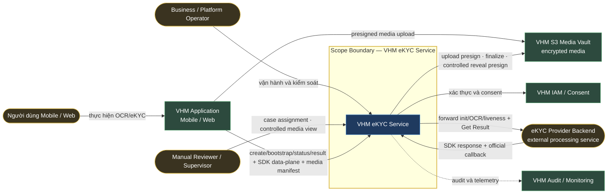
```mermaid
flowchart LR
    USER(["Người dùng Mobile / Web"]):::entity
    OPS(["Business / Platform Operator"]):::entity
    REVIEWER(["Manual Reviewer / Supervisor"]):::entity
    APP["VHM Application<br/>Mobile / Web"]:::owned
    IAM["VHM IAM / Consent"]:::owned
    OBS["VHM Audit / Monitoring"]:::owned
    VAULT["VHM S3 Media Vault<br/>encrypted media"]:::owned
    PROVIDER(["eKYC Provider Backend<br/>external processing service"]):::entity

    subgraph SCOPE["Scope Boundary — VHM eKYC Service"]
        CORE["VHM eKYC Service"]:::bc
    end

    USER -->|thực hiện OCR/eKYC| APP
    OPS -->|vận hành và kiểm soát| CORE
    REVIEWER -->|case assignment · controlled media view| CORE
    APP -->|create/bootstrap/status/result + SDK data-plane + media manifest| CORE
    APP -->|presigned media upload| VAULT
    CORE -->|upload presign · finalize · controlled reveal presign| VAULT
    CORE -->|xác thực và consent| IAM
    CORE -->|forward init/OCR/liveness + Get Result| PROVIDER
    PROVIDER -->|SDK response + official callback| CORE
    CORE -.->|audit và telemetry| OBS

    style SCOPE stroke:#d9b84a,stroke-width:2px
    classDef bc fill:#1f3a5f,stroke:#4a90d9,color:#fff;
    classDef owned fill:#2d4a3e,stroke:#5fb37a,color:#fff;
    classDef entity fill:#3a3320,stroke:#d9b84a,color:#fff;
```

**Chú giải STD-DIAG:** xanh dương = hệ thống trọng tâm; xanh lá = hệ thống VHM
láng giềng/in-scope; vàng = actor hoặc hệ ngoài; nét liền = tương tác đồng bộ;
nét đứt = event/telemetry bất đồng bộ.

| **Tác nhân/Hệ thống** | **Loại** | **Internal** | **External** | **Vai trò** |
| --- | --- | --- | --- | --- |
| Người dùng Mobile/Web | Actor |  | ✓ | Thực hiện hành trình OCR/eKYC qua VHM Application. |
| Business/Platform Operator | Actor |  | ✓ | Theo dõi, hỗ trợ và kiểm soát vận hành theo quyền. |
| Manual Reviewer/Review Supervisor | Actor |  | ✓ | Xử lý case được assign; xem media qua controlled reveal/presigned access và ghi manual decision. |
| VHM eKYC Service | Software System | ✓ |  | Service trung tâm quản lý hành trình, control-plane, data-plane và kết quả eKYC. |
| VHM Application | Software System | ✓ |  | Kênh Mobile/Web khởi chạy SDK và hiển thị kết quả VHM. |
| VHM IAM/Consent | Software System | ✓ |  | Xác thực principal và cung cấp bằng chứng consent. |
| VHM Audit/Monitoring | Software System | ✓ |  | Nhận audit và telemetry đã loại bỏ dữ liệu nhạy cảm. |
| VHM S3 Media Vault | Software System | ✓ |  | Sở hữu media object/lifecycle; không public hoặc lộ raw path, chỉ cấp short-lived URL sau Reveal API. |
| eKYC Provider Backend | External System |  | ✓ | Nhận data-plane từ VHM eKYC Service, xử lý OCR/liveness/face và trả official result. |

### 2.2.2. Context Map / Integration Diagram (L2)

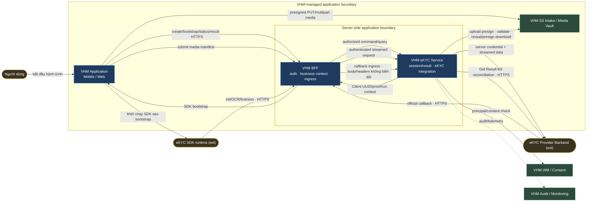
```mermaid
flowchart LR
    USER(["Người dùng"]):::entity
    SDK(["eKYC SDK runtime (ext)"]):::entity
    BACKEND(["eKYC Provider Backend (ext)"]):::entity
    IAM["VHM IAM / Consent"]:::owned
    OBS["VHM Audit / Monitoring"]:::owned

    subgraph SYS["VHM-managed application boundary"]
        APP["VHM Application<br/>Mobile / Web"]:::bc
        S3["VHM S3 Intake / Media Vault"]:::owned
        subgraph VHMBE["Server-side application boundary"]
            BFF["VHM BFF<br/>auth · business context · ingress"]:::bc
            EKYC_SERVICE["VHM eKYC Service<br/>session/result · eKYC integration"]:::bc
        end
    end

    USER -->|bắt đầu hành trình| APP
    APP -->|create/bootstrap/status/result · HTTPS| BFF
    BFF -->|authorized command/query| EKYC_SERVICE
    EKYC_SERVICE -->|Client UUID/proof/run context| BFF
    BFF -->|SDK bootstrap| APP
    APP -->|khởi chạy SDK sau bootstrap| SDK
    APP -->|presigned PUT/multipart media| S3
    APP -->|submit media manifest| BFF
    SDK -->|init/OCR/liveness · HTTPS| BFF
    BFF -->|authenticated streamed request| EKYC_SERVICE
    EKYC_SERVICE -->|server credential + streamed data| BACKEND
    BACKEND -->|official callback · HTTPS| BFF
    BFF -->|callback ingress · body/headers không biến đổi| EKYC_SERVICE
    EKYC_SERVICE -->|Get Result khi reconciliation · HTTPS| BACKEND
    EKYC_SERVICE -->|principal/consent check| IAM
    EKYC_SERVICE -->|upload presign · validate · reveal/presign download| S3
    EKYC_SERVICE -.->|audit/telemetry| OBS

    classDef bc fill:#1f3a5f,stroke:#4a90d9,color:#fff;
    classDef owned fill:#2d4a3e,stroke:#5fb37a,color:#fff;
    classDef entity fill:#3a3320,stroke:#d9b84a,color:#fff;
    style VHMBE stroke:#d9b84a,stroke-width:2px
```

Server-side boundary trong sơ đồ gồm VHM BFF và VHM eKYC Service. VHM BFF xử lý
ingress, identity và business context; VHM eKYC Service sở hữu trạng thái xác minh
và tích hợp/proxy tới eKYC Provider Backend. Cấu trúc module bên trong service
được mô tả riêng tại mục 2.4.

### 2.2.3. Danh sách module và trách nhiệm

| **STT** | **Component/Module** | **Responsibility** | **Data managed/processed** | **Technology** | **Storage** | **External exposure** | **Boundary** |
| --- | --- | --- | --- | --- | --- | --- | --- |
| 1 | **VHM Application (Mobile/Web)** | Consent UX, capability check, create session, SDK lifecycle và VHM result UX | Consent reference, bootstrap và trạng thái UX trong memory | VHM Mobile/Web client + eKYC SDK được pin version | Không lưu dữ liệu eKYC dài hạn | Có — user-facing và gọi VHM API/SDK runtime | Không giữ secret, không tự quyết định `VERIFIED` |
| 2 | **eKYC SDK** | Camera UX, front/back capture, liveness/face data và gọi init/OCR/liveness | Media/data-plane trong SDK flow | Provider SDK package cho Mobile/Web | Theo SDK contract | Có — chỉ gọi VHM BFF sau bootstrap | Không sở hữu trạng thái nghiệp vụ VHM |
| 3 | **VHM BFF** | User/service authentication, business-object authorization, request-size/rate policy và streaming route | Security context, business reference; media transit | VHM BFF standard — version TBD | Không phải system of record | Có — VHM API và SDK ingress | Không map provider payload hoặc quyết định eKYC |
| 4 | **VHM eKYC Service** | System of record và integration/proxy point tới eKYC Provider Backend | Session, policy, state, callback, Canonical Result, media manifest; provider media transit | Java 25, Spring Boot 4.0.4 | PostgreSQL + S3 Media Vault qua dedicated modules | Không public trực tiếp; chỉ qua BFF | Không thực hiện thuật toán OCR/liveness/face |
| 5 | **Verification API** | Validate contract và điều phối use case | Session command/query và canonical response | VHM eKYC Service module | Qua persistence port tới PostgreSQL | Không; qua BFF | Không thực hiện thuật toán OCR/liveness |
| 6 | **Session Manager** | Active guard, state machine, expiry, retry chain và optimistic locking | Verification session/run/state/history | VHM eKYC Service domain/application module | PostgreSQL | Không | Không phụ thuộc raw SDK payload |
| 7 | **Provider Adapter** | Stream init/OCR/liveness, inject server credential, Get Result và translate error | Media transient, provider reference/config và response tạm thời | VHM eKYC Service outbound adapter, streaming HTTP client, Resilience4j | Không | Có — outbound tới eKYC Provider Backend | Không áp business rule domain |
| 8 | **Callback Inbox** | Authenticate, durable receive, dedupe và xử lý callback | Encrypted minimal callback payload, hash và processing state | Callback API/worker của VHM eKYC Service | PostgreSQL encrypted inbox; payload processed `24h`, failed/quarantine `7d` | Không; callback qua BFF | Không lưu media hoặc raw payload dài hạn |
| 9 | **Result Normalizer** | Ánh xạ provider result sang Canonical Result | Fixed OCR fields, canonical checks/warnings | VHM eKYC Service application module | PostgreSQL qua persistence port | Không | Không cập nhật business object |
| 10 | **Decision Mapper** | Ánh xạ canonical checks theo fixed policy version | Decision, outcome, reason và policy version | VHM eKYC Service domain policy | PostgreSQL check/result/history | Không | Không hard-code threshold chưa phê duyệt |
| 11 | **Reconciliation Job** | Khôi phục callback thất lạc/session treo bằng bounded polling | Due schedule, recovery attempt và official result | VHM eKYC Service scheduler/worker, Resilience4j | PostgreSQL | Có — outbound Get Result | Không polling mọi session liên tục |
| 12 | **Result API** | Trả fixed Canonical Result với authorization, masking và audit | Authorized masked result projection | VHM eKYC Service module | PostgreSQL | Không; qua BFF | Không trả raw provider response/resource URL |
| 13 | **PostgreSQL** | System of record cho VHM eKYC Service | Session, run, check, field, inbox, result và history | Amazon RDS PostgreSQL 17 Multi-AZ | Encrypted RDS/PITR | Không — private data subnet | Không lưu binary media SDK flow |
| 14 | **Media Upload API** | Tạo upload session và exact presigned PUT/multipart request | Media ID/type/size/checksum, object key reference và upload state | VHM eKYC Service module + AWS SDK | PostgreSQL metadata; không nhận media body | Không; qua BFF | Không nhận arbitrary bucket/key/URL từ client |
| 15 | **S3 Intake** | Nhận media trực tiếp từ client bằng presigned request | Document/direct-face/liveness media tạm thời, SSE-KMS | Amazon S3 | Private intake bucket/prefix + lifecycle | Chỉ exact presigned write; không có client read | Không phải nguồn manual-review cuối cùng |
| 16 | **Media Upload Finalizer / Media Vault** | Verify object metadata/checksum, seal immutable manifest và AES-GCM-encrypt S3 reference/path | Media object, encrypted reference, checksum/object version và retention metadata | Worker + application crypto/KMS + Amazon S3 | Private SSE-KMS Media Vault | Không public; workload IAM only | Chỉ finalize client presigned upload; không sync từ provider; không log plaintext path |
| 17 | **Manual Review Reveal API** | Platform-role/assignment-scoped list encrypted refs và bind/decrypt selected refs | Verification/run/business scope, case/reason/step-up context, encrypted media refs, types/logical parts/poses và reveal request | VHM eKYC Service module | PostgreSQL + append-only `audit_logs` | Chỉ approved review role qua operations ingress | GET/POST theo `REVIEW-01`; no cross-verification/cross-business-object reveal |
| 18 | **Private File Service / PresignUrlCache** | Chuẩn bị short-lived download URL sau successful binding | Internal decrypted S3 path transiently, Caffeine L1/Redisson L2 cache entry và presigned URL | `FilePrivateServiceClient`, Caffeine, Redisson, Amazon S3 | Cache TTL nhỏ hơn URL validity; không source of truth | URL chỉ trả từ POST reveal | Cache failure fallback direct presign; không log path/URL/ciphertext |

### 2.2.4. Luồng dữ liệu OCR/eKYC

Mobile/Web luôn gọi VHM BFF để tạo phiên trước. Sau khi nhận Client UUID/proof và
run context, eKYC SDK gửi init/OCR/liveness qua BFF; BFF stream xuống VHM eKYC Service và VHM eKYC Service
gắn server credential trước khi gọi eKYC Provider Backend.

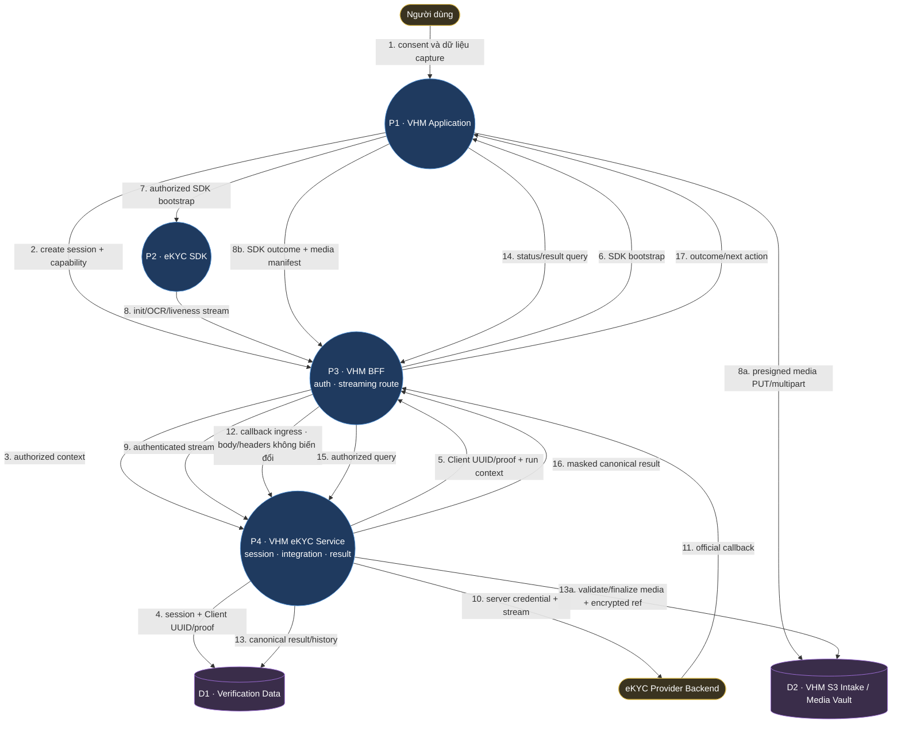
```mermaid
flowchart TB
    USER(["Người dùng"]):::entity
    BACKEND(["eKYC Provider Backend"]):::entity
    APP(("P1 · VHM Application")):::process
    SDK(("P2 · eKYC SDK")):::process
    BFF(("P3 · VHM BFF<br/>auth · streaming route")):::process
    EKYC_SERVICE(("P4 · VHM eKYC Service<br/>session · integration · result")):::process
    DB[("D1 · Verification Data")]:::datastore
    S3[("D2 · VHM S3 Intake / Media Vault")]:::datastore

    USER -->|"1. consent và dữ liệu capture"| APP
    APP -->|"2. create session + capability"| BFF
    BFF -->|"3. authorized context"| EKYC_SERVICE
    EKYC_SERVICE -->|"4. session + Client UUID/proof"| DB
    EKYC_SERVICE -->|"5. Client UUID/proof + run context"| BFF
    BFF -->|"6. SDK bootstrap"| APP
    APP -->|"7. authorized SDK bootstrap"| SDK
    SDK -->|"8. init/OCR/liveness stream"| BFF
    APP -->|"8a. presigned media PUT/multipart"| S3
    APP -->|"8b. SDK outcome + media manifest"| BFF
    BFF -->|"9. authenticated stream"| EKYC_SERVICE
    EKYC_SERVICE -->|"10. server credential + stream"| BACKEND
    BACKEND -->|"11. official callback"| BFF
    BFF -->|"12. callback ingress · body/headers không biến đổi"| EKYC_SERVICE
    EKYC_SERVICE -->|"13. canonical result/history"| DB
    EKYC_SERVICE -->|"13a. validate/finalize media + encrypted ref"| S3
    APP -->|"14. status/result query"| BFF
    BFF -->|"15. authorized query"| EKYC_SERVICE
    EKYC_SERVICE -->|"16. masked canonical result"| BFF
    BFF -->|"17. outcome/next action"| APP

    classDef entity fill:#3a3320,stroke:#d9b84a,color:#fff;
    classDef process fill:#1f3a5f,stroke:#4a90d9,color:#fff;
    classDef datastore fill:#3a2d4a,stroke:#a06fd9,color:#fff;
```

Đây là DFD L2: mũi tên chỉ biểu diễn dữ liệu từ producer tới nơi nhận, không biểu
diễn thứ tự thực thi. Trình tự thời gian được mô tả tại mục 5.2.

Luồng này phải tuân thủ `DP-01`, `MEDIA-01`, `MEDIA-STORE-01`, `CRED-01`,
`RESULT-01`, `DATA-01`, `REVIEW-01` và `RETRY-01`. Network allowlist, TLS, SDK integrity, data location, retention,
subprocessor và incident handling là các gate được chi tiết tại mục 7 và Appendix A.

### 2.2.5. Trust Boundary

| **Boundary** | **Luồng** | **Mức tin cậy** | **Kiểm soát bắt buộc** |
| --- | --- | --- | --- |
| Mobile/Web/eKYC SDK → VHM BFF | Control API và SDK data-plane | Untrusted ingress | JWT/session token, object authorization, rate/body-size limit |
| Mobile/Web → VHM S3 Intake | Exact presigned PUT/multipart upload | Untrusted media ingress | Short expiry, exact key/method, size/MIME/checksum, no read/list, TLS và orphan lifecycle |
| VHM BFF → VHM eKYC Service | Authorized control request hoặc media stream | Internal Zero Trust | Workload identity, session/run binding, timeout |
| VHM eKYC Service → eKYC Provider Backend | Init/OCR/liveness và reconciliation | External dependency | TLS, destination allowlist, circuit breaker |
| eKYC Provider Backend → VHM BFF → VHM eKYC Service | Official callback | External server | WAF, token authentication, schema/replay/dedupe |
| VHM eKYC Service → VHM Application qua BFF | Result API | Zero Trust | User/session identity, object scope, fixed schema, masking |
| VHM eKYC Service → PostgreSQL | Restricted storage | Restricted | Private subnet, IAM, encryption, least privilege; cấm media |
| Media Upload Finalizer/Private File Service → VHM S3/KMS | Finalize object/encrypted reference hoặc prepare short-lived download | Restricted sensitive storage | Workload IAM, private endpoint, AES-GCM/KMS, no path/URL log và audit |
| Manual Review Operator/Supervisor → Reveal API | List encrypted refs và reveal selected media | Privileged Zero Trust | Platform role + assignment/business-object scope; bind every ciphertext, cap/dedupe, short URL validity và PII-safe append-only audit |

#### Security / Zero-Trust Architecture (L2)

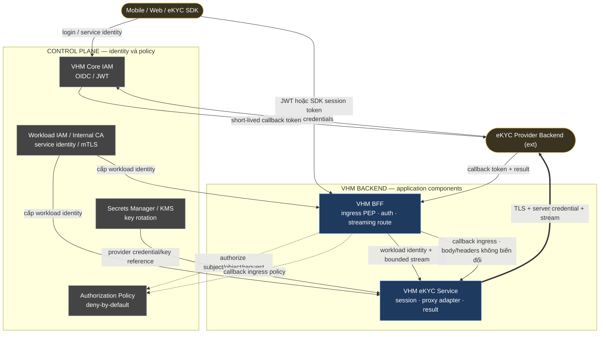
```mermaid
flowchart TB
    CALLER(["Mobile / Web / eKYC SDK"]):::entity
    BACKEND(["eKYC Provider Backend (ext)"]):::entity

    subgraph CP["CONTROL PLANE — identity và policy"]
        IDP["VHM Core IAM<br/>OIDC / JWT"]:::infra
        WID["Workload IAM / Internal CA<br/>service identity / mTLS"]:::infra
        PDP["Authorization Policy<br/>deny-by-default"]:::infra
        KEY["Secrets Manager / KMS<br/>key rotation"]:::infra
    end

    subgraph DP["VHM BACKEND — application components"]
        BFF["VHM BFF<br/>ingress PEP · auth · streaming route"]:::bc
        EKYC_SERVICE["VHM eKYC Service<br/>session · proxy adapter · result"]:::bc
    end

    CALLER -->|login / service identity| IDP
    BACKEND -->|OAuth2 client credentials| IDP
    IDP -->|short-lived callback token| BACKEND
    CALLER -->|JWT hoặc SDK session token| BFF
    BFF -.->|authorize subject/object/request| PDP
    BFF -->|workload identity + bounded stream| EKYC_SERVICE
    WID -->|cấp workload identity| BFF
    WID -->|cấp workload identity| EKYC_SERVICE
    KEY -->|provider credential/key reference| EKYC_SERVICE
    EKYC_SERVICE ==>|TLS + server credential + stream| BACKEND
    BACKEND -->|callback token + result| BFF
    BFF -.->|callback ingress policy| PDP
    BFF -->|callback ingress · body/headers không biến đổi| EKYC_SERVICE

    classDef bc fill:#1f3a5f,stroke:#4a90d9,color:#fff;
    classDef entity fill:#3a3320,stroke:#d9b84a,color:#fff;
    classDef infra fill:#444,stroke:#aaa,color:#fff;
```

Caller identity, workload identity và object-level authorization là các kiểm tra
độc lập. Với callback, BFF chỉ áp chính sách ingress và route body/header; VHM eKYC Service sở
hữu authentication, binding, replay/dedupe và durable inbox.

### 2.2.6. Journey Policy Model

| **Journey** | **Step bắt buộc** | **Kết quả Platform** | **Quy tắc sử dụng** |
| --- | --- | --- | --- |
| `OCR_ONLY` | `OCR_DOCUMENT` | OCR fields, quality/warning và `ekycOutcome=NOT_PERFORMED` | Không được diễn giải là đã xác minh danh tính |
| `FULL_EKYC` | OCR front/back → liveness → face matching | OCR fields + eKYC decision + identity reference | Bắt buộc liveness; không silent downgrade khi thiếu capability |

Backend chỉ chấp nhận `OCR_ONLY` hoặc `FULL_EKYC`, document type
`NATIONAL_ID_CHIP` và channel `MOBILE_APP`/`WEB_APP`. Journey được resolve từ use
case đã được phê duyệt; client không được tự đổi flow.

### 2.2.7. Channel Capability Matrix

| **Capability** | **Mobile** | **Web** | **Quy tắc** |
| --- | --- | --- | --- |
| Camera OCR | SDK kiểm tra permission và chất lượng capture | SDK kiểm tra camera permission và chất lượng capture | Phải pass trước khi start |
| Document sides | Front và back trong cùng SDK run/attempt | Front và back trong cùng SDK run/attempt | Một mặt fail thì whole attempt fail |
| Liveness | SDK hướng dẫn/thu thập trong `FULL_EKYC` | SDK hướng dẫn/thu thập trong `FULL_EKYC` | eKYC Provider Backend xử lý sâu; thiếu capability trả `CHANNEL_CAPABILITY_REQUIRED` |
| Face matching | Qua eKYC Provider Backend | Qua eKYC Provider Backend | Chỉ official result được dùng cho decision |
| Resume | Query backend status trước khi resume | Query backend status sau refresh/reopen | Không lưu VHM SDK session token dài hạn; unsupported resume chuyển retry |

### 2.2.8. Thông tin dữ liệu

| **Loại dữ liệu** | **Ví dụ** | **Phân loại** | **Quy tắc lưu trữ** | **Bảo mật/Logic** |
| --- | --- | --- | --- | --- |
| Internal session | `verificationId`, domain, purpose | Internal | PostgreSQL | UUID random; domain/object isolation |
| Business references | `businessRef`, `subjectRef` | Personal-reference | PostgreSQL | Opaque; không nhúng PII |
| Provider correlation | `verificationId` truyền dưới dạng Client UUID; `providerSessionId` nếu có | Internal | PostgreSQL | Client UUID do VHM sở hữu; provider session chỉ là optional external reference |
| State/timestamps | status, attempts, expiry | Internal | PostgreSQL | Guard + optimistic lock + append-only history |
| OCR fields | document number, name, DOB, address | Personal data | Field-level encrypted; chỉ bộ field cố định đã phê duyệt | Mask theo Result API contract |
| Confidence/warnings | score, reason code | Sensitive inference | Check table/JSONB | Versioned mapping, hạn chế UI |
| Liveness/face result | status, score | Biometric-related sensitive | Status/score tối thiểu trong PostgreSQL | Media liên quan lưu tách biệt trong encrypted Media Vault; không tạo face template |
| Media manifest | `mediaId`, type, size, checksum, object version, provenance, upload/finalize state | Sensitive metadata | PostgreSQL; không chứa raw S3 URL | Bind `verificationId/runId`, idempotent và immutable sau `READY` |
| Document/direct-face/liveness media | Front/back document, direct-face image, liveness video/frame | Sensitive/biometric | Private S3 Media Vault dùng SSE-KMS; Intake chỉ tạm thời | Chỉ short-lived presigned download sau `REVIEW-01`; không public/list/log |
| Storage reference | Opaque `mediaId` và AES-GCM-encrypted S3 object reference/path | Sensitive | Persist encrypted trong PostgreSQL; plaintext path chỉ transient trong reveal service | GET list trả encrypted ref; audit không ghi ciphertext/path/URL |
| Callback payload | Payload tối thiểu phục vụ normalize | Sensitive | Mã hóa trong Callback Inbox; processed `24h`, failed/quarantine `7d` | Không log; không lưu vào result/history |
| Consent | purpose/version/time | Personal/compliance | Consent system + reference | Purpose-bound, audit được |
| Credential/token | Provider API key, callback client secret, VHM SDK token-signing key | Secret | VHM Secret Manager/IAM; workload memory khi sử dụng | Không DB/log/client binary |

## 2.3. Session Configuration

### 2.3.1. User Authentication Session

- Do IAM/BFF quản lý qua OIDC/JWT.
- VHM eKYC Service không tự quản lý login session; VHM BFF xác thực
  user/service và truyền authorized context bằng workload identity.
- Backend phải xác minh user/service có quyền với `businessRef` trước mọi mutation/read.

### 2.3.2. Verification Session

| **Thuộc tính** | **Baseline** |
| --- | --- |
| Internal ID | `verificationId` UUIDv7 do VHM sinh |
| External correlation | `verificationId` dùng làm Client UUID; `providerSessionId` optional, unique theo provider/environment khi có |
| Active uniqueness | Một session active trên `(domain, useCase, businessRef, subjectRef, purpose, journey)` |
| Idempotency | `Idempotency-Key` bắt buộc khi create/retry, create upload session và submit media manifest |
| Timeout | Theo approved journey/session policy; backend và SDK config dùng cùng versioned policy |
| Retry | Tạo session mới, link `retryOfVerificationId`; không reuse external session |
| Resume | Chỉ khi SDK contract hỗ trợ; backend không giả định resume |
| Client completion | `SUBMITTED` chỉ sau khi backend accept SDK outcome + complete media manifest cho pass/fail; không phải verified |
| Media completion | Mọi mandatory media đạt `READY` sau validate/checksum, private S3 persistence và AES-GCM sealing của object reference |
| Provider completion | Callback hợp lệ; Get Result chỉ hoàn tất qua reconciliation fallback |
| Business completion | Sau official result processing + mandatory media `READY` + fixed decision mapping trong finalization guard |
| Channel | `MOBILE_APP` hoặc `WEB_APP`; ghi nhận tại session/run |
| Capability | Camera/liveness capability là client hint; backend validate theo Mobile/Web compatibility policy |

### 2.3.3. Verification Session State Machine (L2 optional)

Đây là state machine chi tiết của một thực thể `IdentityVerification`. Các state
đều là trạng thái bền được lưu trong PostgreSQL; bảng transition ngay dưới sơ đồ
là path mapping bắt buộc cho các sequence tại mục 5.2.

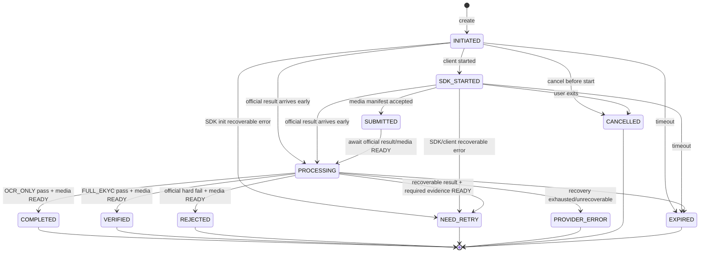
```mermaid
stateDiagram-v2
    [*] --> INITIATED: create
    INITIATED --> SDK_STARTED: client started
    INITIATED --> CANCELLED: cancel before start
    INITIATED --> EXPIRED: timeout
    INITIATED --> NEED_RETRY: SDK init recoverable error
    INITIATED --> PROCESSING: official result arrives early

    SDK_STARTED --> SUBMITTED: media manifest accepted
    SDK_STARTED --> CANCELLED: user exits
    SDK_STARTED --> NEED_RETRY: SDK/client recoverable error
    SDK_STARTED --> EXPIRED: timeout
    SDK_STARTED --> PROCESSING: official result arrives early

    SUBMITTED --> PROCESSING: await official result/media READY
    PROCESSING --> COMPLETED: OCR_ONLY pass + media READY
    PROCESSING --> VERIFIED: FULL_EKYC pass + media READY
    PROCESSING --> REJECTED: official hard fail + media READY
    PROCESSING --> NEED_RETRY: recoverable result + required evidence READY
    PROCESSING --> PROVIDER_ERROR: recovery exhausted/unrecoverable
    PROCESSING --> EXPIRED

    COMPLETED --> [*]
    VERIFIED --> [*]
    REJECTED --> [*]
    NEED_RETRY --> [*]
    PROVIDER_ERROR --> [*]
    CANCELLED --> [*]
    EXPIRED --> [*]
```

### 2.3.4. State Transition Guard

| **From** | **To** | **Điều kiện** | **Tác động** |
| --- | --- | --- | --- |
| INITIATED | SDK_STARTED | Chưa expire; caller đúng owner; bootstrap hợp lệ | Ghi startedAt/channel/app/sdk version |
| SDK_STARTED/PROCESSING | SUBMITTED/PROCESSING | Client submit idempotent; external reference match; manifest chỉ chứa server-issued `mediaId`; mọi required object đã upload | Ghi `submittedAt/sdkOutcome`, upsert manifest; không cập nhật official decision; callback đến trước vẫn nhận submit |
| SUBMITTED | PROCESSING | Official result hoặc media finalization chưa đủ điều kiện terminal | Lập reconciliation/finalization schedule |
| INITIATED/SDK_STARTED/SUBMITTED/PROCESSING | COMPLETED | `OCR_ONLY` official result pass và mandatory media `READY` | Persist result/history; không diễn giải là đã xác minh danh tính |
| INITIATED/SDK_STARTED/SUBMITTED/PROCESSING | VERIFIED | `FULL_EKYC` official result hợp lệ + policy pass và mandatory media `READY` | Persist result/history; chấp nhận callback đến trước client submit nhưng không bỏ qua manifest |
| INITIATED/SDK_STARTED/SUBMITTED/PROCESSING | REJECTED | Hard fail theo approved policy và required evidence `READY` | Lưu canonical reasons; không nhầm timeout |
| INITIATED/SDK_STARTED/SUBMITTED/PROCESSING | NEED_RETRY | Recoverable quality/user error; media requirements theo failure class đã đạt | Đóng attempt; cho tạo session mới nếu còn quota |
| PROCESSING | PROVIDER_ERROR | Hết reconciliation budget hoặc lỗi tích hợp không retryable | Đóng attempt; trả support/retry action theo policy |
| Any non-terminal | EXPIRED | `expiresAt < now`, chưa final | History + retry eligibility |
| Terminal | Any business state | Không cho chuyển ngược | Callback trễ chỉ audit; duplicate submit trả manifest hiện hữu, không ghi đè media/result |

Business state không thay thế các milestone trực giao `mediaStatus`,
`officialResultStatus` và `reviewStatus`. Finalization guard phải đọc và cập nhật
các milestone này trong cùng transaction ngắn; client không được tự khai báo
`mediaStatus=READY` hoặc official outcome.

## 2.4. Data Model

### 2.4.1. Logical Data Ownership (L2)

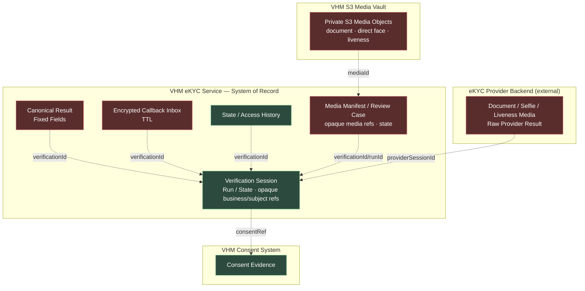
```mermaid
flowchart TB
    subgraph CONSENT["VHM Consent System"]
        CONSENT_DATA["Consent Evidence"]:::owned
    end
    subgraph EKYC_SERVICE["VHM eKYC Service — System of Record"]
        SESSION["Verification Session<br/>Run / State · opaque business/subject refs"]:::owned
        RESULT["Canonical Result<br/>Fixed Fields"]:::sensitive
        INBOX["Encrypted Callback Inbox<br/>TTL"]:::sensitive
        MANIFEST["Media Manifest / Review Case<br/>opaque media refs · state"]:::sensitive
        HISTORY["State / Access History"]:::owned
    end
    subgraph MEDIA_VAULT["VHM S3 Media Vault"]
        MEDIA["Private S3 Media Objects<br/>document · direct face · liveness"]:::sensitive
    end
    subgraph PROVIDER["eKYC Provider Backend (external)"]
        PROVIDER_DATA["Document / Selfie / Liveness Media<br/>Raw Provider Result"]:::sensitive
    end

    SESSION -.->|"consentRef"| CONSENT_DATA
    RESULT -.->|"verificationId"| SESSION
    INBOX -.->|"verificationId"| SESSION
    HISTORY -.->|"verificationId"| SESSION
    MANIFEST -.->|"verificationId/runId"| SESSION
    MEDIA -.->|"mediaId"| MANIFEST
    PROVIDER_DATA -.->|"providerSessionId"| SESSION

    classDef owned fill:#2d4a3e,stroke:#5fb37a,color:#fff;
    classDef sensitive fill:#5a2d2d,stroke:#d96f6f,color:#fff;
```

| **Chủ sở hữu/System of Record** | **Dữ liệu sở hữu** | **Năng lực lưu trữ** | **Đặc tính bắt buộc** |
| --- | --- | --- | --- |
| VHM Consent System | Consent evidence | Consent-owned storage | Platform lưu reference/version/time phục vụ audit. |
| VHM eKYC Service | Session, run, state, Canonical Result, media manifest/review case, inbox và history | PostgreSQL + encrypted inbox TTL | Transactional, idempotent, masking, retention và audit. |
| VHM S3 Media Vault | Purpose-approved document/direct-face/liveness media objects | Private S3 + SSE-KMS; AES-GCM-encrypted object reference lưu tại PostgreSQL | VHM-owned; no public access/raw path; controlled reveal/presign, policy lifecycle và purge evidence. |
| eKYC Provider Backend | Media SDK processing copy và raw provider result | Provider-managed storage | Provider retention/deletion vẫn theo hợp đồng; không phải source phục hồi media VHM trong happy path. |

`businessRef/subjectRef` là opaque context đã được BFF authorize trước khi gửi VHM eKYC Service;
VHM eKYC Service chỉ lưu reference trong session và không tạo FK vật lý tới dữ liệu nghiệp vụ.
Các cạnh nét đứt là tham chiếu logic bằng ID, không phải FK vật lý xuyên system.

### 2.4.2. Logical ERD (L2)

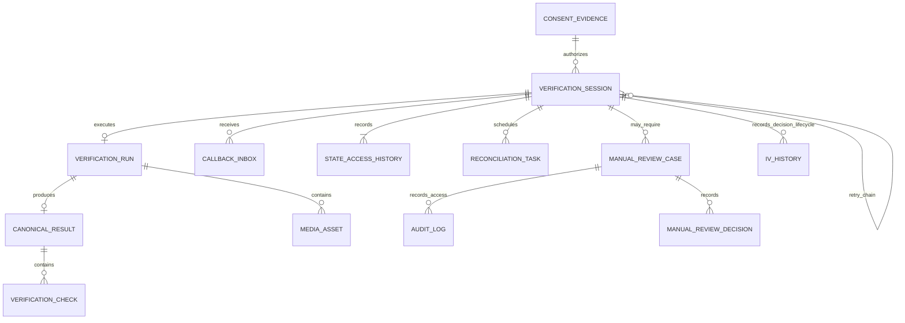
```mermaid
erDiagram
    CONSENT_EVIDENCE ||--o{ VERIFICATION_SESSION : authorizes
    VERIFICATION_SESSION o|--o{ VERIFICATION_SESSION : retry_chain
    VERIFICATION_SESSION ||--o| VERIFICATION_RUN : executes
    VERIFICATION_SESSION ||--o{ CALLBACK_INBOX : receives
    VERIFICATION_SESSION ||--|{ STATE_ACCESS_HISTORY : records
    VERIFICATION_SESSION ||--o{ RECONCILIATION_TASK : schedules
    VERIFICATION_RUN ||--o| CANONICAL_RESULT : produces
    CANONICAL_RESULT ||--o{ VERIFICATION_CHECK : contains
    VERIFICATION_RUN ||--o{ MEDIA_ASSET : contains
    VERIFICATION_SESSION ||--o{ MANUAL_REVIEW_CASE : may_require
    MANUAL_REVIEW_CASE ||--o{ AUDIT_LOG : records_access
    MANUAL_REVIEW_CASE ||--o{ MANUAL_REVIEW_DECISION : records
    VERIFICATION_SESSION ||--o{ IV_HISTORY : records_decision_lifecycle
```

| **Logical entity** | **Vai trò trong mô hình** | **Cardinality/invariant chính** |
| --- | --- | --- |
| `CONSENT_EVIDENCE` | Bằng chứng consent do VHM Consent System sở hữu | Một consent có thể authorize nhiều session; VHM eKYC Service chỉ lưu logical reference |
| `VERIFICATION_SESSION` | Aggregate root cho một attempt OCR/eKYC | Một session có tối đa một active run; whole-attempt retry tạo session mới và nối retry chain |
| `VERIFICATION_RUN` | Vòng chạy SDK gắn với session | Chỉ được tạo khi session bắt đầu; không dùng lại cho retry session mới |
| `CALLBACK_INBOX` | Durable ingress cho official callback | Một session có thể nhận nhiều event do retry/duplicate/out-of-order; xử lý phải idempotent |
| `CANONICAL_RESULT` | Kết quả chuẩn hóa của một run | Tối đa một official result hiện hành; terminal result không bị client/callback trễ đảo ngược |
| `VERIFICATION_CHECK` | Kết quả document, liveness, face match và quality check đã chuẩn hóa | Thuộc Canonical Result; không chứa media hoặc raw provider payload |
| `MEDIA_ASSET` | Manifest và lifecycle của một document/direct-face/liveness object | Unique trên `(runId, mediaType, logicalPart)`; lưu checksum, object version, AES-GCM-encrypted reference, retention metadata và state; không lưu binary/plaintext path trong DB |
| `MANUAL_REVIEW_CASE` | Case purpose-bound được assign cho reviewer | Không tự cấp quyền media; assignment và case state được revalidate mỗi request |
| `MANUAL_REVIEW_DECISION` | Quyết định hậu kiểm và lý do | Append-only; không sửa provider official result; override cần policy/approval riêng |
| `AUDIT_LOG` | Access audit cho list/reveal media | Append-only `VIEW_IDENTITY_MEDIA`/`REVEAL_IDENTITY_MEDIA`, entity `IDENTITY_VERIFICATION`, `verificationId`, actor/role, case/purpose/reason/step-up context, request/outcome/time và media types/logical parts/poses/count; không chứa ciphertext/path/URL/PII |
| `IV_HISTORY` | Decision lifecycle của verification | Lưu verified/auto-failed/manual decision events; tách khỏi media access audit |
| `STATE_ACCESS_HISTORY` | Lịch sử state transition và truy cập có audit | Append-only; một session có một hoặc nhiều record lịch sử |
| `RECONCILIATION_TASK` | Lịch khôi phục result khi callback quá SLA/session treo | Có thể có nhiều lần chạy bounded; không polling liên tục |

ERD biểu diễn quan hệ logic và invariant giữa các entity. Binary media không nằm
trong PostgreSQL: `MEDIA_ASSET` chỉ giữ manifest/AES-GCM-encrypted object reference,
còn object nằm trong private VHM Media Vault. Raw provider payload không được dùng thay
media manifest hoặc lưu dài hạn.

## 2.5. Concurrency, Idempotency và Transaction

### 2.5.1. Tạo phiên đồng thời

Rủi ro: double-click/client retry tạo hai session.

Kiểm soát:

- `Idempotency-Key` bắt buộc.
- Lưu request fingerprint; cùng key khác body trả conflict.
- Partial unique active index.
- Nếu cùng idempotency và fingerprint, trả session hiện hữu.

### 2.5.2. Callback đồng thời/trùng lặp

- Insert inbox với unique event/payload key.
- Request thắng insert thực hiện durable receive.
- Duplicate `PROCESSED/PROCESSING` trả 2xx để tránh retry storm.

### 2.5.3. Client submit và callback cùng chạy

- Upload S3 hoàn tất ngoài DB transaction; presigned request không giữ session lock.
- `POST submit` chỉ nhận server-issued `mediaId` và manifest fingerprint, kiểm tra
  ownership/run, object metadata/checksum và idempotency trước khi upsert manifest.
- Callback ingress chỉ durable-insert vào inbox. Client submit không chờ callback;
  callback HTTP request không chờ media upload/finalization.
- Submit handler, Callback Worker và Reconciliation Worker cùng gọi
  `evaluateFinalization()` trong transaction ngắn và khóa cùng verification row
  bằng bounded `SELECT ... FOR UPDATE` hoặc compare-and-set `rowVersion`.
- Hai nguồn sở hữu cột khác nhau: submit cập nhật SDK outcome/media milestone;
  official-result processor cập nhật provider result/checks. Không dùng last-write-wins.
- Callback đến trước được persist ở `officialResultStatus=PROCESSED` nhưng chưa
  expose terminal outcome cho tới khi mandatory media `READY`. Submit đến sau
  vẫn được accept và không bị coi là late event chỉ để audit.
- Unique constraint cho submit fingerprint, media logical part và official result
  ngăn duplicate; cùng idempotency key khác manifest trả conflict.

### 2.5.4. Callback và reconciliation cùng chạy

- Cả hai gọi chung `processOfficialResult()`.
- Callback HTTP request chỉ authenticate, dedupe và durable-insert inbox; không
  giữ session row lock trong request thread trước khi trả 2xx.
- Callback Worker và Reconciliation Worker khóa session bằng
  `SELECT ... FOR UPDATE` trong transaction ngắn; API mutation thông thường dùng
  optimistic `rowVersion`.
- Nếu terminal, chỉ append audit duplicate/late source, không finalize lần hai.

| **Kiểm soát đồng thời** | **Baseline bắt buộc** |
| --- | --- |
| Session row lock | Dùng bounded lock timeout theo approved DB performance baseline; không chờ vô hạn |
| Transaction query budget | Dùng bounded statement/transaction timeout; transaction không gọi network/external dependency |
| Lock timeout/deadlock | Rollback toàn bộ; không đổi session/result; inbox vẫn ở trạng thái retryable |
| Worker retry | Bounded retry với exponential backoff + jitter theo approved worker policy; sau đó chuyển delayed retry/reconciliation, không spin |
| Callback acknowledgement | Chỉ phụ thuộc durable inbox, không chờ normalize/finalize; phải nằm trong provider callback timeout với safety margin |
| Metrics/alert | `db_lock_wait_seconds`, `db_lock_timeout_total`, `official_result_retry_total`, inbox oldest age |

Giá trị lock/statement timeout và retry schedule phải được chốt bằng lock/load test
và approved DB/Operations baseline. Không được
tăng timeout để che transaction dài hoặc network call nằm sai transaction boundary.

### 2.5.5. Transaction boundary

Trong local transaction xử lý client submit:

1. Upsert idempotent media manifest/internal object references.
2. Chuyển media/submission milestone hợp lệ.
3. Evaluate finalization guard trên official result hiện có.
4. Append state/audit history.

Trong local transaction xử lý official result:

1. Upsert verification checks.
2. Lưu normalized fields được phép.
3. Chuyển official-result milestone và evaluate finalization guard với media state.
4. Append history.

Không gọi S3, KMS, eKYC Provider Backend hoặc dependency ngoài transaction
boundary bên trong DB transaction. Media Upload Finalizer thực hiện I/O trước, sau đó
commit `mediaStatus=READY` và gọi lại `evaluateFinalization()` trong transaction ngắn.

# **3. Functional Requirements**

## 3.1. VHM eKYC Service

| **STT** | **Nhóm chức năng** | **Mô tả** |
| --- | --- | --- |
| 1 | **Core Configuration** | Quản lý domain/use case, owner, hai journey đã duyệt, một document type, quota và fixed decision policy version. |
| 2 | **Consent Guard** | Kiểm tra consent đúng subject, purpose, version, channel và thời hạn trước khi tạo phiên. |
| 3 | **Khởi tạo phiên** | Tạo `verificationId`/Client UUID, integrity proof, active-session guard, expiry và VHM SDK session token; hỗ trợ `Idempotency-Key`. |
| 4 | **Capability Preflight** | Kiểm tra camera, permission, Mobile/Web SDK compatibility và liveness capability trước khi start. |
| 5 | **Mobile/Web SDK Integration** | Quản lý permission, client lifecycle, SDK started/submitted/error, resume và security signal trên hai kênh. |
| 6 | **OCR giấy tờ** | SDK thu nhận front/back; VHM eKYC Service chuẩn hóa field, confidence, quality và warning từ kết quả server-to-server. |
| 7 | **Liveness** | SDK hướng dẫn/thu thập trong `FULL_EKYC`; eKYC Provider Backend xử lý và VHM eKYC Service chuẩn hóa outcome. |
| 8 | **Face Matching** | Chuẩn hóa match result/score/reason; không dùng score đơn lẻ khi threshold chưa được duyệt. |
| 9 | **Callback Reception** | Endpoint server-to-server, authentication, timestamp/replay guard, schema/body limit, durable inbox và dedupe. |
| 10 | **Reconciliation/Get Result** | Khôi phục callback quá SLA/session treo với bounded batch, backoff và circuit breaker. |
| 11 | **Result Normalization** | Chuyển payload eKYC Provider Backend thành Canonical Result, tolerant với optional/new fields và strict với critical fields. |
| 12 | **Decision Mapping** | Ánh xạ canonical checks thành `COMPLETED/VERIFIED/REJECTED/NEED_RETRY/PROVIDER_ERROR`; lưu policy version. |
| 13 | **Result API** | Trả Canonical Result với bộ field cố định đã phê duyệt; authorize, mask và audit quyền truy cập. |
| 14 | **Retry Chain** | Tạo whole attempt mới với external session mới; giữ liên kết, reason và attempt count. |
| 15 | **Expiry Management** | Expire session/run theo policy; xử lý callback trễ và grace reconciliation có audit. |
| 16 | **Audit & Traceability** | Lưu state history, result source, config/policy version, actor và access/unmask audit. |
| 17 | **Operations** | Search theo internal reference, reprocess callback inbox và tạm dừng create khi dependency incident. |
| 18 | **Monitoring & Cost Control** | Funnel, latency, error taxonomy, callback/reconcile backlog, quota, attempt và estimated cost. |
| 19 | **Presigned Media Upload** | Tạo exact upload session/URL, bind run/type/size/checksum, hỗ trợ multipart video, submit manifest và orphan cleanup. |
| 20 | **Media Finalization** | Validate uploaded object, persist private S3 media, AES-GCM-encrypt object reference, quản lý lifecycle/retention và phát media-ready event. |
| 21 | **Manual Review Reveal** | Platform-role/assignment-scoped list encrypted refs; POST reveal yêu cầu case/reason/recent step-up, bounded decrypt request, verification/run binding, presigned URL preparation và append-only access audit. |
| 22 | **Manual Decision** | Lưu manual decision/override tách khỏi provider result và ghi decision lifecycle vào `iv_histories`. |

## 3.2. Business Rules tổng quát

| **Rule ID** | **Quy tắc** |
| --- | --- |
| BR-001 | Một `(domain, useCase, businessRef, subjectRef, purpose, journey)` chỉ có tối đa một session active. |
| BR-002 | `verificationId` do VHM sinh, unique, không chứa PII và không tái sử dụng. |
| BR-003 | External session ID không được dùng làm public/internal primary key. |
| BR-004 | Kết quả client/SDK phía Mobile/Web không được chuyển trực tiếp thành `COMPLETED`, `VERIFIED` hoặc `REJECTED`. |
| BR-005 | Nguồn hoàn tất session tuân thủ `RESULT-01`. |
| BR-006 | `OCR_ONLY` thành công chuyển `COMPLETED`, có `ekycOutcome=NOT_PERFORMED` và không được hiển thị là đã xác minh danh tính. |
| BR-007 | Chỉ `FULL_EKYC` pass mới chuyển `VERIFIED`. |
| BR-008 | Callback trùng không được cập nhật state, result, history hoặc side effect lần hai. |
| BR-009 | Timeout/network/eKYC Provider Backend unavailable giữ `PROCESSING` trong recovery budget; hết budget mới thành `PROVIDER_ERROR`, không phải `REJECTED`. |
| BR-010 | Lỗi ảnh, permission hoặc thao tác recoverable có thể chuyển `NEED_RETRY`. |
| BR-011 | VHM Application chỉ nhận bộ normalized fields cố định đã được Product/Privacy phê duyệt. |
| BR-012 | Auto-fill chỉ ghi field trống; overwrite field đã xác nhận cần explicit confirmation hoặc business rule được phê duyệt. |
| BR-013 | Retry tạo session/provider transaction mới và không ghi đè lịch sử attempt trước. |
| BR-014 | Mặt trước và mặt sau phải thuộc cùng một `runId`; lỗi một mặt làm whole attempt thất bại. |
| BR-015 | Không tái sử dụng ảnh mặt đã pass để ghép với attempt mới. |
| BR-016 | Terminal state không chuyển ngược qua API hoặc callback trễ. |
| BR-017 | Mọi threshold/decision/config thay đổi phải version hóa và có change ticket. |
| BR-018 | Mobile/Web capability là untrusted hint; backend đối chiếu compatibility policy. |
| BR-019 | OCR/eKYC result không được sử dụng cho purpose khác purpose đã consent. |
| BR-020 | Chỉ lỗi kỹ thuật/transient phù hợp mới retry tự động; validation fail/mismatch không retry kỹ thuật. |
| BR-021 | Trang kết quả của SDK phải đặt `OFF`; VHM Application sở hữu processing/result screen. |
| BR-022 | Khi SDK phát completion/error event, Mobile/Web hoàn tất presigned upload rồi gửi idempotent `submitted` kèm SDK outcome và server-issued media manifest; không gửi official decision. |
| BR-023 | Mọi SDK pass/fail phải submit required media manifest; terminal business outcome chỉ expose khi official result và required media đều `READY`, trừ client technical failure class được policy phê duyệt không tạo official result. |
| BR-024 | Presigned URL chỉ dùng cho exact VHM object write; client không được chọn bucket/key, list/read object hoặc submit arbitrary URL. |
| BR-025 | Manual Review GET chỉ trả encrypted stored refs sau role/assignment/object/purpose-scope check và audit. POST reveal bắt buộc `caseId`, controlled `reasonCode`, recent step-up, chỉ chấp nhận tối đa 16 refs của đúng verification/run và trả short-lived presigned URLs theo `REVIEW-01`; exceptional access cần Supervisor/JIT approval cùng opaque `ticketRef`. |
| BR-026 | Provider official result là immutable evidence; manual decision lưu riêng. Override effective outcome cần reason, policy version và approval theo segregation of duties. |
| BR-027 | Upload/finalize thất bại không được biến thành user `REJECTED`; giữ processing/evidence-pending trong recovery budget và alert khi quá SLA. |

## 3.3. Ma trận trạng thái và hành động

| **Status** | Get status | Start SDK | Client submit | Retry | Result API | Reconcile |
| --- | --- | --- | --- | --- | --- | --- |
| INITIATED | ✔️ | ✔️ | ❌ | ❌ | ❌ | ❌ |
| SDK_STARTED | ✔️ | Idempotent/same run | ✔️ | ❌ | ❌ | Gần timeout theo policy |
| SUBMITTED | ✔️ | ❌ | Idempotent | ❌ | Chưa final | ✔️ sau initial delay |
| PROCESSING | ✔️ | ❌ | Accept idempotent manifest/return current | ❌ | Chưa final | ✔️ |
| COMPLETED | ✔️ | ❌ | Duplicate manifest only; không overwrite | ❌ | OCR result | ❌ |
| VERIFIED | ✔️ | ❌ | Duplicate manifest only; không overwrite | ❌ | eKYC result | ❌ |
| REJECTED | ✔️ | ❌ | Duplicate manifest only; không overwrite | Theo policy | Canonical outcome | ❌ |
| NEED_RETRY | ✔️ | ❌ | Duplicate manifest only; không overwrite | ✔️ nếu còn attempt/quota | Canonical outcome | ❌ |
| PROVIDER_ERROR | ✔️ | ❌ | Accept missing manifest trong recovery policy | Sau recovery/Ops gate | Canonical technical outcome | ❌ |
| CANCELLED | ✔️ | ❌ | Ignore | ✔️ theo policy | ❌ | Grace check nếu provider đã final |
| EXPIRED | ✔️ | ❌ | Ignore | ✔️ theo policy | ❌ | Grace reconcile theo policy |

## 3.4. Channel Rules

| **Rule ID** | **Mobile** | **Web** |
| --- | --- | --- |
| CH-01 Permission | Camera permission và SDK capability phải được kiểm tra trước start | Camera permission và SDK capability phải được kiểm tra trước start |
| CH-02 Lifecycle | Background/foreground, force-close và resume query backend status | Refresh/reopen/multi-tab query backend status; không tự tạo run mới |
| CH-03 Token storage | Chỉ giữ VHM SDK session token trong memory | Chỉ giữ VHM SDK session token trong memory; không lưu browser storage dài hạn |
| CH-04 Compatibility | Mobile app/device/SDK matrix được pin version | Web client/SDK compatibility matrix được pin version |
| CH-05 Capture | Live capture theo SDK; không chọn ảnh có sẵn | Live capture theo SDK; không upload file có sẵn |
| CH-06 Two-side | Front/back thuộc cùng `runId`; fail một mặt kết thúc whole attempt | Áp dụng cùng quy tắc front/back và whole attempt |
| CH-07 Telemetry | Không gửi payload, OCR fields, media reference, token hoặc biometric score vào telemetry | Áp dụng cùng data policy cho log/analytics |
| CH-08 Result UX | SDK result page `OFF`; chỉ hiển thị VHM Result/Status API | Áp dụng cùng result rule |
| CH-09 Media upload | Presigned PUT/multipart; resume theo upload session và network policy | Presigned PUT/multipart; tab/run binding và unload recovery |
| CH-10 Media handling | Chỉ upload live-capture artifact của active run; clear local copy sau submit/expiry | Không persist media trong browser storage; clear Blob/Object URL sau submit/expiry |

---

# **4. Integration Architecture**

## 4.1. Danh sách Interfaces

| **ID** | **Interface** | **Consumer → Provider** | **Mode** | **Mục đích/dữ liệu** | **Data & security baseline** | **L3 artefact** |
| --- | --- | --- | --- | --- | --- | --- |
| INT-01 | Session Lifecycle | VHM Application → VHM BFF → VHM eKYC Service | Synchronous control-plane | Tạo/đọc session, bootstrap, retry, consent và business context | Confidential/PII reference; user authentication và object authorization | VHM API Specification |
| INT-02 | SDK Data-plane | eKYC SDK → VHM BFF → VHM eKYC Service → eKYC Provider Backend | Synchronous streaming | Init, OCR và liveness; document/biometric media chỉ transit | Restricted; VHM SDK token, workload/provider authentication, `MEDIA-01` và `DATA-01` | SDK Proxy/Provider Integration Contract |
| INT-03 | Client Lifecycle Event | VHM Application → VHM BFF → VHM eKYC Service | Idempotent event/command | Started, submitted, cancelled và client error phục vụ lifecycle/UX | Sensitive metadata; user authentication và session/run binding; không phải official result | Mobile/Web Lifecycle Specification + VHM API Specification |
| INT-04 | Callback Authentication | eKYC Provider Backend → VHM IAM | Synchronous control-plane | Lấy short-lived access token theo approved callback authentication contract | Secret; client credential, scope/environment binding và rotation theo mục 7.1 | Callback Security Contract |
| INT-05 | Official Result Callback | eKYC Provider Backend → VHM BFF → VHM eKYC Service | Asynchronous callback | Truyền official OCR/eKYC result server-to-server; không nhận media | Restricted result/PII; authentication, binding, replay/dedupe và durable receive | Callback API Specification |
| INT-06 | Result Reconciliation | VHM eKYC Service → eKYC Provider Backend | Scheduled synchronous query | Get Result khi callback quá SLA hoặc session treo | Restricted; provider credential, bounded retry, quota guard và retention deadline | Provider Get Result Contract |
| INT-07 | Result Query | VHM Application → VHM BFF → VHM eKYC Service | Synchronous query | Trả trạng thái, next action và masked Canonical Result | Restricted; object authorization, field allowlist, masking và access audit | Result API Specification |
| INT-08 | Media Upload Session | VHM Application → VHM BFF → VHM eKYC Service | Synchronous control-plane | Cấp `mediaId`, exact short-lived presigned PUT/multipart request cho VHM S3 Intake | Restricted; `AUTH-01`, `MEDIA-STORE-01`, run/type/size/checksum binding | Media Upload API Specification |
| INT-09 | Presigned Media Upload | VHM Application → VHM S3 Intake | Direct object upload | Upload document/direct-face/liveness artifact cho pass/fail | TLS, exact method/key, signed checksum/headers, no read/list và S3 public-access block | S3 Upload Contract |
| INT-10 | Media Manifest Submit | VHM Application → VHM BFF → VHM eKYC Service | Idempotent command | Submit SDK outcome và server-issued media manifest sau upload | User/object/run authorization, manifest fingerprint, object validation; không phải official result | Client Submit Specification |
| INT-11 | Manual Review List | Approved review role → `GET /manual-review/verifications/{verificationId}/media` | Privileged synchronous query | Resolve authorized verification/run/business-object/purpose scope; audit successful list và trả encrypted refs/types/logical parts/poses | `REVIEW-01`; active case assignment; no plaintext path/URL/PII in audit | Platform Reveal & Audit Specification |
| INT-12 | Manual Review Reveal | Approved review role → `POST /manual-review/verifications/{verificationId}/media/reveal` | Privileged synchronous command | Nhận `caseId`, controlled `reasonCode`, optional/required-by-policy opaque `ticketRef`; verify recent step-up, de-duplicate/cap 16, bind all ciphertexts to verification/run refs, decrypt ref/path, prepare short-lived presigned URLs | Whole-call fail on stale step-up/foreign ref; AES-GCM/KMS, cache TTL < URL validity và PII-safe reveal audit; exceptional scope cần Supervisor/JIT approval | Platform Reveal & Audit Specification |

## 4.2. Integration Contract Decisions

| **Decision** | **Architecture requirement** | **Approval concern** |
| --- | --- | --- |
| VHM ingress | Mobile/Web và eKYC SDK chỉ giao tiếp qua VHM BFF; VHM eKYC Service là integration point duy nhất tới provider | AuthN/AuthZ, rate/body limit và audit nằm trong VHM trust boundary |
| Provider isolation | Provider-specific API và payload được cô lập trong Provider Adapter | Thay đổi provider contract không làm thay đổi contract của VHM Application |
| Official result | Client/SDK event chỉ phục vụ UX; chỉ callback đã xác thực hoặc Get Result qua reconciliation được finalize kết quả | Ngăn client result giả mạo hoặc đảo state |
| Callback acceptance | Callback phải được authenticate, bind đúng session/environment, chống replay, dedupe và durable receive trước acknowledgement | Callback lỗi xác thực không thay đổi business state; duplicate không finalize lần hai |
| Callback payload | Không nhận binary media và không tự động tải resource URL trong callback | Giảm rủi ro data exfiltration, malware và lưu media ngoài kiểm soát |
| Reconciliation | Chỉ kích hoạt khi callback quá SLA/session treo; bounded retry, quota guard và retention deadline | Không dùng polling liên tục; không vượt provider quota/retention |
| Media handling | BFF và VHM eKYC Service chỉ stream media có giới hạn, không đọc/biến đổi/persist hoặc ghi log request body | Tuân thủ `MEDIA-01` và `DATA-01` |
| Durable media ingress | Client upload thẳng VHM S3 Intake bằng server-issued presigned request; backend sync từ provider ngoài phạm vi phiên bản này | Tuân thủ `MEDIA-STORE-01`; không mở generic upload hoặc arbitrary object key |
| Submit/callback ordering | Submit và callback có thể đến theo mọi thứ tự; lưu milestone độc lập và evaluate finalization trong short locked transaction | Không last-write-wins; callback đến trước không làm mất late manifest |
| Manual review delivery | GET list trả encrypted refs; POST reveal bind/decrypt toàn bộ refs rồi trả short-lived presigned GET URL từ Private File Service | URL là bearer capability: expiry ngắn, không cache/log URL ngoài controlled cache; audit trước response |
| Compatibility | Mobile/Web SDK version và provider contract được pin, contract-test và rollout có kiểm soát | Tránh breaking change theo channel/version |

Chi tiết callback token/signing/rotation thuộc mục 7.1; timeout, retry và backlog
recovery thuộc mục 6.8 và 8.2.

## 4.3. Canonical Result Model

| **Nhóm thông tin** | **Nội dung** | **Nguyên tắc sử dụng** |
| --- | --- | --- |
| Verification metadata | Verification/run reference, journey, channel, schema/policy version và result source | Truy vết được source/version; không lộ provider credential |
| Document outcome | Loại giấy tờ, trạng thái OCR, fixed approved fields và quality warnings | Field allowlist theo purpose; mã hóa khi lưu và mask khi trả |
| eKYC outcome | Liveness và face-match outcome cho `FULL_EKYC` | Không có trong `OCR_ONLY`; biometric score không trả đại trà |
| Platform decision | OCR outcome, eKYC outcome, platform status, canonical reason và next action | Không dùng trực tiếp raw provider code/score làm quyết định nghiệp vụ |
| Media evidence | Required-media readiness, media manifest version/checksum/provenance, encrypted object reference và retention policy ID | Binary object ở private Media Vault; Result API không trả media ref/URL |
| Audit evidence | Result source, received time, policy/config version, state transition và manual-review decision/access | Raw callback chỉ tồn tại tạm thời; không ghi plaintext media vào history |

Provider result phải được normalize về Canonical Result trước khi lưu hoặc cung cấp
cho consumer. `ocrOutcome` và `ekycOutcome` luôn tách riêng; tập field, schema,
masking và reason-code mapping phải được version hóa và phê duyệt theo purpose.

## 4.4. Outcome Mapping Baseline

| **Official condition** | **Platform outcome** | **Architectural behavior** |
| --- | --- | --- |
| `OCR_ONLY` đạt yêu cầu, đủ fixed field và mandatory media `READY` | `COMPLETED` | Cho phép tiếp tục luồng dùng OCR; không thể hiện là đã xác minh danh tính |
| `FULL_EKYC` đạt document, liveness, face match và mandatory media `READY` | `VERIFIED` | Cho phép tiếp tục use case đã được Product/Risk phê duyệt |
| Lỗi chất lượng/user action có thể phục hồi | `NEED_RETRY` | Whole-attempt retry theo quota; không reuse media/result cũ |
| Official hard fail theo policy đã phê duyệt | `REJECTED` | Trả canonical outcome; không suy diễn chỉ từ similarity/score |
| Provider/transport/callback technical error | Giữ `PROCESSING`, sau recovery budget thành `PROVIDER_ERROR` | Không chuyển lỗi kỹ thuật thành `REJECTED`; reconciliation trước retry |
| Callback mất và result hết provider retention | `PROVIDER_ERROR` với `RESULT_UNRECOVERABLE_AFTER_RETENTION` | Không reuse media/result; contact support hoặc whole-attempt retry; mở incident nếu theo cụm |

Fixed decision mapping, threshold, canonical reason catalogue và UX message phải
được Product/Risk/Architecture phê duyệt, version hóa và contract-test.

# **5. Data Flow & Business Flow**

## **5.1. Data Flow Diagram tổng quát**

### 5.1.1. Control-plane VHM

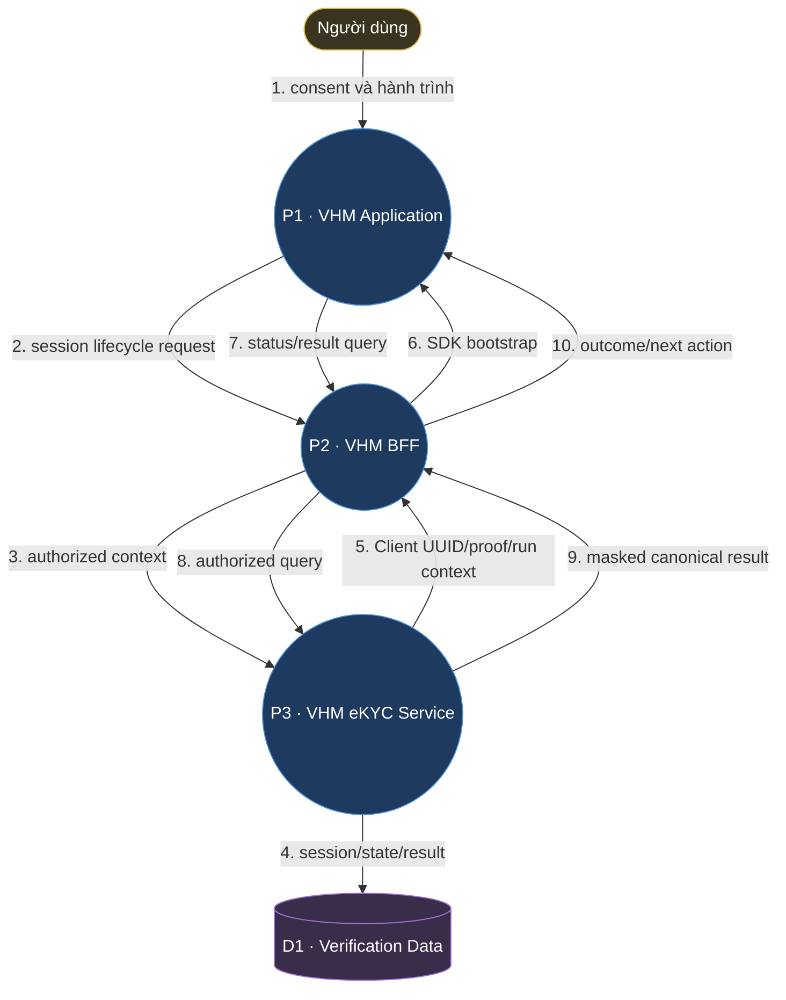
```mermaid
flowchart TB
    USER(["Người dùng"]):::entity
    APP(("P1 · VHM Application")):::process
    BFF(("P2 · VHM BFF")):::process
    EKYC_SERVICE(("P3 · VHM eKYC Service")):::process
    DB[("D1 · Verification Data")]:::datastore

    USER -->|"1. consent và hành trình"| APP
    APP -->|"2. session lifecycle request"| BFF
    BFF -->|"3. authorized context"| EKYC_SERVICE
    EKYC_SERVICE -->|"4. session/state/result"| DB
    EKYC_SERVICE -->|"5. Client UUID/proof/run context"| BFF
    BFF -->|"6. SDK bootstrap"| APP
    APP -->|"7. status/result query"| BFF
    BFF -->|"8. authorized query"| EKYC_SERVICE
    EKYC_SERVICE -->|"9. masked canonical result"| BFF
    BFF -->|"10. outcome/next action"| APP

    classDef entity fill:#3a3320,stroke:#d9b84a,color:#fff;
    classDef process fill:#1f3a5f,stroke:#4a90d9,color:#fff;
    classDef datastore fill:#3a2d4a,stroke:#a06fd9,color:#fff;
```

- VHM BFF xác thực user và authorize `businessRef/subjectRef`.
- VHM eKYC Service sở hữu `verificationId`, state, retry và result.
- Provider credential chỉ tồn tại trong VHM eKYC Service/Secret Manager; BFF không nhận credential.
- Mobile/Web không gọi Provider Get Result API.

### 5.1.2. Data-plane SDK

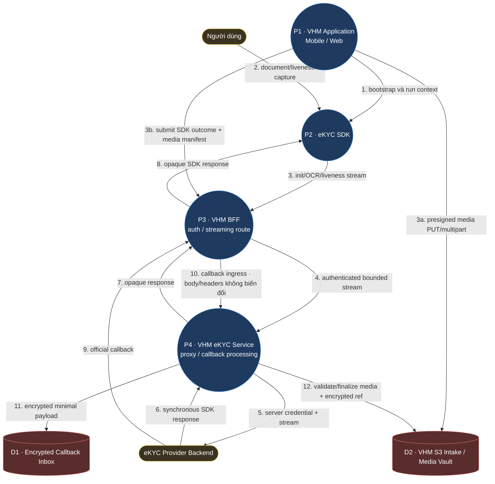
```mermaid
flowchart TB
    USER(["Người dùng"]):::entity
    BACKEND(["eKYC Provider Backend"]):::entity
    APP(("P1 · VHM Application<br/>Mobile / Web")):::process
    SDK(("P2 · eKYC SDK")):::process
    BFF(("P3 · VHM BFF<br/>auth / streaming route")):::process
    EKYC_SERVICE(("P4 · VHM eKYC Service<br/>proxy / callback processing")):::process
    INBOX[("D1 · Encrypted Callback Inbox")]:::sensitive
    S3[("D2 · VHM S3 Intake / Media Vault")]:::sensitive

    APP -->|"1. bootstrap và run context"| SDK
    USER -->|"2. document/liveness capture"| SDK
    SDK -->|"3. init/OCR/liveness stream"| BFF
    APP -->|"3a. presigned media PUT/multipart"| S3
    APP -->|"3b. submit SDK outcome + media manifest"| BFF
    BFF -->|"4. authenticated bounded stream"| EKYC_SERVICE
    EKYC_SERVICE -->|"5. server credential + stream"| BACKEND
    BACKEND -->|"6. synchronous SDK response"| EKYC_SERVICE
    EKYC_SERVICE -->|"7. opaque response"| BFF
    BFF -->|"8. opaque SDK response"| SDK
    BACKEND -->|"9. official callback"| BFF
    BFF -->|"10. callback ingress · body/headers không biến đổi"| EKYC_SERVICE
    EKYC_SERVICE -->|"11. encrypted minimal payload"| INBOX
    EKYC_SERVICE -->|"12. validate/finalize media + encrypted ref"| S3

    classDef entity fill:#3a3320,stroke:#d9b84a,color:#fff;
    classDef process fill:#1f3a5f,stroke:#4a90d9,color:#fff;
    classDef sensitive fill:#5a2d2d,stroke:#d96f6f,color:#fff;
```

## 5.2. Data Flow quan trọng

| **Actor/System thực hiện** | **Hành động nghiệp vụ** | **Thành phần thực hiện** | **Mô tả** |
| --- | --- | --- | --- |
| Người dùng | Đồng ý và bắt đầu xác minh | VHM Application Mobile/Web | Chọn hành trình theo use case đã duyệt; client không tự đổi journey. |
| VHM Application | Khởi tạo phiên và SDK | BFF + VHM eKYC Service | Authorize business object, validate consent/capability và nhận bootstrap ngắn hạn. |
| Người dùng | Cung cấp ảnh giấy tờ/liveness | eKYC SDK | Front/back trong cùng run; `FULL_EKYC` bổ sung liveness/face capture. |
| eKYC SDK | Gửi init/OCR/liveness | VHM BFF → VHM eKYC Service | BFF xác thực/stream; VHM eKYC Service validate session/run, inject credential và stream tới eKYC Provider Backend. |
| VHM Application | Lưu media cho pass/fail | Media Upload API → VHM S3 Intake | Xin exact presigned request, upload document/direct-face/liveness artifact và submit server-issued media manifest idempotently. |
| eKYC Provider Backend | Xử lý OCR/eKYC | eKYC Provider Backend | Xử lý data-plane và gửi token-authenticated official result. |
| VHM eKYC Service | Chuẩn hóa và hoàn tất kết quả | Callback/Result Processing + Media Upload Finalizer | Authenticate, dedupe, normalize; validate media/seal encrypted ref; chỉ expose terminal outcome khi official result và required media đều ready. |
| Manual Review Operator/Supervisor | Xem evidence và ghi hậu kiểm | Manual Review Reveal API + Private File Service | Platform role + assignment/business-object scope; GET audit/list encrypted refs, POST bind/decrypt refs và trả short-lived presigned URLs có audit. |
| VHM Application | Tra cứu và sử dụng kết quả | BFF + Result API | Nhận fixed, authorized, masked outcome/next action theo purpose. |
| Operations | Khôi phục callback thất lạc | Reconciliation Worker | Chỉ Get Result khi callback quá SLA/session treo, theo bounded backoff/quota. |

### **5.2.1. Khởi tạo session — Sequence L2**

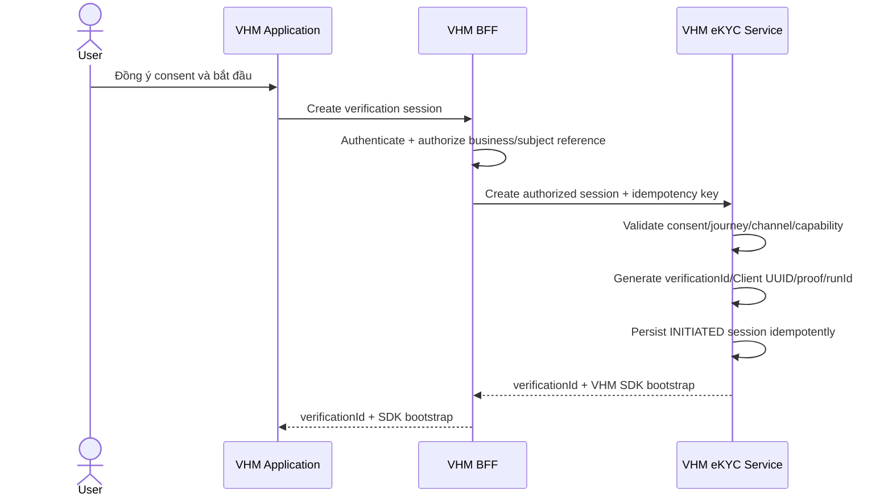
```mermaid
sequenceDiagram
    actor User
    participant APP as VHM Application
    participant BFF as VHM BFF
    participant EKYC_SERVICE as VHM eKYC Service
    User->>APP: Đồng ý consent và bắt đầu
    APP->>BFF: Create verification session
    BFF->>BFF: Authenticate + authorize business/subject reference
    BFF->>EKYC_SERVICE: Create authorized session + idempotency key
    EKYC_SERVICE->>EKYC_SERVICE: Validate consent/journey/channel/capability
    EKYC_SERVICE->>EKYC_SERVICE: Generate verificationId/Client UUID/proof/runId
    EKYC_SERVICE->>EKYC_SERVICE: Persist INITIATED session idempotently
    EKYC_SERVICE-->>BFF: verificationId + VHM SDK bootstrap
    BFF-->>APP: verificationId + SDK bootstrap
```

Create-session failure rules:

- Cùng idempotency key và fingerprint trả session hiện hữu.
- Cùng key khác fingerprint trả `IV_IDEMPOTENCY_CONFLICT`.
- DB/internal failure không được trả bootstrap nếu session chưa persist durable.
- VHM SDK session token ngắn hạn, bind session/run/journey/channel/environment.

### **5.2.2. OCR_ONLY trên Mobile/Web — Sequence L2**

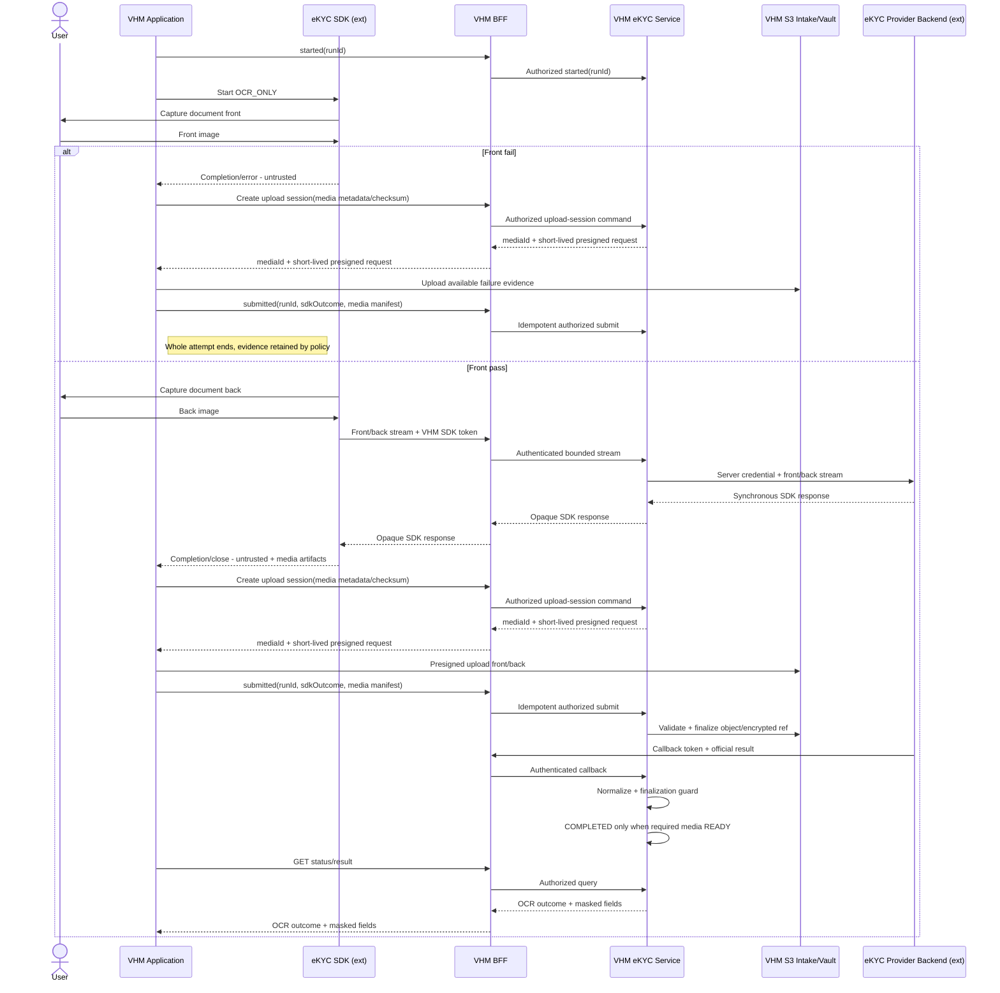
```mermaid
sequenceDiagram
    actor User
    participant APP as VHM Application
    participant SDK as eKYC SDK (ext)
    participant BFF as VHM BFF
    participant EKYC_SERVICE as VHM eKYC Service
    participant S3 as VHM S3 Intake/Vault
    participant BACKEND as eKYC Provider Backend (ext)
    APP->>BFF: started(runId)
    BFF->>EKYC_SERVICE: Authorized started(runId)
    APP->>SDK: Start OCR_ONLY
    SDK->>User: Capture document front
    User->>SDK: Front image
    alt Front fail
        SDK-->>APP: Completion/error - untrusted
        APP->>BFF: Create upload session(media metadata/checksum)
        BFF->>EKYC_SERVICE: Authorized upload-session command
        EKYC_SERVICE-->>BFF: mediaId + short-lived presigned request
        BFF-->>APP: mediaId + short-lived presigned request
        APP->>S3: Upload available failure evidence
        APP->>BFF: submitted(runId, sdkOutcome, media manifest)
        BFF->>EKYC_SERVICE: Idempotent authorized submit
        Note right of APP: Whole attempt ends, evidence retained by policy
    else Front pass
        SDK->>User: Capture document back
        User->>SDK: Back image
        SDK->>BFF: Front/back stream + VHM SDK token
        BFF->>EKYC_SERVICE: Authenticated bounded stream
        EKYC_SERVICE->>BACKEND: Server credential + front/back stream
        BACKEND-->>EKYC_SERVICE: Synchronous SDK response
        EKYC_SERVICE-->>BFF: Opaque SDK response
        BFF-->>SDK: Opaque SDK response
        SDK-->>APP: Completion/close - untrusted + media artifacts
        APP->>BFF: Create upload session(media metadata/checksum)
        BFF->>EKYC_SERVICE: Authorized upload-session command
        EKYC_SERVICE-->>BFF: mediaId + short-lived presigned request
        BFF-->>APP: mediaId + short-lived presigned request
        APP->>S3: Presigned upload front/back
        APP->>BFF: submitted(runId, sdkOutcome, media manifest)
        BFF->>EKYC_SERVICE: Idempotent authorized submit
        EKYC_SERVICE->>S3: Validate + finalize object/encrypted ref
        BACKEND->>BFF: Callback token + official result
        BFF->>EKYC_SERVICE: Authenticated callback
        EKYC_SERVICE->>EKYC_SERVICE: Normalize + finalization guard
        EKYC_SERVICE->>EKYC_SERVICE: COMPLETED only when required media READY
        APP->>BFF: GET status/result
        BFF->>EKYC_SERVICE: Authorized query
        EKYC_SERVICE-->>BFF: OCR outcome + masked fields
        BFF-->>APP: OCR outcome + masked fields
    end
```

Mobile và Web dùng cùng result/state contract. Khác biệt lifecycle chỉ nằm ở client
integration; backend không thay đổi official-result rule.

Two-side processing là hành vi cố định theo contract của SDK/provider và không
được thay đổi động trong runtime:

| **Provider capability** | **Cách Mobile/Web xử lý** | **Failure rule** |
| --- | --- | --- |
| Một lần gửi front + back | SDK thu đủ hai mặt rồi gửi trong cùng `runId` | Bất kỳ mặt nào fail thì whole attempt `NEED_RETRY` |
| Một lần chỉ gửi một mặt | SDK xử lý front trước; front pass mới tiếp tục back trong cùng `runId` | Front fail thì dừng ngay; back không được capture/send. Back fail cũng đóng whole attempt |

Attempt sau phải capture lại từ đầu; không giữ front/back đã pass để ghép với ảnh
của attempt khác.

### **5.2.3. FULL_EKYC trên Mobile — Sequence L2**

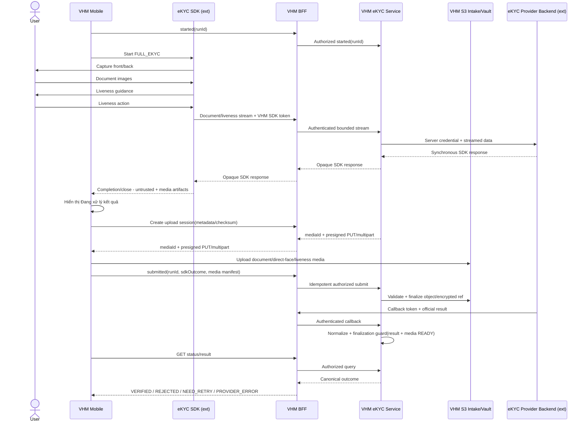
```mermaid
sequenceDiagram
    actor User
    participant APP as VHM Mobile
    participant SDK as eKYC SDK (ext)
    participant BFF as VHM BFF
    participant EKYC_SERVICE as VHM eKYC Service
    participant S3 as VHM S3 Intake/Vault
    participant BACKEND as eKYC Provider Backend (ext)
    APP->>BFF: started(runId)
    BFF->>EKYC_SERVICE: Authorized started(runId)
    APP->>SDK: Start FULL_EKYC
    SDK->>User: Capture front/back
    User->>SDK: Document images
    SDK->>User: Liveness guidance
    User->>SDK: Liveness action
    SDK->>BFF: Document/liveness stream + VHM SDK token
    BFF->>EKYC_SERVICE: Authenticated bounded stream
    EKYC_SERVICE->>BACKEND: Server credential + streamed data
    BACKEND-->>EKYC_SERVICE: Synchronous SDK response
    EKYC_SERVICE-->>BFF: Opaque SDK response
    BFF-->>SDK: Opaque SDK response
    SDK-->>APP: Completion/close - untrusted + media artifacts
    APP->>APP: Hiển thị Đang xử lý kết quả
    APP->>BFF: Create upload session(metadata/checksum)
    EKYC_SERVICE-->>BFF: mediaId + presigned PUT/multipart
    BFF-->>APP: mediaId + presigned PUT/multipart
    APP->>S3: Upload document/direct-face/liveness media
    APP->>BFF: submitted(runId, sdkOutcome, media manifest)
    BFF->>EKYC_SERVICE: Idempotent authorized submit
    EKYC_SERVICE->>S3: Validate + finalize object/encrypted ref
    BACKEND->>BFF: Callback token + official result
    BFF->>EKYC_SERVICE: Authenticated callback
    EKYC_SERVICE->>EKYC_SERVICE: Normalize + finalization guard(result + media READY)
    APP->>BFF: GET status/result
    BFF->>EKYC_SERVICE: Authorized query
    EKYC_SERVICE-->>BFF: Canonical outcome
    BFF-->>APP: VERIFIED / REJECTED / NEED_RETRY / PROVIDER_ERROR
```

### **5.2.4. FULL_EKYC trên Web — Sequence L2**

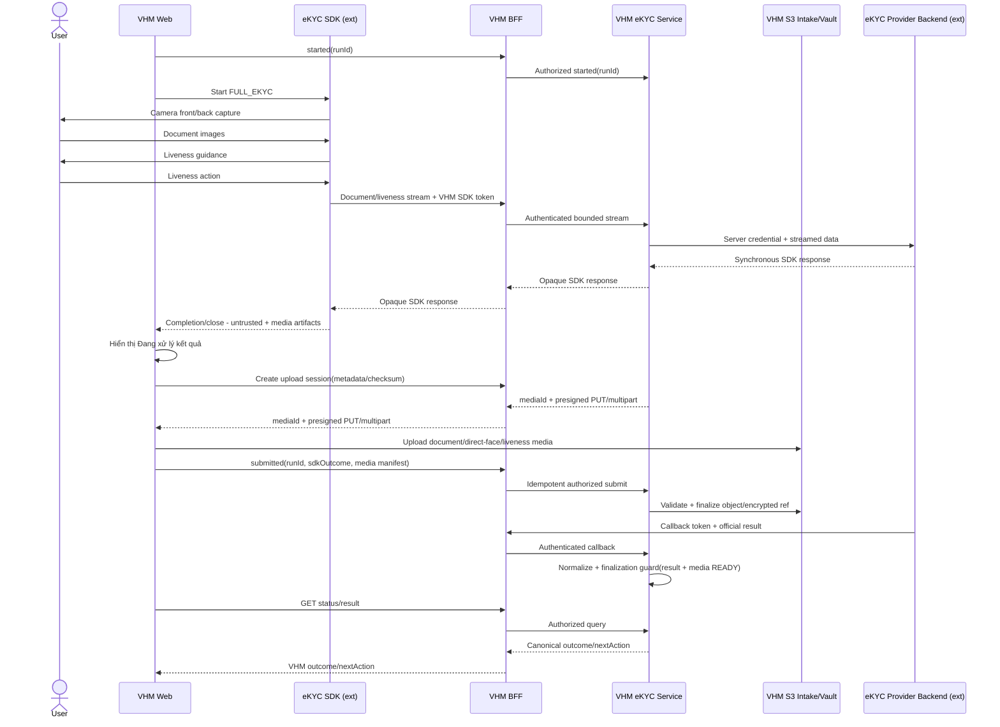
```mermaid
sequenceDiagram
    actor User
    participant WEB as VHM Web
    participant SDK as eKYC SDK (ext)
    participant BFF as VHM BFF
    participant EKYC_SERVICE as VHM eKYC Service
    participant S3 as VHM S3 Intake/Vault
    participant BACKEND as eKYC Provider Backend (ext)
    WEB->>BFF: started(runId)
    BFF->>EKYC_SERVICE: Authorized started(runId)
    WEB->>SDK: Start FULL_EKYC
    SDK->>User: Camera front/back capture
    User->>SDK: Document images
    SDK->>User: Liveness guidance
    User->>SDK: Liveness action
    SDK->>BFF: Document/liveness stream + VHM SDK token
    BFF->>EKYC_SERVICE: Authenticated bounded stream
    EKYC_SERVICE->>BACKEND: Server credential + streamed data
    BACKEND-->>EKYC_SERVICE: Synchronous SDK response
    EKYC_SERVICE-->>BFF: Opaque SDK response
    BFF-->>SDK: Opaque SDK response
    SDK-->>WEB: Completion/close - untrusted + media artifacts
    WEB->>WEB: Hiển thị Đang xử lý kết quả
    WEB->>BFF: Create upload session(metadata/checksum)
    EKYC_SERVICE-->>BFF: mediaId + presigned PUT/multipart
    BFF-->>WEB: mediaId + presigned PUT/multipart
    WEB->>S3: Upload document/direct-face/liveness media
    WEB->>BFF: submitted(runId, sdkOutcome, media manifest)
    BFF->>EKYC_SERVICE: Idempotent authorized submit
    EKYC_SERVICE->>S3: Validate + finalize object/encrypted ref
    BACKEND->>BFF: Callback token + official result
    BFF->>EKYC_SERVICE: Authenticated callback
    EKYC_SERVICE->>EKYC_SERVICE: Normalize + finalization guard(result + media READY)
    WEB->>BFF: GET status/result
    BFF->>EKYC_SERVICE: Authorized query
    EKYC_SERVICE-->>BFF: Canonical outcome/nextAction
    BFF-->>WEB: VHM outcome/nextAction
```

Refresh/reopen/multi-tab phải query backend status. Web không lưu VHM SDK session token
dài hạn và không tự tạo run mới khi lease còn active.

### **5.2.5. Callback đến trước client submitted — Sequence L2**

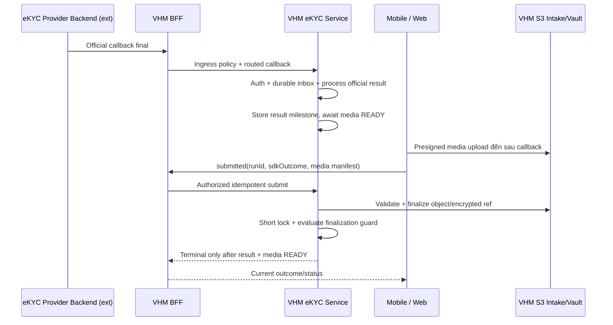
```mermaid
sequenceDiagram
    participant BACKEND as eKYC Provider Backend (ext)
    participant BFF as VHM BFF
    participant EKYC_SERVICE as VHM eKYC Service
    participant CLIENT as Mobile / Web
    participant S3 as VHM S3 Intake/Vault
    BACKEND->>BFF: Official callback final
    BFF->>EKYC_SERVICE: Ingress policy + routed callback
    EKYC_SERVICE->>EKYC_SERVICE: Auth + durable inbox + process official result
    EKYC_SERVICE->>EKYC_SERVICE: Store result milestone, await media READY
    CLIENT->>S3: Presigned media upload đến sau callback
    CLIENT->>BFF: submitted(runId, sdkOutcome, media manifest)
    BFF->>EKYC_SERVICE: Authorized idempotent submit
    EKYC_SERVICE->>S3: Validate + finalize object/encrypted ref
    EKYC_SERVICE->>EKYC_SERVICE: Short lock + evaluate finalization guard
    EKYC_SERVICE-->>BFF: Terminal only after result + media READY
    BFF-->>CLIENT: Current outcome/status
```

Client submit đến sau không được ghi đè official result nhưng vẫn phải persist
media manifest. Không sử dụng last-write-wins; callback và submit cập nhật hai
milestone độc lập rồi hội tụ tại finalization guard.

### **5.2.6. User cancel/client close**

| **Tình huống** | **Client event** | **Backend action** |
| --- | --- | --- |
| User cancel trước submitted | `cancelled` với canonical reason | Chuyển `CANCELLED` nếu state cho phép |
| Mobile force-close | Có thể không có event | Giữ active đến expiry/reconcile; khi mở lại query status |
| Web refresh/reopen | Có thể không có event | Không auto cancel; query status và kiểm tra run lease |
| Mất mạng | Có thể không có event | Session timeout/reconcile theo policy |
| Official result đến sau cancel | Late result | Lưu late-result audit; không đảo `CANCELLED` |

### **5.2.7. Retry session — Sequence L2**

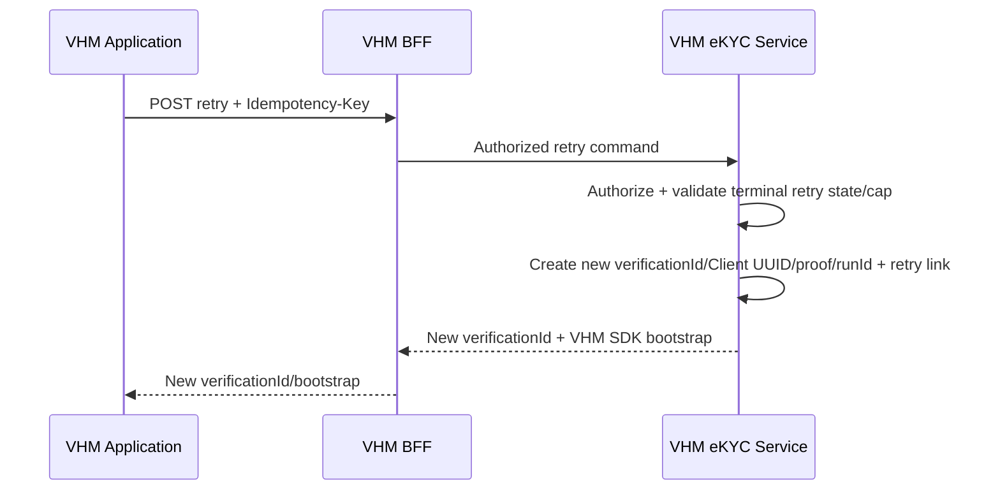
```mermaid
sequenceDiagram
    participant APP as VHM Application
    participant BFF as VHM BFF
    participant EKYC_SERVICE as VHM eKYC Service
    APP->>BFF: POST retry + Idempotency-Key
    BFF->>EKYC_SERVICE: Authorized retry command
    EKYC_SERVICE->>EKYC_SERVICE: Authorize + validate terminal retry state/cap
    EKYC_SERVICE->>EKYC_SERVICE: Create new verificationId/Client UUID/proof/runId + retry link
    EKYC_SERVICE-->>BFF: New verificationId + VHM SDK bootstrap
    BFF-->>APP: New verificationId/bootstrap
```

Attempt mới không reuse Client UUID, provider session, result, history, token hoặc
ảnh của attempt cũ.

### **5.2.8. Manual Review media access — Sequence L2**

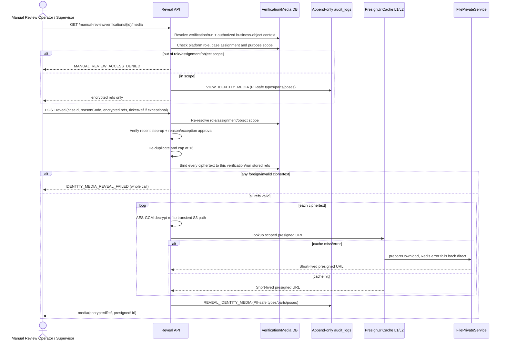
```mermaid
sequenceDiagram
    actor CALLER as Manual Review Operator / Supervisor
    participant API as Reveal API
    participant DB as Verification/Media DB
    participant AUDIT as Append-only audit_logs
    participant CACHE as PresignUrlCache L1/L2
    participant FILE as FilePrivateService
    CALLER->>API: GET /manual-review/verifications/{id}/media
    API->>DB: Resolve verification/run + authorized business-object context
    API->>DB: Check platform role, case assignment and purpose scope
    alt out of role/assignment/object scope
        API-->>CALLER: MANUAL_REVIEW_ACCESS_DENIED
    else in scope
        API->>AUDIT: VIEW_IDENTITY_MEDIA (PII-safe types/parts/poses)
        API-->>CALLER: encrypted refs only
    end
    CALLER->>API: POST reveal(caseId, reasonCode, encrypted refs, ticketRef if exceptional)
    API->>DB: Re-resolve role/assignment/object scope
    API->>API: Verify recent step-up + reason/exception approval
    API->>API: De-duplicate and cap at 16
    API->>DB: Bind every ciphertext to this verification/run stored refs
    alt any foreign/invalid ciphertext
        API-->>CALLER: IDENTITY_MEDIA_REVEAL_FAILED (whole call)
    else all refs valid
        loop each ciphertext
            API->>API: AES-GCM decrypt ref to transient S3 path
            API->>CACHE: Lookup scoped presigned URL
            alt cache miss/error
                CACHE->>FILE: prepareDownload, Redis error falls back direct
                FILE-->>API: Short-lived presigned URL
            else cache hit
                CACHE-->>API: Short-lived presigned URL
            end
        end
        API->>AUDIT: REVEAL_IDENTITY_MEDIA (PII-safe types/parts/poses)
        API-->>CALLER: media(encryptedRef, presignedUrl)
    end
```

`audit_logs` dùng `entity_type=IDENTITY_VERIFICATION`, `entity_id=verificationId`,
actor, role, case ID, purpose, controlled reason code, authentication assurance,
opaque ticket reference khi áp dụng, request/outcome và `changed_at`; phần media
chỉ lưu types/logical parts/poses/count. Không ghi ciphertext, plaintext S3 path
hoặc presigned URL. Invalid/foreign ciphertext không tạo business access
audit để giữ contract hiện tại, nhưng phải phát PII-safe security-deny metric/log
cho SIEM. URL chỉ được trả khi reveal audit ghi thành công; audit failure phải
fail closed. Decision lifecycle verified/auto-failed/manual lưu tại `iv_histories`,
không trộn với access audit.

## 5.3. Failure Handling Matrix

| **Tình huống** | **Detection** | **Platform state** | **Recovery/User action** | **Ops** |
| --- | --- | --- | --- | --- |
| Camera permission denied | Client canonical error | `NEED_RETRY` theo policy | Cấp quyền rồi whole-attempt retry | Metric/spike alert |
| Client/SDK unsupported | Compatibility policy | Không start SDK | Upgrade VHM Application | Metric |
| Front hoặc back quality fail | Official result/client error | `NEED_RETRY` | Retry whole attempt; không reuse ảnh pass | Quality metric |
| SDK init/crash | Client canonical error | `NEED_RETRY` | Retry có giới hạn | Alert nếu spike |
| Provider timeout/5xx | Adapter | Giữ `PROCESSING` trong recovery budget | Reconciliation/backoff | Dependency alert |
| Provider 401/403 | Adapter | `PROVIDER_ERROR` | Không tự retry; Ops sửa credential/config | Critical alert |
| Callback auth fail | CallbackAuthenticator | Không đổi business state | Provider sửa auth/retry | Security alert |
| Callback duplicate | Inbox unique key | Giữ state | Trả 2xx | Duplicate metric |
| Callback schema invalid | Schema validation | Không finalize | Provider sửa contract/payload | High alert |
| DB lỗi trước durable inbox | Insert failure | Chưa nhận callback | Provider retry | DB alert |
| DB lỗi sau durable inbox | Worker/inbox status | Giữ inbox pending/failed | Worker reprocess | Backlog alert |
| Session row lock timeout/deadlock | PostgreSQL `lock_timeout`/SQLSTATE | Rollback, không đổi session/result/manifest | Inbox/submit giữ retryable; worker backoff theo mục 2.5.3–2.5.4 | Lock-timeout/retry alert |
| Presigned URL hết hạn/chưa upload | S3/client upload result | Giữ media `CREATED/UPLOADING`; không final | Xin upload session mới cho cùng server-issued media slot theo policy | Upload-expiry/failure metric |
| Upload sai key/type/size/checksum | S3 policy/HeadObject/finalizer | Reject/quarantine media; không final | Client whole-attempt recovery theo error class; không accept arbitrary URL | Security/DLP alert nếu lặp |
| Upload xong nhưng không submit | Orphan lifecycle/manifest scan | Không gắn media vào result | Resume submit nếu run còn hợp lệ; hết window purge orphan | Orphan count/oldest-age alert |
| Callback đến trước submit | Official result milestone | Giữ `PROCESSING`, result persisted; chờ media | Accept late idempotent manifest và evaluate guard | Callback-submit race metric |
| Encrypted-reference/KMS finalization fail | Media Upload Finalizer | `mediaStatus=FAILED/RETRYABLE`; không expose terminal | Bounded retry; crypto/S3 incident escalation | Critical media-finalizer alert |
| Reviewer ngoài role/assignment/business-object scope | Authorization policy + case assignment | Không đổi case/result | Trả `MANUAL_REVIEW_ACCESS_DENIED` | PII-safe denied-access security event |
| Foreign/invalid ciphertext trong reveal | Verification/run stored-ref binding | Fail toàn bộ request; không trả partial URL | Trả `IDENTITY_MEDIA_REVEAL_FAILED` | Security-deny metric/log; không ghi business reveal audit |
| Presign cache/Redis lỗi | Caffeine/Redisson/File client | Không đổi case/result | Fallback direct `prepareDownload`; vẫn audit trước response | Cache fallback/error metric |
| Reveal audit write fail | Append-only audit store | Không trả presigned URL | Fail closed; retry request theo policy | Critical audit-pipeline alert |
| Callback lost | Reconciliation due | Giữ `SUBMITTED/PROCESSING` | Get Result bounded | Reconcile metric |
| Session stuck hết budget | Recovery counter | `PROVIDER_ERROR` | Contact support/retry theo policy | Incident review |
| Callback lost và provider hết retention | Get Result `not found/expired` sau recovery deadline | `PROVIDER_ERROR`, reason `RESULT_UNRECOVERABLE_AFTER_RETENTION` | Không reuse media/result; contact support hoặc whole-attempt retry | Incident nếu theo cụm; review retention/backlog |
| Provider outage kéo dài | Circuit breaker/health/SLA breach | Dừng create mới; session đã submit giữ `PROCESSING`, không chuyển `REJECTED` | Tiếp tục durable callback; ưu tiên reconciliation khi provider phục hồi | Escalate provider; theo dõi retention-at-risk |
| Concurrent create | Unique/idempotency guard | Một active session | Trả session hiện hữu/conflict | Metric |
| Result API access sai scope | Authorization | Không đổi state | `403/404` | Security audit |

## 5.4. Data Normalization

- Unicode normalization, trim và collapse whitespace.
- Họ tên giữ dấu; có `searchValue` riêng nếu use case được phê duyệt.
- Date parse strict ISO-8601; không tự đảo ngày/tháng.
- Document number giữ string, không parse số.
- Address không tự suy diễn tỉnh/quận nếu provider không trả mã chuẩn.
- Field source chỉ thuộc fixed allowlist cho OCR result.
- Confidence validate `0..1`; ngoài range phải quarantine/mapping error.
- Boolean/string parse strict allowlist, không dùng truthy coercion.
- Không dùng `N/A`, empty string và null như cùng một nghĩa nếu contract không quy định.

# **6. Deployment, Technology & Observability**

## 6.1. Environments

| **Environment** | **Purpose** | **Availability** | **Infrastructure** | **Internet exposure** | **Data type** | **HA/DR** | **Key differences/constraints** |
| --- | --- | --- | --- | --- | --- | --- | --- |
| Development | Phát triển và unit/component integration | Theo giờ làm việc/platform standard | VHM non-production AWS/EKS | Không public; egress sandbox theo allowlist | Synthetic only | Không yêu cầu DR | Có thể dùng provider mock; không dùng production credential/data. |
| SIT | Contract, DB integration, callback và security integration | Theo test window được duyệt | Isolated non-production AWS/EKS | Ingress restricted; provider staging only | Synthetic/masked test data | Restore test theo kế hoạch | Callback key/endpoint riêng; cấu hình gần production. |
| UAT | Product/UX/Risk/Privacy acceptance trên Mobile và Web | Theo UAT plan | Production-like non-production environment | Restricted tester access | Synthetic hoặc approved masked data | Theo platform non-prod standard | Provider staging; fixed journey/document/profile như production candidate. |
| Production | Vận hành OCR/eKYC chính thức | Theo SLA/SLO được phê duyệt | AWS Singapore, EKS, RDS/Redis managed services | WAF/API ingress; workload/data private | Production personal data theo approved purpose | Multi-AZ, PITR và DR policy | Provider production endpoint; mọi thay đổi qua approval/canary/rollback. |

Availability window chi tiết, quyền truy cập và platform-standard version là
approval input tại Appendix A; không được dùng production data ở non-production
nếu chưa có phê duyệt Data Privacy bằng văn bản.

## **6.2. Production Deployment Diagram**

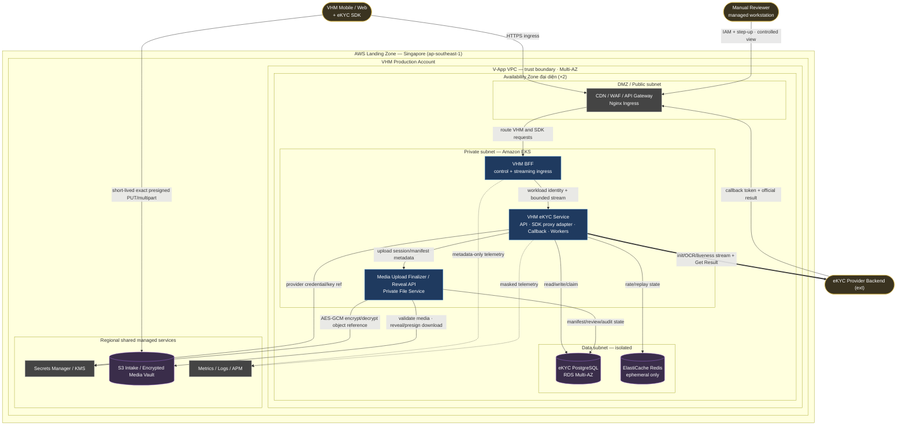
```mermaid
flowchart TB
    CLIENT(["VHM Mobile / Web<br/>+ eKYC SDK"]):::entity
    REVIEWER(["Manual Reviewer<br/>managed workstation"]):::entity
    PROVIDER(["eKYC Provider Backend (ext)"]):::entity

    subgraph LZ["AWS Landing Zone — Singapore (ap-southeast-1)"]
        subgraph ACCOUNT["VHM Production Account"]
            subgraph VPC["V-App VPC — trust boundary · Multi-AZ"]
                subgraph AZ["Availability Zone đại diện (×2)"]
                    subgraph EDGE["DMZ / Public subnet"]
                        GATEWAY["CDN / WAF / API Gateway<br/>Nginx Ingress"]:::infra
                    end
                    subgraph APPZONE["Private subnet — Amazon EKS"]
                        BFF["VHM BFF<br/>control + streaming ingress"]:::bc
                        EKYC_SERVICE["VHM eKYC Service<br/>API · SDK proxy adapter · Callback · Workers"]:::bc
                        MEDIA_WORKLOAD["Media Upload Finalizer / Reveal API<br/>Private File Service"]:::bc
                    end
                    subgraph DATAZONE["Data subnet — isolated"]
                        RDS[("eKYC PostgreSQL<br/>RDS Multi-AZ")]:::datastore
                        REDIS[("ElastiCache Redis<br/>ephemeral only")]:::datastore
                    end
                end
            end
            subgraph SHARED["Regional shared managed services"]
                SECRET["Secrets Manager / KMS"]:::infra
                S3[("S3 Intake / Encrypted Media Vault")]:::datastore
                OBS["Metrics / Logs / APM"]:::infra
            end
        end
    end

    CLIENT -->|HTTPS ingress| GATEWAY
    REVIEWER -->|IAM + step-up · controlled view| GATEWAY
    CLIENT -->|short-lived exact presigned PUT/multipart| S3
    PROVIDER -->|callback token + official result| GATEWAY
    GATEWAY -->|route VHM and SDK requests| BFF
    BFF -->|workload identity + bounded stream| EKYC_SERVICE
    EKYC_SERVICE -->|read/write/claim| RDS
    EKYC_SERVICE -->|rate/replay state| REDIS
    EKYC_SERVICE -->|provider credential/key ref| SECRET
    EKYC_SERVICE -->|upload session/manifest metadata| MEDIA_WORKLOAD
    MEDIA_WORKLOAD -->|validate media · reveal/presign download| S3
    MEDIA_WORKLOAD -->|AES-GCM encrypt/decrypt object reference| SECRET
    MEDIA_WORKLOAD -->|manifest/review/audit state| RDS
    BFF -.->|metadata-only telemetry| OBS
    EKYC_SERVICE -.->|masked telemetry| OBS
    EKYC_SERVICE ==>|init/OCR/liveness stream + Get Result| PROVIDER

    classDef bc fill:#1f3a5f,stroke:#4a90d9,color:#fff;
    classDef entity fill:#3a3320,stroke:#d9b84a,color:#fff;
    classDef datastore fill:#3a2d4a,stroke:#a06fd9,color:#fff;
    classDef infra fill:#444,stroke:#aaa,color:#fff;
```

Sơ đồ vẽ một AZ đại diện; production trải tối thiểu hai AZ. RDS là datastore do
VHM eKYC Service sở hữu. `==>` biểu diễn egress từ VHM trust boundary
tới eKYC Provider Backend; chi tiết giao thức/cổng nằm trong Network Flow Matrix.

### 6.2.1. Network topology

- VHM API và callback ingress đi qua WAF/API Gateway/Nginx Ingress.
- VHM BFF và VHM eKYC Service chạy private trong EKS; chỉ ingress được expose qua WAF/API Gateway.
- RDS, Redis và Secrets/KMS chỉ truy cập qua private network control.
- S3 Intake/Vault bật public-access block; Intake chỉ nhận exact presigned write,
  còn Vault chỉ cho Media Upload Finalizer/Private File Service qua workload IAM/private endpoint.
- Chỉ callback route được public cho eKYC Provider Backend và phải có strong authentication.
- Egress tới eKYC Provider Backend dùng allowlist, timeout, circuit breaker và audit.

### 6.2.2. Network Flow Matrix

| **Source** | **Destination** | **Protocol** | **Data** | **Control** |
| --- | --- | --- | --- | --- |
| Mobile/Web | VHM BFF | HTTPS 443 | Session/status/retry/result | JWT, WAF, rate limit |
| Mobile/Web SDK | VHM BFF | HTTPS 443 | Init/OCR/liveness stream | SDK session token, Client UUID/run binding, body-size limit |
| Mobile/Web | VHM S3 Intake | HTTPS 443 | Document/direct-face/liveness upload | Exact short-lived presigned PUT/multipart, size/MIME/checksum, no read/list |
| VHM BFF | VHM eKYC Service | HTTPS/mTLS | Authorized command/query, media stream, callback | Workload identity, timeout, backpressure |
| VHM eKYC Service | eKYC Provider Backend | HTTPS 443 | Init/OCR/liveness stream, Get Result | Provider authentication, allowlist, circuit breaker |
| eKYC Provider Backend | VHM BFF → Callback API của VHM eKYC Service | HTTPS 443 | Official result | Callback authentication, WAF, replay/dedupe |
| VHM eKYC Service/Worker | PostgreSQL | TLS | Session/result/inbox/audit | Security group, DB role, KMS |
| VHM eKYC Service | Redis | TLS | Rate limit/replay/ephemeral cache | Private endpoint, auth, TTL |
| Media Upload Finalizer | S3 Intake/Vault + KMS | HTTPS 443/private endpoint | Validate object, seal AES-GCM-encrypted reference và lifecycle metadata | Workload IAM, KMS context, no plaintext path log/persistence |
| Manual Review operations UI | BFF → Reveal API/Private File Service | HTTPS 443 | Encrypted-ref list, bounded reveal request và short-lived presigned download | IAM, platform role, assignment/business-object scope, cap/binding, URL expiry/cache control và access audit |
| Services | Monitoring/Logging | TLS | Masked telemetry | No PII/secret, access control |

## 6.3. Thành phần lưu trữ dữ liệu

| **Thành phần** | **Công nghệ** | **Dữ liệu** | **Control** |
| --- | --- | --- | --- |
| Verification DB | PostgreSQL Multi-AZ | Session, run, checks, fixed fields, result, history, callback inbox | TLS, KMS, PITR, RBAC |
| Redis | Redis | Rate limit, replay cache và ephemeral state | TTL, private network; không source of truth |
| Secret storage | AWS Secrets Manager/KMS | Provider credential, callback token/client-secret refs, encryption keys | Rotation, workload identity, audit |
| Application memory | Process memory | VHM SDK session token và bounded network chunks | Clear token sau completion/cancel/expiry |
| Provider data-plane media | Transient tại BFF/VHM eKYC Service | Document image, selfie, liveness video/frame gửi provider | `MEDIA-01`; không persist/body log/disk spool trong application path |
| S3 Intake | Amazon S3 + SSE-KMS | Client-uploaded media chờ validate/finalize | Private, exact presigned write, no client read/list, short orphan lifecycle |
| VHM Media Vault | Amazon S3 + SSE-KMS | Document front/back, direct-face image và liveness video/frame objects | Workload-only access, versioned retention policy, no public/raw path; short-lived presigned GET only after Reveal API |
| Media/review metadata | PostgreSQL | Manifest, checksum, object version, AES-GCM-encrypted object ref, retention metadata, review/decision/audit links | Transactional, opaque/encrypted refs, no plaintext path/media |

## 6.4. Cost & Capacity/Performance

### 6.4.1. Capacity/Performance targets

| **Metric** | **Target value** | **Status/remarks** |
| --- | --- | --- |
| Platform availability | Theo approved VHM platform availability SLO | Target chốt tại NFR sign-off; provider SLA đo riêng. |
| Create session latency | Đo p95 qua BFF/VHM eKYC Service/DB; không có synchronous eKYC Provider Backend call | Target theo approved VHM API SLO — `PENDING NFR SIGN-OFF`. |
| Status/Result API latency | Đo p95/p99 với dữ liệu đã persist | Target theo approved VHM read-API SLO — `PENDING NFR SIGN-OFF`. |
| Callback durable acknowledgement | Durable receive trước khi trả 2xx; không chờ normalize/finalize | Target phải nằm trong provider callback timeout với approved safety margin — `PENDING PROVIDER CONTRACT`. |
| Callback durable→Canonical Result | Đo p95/p99 và oldest inbox age | Target cùng warning/critical threshold chốt tại NFR/Ops sign-off. |
| Reconciliation recovery deadline | Hoàn tất trước provider retention với approved safety margin | Backlog ceiling phụ thuộc measured throughput/quota; margin chốt tại recovery sign-off. |
| Concurrent sessions Mobile/Web | Chưa có input — `BLOCKING` | Bắt buộc điền worksheet 6.4.2 trước capacity sign-off. |
| Peak create/status/result TPS | Chưa có input — `BLOCKING` | Bắt buộc điền worksheet 6.4.2 trước capacity sign-off. |
| Callback burst TPS/payload p95-p99 | Chưa có input — `BLOCKING` | eKYC Provider Backend/Ops cung cấp và xác nhận bằng callback load test. |
| Concurrent SDK media streams | Chưa có input — `BLOCKING` | Đo riêng BFF và VHM eKYC Service trong streaming load test. |
| Media size/upload duration p95-p99 | Theo security ceiling mục 7.1.4; phân phối thực tế chưa có — `BLOCKING` | Dùng để chốt timeout, bandwidth, HPA và memory budget. |
| Streaming memory per connection | Theo `MEDIA-01`, không tỷ lệ theo body size | Load/memory/disk evidence. |
| Presigned upload success/duration | Đo theo media type/channel và multipart video | Target chốt theo upload UX/NFR; không dùng mediaId/PII làm label. |
| Media finalize latency/backlog | Upload accepted → validated object + encrypted ref `READY`, p95/p99 và oldest age | Phải nằm trong finalization/evidence-ready SLO trước terminal exposure. |
| Manual Review reveal latency/concurrency | Encrypted-ref list, decrypt/presign duration, URL issuance và cache hit/fallback | Target chốt theo OAT; cache không được vượt URL validity hoặc scope. |
| Data volume/growth | Chưa có media volume/retention-policy input — `BLOCKING` | Data Privacy/Ops/Cloud xác nhận bằng policy class và sizing model. |

### 6.4.2. Capacity inputs bắt buộc trước production

| **Input bắt buộc** | **Đơn vị** | **Design value** | **Evidence yêu cầu** | **Owner** |
| --- | --- | --- | --- | --- |
| Daily session Mobile/Web | session/ngày theo channel | `UNRESOLVED` | Product forecast được phê duyệt | Product/Ops |
| Peak concurrent active session | session đồng thời theo channel | `UNRESOLVED` | Forecast + journey-duration p95/p99 | Product/Ops |
| Peak create/status/result | TPS p95/p99 và burst duration | `UNRESOLVED` | Access pattern/forecast | Product/Ops |
| Callback burst | TPS, duration, payload p95/p99 | `UNRESOLVED` | Provider contract hoặc staging measurement | eKYC Provider Backend/Ops |
| Concurrent media stream | stream đồng thời | `UNRESOLVED` | Mobile/Web concurrency model | Product/Client/Ops |
| Media distribution | byte và upload duration p50/p95/p99 | `UNRESOLVED` | SDK staging measurement cho OCR/liveness | Client/eKYC Provider Backend |
| Media type mix | object/attempt, image/video byte p50/p95/p99, multipart rate | `UNRESOLVED` | SDK fixture và UAT/performance measurement | Client/Product/Ops |
| Media retention classes | policy class mix và planning horizon; TDD không hard-code duration | `UNRESOLVED` | Approved purpose-bound retention policy + capacity scenario | Data Privacy/Legal/Product/Cloud |
| Manual Review workload | cases/day, concurrent reviewer, views/case, video playback/egress | `UNRESOLVED` | Operations forecast/OAT | Business Ops/Cloud |
| Journey/retry mix | `% OCR_ONLY`, `% FULL_EKYC`, retry rate | `UNRESOLVED` | Product funnel forecast | Product/Risk |
| Reconciliation workload | due session/phút, sustainable Get Result throughput, retry budget | `UNRESOLVED` | Callback SLA, retention, provider quota và load test để tính backlog ceiling | Ops/eKYC Provider Backend |
| Provider quota/SLA | request/TPS/concurrency/maintenance | `UNRESOLVED` | Contract/SLA evidence | Procurement/Ops |
| Data growth | record/day, byte/record, retention | `UNRESOLVED` | Fixed field set + retention decision | Product/Data Privacy/DBA |

`UNRESOLVED` là approval blocker, không phải giá trị mặc định để dev tự chọn.
Sizing phải dùng tối thiểu các công thức sau và đính kèm spreadsheet/load-test
evidence:

- `peakConcurrency = peakArrivalRate × journeyDurationP99 × safetyFactor`.
- `requiredReplicas = ceil(peakConcurrentWork / measuredCapacityPerPod) + HA headroom`.
- RDS storage/IOPS/connection sizing dựa trên measured write amplification,
  callback burst, retention và restore-window requirement.
- Safety factor và HA headroom do Architecture/Ops ký duyệt; không lấy production
  replica count từ sample hoặc môi trường SIT.

### 6.4.3. Scaling design

| **Component** | **Scale** | **Signal** |
| --- | --- | --- |
| VHM BFF | HPA; route/pool riêng cho control và SDK data-plane | Request rate, active streams, network throughput, p95 latency, memory |
| Verification API | HPA | CPU, request rate, p95 latency |
| SDK Proxy Adapter của VHM eKYC Service | HPA/pool riêng trong VHM eKYC Service deployment | Active streams, upstream latency, timeout, network throughput, bounded-buffer memory |
| Callback API | HPA độc lập | Callback TPS, ack latency, 5xx |
| Inbox Worker | Horizontal worker | Pending count, oldest age, processing latency |
| Reconciliation Worker | Horizontal + bounded lease | Due count/age, provider quota, lock wait |
| Media Upload Finalizer | Horizontal + bounded claim | Uploaded/failed count, oldest age, bytes, crypto/S3 latency và terminal-blocked sessions |
| Reveal API/Private File Service | Horizontal/pool riêng | List/reveal rate, capped batch, authorization deny, cache hit/fallback, presign latency/error |
| PostgreSQL | Multi-AZ + connection pool | CPU, IOPS, connection, lock wait, table/index growth |
| Redis | Managed scale | Memory, eviction, connection, command latency |

Worker claim batch bằng row lock/`SKIP LOCKED` hoặc lease tương đương. Mọi batch
phải bounded và tôn trọng provider quota; không dùng unbounded polling.

### 6.4.4. Cost estimate

| **Component** | **Description/mode** | **Capacity/count** | **Cost** | **Owner/status** |
| --- | --- | --- | --- | --- |
| EKS workload | VHM BFF, VHM eKYC Service API/SDK proxy adapter, Callback API và workers | TBD theo peak TPS + concurrent media streams | TBD | Platform/Ops — trước production readiness |
| RDS PostgreSQL | Multi-AZ, encrypted storage, PITR | TBD theo data volume/IOPS | TBD | DBA/Ops |
| ElastiCache Redis | Rate limit, replay và ephemeral cache | TBD theo peak request/replay window | TBD | Platform/Ops |
| WAF/API Gateway/Ingress | API, SDK media streaming và callback ingress | TBD theo request volume/bandwidth | TBD | Cloud/Ops |
| Network data transfer | Media transit SDK → BFF → VHM eKYC Service → eKYC Provider Backend | TBD theo media size, retry và volume | TBD | Cloud/Ops/Finance |
| S3 Intake/Media Vault | Presigned upload, ciphertext object/version, lifecycle, request và retrieval | TBD theo media mix + versioned retention policy | TBD | Cloud/Ops/Data Privacy/Finance |
| Network data transfer — media | Client→S3 upload, finalizer read/write và manual-review stream/video | TBD theo media size, retry, review workload và lifecycle | TBD | Cloud/Ops/Finance |
| Secrets/KMS | Credential, callback key, field encryption và media data-key wrap/unwrap | TBD theo key/request count | TBD | ANBM/Cloud |
| Monitoring/Logging/APM | Masked metrics, logs, traces và audit | TBD theo ingestion/retention | TBD | Ops/Data Privacy |
| SDK/provider usage | OCR/eKYC transaction theo journey/attempt | TBD theo volume và retry rate | TBD | Product/Procurement |
| **Total monthly estimate** | AWS + provider usage | — | **TBD** | Finance/Product approval gate |

**Công cụ bắt buộc:** [AWS Pricing Calculator](https://calculator.aws/).

| **Cost approval artefact** | **Giá trị/link** | **Owner** | **Gate** |
| --- | --- | --- | --- |
| AWS estimate share/export | `UNRESOLVED` | Cloud/Ops | Bắt buộc trước Architecture/Finance sign-off |
| Tổng AWS monthly estimate | `UNRESOLVED` USD/tháng | Cloud/Ops/Finance | Phải khớp capacity worksheet 6.4.2 |
| Provider pricing model và monthly estimate | `UNRESOLVED` | Product/Procurement/Finance | Phải gồm OCR/FULL_EKYC/retry/reconciliation usage |
| Cost assumptions | `UNRESOLVED` | Cloud/Ops | Region, hours/month, data transfer, log retention, backup và headroom |
| Budget/quota/alert threshold | `UNRESOLVED` | Product/Ops/Finance | Có dashboard, owner và stop-create/escalation rule |

Không được dùng bảng `TBD` phía trên như cost estimate. Tài liệu chỉ qua cost gate
khi có calculator export/share link, provider quotation và tổng chi phí tháng đã
được Finance/Product ký duyệt.

## 6.5. CI/CD Architecture

### 6.5.1. DevSecOps gates

- Compile/unit test và dependency lock validation.
- SCA/license scan cho backend, Mobile, Web và SDK artifact.
- Secret scan, SAST và IaC scan.
- Container vulnerability scan.
- DB migration compatibility/integration test.
- API/provider contract test.
- Mobile/Web client E2E evidence.
- Security/privacy approval gates.
- Immutable artifact promotion; không rebuild giữa environment.

### 6.5.2. Quality gates

| **Layer** | **Nội dung** | **Gate** |
| --- | --- | --- |
| Unit | State guard, idempotency, mapping, masking, retry rules | Critical branches `>=80%` |
| DB Integration | Constraint, index, locking, inbox, history, reconciliation query | Bắt buộc pass |
| Provider Contract | SDK init/OCR/liveness proxy, callback, Get Result và error fixtures | Bắt buộc pass |
| Mobile SDK | Permission, lifecycle, front/back, result page OFF, compatibility matrix | Bắt buộc pass |
| Web SDK | Camera permission, refresh/reopen/multi-tab, front/back, result page OFF | Bắt buộc pass |
| API Security | Authn/authz, domain/object scope, SDK session token, masking, body/rate limit | Bắt buộc pass |
| Media Storage | Presign scope/expiry/reuse, exact key, checksum, multipart, orphan purge, S3/KMS policy và encrypted-reference round-trip | Bắt buộc pass |
| Manual Review | Platform role/assignment/object IDOR, cap/dedupe, foreign ciphertext all-or-nothing, AES-GCM ref decrypt, cache/URL expiry và PII-safe append-only audit | Bắt buộc pass |
| E2E | Mobile/Web SDK ↔ BFF ↔ VHM eKYC Service ↔ eKYC Provider Backend staging | Happy + failure paths |
| Performance | Control API + concurrent media streaming + callback burst/reconciliation | Đạt NFR và `MEDIA-01` |
| Recovery | DB/provider outage, callback lost, worker restart, PITR | Bắt buộc pass |

### 6.5.3. Deployment strategy

| **Component/service** | **Deployment type** | **Expected downtime** | **Rollback strategy** | **Deployment window** | **Approval required** |
| --- | --- | --- | --- | --- | --- |
| VHM BFF | Canary hoặc rolling | Không dự kiến | Stop rollout, route về immutable artifact trước; giữ route contract tương thích | Theo standard release window | BFF Owner/Ops |
| VHM eKYC Service Verification/Result/SDK Proxy API | Canary hoặc rolling | Không dự kiến | Stop rollout, route về immutable artifact trước; không retry media đang gửi | Theo standard release window | Service Owner/Ops |
| Callback API | Canary/rolling độc lập | Không dự kiến; callback ingress phải luôn available | Route về artifact trước, giữ inbox schema backward-compatible | Tránh provider maintenance window | Service Owner/Ops |
| Inbox/Reconciliation Workers | Rolling với bounded drain | Không ảnh hưởng API; backlog có kiểm soát | Dừng worker mới, deploy artifact trước, resume lease an toàn | Bất kỳ khi backlog trong threshold | Service Owner/Ops |
| Media Upload Finalizer/Reveal API/Private File Service | Canary/rolling với bounded drain | Upload tiếp tục vào Intake trong bounded capacity; reveal lỗi phải fail closed | Stop rollout, giữ encrypted-ref format backward-compatible, resume finalizer; revoke/expire issued URLs theo runbook | Theo service window/backlog threshold | Service Owner/ANBM/Ops |
| S3 bucket/KMS policy | IaC staged change | Không dự kiến | Revert policy/version; break-glass chỉ theo approved runbook | Security change window | Cloud + ANBM + Data Privacy |
| Database schema | Expand/contract phased migration | Không hoặc minimal theo approved plan | Backward-compatible code/schema; restore chỉ là phương án cuối | Maintenance window nếu có lock risk | DBA + Architecture |
| Mobile/Web SDK/profile | Controlled cohort theo compatibility matrix | Không downtime backend | Dừng cohort, rollback app/web/config version | Client release window | Product + Client Owner |
| Provider credential/callback token | Overlap rotation | Không dự kiến | Giữ old/new material trong overlap, revoke sau evidence | Coordinated security window | ANBM + eKYC Provider Backend |

Khi incident dependency, có thể dừng create session nhưng tiếp tục nhận callback và
reconciliation nếu các control bảo mật/toàn vẹn vẫn an toàn.

## 6.6. Technology Stack & Justification

| **Area** | **Selected approach** | **Rationale** | **Trade-off/alternative considered** | **Status** |
| --- | --- | --- | --- | --- |
| Backend | Java 25, Spring Boot 4.0.4, Spring Data JPA, Maven | Strong typing, transaction support và phù hợp state/idempotency-heavy service | Go/Node giảm footprint nhưng làm tăng divergence stack và không tạo lợi ích đủ lớn cho contract này | Selected |
| Client integration | VHM Mobile, VHM Web và eKYC SDK được pin version | Hỗ trợ hai kênh đã chốt và cô lập implementation trong SDK | Tự xây capture/liveness bị loại do tăng security, UX và certification scope | Selected |
| System of record | Amazon RDS PostgreSQL 17 Multi-AZ | ACID, unique constraint, locking, history và PITR phù hợp session/callback dedupe | DynamoDB/NoSQL giảm vận hành scale nhưng phức tạp transaction/query và consistency invariant | Selected |
| Ephemeral cache | Amazon ElastiCache Redis 7.4 | Rate limit, replay guard và short-lived cache tách khỏi source of truth | Chỉ dùng PostgreSQL đơn giản hơn nhưng tăng contention/load; Redis không được giữ official state | Selected with boundary |
| Runtime | Amazon EKS + Nginx Ingress Controller | Tách scale API/callback/worker, rolling/canary và dùng V-App cluster | VM/serverless giảm một số ops nhưng lệch runtime baseline và worker/connection model hiện tại | Selected |
| CI/CD | Azure DevOps (TFS) + immutable artifact promotion | Có quality/security gates và không rebuild giữa environment | Manual deployment bị loại do thiếu repeatability/audit | Selected |
| Secret/encryption | AWS Secrets Manager + KMS | Central lifecycle, workload access, encryption và audit | Secret trong ConfigMap/repo/image bị cấm | Selected |
| Media upload/storage | VHM-issued presigned S3 PUT/multipart → S3 Intake/Vault → Media Upload Finalizer | Không đẩy media lưu bền qua BFF; VHM sở hữu lifecycle cho mọi pass/fail | Backend sync từ provider không được triển khai trong phiên bản này; mọi thay đổi cần ADR mới | Selected |
| Media cryptography | S3 SSE-KMS cho object at rest; AES-256-GCM/KMS cho object reference/path lưu trong DB | Private object storage và authenticated encrypted reference; plaintext path chỉ transient trong trusted service | Application-encrypt toàn object tăng I/O/complexity và chưa phải contract dev hiện tại | Selected |
| Manual Review delivery | GET trả encrypted refs; bounded POST reveal trả short-lived presigned S3 GET URL qua Private File Service và scoped cache | Platform-neutral role/assignment/object binding và PII-safe access audit | Gateway streaming kiểm soát mạnh hơn nhưng không phải contract hiện tại; residual bearer-URL risk giảm bằng expiry/scope/cache controls | Selected with controls |
| Observability | Micrometer, Prometheus, Grafana, APM, Fluentd, Elasticsearch | Bao phủ metric/log/trace và error funnel theo channel/journey | Vendor-specific telemetry chỉ được dùng nếu vẫn bảo đảm masking/retention | Selected |
| Resilience | Resilience4j + streaming HTTP client | Timeout, circuit breaker, bounded retry trước body và backpressure cho Provider Adapter | Transparent retry media bị cấm vì có thể gửi lặp/ghép sai attempt | Selected |
| Region | AWS Singapore (`ap-southeast-1`) — V-App | Bám hạ tầng đã xác định trong solution baseline | Data residency/cross-border vẫn là Data Privacy approval gate | Selected pending privacy evidence |

### 6.6.1. ADR index

Các quyết định kiến trúc chi tiết được lập chỉ mục tại [Appendix B — ADR Log](#appendix-b-adr-log).
ADR là record quản trị riêng; bảng trong tài liệu này chỉ là index/rationale summary.

## 6.7. Configuration Management

### 6.7.1. SDK configuration baseline

| **Nhóm** | **Baseline** | **Owner** |
| --- | --- | --- |
| Channels | Mobile và Web | Product/Client Teams |
| Journeys | `OCR_ONLY`, `FULL_EKYC` | Product/Risk |
| Document | `NATIONAL_ID_CHIP`, front/back | Product/SDK Team |
| Result page | `OFF`; VHM Application sở hữu post-SDK screen | Product/UX |
| Guidance/progress | `ON` | Product/UX |
| Liveness | Bắt buộc trong `FULL_EKYC` | Product/Risk/Security |
| Screenshot/capture security | Block/detect nơi SDK hỗ trợ | Security/Client Teams |
| Session timeout | Theo approved journey/session policy, đồng bộ backend | Backend/SDK Team |
| Client compatibility | Mobile/Web/SDK matrix được pin version | Client/SDK Teams |
| Required media | Type/part theo journey/outcome; document front/back, direct-face và feature-gated liveness video | Product/SDK/Data Privacy |
| Upload | Presigned expiry, size/MIME/checksum/multipart policy theo operation | Backend/Client/ANBM/Ops |
| Retention | Versioned purpose-bound policy ID/class; duration không hard-code trong TDD | Product/Legal/Data Privacy/Ops |

### 6.7.2. Change governance

1. Tạo change ticket và mô tả business/security/privacy impact.
2. Update versioned config/schema/contract fixture.
3. Review Product/Risk/Architect/Security/Privacy theo loại thay đổi.
4. Test sandbox/SIT/UAT trên Mobile và Web liên quan.
5. Canary/controlled rollout và theo dõi metric.
6. Rollback về config/artifact version trước nếu breach threshold.
7. Lưu approval, evidence và effective time.

## 6.8. Observability

### 6.8.1. Metrics

| **Metric** | **Type** | **Labels cho phép** |
| --- | --- | --- |
| `identity_verification_sessions_total` | Counter | journey, channel, status, domain |
| `identity_verification_duration_seconds` | Histogram | journey, channel, final_status |
| `identity_verification_sdk_event_total` | Counter | channel, event, outcome, app_version, sdk_version |
| `identity_verification_callback_total` | Counter | auth_result, processing_result |
| `identity_verification_callback_latency_seconds` | Histogram | provider |
| `identity_verification_callback_duplicate_total` | Counter | provider |
| `identity_verification_provider_request_total` | Counter | operation, outcome |
| `identity_verification_provider_latency_seconds` | Histogram | operation |
| `identity_verification_sdk_proxy_active_streams` | Gauge | component, operation, channel |
| `identity_verification_sdk_proxy_bytes` | Histogram | direction, operation, channel |
| `identity_verification_sdk_proxy_duration_seconds` | Histogram | component, operation, outcome |
| `identity_verification_sdk_proxy_buffer_bytes` | Gauge | component |
| `identity_verification_reconciliation_due` | Gauge | provider |
| `identity_verification_retry_total` | Counter | journey, channel, reason_category |
| `identity_verification_inbox_failed` | Gauge | failure_category |
| `identity_verification_media_upload_total` | Counter | channel, media_type, outcome |
| `identity_verification_media_finalize_duration_seconds` | Histogram | media_type, outcome |
| `identity_verification_media_finalize_backlog` | Gauge | state, media_type |
| `identity_verification_media_orphan_total` | Gauge | media_type, age_bucket |
| `identity_verification_manual_view_total` | Counter | role, media_type, authorization_result, outcome |
| `identity_verification_manual_view_stream_seconds` | Histogram | media_type, outcome |

Không dùng verification ID, business/subject reference hoặc PII làm metric label.

### 6.8.2. Logging

Log cho phép: timestamp, service/environment/version, internal verification ID theo
access policy, trace ID, operation, canonical error, provider HTTP status/duration,
channel và app/SDK version. Không log credential, token, CCCD, normalized fields,
media, raw callback, resource URL hoặc biometric score gắn với danh tính.

### 6.8.3. Alerts

| **Alert** | **Trigger** | **Severity** |
| --- | --- | --- |
| Callback authentication/replay failure | Bất kỳ production hoặc tăng đột biến | Critical/High |
| Provider authentication failure | 401/403 liên tục | Critical |
| Provider availability | Error rate vượt threshold/evaluation window theo approved provider SLO và alert policy | High |
| Callback schema/mapping error | Có lỗi kéo dài hoặc sau provider change | High |
| Callback Inbox backlog — warning | Oldest unprocessed age chạm warning threshold trong approved callback-processing SLO | Medium |
| Callback Inbox backlog — critical | Oldest unprocessed age vượt critical threshold hoặc estimated drain time vượt recovery budget | Critical |
| Reconciliation backlog — warning | Estimated drain time chạm recovery deadline hoặc approved safety margin | High |
| Reconciliation backlog — critical | Bất kỳ session có nguy cơ vượt provider retention trước khi Get Result hoàn tất | Critical |
| SDK init/crash spike | Tăng theo channel/app/sdk version | High/Medium |
| SDK proxy saturation | Active streams/network/memory hoặc timeout vượt threshold | High |
| Media control violation | Phát hiện body log, temp file/disk spool hoặc buffer vượt hard limit | Critical |
| Presigned upload abuse | Wrong key/checksum/type, denied/reused request spike hoặc unexpected source pattern | High/Critical |
| Media finalizer backlog | Oldest uploaded media/finalize latency vượt evidence-ready SLO | High/Critical |
| Media integrity/encryption failure | Checksum mismatch, encrypted-reference AES-GCM authentication fail hoặc KMS deny/error | Critical |
| Manual Review anomalous access | Denied/unassigned/bulk view spike, expired presigned URL reuse hoặc export attempt | High/Critical |
| Retry/error spike | Vượt journey/channel baseline | Medium/High |
| DB connection/lock saturation | Vượt infrastructure threshold | High |

### 6.8.4. Monitoring standard and SLI/SLO

Referenced VHM monitoring/logging standard và version phải được gắn tại metadata;
cho tới khi artefact này được cung cấp, các SLI/SLO dưới đây là solution baseline.

| **Critical journey/service** | **SLI** | **SLO/target** | **Measurement/exclusion** |
| --- | --- | --- | --- |
| Create verification session | Successful authorized requests và p95 latency | Availability/p95 theo approved VHM platform SLO và mục 6.4.1 | Chỉ gồm BFF/VHM eKYC Service/DB; không có synchronous eKYC Provider Backend call. |
| SDK data-plane proxy | Successful upstream response, active streams, upload/upstream latency và timeout | Target cụ thể theo mục 6.4.1/provider SLA | Đo riêng BFF và VHM eKYC Service; không dùng media/body/PII làm metric label. |
| Presigned media persistence | Upload success, finalize success/latency, oldest backlog, orphan/integrity failure | Required media đạt `READY` trong approved evidence-ready SLO | Đo riêng Intake và Vault; terminal-blocked session là critical business signal. |
| Manual Review media access | Encrypted-ref list/reveal success, authorization deny, presign/cache latency/fallback và audit-write success | Theo approved OAT/Security policy | Không metric label chứa actor/verification/ciphertext/path/URL/PII; restricted audit giữ actor/entity correlation. |
| Status/Result API | Success rate, p95/p99 và authorization deny rate | Theo approved VHM read-API SLO | Không tính caller cancellation; 4xx business/auth đo riêng; target cụ thể chốt tại NFR sign-off. |
| Callback ingress | Durable acknowledgement rate/latency | Durable receive và trả 2xx trong provider callback timeout với approved safety margin | Duplicate hợp lệ đo riêng, không tính là business failure. |
| Callback processing | Callback durable→Canonical Result latency, oldest inbox age, processing success và quarantine count | Theo approved callback-processing SLO và Ops alert policy | Không dùng PII/provider session làm metric label; durable-ack và processing là hai SLI riêng. |
| Reconciliation | Due backlog age, estimated drain time, recovered-session rate và provider error rate | Hoàn tất trước provider retention với approved safety margin | Số item backlog tối đa = sustainable Get Result throughput × thời gian còn lại trước recovery deadline; throughput/quota phải được load test/provider xác nhận. |
| Mobile/Web journey | Start→submit→official outcome funnel theo channel/version | Baseline và alert threshold TBD sau UAT/performance test | Không gửi OCR field/media/token vào analytics. |

Telemetry volume, retention và cost phải nằm trong cost estimate; sai lệch khỏi
monitoring standard cần Architecture/Ops/Data Privacy phê duyệt.

# **7. Security & Data Privacy**

> Security và Data Privacy là go-live gate. Tài liệu chỉ xác định baseline kỹ thuật;
> ANBM, Data Privacy và Legal phải phê duyệt control/evidence tương ứng.

## 7.1. Security Layers

### 7.1.1. Infrastructure & Network Security

- Mobile/Web API và callback ingress đi qua WAF/API Gateway.
- SDK init/OCR/liveness ingress có route/body-size/timeout riêng và được stream qua BFF/VHM eKYC Service.
- S3 Intake nhận direct presigned upload nhưng bucket/object không public; Media Vault không cho client list/read ngoài controlled reveal.
- EKS workload, RDS, Redis, Media Vault và Secret Manager không public.
- Network policy/security group theo least privilege.
- Callback route tách rate/body limit với business API.
- Egress tới eKYC Provider Backend theo destination allowlist, TLS và timeout.
- DDoS/bot protection áp dụng theo risk của hành trình public.
- Production không cho debug endpoint, directory listing hoặc default credential.

| **Security item** | **Solution/technology** | **Configuration baseline** | **Scope** |
| --- | --- | --- | --- |
| WAF/API protection | VHM WAF/API Gateway | Managed OWASP rules + SDK-stream/callback-specific rule; exact rule version TBD | Mobile/Web API, SDK data-plane và callback ingress |
| Network segmentation | VPC, public/private/data subnet, security group/network policy | RDS/Redis private; chỉ approved workload được kết nối | Toàn bộ VHM platform |
| Rate limiting | API Gateway/BFF + Redis | Threshold theo caller/interface: TBD trước performance/security test | Create/status/result/retry/callback |
| Request size/depth | WAF, ingress, BFF và schema validator | JSON depth/field-length; media content-type/size/part-count limit theo contract | Mọi JSON và SDK streaming endpoint |
| Bot/abuse protection | WAF/bot control theo risk | Không dùng CAPTCHA trong SDK flow nếu làm hỏng journey; rule cụ thể cần Product/ANBM duyệt | Public user-facing ingress |
| Egress control | Destination allowlist/NAT-egress control | Chỉ eKYC Provider Backend endpoint, TLS và approved port | Provider Adapter/Reconciliation của VHM eKYC Service |
| Secrets management | AWS Secrets Manager/KMS | Workload-based access, rotation/revocation và audit; chu kỳ TBD theo standard | DB/provider/callback/encryption keys |
| DDoS protection | AWS/VHM edge standard | Layer 3/4/7 protection; standard/version TBD | Public ingress |
| S3 media protection | S3 Block Public Access, bucket-owner-enforced, TLS-only policy, SSE-KMS | Intake chỉ exact presigned write; Vault workload read; deny ACL/public/list và log data events theo policy | S3 Intake/Media Vault |
| Presigned request policy | SigV4 + temporary workload credential | Short expiry, exact method/key, signed content headers/checksum; cache/URL validity config fail closed | Upload PUT/multipart và reveal GET |

### 7.1.2. Identity & Access Management

#### Authentication

| **Luồng** | **Cơ chế** |
| --- | --- |
| Mobile/Web → BFF | OIDC/JWT qua VHM Core IAM |
| eKYC SDK → BFF | VHM SDK session token bind `verificationId/runId/journey/channel/expiry` |
| BFF → VHM eKYC Service | Workload identity/JWT hoặc mTLS + authorized context |
| eKYC Provider Backend → BFF → Callback API của VHM eKYC Service | Dynamic Bearer Token; Fixed Token cần ANBM risk acceptance |
| VHM eKYC Service → eKYC Provider Backend | Provider credential lấy từ Secret Manager theo contract |
| VHM eKYC Service → RDS/Redis/Secrets | Workload role, private network và least privilege |
| Mobile/Web → VHM S3 Intake | Short-lived exact presigned PUT/multipart; không cấp AWS credential cho client |
| Manual Review Operator/Supervisor → Reveal API | VHM IAM privileged role, assignment/business-object scope; step-up theo sensitive-access policy |
| Media Upload Finalizer/Reveal Service → S3/KMS | Workload IAM role tách biệt cho finalize, decrypt-ref và prepare-download |

- Validate issuer/audience hoặc resource scope, expiry, token type và clock skew khi token contract cung cấp.
- Không dùng shared Basic Auth cho internal S2S.
- Không đưa provider API key/app secret xuống BFF, Mobile/Web hoặc SDK.
- VHM SDK session token TTL ngắn, bind session/run/journey/channel/environment.
- Callback credential rotation tuân thủ quyết định tích hợp tại mục 4.2 và baseline
  Security tại mục 7.1.3: planned rotation không downtime; emergency rotation đáp
  ứng approved ANBM incident-response SLO. Token TTL/overlap và rotation RTO phải
  được eKYC Provider Backend và ANBM xác nhận bằng contract/security test.

#### Authorization

- Caller phải đúng domain và có quyền với `businessRef/subjectRef`.
- BFF không được tin domain/subject từ body; lấy từ security principal/context.
- Result/status/history API enforce object-level authorization chống IDOR.
- Fixed result fields và mask policy áp thống nhất cho caller đã được phê duyệt.
- Unmask yêu cầu elevated scope, reason và access audit.
- Ops reprocess/retry cần role riêng và reason; không được sửa official result.
- Manual Review list yêu cầu platform review role, active assignment và
  domain/use-case/business-object/purpose scope. Reveal revalidate toàn bộ scope,
  yêu cầu `caseId`, controlled `reasonCode` và step-up còn hiệu lực theo VHM IAM policy.
- Assigned reviewer được reveal media của case. Cross-assignment/bulk/export và
  effective-outcome override cần Supervisor/JIT approval, controlled reason và
  opaque `ticketRef`; không cho self-approve exceptional access.

**Ma trận phân quyền chức năng**

| **Role/Principal** | **Create/Start** | **Status** | **Masked Result** | **Retry** | **Reprocess/Reconcile** | **Unmask/Export** | **Config/Policy** |
| --- | --- | --- | --- | --- | --- | --- | --- |
| End User qua VHM Application | Theo own subject/business object | Own scope | Chỉ UX field tối thiểu | Theo eligibility/cap | Không | Không | Không |
| Business Operator | Không | Assigned object scope | Masked only | Có reason nếu được giao | Không | Không | Không |
| Platform Operator | Không | Operational metadata | Không mặc định | Controlled operation + reason | Có role riêng + audit | Không | Không |
| Auditor/Security/Privacy Reviewer | Không | Read-only theo audit scope | Masked/audit view | Không | Không | Chỉ khi có elevated approval | Read-only approved evidence |
| Configuration Approver | Không | Không | Không | Không | Không | Không | Approve/version/rollback theo segregation of duties |

**Ma trận Manual Review riêng**

| **Role** | **List encrypted refs** | **Reveal presigned URL** | **Manual decision** | **Exceptional/bulk/export/override** |
| --- | --- | --- | --- | --- |
| Manual Review Operator | Chỉ assigned business object/case | Có với recent step-up + controlled reason, tối đa bounded batch theo `REVIEW-01` | Có theo decision policy | Không |
| Review Supervisor | Assigned/supervised scope | Có với recent step-up + controlled reason | Review/approve theo policy | JIT + opaque ticket reference + segregation of duties |
| Platform Support | Không | Không | Không | Không |
| Security/Data Privacy Auditor | Audit metadata only | Không mặc định | Không | Chỉ theo approved exceptional-access workflow |

**Cơ chế enforcement theo component**

| **Module/component** | **Authorization mechanism** | **Mô tả enforcement** |
| --- | --- | --- |
| VHM BFF | JWT/VHM SDK session token validation, scope/rate/body-size policy | Thực thi `AUTH-01`; route control/media request. |
| Verification/Result API | Method policy + object-level authorization | Kiểm tra domain/use case, `businessRef/subjectRef`, purpose và caller scope trước read/write. |
| SDK Proxy API của VHM eKYC Service | Workload identity + session/run/journey binding | Revalidate context trước khi gọi outbound adapter. |
| Callback API | Callback token + Client UUID/session/environment binding | Provider đã xác thực chỉ được ghi event khớp `verificationId`/Client UUID; không có quyền đọc Result API. |
| Ops endpoints/workers | Workload identity + privileged role + reason | Retry/reprocess/reconcile có audit; không cho sửa official result trực tiếp. |
| Media Upload API/S3 Intake | User auth + run/media binding + SigV4 presign | Chỉ server-issued media slot; exact key/type/size/checksum; no client list/read và submit phải bind manifest. |
| Manual Review Reveal API | Platform review role + assignment/object/purpose ABAC + recent step-up | Re-check scope ở cả GET và POST; POST validate case/reason/exception approval, cap/dedupe/bind toàn bộ encrypted refs; no partial reveal. |
| Private File Service/Presign cache | Workload IAM + scoped cache key/TTL | Plaintext path transient; URL validity ngắn; audit success trước response; cache không dùng chéo security scope. |
| PostgreSQL/Redis/Secrets | Workload IAM/DB role/network policy | Least privilege theo workload; support/DBA không mặc định đọc plaintext sensitive field. |

### 7.1.3. Secrets & Credential Management

| **Secret/credential** | **Storage** | **Consumer** | **Rotation/revocation** | **Control** |
| --- | --- | --- | --- | --- |
| Provider API credential | AWS Secrets Manager | Provider Adapter/Reconciliation của VHM eKYC Service | Theo provider contract; emergency revoke runbook | Workload-only read, không nằm trong client/config repo. |
| Callback token/client secret | Secrets Manager/config reference | Callback API/token endpoint | Planned zero-downtime overlap; emergency revoke/activate dự phòng theo approved ANBM incident-response SLO | Dynamic Token ưu tiên; TTL/overlap/RTO theo provider contract và security sign-off. Fixed Token cần exception và rotation chặt. |
| Workload/DB credential | Workload IAM và managed secret | API/Workers | Platform-managed rotation | Không shared identity; DB role riêng theo workload. |
| Field/inbox encryption key | KMS-CMK | Persistence/crypto adapter | Theo KMS/ANBM standard; version/period TBD | Encrypt/decrypt permission tách theo role, có Cloud audit. |
| Media-reference encryption key | KMS-CMK/keyring | Media Upload Finalizer + Reveal API only | Versioned rotation/re-encryption runbook theo ANBM standard | AES-256-GCM authenticated encryption; encryption context dùng opaque verification/run/media ID, không chứa PII. |
| VHM SDK session token | Chỉ process/client memory | VHM Application/eKYC SDK, BFF validation | TTL ngắn; hết hạn hoặc revoke theo session/run | Bind environment, journey, channel và run; không lưu dài hạn. |

### 7.1.4. Application Security & Data Protection

#### Zero Trust cho client result

- Không nhận OCR field, official decision, provider score, arbitrary resource URL
  hoặc media bytes trong client submit. Chỉ nhận SDK outcome và server-issued
  media manifest; object bytes đi trực tiếp bằng presigned upload.
- Nguồn kết quả và điều kiện finalize tuân thủ `RESULT-01`.
- Callback/client event không được đảo terminal state; duplicate manifest chỉ trả
  state hiện hữu. Callback đến trước terminal vẫn phải accept late required manifest.

#### Callback Security

- Áp `CALLBACK-01`; yêu cầu tích hợp được nêu tại mục 4.2, còn cơ chế
  token, replay, durable-ack và rotation được kiểm soát tại mục 7.1.2–7.1.3.
- Callback payload hiện không được ký số. Control bù trừ bắt buộc gồm TLS, Dynamic
  Bearer Token, binding Client UUID/session/environment, schema validation và
  replay/dedupe. Nếu provider không hỗ trợ JWS/HMAC, ANBM phải phê duyệt residual
  risk; khi provider hỗ trợ, verification key chỉ lưu trong Secrets Manager/KMS.
- Callback body vẫn phải qua size/depth/content-type/schema validation trước xử lý business.

#### Media request limits (`MEDIA-01`)

Các giá trị dưới đây là hard security ceiling trên **mỗi HTTP request**, không phải
memory-buffer size hoặc mục tiêu payload. Nếu contract của eKYC Provider Backend
thấp hơn thì dùng giới hạn thấp hơn.

| **Operation** | **Max body** | **Giới hạn bổ sung** | **Timeout baseline** |
| --- | --- | --- | --- |
| SDK init/config JSON | `256 KiB` | JSON depth `<= 20`, tối đa `200` fields | Theo approved VHM API timeout policy |
| OCR multipart | `25 MiB` | Tối đa 2 media parts; mỗi media part `<= 12 MiB`; chỉ MIME allowlist | Theo approved SDK/provider upload contract |
| Liveness multipart/binary | `50 MiB` | Part-count/MIME phải khớp SDK contract; cấm archive/nested multipart | Theo approved SDK/provider upload contract |
| Provider callback JSON | `2 MiB` | JSON depth `<= 30`; không nhận binary/base64 media | Theo provider callback contract; chỉ ack sau durable receive |
| Get Result response | `2 MiB` | JSON only; resource URL không được tự động fetch | Theo approved provider API timeout policy |
| Create media upload session/submit manifest | `256 KiB` | Chỉ server schema; bounded object count; không binary/base64/raw URL | Theo VHM API timeout policy |
| Manual Review reveal request | `64 KiB` | Tối đa `16` encrypted refs sau de-duplicate; fail toàn bộ nếu một ref invalid/foreign | Theo operations API policy |

Enforcement bắt buộc:

- WAF/Ingress, VHM BFF và VHM eKYC Service dùng cùng operation limit; startup/config
  validation phải fail nếu downstream limit nhỏ hơn upstream hoặc route không hỗ trợ streaming.
- Có `Content-Length` và vượt limit: trả `413 Payload Too Large` trước khi gọi downstream.
- Chunked/không có `Content-Length`: đếm byte khi stream ở cả BFF và VHM eKYC
  Service; vượt limit phải cancel upstream/downstream ngay, không đọc hết body.
- Chỉ bounded buffer theo chunk và backpressure; memory per connection không được
  tăng theo body size, không spool xuống disk và không ghi body vào log/APM.
- Media request đã gửi một phần không được transparent retry. Client nhận canonical
  error và thực hiện whole-attempt retry theo `RETRY-01` khi được phép.
- Metric tối thiểu: rejected-by-size, bytes theo operation/direction, upload duration,
  active streams, timeout, cancelled upstream và memory per pod; cấm label chứa PII.
- Tăng bất kỳ ceiling nào phải có provider contract fixture, load/OOM test, ANBM
  review và ADR; không thay trực tiếp bằng environment variable trong production.

Presigned S3 upload enforcement bổ sung:

- Backend sinh random immutable object key; client không truyền bucket/key và không
  được dùng cùng presigned request cho media slot khác.
- Sign exact method và required headers; MIME/magic bytes, object size và checksum
  được Finalizer kiểm tra lại bằng object metadata/read validation trước `READY`.
- URL hết hạn không làm mất session: client xin URL mới cho cùng valid media slot;
  multipart upload phải bounded, abort incomplete và purge orphan theo lifecycle.
- Presigned download URL từ reveal là bearer capability. TTL phải ngắn, cache TTL
  nhỏ hơn URL validity, không ghi vào log/referrer/analytics và không cache chéo
  actor/assignment/business-object scope.

#### Mobile Security

- SDK/package/profile pin version và integrity theo Mobile release process.
- Certificate pinning cho Mobile là security input cần ANBM và SDK Team chốt sau
  compatibility test. Nếu áp dụng theo data-plane đã chọn, Mobile pin **VHM BFF
  ingress** bằng SPKI primary + backup pin; không pin trực tiếp certificate của
  eKYC Provider Backend. Pin mới phải được phát hành trong VHM Application trước
  khi rotate certificate để tránh khóa toàn bộ journey.
- Camera permission chỉ yêu cầu khi user bắt đầu journey.
- VHM SDK session token chỉ giữ memory; clear khi completion/cancel/expiry.
- Device-security signal theo approved baseline; không dùng client signal làm identity decision duy nhất.
- Token, PII và biometric score không được ghi client telemetry.
- Result screen của SDK đặt `OFF`; Mobile hiển thị VHM outcome.
- Media artifact chỉ giữ đủ lâu để presigned upload/submit; clear local copy khi
  manifest accepted, cancel hoặc expiry. Video dùng multipart/resume theo contract.

#### Web Security

- SDK artifact/origin được allowlist và pin version theo Web release process.
- Áp CSP, output encoding, dependency integrity và anti-XSS controls theo platform standard.
- Không lưu VHM SDK session/result token trong localStorage hoặc storage dài hạn.
- Refresh/reopen/multi-tab phải query backend status và tuân thủ run lease.
- Camera permission chỉ yêu cầu trong active journey; không lưu media vào browser storage.
- CSRF protection áp dụng theo auth model; CORS chỉ cho origin được duyệt.
- Result screen của SDK đặt `OFF`; Web hiển thị VHM outcome.
- Không lưu media/encrypted ref/presigned URL trong localStorage, IndexedDB hoặc
  service-worker cache; revoke Blob/Object URL sau upload/submit/expiry.

#### Transmission & Storage Encryption

- TLS cho mọi network flow.
- RDS, Redis backup và encrypted callback inbox dùng KMS-backed encryption.
- Sensitive normalized fields dùng application/column-level encryption khi cần.
- Media object dùng S3 SSE-KMS; S3 object reference/path lưu DB dùng AES-GCM.
- Credential/key ở Secret Manager, không ở repo/image/ConfigMap/log.

| **Scope** | **Encryption mechanism** | **Algorithm/standard** | **Key/certificate management** |
| --- | --- | --- | --- |
| RDS/backup at rest | Managed volume/snapshot encryption | AES-256 managed encryption | AWS KMS-CMK, access audit; rotation period theo approved standard |
| Callback inbox/fixed sensitive fields | Application/column-level authenticated encryption | AES-256-GCM baseline | KMS envelope encryption; key version lưu cùng ciphertext, plaintext key không export |
| Media object at rest | S3 server-side encryption | SSE-KMS with customer-managed KMS key | Bucket policy bắt buộc đúng key/TLS; workload access audit và approved rotation |
| Media object reference/path | Application authenticated encryption | AES-256-GCM baseline | KMS-managed wrapping/key version; AAD bind opaque verification/run/media ID; plaintext path transient only |
| Redis at rest/in transit | Managed encryption + TLS | AWS managed at-rest; TLS 1.2 minimum | Managed certificate/key; Redis không là source of truth |
| Network in transit | HTTPS/mTLS theo hop | TLS 1.2 minimum, TLS 1.3 preferred | Approved CA/ACM, auto-renewal và certificate-expiry alert |
| Mobile/Web SDK → BFF → VHM eKYC Service | HTTPS/mTLS theo hop | TLS 1.2 minimum, TLS 1.3 preferred | VHM certificate/workload identity |
| VHM eKYC Service → eKYC Provider Backend data-plane | HTTPS | TLS theo approved provider contract | Provider certificate chain, allowlist và credential từ Secret Manager |

#### Data Masking

- Document number mask mặc định, ví dụ `******1234`.
- Họ tên/ngày sinh/địa chỉ mask theo Result API contract và caller purpose.
- Provider code/warning chỉ trả canonical reason cần cho UX/business.
- Internal threshold, raw score và provider payload không expose.
- Support screen chỉ hiển thị dữ liệu tối thiểu và theo object scope.

| **Field/data** | **Default/API mask** | **End User** | **Business Operator** | **Platform Support/Log** | **Unmask rule** |
| --- | --- | --- | --- | --- | --- |
| Document number | `******1234` | Own result tối thiểu nếu UX cần | Masked theo purpose contract | Không log; masked support view | Elevated scope + reason + access audit |
| Full name | Giữ ký tự tối thiểu theo approved UX hoặc mask một phần | Own data theo UX được duyệt | Theo fixed field/purpose | Không log plaintext | Chỉ approved business purpose |
| Date of birth | `**/**/YYYY` hoặc rule được Data Privacy duyệt | Own data nếu cần xác nhận | Masked/default fixed field | Không log plaintext | Elevated scope + reason |
| Address | Chỉ phần cần thiết hoặc mask chi tiết nhà | Own data nếu UX cần | Purpose-bound fixed field | Không log plaintext | Elevated scope + reason |
| Liveness/face score | Không expose raw score | Chỉ outcome/next action | Canonical status/reason cần thiết | Metric aggregate, không identity label | Không hỗ trợ unmask mặc định |
| Raw provider payload/resource URL | Không trả | Không | Không | Không log/không support view | Không có quyền unmask qua Result API |
| VHM Media Vault object/encrypted ref | Không qua Result API | Không | Chỉ encrypted refs cho authorized Manual Review GET | Không log/path/URL | POST reveal theo `REVIEW-01`; short-lived URL và access audit |
| Token/credential/secret | Redact toàn bộ | Không | Không | Không log | Không bao giờ unmask qua ứng dụng |

#### Input/Output Security

- JSON schema, enum/range/length/depth/content-type validation.
- Reject unknown critical field; optional provider field được bỏ qua an toàn.
- Output encode theo context; `Cache-Control: no-store` cho sensitive response.
- Không tự động fetch provider resource URL.
- Multipart media chỉ chấp nhận endpoint/part/metadata/size nằm trong SDK Proxy contract.
- Upload API không nhận bucket/key/raw URL; Reveal POST không nhận plaintext S3 path.
- Reveal fail toàn bộ khi có bất kỳ ciphertext không bind đúng verification/run;
  response không cho biết ref nào hợp lệ để tránh oracle/cross-subject probing.
- Error response không chứa stack trace, secret, raw payload hoặc PII.

#### Logging & Audit

- Audit create/start/submit/cancel/retry, callback auth/dedupe, state transition,
  result source, config/policy version, Result API access/unmask, media
  `VIEW_IDENTITY_MEDIA`/`REVEAL_IDENTITY_MEDIA` và secret/key rotation.
- Audit append-only/tamper-evident theo platform standard.
- Log/APM/analytics/crash report không chứa PII, credential, token, media hoặc raw result.
- Internal verification ID chỉ được log theo approved access policy.

| **Audit dimension** | **Captured value** |
| --- | --- |
| Who | User/service/workload identity, role/scope và domain; không ghi secret/token. |
| Where | Channel, application/service, environment và correlation/verification ID được phép. |
| What | Create/start/submit/cancel/retry, callback auth/dedupe, state transition, result source, config/policy version, Result API access/unmask, media list/reveal, case/reason/exception approval context và secret rotation. |
| Outcome | Success/deny/error category và canonical reason; không ghi raw provider payload/PII. |
| Integrity | Append-only/tamper-evident storage, restricted access và retention theo audit standard. |

Media access audit contract:

- `VIEW_IDENTITY_MEDIA` ghi sau authorization và trước khi trả encrypted refs.
- `REVEAL_IDENTITY_MEDIA` ghi sau bind/decrypt/presign thành công và trước khi trả URL;
  audit write fail thì fail closed, không trả URL.
- Entity dùng `IDENTITY_VERIFICATION` + `verificationId`; payload chỉ chứa media
  types/logical parts/poses/count, actor/role, case ID, purpose, controlled reason
  code, authentication assurance/step-up result, opaque ticket reference nếu áp
  dụng, request ID, outcome và timestamp.
- Không ghi encrypted ref/ciphertext, plaintext path, presigned URL, token, PII
  hoặc media content. Invalid/foreign ref không ghi business reveal audit nhưng
  phải tạo PII-safe security-deny metric/log cho SIEM.
- Verified/auto-failed/manual decision events thuộc `iv_histories`; `audit_logs`
  chỉ lưu access events nêu trên.

### 7.1.5. Governance & Compliance

- Consent phải purpose-bound, versioned và kiểm tra trước create session.
- DPA/DPIA, data location, subprocessor, retention và deletion evidence là go-live gates.
- SDK/config/decision/retention thay đổi phải version hóa, approval và rollback.
- Provider incident/breach notification SLA và contact matrix phải có trong contract/runbook.
- Không sử dụng OCR/eKYC data ngoài purpose đã consent.
- Presigned upload/reveal, media retention class và manual-review purpose phải có
  owner/approval; generic “nhiều mục đích” không thay cho purpose registry.

## **7.2. Data Privacy**

### 7.2.1. PII declaration and classification

- [ ] Không xử lý dữ liệu cá nhân.
- [x] **Có xử lý dữ liệu cá nhân**, bao gồm dữ liệu cơ bản và dữ liệu sinh trắc
  học/định danh nhạy cảm trong hành trình `FULL_EKYC`.

| **Loại dữ liệu** | **Phân nhóm thiết kế** | **Có xử lý?** | **Phạm vi** |
| --- | --- | --- | --- |
| Họ và tên | Dữ liệu cá nhân cơ bản | Có | Fixed OCR field nếu được Product/Data Privacy phê duyệt. |
| Ngày sinh | Dữ liệu cá nhân cơ bản | Có | Fixed OCR field, mã hóa/masking theo purpose. |
| Giới tính | Dữ liệu cá nhân cơ bản | Có điều kiện | Chỉ nhận nếu nằm trong approved fixed result set; mặc định không yêu cầu. |
| Địa chỉ/nơi cư trú/quê quán | Dữ liệu cá nhân cơ bản | Có | Fixed OCR field theo use case; không dùng ngoài purpose. |
| Số giấy tờ định danh | Dữ liệu cá nhân cơ bản; field tác động cao trong thiết kế | Có | Mã hóa, mask mặc định và object-level authorization. |
| Opaque subject/business/device-linked ID | Dữ liệu cá nhân nếu liên kết được cá nhân | Có | Dùng correlation/authorization; không nhúng PII vào ID. |
| Ảnh giấy tờ, direct-face/selfie, liveness video/frame | Dữ liệu cá nhân nhạy cảm/sinh trắc học | Có transit trên provider data-plane và lưu bền tại VHM cho approved purpose/manual review | Private VHM S3 Media Vault, SSE-KMS; encrypted reference, controlled reveal và policy-driven purge. |
| Liveness/face-match status và score | Dữ liệu liên quan sinh trắc học | Có | VHM chỉ lưu canonical status/score tối thiểu theo policy được duyệt. |
| Chủng tộc, quan điểm chính trị, tôn giáo, sức khỏe | Dữ liệu cá nhân nhạy cảm | Không | Không thuộc contract OCR/eKYC này. |
| Điện thoại/email/payment data | Dữ liệu cá nhân/nghiệp vụ | Không trong capability này | Dữ liệu nằm ngoài VHM eKYC Service và không được đưa vào SDK result contract. |

Phân loại pháp lý cuối cùng, lawful basis và DPIA/DPA phải được Data Privacy/Legal
phê duyệt; mã hóa không làm dữ liệu mất tính chất dữ liệu cá nhân.

| **Nhóm phê duyệt** | **Data thuộc nhóm** | **Control tối thiểu** | **Approval status** |
| --- | --- | --- | --- |
| Dữ liệu cá nhân cơ bản | Họ tên, ngày sinh, giới tính, địa chỉ và opaque reference liên kết được cá nhân | Purpose limitation, field allowlist, encryption, masking, object authorization | `PENDING — Data Privacy/Legal` |
| Field định danh tác động cao | Số giấy tờ định danh | Field encryption, mask mặc định, unmask approval/audit, retention 7.2.5 | `PENDING — Data Privacy/Legal` |
| Dữ liệu nhạy cảm/sinh trắc | Ảnh giấy tờ, selfie/direct-face, liveness video/frame và face/liveness result | Consent/purpose registry, private S3/SSE-KMS, AES-GCM-encrypted ref, role/assignment-scoped reveal audit, versioned retention/purge và provider DPA/DPIA | `PENDING — Data Privacy/Legal/ANBM` |
| Ngoài contract | Chủng tộc, chính trị, tôn giáo, sức khỏe, payment, phone/email | Reject/redact; không thêm field nếu chưa đổi fixed contract và privacy approval | Không được xử lý |

### 7.2.2. Data inventory

| **Data** | **Nguồn** | **Purpose** | **VHM persistence** | **Provider** | **Retention** |
| --- | --- | --- | --- | --- | --- |
| Business/subject opaque ref | VHM BFF | Correlation/authorization | Có | External ref nếu cần | Tối đa 90 ngày sau terminal |
| Consent ref/version/time | VHM Application/Consent | Legal basis/audit | Chỉ reference | Theo contract | Consent System policy; link evidence bắt buộc |
| Document fields | eKYC Provider Backend | OCR/autofill/verification | Fixed fields, encrypted/masked | Có xử lý | Tối đa 90 ngày sau terminal |
| Document image front/back | SDK | OCR/verification, manual review và approved dispute/evidence purpose | Private VHM S3; encrypted ref trong DB | Có xử lý | VHM versioned retention class; duration ngoài TDD. Provider theo approved contract |
| Direct-face/selfie/video/frame | SDK | Liveness/face matching, manual review và approved dispute/evidence purpose | Private VHM S3; encrypted ref trong DB | Có xử lý | VHM versioned retention class; duration ngoài TDD. Provider theo approved contract |
| Liveness/face status | eKYC Provider Backend | Identity decision | Canonical status tối thiểu | Có xử lý | Tối đa 90 ngày sau terminal |
| Provider session/event refs | eKYC Provider Backend | Correlation/dedupe | Có | Có | Tối đa 90 ngày sau terminal |
| Callback payload | eKYC Provider Backend | Async normalization | Encrypted inbox; không lưu media | N/A | Processed 24 giờ; failed/quarantine 7 ngày |
| App/SDK/channel metadata | Client | Compatibility/operations | Tối thiểu | SDK-dependent | Masked log tối đa 30 ngày |
| Media access audit | VHM Reveal API | Traceability/compliance | PII-safe type/part/pose only; không ciphertext/path/URL/media | Không cần | Theo approved audit standard |
| Decision history | VHM | Verified/auto-failed/manual lifecycle | `iv_histories`; không lưu raw payload/media | Không cần | Theo approved decision/audit standard |

### 7.2.3. Data Privacy processing summary

| **Thông tin yêu cầu** | **Baseline của giải pháp** | **Owner/status** |
| --- | --- | --- |
| Chủ thể dữ liệu | Người dùng VHM thực hiện OCR/eKYC trên Mobile/Web | Product/Data Privacy — xác nhận theo use case |
| Vị trí VHM xử lý/lưu trữ | AWS Singapore `ap-southeast-1` | `PENDING` evidence/sign-off theo matrix dưới đây |
| Vị trí eKYC Provider Backend/subprocessor | Theo DPA và data-location evidence của eKYC Provider Backend | Legal/Data Privacy — go-live blocker |
| Số lượng chủ thể/bản ghi | Chưa có forecast — `BLOCKING` | Product/Ops — worksheet 6.4.2 |
| Tổng dung lượng lưu trữ | Chưa có media mix/versioned retention policy/capacity input — `BLOCKING` | Cloud/Ops/Data Privacy |
| Truyền sang tổ chức khác | Có — eKYC Provider Backend xử lý document/liveness/face data | DPA, purpose, subprocessor và incident SLA bắt buộc |
| Luồng vị trí | Provider data-plane qua BFF/eKYC Service; durable media client→VHM S3 bằng presigned upload; callback/result qua service; authorized reveal qua Private File Service | Architecture/Data Privacy review |
| Dữ liệu thu thập | Front/back document, direct-face/selfie/liveness video/frame và fixed canonical fields | Media type/fixed field set: `PENDING` Product/Data Privacy approval |
| Mục đích | OCR/autofill, xác minh danh tính, manual review và purpose cụ thể trong approved registry/consent | Product/Legal approval; không dùng generic “nhiều mục đích” |
| Mã hóa lưu trữ | RDS/KMS, field/inbox AES-GCM, S3 SSE-KMS và AES-GCM-encrypted object references | ANBM approval |
| Quản lý/xoay khóa | AWS KMS/Secrets Manager; rotation period theo approved standard | ANBM/Cloud — standard version `PENDING` |
| Mã hóa đường truyền | TLS 1.2 minimum, TLS 1.3 preferred; mTLS nơi contract hỗ trợ/yêu cầu | ANBM/Integration |
| Masking | Document number `******1234`; field khác theo role/purpose matrix mục 7.1.4 | Data Privacy/Product approval |
| Retention và tự động xóa | Baseline và purge mechanism tại mục 7.2.5 | Data Privacy/Product/Ops sign-off bắt buộc |
| Data-subject request | Export/delete/anonymize qua BFF-authorized subject/business mapping và provider coordination | Data Privacy/Product/eKYC Provider Backend |
| Anonymization | Chỉ giữ aggregate telemetry không định danh; canonical record xử lý theo retention/legal hold | Data Privacy/Ops |

#### DPIA và data-residency evidence matrix

Việc cấu hình resource ở `ap-southeast-1` không tự động chứng minh data residency.
Các evidence dưới đây phải được đính kèm và ký duyệt; mọi dòng `PENDING` chặn
`APPROVED` và production go-live.

| **Phạm vi** | **Residency baseline** | **Evidence bắt buộc** | **Owner** | **Status** |
| --- | --- | --- | --- | --- |
| EKS runtime, RDS primary/standby, Redis | AWS Singapore `ap-southeast-1` | IaC plan, deployed-resource inventory và AWS Config/export | Cloud/Ops | `PENDING` |
| RDS backup/PITR/snapshot/DR copy | Singapore; cross-region chỉ khi có approval riêng | Backup policy, KMS key region và restore evidence | DBA/Cloud/Data Privacy | `PENDING` |
| S3 Intake/Media Vault/replica/version | AWS Singapore `ap-southeast-1`; cross-region/account chỉ theo approved DR/privacy policy | Bucket inventory/config, object region, KMS key, lifecycle/version/replication và access-analyzer evidence | Cloud/ANBM/Data Privacy | `PENDING — GO-LIVE BLOCKER` |
| Logs, APM, metrics và audit | Singapore hoặc approved VHM observability location | Sink/index/bucket region, retention và field allowlist | Ops/ANBM/Data Privacy | `PENDING` |
| eKYC Provider Backend processing/media/result | Theo signed DPA; không suy đoán từ endpoint | Provider data-flow, region, subprocessor list, backup/DR location và deletion SLA | Legal/Data Privacy/Provider | `PENDING — GO-LIVE BLOCKER` |
| Provider/support remote access | Chỉ approved location/role/purpose | Support-access matrix, privileged-access audit và incident SLA | Legal/ANBM/Provider | `PENDING — GO-LIVE BLOCKER` |
| Cross-border transfer | Chỉ theo lawful basis và approved transfer mechanism | Legal assessment/DPA annex và Data Privacy sign-off | Legal/Data Privacy | `PENDING — GO-LIVE BLOCKER` |
| DPIA | Bao phủ Mobile/Web, SDK data-plane, callback, reconciliation, backup và data-subject request | DPIA document ID/link, risk treatment và approver/sign-off date | Data Privacy/Legal/ANBM | `PENDING — GO-LIVE BLOCKER` |

### 7.2.4. Data Lifecycle DFD (L2)

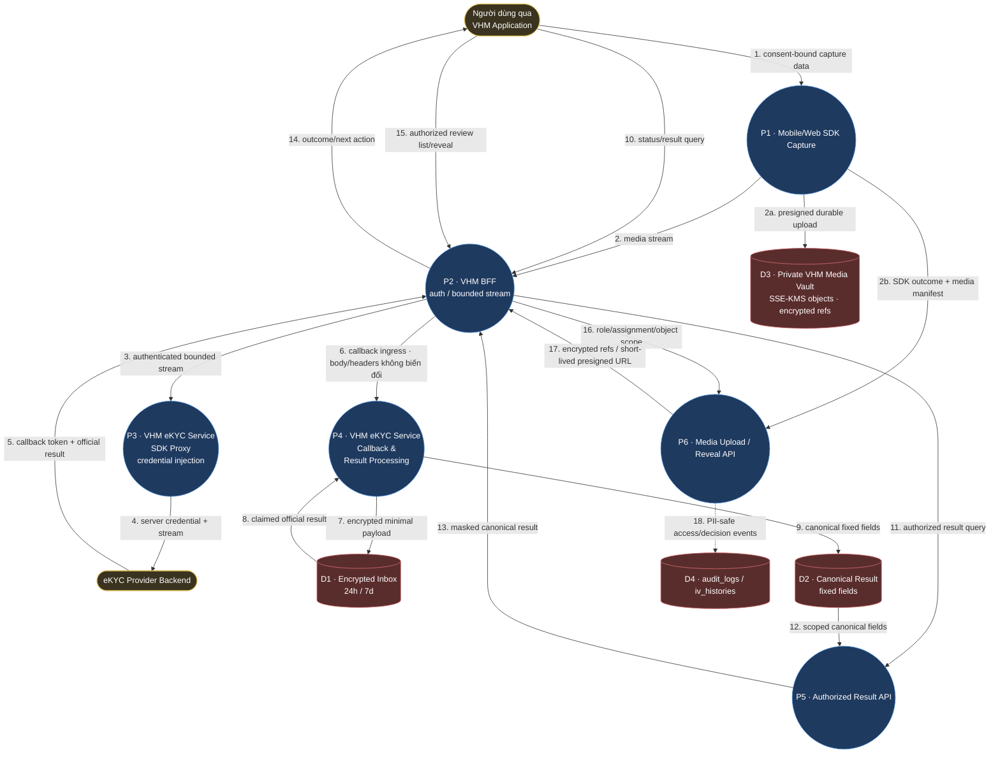
```mermaid
flowchart TB
    APP(["Người dùng qua<br/>VHM Application"]):::entity
    BACKEND(["eKYC Provider Backend"]):::entity
    CAPTURE(("P1 · Mobile/Web SDK Capture")):::process
    BFF(("P2 · VHM BFF<br/>auth / bounded stream")):::process
    EKYC_SERVICE_PROXY(("P3 · VHM eKYC Service<br/>SDK Proxy<br/>credential injection")):::process
    RESULT_PROCESS(("P4 · VHM eKYC Service<br/>Callback &<br/>Result Processing")):::process
    RESULT_API(("P5 · Authorized Result API")):::process
    MEDIA_API(("P6 · Media Upload / Reveal API")):::process
    INBOX[("D1 · Encrypted Inbox<br/>24h / 7d")]:::sensitive
    RESULT[("D2 · Canonical Result<br/>fixed fields")]:::sensitive
    MEDIA[("D3 · Private VHM Media Vault<br/>SSE-KMS objects · encrypted refs")]:::sensitive
    AUDIT[("D4 · audit_logs / iv_histories")]:::sensitive

    APP -->|"1. consent-bound capture data"| CAPTURE
    CAPTURE -->|"2. media stream"| BFF
    CAPTURE -->|"2a. presigned durable upload"| MEDIA
    CAPTURE -->|"2b. SDK outcome + media manifest"| MEDIA_API
    BFF -->|"3. authenticated bounded stream"| EKYC_SERVICE_PROXY
    EKYC_SERVICE_PROXY -->|"4. server credential + stream"| BACKEND
    BACKEND -->|"5. callback token + official result"| BFF
    BFF -->|"6. callback ingress · body/headers không biến đổi"| RESULT_PROCESS
    RESULT_PROCESS -->|"7. encrypted minimal payload"| INBOX
    INBOX -->|"8. claimed official result"| RESULT_PROCESS
    RESULT_PROCESS -->|"9. canonical fixed fields"| RESULT
    APP -->|"10. status/result query"| BFF
    BFF -->|"11. authorized result query"| RESULT_API
    RESULT -->|"12. scoped canonical fields"| RESULT_API
    RESULT_API -->|"13. masked canonical result"| BFF
    BFF -->|"14. outcome/next action"| APP
    APP -->|"15. authorized review list/reveal"| BFF
    BFF -->|"16. role/assignment/object scope"| MEDIA_API
    MEDIA_API -->|"17. encrypted refs / short-lived presigned URL"| BFF
    MEDIA_API -.->|"18. PII-safe access/decision events"| AUDIT

    classDef entity fill:#3a3320,stroke:#d9b84a,color:#fff;
    classDef process fill:#1f3a5f,stroke:#4a90d9,color:#fff;
    classDef sensitive fill:#5a2d2d,stroke:#d96f6f,color:#fff;
```

- Provider transit tuân thủ `MEDIA-01`; durable upload/reveal tuân thủ
  `MEDIA-STORE-01`, `DATA-01` và `REVIEW-01`.
- Provider media/raw result retention tối đa `24 giờ` và phải đủ cho reconciliation.
- Callback payload chỉ lưu mã hóa tạm thời để async process.
- Canonical sensitive field chỉ lưu nếu nằm trong fixed approved result set.

### 7.2.5. Retention and purge policy

Các giá trị sau là technical maximum baseline. Data Privacy/Legal có quyền yêu cầu
thời hạn ngắn hơn. Mọi yêu cầu kéo dài phải có purpose, lawful basis, owner,
approval và cập nhật DPIA/DPA trước khi thay đổi cấu hình.

| **Dữ liệu** | **Retention tính từ** | **Thời hạn tối đa** | **Purge mechanism** | **Owner/approval** |
| --- | --- | --- | --- | --- |
| Verification session/run và Canonical Result fixed fields | `terminalAt` | `90 ngày` | Xóa encrypted sensitive fields/check details; giữ tombstone tối thiểu không chứa PII để chống xử lý lặp | Product + Data Privacy/Legal — phải ratify trước go-live |
| State/access history có PII reference | `terminalAt` | `90 ngày` | Xóa/anonymize subject/business reference; giữ aggregate không định danh | Product + Data Privacy/Legal |
| Callback Inbox payload — `PROCESSED` | `processedAt` | `24 giờ` | Batch hard-delete ciphertext sau khi result/history commit thành công | Ops + Data Privacy |
| Callback Inbox payload — `FAILED/QUARANTINED` | `lastFailedAt` | `7 ngày` | Retry có giới hạn, export troubleshooting bị cấm; hết hạn hard-delete và ghi purge audit | Ops + ANBM + Data Privacy |
| Callback event metadata/hash không chứa PII | `receivedAt` | `90 ngày` | Batch delete theo partition/date; terminal guard vẫn là lớp chống duplicate cuối | Ops/ANBM |
| Masked application/security log | `eventTime` | `30 ngày` | Index lifecycle deletion; không archive body/PII | Ops/ANBM/Data Privacy |
| Audit record không chứa payload/media | `eventTime` | `365 ngày` | Delete/anonymize theo audit standard; extension cần compliance approval | ANBM/Audit/Data Privacy |
| VHM Media Vault object + encrypted reference | Theo terminal/review/legal event của approved policy class | Không hard-code trong TDD; `retainUntil` được tính từ versioned purpose-bound policy | Delete object/version/derived artifact/encrypted ref; expire cached/presigned access; legal hold cần owner/reason/expiry | Product + Legal/Data Privacy + ANBM/Ops — go-live policy gate |
| S3 Intake/orphan/incomplete multipart | Upload-session creation/last part | Short operational window theo approved upload policy; không dùng làm business retention | Abort multipart, delete orphan/unsubmitted object và ghi purge metric/audit | Cloud/Ops/ANBM |
| eKYC Provider Backend media/raw result | Provider completion | Theo signed provider contract/DPA | Provider lifecycle/deletion API hoặc contract evidence; VHM copy tuân thủ policy riêng | Legal/Data Privacy/Provider — DPA sign-off bắt buộc |
| RDS automated backup/PITR chứa record chưa purge | Backup creation | `35 ngày` | Hết backup window tự xóa; restore phải chạy purge/tombstone replay trước mở truy cập | DBA/Ops/Data Privacy |

Purge implementation bắt buộc:

- Job chạy tối thiểu mỗi ngày, batch `<= 500` rows, dùng lease/`SKIP LOCKED`, có
  rate limit và không khóa bảng dài.
- Eligibility dùng server timestamp và approved policy version; legal hold loại
  record khỏi purge nhưng phải có owner, reason và expiry.
- Callback payload purge chỉ chạy khi canonical transaction đã commit hoặc record
  đã hết quarantine window; không giữ ciphertext để debug vô thời hạn.
- Canonical purge xóa field/check nhạy cảm và subject reference; tombstone chỉ giữ
  `verificationId`, terminal status, policy version, purge time và non-PII hash cần
  cho idempotency/audit.
- Provider deletion phải có request/response hoặc contractual lifecycle evidence;
  lỗi deletion vào retry queue và alert theo SLA.
- Metrics: eligible/deleted/failed rows, oldest eligible age, legal-hold count và
  provider-deletion backlog. Purge failure quá `24 giờ` phải alert Data Privacy/Ops.
- Restore từ backup phải chạy retention sweep trước khi cho application traffic;
  backup expiry không được dùng để kéo dài live-data retention.
- Media purge phải xóa S3 current/noncurrent versions, derived object, encrypted
  DB reference và cached reveal entry; presigned URL còn hiệu lực phải được giảm
  rủi ro bằng short validity/bucket emergency deny runbook.
- Mỗi media record lưu `retentionPolicyId`, `retentionClass`, `retainUntil` và
  legal-hold state. Duration nằm trong external approved policy, không hard-code
  hoặc suy ra từ generic “manual review”.

### 7.2.6. Data subject request

- Xác minh requester và scope trước export/delete.
- Tìm theo opaque subject/business mapping đã được BFF authorize.
- Export chỉ field được phép, đã mask theo legal/privacy rule.
- Delete/anonymize session/result theo retention/legal hold và ghi audit.
- Xóa Media Vault object/version/encrypted reference theo retention/legal hold và
  invalidate reveal cache; không export raw URL trong data-subject response.
- Gửi provider deletion request khi contract/purpose yêu cầu.
- Backup deletion xử lý theo backup expiry/tombstone policy đã phê duyệt.

### 7.2.7. Access controls

- Service access theo least privilege và business-object scope.
- DBA không mặc định đọc plaintext sensitive fields.
- Unmask và bulk export cần elevated role, reason, approval/audit theo policy.
- Production support không được xem raw callback/media; chỉ approved Manual Review
  role trong assigned object scope được list/reveal media theo `REVIEW-01`.
- Periodic access review và key/secret rotation evidence bắt buộc.

## 7.3. Threat Model

| **Threat** | **Vector** | **Mitigation** |
| --- | --- | --- |
| Client giả kết quả | Mobile/Web bị sửa gửi result giả | `RESULT-01` |
| Lộ credential | Secret trong client/repo/log | `CRED-01`, secret scanning/rotation |
| Callback spoof | Gọi public callback giả | `CALLBACK-01`, WAF |
| Callback replay/duplicate | Gửi lại event/result | `CALLBACK-01` |
| IDOR/cross-domain | Đổi verificationId/businessRef hoặc giả mạo domain | Object/domain authorization |
| Web XSS lấy token | Script độc hại | CSP, encoding, dependency security, memory-only token |
| Multi-tab/run race | Hai client run cho một session | Server-issued runId, lease, idempotency, state guard |
| Mobile tamper | Modified client/device | SDK integrity/security signal; server official result |
| PII leakage | Log/APM/analytics/crash report | Redaction, allowlist logging, DLP/PII scan |
| Media leakage | BFF/VHM eKYC Service vi phạm media handling | `MEDIA-01`, metadata allowlist, DLP test |
| Presigned upload misuse | URL bị lộ/reuse, overwrite sai media slot hoặc upload content giả | `MEDIA-STORE-01`, exact random key/method/header/checksum, short expiry, no read/list, finalizer validation |
| Client/provider media mismatch | Client upload khác bytes provider đã xử lý | Manifest checksum/provenance/provider correlation; nếu provider không echo digest thì ghi open risk và không tuyên bố byte-for-byte equivalence |
| Cross-verification reveal | Gửi encrypted ref của verification khác | `REVIEW-01`, bind toàn bộ ciphertext với verification/run; whole-call fail, security-deny event |
| Presigned reveal URL leakage | URL bị copy qua log/referrer/chat hoặc cache chéo scope | Short validity, no URL log/analytics, scoped cache key/TTL, response no-store và emergency bucket deny |
| Insider media reveal | Reviewer lạm dụng assignment/quyền | Platform role + ABAC assignment/purpose, step-up, bounded batch, PII-safe access audit và periodic review |
| Audit bypass | URL được trả khi audit write fail | Fail closed; `REVEAL_IDENTITY_MEDIA` commit trước response và alert audit-pipeline failure |
| Provider compromise | Payload/resource độc hại | Schema validation, no URL fetch, fixed mapping, incident runbook |
| Insider unmask | Lạm dụng quyền support | Elevated scope, reason, access audit, periodic review |
| DB restore duplicate | Inbox/result xử lý lại | Unique keys, terminal guard, idempotent worker |
| Dependency outage | Provider/DB unavailable | Circuit breaker, reconciliation, Multi-AZ, backup/recovery |

## 7.4. Security Test Cases tối thiểu

- Callback token thiếu/sai/hết hạn/sai scope và replay/duplicate.
- Duplicate/out-of-order callback và cùng event ID khác payload.
- Callback body quá size/depth, wrong content type và malicious resource URL.
- Cross-domain/business-object create/status/result/retry access.
- Client gửi OCR fields/decision/score/media/token trong submitted/error event.
- Concurrent create/run/retry và stale client event.
- Mobile token persistence, telemetry leakage và SDK integrity evidence.
- Web XSS/CSP/CSRF/CORS, storage leakage và multi-tab run conflict.
- Presigned upload expiry/reuse, wrong key/method/header/MIME/size/checksum,
  multipart abort/resume, orphan purge và no client list/read.
- Client media checksum/provenance correlation với active verification/run; mismatch
  không được tự động accept hoặc overwrite.
- Manual Review role/assignment/business-object IDOR cho cả list và reveal; reveal
  thiếu/sai `caseId`/`reasonCode`, step-up thiếu/hết hiệu lực và exceptional access
  thiếu Supervisor/JIT approval hoặc `ticketRef` phải bị từ chối.
- Reveal batch `0/1/16/>16`, duplicate refs, mixed valid/foreign refs, tampered
  AES-GCM ref, whole-call failure và không partial URL.
- Presign cache L1 hit/L2 hit/Redis failure direct fallback, scoped cache key,
  cache TTL nhỏ hơn URL validity và expired URL rejection.
- Audit `VIEW_IDENTITY_MEDIA`/`REVEAL_IDENTITY_MEDIA` đúng actor/role/entity/case,
  purpose/reason/step-up/request/outcome/type/part/count; audit không chứa
  ciphertext/path/URL/PII và audit-write failure fail closed.
- Result API mask/unmask, cache-control và access audit.
- PII/secret scan repo/image/ConfigMap/log/APM/analytics/crash report.
- `DP-01`, `MEDIA-01`, `MEDIA-STORE-01`, `CRED-01`, `RESULT-01`,
  `CALLBACK-01`, `DATA-01`, `AUTH-01`, `REVIEW-01` và `RETRY-01` có automated evidence tương ứng.
- Callback inbox encryption, TTL, purge và backup behavior.
- Key/secret rotation overlap và revoked-key rejection.
- DB/provider outage, callback lost và worker restart.
- Restore test không finalize terminal result lần hai.

# **8. Backup, Recovery & Operational Readiness**

## 8.1. Phạm vi backup

Backup:

- `identity_verification` và retry links.
- Verification run, checks, fixed normalized fields và Canonical Result.
- Callback inbox metadata/encrypted payload còn trong TTL.
- Media manifest, AES-GCM-encrypted object references, retention/legal-hold metadata,
  manual-review access audit và decision history.
- Media Vault objects/versions/replicas nằm trong approved media DR policy; backup
  không được kéo dài retention hoặc phục hồi object đã purge hợp lệ.
- State/access history và reconciliation schedule.
- Versioned non-secret configuration/policy metadata.
- Secret/key references và rotation metadata theo Secret Manager/KMS strategy.

Không backup như business source:

- Mobile/Web/SDK cache.
- Redis ephemeral rate-limit/replay entries.
- VHM SDK session/callback access token.
- S3 Intake/orphan/incomplete multipart media chưa được submit/finalize.
- Presigned upload/download URL và Caffeine/Redis presign cache.
- Raw provider payload ngoài encrypted Callback Inbox TTL.

## 8.2. Backup strategy

- RDS Multi-AZ, automated backup và PITR.
- Backup encryption bằng KMS và access role riêng.
- Cross-account/cross-region copy theo VHM DR policy nếu được phê duyệt.
- Retention backup phù hợp Data Privacy; không giữ sensitive data vô hạn.
- Restore test định kỳ trên isolated environment với masked/synthetic validation.
- Config versioned repository và immutable artifact registry là nguồn phục hồi deployment.
- Secret/key recovery theo Secrets Manager/KMS runbook; không export plaintext key.
- S3 Media Vault dùng versioning/replication/backup theo approved DR và Data Privacy
  policy; lifecycle áp dụng cho current/noncurrent version và replica.
- RDS media manifest và S3 object inventory được đối soát sau restore. Object thiếu,
  dangling encrypted ref hoặc object đã quá `retainUntil` phải quarantine/purge;
  không mở Manual Review trước khi consistency sweep hoàn tất.

### 8.2.1. Reliability decisions

| **Component/service** | **Reliability pattern** | **Failure handling** | **Backup/recovery consideration** | **Approval required** |
| --- | --- | --- | --- | --- |
| Verification/Result API | Stateless horizontal replicas, readiness và circuit breaker | Timeout/bounded retry cho safe operation; không retry blind mutation | Artifact/config redeploy + RDS recovery | Không nếu theo platform standard |
| Callback API/Inbox | Durable inbox, dedupe key và independent scaling | Durable ack trước async processing; quarantine invalid schema | Inbox nằm trong RDS/PITR nhưng payload tuân thủ TTL | ANBM/Ops cho auth/TTL baseline |
| Reconciliation Worker | Lease/`SKIP LOCKED`, backoff và provider quota guard | Recover callback lost/stuck session; hết budget thành `PROVIDER_ERROR` | Schedule/state phục hồi từ PostgreSQL | eKYC Provider Backend/Ops cho quota/recovery budget |
| PostgreSQL | RDS Multi-AZ, connection pool, PITR | Automatic failover; degrade create/read theo incident mode | Restore drill chứng minh RTO/RPO và idempotency | DBA/Ops |
| Redis | Managed service, TTL và không là source of truth | Cache/replay degradation không được làm sai official state | Có thể rebuild; không yêu cầu business restore | Không |
| S3 Intake/Media Upload Finalizer | Direct presigned upload + idempotent manifest + orphan lifecycle | Upload URL có thể cấp lại; finalizer bounded retry; không expose terminal khi required media chưa `READY` | Intake không backup; submitted object phải finalize hoặc purge theo policy | Cloud/Ops/ANBM |
| S3 Media Vault | Private SSE-KMS object store, version/lifecycle/inventory | S3/KMS lỗi giữ evidence-pending; reveal fail closed | Versioning/replication/restore theo approved DR; retention sweep ngăn resurrect purged media | Cloud/Ops/Data Privacy |
| Reveal API/Presign cache | Stateless API + Caffeine L1/Redisson L2 + direct-presign fallback | Redis lỗi fallback direct; audit store lỗi không trả URL | Cache/presigned URL không backup; rebuild/expire tự nhiên; encrypted refs phục hồi từ RDS | ANBM/Ops/Audit |
| eKYC Provider Backend dependency | Timeout, circuit breaker, callback + Get Result reconciliation | Tạm dừng create khi dependency incident; không biến lỗi kỹ thuật thành `REJECTED` | Khôi phục result trong provider retention window | SLA/risk acceptance bắt buộc |

Single point of dependency còn lại là eKYC Provider Backend của một provider; rủi ro và
acceptance được ghi tại Architecture Risk Register.

### 8.2.2. Provider outage và backlog recovery

- Khi provider unavailable, VHM dừng create/session mới theo circuit-breaker policy;
  các session đã submit giữ `PROCESSING`, không chuyển thành `REJECTED` do lỗi kỹ thuật.
- Callback API vẫn durable receive nếu provider còn gửi được callback. Reconciliation
  tạm backoff có quota guard và được ưu tiên drain ngay khi provider phục hồi.
- Từ thời điểm provider phục hồi, Ops ưu tiên session có retention deadline gần nhất.
  Recovery phải hoàn tất trước provider retention với approved safety margin.
- Maximum admissible reconciliation backlog không dùng một số đoán trước. Ops tính
  theo `sustainable Get Result throughput × thời gian còn lại trước recovery deadline`
  và chốt bằng provider quota cùng load-test evidence tại mục 6.4.2.
- Nếu outage làm vi phạm approved safety margin, kích hoạt critical incident,
  provider escalation và retention-at-risk dashboard. Outage kéo dài bằng hoặc vượt
  provider retention không được coi là recoverable mặc định.
- Nếu callback mất và Get Result đã hết retention, đóng attempt ở `PROVIDER_ERROR`
  với reason `RESULT_UNRECOVERABLE_AFTER_RETENTION`; không reuse media/result,
  cho `CONTACT_SUPPORT` hoặc whole-attempt retry theo policy. Sự cố theo cụm phải mở
  incident và review lại retention/quota/backlog control.

## 8.3. RTO & RPO

| **Hạng mục** | **Baseline** | **Ghi chú** |
| --- | --- | --- |
| RTO | `<= 4 giờ` | Bao gồm DB restore, service deploy, validation và worker resume |
| RPO | `<= 15 phút` | Theo PITR/backup configuration được Ops phê duyệt |
| Provider result recovery | Trong provider retention window | Get Result chỉ qua Reconciliation Job |
| Media evidence recovery | Theo approved media DR tier, không vượt `retainUntil` | Khôi phục RDS manifest + S3 object/reference consistency và KMS decrypt-ref evidence |
| Configuration recovery | Versioned repository + approved baseline | Bao gồm Mobile/Web SDK compatibility |
| Secret/key recovery | Secrets Manager/KMS runbook | Rotation/revocation evidence bắt buộc |

RTO/RPO cuối cùng phải được System Owner và Operations xác nhận bằng restore drill.

## 8.4. Recovery verification checklist

- Schema/version/index/constraint đúng.
- Callback route/auth/key hoạt động.
- Create/status/result authorization và masking hoạt động.
- Có thể dừng create trong khi callback/reconciliation vẫn chạy.
- Pending/failed inbox được xử lý bounded và không finalize trùng.
- Non-terminal session được reconcile trong provider retention window.
- Terminal state không bị đảo bởi callback/client event trễ.
- Retry chain, idempotency và active-session constraint còn đúng.
- Callback encrypted payload TTL/purge job resume đúng.
- S3 Media Vault object/version/replica khớp manifest/encrypted ref và không có
  object đã quá retention được mở lại.
- Presigned upload/reveal config, KMS media-ref decrypt và scoped cache fallback hoạt động.
- `VIEW_IDENTITY_MEDIA`/`REVEAL_IDENTITY_MEDIA` audit fail closed và không chứa
  ciphertext/path/URL/PII sau recovery.
- Dashboard/alerts/incident routing hoạt động.
- Restore log không chứa PII/secret.
- Data retention/deletion job tiếp tục đúng policy.
- Đạt RTO/RPO trong evidence của restore drill.

## 8.5. Operational Readiness

| **Item** | **Baseline/decision** | **Evidence/approval** |
| --- | --- | --- |
| System criticality/security level | Tier 2 — Business Critical; xử lý dữ liệu định danh/sinh trắc học | System Owner + ANBM + Data Privacy |
| RTO/RPO | RTO `<=4h`, RPO `<=15m` | Restore drill và Ops sign-off |
| Blast radius — client channel | Mobile hoặc Web lỗi không được làm hỏng official result của channel còn lại | Channel dashboard/E2E evidence |
| Blast radius — provider | Có thể dừng create mới; callback/reconciliation tiếp tục trong safe mode | Incident mode/runbook và provider escalation |
| Blast radius — callback worker | API vẫn durable receive tới capacity; backlog được alert và bounded drain | Load/restart test |
| Blast radius — media upload/finalizer | Có thể dừng create nếu evidence-ready SLA bị vi phạm; uploaded object bounded và không mất manifest | S3/KMS/finalizer incident drill |
| Blast radius — reveal/audit | Reveal fail closed khi authorization, crypto, S3 hoặc audit unavailable; core result read không tự lộ media | Manual Review incident/OAT evidence |
| DR model | Multi-AZ HA + backup/PITR restore; cross-region/cross-account theo VHM DR approval | DBA/Cloud/Ops approval |
| Operational ownership | Service owner, incident route, on-call/escalation và provider contacts: TBD | Go-live blocker |
| Known exceptions | Một provider; provider SLA/location/retention và organizational-standard version chưa chốt | Risk acceptance hoặc đóng trước approval |

## 8.6. Testing & Quality Strategy

| **Test type** | **Scope** | **Environment** | **Success criterion/release gate** |
| --- | --- | --- | --- |
| System/Integration | State guard, DB constraint/locking, callback auth/dedupe, normalization, masking | Dev/SIT | Critical branches `>=80%`; toàn bộ contract/DB test pass. |
| Provider contract | SDK init/OCR/liveness, callback, Get Result, error/schema evolution fixtures | SIT/provider staging | Pass supported/unsupported/duplicate/timeout cases; no raw payload leakage. |
| Mobile/Web E2E | OCR_ONLY và FULL_EKYC; permission/lifecycle/front-back/result-page OFF | UAT/provider staging | Happy path và failure path cho cả Mobile/Web; official-result rule luôn đúng. |
| Media persistence | Presigned PUT/multipart, checksum/type/size, submit/callback race, finalizer, retention/orphan purge | SIT — isolated media bucket | Pass/fail media đều `READY`; không cross-run overwrite/list/read; terminal guard đúng. |
| Manual Review reveal/audit | Role/assignment/object scope, case/reason/recent step-up, exceptional approval/ticket, cap/dedupe/binding, encrypted-ref tamper, cache fallback, presign expiry và audit | SIT/OAT | Không cross-verification/partial reveal; stale step-up/invalid context bị deny; audit PII-safe; audit failure không trả URL. |
| Performance/capacity | API p95/p99, callback burst, inbox/reconciliation backlog, DB lock/pool | SIT — dedicated performance window | Đạt NFR và capacity target mục 6.4; không mất/duplicate finalization. |
| Security | AuthN/AuthZ/IDOR, callback token/replay, SDK streaming route, WAF/input, secrets/masking | SIT | Không còn Critical/High finding chưa được risk acceptance. |
| Resilience/chaos | Provider/DB/Redis outage, callback lost, worker restart, stale/duplicate event | SIT — isolated recovery window | State toàn vẹn, bounded recovery, alert đúng và không blind retry. |
| OAT/Recovery | Deploy/rollback, key rotation, PITR restore, backlog drain, dashboard/runbook | SIT | Đạt RTO/RPO; Operations sign-off. |
| PAT/UAT | Purpose, consent, UX, fixed fields, decision/retry messages | UAT | Product/Risk/Legal/Data Privacy sign-off. |

Test case chi tiết, automation suite và test data được quản lý trong Test Plan;
Appendix C là release checklist và không thay thế evidence của từng quality gate.

# **9. Risks & Open Issues/Tech Debt**

## 9.1. Architecture Risk Register

| **Risk ID** | **Category** | **Description** | **Business impact** | **Likelihood** | **Severity** | **Mitigation strategy** | **Residual risk** | **Owner** | **Status** |
| --- | --- | --- | --- | --- | --- | --- | --- | --- | --- |
| AR-001 | Availability/Integration | eKYC Provider Backend là một dependency/provider duy nhất | Không tạo mới hoặc hoàn tất eKYC trong thời gian dependency gián đoạn | Medium | High | Circuit breaker, safe-mode stop-create, callback inbox, reconciliation, SLA/escalation | Medium | Product/Ops/eKYC Provider Backend | OPEN — SLA TBD |
| AR-002 | Security | Callback payload chưa có chữ ký số; token TTL/overlap và provider signing capability chưa có evidence chính thức | Forged/replayed callback có thể làm sai quyết định xác minh | Medium | Critical | TLS, Dynamic Token, Client UUID/session binding, replay/dedupe, zero-downtime rotation; JWS/HMAC hoặc ANBM residual-risk acceptance | Low sau sign-off | ANBM/eKYC Provider Backend | OPEN — go-live blocker |
| AR-003 | Compliance/Data | Data location, subprocessor, retention baseline và deletion SLA chưa được Data Privacy/Legal ratify | Vi phạm privacy/cross-border requirement hoặc giữ biometric data quá hạn | Medium | Critical | `DATA-01`, DPA/DPIA, purpose-bound consent và deletion evidence | Medium | Legal/Data Privacy | OPEN — go-live blocker |
| AR-004 | Performance | Concurrent media streams, size/duration, TPS/callback burst và provider quota chưa chốt | Quá tải BFF/VHM eKYC Service/network/inbox hoặc vượt quota/cost | High | High | Capacity inputs, streaming load test, HPA/pool riêng, bounded buffer/worker, quota alert | Medium | Product/Ops | OPEN |
| AR-005 | Compatibility | Mobile/Web/SDK compatibility và lifecycle matrix chưa có evidence | Journey lỗi theo device/browser/version, tăng retry/drop-off | Medium | High | Pin version, preflight, cohort rollout, E2E matrix và rollback | Low/Medium | Client/SDK Teams | OPEN |
| AR-006 | Data/Security | Fixed result field, masking và retention chưa được chốt theo từng approved purpose | Over-collection hoặc lộ PII cho caller không đúng quyền | Medium | High | Fixed schema, allowlist, object authorization, masking/unmask audit | Low sau approval | Product/Business/Data Privacy | OPEN |
| AR-007 | Operations | Reconciliation vượt provider retention/quota khi callback backlog lớn hoặc provider outage kéo dài | Session treo hoặc official result không thể khôi phục | Medium | High | p95/oldest-age alert, approved recovery safety margin, bounded lease/backoff, quota-aware drain, `RESULT_UNRECOVERABLE_AFTER_RETENTION` runbook | Medium | Ops/eKYC Provider Backend | OPEN |
| AR-008 | Security/Performance | BFF/VHM eKYC Service vi phạm media handling | Rò rỉ dữ liệu nhạy cảm, memory/disk exhaustion và tăng blast radius | Medium | Critical | `MEDIA-01`, metadata allowlist và load/DLP evidence | Low sau sign-off | BFF/VHM eKYC Service/Ops/ANBM | OPEN — go-live blocker |
| AR-009 | Security/Data | Presigned upload/reveal URL bị lộ, reuse hoặc cache chéo security scope | Upload giả/overwrite media hoặc người không có quyền tải dữ liệu định danh/sinh trắc | Medium | Critical | Exact key/method/checksum, short expiry, no list/read, scoped cache, no URL log, bind refs và PII-safe audit | Low/Medium sau security test | ANBM/Cloud/Client/Manual Review | OPEN — go-live blocker |
| AR-010 | Integrity | Media client upload không chứng minh byte-for-byte giống media provider đã xử lý | Manual reviewer có thể xem evidence khác với input tạo official result | Medium | High | Checksum/provenance/providerSession correlation; yêu cầu provider/SDK digest khi có; không tuyên bố equivalence nếu thiếu evidence | Medium | Architect/SDK/eKYC Provider Backend/Risk | OPEN — decision/evidence required |
| AR-011 | Privacy/Cost | Media type mix, video scope và versioned retention classes chưa được phê duyệt | Over-retention biometric data, S3/KMS/egress cost và backup/purge không sizing được | High | Critical | Purpose registry, external retention policy, `retainUntil`, lifecycle/version purge, capacity/cost scenario và DPIA | Medium sau approval | Product/Legal/Data Privacy/Cloud/Finance | OPEN — go-live blocker |
| AR-012 | Security/Audit | Reveal audit/cache contract không fail closed hoặc lưu ciphertext/path/URL/PII | Không truy vết được disclosure hoặc audit trở thành nguồn rò rỉ | Medium | Critical | Audit-before-response, append-only events, PII-safe payload, cap/binding, cache TTL/scope và SIEM deny log | Low sau evidence | ANBM/Audit/Manual Review/Ops | OPEN — go-live blocker |

## 9.2. Open Issues/Technical Debt Register

| **Debt/Issue ID** | **System** | **Description** | **Reason/trade-off** | **Impact** | **Priority** | **Remediation plan** | **Effort** | **Owner** | **Resolution date** | **Status** |
| --- | --- | --- | --- | --- | --- | --- | --- | --- | --- | --- |
| TD-001 | VHM eKYC Service | L1 và L3 artefact links chưa được cung cấp | L2 được soạn trước khi các spec triển khai hoàn tất | Reviewer/dev khó truy vết contract chi tiết | High | Tạo/link API, client, DB và operations L3 tại metadata | TBD | Document Owner/Tech Leads | Trước implementation sign-off | OPEN |
| TD-002 | Governance | VHM IAM/ANBM/Data Privacy/Observability standard version còn TBD | Chưa nhận canonical standard registry từ owner | Không chứng minh được compliance/deviation theo version | High | Cập nhật metadata và mapping control sau khi owner cung cấp | TBD | Architecture/ANBM/Data Privacy/Ops | Trước L2 approval | OPEN |
| TD-003 | Capacity/Cost | Capacity target, AWS calculator export và provider commercial estimate chưa được cung cấp | Chưa có forecast volume/quota và quotation | Không thể phê duyệt sizing, budget và performance gate | High | Chốt worksheet 6.4.2, chạy load model và đính kèm cost estimate | TBD | Product/Cloud/Ops/Finance | Trước production readiness | OPEN |
| TD-004 | Media/Privacy | Purpose registry, media retention classes, video enablement và reviewer role/assignment policy chưa có approved artefact | Requirement mới được chốt ở L2 trước governance inputs | Không thể chốt lifecycle, access và DPIA | High | Tạo/link versioned policy artefacts; giữ duration ngoài TDD nhưng bắt buộc effective policy trước go-live | TBD | Product/Legal/Data Privacy/ANBM | Trước L2 approval/go-live | OPEN |
| TD-005 | Media Integrity | SDK/provider digest để đối chiếu VHM-uploaded media với provider-processed media chưa được xác nhận | Hai upload path có thể không chứng minh cùng bytes | Manual-review evidence có residual provenance risk | High | Chốt SDK artifact/checksum contract và provider correlation/digest evidence hoặc risk acceptance | TBD | SDK/eKYC Provider Backend/Architect/Risk | Trước manual-review sign-off | OPEN |

Các item chưa đóng không được ngầm coi là chấp nhận rủi ro. Risk acceptance cần
owner, phạm vi, thời hạn và approver tương ứng được ghi trong phiên bản phê duyệt.

# **Glossary**

| **Thuật ngữ** | **Định nghĩa** |
| --- | --- |
| OCR | Optical Character Recognition - đọc và chuẩn hóa dữ liệu từ ảnh giấy tờ. |
| eKYC | Xác minh danh tính điện tử bằng document verification, liveness và face matching. |
| OCR_ONLY | Journey chỉ đọc front/back; kết thúc `COMPLETED`, `ekycOutcome=NOT_PERFORMED`. |
| FULL_EKYC | Journey OCR front/back → liveness → face matching; pass mới thành `VERIFIED`. |
| VHM Application | Ứng dụng Mobile và Web của VHM tích hợp eKYC SDK. |
| VHM eKYC Service | Service trung tâm sau VHM BFF, quản lý session/result và là integration/proxy point duy nhất gọi eKYC Provider Backend bằng server credential. |
| VHM BFF | Điểm ingress từ Mobile/Web/SDK/eKYC Provider Backend; xác thực, authorize, áp policy và stream request xuống VHM eKYC Service; không giữ provider credential hoặc xử lý eKYC result. |
| eKYC SDK | SDK chạy trên Mobile/Web để điều khiển capture và gửi init/OCR/liveness tới VHM BFF. |
| eKYC Provider Backend | Hệ thống xử lý OCR, liveness và face matching; gửi callback/cung cấp Get Result. |
| Provider Adapter | Lớp cô lập API/auth/payload/error của eKYC Provider Backend khỏi VHM contract. |
| Official Result | Kết quả server-to-server từ callback đã xác thực hoặc Get Result qua reconciliation. |
| Canonical Result | Mô hình kết quả chuẩn VHM, không phụ thuộc raw provider payload. |
| Callback Inbox | Bảng durable receive/dedupe, lưu payload tối thiểu đã mã hóa theo TTL. |
| Reconciliation | Job khôi phục callback quá SLA hoặc session treo bằng Provider Get Result. |
| Whole-attempt Retry | Tạo verification/provider session mới; không tái sử dụng result/media của attempt trước. |
| Idempotency Key | Khóa chống tạo trùng khi request được gửi lại. |
| Replay Guard | Event ID/nonce hoặc result version/payload hash ngăn callback bị xử lý lặp theo provider contract. |
| Fixed Result Fields | Bộ field Canonical Result cố định đã được Product/Privacy phê duyệt. |
| Media Upload Session | Server-created slots và short-lived exact presigned PUT/multipart requests bind verification/run/type/size/checksum. |
| Media Manifest | Danh sách server-issued media IDs, type/part, checksum, object version và state được client submit idempotently. |
| VHM Media Vault | Private S3 storage do VHM sở hữu cho purpose-approved document/direct-face/liveness media; object dùng SSE-KMS và reference/path lưu AES-GCM encrypted. |
| Encrypted Media Reference | AES-GCM ciphertext đại diện internal S3 object path; plaintext path chỉ transient trong trusted reveal service. |
| Manual Review Reveal | Platform-role/assignment-scoped flow list encrypted refs và bounded reveal thành short-lived presigned download URL với PII-safe audit. |
| `VIEW_IDENTITY_MEDIA` | Append-only audit event ghi actor đã list encrypted media refs của một verification. |
| `REVEAL_IDENTITY_MEDIA` | Append-only audit event ghi actor được cấp short-lived URL cho selected media types/parts; không chứa ciphertext/path/URL. |
| Terminal State | `COMPLETED`, `VERIFIED`, `REJECTED`, `NEED_RETRY`, `PROVIDER_ERROR`, `CANCELLED`, `EXPIRED`. |

---

# **Appendix A. External Inputs & Confirmations**

> Các mục dưới đây là input/evidence bắt buộc để hoàn tất implementation và
> approval. Đây không phải lựa chọn kiến trúc còn để ngỏ; thiếu input tương ứng thì
> không được qua gate được ghi trong cột cuối.

## A.1. Business & Scope Inputs

| **Input cần xác nhận** | **Owner** | **Gate/Deadline** |
| --- | --- | --- |
| Domain code/use case/business object được phép tạo session | Product/Business Owner | Trước API contract sign-off |
| Hai journey `OCR_ONLY`, `FULL_EKYC` và channel áp dụng | Product/Risk | Trước SDK profile configuration |
| Document type `NATIONAL_ID_CHIP`, front/back và validation rules | Product/Risk/SDK Team | Trước OCR integration test |
| Fixed result field set và masking cho VHM Application | Product/Business/Data Privacy | Trước Result API contract test |
| Consent text/version/purpose/withdrawal behavior | Product/Legal/Data Privacy | Trước UAT |
| Fixed decision mapping, threshold và reason code UX | Product/Risk/Architect | Trước decision contract test |
| Whole-attempt retry cap, user message và support action | Product/Risk/Ops | Trước failure-path UAT |
| Business owner chịu trách nhiệm sử dụng result | Business Owner | Trước production readiness |
| Approved purpose registry cho media persistence/manual review/dispute; không dùng mô tả “nhiều mục đích” | Product/Legal/Data Privacy | Trước consent/privacy sign-off |
| Platform reviewer roles, assignment scope, manual decision và override/four-eyes policy | Business Owner/Risk/ANBM | Trước Manual Review API sign-off |

## A.2. Mobile & Web SDK Inputs

| **Input cần xác nhận** | **Owner** | **Gate/Deadline** |
| --- | --- | --- |
| SDK package/version cho Mobile và Web | SDK/Client Teams | Trước integration build |
| Mobile/Web client compatibility matrix | SDK/Client Teams | Trước build/UAT |
| Proxy compatibility theo từng SDK version: override đủ init/OCR/liveness endpoint và header, TLS/certificate-pinning behavior, provider credential handling | SDK Technical Team/eKYC Provider Backend | Trước SDK Proxy implementation |
| Camera permission, capture UX và quality guidance | SDK/Product/UX | Trước journey UAT |
| Front/back gửi cùng call hay lần lượt; fail-fast semantics | SDK Technical Team | Trước two-side implementation |
| Completion/close/error event và payload contract | SDK Technical Team | Trước client lifecycle integration |
| Result page `OFF` nhưng completion/close event vẫn phát | SDK Technical Team | Trước submitted integration test |
| Liveness/face behavior trong `FULL_EKYC` | SDK/Product/Risk | Trước FULL_EKYC E2E |
| Mobile background/force-close/reopen behavior | Mobile/SDK Team | Trước lifecycle test |
| Mobile certificate-pinning decision; nếu bật phải có VHM BFF primary/backup SPKI pin, rollover và compatibility evidence | ANBM/Mobile/SDK Team | Trước security sign-off |
| Web refresh/reopen/multi-tab behavior | Web/SDK Team | Trước lifecycle test |
| Branding, localization, accessibility và security behavior | Product/UX/Client Teams | Trước UAT |
| SDK expose media artifact cho cả pass/fail, type/logical part/pose và checksum contract | SDK/Client Teams | Trước presigned upload implementation |
| Document/direct-face/liveness video media matrix, max size/duration và multipart/resume behavior | SDK/Product/ANBM/Ops | Trước media load/security test |
| Bằng chứng client-uploaded artifact tương ứng provider-processed artifact hoặc explicit provenance risk acceptance | SDK/eKYC Provider Backend/Risk | Trước Manual Review UAT |

## A.3. eKYC Provider Backend Integration Inputs

| **Input cần xác nhận** | **Owner** | **Gate/Deadline** |
| --- | --- | --- |
| SDK init/OCR/liveness endpoint, multipart field, response và error contract | eKYC Provider Backend/Backend Team | Trước Provider Adapter build |
| Streaming timeout/body-size/part-count và idempotency/retry semantics | eKYC Provider Backend/Backend Team | Trước proxy/load test |
| Provider credential/header và Client UUID/proof contract | eKYC Provider Backend/ANBM | Trước integration/security test |
| Callback Dynamic Token/Fixed Token, token endpoint, scope/expiry, rotation overlap và event/version fields | eKYC Provider Backend/ANBM | Trước callback implementation |
| Callback JWS/HMAC signing capability và key-rotation contract; nếu không hỗ trợ phải có ANBM residual-risk acceptance | eKYC Provider Backend/ANBM | Trước security sign-off |
| Callback retry/backoff/ordering/duplicate semantics | eKYC Provider Backend/Backend Team | Trước callback contract test |
| Get Result final/pending/not-found/error/quota contract | eKYC Provider Backend/Ops | Trước reconciliation test |
| Provider media/raw-result retention `<= 24 giờ` và deletion evidence | eKYC Provider Backend/Data Privacy | Trước recovery/privacy sign-off |
| Canonical mapping fixtures cho success/failure/quality/technical errors | eKYC Provider Backend/QA | Trước contract test |
| Staging credentials/endpoints/allowlist và certificate chain | eKYC Provider Backend/DevOps/ANBM | Trước SIT |
| SLA, maintenance, incident contacts và escalation | eKYC Provider Backend/Ops | Trước production readiness |

## A.4. Security & Privacy Inputs

| **Input cần xác nhận** | **Owner** | **Gate/Deadline** |
| --- | --- | --- |
| DPA/DPIA, data location và subprocessor list | Data Privacy/Legal | Go-live blocker |
| Consent lawful basis và approved purpose | Data Privacy/Legal/Product | Trước UAT |
| Provider media/raw-result retention `<= 24 giờ`, deletion SLA và evidence | Data Privacy/Legal/eKYC Provider Backend | Go-live blocker |
| Callback authentication/replay/key-rotation baseline, approved emergency-rotation RTO và signing/risk-acceptance evidence | ANBM/eKYC Provider Backend | Trước security test |
| Fixed field encryption/masking/unmask access | ANBM/Data Privacy/Business | Trước Result API UAT |
| Log/APM/analytics/crash-report data allowlist | ANBM/Data Privacy/Ops | Trước SIT |
| Mobile/Web security baseline và SDK integrity evidence | ANBM/Client Teams | Trước security sign-off |
| Data-subject export/delete và provider coordination | Data Privacy/Business/eKYC Provider Backend | Trước go-live |
| S3 Intake/Vault account/region/KMS/bucket policy, Block Public Access, version/replication/lifecycle evidence | Cloud/ANBM/Data Privacy | Go-live blocker |
| AES-GCM media-reference format, AAD/key version/rotation và tamper/foreign-ref behavior | ANBM/Backend Team | Trước reveal security test |
| Platform-neutral Reveal & Audit contract: role/assignment/object scope, cap 16, cache/URL expiry, PII-safe events và audit fail-closed | ANBM/Audit/Business Ops | Trước Manual Review sign-off |
| Versioned media retention policy classes, `retainUntil`, legal hold và full S3/ref/cache purge evidence | Legal/Data Privacy/Ops | Go-live blocker |

## A.5. NFR & Operations Inputs

| **Input cần xác nhận** | **Owner** | **Gate/Deadline** |
| --- | --- | --- |
| Daily volume, peak create/status/result TPS | Product/Ops | Trước capacity test |
| Concurrent SDK streams, media size/upload duration và bandwidth p95/p99 | Product/eKYC Provider Backend/Ops | Trước streaming load test |
| Callback burst TPS/payload size và provider quota | eKYC Provider Backend/Ops | Trước load test |
| p95/p99 target theo interface và availability SLA | System Owner/Ops | Trước NFR sign-off |
| Reconciliation delay/interval/batch/max attempts | Architect/Ops/eKYC Provider Backend | Trước recovery test |
| Callback inbox processed `24h`, failed/quarantine `7d`, metadata `90d` và purge evidence | Ops/Data Privacy | Trước DB migration sign-off |
| RTO/RPO, PITR, restore frequency và DR owner | System Owner/Ops | Trước production readiness |
| Dashboard/alert threshold, routing và on-call owner | Ops/Service Owners | Trước go-live |
| Cost quota/alert và stop-create rule khi incident | Product/Ops | Trước go-live |
| Presigned upload/finalizer throughput, S3 object/video growth, KMS requests và manual-review egress/concurrency | Product/Cloud/Ops | Trước media capacity/cost sign-off |
| Media evidence-ready SLO, orphan/finalizer backlog và reveal/audit availability/alert thresholds | System Owner/Ops/ANBM | Trước OAT/go-live |

---

# **Appendix B. ADR Log**

Đây là ADR index. Mỗi dòng phải liên kết tới ADR artefact độc lập có context,
options, decision, consequence và approver; trạng thái `Accepted` trong bản DRAFT
không thay thế sign-off chính thức.

| **ID** | **Decision** | **Rationale** | **Impact** | **Status** | **ADR artefact** |
| --- | --- | --- | --- | --- | --- |
| ADR-001 | VHM eKYC Service là service trung tâm sở hữu session/result và tích hợp eKYC Provider Backend | Tránh từng ứng dụng tích hợp provider riêng | Cần ownership và governance tập trung | Accepted baseline | TBD link |
| ADR-002 | Sử dụng một SDK/provider | Giữ integration và operations rõ ràng | Provider contract là dependency chính | Accepted baseline | TBD link |
| ADR-003 | Hỗ trợ Mobile và Web | Đáp ứng hai kênh VHM đã chốt | Cần compatibility/E2E matrix cho cả hai | Accepted baseline | TBD link |
| ADR-004 | Chỉ document `NATIONAL_ID_CHIP`, front/back | Thu hẹp mapping, test và data scope | Loại giấy tờ khác cần cập nhật TDD | Accepted baseline | TBD link |
| ADR-005 | Hai journey `OCR_ONLY` và `FULL_EKYC` | Tách đọc giấy tờ khỏi xác minh danh tính | State/result phải tách OCR/eKYC outcome | Accepted baseline | TBD link |
| ADR-006 | Tuân thủ `RESULT-01` | Chống giả mạo client result | Mobile/Web phải có processing UX | Accepted baseline | TBD link |
| ADR-007 | Callback đã xác thực là official-result ingress chính | Server-to-server trust | Cần callback auth/dedupe/durable inbox | Accepted baseline | TBD link |
| ADR-008 | Get Result theo `RESULT-01` | Khôi phục callback lost/session stuck | Không polling mọi session | Accepted baseline | TBD link |
| ADR-009 | Provider Adapter + Canonical Result | Cô lập provider payload | VHM contract ổn định và fixed schema | Accepted baseline | TBD link |
| ADR-010 | OCR_ONLY pass thành `COMPLETED`, không `VERIFIED` | Tránh khẳng định sai về danh tính | UX/API phải tách outcome | Accepted baseline | TBD link |
| ADR-011 | Retry whole attempt | Giữ history và front/back correlation rõ ràng | Không reuse ảnh/result attempt cũ | Accepted baseline | TBD link |
| ADR-012 | Tách provider transit `MEDIA-01` khỏi VHM durable media `MEDIA-STORE-01`/`DATA-01` | BFF/service không persist body nhưng VHM vẫn sở hữu S3 media theo approved purpose | Bắt buộc load/DLP/S3/privacy evidence | Accepted baseline | TBD link |
| ADR-013 | Callback payload mã hóa tạm thời trong inbox | Async durable processing cần payload | TTL/purge/encryption bắt buộc | Accepted baseline | TBD link |
| ADR-014 | Result API dùng bộ field cố định | Đủ Core Integration, dễ phê duyệt | Thay field cần Product/Privacy approval | Accepted baseline | TBD link |
| ADR-015 | PostgreSQL là source of truth | Transaction, locking, dedupe và PITR | Cần index/retention/restore test | Accepted baseline | TBD link |
| ADR-016 | Tuân thủ `DP-01`/`CRED-01` | VHM kiểm soát auth, credential và network audit | BFF/VHM eKYC Service chịu media throughput và cần resource pool tách control/data | Accepted baseline | TBD link |
| ADR-017 | Client upload pass/fail media vào VHM S3 bằng server-issued presigned PUT/multipart; backend sync từ provider ngoài scope | Bảo đảm VHM lưu bền độc lập callback/provider retention và tránh media body qua BFF | Cần client artifact/checksum, orphan cleanup, S3/KMS/capacity/privacy controls; đổi ingress path cần ADR mới | Accepted baseline | TBD link |
| ADR-018 | Submit manifest và official callback là hai milestone độc lập, hội tụ bằng short locked finalization guard | Chống race callback-before-submit và không làm mất media evidence | Terminal outcome chờ required media `READY`; cần idempotency/lock/load test | Accepted baseline | TBD link |
| ADR-019 | Manual Review list encrypted refs, bounded POST reveal và short-lived presigned S3 GET với PII-safe append-only audit | Khớp workflow vận hành, subject binding và không lộ plaintext path trong DB/API list | Presigned URL là bearer residual risk; cần expiry/scope/cache/no-log/audit fail-closed | Accepted with controls | TBD link |
| ADR-020 | Media retention duration nằm trong external versioned purpose-bound policy, không hard-code trong TDD | Cho phép Legal/Data Privacy ratify và thay đổi policy có governance | Mỗi media lưu policy ID/class/retainUntil; go-live bị chặn nếu thiếu effective policy | Accepted baseline | TBD link |

---

# **Appendix C. Go-live Checklist**

## C.1. Functional

- [ ] Create session idempotent và active-session concurrency.
- [ ] Bootstrap TTL/binding/lease và expired-token reissue.
- [ ] Mobile `OCR_ONLY` front/back pass/fail/whole-attempt retry.
- [ ] Web `OCR_ONLY` front/back pass/fail/whole-attempt retry.
- [ ] Mobile `FULL_EKYC` document/liveness/face pass và failure paths.
- [ ] Web `FULL_EKYC` document/liveness/face pass và failure paths.
- [ ] SDK result page `OFF`; completion/close event vẫn phát.
- [ ] Started/submitted/error/cancel idempotency và late-event handling.
- [ ] Pass/fail đều tạo presigned upload session, upload required media và submit server-issued manifest.
- [ ] Callback trước/sau submitted, duplicate/out-of-order và finalization guard chỉ terminal khi official result + required media `READY`.
- [ ] Presigned image/video multipart resume, expired URL reissue, checksum/object validation và orphan cleanup.
- [ ] Callback Worker/Reconciliation lock contention, `lock_timeout`, deadlock và delayed retry pass; callback HTTP thread không chờ finalize.
- [ ] Callback lost → reconciliation final/pending/not-found/error.
- [ ] `OCR_ONLY → COMPLETED`, `FULL_EKYC → VERIFIED` đúng contract.
- [ ] Definitive failure, recoverable quality và technical error mapping đúng.
- [ ] Result API fixed fields, `RESULT_NOT_READY` và authorization.
- [ ] Whole-attempt retry link/history/cap và không reuse media/result.
- [ ] Mobile background/force-close/reopen.
- [ ] Web refresh/reopen/multi-tab/run lease.
- [ ] `DP-01`, `MEDIA-01`, `CRED-01` pass trên từng Mobile/Web SDK version.
- [ ] Platform Manual Review list/reveal, case/reason/recent step-up, exceptional approval/ticket, manual decision và override workflow pass theo approved policy.

## C.2. Security

- [ ] Không secret trong Mobile/Web/repo/image/ConfigMap/log.
- [ ] `CRED-01` IAM/rotation/secret-scan evidence pass.
- [ ] `CALLBACK-01` auth/scope/expiry/replay/dedupe/rotation evidence pass.
- [ ] Callback payload JWS/HMAC được verify hoặc ANBM đã phê duyệt residual risk cho baseline không ký số.
- [ ] Planned callback credential rotation không downtime và emergency rotation đạt approved ANBM incident-response SLO đã được diễn tập.
- [ ] Business-scope/object IDOR tests pass.
- [ ] `MEDIA-STORE-01`: exact key/method/header/checksum, no client list/read, S3 Block Public Access/SSE-KMS và bucket/KMS policy pass.
- [ ] `REVIEW-01`: role/assignment/object IDOR, case/reason/recent step-up, exceptional approval/ticket, cap 16/dedupe, foreign/tampered encrypted ref all-or-nothing và no partial URL pass.
- [ ] AES-GCM encrypted media-reference AAD/key version/rotation/tamper tests pass; plaintext path không vào DB/log/audit.
- [ ] Presigned reveal URL expiry/no-log/scoped-cache pass; L1/L2 hit và Redis-error direct fallback không bypass authorization/audit.
- [ ] `VIEW_IDENTITY_MEDIA`/`REVEAL_IDENTITY_MEDIA` audit PII-safe; audit write fail không trả URL; invalid-ref security deny vào SIEM.
- [ ] Result API mask/unmask/cache-control/access audit pass.
- [ ] Mobile SDK integrity/token/telemetry controls approved.
- [ ] Mobile certificate-pinning decision có evidence; nếu bật, primary/backup SPKI và certificate rollover test pass.
- [ ] Web CSP/XSS/CSRF/CORS/storage/multi-tab controls approved.
- [ ] Encrypted Callback Inbox, TTL, purge và backup behavior tested.
- [ ] Init/OCR/liveness/callback body ceiling pass cho cả `Content-Length` và chunked stream tại WAF/Ingress, BFF và VHM eKYC Service.
- [ ] Request vượt ceiling trả `413`, cancel upstream và không tạo full-body memory/disk buffer.
- [ ] PII/secret scan sạch trên log/APM/analytics/crash report.
- [ ] Không High/Critical security defect còn mở.

## C.3. Data Privacy

- [ ] Consent purpose/version/withdrawal approved và tested.
- [ ] Fixed result field set và retention được phê duyệt.
- [ ] Media purpose registry/manual-review lawful basis, media type matrix và versioned retention classes được phê duyệt.
- [ ] Baseline `90d/24h/7d/30d/365d/35d` tại mục 7.2.5 được Data Privacy/Legal ratify hoặc thay bằng policy đã phê duyệt.
- [ ] `MEDIA-01`/`DATA-01` có load/DLP/DB-scan/DPIA/retention evidence đạt.
- [ ] `MEDIA-STORE-01`/`REVIEW-01` có S3 inventory/access-analyzer, encrypted-ref, reveal audit, lifecycle/version/replica purge evidence đạt.
- [ ] Provider data location/subprocessor/DPA/DPIA approved.
- [ ] Toàn bộ DPIA/data-residency evidence matrix không còn dòng `PENDING`.
- [ ] Provider retention/deletion SLA và evidence approved.
- [ ] Data-subject export/delete và backup behavior tested.
- [ ] Media Vault object/current+noncurrent version/derived artifact/encrypted ref/cache purge và legal-hold behavior tested.
- [ ] Callback payload TTL/purge evidence đầy đủ.

## C.4. Operations

- [ ] Mobile/Web/SDK compatibility matrix published.
- [ ] Provider quota/SLA/maintenance/incident contacts confirmed.
- [ ] Dashboard/alerts có owner và routing.
- [ ] Capacity/load/callback burst/reconciliation test đạt baseline.
- [ ] Capacity worksheet 6.4.2 không còn `UNRESOLVED` và có forecast/load-test evidence.
- [ ] Media mix/video size, presigned upload/finalizer throughput, retention planning horizon, S3/KMS cost và manual-review egress đã được sizing/duyệt.
- [ ] AWS Pricing Calculator export/share link, provider quotation và monthly cost đã được Finance/Product duyệt.
- [ ] Inbox/Reconciliation workers healthy và backlog dưới SLA.
- [ ] Callback processing đạt approved p95/oldest-age warning/critical threshold và đã test alert routing.
- [ ] Reconciliation drain giữ approved safety margin; case provider outage/retention expiry trả `RESULT_UNRECOVERABLE_AFTER_RETENTION` đúng runbook.
- [ ] Stop-create/rollback/provider incident runbook đã diễn tập.
- [ ] Backup/PITR/restore test đạt RTO/RPO.
- [ ] RDS media manifest ↔ S3 object/version/encrypted-ref consistency sweep và restore không resurrect purged media.
- [ ] S3/KMS/finalizer/reveal/audit incident runbook đã diễn tập; reveal fail closed khi dependency/audit unavailable.
- [ ] Key/secret/config rotation runbook đã diễn tập.
- [ ] Retention/purge jobs hoạt động và có alert.
- [ ] Tất cả approval/evidence được lưu theo governance.
