# VHM - Nền tảng OCR & eKYC SDK

> **TÀI LIỆU MẬT**  
> Tài liệu mô tả thiết kế kỹ thuật cho năng lực OCR và xác thực danh tính điện tử
> dùng chung trong hệ sinh thái VHM. Không chia sẻ ra ngoài phạm vi dự án khi chưa
> được phê duyệt.

| **Team** | Team Dự án: **TBD** \| Team Kiến trúc: **TBD** \| Team Data Privacy: **TBD** \| Team ANBM: **TBD** \| SDK Technical Contact: **TBD** |
| --- | --- |
| **Status** | **DRAFT** / IN REVIEW / APPROVED |
| **Approval Date** | TBD |
| **Document Owner** | TBD |
| **System Owner** | TBD |

| **VERSION** | **DATE** | **CHANGES** | **UPDATED BY** |
| --- | --- | --- | --- |
| 0.1 | 06/08/2026 | Khởi tạo TDD nền tảng OCR & eKYC SDK dùng chung cho VHM | TBD |
| 0.2 | 06/08/2026 | Chốt phạm vi Core Integration trên Mobile/Web và external-input gates | TBD |
| 1.0 | TBD | Bản được phê duyệt | TBD |

> **Quy ước trong tài liệu**
>
> - **VHM Application**: ứng dụng Mobile và Web của VHM tích hợp eKYC SDK.
> - **Identity Verification Platform**: thành phần backend dùng chung quản lý phiên,
>   tích hợp SDK Backend, chuẩn hóa kết quả và cung cấp kết quả cho Domain System.
> - **Domain System**: hệ thống nghiệp vụ VHM đã được phê
>   duyệt sử dụng OCR/eKYC cho purpose cụ thể.
> - **eKYC SDK**: SDK chạy trên Mobile/Web, điều khiển camera và hành trình xác thực.
> - **SDK Backend**: hệ thống xử lý OCR, liveness và face matching mà SDK giao tiếp.
> - **Provider Adapter**: lớp cô lập chi tiết SDK/API/payload/error khỏi Domain System.
> - **Canonical Result**: mô hình kết quả chuẩn nội bộ, không phụ thuộc SDK/provider cụ thể.
> - Nội dung đánh dấu **TBD** phải được xác nhận trước khi tài liệu được APPROVED.
> - Các quyết định kỹ thuật trong bản DRAFT là baseline triển khai. Mọi thay đổi
>   phải cập nhật TDD/ADR, đánh giá tác động và được phê duyệt theo governance.

---

# **1. System Overview**

## 1.1 Tên hệ thống

**VHM Identity Verification Platform - OCR & eKYC SDK**.

Đây là capability dùng chung cho toàn hệ sinh thái VHM, không thuộc riêng một
domain nghiệp vụ. Giải pháp bao gồm các thành phần logic sau:

1. **VHM Application (Mobile/Web)**
   - Thu thập consent trước khi bắt đầu xác thực.
   - Gọi backend VHM để tạo phiên và nhận SDK bootstrap.
   - Khởi chạy eKYC SDK và hiển thị hành trình cho người dùng.
   - Gửi các trạng thái phía client về backend phục vụ UX và vận hành.
2. **Identity Verification Platform**
   - Quản lý phiên OCR/eKYC dùng chung.
   - Resolve policy theo tenant, domain, use case và journey.
   - Cấp thông tin bootstrap ngắn hạn cho SDK.
   - Nhận official result từ callback đã xác thực.
   - Chủ động gọi Get Result chỉ khi reconciliation phát hiện callback quá SLA hoặc session treo.
   - Chuẩn hóa kết quả thành Canonical Result.
   - Ánh xạ kết quả kỹ thuật thành quyết định xác minh nội bộ.
   - Cung cấp Canonical Result cho Domain System qua Result API.
   - Ghi audit, cung cấp reconciliation và khả năng truy vết.
3. **eKYC SDK**
   - Điều khiển camera và hướng dẫn người dùng chụp giấy tờ.
   - Thực hiện liveness và face matching theo cấu hình.
4. **SDK Backend**
   - Xử lý OCR, liveness và face matching.
   - Gửi official result qua callback.
   - Cung cấp Get Result API cho reconciliation khi callback quá SLA hoặc thất lạc;
     polling không phải happy path.
5. **Domain System**
   - Sở hữu business object và trạng thái nghiệp vụ.
   - Quyết định cách sử dụng kết quả: auto-fill, chấp nhận, yêu cầu thử lại hoặc
     từ chối theo policy đã được phê duyệt.

> **Quyết định kiến trúc:** `Identity Verification Platform` được thiết kế là
> capability dùng chung. Domain System không tích hợp trực tiếp SDK Backend và
> không lưu credential/payload đặc thù của SDK.

## 1.2 Vấn đề giải quyết/Mục đích của hệ thống

### **1.2.1. Vấn đề hiện tại**

Nhiều hành trình trong VHM cần đọc giấy tờ và xác minh người thực hiện có đúng là
chủ thể trên giấy tờ hay không:

- Onboarding người dùng/đối tác trước khi kích hoạt tài khoản hoặc quyền nghiệp vụ.
- Xác minh người đại diện và nhân sự Đại lý.
- Đọc giấy tờ định danh của chủ thể và người liên quan trong quy trình hồ sơ.
- Xác minh khách hàng tại các bước Booking/Hợp đồng có yêu cầu định danh.
- Các hành trình khách hàng/cư dân khác được Product và Risk phê duyệt.

Nếu chỉ nhập tay hoặc upload ảnh thông thường, hệ thống gặp các vấn đề:

- Sai họ tên, số giấy tờ, ngày sinh, ngày cấp và địa chỉ.
- Dữ liệu không đồng nhất về Unicode, dấu tiếng Việt, kiểu ngày và cách viết địa chỉ.
- Ảnh mờ, chói, mất góc, sai mặt hoặc hai mặt không cùng giấy tờ.
- Không có bằng chứng đáng tin cậy rằng người thao tác là người thật.
- Không có cơ chế so khớp khuôn mặt người thao tác với ảnh trên giấy tờ.

Nếu từng domain tự tích hợp SDK, phát sinh thêm các rủi ro:

- Credential bị phân tán trên nhiều service/application.
- Mỗi domain hiểu mã lỗi, score và payload SDK theo một cách khác nhau.
- Cùng một thay đổi SDK phải sửa và kiểm thử ở nhiều hệ thống.
- Callback retry có thể tạo side effect lặp nếu không idempotent.
- Callback thất lạc làm phiên treo nếu không có reconciliation.
- Dữ liệu OCR/sinh trắc bị sao chép vào DB, log, message bus hoặc analytics ngoài kiểm soát.
- Không có một nơi quản lý consent, quota, retention, audit và chi phí tập trung.

### **1.2.2. Mục đích**

Xây dựng một nền tảng xác minh danh tính dùng chung nhằm:

- Chuẩn hóa hai journey độc lập:
  - **OCR_ONLY**: đọc và chuẩn hóa giấy tờ, không khẳng định danh tính người thực hiện.
  - **FULL_EKYC**: OCR mặt trước/sau → liveness → face matching.
- Quản lý vòng đời phiên từ khởi tạo đến quyết định cuối cùng.
- Chỉ sử dụng kết quả server-to-server làm nguồn tin cậy.
- Chuẩn hóa payload SDK thành Canonical Result trước khi Domain System sử dụng.
- Cung cấp một Result API với bộ field cố định đã được phê duyệt.
- Bảo đảm callback, retry và reconciliation là idempotent.
- Phân biệt lỗi kỹ thuật với kết quả người dùng không đạt.
- Không lưu ảnh giấy tờ, selfie hoặc video/frame liveness của SDK flow tại VHM.
- Quản lý tập trung policy, cấu hình SDK, quota, retention, audit và monitoring.

### **1.2.3. Nguyên tắc thiết kế**

1. **Không phát triển lại thuật toán AI**  
   VHM không tự xây OCR engine, liveness engine hoặc face matching engine trong phạm vi này.

2. **Client không phải nguồn kết quả cuối cùng**  
   Kết quả SDK trả về ứng dụng chỉ phục vụ UX. Quyết định cuối cùng phải dựa trên
   callback server-to-server đã xác thực. Get Result chỉ là cơ chế reconciliation
   fallback khi callback quá SLA hoặc session treo.

3. **OCR khác eKYC**  
   `OCR=PASSED` không đồng nghĩa `eKYC=VERIFIED`. Hai kết quả được lưu và công bố độc lập.

4. **Provider result không phải domain model**  
   Provider Adapter phải ánh xạ payload sang Canonical Result trước khi áp policy.

5. **Mỗi phiên có correlation ID do VHM sở hữu**  
   `verificationId` do backend VHM sinh. `providerSessionId` chỉ là external reference.

6. **Domain-agnostic core**  
   Platform sử dụng `tenantId + domain + businessRef + subjectRef + purpose`, không
   đặt foreign key tới bảng nghiệp vụ của domain.

7. **Idempotent by design**  
   Create, callback, retry và reconciliation không được tạo side effect lặp.

8. **Fail closed về bảo mật, fail safe về trải nghiệm**  
   Callback không xác thực phải bị từ chối; lỗi kỹ thuật không được biến thành `REJECTED`.

9. **Data minimization**  
   Chỉ lưu field cần thiết cho purpose đã phê duyệt. Không lưu raw callback, ảnh
   giấy tờ, selfie hoặc video/frame liveness của SDK flow.

10. **Configuration as controlled change**  
    Flow, threshold, retry, retention và security setting phải version hóa, có owner,
    phê duyệt và rollback plan.

### **1.2.4. Phạm vi thực hiện**

- Tích hợp eKYC SDK trên Mobile và Web.
- Sử dụng một SDK/provider đã được phê duyệt.
- Một loại giấy tờ `NATIONAL_ID_CHIP`, chụp mặt trước và mặt sau.
- Consent guard trước khi tạo phiên.
- Tạo session, sinh `verificationId`, quản lý active session và retry chain.
- Hỗ trợ journey `OCR_ONLY` và `FULL_EKYC`.
- Hỗ trợ OCR giấy tờ, liveness và face matching theo khả năng SDK.
- Callback server-to-server là luồng nhận official result chính; Get Result API chỉ
  phục vụ reconciliation fallback.
- Canonical Result và error taxonomy dùng chung.
- State machine, idempotency và callback inbox.
- Reconciliation cho callback thất lạc hoặc session treo.
- Result API với Canonical Result cơ bản và bộ field cố định đã được phê duyệt.
- Audit, metrics, alert và runbook vận hành.
- Bảo vệ credential, PII và dữ liệu sinh trắc.

### **1.2.5. Ngoài phạm vi**

- Huấn luyện/tinh chỉnh model OCR, liveness hoặc face matching.
- Xây dựng kho dữ liệu sinh trắc học dài hạn.
- Xây dựng hệ thống nhận diện khuôn mặt dùng ngoài purpose eKYC đã phê duyệt.
- Cho Domain System truy cập raw provider payload.
- Tự động áp một decision policy duy nhất cho mọi domain.
- Đồng bộ/sửa dữ liệu master của domain ngoài contract đã thống nhất.

### **1.2.6. Giả định và ràng buộc**

| **ID** | **Giả định/Ràng buộc** | **Trạng thái** | **Ảnh hưởng nếu thay đổi** |
| --- | --- | --- | --- |
| A-01 | Giải pháp sử dụng một eKYC SDK/provider | Quyết định phạm vi | Mọi thay đổi phải cập nhật TDD và đánh giá lại contract/security/privacy |
| A-02 | Kết quả chính thức luôn lấy server-to-server | Quyết định thiết kế | Client result không được dùng cho business decision |
| A-03 | `verificationId` do VHM sinh; external ID không phải primary key | Quyết định thiết kế | External ID chỉ dùng correlation/provider mapping |
| A-04 | Callback có JWS/JWT và replay protection theo baseline | Provider capability input — go-live blocker | Provider không đáp ứng phải có ANBM exception trước production |
| A-05 | FULL_EKYC production luôn có liveness | Quyết định thiết kế/Security gate | Tắt liveness phải đổi journey và có risk acceptance riêng |
| A-06 | SDK Backend giữ kết quả đủ lâu để reconciliation | Provider/Privacy contract input | Retention quá ngắn làm mất khả năng phục hồi callback |
| A-07 | VHM không lưu video liveness/face template | Quyết định Data Minimization | Thay đổi yêu cầu DPIA, encryption, access và retention riêng |
| A-08 | Domain System sử dụng opaque `businessRef/subjectRef` | Quyết định thiết kế | Tránh coupling DB giữa platform và domain |
| A-09 | SDK version và Mobile/Web compatibility matrix được pin theo implementation baseline | Implementation manifest input | Thiếu manifest thì không được tạo build để triển khai |
| A-10 | Volume, peak TPS và dependency SLA phải được cung cấp | Capacity/SLO input | Thiếu input thì không qua production readiness review |
| A-11 | Mỗi domain có owner chịu trách nhiệm business decision | Quyết định ownership | Platform không tự định nghĩa risk rule thay domain |
| A-12 | Mặt trước và mặt sau phải hoàn tất trong cùng một SDK run/attempt | Quyết định Mobile/Web flow | Lỗi ở bất kỳ mặt nào làm attempt thất bại và retry lại toàn bộ attempt |

## 1.3 Đối tượng sử dụng

- **Người dùng cuối**: thực hiện OCR/eKYC trong VHM Application.
- **Người dùng/đối tác/đại diện pháp lý**: thực hiện định danh cho onboarding hoặc hồ sơ được phân quyền.
- **Business Operator/Reviewer**: tra cứu kết quả đã mask và xử lý hậu kiểm theo assignment.
- **Customer Support/Operation**: tra cứu phiên, hỗ trợ lỗi và kích hoạt tác vụ retry/reprocess có kiểm soát.
- **Domain System**: tạo phiên, nhận event, query field theo scope và áp business rule.
- **Platform Administrator**: quản lý consumer, policy, cấu hình và vận hành nền tảng.
- **Security/Data Privacy/Auditor**: kiểm soát consent, retention, access và audit.
- **SDK Backend**: hệ thống ngoài trust boundary gửi callback/cung cấp result API.

## 1.4 Thu thập & xử lý dữ liệu cá nhân

[X] **Có:** Hệ thống xử lý dữ liệu cá nhân và có thể xử lý dữ liệu sinh trắc học.

Các nhóm dữ liệu dự kiến:

- Họ tên, số giấy tờ, ngày sinh, giới tính, quốc tịch.
- Địa chỉ thường trú, quê quán, ngày cấp, nơi cấp, ngày hết hạn.
- Ảnh mặt trước/mặt sau giấy tờ.
- Ảnh chân dung hoặc video/frame phục vụ liveness.
- Kết quả OCR và confidence theo field.
- Kết quả liveness.
- Kết quả face match và similarity score.
- Warning chất lượng giấy tờ.
- Thông tin client ở mức tối thiểu phục vụ compatibility và vận hành.
- Consent: chủ thể, purpose, version nội dung, channel và thời điểm đồng ý.

Mục **7.2 Data Privacy** phải được APPROVED trước production.

## 1.5 Mức độ quan trọng của hệ thống

- **Cấp độ hệ thống:** Tier 2 - Business Critical.
- **Mô tả:** OCR/eKYC nằm trên các hành trình onboarding/xác minh quan trọng.
  Gián đoạn ngắn có thể chấp nhận nếu người dùng lưu được trạng thái nghiệp vụ và
  thử lại sau; sai kết quả hoặc mất tính toàn vẹn không được chấp nhận.
- **Nguyên tắc ưu tiên:**
  - Bảo mật và toàn vẹn cao hơn tốc độ hoàn tất.
  - Không biến lỗi kỹ thuật thành kết luận người dùng không đạt.
  - Không bypass eKYC khi domain bắt buộc, trừ exception có thẩm quyền và audit.

## 1.6 Non-Functional Requirements tổng quát

| **Nhóm** | **Baseline** | **Trạng thái** |
| --- | --- | --- |
| Availability | Platform >= 99.9% theo tháng; dependency SDK Backend theo SLA riêng | Baseline |
| Create session | p95 <= 1 giây không tính external call; p95 <= 3 giây end-to-end | Baseline |
| Status/result query | p95 <= 300 ms với dữ liệu đã persist | Baseline |
| Callback acknowledgement | Durable receive và trả 2xx <= 2 giây; xử lý nặng async | Baseline |
| Scalability | Horizontal scale; không giữ session trong memory local | Bắt buộc |
| Data integrity | Idempotency, optimistic locking và append-only history | Bắt buộc |
| Security | TLS, secret manager, callback auth, schema validation, masking | Bắt buộc |
| Observability | Metrics, structured log đã mask, trace/correlation | Bắt buộc |
| Recovery | Reconcile non-terminal session; không phụ thuộc callback duy nhất | Bắt buộc |
| Compatibility | Mobile/Web client/SDK matrix và phased rollout | Implementation manifest bắt buộc trước build |
| Maintainability | Domain contract không phụ thuộc SDK payload; policy versioned | Bắt buộc |

---

# **2. Application Architecture**

## 2.1. Application Architecture Diagram

### 2.1.1. System Context Diagram (L1)

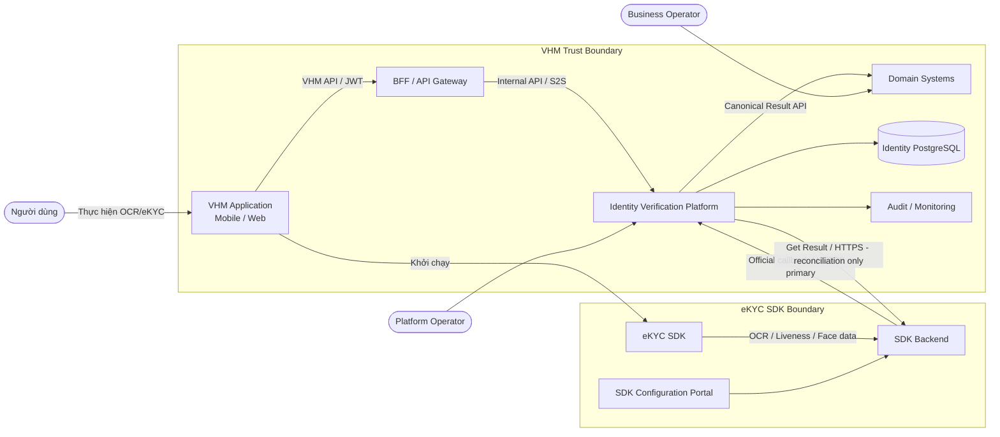

### 2.1.2. Container Diagram (L2)


### 2.1.3. Danh sách module và trách nhiệm

| **STT** | **Module** | **Mục đích** | **Không chịu trách nhiệm** |
| --- | --- | --- | --- |
| 1 | **VHM Application (Mobile/Web)** | Hiển thị consent; kiểm tra capability; gọi create session; khởi chạy SDK; báo started/submitted/cancel/error; hiển thị trạng thái trung tính | Không giữ secret; không tự quyết định VERIFIED; không gửi OCR result tin cậy |
| 2 | **eKYC SDK** | Camera UX; thu nhận mặt trước/sau, liveness và face data; giao tiếp SDK Backend | Không sở hữu trạng thái nghiệp vụ VHM |
| 3 | **BFF/API Gateway** | Xác thực user; authorize business object; rate limit; route API | Không map provider payload hoặc lưu session |
| 4 | **Verification API** | API nội bộ; validate request; orchestration application-level | Không thực hiện thuật toán OCR/liveness |
| 5 | **Session Manager** | Tạo session; active guard; state machine; expiry; retry chain; optimistic locking | Không phụ thuộc raw SDK payload |
| 6 | **Provider Adapter** | Create session/Get Result; timeout; error translation; cô lập SDK contract | Không áp business rule domain |
| 7 | **Callback Inbox** | Xác thực, durable receive, dedupe và xử lý callback bất đồng bộ | Chỉ lưu payload tối thiểu đã mã hóa với TTL; không lưu media |
| 8 | **Result Normalizer** | Chuyển document/liveness/face/warning thành Canonical Result | Không cập nhật business object |
| 9 | **Decision Mapper** | Ánh xạ Canonical Result thành decision theo fixed policy version | Không hard-code threshold chưa phê duyệt |
| 10 | **Reconciliation Job** | Tìm session treo, lấy result, backoff và hoàn tất idempotent | Không polling mọi session liên tục |
| 11 | **Result API** | Trả Canonical Result với bộ field cố định, authorization và masking | Không trả raw provider response |
| 12 | **Domain System** | Áp rule nghiệp vụ, auto-fill, chấp nhận, từ chối hoặc yêu cầu retry | Không tích hợp trực tiếp SDK Backend |
| 13 | **PostgreSQL** | Session, run, check, field, inbox, result và history | Không lưu binary media trực tiếp |

### 2.1.4. Luồng dữ liệu OCR/eKYC

eKYC SDK trên Mobile/Web gửi dữ liệu OCR, liveness và face tới SDK Backend.

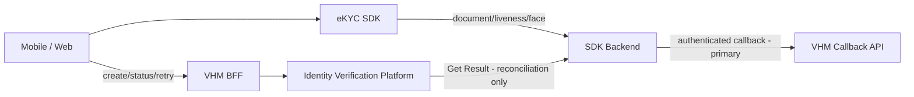

Ràng buộc triển khai bắt buộc:

- Dữ liệu document, selfie và video/frame liveness của SDK flow được truyền
  giữa eKYC SDK và SDK Backend; VHM BFF/Identity Verification Platform chỉ xử lý
  control-plane, session và official result.
- Mặt trước và mặt sau phải thuộc cùng một SDK run. Nếu một mặt thất bại, attempt
  kết thúc và retry phải tạo whole attempt mới; không tái sử dụng ảnh đã pass.
- VHM chỉ cấp bootstrap/configuration ngắn hạn; API key/app secret không đi xuống client.
- Kết quả phía client chỉ phục vụ UX. Official result phải đến từ callback
  server-to-server đã xác thực. Reconciliation Job chỉ gọi Get Result khi callback
  quá SLA hoặc session treo.
- Mobile/Web không log SDK payload, media reference, token hoặc dữ liệu định danh raw.
- Network allowlist, TLS, SDK integrity và callback authentication tuân theo mục Security.
- Data location, retention, subprocessor và incident handling phải được kiểm soát
  bằng hợp đồng và là gate bắt buộc trước production.

### 2.1.5. Trust Boundary

| **Boundary** | **Luồng** | **Mức tin cậy** | **Kiểm soát bắt buộc** |
| --- | --- | --- | --- |
| Device → VHM | Create/get/start/submit/retry | Untrusted client | JWT, object authorization, rate limit, idempotency, schema validation |
| Device → SDK Backend | SDK data-plane | External dependency | TLS, SDK integrity, short-lived bootstrap, device security |
| SDK Backend → VHM | Callback | External server | Strong auth/signature, WAF, timestamp/replay guard, schema, idempotency |
| VHM → SDK Backend | Create session; Get Result chỉ từ Reconciliation Job sau callback SLA | External dependency | Secret Manager, TLS, timeout, circuit breaker, audit |
| Identity Platform → Domain | Internal S2S Result API | Zero Trust internal | Workload identity, domain/object scope, fixed schema |
| Platform → PostgreSQL | Restricted storage | Restricted | Private subnet, IAM, encryption, least privilege |

### 2.1.6. Journey Policy Model

| **Journey** | **Step bắt buộc** | **Kết quả Platform** | **Quy tắc sử dụng** |
| --- | --- | --- | --- |
| `OCR_ONLY` | `OCR_DOCUMENT` | OCR fields, quality/warning và `ekycOutcome=NOT_PERFORMED` | Không được diễn giải là đã xác minh danh tính |
| `FULL_EKYC` | OCR front/back → liveness → face matching | OCR fields + eKYC decision + identity reference | Bắt buộc liveness; không silent downgrade khi thiếu capability |

Backend chỉ chấp nhận `OCR_ONLY` hoặc `FULL_EKYC`, document type
`NATIONAL_ID_CHIP` và channel `MOBILE_APP`/`WEB_APP`. Journey được resolve từ use
case đã được phê duyệt; client không được tự đổi flow.

### 2.1.7. Channel Capability Matrix

| **Capability** | **Mobile** | **Web** | **Quy tắc** |
| --- | --- | --- | --- |
| Camera OCR | SDK kiểm tra permission và chất lượng capture | SDK kiểm tra camera permission và chất lượng capture | Phải pass trước khi start |
| Document sides | Front và back trong cùng SDK run/attempt | Front và back trong cùng SDK run/attempt | Một mặt fail thì whole attempt fail |
| Liveness | SDK thực hiện trong `FULL_EKYC` | SDK thực hiện trong `FULL_EKYC` | Thiếu capability trả `CHANNEL_CAPABILITY_REQUIRED` |
| Face matching | Qua SDK Backend | Qua SDK Backend | Chỉ official result được dùng cho decision |
| Resume | Query backend status trước khi resume | Query backend status sau refresh/reopen | Không lưu bootstrap token dài hạn; unsupported resume chuyển retry |

### 2.1.8. Thông tin dữ liệu

| **Loại dữ liệu** | **Ví dụ** | **Phân loại** | **Quy tắc lưu trữ** | **Bảo mật/Logic** |
| --- | --- | --- | --- | --- |
| Internal session | `verificationId`, domain, purpose | L2 | PostgreSQL | UUID random; tenant/domain isolation |
| Business references | `businessRef`, `subjectRef` | L2 | PostgreSQL | Opaque; không nhúng PII |
| Provider session | `providerSessionId` | L2/Internal | PostgreSQL, unique theo provider | External correlation, không dùng làm PK |
| State/timestamps | status, attempts, expiry | L2 | PostgreSQL | Guard + optimistic lock + append-only history |
| OCR fields | document number, name, DOB, address | L3 | Field-level encrypted; chỉ bộ field cố định đã phê duyệt | Mask theo Result API contract |
| Confidence/warnings | score, reason code | L2/L3 | Check table/JSONB | Versioned mapping, hạn chế UI |
| Liveness/face result | status, score | L3/Biometric-related | Status/score tối thiểu | Không lưu video/template tại VHM |
| Resource URL | front/back/video URL | L3 | Không persist | Không log; không fetch tự động |
| Callback payload | Payload tối thiểu phục vụ normalize | L3/L4 | Mã hóa trong Callback Inbox, TTL ngắn và purge sau xử lý | Không log; không lưu vào result/history |
| Consent | purpose/version/time | L3 | Consent system + reference | Purpose-bound, audit được |
| Credential/token | API key, callback key, SDK token | Secret | VHM Secret Manager; workload memory khi sử dụng | Không DB/log/client binary |

## 2.2. Session Configuration

### 2.2.1. User Authentication Session

- Do IAM/BFF quản lý qua OIDC/JWT.
- Identity Platform không tự quản lý login session.
- Backend phải xác minh user/service có quyền với `businessRef` trước mọi mutation/read.

### 2.2.2. Verification Session

| **Thuộc tính** | **Baseline** |
| --- | --- |
| Internal ID | `verificationId` UUIDv7 do VHM sinh |
| External correlation | `providerSessionId`, unique theo provider/environment |
| Active uniqueness | Một session active trên `(tenant, domain, businessRef, subjectRef, purpose, journey)` |
| Idempotency | `Idempotency-Key` bắt buộc khi create/retry |
| Timeout | 30 phút; backend và SDK config dùng cùng versioned policy |
| Retry | Tạo session mới, link `retryOfVerificationId`; không reuse external session |
| Resume | Chỉ khi SDK contract hỗ trợ; backend không giả định resume |
| Client completion | Chỉ là `SUBMITTED`, không phải verified |
| Provider completion | Callback hợp lệ; Get Result chỉ hoàn tất qua reconciliation fallback |
| Business completion | Sau normalize + fixed decision mapping + durable persistence |
| Channel | `MOBILE_APP` hoặc `WEB_APP`; ghi nhận tại session/run |
| Capability | Camera/liveness capability là client hint; backend validate theo Mobile/Web compatibility policy |

### 2.2.3. State Machine

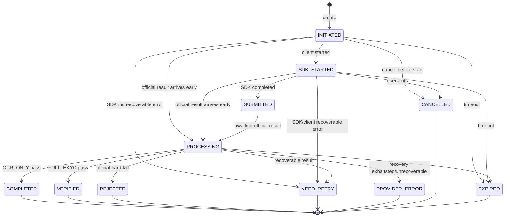

### 2.2.4. State Transition Guard

| **From** | **To** | **Điều kiện** | **Tác động** |
| --- | --- | --- | --- |
| INITIATED | SDK_STARTED | Chưa expire; caller đúng owner; bootstrap hợp lệ | Ghi startedAt/channel/app/sdk version |
| SDK_STARTED | SUBMITTED | Client báo SDK hoàn tất; external reference match | Ghi submittedAt; không cập nhật decision |
| SUBMITTED | PROCESSING | Official result chưa final hoặc processing async | Lập reconciliation schedule |
| INITIATED/SDK_STARTED/SUBMITTED/PROCESSING | COMPLETED | `OCR_ONLY` official result pass | Persist result/history; không diễn giải là đã xác minh danh tính |
| INITIATED/SDK_STARTED/SUBMITTED/PROCESSING | VERIFIED | `FULL_EKYC` official result hợp lệ + policy pass | Persist result/history; chấp nhận callback đến trước client event |
| INITIATED/SDK_STARTED/SUBMITTED/PROCESSING | REJECTED | Hard fail theo policy approved | Lưu canonical reasons; không nhầm timeout |
| INITIATED/SDK_STARTED/SUBMITTED/PROCESSING | NEED_RETRY | Recoverable quality/user error | Đóng attempt; cho tạo session mới nếu còn quota |
| PROCESSING | PROVIDER_ERROR | Hết reconciliation budget hoặc lỗi tích hợp không retryable | Đóng attempt; trả support/retry action theo policy |
| Any non-terminal | EXPIRED | `expiresAt < now`, chưa final | History + retry eligibility |
| Terminal | Any | Không cho chuyển ngược | Callback/client event trễ chỉ ghi audit |

## 2.3. Internal Component Design

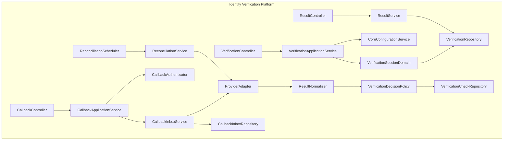

### 2.3.1. VerificationApplicationService

- Kiểm tra domain/use case đã được phê duyệt.
- Kiểm tra business reference và quyền caller qua domain authorization contract.
- Validate consent đúng subject, purpose và version.
- Resolve journey, timeout, quota và decision policy version.
- Bảo đảm unique active session và create idempotent.
- Sinh `verificationId`, tạo provider session qua adapter nếu contract yêu cầu.
- Trả SDK bootstrap tối thiểu; không trả credential dài hạn.

### 2.3.2. CoreConfigurationService

Core config tối thiểu:

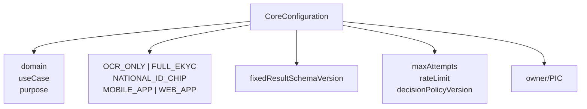

- Config versioned và environment-scoped.
- Thay đổi bộ field cố định/decision policy cần Data Privacy/Risk approval tương ứng.
- Secret không nằm trong Core config.

### 2.3.3. CallbackAuthenticator

- Callback bắt buộc dùng chữ ký bất đối xứng JWS/JWT với `keyId`, timestamp,
  audience và nonce/event ID. mTLS được áp dụng thêm khi SDK Backend hỗ trợ.
- Fixed token không đáp ứng baseline production; provider không hỗ trợ chữ ký phải
  có security exception được ANBM phê duyệt trước tích hợp.
- Validate timestamp, audience, key ID và replay window cho mọi callback.
- IP allowlist chỉ là lớp bổ sung, không thay authentication.
- Reject trước khi parse sâu nếu payload quá lớn.
- Hỗ trợ key rotation overlap, không gây gián đoạn callback đang bay.

### 2.3.4. CallbackInboxService

- Idempotency key dùng `providerEventId`; chỉ fallback external session + result
  version/payload hash khi provider contract xác nhận không cung cấp event ID.
- Sau khi xác thực, lưu payload tối thiểu đã redaction và mã hóa trước khi xử lý business.
- Duplicate đã nhận durable trả 2xx, không chạy side effect lần hai.
- Inbox states: `RECEIVED`, `PROCESSING`, `PROCESSED`, `FAILED`, `QUARANTINED`.
- Encrypted payload chỉ tồn tại trong inbox theo TTL ngắn và được purge sau xử lý.
  Không lưu payload vào result/history/log; quarantine cần incident ticket và audit.

### 2.3.5. ResultNormalizer

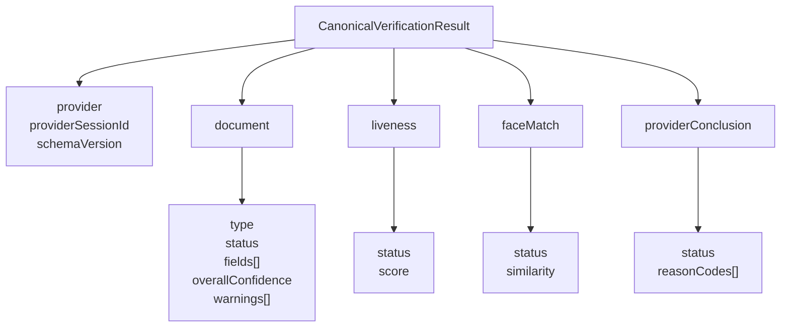

Normalizer phải:

- Chịu được optional field, null, `N/A` và provider thêm field mới.
- Parse score/boolean/date an toàn, validate range.
- Quarantine khi thiếu external session, schema không hỗ trợ hoặc payload sai type nghiêm trọng.
- Giữ provider code phục vụ audit nhưng chỉ trả canonical code cho domain.
- Không fetch resource URL tự động.

### 2.3.6. VerificationDecisionPolicy

Decision model:

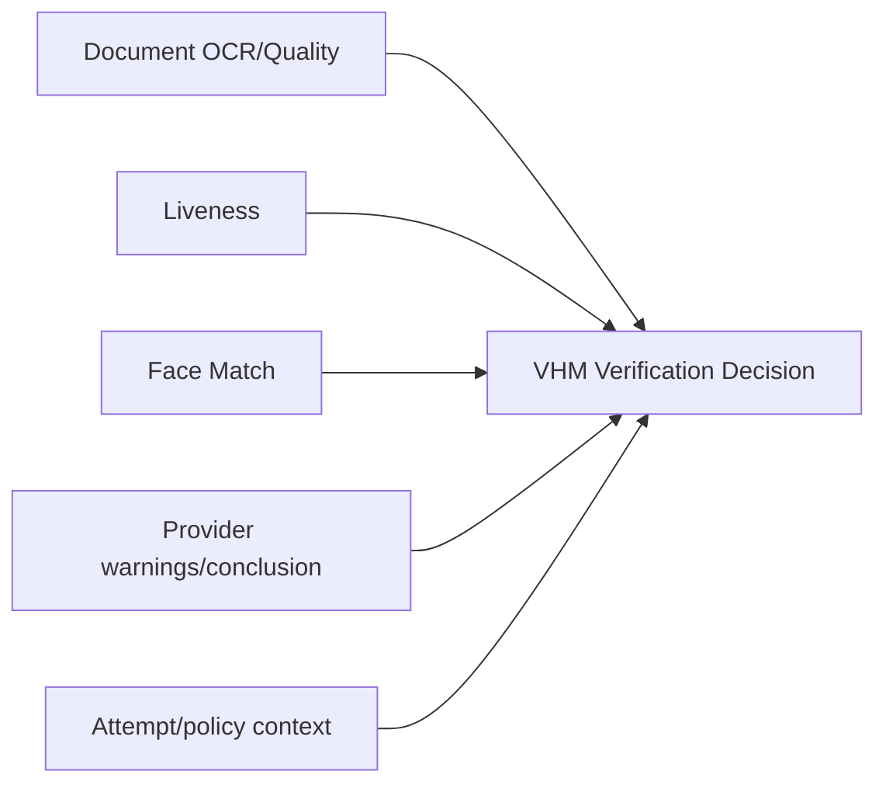

- Sử dụng fixed mapping policy đã được phê duyệt và version hóa.
- Threshold không hard-code trong Java.
- Provider conclusion là input, không tự động là business decision.
- Lưu `decisionPolicyVersion` và canonical reason codes tại thời điểm quyết định.

### 2.3.7. ResultService

- Kiểm tra service identity, tenant, domain và business-object authorization.
- Trả một Canonical Result schema với bộ field cố định đã được phê duyệt.
- Mask mặc định; unmask cần elevated permission + reason + audit.
- Không expose resource URL, raw warning hoặc internal threshold.

## 2.4. Data Model

### 2.4.1. ERD

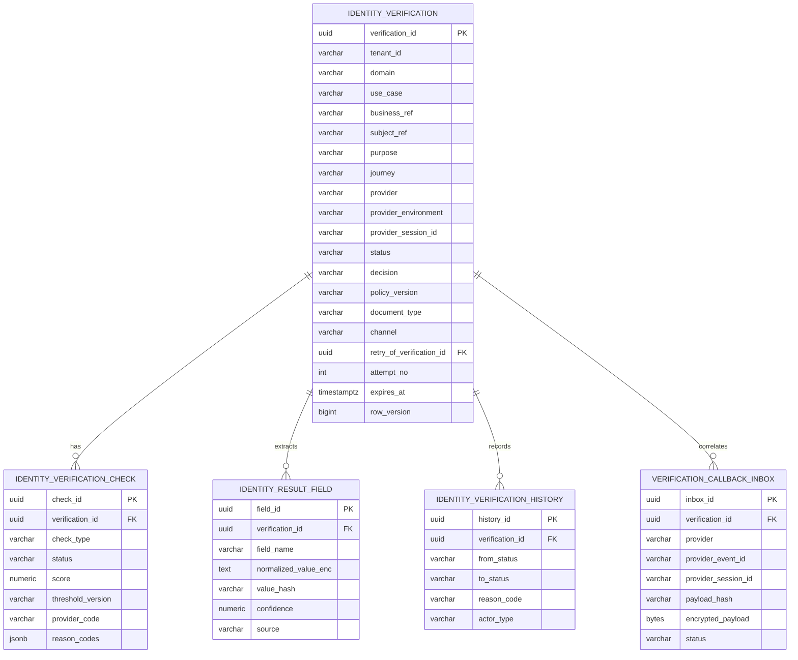

### 2.4.2. Bảng `identity_verification`

```sql
CREATE TABLE identity_verification (
    verification_id             uuid PRIMARY KEY,
    tenant_id                    varchar(50)  NOT NULL,
    domain                       varchar(50)  NOT NULL,
    use_case                     varchar(80)  NOT NULL,
    business_ref                 varchar(150) NOT NULL,
    subject_ref                  varchar(150) NOT NULL,
    purpose                      varchar(80)  NOT NULL,
    journey                      varchar(40)  NOT NULL,
    document_type                varchar(40)  NOT NULL,
    channel                      varchar(30)  NOT NULL,
    provider                     varchar(40)  NOT NULL,
    provider_environment         varchar(30)  NOT NULL,
    provider_session_id          varchar(150),
    status                       varchar(30)  NOT NULL,
    decision                     varchar(30),
    decision_reason_codes        jsonb        NOT NULL DEFAULT '[]',
    policy_version               varchar(80)  NOT NULL,
    result_schema_version        varchar(30),
    result_source                varchar(30),
    consent_reference_id         varchar(150) NOT NULL,
    retry_of_verification_id     uuid,
    attempt_no                   integer      NOT NULL DEFAULT 1,
    run_id                       uuid,
    run_lease_expires_at         timestamptz,
    sdk_version                  varchar(50),
    app_version                  varchar(50),
    expires_at                   timestamptz  NOT NULL,
    started_at                   timestamptz,
    submitted_at                 timestamptz,
    completed_at                 timestamptz,
    reconciliation_due_at       timestamptz,
    created_by                   varchar(150) NOT NULL,
    created_at                   timestamptz  NOT NULL,
    updated_at                   timestamptz  NOT NULL,
    row_version                  bigint       NOT NULL DEFAULT 0,
    CONSTRAINT fk_iv_retry_of FOREIGN KEY (retry_of_verification_id)
      REFERENCES identity_verification(verification_id),
    CONSTRAINT uk_iv_run UNIQUE (run_id),
    CONSTRAINT uk_iv_provider_session UNIQUE (
      provider, provider_environment, provider_session_id
    )
);

CREATE INDEX idx_iv_business_ref
  ON identity_verification(tenant_id, domain, business_ref, created_at DESC);

CREATE INDEX idx_iv_subject_ref
  ON identity_verification(tenant_id, domain, subject_ref, created_at DESC);

CREATE INDEX idx_iv_reconciliation
  ON identity_verification(status, reconciliation_due_at)
  WHERE status IN ('SUBMITTED', 'PROCESSING');

CREATE UNIQUE INDEX uk_iv_active_subject
  ON identity_verification(
    tenant_id, domain, business_ref, subject_ref, purpose, journey
  )
  WHERE status IN ('INITIATED', 'SDK_STARTED', 'SUBMITTED', 'PROCESSING');
```

`provider_session_id` có thể null trước khi provider session được tạo. PostgreSQL
cho phép nhiều null dưới unique constraint; adapter phải bổ sung validation khi bind.

### 2.4.3. Bảng `identity_verification_check`

```sql
CREATE TABLE identity_verification_check (
    check_id               uuid PRIMARY KEY,
    verification_id        uuid        NOT NULL
      REFERENCES identity_verification(verification_id),
    check_type              varchar(40) NOT NULL,
    status                  varchar(30) NOT NULL,
    score                   numeric(12,6),
    threshold_version       varchar(80),
    provider_code           varchar(80),
    reason_codes            jsonb       NOT NULL DEFAULT '[]',
    warning_data            jsonb       NOT NULL DEFAULT '[]',
    checked_at              timestamptz,
    created_at              timestamptz NOT NULL,
    updated_at              timestamptz NOT NULL,
    CONSTRAINT uk_iv_check UNIQUE (verification_id, check_type)
);
```

`check_type` baseline:

- `DOCUMENT_OCR`
- `DOCUMENT_QUALITY`
- `LIVENESS`
- `FACE_MATCH`
- `PROVIDER_CONCLUSION`

### 2.4.4. Bảng `identity_result_field`

```sql
CREATE TABLE identity_result_field (
    field_id                  uuid PRIMARY KEY,
    verification_id           uuid         NOT NULL
      REFERENCES identity_verification(verification_id),
    field_name                varchar(80)  NOT NULL,
    normalized_value_enc      text,
    value_hash                varchar(128),
    confidence                numeric(12,6),
    source                    varchar(30)   NOT NULL,
    created_at                timestamptz   NOT NULL,
    CONSTRAINT uk_iv_result_field UNIQUE (verification_id, field_name)
);
```

- `normalized_value_enc`: application/column-level encryption theo platform standard.
- `value_hash`: chỉ tạo cho field exact-match/dedup; dùng HMAC-SHA256 với key riêng,
  không dùng plain SHA-256 cho CCCD.
- Không index plaintext PII.
- Retention field có thể ngắn hơn session metadata và phải có deletion job riêng.

### 2.4.5. Bảng Callback Inbox

```sql
CREATE TABLE verification_callback_inbox (
    inbox_id                 uuid PRIMARY KEY,
    provider                 varchar(40)  NOT NULL,
    provider_event_id        varchar(150),
    provider_session_id      varchar(150) NOT NULL,
    verification_id         uuid NOT NULL REFERENCES identity_verification(verification_id),
    result_version           varchar(80),
    payload_hash             varchar(128) NOT NULL,
    encrypted_payload        bytea        NOT NULL,
    auth_subject             varchar(150),
    status                   varchar(30)  NOT NULL,
    received_at              timestamptz  NOT NULL,
    processing_started_at    timestamptz,
    processed_at             timestamptz,
    failure_code             varchar(80),
    failure_message_masked   varchar(500),
    expires_at               timestamptz  NOT NULL,
    CONSTRAINT uk_callback_event UNIQUE(provider, provider_event_id),
    CONSTRAINT uk_callback_payload UNIQUE(provider, provider_session_id, payload_hash)
);
```

Nếu provider không có event ID, uniqueness fallback theo external session + payload hash.
`encrypted_payload` chỉ chứa dữ liệu tối thiểu sau redaction để worker normalize,
có TTL và purge job; không được sao chép sang result/history/log.

## 2.5. Concurrency, Idempotency và Transaction

### 2.5.1. Tạo phiên đồng thời

Rủi ro: double-click/client retry tạo hai session.

Kiểm soát:

- `Idempotency-Key` bắt buộc.
- Lưu request fingerprint; cùng key khác body trả conflict.
- Partial unique active index.
- Nếu cùng idempotency và fingerprint, trả session hiện hữu.

### 2.5.2. Callback đồng thời/trùng lặp

- Insert inbox với unique event/payload key.
- Request thắng insert thực hiện durable receive.
- Duplicate `PROCESSED/PROCESSING` trả 2xx để tránh retry storm.

### 2.5.3. Callback và reconciliation cùng chạy

- Cả hai gọi chung `processOfficialResult()`.
- Callback/reconciliation khóa session bằng `SELECT ... FOR UPDATE` trong transaction
  ngắn; API mutation thông thường dùng optimistic `rowVersion`.
- Nếu terminal, chỉ append audit duplicate/late source, không finalize lần hai.

### 2.5.4. Transaction boundary

Trong một local transaction:

1. Upsert verification checks.
2. Lưu normalized fields được phép.
3. Chuyển session state/decision.
4. Append history.

Không gọi Domain System hoặc SDK Backend bên trong DB transaction.

# **3. Feature List**

## 3.1. OCR & eKYC Platform

| **STT** | **Nhóm chức năng** | **Mô tả** |
| --- | --- | --- |
| 1 | **Core Configuration** | Quản lý domain/use case, owner, hai journey đã duyệt, một document type, quota và fixed decision policy version. |
| 2 | **Consent Guard** | Kiểm tra consent đúng subject, purpose, version, channel và thời hạn trước khi tạo phiên. |
| 3 | **Khởi tạo phiên** | Tạo `verificationId`, external session, active-session guard, expiry và SDK bootstrap; hỗ trợ `Idempotency-Key`. |
| 4 | **Capability Preflight** | Kiểm tra camera, permission, Mobile/Web SDK compatibility và liveness capability trước khi start. |
| 5 | **Mobile/Web SDK Integration** | Quản lý permission, client lifecycle, SDK started/submitted/error, resume và security signal trên hai kênh. |
| 6 | **OCR giấy tờ** | Thu nhận mặt trước/sau trong cùng attempt; trích xuất field, confidence, document quality và warning. |
| 7 | **Liveness** | Thực hiện trong `FULL_EKYC`; official result lấy từ SDK Backend. |
| 8 | **Face Matching** | Chuẩn hóa match result/score/reason; không dùng score đơn lẻ khi threshold chưa được duyệt. |
| 9 | **Callback Reception** | Endpoint server-to-server, authentication, timestamp/replay guard, schema/body limit, durable inbox và dedupe. |
| 10 | **Reconciliation/Get Result** | Chỉ lấy official result khi callback quá SLA hoặc session treo; bounded batch, backoff và circuit breaker. |
| 11 | **Result Normalization** | Chuyển payload SDK Backend thành Canonical Result, tolerant với optional/new fields và strict với critical fields. |
| 12 | **Decision Mapping** | Ánh xạ canonical checks thành `COMPLETED/VERIFIED/REJECTED/NEED_RETRY/PROVIDER_ERROR`; lưu policy version. |
| 13 | **Result API** | Trả Canonical Result với bộ field cố định đã phê duyệt; authorize, mask và audit quyền truy cập. |
| 14 | **Retry Chain** | Tạo whole attempt mới với external session mới; giữ liên kết, reason và attempt count. |
| 15 | **Expiry Management** | Expire session/run theo policy; xử lý callback trễ và grace reconciliation có audit. |
| 16 | **Audit & Traceability** | Lưu state history, result source, config/policy version, actor và access/unmask audit. |
| 17 | **Operations** | Search theo internal reference, reprocess callback inbox và tạm dừng create khi dependency incident. |
| 18 | **Monitoring & Cost Control** | Funnel, latency, error taxonomy, callback/reconcile backlog, quota, attempt và estimated cost. |

## 3.2. Business Rules tổng quát

| **Rule ID** | **Quy tắc** |
| --- | --- |
| BR-001 | Một `(tenant, domain, businessRef, subjectRef, purpose, journey)` chỉ có tối đa một session active. |
| BR-002 | `verificationId` do VHM sinh, unique, không chứa PII và không tái sử dụng. |
| BR-003 | External session ID không được dùng làm public/internal primary key. |
| BR-004 | Kết quả client/SDK phía Mobile/Web không được chuyển trực tiếp thành `COMPLETED`, `VERIFIED` hoặc `REJECTED`. |
| BR-005 | Chỉ official result server-to-server đã xác thực mới được hoàn tất session. |
| BR-006 | `OCR_ONLY` thành công chuyển `COMPLETED`, có `ekycOutcome=NOT_PERFORMED` và không được hiển thị là đã xác minh danh tính. |
| BR-007 | Chỉ `FULL_EKYC` pass mới chuyển `VERIFIED`. |
| BR-008 | Callback trùng không được cập nhật state, result, history hoặc side effect lần hai. |
| BR-009 | Timeout/network/SDK Backend unavailable giữ `PROCESSING` trong recovery budget; hết budget mới thành `PROVIDER_ERROR`, không phải `REJECTED`. |
| BR-010 | Lỗi ảnh, permission hoặc thao tác recoverable có thể chuyển `NEED_RETRY`. |
| BR-011 | Domain chỉ nhận bộ normalized fields cố định đã được Product/Privacy phê duyệt. |
| BR-012 | Auto-fill chỉ ghi field trống; overwrite field đã xác nhận cần explicit confirmation/rule của Domain System. |
| BR-013 | Retry tạo session/provider transaction mới và không ghi đè lịch sử attempt trước. |
| BR-014 | Mặt trước và mặt sau phải thuộc cùng một `runId`; lỗi một mặt làm whole attempt thất bại. |
| BR-015 | Không tái sử dụng ảnh mặt đã pass để ghép với attempt mới. |
| BR-016 | Terminal state không chuyển ngược qua API hoặc callback trễ. |
| BR-017 | Không persist/log resource URL, media SDK flow, token hoặc provider payload ngoài encrypted Callback Inbox TTL ngắn. |
| BR-018 | Client không được gọi external Get Result; chỉ Reconciliation Job được phép gọi khi callback quá SLA hoặc session treo. |
| BR-019 | Mọi threshold/decision/config thay đổi phải version hóa và có change ticket. |
| BR-020 | Mobile/Web capability là untrusted hint; backend đối chiếu compatibility policy. |
| BR-021 | Domain không được dùng OCR/eKYC result cho purpose khác purpose đã consent. |
| BR-022 | Chỉ lỗi kỹ thuật/transient phù hợp mới retry tự động; validation fail/mismatch không retry kỹ thuật. |
| BR-023 | Trang kết quả của SDK phải đặt `OFF`; VHM Application sở hữu processing/result screen. |
| BR-024 | Khi SDK phát completion/close event, Mobile/Web chỉ gửi `submitted` và hiển thị “Đang xử lý kết quả”. |
| BR-025 | Mobile/Web chỉ hiển thị outcome/next action lấy từ Identity Verification Platform sau khi official result đã được xử lý. |

## 3.3. Ma trận trạng thái và hành động

| **Status** | Get status | Start SDK | Client submit | Retry | Result API | Reconcile |
| --- | --- | --- | --- | --- | --- | --- |
| INITIATED | ✔️ | ✔️ | ❌ | ❌ | ❌ | ❌ |
| SDK_STARTED | ✔️ | Idempotent/same run | ✔️ | ❌ | ❌ | Gần timeout theo policy |
| SUBMITTED | ✔️ | ❌ | Idempotent | ❌ | Chưa final | ✔️ sau initial delay |
| PROCESSING | ✔️ | ❌ | Ignore/late audit | ❌ | Chưa final | ✔️ |
| COMPLETED | ✔️ | ❌ | Ignore | ❌ | OCR result | ❌ |
| VERIFIED | ✔️ | ❌ | Ignore | ❌ | eKYC result | ❌ |
| REJECTED | ✔️ | ❌ | Ignore | Theo policy | Canonical outcome | ❌ |
| NEED_RETRY | ✔️ | ❌ | Ignore | ✔️ nếu còn attempt/quota | Canonical outcome | ❌ |
| PROVIDER_ERROR | ✔️ | ❌ | Ignore | Sau recovery/Ops gate | Canonical technical outcome | ❌ |
| CANCELLED | ✔️ | ❌ | Ignore | ✔️ theo policy | ❌ | Grace check nếu provider đã final |
| EXPIRED | ✔️ | ❌ | Ignore | ✔️ theo policy | ❌ | Grace reconcile theo policy |

## 3.4. Channel Rules

| **Rule ID** | **Mobile** | **Web** |
| --- | --- | --- |
| CH-01 Permission | Camera permission và SDK capability phải được kiểm tra trước start | Camera permission và SDK capability phải được kiểm tra trước start |
| CH-02 Lifecycle | Background/foreground, force-close và resume query backend status | Refresh/reopen/multi-tab query backend status; không tự tạo run mới |
| CH-03 Token storage | Chỉ giữ bootstrap token trong memory | Chỉ giữ bootstrap token trong memory; không lưu browser storage dài hạn |
| CH-04 Compatibility | Mobile app/device/SDK matrix được pin version | Web client/SDK compatibility matrix được pin version |
| CH-05 Capture | Live capture theo SDK; không chọn ảnh có sẵn | Live capture theo SDK; không upload file có sẵn |
| CH-06 Two-side | Front/back thuộc cùng `runId`; fail một mặt kết thúc whole attempt | Áp dụng cùng quy tắc front/back và whole attempt |
| CH-07 Telemetry | Không gửi payload, OCR fields, media reference, token hoặc biometric score vào telemetry | Áp dụng cùng data policy cho log/analytics |
| CH-08 Result UX | SDK result page `OFF`; chỉ hiển thị VHM Result/Status API | Áp dụng cùng result rule |

---

# **4. Integration Architecture**

## 4.1. Danh sách Interfaces

> Endpoint dưới đây là **contract nội bộ bắt buộc của VHM**. Chi tiết
> API/auth/callback bên ngoài được cô lập trong Provider Adapter theo integration pack.

| **STT** | **Miêu tả** | **Endpoint** | **From** | **To** | **Mode** | **Data chính** |
| --- | --- | --- | --- | --- | --- | --- |
| 1 | Tạo session | `POST /internal/v1/identity-verifications` | BFF/Domain | Verification API | REST Sync | Domain context, journey, channel, consent, client capability |
| 2 | Cấp lại SDK bootstrap | `POST /internal/v1/identity-verifications/{id}/bootstrap` | BFF | Verification API | REST Sync | App/SDK version và capability |
| 3 | Lấy status | `GET /internal/v1/identity-verifications/{id}` | BFF/Domain | Verification API | REST Sync | Status, next action, retry và masked summary |
| 4 | Ghi SDK started | `POST /internal/v1/identity-verifications/{id}/started` | BFF | Verification API | REST Sync | runId, appVersion, sdkVersion |
| 5 | Ghi client submitted | `POST /internal/v1/identity-verifications/{id}/submitted` | BFF | Verification API | REST Sync | runId, untrusted completion code |
| 6 | Ghi client cancel | `POST /internal/v1/identity-verifications/{id}/cancelled` | BFF | Verification API | REST Sync | runId, canonical reason |
| 7 | Ghi SDK/client error | `POST /internal/v1/identity-verifications/{id}/sdk-error` | BFF | Verification API | REST Sync | runId, canonical error, masked SDK code |
| 8 | Tạo retry | `POST /internal/v1/identity-verifications/{id}/retry` | BFF/Ops | Verification API | REST Sync | Whole-attempt retry reason |
| 9 | Lấy Canonical Result | `GET /internal/v1/identity-verifications/{id}/result` | BFF/Domain | Result API | REST Sync | Fixed fields, outcome và reason codes |
| 10 | Callback SDK Backend | `POST /integration/v1/ekyc/callback` | SDK Backend | Callback API | REST Async | Authenticated official result |
| 11 | Lấy result chủ động | Provider-specific, internal adapter only | Reconciliation | SDK Backend | REST Sync | External session ID |
| 12 | Lấy history | `GET /internal/v1/identity-verifications/{id}/history` | Ops/Audit | Verification API | REST Sync | State/access history theo quyền |

## 4.2. Internal API Contract

### 4.2.1. Tạo phiên xác thực

```http
POST /internal/v1/identity-verifications
Authorization: Bearer <user-or-service-token>
Idempotency-Key: 6a2ac410-8f08-4c86-bfb6-8f142169483c
X-Correlation-Id: 38de4a70-513a-4f61-80ff-3ea914137f65
Content-Type: application/json
```

```json
{
  "domain": "DOMAIN_CODE",
  "useCase": "SALE_ONBOARDING",
  "businessRef": "registration-20260806-000001",
  "subjectRef": "applicant-01",
  "purpose": "IDENTITY_VERIFICATION",
  "requestedJourney": "FULL_EKYC",
  "documentType": "NATIONAL_ID_CHIP",
  "channel": "MOBILE_APP",
  "client": {
    "appVersion": "<approved-version>",
    "sdkVersion": "<approved-version>"
  },
  "capabilities": {
    "camera": true,
    "liveness": true
  },
  "consentReferenceId": "consent-20260806-000001"
}
```

Validation:

- Domain/use case đã được phê duyệt cho `OCR_ONLY` hoặc `FULL_EKYC`.
- Business/subject reference tồn tại và caller được quyền.
- Consent đúng subject/purpose/version và chưa bị rút.
- `documentType=NATIONAL_ID_CHIP`, `channel` thuộc `MOBILE_APP` hoặc `WEB_APP`.
- Capability và app/SDK version phù hợp compatibility policy của channel.
- Không có active session khác hoặc trả session cùng idempotency.
- Không vượt rate/attempt/quota.

```json
{
  "verificationId": "f47ed948-600b-4cbb-8f72-1306ccae1cf1",
  "status": "INITIATED",
  "resolvedJourney": "FULL_EKYC",
  "resolvedFlow": "DOCUMENT_LIVENESS_FACE",
  "documentType": "NATIONAL_ID_CHIP",
  "channel": "MOBILE_APP",
  "expiresAt": "2026-08-06T11:15:00+07:00",
  "sdkBootstrap": {
    "runId": "03d2866a-c267-47d0-8f49-64b06ef32218",
    "token": "opaque-short-lived-token",
    "tokenExpiresAt": "2026-08-06T10:50:00+07:00",
    "configurationRef": "mobile-full-ekyc-v1"
  }
}
```

Không trả API key, app secret, callback credential, raw provider configuration,
threshold hoặc policy detail xuống client. Create idempotency replay trả cùng
session; token cũ hết hạn không được replay và client gọi Bootstrap API.

Ví dụ trên minh họa `MOBILE_APP`; `WEB_APP` dùng cùng contract và chỉ thay channel,
client version/capability tương ứng, không thay đổi official-result flow.

### 4.2.2. SDK Bootstrap

```http
POST /internal/v1/identity-verifications/{verificationId}/bootstrap
Authorization: Bearer <authorized-token>
Idempotency-Key: <uuid>
Content-Type: application/json
```

```json
{
  "appVersion": "<approved-version>",
  "sdkVersion": "<approved-version>",
  "capabilities": {
    "camera": true,
    "liveness": true
  }
}
```

Server chỉ cấp bootstrap khi session còn hiệu lực, chưa terminal, version/capability
nằm trong allowlist và không có run/bootstrap lease khác đang active. Token bind
với `verificationId`, `runId`, journey, document type, environment và expiry.

### 4.2.3. SDK started

```http
POST /internal/v1/identity-verifications/{id}/started
```

```json
{
  "runId": "03d2866a-c267-47d0-8f49-64b06ef32218",
  "channel": "MOBILE_APP",
  "appVersion": "<approved-version>",
  "sdkVersion": "<approved-version>"
}
```

- `runId` do Create/Bootstrap API cấp và phải bind đúng session/token.
- Cùng `runId` xử lý idempotent.
- Run khác khi lease còn active trả `409 IV_SDK_RUN_ACTIVE` trên cả Mobile và Web.
- Session hết hạn trả `409 IV_SESSION_EXPIRED`.

### 4.2.4. Client submitted

```json
{
  "runId": "03d2866a-c267-47d0-8f49-64b06ef32218",
  "sdkCompletionStatus": "COMPLETED",
  "sdkCompletionCode": "OPTIONAL_UNTRUSTED_CODE"
}
```

- Chỉ chuyển `SDK_STARTED → SUBMITTED` nếu session chưa terminal.
- Không nhận OCR fields, score, provider result, media reference hoặc token từ Mobile/Web.
- Không đánh dấu `COMPLETED`, `VERIFIED` hoặc `REJECTED` từ client event.
- Sau completion/close event, VHM Application hiển thị “Đang xử lý kết quả” và query status.
- Nếu callback đã final, giữ terminal state và audit late client event.

### 4.2.5. SDK error và Cancel

SDK error:

```json
{
  "runId": "03d2866a-c267-47d0-8f49-64b06ef32218",
  "category": "CAMERA_PERMISSION_DENIED",
  "sdkCode": "MASKED_CLIENT_CODE",
  "retryable": true
}
```

`retryable` chỉ là client hint; backend resolve theo canonical policy. SDK error
không tạo identity decision. Không nhận raw message, stack trace chứa PII hoặc SDK payload.

Cancel:

```json
{
  "runId": "03d2866a-c267-47d0-8f49-64b06ef32218",
  "reason": "USER_CANCELLED"
}
```

Cancel hợp lệ từ `INITIATED`/`SDK_STARTED` chuyển `CANCELLED`. Cancel sau
`SUBMITTED` hoặc terminal chỉ được audit, không đảo state.

### 4.2.6. Lấy trạng thái

```json
{
  "verificationId": "f47ed948-600b-4cbb-8f72-1306ccae1cf1",
  "status": "PROCESSING",
  "journey": "FULL_EKYC",
  "documentType": "NATIONAL_ID_CHIP",
  "nextAction": "WAIT_FOR_RESULT",
  "expiresAt": "2026-08-06T11:15:00+07:00",
  "retry": {
    "allowed": false,
    "remainingAttempts": 2
  }
}
```

Status API không trả raw provider state hoặc PII không cần cho UX.

### 4.2.7. Whole-attempt retry

```http
POST /internal/v1/identity-verifications/{verificationId}/retry
Authorization: Bearer <authorized-token>
Idempotency-Key: <uuid>
Content-Type: application/json
```

```json
{
  "reason": "DOCUMENT_QUALITY_RETRY"
}
```

- Chỉ retry từ `NEED_RETRY`, `PROVIDER_ERROR` hoặc `EXPIRED` theo policy.
- Lỗi tích hợp không retryable chỉ cho retry sau khi Ops xác nhận nguyên nhân đã sửa.
- Sinh verification/provider session mới và link `retryOfVerificationId`.
- Không reuse result, history, bootstrap hoặc ảnh của attempt trước.
- Request retry trùng chỉ tạo một attempt mới.

### 4.2.8. Result API

```http
GET /internal/v1/identity-verifications/{verificationId}/result
Authorization: Bearer <authorized-token>
```

```json
{
  "verificationId": "f47ed948-600b-4cbb-8f72-1306ccae1cf1",
  "journey": "FULL_EKYC",
  "documentType": "NATIONAL_ID_CHIP",
  "status": "VERIFIED",
  "outcome": {
    "ocr": "PASSED",
    "ekyc": "VERIFIED"
  },
  "reasonCodes": [],
  "document": {
    "documentNumber": "******1234",
    "fullName": "NGUYEN V** A",
    "dateOfBirth": "1990-**-**"
  },
  "policyVersion": "identity-policy-1.0",
  "completedAt": "2026-08-06T10:46:30+07:00"
}
```

- Validate workload/user identity, tenant, domain và business-object ownership.
- Chỉ trả fixed approved field set; mask sensitive fields mặc định.
- Unmask cần explicit role/scope, reason và access audit.
- Không trả raw provider payload/code, resource URL, media hoặc threshold.
- `200` khi result đã final; `409 IV_RESULT_NOT_READY` khi session chưa final.

### 4.2.9. Error contract

| **HTTP** | **Code** | **Ý nghĩa** | **Retry** |
| --- | --- | --- | --- |
| 400 | `IV_INVALID_REQUEST` | Sai schema/business input | Không, sửa request |
| 401 | `IV_UNAUTHENTICATED` | Thiếu/sai identity | Re-auth |
| 403 | `IV_FORBIDDEN` | Không có quyền object/domain | Không |
| 404 | `IV_NOT_FOUND` | Không tồn tại trong caller scope | Không |
| 409 | `IV_ACTIVE_SESSION_EXISTS` | Đã có session active | Dùng session hiện hữu |
| 409 | `IV_IDEMPOTENCY_CONFLICT` | Cùng key khác payload | Key/request mới |
| 409 | `IV_INVALID_STATE` | Action không hợp lệ với state | Query status |
| 409 | `IV_SDK_RUN_ACTIVE` | Đã có SDK run active | Resume/query status |
| 409 | `IV_RESULT_NOT_READY` | Canonical Result chưa final | Query status |
| 422 | `IV_CHANNEL_CAPABILITY_REQUIRED` | Mobile/Web thiếu capability bắt buộc | Khắc phục permission hoặc dùng client phù hợp |
| 422 | `IV_UNSUPPORTED_CLIENT` | Client/SDK version không tương thích | Upgrade VHM Application |
| 429 | `IV_ATTEMPT_LIMIT_EXCEEDED` | Vượt quota/attempt | Không tự retry |
| 502 | `IV_PROVIDER_BAD_RESPONSE` | Provider response sai contract | Reconciliation/Ops |
| 503 | `IV_PROVIDER_UNAVAILABLE` | SDK Backend unavailable | Retry có backoff |
| 504 | `IV_PROVIDER_TIMEOUT` | Dependency timeout | Retry có backoff |

## 4.3. Callback SDK Backend

### 4.3.1. Endpoint

```http
POST /integration/v1/ekyc/callback
Content-Type: application/json
Authorization: <signed-provider-token>
```

```json
{
  "eventId": "provider-event-id",
  "eventTime": "2026-08-06T03:45:00Z",
  "providerSessionId": "external-session-reference",
  "resultVersion": "1",
  "status": "FINAL",
  "result": {}
}
```

Callback schema không nhận binary document/selfie/video. Resource URL nếu provider
vẫn trả phải được redaction trước khi lưu inbox và không được tự động fetch.

### 4.3.2. Processing flow

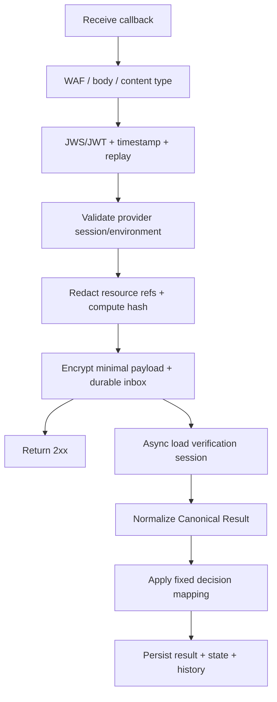

### 4.3.3. Authentication và Idempotency

| **Control** | **Yêu cầu** |
| --- | --- |
| Authentication | JWS/JWT bất đối xứng với `keyId`; mTLS bổ sung theo hạ tầng |
| Claims | Audience, timestamp, event ID/nonce, provider/environment binding |
| Replay | Timestamp window + event ID/nonce store |
| Dedupe key 1 | `provider + providerEventId` |
| Dedupe key 2 | `provider + providerSessionId + resultVersion/payloadHash` theo contract |
| Ack | Durable inbox trước 2xx |
| Key rotation | Overlap old/new public key và có runbook |

Authentication failure không insert business result và không thay đổi session.
Duplicate đã durable trả 2xx nhưng không normalize/finalize lần hai.

### 4.3.4. Callback response

| **HTTP** | **Khi dùng** | **Provider action kỳ vọng** |
| --- | --- | --- |
| 200/202 | Durable receive hoặc duplicate đã nhận | Dừng retry |
| 400 | Schema/envelope không hợp lệ | Không retry cùng payload |
| 401/403 | Authentication/audience/signature sai | Sửa credential/config, security alert |
| 429 | VHM rate limit theo contract | Retry backoff |
| 500/503 | Chưa durable receive | Retry theo provider contract |

## 4.4. Provider Adapter API

```text
createSession(request) -> ProviderSession
getResult(providerSessionId) -> ProviderResult
normalizeResult(providerResult) -> CanonicalVerificationResult
mapError(providerError) -> CanonicalProviderError
```

Provider Adapter phải:

- Cô lập endpoint, credential, timeout, payload và error code.
- Chỉ tích hợp một SDK/provider đã được phê duyệt.
- Không để DTO provider đi vào controller/domain contract.
- Không log request/response raw.
- Dùng timeout, bounded retry, circuit breaker và metrics.
- Get Result chỉ được gọi bởi Reconciliation Job.

### 4.4.1. Timeout/Retry Baseline

| **Operation** | **Timeout** | **Retry** |
| --- | --- | --- |
| Create provider session | Connect 2s, read 5s | Tối đa 2 retry cho timeout/5xx/429, có jitter |
| Get Result | Connect 2s, read 5s | Bounded theo reconciliation policy |
| Callback ack | `<= 2s` sau durable inbox | Provider retry nếu không nhận 2xx |

Không retry tự động cho 4xx business/schema. 401/403 phải alert Critical.

## 4.5. Canonical Result Contract

```json
{
  "provider": "DEFAULT_EKYC",
  "providerSessionId": "external-session-reference",
  "schemaVersion": "1.0",
  "journey": "FULL_EKYC",
  "document": {
    "type": "NATIONAL_ID_CHIP",
    "status": "PASSED",
    "fields": [
      {
        "name": "DOCUMENT_NUMBER",
        "value": "<encrypted-value>",
        "maskedValue": "******1234",
        "confidence": 0.98,
        "status": "VALID"
      }
    ],
    "qualityWarnings": []
  },
  "liveness": {
    "status": "PASSED"
  },
  "faceMatch": {
    "status": "MATCHED"
  },
  "providerConclusion": {
    "status": "PASSED",
    "reasonCodes": []
  },
  "decision": {
    "ocrOutcome": "PASSED",
    "ekycOutcome": "VERIFIED",
    "platformStatus": "VERIFIED",
    "policyVersion": "identity-policy-1.0"
  }
}
```

### 4.5.1. Normalization rules

- External session/environment phải khớp verification mapping.
- Critical fields thiếu hoặc sai type phải quarantine/alert.
- Optional/new fields được bỏ qua an toàn và không làm parser fail.
- Date/boolean/score parse strict và validate range trước khi lưu.
- Provider code chỉ lưu audit có kiểm soát; API trả canonical code.
- Không tự động fetch resource URL.
- Callback payload chỉ lưu mã hóa tạm thời trong inbox và purge theo TTL.
- `ocrOutcome` và `ekycOutcome` luôn tách riêng.

## 4.6. Decision Mapping

### 4.6.1. Baseline

| **Input/result condition** | **Platform status** | **Next action** |
| --- | --- | --- |
| OCR_ONLY: document pass và đủ fixed required fields | `COMPLETED`, `ocrOutcome=PASSED`, `ekycOutcome=NOT_PERFORMED` | Continue OCR-based flow; không hiển thị identity verified |
| FULL_EKYC: document/liveness/face pass | `VERIFIED` | Continue approved business flow |
| Ảnh mờ/chói/mất góc và còn attempt | `NEED_RETRY` | Retry whole attempt với hướng dẫn cụ thể |
| Camera permission hoặc SDK init lỗi | `NEED_RETRY` theo canonical error policy | User action/retry |
| Provider timeout/429/5xx | Giữ `PROCESSING`; hết recovery budget mới `PROVIDER_ERROR` | Reconciliation trước retry |
| Provider result không kết luận được nhưng không phải lỗi tích hợp | `NEED_RETRY` theo fixed mapping | Retry whole attempt nếu còn quota |
| Definitive official identity/document failure | `REJECTED` | Domain hiển thị canonical outcome |
| Callback schema/auth không hợp lệ | Không đổi business state | Operations/security xử lý |
| Không có final result sau recovery budget | `PROVIDER_ERROR` | `CONTACT_SUPPORT` hoặc retry theo policy |

Similarity/score đơn lẻ không đủ tạo `REJECTED`. Fixed mapping phải được
Product/Risk/Architect phê duyệt, version hóa và contract-test.

### 4.6.2. Reason Code Catalogue

| **Canonical reason** | **Ý nghĩa** | **Retryable** |
| --- | --- | --- |
| `DOCUMENT_BLUR` | Ảnh mờ | Có |
| `DOCUMENT_GLARE` | Ảnh chói | Có |
| `DOCUMENT_CROPPED` | Mất góc | Có |
| `DOCUMENT_SIDE_MISSING` | Thiếu front/back trong attempt | Có, whole attempt |
| `DOCUMENT_UNSUPPORTED` | Sai loại giấy tờ | Không |
| `DOCUMENT_EXPIRED` | Giấy tờ hết hạn | Theo policy |
| `LIVENESS_FAILED` | Không đạt liveness | Theo policy |
| `FACE_NOT_MATCHED` | Không khớp khuôn mặt | Theo policy |
| `PROVIDER_TIMEOUT` | SDK Backend timeout | Có kỹ thuật |
| `PROVIDER_UNAVAILABLE` | SDK Backend unavailable | Có kỹ thuật |
| `PROVIDER_AUTH_FAILED` | Credential/config lỗi | Không tự retry |
| `PROVIDER_SCHEMA_INVALID` | Payload sai contract | Không tự retry |
| `CALLBACK_AUTH_FAILED` | Callback không xác thực | Không |
| `CALLBACK_REPLAYED` | Callback replay | Không |
| `CAMERA_PERMISSION_DENIED` | Client thiếu quyền camera | User action |
| `UNSUPPORTED_CLIENT` | Mobile/Web SDK không tương thích | Upgrade VHM Application |

# **5. Data Flow**

## **5.1. Data Flow Diagram tổng quát**

### 5.1.1. Control-plane VHM

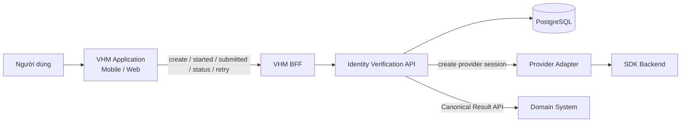

- VHM BFF xác thực user và authorize `businessRef/subjectRef`.
- Identity Verification Platform sở hữu `verificationId`, state, retry và result.
- Provider credential chỉ tồn tại trong backend/Secret Manager.
- Mobile/Web không gọi Provider Get Result API.

### 5.1.2. Data-plane SDK

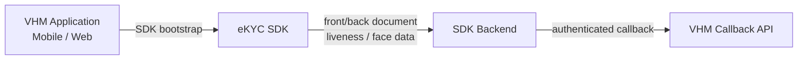

- Media đi trực tiếp từ SDK tới SDK Backend, không qua VHM BFF/Identity Platform.
- VHM không lưu document image, selfie hoặc video/frame liveness của SDK flow.
- Front/back thuộc cùng SDK run/attempt; fail một mặt kết thúc whole attempt.
- SDK completion phía client không phải official result.

### 5.1.3. Official result

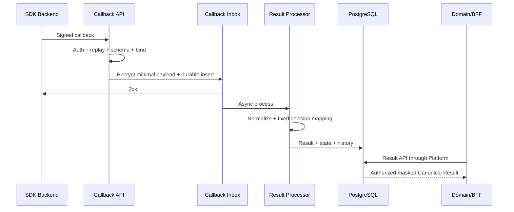

## 5.2. Data Flow quan trọng

### **5.2.1. Khởi tạo session**

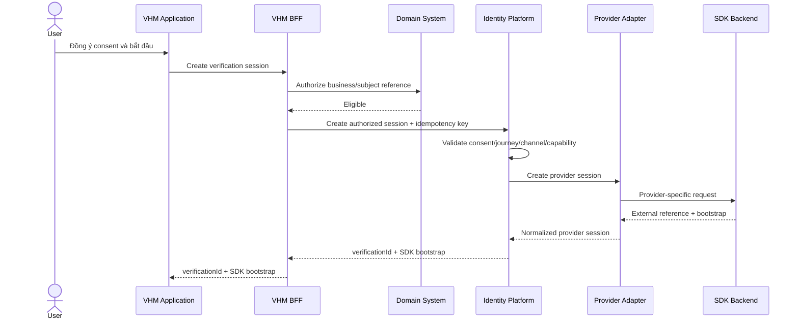

Create-session failure rules:

- Cùng idempotency key và fingerprint trả session hiện hữu.
- Cùng key khác fingerprint trả `IV_IDEMPOTENCY_CONFLICT`.
- External create timeout/5xx áp bounded retry; không tạo hai active session.
- Bootstrap token ngắn hạn, bind session/run/journey/channel/environment.

### **5.2.2. OCR_ONLY trên Mobile/Web**

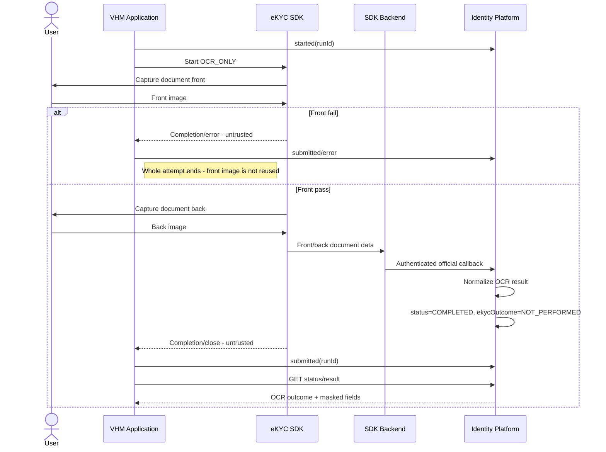

Mobile và Web dùng cùng result/state contract. Khác biệt lifecycle chỉ nằm ở client
integration; backend không thay đổi official-result rule.

Two-side processing là hành vi cố định theo contract của SDK/provider và không
được thay đổi động trong runtime:

| **Provider capability** | **Cách Mobile/Web xử lý** | **Failure rule** |
| --- | --- | --- |
| Một lần gửi front + back | SDK thu đủ hai mặt rồi gửi trong cùng `runId` | Bất kỳ mặt nào fail thì whole attempt `NEED_RETRY` |
| Một lần chỉ gửi một mặt | SDK xử lý front trước; front pass mới tiếp tục back trong cùng `runId` | Front fail thì dừng ngay; back không được capture/send. Back fail cũng đóng whole attempt |

Attempt sau phải capture lại từ đầu; không giữ front/back đã pass để ghép với ảnh
của attempt khác.

### **5.2.3. FULL_EKYC trên Mobile**

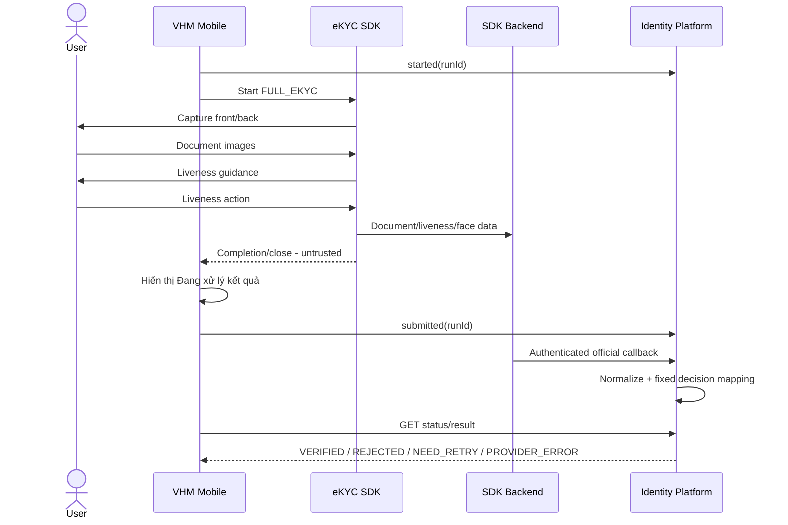

### **5.2.4. FULL_EKYC trên Web**

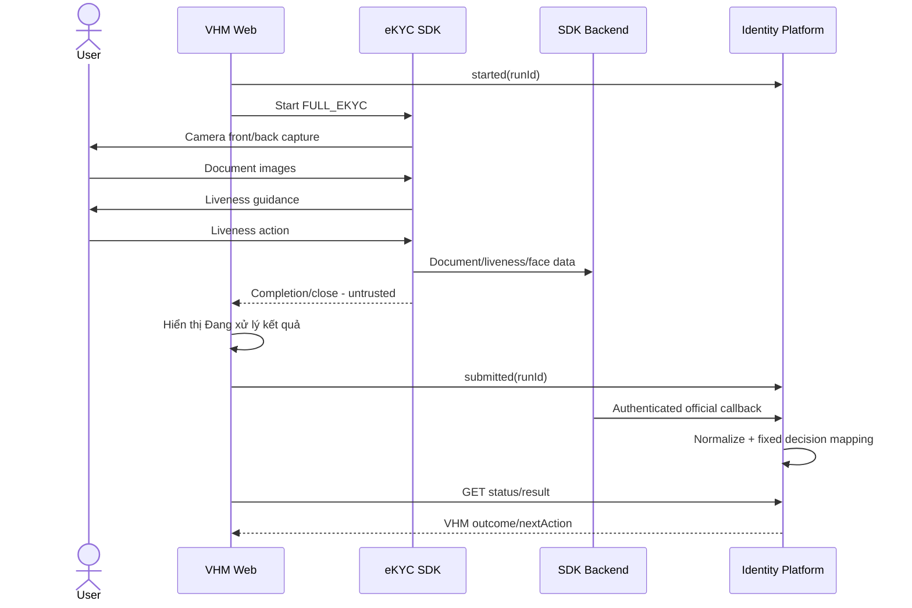

Refresh/reopen/multi-tab phải query backend status. Web không lưu bootstrap token
dài hạn và không tự tạo run mới khi lease còn active.

### **5.2.5. Callback thành công và duplicate**

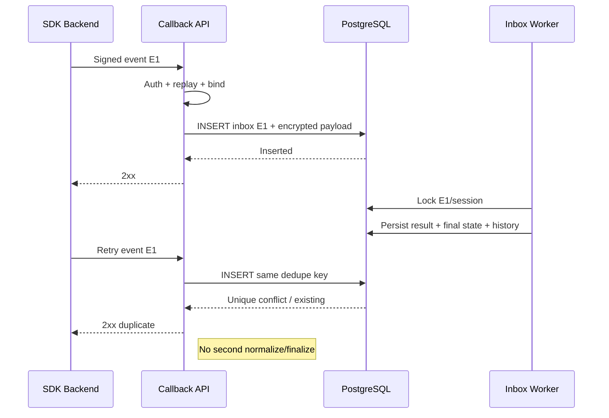

### **5.2.6. Callback đến trước client submitted**

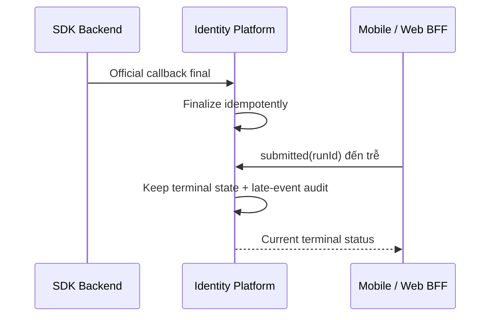

Client event không được đảo state hoặc ghi đè official result.

### **5.2.7. Callback thất lạc - Reconciliation**

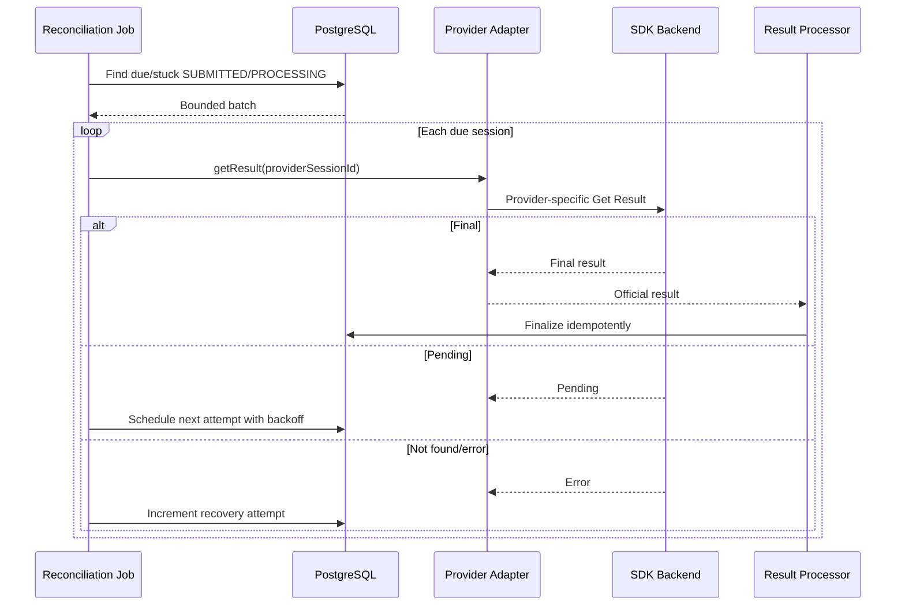

Callback và reconciliation dùng chung normalizer/state guard và session lock ngắn.
Hết recovery budget mới chuyển `PROVIDER_ERROR`.

### **5.2.8. User cancel/client close**

| **Tình huống** | **Client event** | **Backend action** |
| --- | --- | --- |
| User cancel trước submitted | `cancelled` với canonical reason | Chuyển `CANCELLED` nếu state cho phép |
| Mobile force-close | Có thể không có event | Giữ active đến expiry/reconcile; khi mở lại query status |
| Web refresh/reopen | Có thể không có event | Không auto cancel; query status và kiểm tra run lease |
| Mất mạng | Có thể không có event | Session timeout/reconcile theo policy |
| Official result đến sau cancel | Late result | Lưu late-result audit; không đảo `CANCELLED` |

### **5.2.9. Retry session**

```mermaid
sequenceDiagram
    participant APP as VHM Application
    participant IV as Identity Platform
    participant BACKEND as SDK Backend
    APP->>IV: POST retry + Idempotency-Key
    IV->>IV: Authorize + validate terminal retry state/cap
    IV->>BACKEND: Create provider session mới
    BACKEND-->>IV: New external reference/bootstrap
    IV->>IV: Create new verificationId + retry link
    IV-->>APP: New verificationId/bootstrap
```

Attempt mới không reuse provider session, result, history, token hoặc ảnh của attempt cũ.

## 5.3. Failure Handling Matrix

| **Tình huống** | **Detection** | **Platform state** | **Recovery/User action** | **Ops** |
| --- | --- | --- | --- | --- |
| Camera permission denied | Client canonical error | `NEED_RETRY` theo policy | Cấp quyền rồi whole-attempt retry | Metric/spike alert |
| Client/SDK unsupported | Compatibility policy | Không start SDK | Upgrade VHM Application | Metric |
| Front hoặc back quality fail | Official result/client error | `NEED_RETRY` | Retry whole attempt; không reuse ảnh pass | Quality metric |
| SDK init/crash | Client canonical error | `NEED_RETRY` | Retry có giới hạn | Alert nếu spike |
| Provider timeout/5xx | Adapter | Giữ `PROCESSING` trong recovery budget | Reconciliation/backoff | Dependency alert |
| Provider 401/403 | Adapter | `PROVIDER_ERROR` | Không tự retry; Ops sửa credential/config | Critical alert |
| Callback auth fail | CallbackAuthenticator | Không đổi business state | Provider sửa auth/retry | Security alert |
| Callback duplicate | Inbox unique key | Giữ state | Trả 2xx | Duplicate metric |
| Callback schema invalid | Schema validation | Không finalize | Provider sửa contract/payload | High alert |
| DB lỗi trước durable inbox | Insert failure | Chưa nhận callback | Provider retry | DB alert |
| DB lỗi sau durable inbox | Worker/inbox status | Giữ inbox pending/failed | Worker reprocess | Backlog alert |
| Callback lost | Reconciliation due | Giữ `SUBMITTED/PROCESSING` | Get Result bounded | Reconcile metric |
| Session stuck hết budget | Recovery counter | `PROVIDER_ERROR` | Contact support/retry theo policy | Incident review |
| Concurrent create | Unique/idempotency guard | Một active session | Trả session hiện hữu/conflict | Metric |
| Result API access sai scope | Authorization | Không đổi state | `403/404` | Security audit |

## 5.4. Data Normalization

- Unicode normalization, trim và collapse whitespace.
- Họ tên giữ dấu; có `searchValue` riêng nếu use case được phê duyệt.
- Date parse strict ISO-8601; không tự đảo ngày/tháng.
- Document number giữ string, không parse số.
- Address không tự suy diễn tỉnh/quận nếu provider không trả mã chuẩn.
- Field source chỉ thuộc fixed allowlist cho OCR result.
- Confidence validate `0..1`; ngoài range phải quarantine/mapping error.
- Boolean/string parse strict allowlist, không dùng truthy coercion.
- Không dùng `N/A`, empty string và null như cùng một nghĩa nếu contract không quy định.

# **6. Deployment Architecture**

## **6.1. Deployment Diagram**

```mermaid
flowchart LR
    subgraph CLIENTS["VHM Clients"]
        MOBILE["VHM Mobile"]
        WEB["VHM Web"]
        SDK["eKYC SDK"]
    end

    subgraph AWS["AWS Singapore - VHM Trust Boundary"]
        WAF["CDN / WAF / API Gateway"]
        INGRESS["Nginx Ingress"]
        subgraph EKS["V-App Amazon EKS"]
            API["Verification API"]
            CALLBACK["Callback API"]
            WORKER["Inbox / Reconciliation Workers"]
        end
        RDS[("RDS PostgreSQL Multi-AZ")]
        REDIS[("ElastiCache Redis")]
        SECRET["Secrets Manager / KMS"]
        OBS["Metrics / Logs / APM"]
        WAF --> INGRESS
        INGRESS --> API
        INGRESS --> CALLBACK
        API --> RDS
        CALLBACK --> RDS
        WORKER --> RDS
        API --> REDIS
        API --> SECRET
        WORKER --> SECRET
        API --> OBS
        CALLBACK --> OBS
        WORKER --> OBS
    end

    PROVIDER["SDK Backend"]
    MOBILE -->|VHM API| WAF
    WEB -->|VHM API| WAF
    MOBILE --> SDK
    WEB --> SDK
    SDK -->|OCR / Liveness / Face data| PROVIDER
    PROVIDER -->|Authenticated callback| WAF
    WORKER -->|Get Result - reconciliation only| PROVIDER
```

### 6.1.1. Network topology

- VHM API và callback ingress đi qua WAF/API Gateway/Nginx Ingress.
- Verification API, Callback API và worker chạy private trong EKS namespace riêng.
- RDS, Redis và Secrets/KMS chỉ truy cập qua private network control.
- Mobile/Web SDK data-plane kết nối trực tiếp SDK Backend bằng TLS.
- Chỉ callback route được public cho SDK Backend và phải có strong authentication.
- Egress tới SDK Backend dùng allowlist, timeout, circuit breaker và audit.

### 6.1.2. Network Flow Matrix

| **Source** | **Destination** | **Protocol** | **Data** | **Control** |
| --- | --- | --- | --- | --- |
| Mobile/Web | API Gateway/BFF | HTTPS 443 | Session/status/retry/result | JWT, WAF, rate limit |
| Mobile/Web SDK | SDK Backend | HTTPS 443 | OCR/liveness/face data | TLS, short-lived bootstrap, SDK integrity |
| SDK Backend | Callback API | HTTPS 443 | Official result | JWS/JWT, replay guard, WAF, dedupe |
| Platform | SDK Backend | HTTPS 443 | Create session/Get Result | Secret Manager, allowlist, timeout, circuit breaker |
| Platform/Worker | PostgreSQL | TLS | Session/result/inbox/audit | Security group, DB role, KMS |
| Platform | Redis | TLS | Rate limit/replay/ephemeral cache | Private endpoint, auth, TTL |
| Services | Monitoring/Logging | TLS | Masked telemetry | No PII/secret, access control |

## 6.2. Thành phần lưu trữ dữ liệu

| **Thành phần** | **Công nghệ** | **Dữ liệu** | **Control** |
| --- | --- | --- | --- |
| Verification DB | PostgreSQL Multi-AZ | Session, run, checks, fixed fields, result, history, callback inbox | TLS, KMS, PITR, RBAC |
| Redis | Redis | Rate limit, replay cache và ephemeral state | TTL, private network; không source of truth |
| Secret storage | AWS Secrets Manager/KMS | Provider credential, callback/public key refs, encryption keys | Rotation, workload identity, audit |
| Application memory | Process memory | Short-lived bootstrap/access token | Clear sau completion/cancel/expiry |
| SDK-flow media | Không lưu tại VHM | Document image, selfie, liveness video/frame | SDK Backend retention theo approved contract |

## 6.3. Capacity & Scaling

### 6.3.1. Capacity inputs bắt buộc trước production

- Daily/peak concurrent session cho Mobile và Web.
- Peak create/status/result TPS.
- Callback burst TPS và payload size p95/p99.
- Tỷ lệ `OCR_ONLY/FULL_EKYC`, retry và reconciliation.
- Provider quota, rate limit, SLA và maintenance window.
- Canonical result/inbox retention và DB growth.
- Mục tiêu p95/p99 theo từng interface.

### 6.3.2. Scaling design

| **Component** | **Scale** | **Signal** |
| --- | --- | --- |
| Verification API | HPA | CPU, request rate, p95 latency |
| Callback API | HPA độc lập | Callback TPS, ack latency, 5xx |
| Inbox Worker | Horizontal worker | Pending count, oldest age, processing latency |
| Reconciliation Worker | Horizontal + bounded lease | Due count/age, provider quota, lock wait |
| PostgreSQL | Multi-AZ + connection pool | CPU, IOPS, connection, lock wait, table/index growth |
| Redis | Managed scale | Memory, eviction, connection, command latency |

Worker claim batch bằng row lock/`SKIP LOCKED` hoặc lease tương đương. Mọi batch
phải bounded và tôn trọng provider quota; không dùng unbounded polling.

## 6.4. CI/CD Architecture

### 6.4.1. DevSecOps gates

- Compile/unit test và dependency lock validation.
- SCA/license scan cho backend, Mobile, Web và SDK artifact.
- Secret scan, SAST và IaC scan.
- Container vulnerability scan.
- DB migration compatibility/integration test.
- API/provider contract test.
- Mobile/Web client E2E evidence.
- Security/privacy approval gates.
- Immutable artifact promotion; không rebuild giữa environment.

### 6.4.2. Quality gates

| **Layer** | **Nội dung** | **Gate** |
| --- | --- | --- |
| Unit | State guard, idempotency, mapping, masking, retry rules | Critical branches `>=80%` |
| DB Integration | Constraint, index, locking, inbox, history, reconciliation query | Bắt buộc pass |
| Provider Contract | Create session, callback, Get Result và error fixtures | Bắt buộc pass |
| Mobile SDK | Permission, lifecycle, front/back, result page OFF, compatibility matrix | Bắt buộc pass |
| Web SDK | Camera permission, refresh/reopen/multi-tab, front/back, result page OFF | Bắt buộc pass |
| API Security | Authn/authz, tenant/object scope, masking, rate limit | Bắt buộc pass |
| E2E | Mobile/Web ↔ SDK Backend staging ↔ VHM Platform ↔ Domain | Happy + failure paths |
| Performance | Create/status/result/callback burst/reconciliation | Đạt NFR |
| Recovery | DB/provider outage, callback lost, worker restart, PITR | Bắt buộc pass |

### 6.4.3. Deployment strategy

- Backend canary/rolling deployment với readiness, liveness và startup probe.
- Mobile/Web SDK/profile rollout theo controlled cohort và compatibility matrix.
- DB migration backward-compatible trước khi deploy code sử dụng schema mới.
- Provider config/key rotation có overlap và rollback runbook.
- Dừng create session khi incident nhưng vẫn giữ callback/reconciliation nếu an toàn.

## 6.5. Tech Stack

| **Layer** | **Technology** |
| --- | --- |
| Backend | Java 25, Spring Boot 4.0.4, Spring Data JPA, Maven |
| Client | VHM Mobile, VHM Web và eKYC SDK được pin version |
| Database | Amazon RDS PostgreSQL 17 (Multi-AZ) |
| Cache | Amazon ElastiCache Redis 7.4; chỉ dùng rate-limit/replay/ephemeral cache |
| CI/CD | Azure DevOps (TFS) |
| Container Orchestration | Amazon EKS + Nginx Ingress Controller |
| DevSecOps | SCA, container vulnerability, secret và IaC scan trong pipeline |
| Secret Management | AWS Secrets Manager + KMS; ConfigMap chỉ chứa non-secret config |
| Monitoring/Logging | Micrometer, Prometheus, Grafana, APM, Fluentd, Elasticsearch |
| Circuit Breaker | Resilience4j |
| Environment | AWS Singapore (`ap-southeast-1`) — V-App EKS Cluster |

## 6.6. Configuration Management

### 6.6.1. Application config mẫu

```yaml
identity-verification:
  provider: DEFAULT_EKYC
  document-type: NATIONAL_ID_CHIP
  allowed-channels:
    - MOBILE_APP
    - WEB_APP
  allowed-journeys:
    - OCR_ONLY
    - FULL_EKYC
  session-timeout: 30m
  callback:
    processing-mode: ASYNC_INBOX
    replay-window: 5m
    encrypted-payload-ttl: 24h
  reconciliation:
    initial-delay: 2m
    interval: 1m
    max-attempts: 5
  retry:
    max-whole-attempts: 3
```

Configuration nằm trong versioned repository, không chứa secret, có schema
validation, owner, approval, before/after evidence và rollback.

### 6.6.2. SDK configuration baseline

| **Nhóm** | **Baseline** | **Owner** |
| --- | --- | --- |
| Channels | Mobile và Web | Product/Client Teams |
| Journeys | `OCR_ONLY`, `FULL_EKYC` | Product/Risk |
| Document | `NATIONAL_ID_CHIP`, front/back | Product/SDK Team |
| Result page | `OFF`; VHM Application sở hữu post-SDK screen | Product/UX |
| Guidance/progress | `ON` | Product/UX |
| Liveness | Bắt buộc trong `FULL_EKYC` | Product/Risk/Security |
| Screenshot/capture security | Block/detect nơi SDK hỗ trợ | Security/Client Teams |
| Session timeout | 30 phút, đồng bộ backend | Backend/SDK Team |
| Client compatibility | Mobile/Web/SDK matrix được pin version | Client/SDK Teams |

### 6.6.3. Change governance

1. Tạo change ticket và mô tả business/security/privacy impact.
2. Update versioned config/schema/contract fixture.
3. Review Product/Risk/Architect/Security/Privacy theo loại thay đổi.
4. Test sandbox/SIT/UAT trên Mobile và Web liên quan.
5. Canary/controlled rollout và theo dõi metric.
6. Rollback về config/artifact version trước nếu breach threshold.
7. Lưu approval, evidence và effective time.

## 6.7. Observability

### 6.7.1. Metrics

| **Metric** | **Type** | **Labels cho phép** |
| --- | --- | --- |
| `identity_verification_sessions_total` | Counter | journey, channel, status, domain |
| `identity_verification_duration_seconds` | Histogram | journey, channel, final_status |
| `identity_verification_sdk_event_total` | Counter | channel, event, outcome, app_version, sdk_version |
| `identity_verification_callback_total` | Counter | auth_result, processing_result |
| `identity_verification_callback_latency_seconds` | Histogram | provider |
| `identity_verification_callback_duplicate_total` | Counter | provider |
| `identity_verification_provider_request_total` | Counter | operation, outcome |
| `identity_verification_provider_latency_seconds` | Histogram | operation |
| `identity_verification_reconciliation_due` | Gauge | provider |
| `identity_verification_retry_total` | Counter | journey, channel, reason_category |
| `identity_verification_inbox_failed` | Gauge | failure_category |

Không dùng verification ID, business/subject reference hoặc PII làm metric label.

### 6.7.2. Logging

Log cho phép: timestamp, service/environment/version, internal verification ID theo
access policy, trace ID, operation, canonical error, provider HTTP status/duration,
channel và app/SDK version. Không log credential, token, CCCD, normalized fields,
media, raw callback, resource URL hoặc biometric score gắn với danh tính.

### 6.7.3. Alerts

| **Alert** | **Trigger** | **Severity** |
| --- | --- | --- |
| Callback authentication/replay failure | Bất kỳ production hoặc tăng đột biến | Critical/High |
| Provider authentication failure | 401/403 liên tục | Critical |
| Provider availability | Error rate vượt threshold trong 5 phút | High |
| Callback schema/mapping error | Có lỗi kéo dài hoặc sau provider change | High |
| Callback Inbox backlog | Oldest age vượt SLA | High |
| Reconciliation backlog | Oldest due age vượt SLA | High |
| SDK init/crash spike | Tăng theo channel/app/sdk version | High/Medium |
| Retry/error spike | Vượt journey/channel baseline | Medium/High |
| DB connection/lock saturation | Vượt infrastructure threshold | High |

# **7. Security**

> Security và Data Privacy là go-live gate. Tài liệu chỉ xác định baseline kỹ thuật;
> ANBM, Data Privacy và Legal phải phê duyệt control/evidence tương ứng.

## 7.1. Security Layers

### 7.1.1. Infrastructure & Network Security

- Mobile/Web API và callback ingress đi qua WAF/API Gateway.
- EKS workload, RDS, Redis và Secret Manager không public.
- Network policy/security group theo least privilege.
- Callback route tách rate/body limit với business API.
- Egress tới SDK Backend theo destination allowlist, TLS và timeout.
- DDoS/bot protection áp dụng theo risk của hành trình public.
- Production không cho debug endpoint, directory listing hoặc default credential.

### 7.1.2. Identity & Access Management

#### Authentication

| **Luồng** | **Cơ chế** |
| --- | --- |
| Mobile/Web → BFF | OIDC/JWT qua VHM Core IAM |
| BFF/Domain → Platform | Workload identity/JWT hoặc mTLS |
| SDK Backend → Callback | JWS/JWT bất đối xứng; mTLS bổ sung theo hạ tầng |
| Platform → SDK Backend | Secret Manager credential/workload identity theo contract |
| Platform → RDS/Redis/Secrets | Workload role, private network và least privilege |

- Validate issuer, audience, expiry, signature, token type và clock skew.
- Không dùng shared Basic Auth cho internal S2S.
- Không đưa provider API key/app secret xuống Mobile/Web.
- Bootstrap token TTL ngắn, bind session/run/journey/channel/environment.
- Callback key rotation phải overlap old/new key và có rollback runbook.

#### Authorization

- Caller phải đúng tenant/domain và có quyền với `businessRef/subjectRef`.
- BFF không được tin tenant/subject từ body; lấy từ security principal/context.
- Result/status/history API enforce object-level authorization chống IDOR.
- Fixed result fields và mask policy áp thống nhất cho caller đã được phê duyệt.
- Unmask yêu cầu elevated scope, reason và access audit.
- Ops reprocess/retry cần role riêng và reason; không được sửa official result.

### 7.1.3. Application Security & Data Protection

#### Zero Trust cho client result

- Mobile/Web completion chỉ phục vụ UX và không phải official result.
- Không nhận OCR field, decision, provider score, resource URL hoặc media từ client event.
- Chỉ callback đã xác thực hoặc Get Result từ Reconciliation Job được finalize session.
- Client event tới sau terminal chỉ ghi audit và không đảo state.

#### Callback Security

- JWS/JWT, `keyId`, issuer, audience, timestamp, event ID/nonce.
- Timestamp/replay window và event/payload dedupe.
- Verify signature trước parse sâu; giới hạn body size/depth/content type.
- Bind provider session, environment và result version với internal mapping.
- Redact media/resource reference; mã hóa payload tối thiểu trước durable inbox.
- Auth failure không insert business result và không thay đổi session.
- Duplicate durable trả 2xx nhưng không finalize lần hai.

#### Mobile Security

- SDK/package/profile pin version và integrity theo Mobile release process.
- Camera permission chỉ yêu cầu khi user bắt đầu journey.
- Bootstrap token chỉ giữ memory; clear khi completion/cancel/expiry.
- Device-security signal theo approved baseline; không dùng client signal làm identity decision duy nhất.
- Không log SDK payload, OCR field, token, media reference hoặc biometric score.
- Result screen của SDK đặt `OFF`; Mobile hiển thị VHM outcome.

#### Web Security

- SDK artifact/origin được allowlist và pin version theo Web release process.
- Áp CSP, output encoding, dependency integrity và anti-XSS controls theo platform standard.
- Không lưu bootstrap/result token trong localStorage hoặc storage dài hạn.
- Refresh/reopen/multi-tab phải query backend status và tuân thủ run lease.
- Camera permission chỉ yêu cầu trong active journey; frame/media không đi qua VHM backend.
- CSRF protection áp dụng theo auth model; CORS chỉ cho origin được duyệt.
- Result screen của SDK đặt `OFF`; Web hiển thị VHM outcome.

#### Transmission & Storage Encryption

- TLS cho mọi network flow.
- RDS, Redis backup và encrypted callback inbox dùng KMS-backed encryption.
- Sensitive normalized fields dùng application/column-level encryption khi cần.
- Credential/key ở Secret Manager, không ở repo/image/ConfigMap/log.
- SDK-flow media không lưu tại VHM.

#### Data Masking

- Document number mask mặc định, ví dụ `******1234`.
- Họ tên/ngày sinh/địa chỉ mask theo Result API contract và caller purpose.
- Provider code/warning chỉ trả canonical reason cần cho UX/business.
- Internal threshold, raw score và provider payload không expose.
- Support screen chỉ hiển thị dữ liệu tối thiểu và theo object scope.

#### Input/Output Security

- JSON schema, enum/range/length/depth/content-type validation.
- Reject unknown critical field; optional provider field được bỏ qua an toàn.
- Output encode theo context; `Cache-Control: no-store` cho sensitive response.
- Không tự động fetch provider resource URL.
- File/media upload không thuộc VHM Core Integration contract này.
- Error response không chứa stack trace, secret, raw payload hoặc PII.

#### Logging & Audit

- Audit create/start/submit/cancel/retry, callback auth/dedupe, state transition,
  result source, config/policy version, Result API access/unmask và secret rotation.
- Audit append-only/tamper-evident theo platform standard.
- Log/APM/analytics/crash report không chứa PII, credential, token, media hoặc raw result.
- Internal verification ID chỉ được log theo approved access policy.

### 7.1.4. Governance & Compliance

- Consent phải purpose-bound, versioned và kiểm tra trước create session.
- DPA/DPIA, data location, subprocessor, retention và deletion evidence là go-live gates.
- SDK/config/decision/retention thay đổi phải version hóa, approval và rollback.
- Provider incident/breach notification SLA và contact matrix phải có trong contract/runbook.
- Không sử dụng OCR/eKYC data ngoài purpose đã consent.

## **7.2. Data Privacy**

### 7.2.1. Data inventory

| **Data** | **Nguồn** | **Purpose** | **VHM persistence** | **Provider** | **Retention** |
| --- | --- | --- | --- | --- | --- |
| Business/subject opaque ref | Domain | Correlation/authorization | Có | External ref nếu cần | Business/audit policy |
| Consent ref/version/time | Consent/Domain | Legal basis/audit | Có | Theo contract | Legal/privacy policy |
| Document fields | SDK Backend | OCR/autofill/verification | Fixed fields, encrypted/masked | Có xử lý | Purpose-bound |
| Document image front/back | SDK | OCR/verification | Không | Có xử lý | Provider contract, ngắn nhất |
| Selfie/video/frame | SDK | Liveness/face matching | Không | Có xử lý | Provider contract, ngắn nhất |
| Liveness/face status | SDK Backend | Identity decision | Canonical status tối thiểu | Có xử lý | Purpose/audit policy |
| Provider session/event refs | SDK Backend | Correlation/dedupe | Có | Có | Operational retention |
| Callback payload | SDK Backend | Async normalization | Encrypted inbox TTL ngắn; purge sau processing | N/A | Operational minimum |
| App/SDK/channel metadata | Client | Compatibility/operations | Tối thiểu | SDK-dependent | Ops/security policy |
| Audit/history | VHM | Traceability/compliance | Có | Không cần | Audit policy |

### 7.2.2. Data lifecycle

```mermaid
flowchart LR
    CONSENT["Consent"] --> CREATE["Create verification session"]
    CREATE --> SDK["Mobile/Web SDK capture"]
    SDK --> BACKEND["SDK Backend processing"]
    BACKEND --> CALLBACK["Authenticated callback"]
    CALLBACK --> INBOX["Encrypted Callback Inbox<br/>TTL"]
    INBOX --> RESULT["Canonical Result<br/>fixed fields"]
    RESULT --> API["Authorized Result API<br/>masked by default"]
    API --> DOMAIN["Approved Domain use"]
    INBOX --> PURGE["Purge after processing/TTL"]
    RESULT --> RETENTION["Purpose-bound retention/deletion"]
```

- Media SDK flow không đi qua hoặc lưu tại VHM backend.
- Provider retention phải đủ cho reconciliation nhưng ngắn nhất theo contract.
- Callback payload chỉ lưu mã hóa tạm thời để async process.
- Canonical sensitive field chỉ lưu nếu nằm trong fixed approved result set.

### 7.2.3. Retention principles

- Session/history retention theo approved business/audit purpose.
- Canonical sensitive fields có retention ngắn nhất theo Domain purpose.
- Callback inbox encrypted payload purge sớm sau processing; metadata/hash theo operational TTL.
- Provider result/media retention theo DPA, reconciliation window và deletion SLA.
- Backup retention không được làm dữ liệu sống lại ngoài policy; deletion có tombstone/evidence.
- Không kéo dài retention chỉ vì mục đích debug/analytics.

### 7.2.4. Data subject request

- Xác minh requester và scope trước export/delete.
- Tìm theo opaque subject mapping qua authorized Domain contract.
- Export chỉ field được phép, đã mask theo legal/privacy rule.
- Delete/anonymize session/result theo retention/legal hold và ghi audit.
- Gửi provider deletion request khi contract/purpose yêu cầu.
- Backup deletion xử lý theo backup expiry/tombstone policy đã phê duyệt.

### 7.2.5. Access controls

- Service access theo least privilege và business-object scope.
- DBA không mặc định đọc plaintext sensitive fields.
- Unmask và bulk export cần elevated role, reason, approval/audit theo policy.
- Production support không được xem raw callback/media.
- Periodic access review và key/secret rotation evidence bắt buộc.

## 7.3. Threat Model

| **Threat** | **Vector** | **Mitigation** |
| --- | --- | --- |
| Client giả kết quả | Mobile/Web bị sửa gửi result giả | Server-to-server official result only |
| Lộ credential | Secret trong client/repo/log | Secret Manager, short-lived bootstrap, scanning/rotation |
| Callback spoof | Gọi public callback giả | JWS/JWT, audience, key rotation, WAF |
| Callback replay/duplicate | Gửi lại event/result | Timestamp, nonce/event dedupe, unique inbox |
| IDOR/cross-tenant | Đổi verificationId/businessRef | Object/tenant/domain authorization |
| Web XSS lấy token | Script độc hại | CSP, encoding, dependency security, memory-only token |
| Multi-tab/run race | Hai client run cho một session | Server-issued runId, lease, idempotency, state guard |
| Mobile tamper | Modified client/device | SDK integrity/security signal; server official result |
| PII leakage | Log/APM/analytics/crash report | Redaction, allowlist logging, DLP/PII scan |
| Media leakage | Client/backend lưu media ngoài scope | Direct SDK data-plane, no VHM media persistence |
| Provider compromise | Payload/resource độc hại | Schema validation, no URL fetch, fixed mapping, incident runbook |
| Insider unmask | Lạm dụng quyền support | Elevated scope, reason, access audit, periodic review |
| DB restore duplicate | Inbox/result xử lý lại | Unique keys, terminal guard, idempotent worker |
| Dependency outage | Provider/DB unavailable | Circuit breaker, reconciliation, Multi-AZ, backup/recovery |

## 7.4. Security Test Cases tối thiểu

- Callback invalid signature, issuer, audience, key ID, timestamp và replay.
- Duplicate/out-of-order callback và cùng event ID khác payload.
- Callback body quá size/depth, wrong content type và malicious resource URL.
- Cross-tenant/domain/business-object create/status/result/retry access.
- Client gửi OCR fields/decision/score/media/token trong submitted/error event.
- Concurrent create/run/retry và stale client event.
- Mobile token persistence, telemetry leakage và SDK integrity evidence.
- Web XSS/CSP/CSRF/CORS, storage leakage và multi-tab run conflict.
- Result API mask/unmask, cache-control và access audit.
- PII/secret scan repo/image/ConfigMap/log/APM/analytics/crash report.
- Callback inbox encryption, TTL, purge và backup behavior.
- Key/secret rotation overlap và revoked-key rejection.
- DB/provider outage, callback lost và worker restart.
- Restore test không finalize terminal result lần hai.

# **8. Backup & Recovery**

## 8.1. Phạm vi backup

Backup:

- `identity_verification` và retry links.
- Verification run, checks, fixed normalized fields và Canonical Result.
- Callback inbox metadata/encrypted payload còn trong TTL.
- State/access history và reconciliation schedule.
- Versioned non-secret configuration/policy metadata.
- Secret/key references và rotation metadata theo Secret Manager/KMS strategy.

Không backup như business source:

- Mobile/Web/SDK cache.
- Redis ephemeral rate-limit/replay entries.
- Bootstrap/access token.
- Document image, selfie, video/frame liveness của SDK flow.
- Raw provider payload ngoài encrypted Callback Inbox TTL.

## 8.2. Backup strategy

- RDS Multi-AZ, automated backup và PITR.
- Backup encryption bằng KMS và access role riêng.
- Cross-account/cross-region copy theo VHM DR policy nếu được phê duyệt.
- Retention backup phù hợp Data Privacy; không giữ sensitive data vô hạn.
- Restore test định kỳ trên isolated environment với masked/synthetic validation.
- Config versioned repository và immutable artifact registry là nguồn phục hồi deployment.
- Secret/key recovery theo Secrets Manager/KMS runbook; không export plaintext key.

## 8.3. Recovery Flow

```mermaid
sequenceDiagram
    participant OPS as Operations
    participant RDS as RDS Backup/PITR
    participant DB as Restored PostgreSQL
    participant API as Verification API
    participant INBOX as Inbox Worker
    participant RECON as Reconciliation Worker
    participant BACKEND as SDK Backend
    OPS->>RDS: Chọn restore point đã phê duyệt
    RDS->>DB: Restore isolated instance
    OPS->>DB: Validate schema/index/constraint/data integrity
    OPS->>API: Deploy approved artifact/config + bind secrets
    OPS->>API: Smoke test auth/create/status/result
    OPS->>INBOX: Resume pending/failed inbox bounded
    INBOX->>DB: Process idempotently
    OPS->>RECON: Resume due non-terminal sessions
    RECON->>BACKEND: Get Result trong provider retention window
    RECON->>DB: Finalize idempotently
    OPS->>OPS: Verify dashboards/alerts and close recovery
```

Trong recovery có thể tạm dừng create session trong khi callback ingress/inbox và
reconciliation tiếp tục để bảo toàn result đang bay.

## 8.4. RTO & RPO

| **Hạng mục** | **Baseline** | **Ghi chú** |
| --- | --- | --- |
| RTO | `<= 4 giờ` | Bao gồm DB restore, service deploy, validation và worker resume |
| RPO | `<= 15 phút` | Theo PITR/backup configuration được Ops phê duyệt |
| Provider result recovery | Trong provider retention window | Get Result chỉ qua Reconciliation Job |
| Configuration recovery | Versioned repository + approved baseline | Bao gồm Mobile/Web SDK compatibility |
| Secret/key recovery | Secrets Manager/KMS runbook | Rotation/revocation evidence bắt buộc |

RTO/RPO cuối cùng phải được System Owner và Operations xác nhận bằng restore drill.

## 8.5. Recovery verification checklist

- Schema/version/index/constraint đúng.
- Callback route/auth/key hoạt động.
- Create/status/result authorization và masking hoạt động.
- Có thể dừng create trong khi callback/reconciliation vẫn chạy.
- Pending/failed inbox được xử lý bounded và không finalize trùng.
- Non-terminal session được reconcile trong provider retention window.
- Terminal state không bị đảo bởi callback/client event trễ.
- Retry chain, idempotency và active-session constraint còn đúng.
- Callback encrypted payload TTL/purge job resume đúng.
- Dashboard/alerts/incident routing hoạt động.
- Restore log không chứa PII/secret.
- Data retention/deletion job tiếp tục đúng policy.
- Đạt RTO/RPO trong evidence của restore drill.

# **Glossary**

| **Thuật ngữ** | **Định nghĩa** |
| --- | --- |
| OCR | Optical Character Recognition - đọc và chuẩn hóa dữ liệu từ ảnh giấy tờ. |
| eKYC | Xác minh danh tính điện tử bằng document verification, liveness và face matching. |
| OCR_ONLY | Journey chỉ đọc front/back; kết thúc `COMPLETED`, `ekycOutcome=NOT_PERFORMED`. |
| FULL_EKYC | Journey OCR front/back → liveness → face matching; pass mới thành `VERIFIED`. |
| VHM Application | Ứng dụng Mobile và Web của VHM tích hợp eKYC SDK. |
| eKYC SDK | SDK chạy trên Mobile/Web để điều khiển capture và gửi data-plane tới SDK Backend. |
| SDK Backend | Hệ thống xử lý OCR, liveness và face matching; gửi callback/cung cấp Get Result. |
| Identity Verification Platform | Backend VHM quản lý session, callback, result, retry và reconciliation. |
| Domain System | Hệ thống nghiệp vụ được phê duyệt tạo session và sử dụng Canonical Result. |
| Provider Adapter | Lớp cô lập API/auth/payload/error của SDK Backend khỏi VHM contract. |
| Official Result | Kết quả server-to-server từ callback đã xác thực hoặc Get Result qua reconciliation. |
| Canonical Result | Mô hình kết quả chuẩn VHM, không phụ thuộc raw provider payload. |
| Callback Inbox | Bảng durable receive/dedupe, lưu payload tối thiểu đã mã hóa theo TTL. |
| Reconciliation | Job khôi phục callback quá SLA hoặc session treo bằng Provider Get Result. |
| Whole-attempt Retry | Tạo verification/provider session mới; không tái sử dụng result/media của attempt trước. |
| Idempotency Key | Khóa chống tạo trùng khi request được gửi lại. |
| Replay Guard | Timestamp + event ID/nonce ngăn callback bị phát lại. |
| Fixed Result Fields | Bộ field Canonical Result cố định đã được Product/Privacy phê duyệt. |
| Terminal State | `COMPLETED`, `VERIFIED`, `REJECTED`, `NEED_RETRY`, `PROVIDER_ERROR`, `CANCELLED`, `EXPIRED`. |

---

# **Appendix A. External Inputs & Confirmations**

> Các mục dưới đây là input/evidence bắt buộc để hoàn tất implementation và
> approval. Đây không phải lựa chọn kiến trúc còn để ngỏ; thiếu input tương ứng thì
> không được qua gate được ghi trong cột cuối.

## A.1. Business & Scope Inputs

| **Input cần xác nhận** | **Owner** | **Gate/Deadline** |
| --- | --- | --- |
| Domain/use case/business object được phép tạo session | Product/Domain Owner | Trước API contract sign-off |
| Hai journey `OCR_ONLY`, `FULL_EKYC` và channel áp dụng | Product/Risk | Trước SDK profile configuration |
| Document type `NATIONAL_ID_CHIP`, front/back và validation rules | Product/Risk/SDK Team | Trước OCR integration test |
| Fixed result field set và masking cho Domain System | Product/Domain/Data Privacy | Trước Result API contract test |
| Consent text/version/purpose/withdrawal behavior | Product/Legal/Data Privacy | Trước UAT |
| Fixed decision mapping, threshold và reason code UX | Product/Risk/Architect | Trước decision contract test |
| Whole-attempt retry cap, user message và support action | Product/Risk/Ops | Trước failure-path UAT |
| Business owner chịu trách nhiệm sử dụng result | Domain Owner | Trước production readiness |

## A.2. Mobile & Web SDK Inputs

| **Input cần xác nhận** | **Owner** | **Gate/Deadline** |
| --- | --- | --- |
| SDK package/version cho Mobile và Web | SDK/Client Teams | Trước integration build |
| Mobile/Web client compatibility matrix | SDK/Client Teams | Trước build/UAT |
| Camera permission, capture UX và quality guidance | SDK/Product/UX | Trước journey UAT |
| Front/back gửi cùng call hay lần lượt; fail-fast semantics | SDK Technical Team | Trước two-side implementation |
| Completion/close/error event và payload contract | SDK Technical Team | Trước client lifecycle integration |
| Result page `OFF` nhưng completion/close event vẫn phát | SDK Technical Team | Trước submitted integration test |
| Liveness/face behavior trong `FULL_EKYC` | SDK/Product/Risk | Trước FULL_EKYC E2E |
| Mobile background/force-close/reopen behavior | Mobile/SDK Team | Trước lifecycle test |
| Web refresh/reopen/multi-tab behavior | Web/SDK Team | Trước lifecycle test |
| Branding, localization, accessibility và security behavior | Product/UX/Client Teams | Trước UAT |

## A.3. SDK Backend Integration Inputs

| **Input cần xác nhận** | **Owner** | **Gate/Deadline** |
| --- | --- | --- |
| Create-session API/auth/error contract | SDK Backend/Backend Team | Trước Provider Adapter build |
| Callback JWS/JWT fields, key distribution, event ID/version/timestamp | SDK Backend/ANBM | Trước callback implementation |
| Callback retry/backoff/ordering/duplicate semantics | SDK Backend/Backend Team | Trước callback contract test |
| Get Result final/pending/not-found/error/quota contract | SDK Backend/Ops | Trước reconciliation test |
| Provider result retention window | SDK Backend/Data Privacy | Trước recovery sign-off |
| Canonical mapping fixtures cho success/failure/quality/technical errors | SDK Backend/QA | Trước contract test |
| Staging credentials/endpoints/allowlist và certificate chain | SDK Backend/DevOps/ANBM | Trước SIT |
| SLA, maintenance, incident contacts và escalation | SDK Backend/Ops | Trước production readiness |

## A.4. Security & Privacy Inputs

| **Input cần xác nhận** | **Owner** | **Gate/Deadline** |
| --- | --- | --- |
| DPA/DPIA, data location và subprocessor list | Data Privacy/Legal | Go-live blocker |
| Consent lawful basis và approved purpose | Data Privacy/Legal/Product | Trước UAT |
| Provider media/result retention và deletion SLA/evidence | Data Privacy/Legal/SDK Backend | Go-live blocker |
| Callback authentication/replay/key-rotation baseline | ANBM/SDK Backend | Trước security test |
| Fixed field encryption/masking/unmask access | ANBM/Data Privacy/Domain | Trước Result API UAT |
| Log/APM/analytics/crash-report data allowlist | ANBM/Data Privacy/Ops | Trước SIT |
| Mobile/Web security baseline và SDK integrity evidence | ANBM/Client Teams | Trước security sign-off |
| Data-subject export/delete và provider coordination | Data Privacy/Domain/SDK Backend | Trước go-live |

## A.5. NFR & Operations Inputs

| **Input cần xác nhận** | **Owner** | **Gate/Deadline** |
| --- | --- | --- |
| Daily volume, peak create/status/result TPS | Product/Ops | Trước capacity test |
| Callback burst TPS/payload size và provider quota | SDK Backend/Ops | Trước load test |
| p95/p99 target theo interface và availability SLA | System Owner/Ops | Trước NFR sign-off |
| Reconciliation delay/interval/batch/max attempts | Architect/Ops/SDK Backend | Trước recovery test |
| Callback inbox TTL/purge và operational retention | Ops/Data Privacy | Trước DB migration sign-off |
| RTO/RPO, PITR, restore frequency và DR owner | System Owner/Ops | Trước production readiness |
| Dashboard/alert threshold, routing và on-call owner | Ops/Service Owners | Trước go-live |
| Cost quota/alert và stop-create rule khi incident | Product/Ops | Trước go-live |

---

# **Appendix B. Design Decisions**

| **ID** | **Decision** | **Rationale** | **Impact** | **Status** |
| --- | --- | --- | --- | --- |
| ADR-001 | Identity Verification Platform là capability dùng chung VHM | Tránh domain tích hợp SDK Backend riêng | Cần ownership và governance tập trung | Accepted |
| ADR-002 | Sử dụng một SDK/provider | Giữ integration và operations rõ ràng | Provider contract là dependency chính | Accepted |
| ADR-003 | Hỗ trợ Mobile và Web | Đáp ứng hai kênh VHM đã chốt | Cần compatibility/E2E matrix cho cả hai | Accepted |
| ADR-004 | Chỉ document `NATIONAL_ID_CHIP`, front/back | Thu hẹp mapping, test và data scope | Loại giấy tờ khác cần cập nhật TDD | Accepted |
| ADR-005 | Hai journey `OCR_ONLY` và `FULL_EKYC` | Tách đọc giấy tờ khỏi xác minh danh tính | State/result phải tách OCR/eKYC outcome | Accepted |
| ADR-006 | Client completion không phải official result | Chống giả mạo client result | Mobile/Web phải có processing UX | Accepted |
| ADR-007 | Callback đã xác thực là official-result ingress chính | Server-to-server trust | Cần callback auth/dedupe/durable inbox | Accepted |
| ADR-008 | Get Result chỉ dùng cho reconciliation | Khôi phục callback lost/session stuck | Không polling mọi session | Accepted |
| ADR-009 | Provider Adapter + Canonical Result | Cô lập provider payload | Domain contract ổn định và fixed schema | Accepted |
| ADR-010 | OCR_ONLY pass thành `COMPLETED`, không `VERIFIED` | Tránh khẳng định sai về danh tính | UX/API phải tách outcome | Accepted |
| ADR-011 | Retry whole attempt | Giữ history và front/back correlation rõ ràng | Không reuse ảnh/result attempt cũ | Accepted |
| ADR-012 | Không lưu SDK-flow media tại VHM | Data minimization | Provider retention/deletion là go-live gate | Accepted |
| ADR-013 | Callback payload mã hóa tạm thời trong inbox | Async durable processing cần payload | TTL/purge/encryption bắt buộc | Accepted |
| ADR-014 | Result API dùng bộ field cố định | Đủ Core Integration, dễ phê duyệt | Thay field cần Product/Privacy approval | Accepted |
| ADR-015 | PostgreSQL là source of truth | Transaction, locking, dedupe và PITR | Cần index/retention/restore test | Accepted |

---

# **Appendix C. Go-live Checklist**

## C.1. Functional

- [ ] Create session idempotent và active-session concurrency.
- [ ] Bootstrap TTL/binding/lease và expired-token reissue.
- [ ] Mobile `OCR_ONLY` front/back pass/fail/whole-attempt retry.
- [ ] Web `OCR_ONLY` front/back pass/fail/whole-attempt retry.
- [ ] Mobile `FULL_EKYC` document/liveness/face pass và failure paths.
- [ ] Web `FULL_EKYC` document/liveness/face pass và failure paths.
- [ ] SDK result page `OFF`; completion/close event vẫn phát.
- [ ] Started/submitted/error/cancel idempotency và late-event handling.
- [ ] Callback trước/sau submitted, duplicate và out-of-order.
- [ ] Callback lost → reconciliation final/pending/not-found/error.
- [ ] `OCR_ONLY → COMPLETED`, `FULL_EKYC → VERIFIED` đúng contract.
- [ ] Definitive failure, recoverable quality và technical error mapping đúng.
- [ ] Result API fixed fields, `RESULT_NOT_READY` và authorization.
- [ ] Whole-attempt retry link/history/cap và không reuse media/result.
- [ ] Mobile background/force-close/reopen.
- [ ] Web refresh/reopen/multi-tab/run lease.

## C.2. Security

- [ ] Không secret trong Mobile/Web/repo/image/ConfigMap/log.
- [ ] Callback JWS/JWT, audience/timestamp/replay/dedupe test pass.
- [ ] Callback key/secret rotation và revoked-key test pass.
- [ ] Tenant/domain/object IDOR tests pass.
- [ ] Result API mask/unmask/cache-control/access audit pass.
- [ ] Mobile SDK integrity/token/telemetry controls approved.
- [ ] Web CSP/XSS/CSRF/CORS/storage/multi-tab controls approved.
- [ ] Encrypted Callback Inbox, TTL, purge và backup behavior tested.
- [ ] PII/secret scan sạch trên log/APM/analytics/crash report.
- [ ] Không High/Critical security defect còn mở.

## C.3. Data Privacy

- [ ] Consent purpose/version/withdrawal approved và tested.
- [ ] Fixed result field set và retention được phê duyệt.
- [ ] VHM không lưu document/selfie/video/frame của SDK flow.
- [ ] Provider data location/subprocessor/DPA/DPIA approved.
- [ ] Provider retention/deletion SLA và evidence approved.
- [ ] Data-subject export/delete và backup behavior tested.
- [ ] Callback payload TTL/purge evidence đầy đủ.

## C.4. Operations

- [ ] Mobile/Web/SDK compatibility matrix published.
- [ ] Provider quota/SLA/maintenance/incident contacts confirmed.
- [ ] Dashboard/alerts có owner và routing.
- [ ] Capacity/load/callback burst/reconciliation test đạt baseline.
- [ ] Inbox/Reconciliation workers healthy và backlog dưới SLA.
- [ ] Stop-create/rollback/provider incident runbook đã diễn tập.
- [ ] Backup/PITR/restore test đạt RTO/RPO.
- [ ] Key/secret/config rotation runbook đã diễn tập.
- [ ] Retention/purge jobs hoạt động và có alert.
- [ ] Tất cả approval/evidence được lưu theo governance.

---

# **Appendix D. Tài liệu tham chiếu**

1. SDK package/API/configuration guide cho Mobile và Web: **TBD**.
2. SDK Backend callback/Get Result/error integration pack: **TBD**.
3. Mobile/Web compatibility matrix và lifecycle behavior: **TBD**.
4. VHM Core IAM, S2S, EKS, RDS, Secrets/KMS và observability standards: **TBD**.
5. ANBM secure SDLC, callback authentication và data-protection standards: **TBD**.
6. Data Privacy consent, field scope, DPA/DPIA, retention và deletion standards: **TBD**.
7. Product/Risk fixed decision mapping và reason-code UX: **TBD**.
8. Operations capacity, SLA, RTO/RPO và incident runbooks: **TBD**.

> Các artefact **TBD** là approval/input gate đã xác định owner tại Appendix A.
> TDD không được chuyển `APPROVED` và hệ thống không được go-live khi gate bắt buộc
> chưa có evidence.
