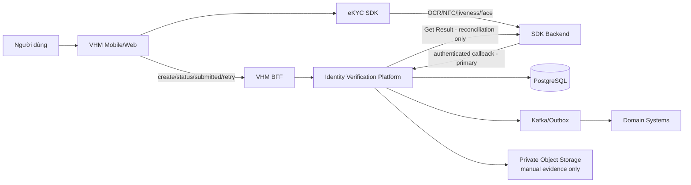
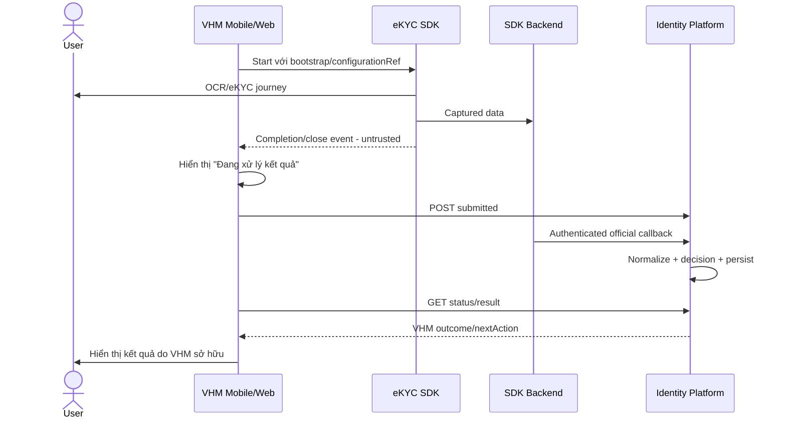
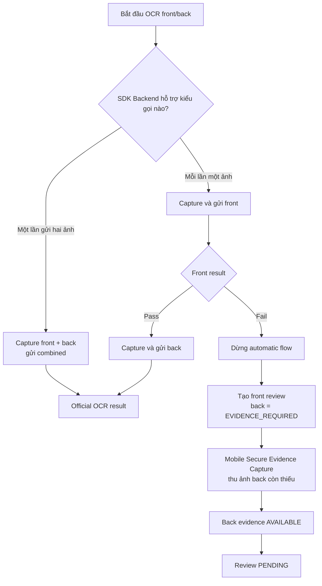
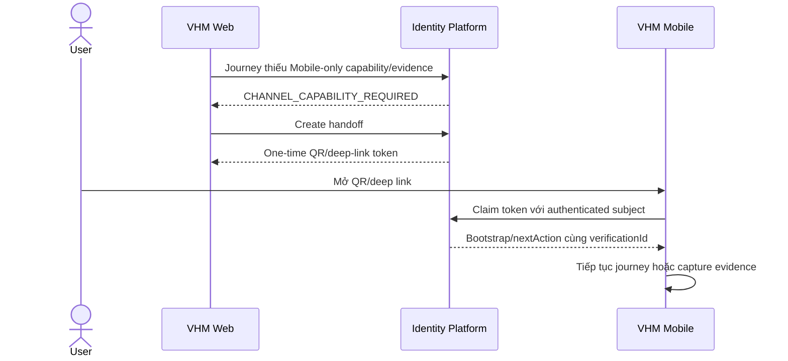
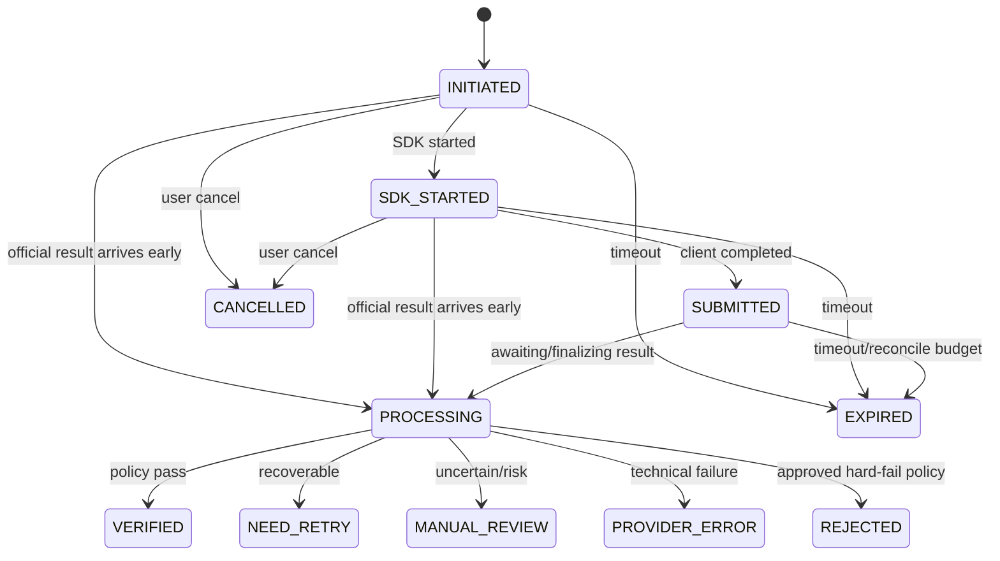
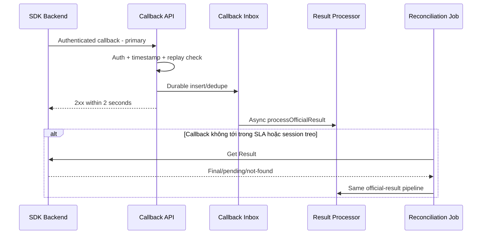

# VHM OCR & eKYC SDK — TDD triển khai và phê duyệt

> **TÀI LIỆU MẬT**  
> Đây là bản TDD rút gọn phục vụ review, phê duyệt và triển khai. Thiết kế chi tiết,
> schema, payload đầy đủ và toàn bộ sequence được quản lý tại
> [TDD_OCR_EKYC_SDK.md](./TDD_OCR_EKYC_SDK.md). Khi có khác biệt, tài liệu chi tiết
> là nguồn chuẩn.

| **Thuộc tính** | **Giá trị** |
| --- | --- |
| Tên hệ thống | VHM Identity Verification Platform — OCR & eKYC SDK |
| Phạm vi | Capability OCR/eKYC dùng chung cho hệ sinh thái VHM |
| Kênh | Mobile App, Mobile Web, Desktop Web |
| Mức độ | Tier 2 — Business Critical |
| Trạng thái | DRAFT / IN REVIEW / APPROVED |
| Phiên bản tài liệu chi tiết | 0.2 |
| Document Owner | TBD |
| System Owner | TBD |
| Ngày phê duyệt | TBD |

---

# 1. Cách sử dụng tài liệu

Tài liệu được tổ chức theo quyết định cần duyệt và đầu việc cần triển khai. Mỗi nhóm
chỉ cần đọc phần liên quan nhưng phải hiểu ba nguyên tắc chung:

1. Client SDK không phải nguồn kết quả cuối cùng.
2. Callback đã xác thực là luồng nhận official result chính.
3. OCR thành công không đồng nghĩa người thực hiện đã được xác minh danh tính.

| **Nhóm đọc** | **Phần bắt buộc** | **Mục tiêu** |
| --- | --- | --- |
| Product/Domain | 2, 4, 7, 12 | Duyệt journey, UX, decision, retry/manual review và cách domain sử dụng kết quả |
| Architect/System Owner | 2–8, 10–12 | Duyệt boundary, contract, state, resilience, security và NFR |
| Backend | 3, 5–8, 10–11 | Triển khai session, callback, reconciliation, state, API/event và data |
| Mobile | 3–5, 9–10 | Triển khai SDK lifecycle, processing screen, fail-fast, handoff và evidence |
| Web | 3–5, 9–10 | Triển khai SDK lifecycle, browser rules, processing screen và handoff |
| SDK Technical Team | 3–6, 12 | Xác nhận profile SDK, completion event, callback/Get Result và compatibility |
| QA | 4–7, 9–11 | Xây test plan có traceability và release evidence |
| ANBM/Data Privacy | 3, 8, 10, 12 | Duyệt trust boundary, bảo mật, dữ liệu, consent và retention |
| DevOps/Operations | 6, 10–12 | Triển khai config, monitoring, recovery, runbook và go-live gates |

---

# 2. Tóm tắt giải pháp và quyết định cần phê duyệt

## 2.1. Mục tiêu

- Tích hợp OCR/eKYC thống nhất trên Mobile và Web.
- Chuẩn hóa kết quả SDK thành Canonical Result trước khi domain sử dụng.
- Cung cấp một lifecycle dùng chung từ tạo phiên đến kết quả cuối cùng.
- Kiểm soát consent, security, retention, retry, manual review và audit tập trung.
- Không để từng domain phụ thuộc trực tiếp vào payload hoặc credential của SDK.

## 2.2. Phạm vi

| **Trong phạm vi** | **Ngoài phạm vi** |
| --- | --- |
| `OCR_ONLY` và `FULL_EKYC` | Tự phát triển OCR/liveness/face-matching engine |
| Mobile App, Mobile Web, Desktop Web | Kho sinh trắc học dài hạn tại VHM |
| OCR giấy tờ, NFC, liveness, face matching | Domain truy cập raw provider payload |
| Callback, reconciliation, Canonical Result | Một policy nghiệp vụ áp cho mọi domain |
| Web→Mobile handoff khi thiếu capability | Tự động chuyển provider trong Release 1 |
| Manual review và Mobile secure evidence sau fail-fast | Đồng bộ/sửa master data ngoài contract domain |
| Audit, monitoring, backup và recovery | Sử dụng dữ liệu ngoài consent purpose |

## 2.3. Baseline kiến trúc

| **ID** | **Quyết định đã chốt** | **Ý nghĩa triển khai/phê duyệt** |
| --- | --- | --- |
| D-01 | Identity Verification Platform là capability dùng chung | Domain chỉ dùng API/event chuẩn của VHM |
| D-02 | SDK chạy trên cả Mobile và Web | Hai kênh có compatibility và test matrix riêng |
| D-03 | SDK gửi dữ liệu OCR/NFC/liveness/face tới SDK Backend | VHM xử lý control-plane, session và official result |
| D-04 | Callback đã xác thực là official-result ingress chính | Client completion không được hoàn tất session |
| D-05 | Get Result chỉ dùng bởi Reconciliation Job | Không polling trong happy path |
| D-06 | Trang kết quả SDK đặt `OFF` trên SDK Configuration Portal | VHM Application sở hữu màn hình sau SDK |
| D-07 | OCR và eKYC là hai outcome độc lập | `OCR_ONLY` không được hiển thị “Đã xác minh danh tính” |
| D-08 | Automatic SDK media không lưu tại VHM | Chỉ lưu normalized data tối thiểu và audit |
| D-09 | Mọi create/callback/retry/event đều idempotent | Duplicate không tạo state/event/side effect lần hai |
| D-10 | Fail-fast có thể thiếu ảnh back | Mobile thu bổ sung evidence cho manual review, không gọi lại OCR |
| D-11 | Web không thu manual evidence | Web handoff sang Mobile bằng token one-time |
| D-12 | Lỗi kỹ thuật không phải identity rejection | Timeout/5xx chuyển `PROVIDER_ERROR`, không `REJECTED` |

---

# 3. Kiến trúc dễ đọc

## 3.1. System context

## 3.2. Trách nhiệm thành phần

| **Thành phần** | **Chịu trách nhiệm** | **Không chịu trách nhiệm** |
| --- | --- | --- |
| VHM Mobile/Web | Consent, capability check, start SDK, processing UX, submitted/cancel/error | Không quyết định `VERIFIED`; không gửi OCR fields tin cậy |
| VHM BFF | User authentication, authorize business object, route API | Không giữ SDK credential hoặc map provider payload |
| Identity Verification Platform | Session, policy, callback, normalize, decision, reconciliation, audit, API/event | Không sở hữu business object của domain |
| eKYC SDK | Camera/NFC, user guidance, capture journey, client completion event | Client completion không phải official result |
| SDK Backend | OCR/NFC/liveness/face processing, callback, Get Result contract | Không quyết định business state của domain |
| Domain System | Business eligibility, sử dụng scoped result, notification/lock/business action | Không tích hợp trực tiếp SDK Backend |
| Private Object Storage | Manual evidence bổ sung, encrypted, TTL ngắn | Không lưu automatic-flow media |

## 3.3. Trust và dữ liệu

| **Luồng** | **Mức tin cậy** | **Kiểm soát bắt buộc** |
| --- | --- | --- |
| Device → VHM API | Untrusted | User JWT, object authorization, rate limit, idempotency, schema validation |
| Device SDK → SDK Backend | External dependency | TLS, SDK integrity, bootstrap ngắn hạn, device security |
| SDK Backend → Callback API | External server | JWS/JWT, timestamp, replay guard, WAF, durable inbox, idempotency |
| Platform → SDK Backend | External dependency | Secret Manager, TLS, timeout, circuit breaker, audit |
| Platform → Domain | Zero Trust internal | Workload identity, consumer scope, event ACL, schema version |
| Platform → DB/Kafka/Storage | Restricted | Private network, IAM, encryption, least privilege |

---

# 4. Journey và trải nghiệm người dùng

## 4.1. Journey matrix

| **Journey** | **Các bước** | **Kết quả được phép hiển thị** | **Không được hiểu là** |
| --- | --- | --- | --- |
| `OCR_ONLY` | OCR document; NFC nếu policy yêu cầu | Đã đọc giấy tờ/fields được xác nhận; retry/manual action | Người thao tác đã được xác minh danh tính |
| `FULL_EKYC` | Document → NFC theo policy → liveness → face matching | VHM outcome/next action sau official result | Client SDK completion là verified |

## 4.2. Channel rules

| **Capability** | **Mobile App** | **Mobile Web/Desktop Web** | **Quy tắc** |
| --- | --- | --- | --- |
| OCR camera | Native SDK | Web SDK trên browser allowlist | Permission và quality preflight trước start |
| NFC | Device/OS allowlist | Không hỗ trợ baseline | Journey bắt buộc NFC phải handoff Mobile |
| Liveness | Native SDK | Web SDK + camera allowlist | Không silent skip trong `FULL_EKYC` |
| Result page SDK | `OFF` | `OFF` | VHM hiển thị processing và outcome |
| Manual evidence | VHM Secure Evidence Capture | Không capture | Web handoff Mobile |
| Resume | Theo SDK/app compatibility | Query backend sau refresh | Không lưu bootstrap token dài hạn |

## 4.3. Completion và hiển thị kết quả

Quy tắc bắt buộc:

- Không truyền runtime UI toggle chưa thuộc SDK contract trong bootstrap.
- `configurationRef` chỉ tham chiếu profile đã publish trên SDK Configuration Portal.
- Tắt result page không được làm mất completion/close event; đây là integration gate.
- Nếu callback đến trước `submitted`, Platform vẫn xử lý và giữ terminal state.
- Nếu client gửi `submitted` trễ, event đó không được đảo ngược terminal state.

## 4.4. OCR front/back fail-fast

Các ràng buộc:

- Ảnh back bổ sung chỉ phục vụ manual review.
- Không gọi lại SDK Backend/OCR cho ảnh back bổ sung.
- Không sửa official front result.
- Không tính manual evidence thành automatic retry hoặc provider attempt mới.
- Evidence upload one-time, bind subject/session/review/sub-step/version, TTL ngắn.

## 4.5. Web handoff sang Mobile

Handoff token không chứa PII, chỉ dùng một lần, TTL ngắn và bind đúng subject/session.

---

# 5. Session, state và business outcome

## 5.1. Session baseline

| **Thuộc tính** | **Baseline** |
| --- | --- |
| Internal ID | `verificationId` UUIDv7 do VHM sinh |
| Active uniqueness | Một active session trên tenant/domain/business/subject/purpose/journey |
| Idempotency | `Idempotency-Key` bắt buộc khi create/retry |
| Timeout | 30 phút; SDK config và backend dùng cùng policy version |
| Retry | Tạo session mới, link `retryOfVerificationId`; không reuse external session |
| Client completion | Chỉ chuyển `SUBMITTED`, không verified |
| Provider completion | Callback hợp lệ; Get Result chỉ qua reconciliation fallback |
| Business completion | Sau normalize, decision và durable outbox |

## 5.2. State machine

## 5.3. Outcome mapping

| **Tình huống** | **Platform outcome** | **User action** |
| --- | --- | --- |
| OCR đủ field/chất lượng | `OCR_VERIFIED`; `ekycOutcome=NOT_PERFORMED` | Tiếp tục nghiệp vụ OCR_ONLY |
| FULL_EKYC pass toàn bộ required check | `VERIFIED` | Tiếp tục nghiệp vụ theo domain |
| Ảnh mờ/chói/mất góc còn attempt | `NEED_RETRY` | Chụp lại với hướng dẫn cụ thể |
| Camera permission/SDK init lỗi | `SDK_ERROR` | Cấp quyền hoặc thử lại |
| Timeout/5xx SDK Backend | `PROVIDER_ERROR` | Hệ thống reconcile trước khi cho user retry |
| Face mismatch/spoof warning/uncertain | `MANUAL_REVIEW` | Chờ xử lý hoặc bổ sung evidence |
| Hard-fail rule đã được phê duyệt | `REJECTED` | Domain xử lý theo approved policy |
| Hết reconciliation budget, chưa có result | `PROVIDER_ERROR` | Liên hệ hỗ trợ; không bắt retry mù |

---

# 6. Contract triển khai

## 6.1. API chính

| **API/Event** | **Caller** | **Mục đích** | **Kiểm soát chính** |
| --- | --- | --- | --- |
| `POST /internal/v1/identity-verifications` | BFF/Domain | Tạo phiên và bootstrap | AuthZ business object, consent, idempotency, active guard |
| `GET /internal/v1/identity-verifications/{id}` | BFF/Domain | Lấy status/nextAction | Tenant/object scope, masking |
| `POST /{id}/started` | BFF | Ghi SDK run started | `runId`, lease, app/sdk/browser version |
| `POST /{id}/submitted` | BFF | Ghi client completion | Untrusted completion; không nhận OCR fields |
| `POST /{id}/cancelled` | BFF | Ghi user cancel | Terminal guard, reason catalogue |
| `POST /{id}/sdk-error` | BFF | Ghi canonical client error | Mask SDK code; không log payload |
| `POST /{id}/retry` | BFF/Ops | Tạo attempt mới | Idempotency, retry cap, reason |
| `POST /{id}/handoffs` | Web BFF | Tạo handoff Mobile | Token one-time, TTL, binding |
| `POST /handoffs/{token}/claim` | Mobile BFF | Claim handoff | Authenticated subject, replay guard |
| `POST /integration/v1/ekyc/callback` | SDK Backend | Nhận official result | JWS/JWT, replay guard, durable inbox |
| `GET /{id}/result` | Authorized Domain | Lấy normalized result | Consumer field scope, masking/audit |
| `POST /{id}/manual-decisions` | Reviewer/Ops | Resolve manual review | Reviewer scope, optimistic lock, audit |
| `POST /{id}/manual-evidence/intents` | Mobile BFF | Cấp upload instruction | Evidence type/version/subject binding |
| `POST /{id}/manual-evidence/{evidenceId}/complete` | Mobile BFF | Hoàn tất evidence | Object/checksum/MIME/size/version validation |
| `identity.verification.completed.v1` | Outbox Publisher | Phát final outcome | Schema version, no raw PII, idempotent consumer |

## 6.2. Official result: callback và reconciliation

Callback và reconciliation phải đi qua cùng normalizer, decision, state guard và
outbox. Session terminal không phát final event lần hai.

## 6.3. Idempotency và concurrency

| **Tình huống** | **Khóa/Dedupe** | **Kết quả bắt buộc** |
| --- | --- | --- |
| Create trùng | `Idempotency-Key` + request fingerprint | Trả cùng session; cùng key khác body trả conflict |
| Active session đồng thời | Partial unique active index | Chỉ một active session |
| Callback trùng | Provider event ID/result version/payload hash | 2xx, không apply hoặc publish lần hai |
| Callback và reconciliation race | Row lock + `processOfficialResult()` chung | Chỉ một transaction hoàn tất session |
| Retry trùng | Idempotency + retry chain | Chỉ tạo một attempt mới |
| Manual decision trùng | Review state + optimistic/pessimistic lock | Giữ quyết định terminal đầu tiên |
| Event publish lỗi | Transactional outbox | Final state giữ nguyên; publisher retry |
| Worker crash | Durable outbox + scheduler sweep | Task được reclaim, không mất |

## 6.4. Error contract tối thiểu

| **Nhóm** | **Ví dụ** | **Retryable** | **Xử lý** |
| --- | --- | --- | --- |
| Client capability | Camera/NFC/browser unsupported | Theo user action | Đổi permission/device hoặc handoff |
| Input quality | Blur/glare/missing corner | Có giới hạn | `NEED_RETRY` |
| SDK technical | Init/script/lifecycle error | Có kiểm soát | `SDK_ERROR` |
| Provider transient | Timeout/429/5xx | Có backoff | `PROVIDER_ERROR` + reconcile |
| Provider auth/schema | 401/403/contract break | Không retry vô hạn | Alert P1/P2, quarantine/reprocess |
| Identity uncertainty | Face mismatch/spoof warning | Không automatic retry | `MANUAL_REVIEW` |
| Security | Callback auth/replay fail | Không | Reject, không đổi session, security alert |

---

# 7. Dữ liệu và event

## 7.1. Dữ liệu lưu tại VHM

| **Dữ liệu** | **Lưu ở đâu** | **Mục đích** |
| --- | --- | --- |
| Session/run/status/history | PostgreSQL | Lifecycle, audit, support |
| Canonical checks/fields được duyệt | PostgreSQL, encrypted/masked | Decision và scoped projection |
| Callback envelope/hash/auth metadata | Callback Inbox | Dedupe, trace, reprocess |
| Domain event | Transactional Outbox/Kafka | Durable integration |
| Manual evidence bổ sung | Private Object Storage | Manual review, TTL ngắn |
| Secret/key references | Secret Manager/KMS | Authentication/encryption |

## 7.2. Dữ liệu không lưu tại VHM

- Raw callback payload trong normal operation.
- Automatic-flow document images, selfie, liveness video/frame và raw NFC.
- Provider resource URL dài hạn.
- SDK bootstrap token trong browser/mobile persistent storage.
- CCCD, biometric score, raw warning hoặc credential trong log/metrics/event.

## 7.3. Event tối thiểu

| **Event** | **Khi phát** | **Payload được phép** |
| --- | --- | --- |
| `identity.verification.status-changed.v1` | State transition quan trọng | ID nội bộ, routing context, previous/new status, reason category |
| `identity.verification.completed.v1` | Final result đã persist | Outcome, journey, policy/schema version, no raw PII |
| `STEP_PASSED/FAILED/REVIEW_REQUIRED` | Pipeline hook | Step code, outcome, domain routing metadata |
| `REVIEW_EVIDENCE_READY` | Evidence bắt buộc đã available | Review/step IDs, không media URL |

Domain consumer phải idempotent theo event ID và không được suy diễn raw provider code.

---

# 8. Security và Data Privacy

| **Hạng mục** | **Baseline bắt buộc** | **Bên phê duyệt** |
| --- | --- | --- |
| Consent | Bind subject, purpose, version trước create session | Product/Legal/Privacy |
| SDK credential | Chỉ backend/Secret Manager; bootstrap opaque và TTL ngắn | ANBM/Platform |
| Callback | JWS/JWT bất đối xứng, timestamp, event ID/nonce, replay window | ANBM/SDK Team |
| Mobile | Root/jailbreak/debugger/emulator controls theo baseline; block screenshot nơi hỗ trợ | ANBM/Mobile |
| Web | Browser allowlist, CSP, XSS/CSRF/clickjacking, dependency integrity | ANBM/Web |
| Authorization | Tenant/domain/business object/reviewer/data scope | Architect/ANBM/Domain |
| Encryption | TLS in transit; KMS-backed encryption at rest/field level | ANBM/Platform |
| Logging | Structured log đã mask; không secret, PII, media hoặc biometric raw | ANBM/Ops |
| Manual evidence | One-time upload, private storage, checksum/MIME/size/version binding, TTL/purge | ANBM/Privacy |
| Retention | Ngắn nhất theo purpose; deletion job và deletion audit | Privacy/Legal/System Owner |
| Data residency/subprocessor | DPA/DPIA và location được phê duyệt trước production | Privacy/Legal |

Security failure không được fallback sang flow yếu hơn. Exception phải có approver,
expiry, audit và rollback.

---

# 9. Kế hoạch triển khai theo team

| **ID** | **Team** | **Đầu việc bắt buộc** | **Definition of Done** |
| --- | --- | --- | --- |
| MOB-01 | Mobile | Tích hợp native SDK lifecycle và permission | Pass real-device matrix; app background/kill/resume không tạo run trùng |
| MOB-02 | Mobile | Dùng profile có SDK result page `OFF` | Completion event vẫn phát; VHM processing screen hiển thị đúng |
| MOB-03 | Mobile | Gửi started/submitted/cancel/sdk-error | API idempotent; không gửi OCR fields/PII raw |
| MOB-04 | Mobile | Hỗ trợ NFC/capability và handoff claim | Device allowlist và wrong-subject/replay test pass |
| MOB-05 | Mobile | VHM Secure Evidence Capture | One-time upload, checksum, TTL, resume và app-kill test pass |
| MOB-06 | Mobile | UX retry/manual/support | Reason mapping user-friendly; không hiển thị provider raw code |
| WEB-01 | Web | Tích hợp Web SDK và camera preflight | Browser/camera matrix được publish và pass |
| WEB-02 | Web | Dùng profile có SDK result page `OFF` | Processing screen, submitted và status polling pass |
| WEB-03 | Web | Xử lý refresh/tab close/multi-tab | Không auto-cancel; run lease và resume/retry đúng |
| WEB-04 | Web | Web→Mobile handoff | QR/deep link one-time, expiry và replay test pass |
| WEB-05 | Web | CSP và dependency integrity | CSP report sạch; origin allowlist/version lock được duyệt |
| BE-01 | Backend | Create/status/started/submitted/retry APIs | Contract test, authZ, idempotency và state guard pass |
| BE-02 | Backend | Session/state/history schema | Migration, constraint/index/locking integration test pass |
| BE-03 | Backend | Provider Adapter | Timeout, retry, circuit breaker và contract fixtures pass |
| BE-04 | Backend | Callback authentication + durable inbox | Auth/replay/duplicate/burst test pass; ack <= 2 giây |
| BE-05 | Backend | Canonical normalizer/decision | Mapping/version/range/null/schema-change tests pass |
| BE-06 | Backend | Reconciliation Job | Chỉ due/stuck session; bounded batch/backoff/quota test pass |
| BE-07 | Backend | Transactional outbox/event | DB/Kafka failure test; không mất hoặc phát side effect trùng |
| BE-08 | Backend | Pipeline/sub-step/manual review | Combined/fail-fast/ANY/STRICT/version guard tests pass |
| BE-09 | Backend | Manual evidence metadata contract | Binding/checksum/TTL/duplicate/superseded tests pass |
| DOM-01 | Domain | Authorize businessRef/subjectRef | Object/tenant scope test pass |
| DOM-02 | Domain | Consumer registration và field scope | Product/Privacy duyệt; projection không lộ field ngoài scope |
| DOM-03 | Domain | Consume completion/status event | Idempotent consumer và DLQ/replay test pass |
| DOM-04 | Domain | Áp business action/notification/identity lock | Không hard-code trong Platform; domain hook idempotent |
| OPS-01 | DevOps/Ops | Secret/config/deployment | Không secret trong repo/image/ConfigMap/log; rotation runbook pass |
| OPS-02 | DevOps/Ops | Dashboard và alert | Callback/reconcile/inbox/outbox/manual backlog có owner/SLA |
| OPS-03 | DevOps/Ops | Backup/restore/PITR | RTO/RPO recovery test pass |
| OPS-04 | DevOps/Ops | Provider incident/rollback | Stop-create giữ callback/reconcile; runbook diễn tập pass |
| QA-01 | QA | Contract và E2E matrix | Mobile/Web happy/failure/race/retry/manual paths có traceability |
| QA-02 | QA/Security | Security/privacy tests | Không High/Critical; PII scan log/APM/analytics sạch |

---

# 10. NFR, vận hành và quan sát

## 10.1. Baseline NFR

| **Chỉ số** | **Release 1 Baseline** |
| --- | --- |
| Platform availability | >= 99.9%/tháng |
| Create session | p95 <= 1 giây không tính external call; <= 3 giây end-to-end |
| Status/result query | p95 <= 300 ms với dữ liệu đã persist |
| Callback acknowledgement | Durable receive và 2xx <= 2 giây |
| Event delivery | p95 <= 5 giây sau khi result được xử lý |
| RTO | <= 4 giờ |
| RPO | <= 15 phút/PITR |
| Connect/read timeout | 2 giây / 10 giây |
| Reconciliation | Initial delay 2 phút; interval 1 phút; tối đa 5 attempt |

## 10.2. Metrics/alert bắt buộc

| **Nhóm** | **Theo dõi** | **Alert chính** |
| --- | --- | --- |
| Session funnel | Created/started/submitted/final theo channel/journey | Conversion hoặc error spike |
| Callback | Auth result, latency, duplicate, schema failure | Auth/replay bất kỳ production; schema error |
| Provider | Request outcome/latency/quota | 401/403, availability/error-rate threshold |
| Reconciliation | Due count, oldest age, attempt | Oldest age vượt SLA |
| Inbox/Outbox | Pending/failed/oldest age | Backlog vượt SLA |
| SDK client | Init/crash/permission/browser unsupported | Spike theo app/sdk/browser version |
| Manual review/evidence | Pending age, evidence-required age, abandon | Oldest age vượt domain SLA |

Metrics không dùng verification ID, business ref, subject ref hoặc PII làm label.

---

# 11. Test và acceptance matrix

| **Nhóm** | **Scenarios bắt buộc trước go-live** | **Expected evidence** |
| --- | --- | --- |
| OCR_ONLY | Mobile/Web pass, quality retry, cancel, expire, refresh | E2E report + screenshots/log đã mask |
| FULL_EKYC | Mobile/Web document, NFC policy, liveness, face pass | Device/browser matrix + E2E report |
| Result UX | SDK result page OFF, completion event, processing, VHM outcome | Client integration recording/test report |
| Callback | Success, duplicate, out-of-order, before submitted, auth fail, schema change | Contract/integration/load report |
| Reconciliation | Callback lost, pending, final, not-found, quota/backoff, max attempts | Resilience report + dashboard evidence |
| Retry | Recoverable-only, attempt cap, new session chain, duplicate request | State/history assertions |
| Fail-fast | Combined; sequential front pass; front fail/back missing | Sub-step/manual-review assertions |
| Manual evidence | Intent, upload, checksum, TTL, duplicate complete, app kill, old version | Mobile/Backend/Security test report |
| Handoff | Success, expiry, replay, wrong subject, unsupported device | Web/Mobile E2E report |
| Concurrency | Create race, multi-tab/run conflict, callback/reconcile race | DB integration/locking report |
| Event | Kafka outage, duplicate publish/consume, DLQ/replay | Outbox/consumer evidence |
| Security | IDOR, tenant isolation, replay, XSS/CSP, SSRF, PII leakage, key rotation | Pentest/security approval |
| Recovery | DB restore, callback route, non-terminal reconcile, outbox resume | RTO/RPO exercise report |

Release không được go-live nếu còn High/Critical security defect, contract chưa xác
nhận, callback/reconciliation chưa test hoặc consent/retention chưa được duyệt.

---

# 12. Bảng phê duyệt và go-live gates

## 12.1. Approval matrix

| **Hạng mục phê duyệt** | **Approver** | **Điều kiện được ký duyệt** | **Trạng thái** |
| --- | --- | --- | --- |
| Journey/UX/result screen/retry | Product/Domain Owner | Flow và acceptance criteria đã UAT | ☐ |
| Architecture/API/event/state | Architect/System Owner | ADR, contract, NFR và failure handling hoàn chỉnh | ☐ |
| Mobile implementation | Mobile Lead | Device matrix, lifecycle, fail-fast/evidence pass | ☐ |
| Web implementation | Web Lead | Browser matrix, CSP, refresh/multi-tab/handoff pass | ☐ |
| Backend implementation | Backend Lead | Contract, migration, state/idempotency/resilience pass | ☐ |
| SDK contract/profile | SDK Technical Team | Profile export, completion, callback/Get Result fixtures xác nhận | ☐ |
| Security | ANBM | Threat model, pentest, secret/auth/data controls đạt | ☐ |
| Data Privacy/Legal | Privacy/Legal | Consent, DPA/DPIA, residency, retention/deletion đạt | ☐ |
| Test acceptance | QA Lead | SIT/UAT/regression/security evidence đạt | ☐ |
| Operations readiness | Operations | Monitoring, alert, capacity, runbook, backup/recovery đạt | ☐ |

## 12.2. External-input gates

| **Input/evidence bắt buộc** | **Owner** | **Gate** |
| --- | --- | --- |
| Mobile/Web SDK package, version và compatibility matrix | SDK/Mobile/Web | Trước integration build |
| SDK profile theo environment/channel; result page `OFF` | Product/SDK Team | Trước UAT |
| Completion/close event khi result page `OFF` | SDK Team | Trước submitted integration test |
| Callback JWS/JWT, event ID, ordering/retry/schema | SDK Backend/ANBM | Trước callback implementation/load test |
| Get Result quota, retention và final/pending/not-found semantics | SDK Backend/Ops | Trước reconciliation test |
| Consent text/version/purpose và field scope | Product/Legal/Privacy | Trước UAT |
| Data location, DPA/subprocessor, retention/deletion evidence | Privacy/Legal | Go-live blocker |
| Manual-review owner, queue, SLA và escalation | Product/Operations | Trước manual-review UAT |
| Volume, peak TPS, callback burst và cost model | Product/Ops/FinOps | Trước load/capacity test |
| RTO/RPO, backup/PITR và incident contacts | System Owner/Ops | Trước production readiness |

## 12.3. Tuyên bố phê duyệt

Khi ký duyệt tài liệu này, approver xác nhận phần thuộc trách nhiệm của mình phù hợp
với baseline nêu trên và evidence đã được cung cấp. Thay đổi sau phê duyệt ảnh hưởng
journey, official-result path, data scope, security, retention hoặc state machine phải
được đánh giá tác động và cập nhật TDD/ADR trước khi triển khai.

---

# Appendix. Tra cứu tài liệu chi tiết

| **Nội dung cần tra cứu sâu** | **TDD chi tiết** |
| --- | --- |
| Kiến trúc/module/trust boundary | Chương 2.1–2.3 |
| State, DB schema, concurrency, pipeline | Chương 2.2–2.6 |
| Business rules/channel rules | Chương 3 |
| API, callback, adapter, Canonical Result, event | Chương 4 |
| Toàn bộ sequence và failure matrix | Chương 5 |
| Deployment, scaling, CI/CD, config, observability | Chương 6 |
| Security, privacy, threat model | Chương 7 |
| Backup/recovery/RTO/RPO | Chương 8 |
| External inputs, ADR và go-live checklist | Appendix A–C |
