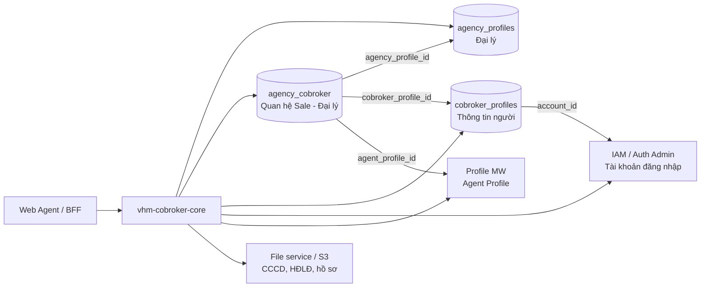
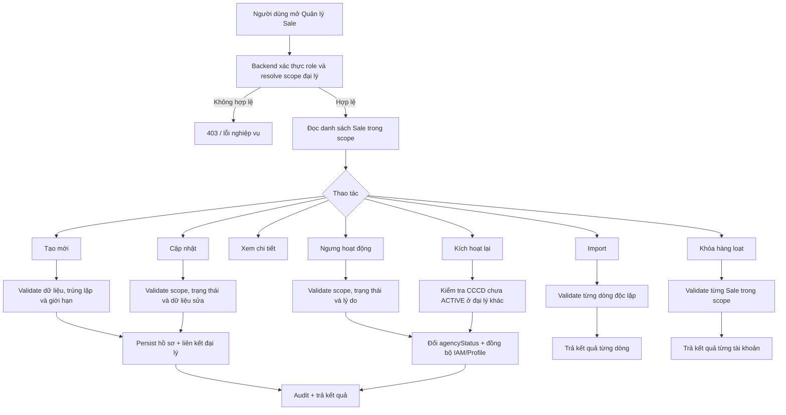
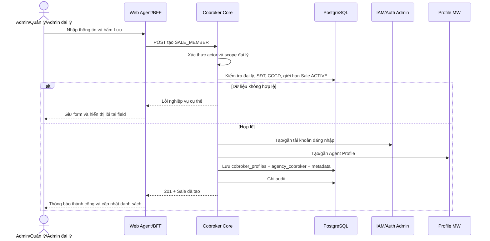
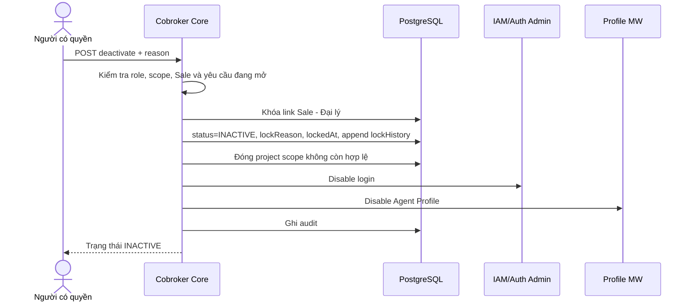

# UC-05 — Quản lý tài khoản Sale đại lý

> Phiên bản viết lại và đối chiếu code, ngày 14/09/2026  
> Nguồn nghiệp vụ: [FRS — Quản lý định danh và kiểm soát tài khoản Sale đại lý](https://vin3s.atlassian.net/wiki/spaces/BMAS/pages/2874024939/FRS+-+Qu+n+l+nh+danh+v+ki+m+so+t+t+i+kho+n+Sale+i+l#UC-05.-CRUD-v%C3%A0-qu%E1%BA%A3n-l%C3%BD-danh-s%C3%A1ch-t%C3%A0i-kho%E1%BA%A3n-Sale-%C4%91%E1%BA%A1i-l%C3%BD)  
> Phạm vi code đối chiếu: repository `vhm-cobroker-core` tại thời điểm lập tài liệu

## 1. Mục tiêu

Cho phép người dùng có thẩm quyền quản lý vòng đời tài khoản Sale đại lý (trong code là `SALE_MEMBER`/CVKD), từ khi tìm kiếm hoặc tạo hồ sơ, cập nhật thông tin, xem chi tiết, đến ngưng hoạt động và kích hoạt lại.

Mọi thao tác phải đồng thời bảo đảm:

- Đúng tổ chức và đúng phạm vi đại lý của người thao tác.
- Không tạo trùng người đang hoạt động theo CCCD và không tạo trùng tài khoản theo SĐT.
- Trạng thái việc làm tại đại lý, tài khoản đăng nhập IAM và Agent Profile được cập nhật nhất quán.
- Các thay đổi quan trọng được lưu dấu vết; không xóa cứng dữ liệu Sale.

## 2. Phạm vi

### 2.1. Trong UC-05

- Xem, tìm kiếm, lọc và phân trang danh sách Sale.
- Xem chi tiết một Sale.
- Tạo mới một Sale thủ công.
- Cập nhật thông tin một Sale.
- Ngưng hoạt động một Sale, có lý do.
- Kích hoạt lại một Sale.
- Import danh sách Sale từ file và trả kết quả theo từng dòng.
- Ngưng hoạt động nhiều Sale trong một thao tác.

### 2.2. Liên quan nhưng nên đặc tả ở UC riêng

- Gửi email/kích hoạt tài khoản lần đầu: UC-06/UC-04.
- Ghi nhận vi phạm/kỷ luật: UC-08.
- Quản lý hồ sơ, HĐLĐ và thông tin chi tiết: UC-09.
- Thiết lập dự án hàng loạt: UC-10.

## 3. Tác nhân và phân quyền

| Tác nhân | Mã role trong FRS | Phạm vi dữ liệu | Quyền trong UC-05 |
|---|---:|---|---|
| Admin hệ thống | 11 | Toàn tổ chức | Xem, tạo, sửa, khóa, mở khóa, import, thao tác hàng loạt |
| Quản lý đại lý | 100 | Các đại lý được phân quyền | Xem, tạo, sửa, khóa, mở khóa, import, thao tác hàng loạt |
| Admin đại lý | 64 | Chỉ đại lý được gắn với tài khoản đang đăng nhập | Xem, tạo/cập nhật Sale, khóa/mở khóa trong đại lý của mình |

Quy tắc bắt buộc: client không được quyết định scope. Backend phải suy ra/kiểm tra scope từ `RequestContext`, tổ chức, `agentProfileId` và liên kết đang `ACTIVE` giữa Admin đại lý với đại lý.

## 4. Mô hình dữ liệu nghiệp vụ

Một tài khoản Sale được cấu thành từ nhiều lớp dữ liệu, không chỉ một bản ghi:

| Khái niệm | Nguồn lưu chính trong code | Ý nghĩa |
|---|---|---|
| Người Sale | `cobroker_profiles` | Họ tên, SĐT, email, CCCD, trạng thái hồ sơ, account IAM |
| Quan hệ làm việc | `agency_cobroker` | Sale thuộc đại lý nào, vai trò, trạng thái làm việc, ngày khóa, lý do khóa |
| Thông tin mở rộng | JSONB trên `agency_cobroker` | Ngày sinh, địa chỉ, chức vụ, HĐLĐ, dự án, hồ sơ, vi phạm |
| Tài khoản đăng nhập | IAM/Auth Admin | Cho phép hoặc chặn đăng nhập |
| Hồ sơ Agent | Profile MW | Hồ sơ người dùng trên hệ sinh thái Agent |

Phải phân biệt hai trạng thái:

- `status`: trạng thái hồ sơ người trong `cobroker_profiles` (`DRAFT`, `ACTIVE`, `INACTIVE`, `FROZEN`, `REQUEST_UPDATE`).
- `agencyStatus`: trạng thái làm việc tại một đại lý trong `agency_cobroker` (`ACTIVE`, `INACTIVE`).

## 5. Luồng tổng thể

## 6. Yêu cầu chức năng chi tiết

### 6.1. Danh sách Sale

Hệ thống chỉ trả Sale trong scope của người dùng. Mặc định sắp xếp mới nhất trước và chỉ trả quan hệ đang `ACTIVE`; muốn xem Sale đã nghỉ/khóa phải truyền rõ `agencyStatuses=INACTIVE`.

| Nhóm | Tiêu chí hỗ trợ |
|---|---|
| Tìm kiếm | Họ tên, SĐT hoặc email (`q`) |
| Đại lý | Một hoặc nhiều `agencyProfileIds`; Admin đại lý bị giới hạn về đại lý của mình |
| Vai trò | `SALE_MEMBER` cho màn Sale; API hiện hỗ trợ cả `SALE_ADMIN` |
| Trạng thái hồ sơ | `statuses` |
| Trạng thái tại đại lý | `agencyStatuses` |
| Dự án phụ trách | `assignedProjectIds` hoặc `hasAssignedProject` |
| Dự án đăng ký thêm | `additionalProjectIds` hoặc `hasAdditionalProject` |
| Khoảng thời gian | `from`, `to` theo ngày tạo |
| Định danh | Bộ lọc trạng thái eKYC/OCR và trạng thái hiển thị |
| Phân trang | Trang bắt đầu từ 1; page size 1–100, mặc định 20 |

Kết quả tối thiểu cần hiển thị: họ tên, CCCD, SĐT, email, đại lý, ngày sinh, dự án, trạng thái hồ sơ, trạng thái làm việc, trạng thái định danh, ngày tạo và thông tin khóa nếu có.

### 6.2. Tạo Sale thủ công

#### Dữ liệu đầu vào

| Field nghiệp vụ | Field API/code | Bắt buộc | Quy tắc |
|---|---|---:|---|
| Vai trò | `roleType` | Có | Màn UC-05 luôn gửi `SALE_MEMBER` |
| Đại lý | path `agencyProfileId` hoặc backend tự suy scope | Có | Role 11/100 chọn đại lý; role 64 không được tự chọn ngoài scope |
| Họ tên | `fullName` | Có | Không rỗng, tối đa 100 ký tự |
| CCCD | `identityNo` | Có với Sale | Chuẩn hóa khoảng trắng; không được có Sale ACTIVE khác trong cùng tổ chức |
| Ngày sinh | `dateOfBirth` | Có với Sale | Ngày hợp lệ; cần chốt thêm giới hạn tuổi nghiệp vụ |
| SĐT | `phone` | Có | Hợp lệ dạng local hoặc E.164; so trùng cả biến thể `0...` và `+84...` |
| Email | `email` | Có với Sale | Đúng định dạng; dùng cho tài khoản/2FA |
| Địa chỉ | `contactAddress` | Không | Free text; cần chốt chiều dài tối đa |
| Chức vụ | `position` | Không | Free text |
| Ngày bắt đầu HĐLĐ | `laborContractStartDate` | Không | Ngày hợp lệ |
| Dự án | `projects` | Không | Dự án phụ trách/đăng ký thêm; tuân thủ UC-10 |
| Hồ sơ | `documents` | Không | File phải qua luồng prepare-upload trước khi gắn metadata |

#### Luồng tạo thành công

Nếu một bước provision hoặc persist bắt buộc thất bại, giao dịch tạo phải thất bại; không trả thành công khi dữ liệu lõi chưa nhất quán.

### 6.3. Cập nhật Sale

Điều kiện:

- Sale tồn tại trong cùng tổ chức và cùng đại lý nằm trong scope.
- Đại lý không có yêu cầu cập nhật đang mở có thể gây ghi đè dữ liệu.
- Admin đại lý không được sửa chính hồ sơ Admin của mình và không được sửa Admin đại lý khác.
- Đối với `SALE_MEMBER`, cập nhật trực tiếp theo whitelist field của `CobrokerUpdateData`.
- SĐT của Sale hiện được coi là bất biến trong endpoint cập nhật chung; thay đổi SĐT dùng endpoint chuyên biệt và rule riêng.
- Hồ sơ đã có tài liệu không được ghi đè bằng `documents` trong endpoint cập nhật chung; dùng endpoint tài liệu riêng.

### 6.4. Ngưng hoạt động

Điều kiện đầu vào: Sale đang `ACTIVE`, thuộc scope, người dùng có quyền và nhập lý do không rỗng.

Ngưng hoạt động là soft-delete trên quan hệ `agency_cobroker`; không xóa hồ sơ người. Gọi lại với một Sale đã `INACTIVE` phải idempotent và không tạo log trùng.

### 6.5. Kích hoạt lại

- Sale phải thuộc scope và đang `INACTIVE`.
- Trước khi kích hoạt, hệ thống kiểm tra CCCD chưa gắn với một Sale `ACTIVE` ở đại lý khác trong cùng tổ chức.
- Khi thành công: đổi `agencyStatus=ACTIVE`, xóa current `lockReason/lockedAt`, append lịch sử mở khóa, enable IAM và Agent Profile, đồng thời ghi audit.
- Dữ liệu dự án và hồ sơ cũ được giữ nguyên, trừ khi có quy tắc nghiệp vụ khác được phê duyệt.

### 6.6. Import danh sách Sale

Đề xuất contract nghiệp vụ để hoàn thiện vì code hiện chưa có endpoint import Sale:

1. Người dùng tải file mẫu theo phiên bản hiện hành.
2. Role 11/100 phải chỉ định đại lý; role 64 backend tự suy đại lý và không nhận đại lý từ file.
3. Hệ thống kiểm tra định dạng file, header, dung lượng và số dòng tối đa.
4. Mỗi dòng được validate như luồng tạo thủ công.
5. Dòng hợp lệ được tạo; dòng lỗi không được tạo và có mã lỗi/thông báo/cột lỗi.
6. Kết quả trả tổng số thành công, thất bại và file kết quả tải xuống.
7. Việc retry file kết quả không được tạo trùng các dòng đã thành công.

Import cần chốt rõ cơ chế xử lý: partial success theo từng dòng hay atomic toàn file. Theo FRS hiện tại, lựa chọn phù hợp là **partial success theo từng dòng**.

### 6.7. Ngưng hoạt động hàng loạt

Đề xuất contract nghiệp vụ để hoàn thiện vì code hiện chỉ có endpoint ngưng hoạt động từng Sale:

- Request gồm danh sách `cobrokerProfileId` và một lý do chung bắt buộc.
- Backend kiểm tra scope từng Sale; không tin danh sách đã lọc từ FE.
- Trả kết quả theo từng Sale gồm `SUCCESS`, `ALREADY_INACTIVE`, `NOT_FOUND`, `OUT_OF_SCOPE` hoặc lỗi đồng bộ.
- Cần chốt atomic toàn bộ hay partial success. Khuyến nghị partial success, nhưng mỗi Sale phải transactionally nhất quán giữa DB, IAM và Profile MW.

## 7. Quy tắc nghiệp vụ

| ID | Quy tắc |
|---|---|
| BR-01 | Admin đại lý chỉ được đọc và thao tác Sale thuộc đại lý có liên kết quản trị `ACTIVE` của mình. |
| BR-02 | SĐT được chuẩn hóa trước khi kiểm tra trùng; `098...` và `+8498...` là cùng một số. |
| BR-03 | Một CCCD chỉ được có một quan hệ Sale `ACTIVE` trong một tổ chức. |
| BR-04 | Tạo Sale phải có `fullName`, `identityNo`, `dateOfBirth`, `phone`, `email`. |
| BR-05 | Không hard-delete Sale; ngưng hoạt động tại quan hệ Sale–đại lý. |
| BR-06 | Lý do ngưng hoạt động là bắt buộc, trim trước khi lưu, tối đa 512 ký tự. |
| BR-07 | Khóa/mở khóa phải cập nhật DB, IAM, Agent Profile và audit nhất quán. |
| BR-08 | Kích hoạt lại phải tái kiểm tra xung đột CCCD. |
| BR-09 | Mặc định danh sách chỉ hiển thị quan hệ `ACTIVE`. |
| BR-10 | Giới hạn Sale ACTIVE/đại lý lấy từ cấu hình, không hard-code trong FRS/UI. |
| BR-11 | Import xử lý và báo lỗi theo từng dòng; không bỏ qua lỗi âm thầm. |
| BR-12 | Mọi API đều kiểm tra `organizationId` và scope ở backend. |

## 8. API hiện có và mức độ đáp ứng

Base path: `/internal/v1/agencies` — controller chỉ cho service principal có role `BFF`; quyền người dùng cuối được truyền qua `RequestContext` và kiểm tra trong service.

| Chức năng | API hiện có | Trạng thái |
|---|---|---|
| Danh sách/tìm kiếm/lọc | `GET /cobrokers` | Đã có; giàu bộ lọc hơn FRS |
| Chi tiết | `GET /{agencyId}/cobrokers/{profileId}` | Đã có |
| Tạo theo agency | `POST /{agencyId}/cobrokers` | Đã có; đường này dành ARM |
| Tạo self-service theo scope | `POST /cobrokers` | Đã có; backend suy đại lý từ caller |
| Cập nhật | `PUT /{agencyId}/cobrokers/{profileId}` | Đã có |
| Ngưng hoạt động | `POST /{agencyId}/cobrokers/{profileId}/deactivate` | Đã có, nhưng reason chưa được bắt buộc ở DTO/controller |
| Kích hoạt lại | `POST /{agencyId}/cobrokers/{profileId}/reactivate` | Đã có |
| Import tài khoản Sale | Chưa thấy endpoint trong controller agency | GAP |
| Ngưng hoạt động hàng loạt | Chưa thấy endpoint batch trong controller agency | GAP |
| Tài liệu/hồ sơ | `prepare-upload` và endpoint `documents` riêng | Đã có, thuộc UC-09 |
| Vi phạm/kỷ luật | `POST .../violations` | Đã có, thuộc UC-08 |
| Thiết lập dự án hàng loạt | Nhóm API project-assignment riêng | Đã có domain riêng, thuộc UC-10 |

## 9. Đối chiếu FRS và code

| Nội dung | FRS hiện tại | Code hiện tại | Kết luận/việc cần làm |
|---|---|---|---|
| Scope Admin đại lý | Chỉ Sale của đại lý phụ trách | Có guard theo org, `agentProfileId`, agency link ACTIVE | Phù hợp |
| Field tạo bắt buộc | Tên, CCCD, ngày sinh, SĐT, email | DTO bắt buộc tên/SĐT/role; email/CCCD/ngày sinh được kiểm thêm trong service | Phù hợp về hành vi; nên gom validation contract rõ hơn |
| Username Sale | SĐT | Code provision Sale theo SĐT E.164 | Phù hợp |
| Trạng thái | FRS gọi chung “trạng thái tài khoản” | Code tách `status` hồ sơ và `agencyStatus` việc làm | Cần sửa FRS/UI để tránh nhầm |
| Khóa tài khoản | Bắt buộc lý do | Request body optional; service chấp nhận reason null/rỗng | **GAP nghiêm trọng** |
| Khóa hàng loạt | Có trên header | Không thấy API batch tương ứng | **GAP** |
| Import Sale | Có partial success và file kết quả | Không thấy API/handler import Sale trong module agency | **GAP** |
| Xóa Sale | CRUD được nhắc chung | Không hard-delete; dùng deactivate/reactivate | Code đúng hướng; đổi tên UC, bỏ chữ Delete |
| Cập nhật | FRS nói chung chung | Code có whitelist, SĐT/email có quy tắc bất biến và endpoint riêng | FRS cần mô tả field nào được sửa |
| Giới hạn Sale | FRS chưa nêu rõ | Cấu hình `max-active-sale-allowance-per-agency`; message lỗi còn ghi 1000, local default 10000 | **GAP tài liệu/message cấu hình** |
| Audit khóa/mở | FRS yêu cầu log | Code có current pointer + `lockHistory` append-only + audit | Phù hợp |
| Đồng bộ khóa | FRS chỉ nói hạn chế đăng nhập | Code disable/enable cả IAM và Agent Profile | Code đầy đủ hơn FRS |
| Dự án | FRS trộn vào UC-05 | Code có domain project-assignment riêng | Giữ field hiển thị/cập nhật đơn; tách batch sang UC-10 |

## 10. Mã lỗi nghiệp vụ quan trọng đã có trong code

| Code | Ý nghĩa |
|---:|---|
| 10605 | Vai trò cobroker không hợp lệ |
| 10606 | Không có quyền truy cập hồ sơ đại lý |
| 10608 | Thiếu email |
| 10617 | Vượt giới hạn CVKD ACTIVE của đại lý |
| 10618 | CCCD đang là CVKD ACTIVE ở đại lý khác |
| 10620 | Đại lý đang có yêu cầu cập nhật mở |
| 10625 | Không xác định duy nhất đại lý của Admin đại lý |
| 10628 | SĐT đã được đăng ký |

FE phải ánh xạ lỗi về đúng field hoặc thông báo hành động được; không chỉ hiển thị “Có lỗi xảy ra”.

## 11. Acceptance criteria

### AC-01 — Phân tách dữ liệu

**Given** Admin đại lý A đã đăng nhập  
**When** mở danh sách hoặc gọi chi tiết Sale của đại lý B  
**Then** hệ thống không trả dữ liệu của B và trả lỗi quyền phù hợp.

### AC-02 — Tạo Sale hợp lệ

**Given** dữ liệu bắt buộc hợp lệ, SĐT chưa tồn tại, CCCD chưa ACTIVE ở nơi khác và đại lý chưa đạt giới hạn  
**When** người có quyền tạo Sale  
**Then** hồ sơ người, liên kết đại lý, IAM/Agent Profile và audit được tạo nhất quán; API trả `201`.

### AC-03 — Trùng SĐT sau chuẩn hóa

**Given** hệ thống đã có `+8498...`  
**When** tạo Sale với `098...` tương ứng  
**Then** hệ thống từ chối với lỗi SĐT đã đăng ký.

### AC-04 — Khóa có lý do

**Given** Sale đang ACTIVE  
**When** người dùng không nhập lý do hoặc chỉ nhập khoảng trắng  
**Then** hệ thống không khóa và trả lỗi validation.

### AC-05 — Khóa thành công

**Given** Sale ACTIVE và thuộc scope  
**When** xác nhận khóa với lý do hợp lệ  
**Then** `agencyStatus=INACTIVE`, lưu lý do/thời điểm/lịch sử, chặn đăng nhập IAM, disable Agent Profile và ghi audit.

### AC-06 — Mở khóa có xung đột CCCD

**Given** CCCD của Sale đã ACTIVE tại một đại lý khác trong cùng tổ chức  
**When** kích hoạt lại  
**Then** hệ thống từ chối và không thay đổi IAM, Agent Profile hoặc DB.

### AC-07 — Import partial success

**Given** file có cả dòng hợp lệ và không hợp lệ  
**When** import  
**Then** chỉ dòng hợp lệ được tạo; từng dòng lỗi có nguyên nhân; người dùng tải được kết quả và có thể sửa để import lại.

### AC-08 — Scope khi thao tác hàng loạt

**Given** payload chứa Sale trong và ngoài scope  
**When** Admin đại lý khóa hàng loạt  
**Then** backend không thao tác Sale ngoài scope và trả kết quả rõ cho từng Sale.

## 12. Các quyết định cần BA/PO chốt

1. Role 100 trong hệ thống kỹ thuật được ánh xạ chính xác sang `RequestContext`/ARM như thế nào; code core không sử dụng trực tiếp số role FRS.
2. Import và khóa hàng loạt là atomic toàn request hay partial success. Tài liệu này khuyến nghị partial success.
3. Giới hạn số Sale ACTIVE/đại lý chính thức là bao nhiêu và được cấu hình theo môi trường hay theo loại đại lý.
4. Quy tắc tuổi/ngày sinh, độ dài địa chỉ/chức vụ và danh sách loại hồ sơ.
5. Email của Sale có duy nhất toàn hệ thống hay chỉ cần hợp lệ; FRS nói duy nhất nhưng contract code nổi bật rule trùng SĐT/CCCD hơn.
6. Khi đồng bộ IAM/Profile MW thất bại ở thao tác hàng loạt, cơ chế retry/compensation và trạng thái hiển thị cho vận hành.
7. Có cho Admin đại lý cập nhật trực tiếp hay bắt buộc qua yêu cầu phê duyệt; code hiện tồn tại cả direct flow và staged flow tùy endpoint/ngữ cảnh.

## 13. Traceability tới code

| Nội dung | File tham chiếu |
|---|---|
| API danh sách, tạo, sửa, khóa, mở khóa, chi tiết | `AgencyProfileInternalController.java` |
| Luồng nghiệp vụ và transaction | `AgencyProfileServiceImpl.java` |
| Contract tạo Sale | `CreateCobrokerRequest.java` |
| Contract cập nhật | `CobrokerUpdateData.java` |
| Response danh sách | `AgencyCobrokerResponse.java` |
| Quan hệ Sale–đại lý, metadata, lịch sử khóa | `AgencyCobroker.java` |
| Query scope/filter | `AgencyCobrokerRepository.java` |
| Mã lỗi | `AppErrorCode.java` |
| Cấu hình giới hạn Sale ACTIVE | `application.properties`, `application-local.properties` |

---

### Kết luận triển khai

Phần CRUD đơn và quản lý trạng thái cốt lõi đã có nền tảng tương đối đầy đủ trong code. Trước khi xác nhận UC-05 hoàn tất, cần ưu tiên: bắt buộc lý do khóa ở backend, xây dựng import Sale, xây dựng khóa hàng loạt, thống nhất mapping role/scope và chốt giới hạn Sale theo cấu hình. Tên use case nên đổi từ “CRUD” thành **“Quản lý vòng đời tài khoản Sale đại lý”** vì hệ thống không hỗ trợ và không nên hỗ trợ xóa cứng.
