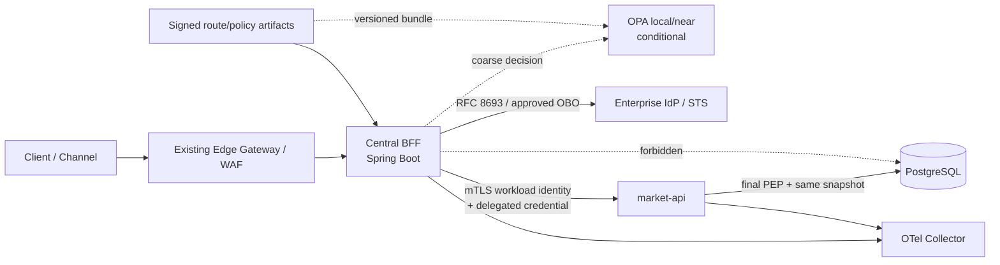
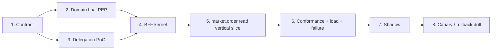

# Zero Trust Central BFF — Hồ sơ công nghệ và triển khai

| Thuộc tính | Giá trị |
|---|---|
| Trạng thái | `PREFERRED_FOR_PILOT` |
| Phạm vi | Central BFF và route pilot `market.order.read` |
| Architecture authority | [zero-trust.md](./zero-trust.md) |
| Mục đích | Chuyển guardrail kiến trúc thành stack, module, PoC và backlog triển khai cụ thể |
| Ngày đối chiếu | 01/09/2026 |

Tài liệu này không phải TDD thứ hai và không thay thế bất kỳ guardrail, decision,
stage gate hoặc exit condition nào trong `zero-trust.md`. Khi có xung đột, TDD có
quyền ưu tiên. Các product/version dưới đây là lựa chọn ưu tiên cho pilot; promotion
lên production vẫn cần evidence và approval theo TDD.

---

## 1. Khuyến nghị điều hành

Nếu Central BFF là greenfield, chạy trên Kubernetes single-cluster và không bị
ràng buộc bởi platform baseline cũ, stack ưu tiên là:

- Java 25 LTS, Spring Boot 4.1.x và Maven Wrapper.
- Spring MVC với virtual threads; không dùng WebFlux mặc định.
- REST/OpenAPI 3.1; không dùng GraphQL.
- Spring Security OAuth2 Resource Server cho inbound authentication.
- OAuth 2.0 Token Exchange theo RFC 8693 hoặc cơ chế OBO tương đương đã chứng minh
  cùng security semantics; không forward raw external token.
- `RestClient` và HTTP Service Interface (`@HttpExchange`) cho downstream client.
- Istio Ambient cho greenfield Kubernetes single-cluster: ztunnel cho mTLS/L4 và
  waypoint tại security boundary cần L7.
- SPIFFE là workload identity contract; certificate do Istio/istiod cấp. Không thêm
  SPIRE trong baseline.
- OPA local/near là candidate cho coarse/shared policy. `market-api` giữ final PEP
  dựa trên current resource facts.
- PostgreSQL chỉ thuộc domain; Central BFF không có application database.
- Actuator, Micrometer và OpenTelemetry/OTLP cho telemetry.
- JUnit 5, Spring Security Test, Testcontainers, WireMock và ArchUnit làm test floor.

Nếu hệ sinh thái hiện hữu đang chuẩn hóa Spring Boot 3.5.x, Java 21/25, Istio
sidecar, IdP, gateway, CI/CD hoặc observability khác, ưu tiên reuse baseline đang
được vận hành. Không tạo một version/product island chỉ để bám stack greenfield.

---

## 2. Kiến trúc runtime mục tiêu



Trust được chứng minh độc lập ở từng hop:

1. Edge không biến request thành trusted request.
2. BFF tự xác minh actor credential và canonical route.
3. BFF chỉ early-reject bằng coarse policy.
4. IAM/STS cấp credential đã thu hẹp theo actor, caller, audience, action, tenant
   và lifetime.
5. Domain tự xác minh cả workload caller và delegated credential.
6. Domain quyết định final authorization trên resource facts thuộc snapshot hiện
   tại.

---

## 3. Technology decision matrix

| Lớp | Preferred for pilot | Alternative có điều kiện | Không dùng mặc định |
|---|---|---|---|
| Java | Java 25 LTS | Java 21 LTS nếu platform baseline yêu cầu | Java non-LTS |
| Spring | Boot 4.1.x cho greenfield | Boot 3.5.x nếu ecosystem hiện hữu | Tự quản version ngoài Boot BOM |
| Build | Maven Wrapper | Gradle Wrapper nếu tổ chức chuẩn hóa | Build không lock toolchain |
| Web | Spring MVC + virtual threads | WebFlux khi benchmark end-to-end chứng minh cần | Trộn Reactor với blocking JPA/client |
| API | REST + OpenAPI 3.1 | gRPC cho internal contract có evidence | GraphQL cho pilot |
| HTTP client | `RestClient` + `@HttpExchange` | Client chuẩn hiện hữu | `RestTemplate` mới; arbitrary target URL |
| Human identity | Existing OIDC/OAuth IdP | Keycloak nếu cần self-hosted IAM | Xây IdP trong BFF |
| Delegation | RFC 8693 / approved OBO | Signed internal assertion đạt control equivalence | Raw-token relay; trusted actor header |
| Workload identity | Istio-issued X.509 SPIFFE identity | Sidecar + SPIRE khi có hard requirement | Deploy SPIRE chỉ để có tên SPIFFE |
| Mesh | Istio Ambient cho greenfield single-cluster | Existing Istio sidecar | Mesh migration trong pilot không có value case |
| Coarse PDP | OPA local/near sau PoC | In-process Java policy adapter | Remote central PDP bắt buộc trên mọi request |
| Final PEP | Domain-owned evaluator | Domain-local OPA nếu snapshot/failure đạt gate | BFF/mesh là final PEP |
| Persistence | Không DB trong BFF | Approved metadata store ngoài request ownership | Domain data/saga state trong BFF |
| Domain DB | PostgreSQL major đang được platform hỗ trợ | PostgreSQL 18 cho greenfield | Upgrade DB chỉ vì tạo BFF |
| Migration | Flyway SQL | Liquibase nếu đã là organization standard | Runtime identity có DDL privilege |
| Resilience | Deadline + Resilience4j | Native Spring resilience khi đủ capability | Retry đồng thời ở app và mesh |
| Quota | Edge/local safety | Redis/Valkey khi cần distributed fairness | Shared quota store khi chưa có evidence |
| Eventing | Không broker trong baseline | Existing Kafka cho durable audit/invalidation | Kafka chỉ để broadcast config đơn giản |
| Telemetry | Actuator + Micrometer + OTel/OTLP | Platform agent chuẩn hiện hữu | Hai đường auto-instrumentation tạo double spans |
| Test | JUnit, MockMvc, Security Test, Testcontainers, WireMock, ArchUnit | Contract/load tool hiện hữu | H2 thay cho PostgreSQL integration test |

---

## 4. Java và Spring baseline

### 4.1 Version policy

- Greenfield target: Java 25 LTS và latest approved patch của Spring Boot 4.1.x.
- Existing-platform target: giữ Spring Boot 3.5.x nếu internal starter, security
  library hoặc deployment platform chưa tương thích Boot 4.
- Spring Boot BOM quản toàn bộ Spring Framework, Spring Security, Jackson và
  dependency tương thích; không pin rời nếu thiếu exception record.
- Build dùng Maven/Gradle toolchain và reproducible wrapper.
- Mỗi production image pin bằng digest; patch cadence theo supported release và
  security advisory.

### 4.2 Programming model

Spring MVC + virtual threads là baseline vì request path chủ yếu chờ IAM và domain
HTTP I/O, trong khi mô hình imperative phù hợp với Spring Security và codebase Java
thông thường. Virtual threads không thay bulkhead, connection pool hoặc downstream
capacity limit.

WebFlux chỉ được chọn khi PoC chứng minh đồng thời:

- workload có concurrency I/O/streaming/backpressure cần reactive end-to-end;
- mọi critical dependency không blocking hoặc đã có isolation rõ;
- team có khả năng vận hành Reactor context, cancellation và debugging;
- measured benefit vượt complexity/operational cost.

### 4.3 Central BFF module layout

```text
central-bff/
├── bff-contracts
├── bff-kernel
│   ├── ingress
│   ├── routing
│   ├── identity
│   ├── authorization
│   ├── delegation
│   ├── configuration
│   └── telemetry
├── bff-module-market
├── bff-adapter-iam
├── bff-adapter-market
├── bff-boot
└── bff-conformance-tests
```

ArchUnit phải chặn mọi dependency từ BFF tới JDBC, JPA, domain repository hoặc
domain entity. BFF module chỉ phụ thuộc contract/port và typed client.

### 4.4 Inbound security chain

```text
IngressContextFilter
→ BearerTokenAuthenticationFilter
→ RouteCoarseAuthorizationManager
→ DispatcherServlet
→ Route-specific application handler
```

`IngressContextFilter` phải canonicalize request, strip reserved actor/caller/role/
tenant/policy/SPIFFE headers, resolve đúng một signed route và tạo immutable
`RequestContext`. Resource Server phải kiểm tra signature, algorithm allowlist,
issuer, audience, `exp` và `nbf`.

### 4.5 Outbound client

Mỗi downstream có một typed HTTP Service Interface và fixed service target:

- không nhận scheme/host/port từ client input;
- không follow redirect trừ explicit allowlist;
- connect/read/deadline timeout có budget;
- typed mapping cho deny, unavailable, timeout và invalid response;
- delegated credential thay external token;
- trace/deadline metadata không chứa PII hoặc authorization facts.

---

## 5. Identity, delegation và mesh

### 5.1 Human/client identity

Reuse enterprise IdP hiện hữu trước. Keycloak chỉ là candidate nếu tổ chức cần một
IdP self-hosted mới. Không dùng Spring Authorization Server để vô tình biến BFF
program thành IAM program.

### 5.2 Delegation profile

Preferred protocol là OAuth 2.0 Token Exchange RFC 8693 khi IdP hỗ trợ đúng
semantics. Credential downstream tối thiểu phải bind:

- actor/subject;
- BFF workload/client caller;
- target audience;
- stable action ID;
- tenant/security context;
- issued-at, expiry và unique token/JTI;
- policy/trust version khi profile yêu cầu;
- sender/replay control theo threat model.

`client_credentials` chỉ chứng minh workload identity, không giữ actor delegation.
Keycloak Standard Token Exchange V2 là candidate nhưng phải PoC claim semantics;
không dùng legacy/deprecated hoặc experimental delegation feature cho production.

### 5.3 Workload identity

SPIFFE được dùng như identity contract. Trong baseline Kubernetes-only, Istio cấp và
rotate X.509 workload certificate dựa trên Kubernetes service account. Mỗi workload
dùng dedicated service account; mTLS `STRICT`, default-deny authorization và
explicit allow-list BFF → domain.

Không thêm SPIRE mặc định. Chuyển candidate sang Istio sidecar + SPIRE khi có một
hard requirement:

- VM/bare-metal hoặc workload ngoài Kubernetes;
- node/hardware/workload attestation mạnh hơn service account;
- federation giữa trust domain;
- cần SPIFFE Workload API trực tiếp;
- CA/identity portability độc lập Istio;
- cần tính năng sidecar chưa có trong Ambient.

Ambient hiện không hỗ trợ SPIRE làm certificate provider. Không vận hành hai
authority cạnh tranh trong cùng trust domain.

### 5.4 Istio mode

Với greenfield single-cluster, Istio Ambient là preferred candidate:

- ztunnel thực thi mTLS và L4 identity policy;
- waypoint được đặt tại boundary cần HTTP/JWT/L7 policy và telemetry;
- policy tại ztunnel bắt buộc traffic đi qua waypoint để tránh bypass;
- domain application vẫn là final PEP.

Nếu platform đang dùng Istio sidecar ổn định, pilot giữ sidecar. Migration mesh là
một chương trình độc lập và không được ghép vào BFF nếu không có value/cap riêng.

---

## 6. Authorization technology

### 6.1 Baseline split

| Enforcement point | Quyết định | Dữ liệu được phép dùng |
|---|---|---|
| Edge | Abuse/IP/client control | Verified edge context |
| BFF coarse PEP | Có được chạy handler hay không | Verified actor, client, route/action, tenant, channel |
| Mesh | Workload/flow allow-list | Authenticated workload identity và L4/L7 metadata |
| Domain final PEP | Actor có được thao tác resource cụ thể hay không | Verified delegation + current resource facts/version |

Không enforcement point nào được suy diễn `ALLOW` từ việc layer trước đã allow.

### 6.2 OPA adoption rule

OPA local/near là preferred PoC candidate cho coarse/shared policy vì bundle có thể
version, distribute và evaluate gần enforcement point. BFF phải phụ thuộc một
`CoarseAuthorizationEngine` port để có thể shadow/replace implementation.

Production adoption chỉ xảy ra khi PoC chứng minh:

- policy bundle signature, compatibility, activation và LKG;
- p95/p99/cold-path latency trong route budget;
- fail-closed behavior không tạo availability cascade;
- decision log redaction và audit continuity;
- team ownership, upgrade, rollback, resource/cost;
- conformance giữa Java adapter, OPA result và domain outcome.

Final PEP vẫn do domain sở hữu. Pilot mặc định có thể dùng Java in-process để giữ
transaction/snapshot boundary đơn giản. Domain-local OPA chỉ được chọn khi resource
facts/version và failure behavior vẫn đạt gate; không gọi remote central PDP trong
database transaction.

### 6.3 Khi nào xét công nghệ khác

- Cedar: khi mô hình ánh xạ rõ sang principal/action/resource/context, schema/type
  safety là requirement và Java/native operational path được chấp nhận.
- OpenFGA: khi fact base cho thấy permission phụ thuộc relationship graph lớn,
  sharing/hierarchy và reverse lookup; không dùng cho ABAC đơn giản của pilot.
- Managed PDP: khi cloud/operating model hiện hữu biện minh lock-in và measured
  latency/availability đạt gate.

---

## 7. PostgreSQL và final PEP

### 7.1 Ownership

Central BFF không có DataSource, JPA entity, database migration hoặc network access
tới PostgreSQL. PostgreSQL thuộc `market-api` và các domain service tương ứng.

Với greenfield domain database, PostgreSQL 18 current minor là preferred nếu
managed platform hỗ trợ. Nếu hệ thống đang chạy PostgreSQL 16/17 còn support, không
upgrade chỉ vì pilot.

### 7.2 Same-snapshot authorization

Security-sensitive read ưu tiên một explicit SQL projection bằng Spring
`JdbcClient` hoặc jOOQ để lấy cùng lúc:

- response data;
- authorization facts;
- tenant binding;
- explicit domain resource version.

Nếu phải dùng nhiều query, chúng chạy trong cùng read-only `REPEATABLE_READ`
transaction. Không dùng PostgreSQL `xmin` làm stable/public resource version.
Không gọi IAM/PDP/network khi transaction còn mở.

Spring Data JPA tiếp tục được dùng cho aggregate hiện hữu nếu đó là organization
standard, nhưng phải tránh lazy loading ngoài transaction và implicit query làm
mất tenant predicate.

### 7.3 Migration và database security

- Flyway SQL là preferred cho greenfield; Liquibase giữ nguyên nếu platform đã
  chuẩn hóa.
- Migration chạy bằng release/migrator identity có DDL privilege.
- Runtime identity không là schema owner và không có DDL.
- Schema change dùng expand/contract để hỗ trợ rolling N/N-1.
- Query luôn bind `tenant_id` cùng resource key.
- RLS chỉ là defense-in-depth khi platform đã vận hành thành thạo; không thay final
  PEP.

---

## 8. Resilience, quota, cache và eventing

### 8.1 Resilience

Mỗi route/downstream có deadline budget, bounded concurrency và circuit breaker.
Resilience4j là preferred candidate nếu existing Spring/platform chưa có abstraction
tương đương.

- Chỉ một retry owner giữa application, gateway và mesh.
- Retry chỉ cho idempotent read và transient failure khi còn deadline.
- Không retry deny, authentication failure, validation error hoặc write thiếu
  idempotency contract.
- Circuit breaker/fallback không được biến error/deny thành allow hoặc tự động gọi
  legacy sau security deny.
- Virtual threads không thay connection pool hoặc concurrency bulkhead.

### 8.2 Rate limiting

Ba tầng độc lập:

1. Edge: IP/client/body/connection abuse controls.
2. BFF replica: local concurrency, queue và burst safety, luôn tồn tại.
3. Distributed user/tenant quota: chỉ thêm Redis/Valkey khi evidence yêu cầu
   fairness nhất quán giữa replica.

Redis/Valkey outage không được loại bỏ local safety. Costly/security-sensitive action
không mặc định fail-open. Không lưu raw token hoặc session state khiến BFF trở thành
stateful.

### 8.3 Cache

Pilot tắt response cache và authorization-decision cache. Có thể cache bounded
delegated credential/JWKS/policy metadata nếu key chứa đủ identity/audience/action/
tenant/trust version và TTL không vượt freshness/revocation bound.

### 8.4 Kafka/eventing

Không thêm Kafka trong baseline. Chỉ reuse Kafka hiện hữu nếu có requirement cho
durable/replayable audit hoặc invalidation vượt giới hạn TTL. Event phải versioned,
idempotent, có owner, lag/DLQ telemetry và failure posture. BFF không trở thành
workflow/saga engine.

---

## 9. Configuration, secrets và supply chain

### 9.1 Bootstrap configuration

Bootstrap config dùng immutable `@ConfigurationProperties` và Jakarta Validation.
Secret lấy từ secret manager/KMS/Vault hiện hữu qua platform integration; không lưu
credential trong Git, image hoặc plain ConfigMap.

### 9.2 Signed route/policy artifact

Route snapshot là versioned artifact, không phải database/service registry. Pipeline:

```mermaid
flowchart LR
    Source[Reviewed source] --> CI[Schema + conflict + security tests]
    CI --> Sign[KMS/JWS signature]
    Sign --> Artifact[Versioned artifact]
    Artifact --> Verify[Runtime signature/provenance verify]
    Verify --> Validate[Strict parse + compatibility + preload]
    Validate --> Activate[Atomic activation]
    Activate --> Active[Active version]
    Active --> LKG[Previous valid version as LKG]
```



Jackson strict parsing phải reject unknown property và duplicate key. Invalid,
expired, incompatible hoặc preload-failed candidate không được activate. Readiness
không mở protected traffic trước khi trust/config/policy đã preload.

JWS/detached signature với organization KMS là preferred Java-friendly mechanism;
không tự thiết kế cryptography. Container image/SBOM/provenance được sign/attest
bằng tooling supply-chain hiện hữu; Cosign hoặc GitHub artifact attestations là
candidates khi chưa có chuẩn.

---

## 10. Observability và audit

Application contract:

- Spring Boot Actuator và Micrometer Observation/Tracing.
- Trace export bằng OTLP tới cluster-level OpenTelemetry Collector/backend hiện hữu.
- Metrics theo pipeline Prometheus hoặc OTel-native duy nhất của platform.
- Structured JSON logs ra stdout để collector nền tảng thu thập.
- Audit-of-record là pipeline riêng; log backend thông thường không tự động là
  compliance audit store.

Metrics tối thiểu gồm request RED/saturation, downstream latency/error, timeout,
retry, bulkhead rejection, authn failure, coarse deny, domain final deny,
delegation error, config activation failure, active/LKG version và LKG age.

Không đặt actor ID, order ID, request ID, raw tenant ID hoặc decision ID làm metric
label. Raw token, role list, payload, credential, PII và authorization facts không
được ghi vào metric/log/trace/baggage.

Không bật đồng thời OTel Java Agent và một đường auto-instrumentation khác nếu gây
double spans/metrics. Java Agent phù hợp cho legacy service cần zero-code; code mới
ưu tiên platform convention thống nhất.

---

## 11. Test và security evidence

### 11.1 Toolchain

- JUnit 5, AssertJ và Mockito cho unit test.
- MockMvc/RestTestClient và `spring-security-test` cho web/security behavior.
- Testcontainers PostgreSQL cho domain integration; không dùng H2 thay PostgreSQL.
- WireMock hoặc mock server chuẩn của tổ chức cho IAM/domain HTTP.
- ArchUnit khóa dependency/ownership boundary.
- OpenAPI version-pinned làm canonical API contract.
- Spring Cloud Contract khi producer/consumer đều Spring/JVM; không thêm Pact song
  song nếu chưa có polyglot requirement.
- k6/Gatling theo platform baseline cho capacity, degraded dependency và rotation.
- Toxiproxy khi cần chứng minh timeout, cancellation và network fault.

### 11.2 Security regression floor

Test suite phải bao phủ:

- missing, malformed, forged, tampered, replayed, expired và not-yet-valid token;
- wrong issuer, audience, algorithm, action, tenant, caller và workload identity;
- spoofed reserved headers và direct-domain bypass;
- canonical/encoded path ambiguity, duplicate slash, redirect và SSRF target;
- cross-tenant/resource access và consistent existence-leak behavior;
- OPA/config bad signature, incompatible bundle, collision, LKG và rollback;
- IAM/PDP/domain/config-plane outage, deadline exhaustion và retry ownership;
- concurrent PostgreSQL update chứng minh data/facts/version cùng snapshot;
- raw token, credential và PII không xuất hiện trong logs/traces/cache;
- route disable, revocation và rollback drill.

---

## 12. Deployment profile

Central BFF đóng gói thành non-root OCI image, read-only filesystem, drop Linux
capabilities, immutable digest và stateless multi-replica deployment.

Kubernetes baseline:

- dedicated namespace và service account;
- default-deny ingress/egress; allow-list gateway, IAM/STS, approved domain và
  telemetry endpoints;
- resource requests/limits, topology spread và PodDisruptionBudget;
- graceful shutdown và termination budget;
- liveness chỉ phản ánh process/internal deadlock, không phụ thuộc downstream;
- readiness phản ánh trust/JWKS/config/policy preload bắt buộc;
- HPA chỉ cấu hình sau capacity baseline;
- rollout/canary/rollback dùng controller/platform hiện hữu.

Kustomize phù hợp một internal workload nhỏ; Helm phù hợp khi tổ chức phân phối
chart qua nhiều environment. Không thêm controller mới nếu platform đã có GitOps
và progressive delivery tương đương.

---

## 13. PoC bắt buộc trước production selection

| PoC | Câu hỏi phải trả lời | Evidence đầu ra |
|---|---|---|
| `POC-IAM` | IdP có giữ actor/caller và downscope audience/action/tenant đúng không? | Token samples đã redacted, negative matrix, rotation/revocation và failure results |
| `POC-MESH` | Ambient/sidecar nào đạt identity, bypass prevention, latency và cost? | Topology, policy proof, resource/latency measurements và rollback |
| `POC-PDP` | Java/OPA/Cedar candidate nào đạt policy semantics và operational budget? | Equivalence tests, cold/warm/failure latency, bundle/rollback và owner ROM |
| `POC-PEP` | Domain có final-authorize trên same snapshot/version không? | Concurrent DB test, tenant isolation, query plan và bypass closure |
| `POC-CONFIG` | Signed snapshot có verify/preload/atomic activate/LKG an toàn không? | Tamper/incompatibility/partial update/rollback tests |
| `POC-OBS` | Telemetry đủ điều tra nhưng không leak/cardinality explosion không? | Dashboard, trace sample, audit sample và redaction tests |

Không lựa chọn product production chỉ vì happy-path demo chạy được. PoC phải đo
cold/warm, rotation, outage, replay, rollback, resource cost và negative security
behavior.

---

## 14. Thứ tự implementation



1. Chốt exact OpenAPI, route ID, action ID, canonical errors và comparator.
2. Implement internal domain endpoint, independent authentication, final PEP và
   same-snapshot query.
3. PoC RFC 8693/OBO và chốt delegation profile bằng ADR.
4. Implement BFF ingress/routing/security/config/delegation kernel.
5. Ghép một vertical slice `market.order.read`, không làm generic framework trước.
6. Chạy contract, security-negative, Postgres consistency, outage và load tests.
7. Shadow compare với legacy; không cutover nếu có unexpected allow.
8. Canary nhỏ, route-disable và rollback/revocation drill trước promotion.

---

## 15. Công nghệ cố ý chưa đưa vào baseline

- GraphQL: không có requirement; tăng authorization/composition complexity.
- WebFlux: chưa có benchmark chứng minh cần reactive end-to-end.
- Spring Cloud Gateway: BFF là application/composition runtime, không chỉ proxy.
- SPIRE: Istio identity đủ cho Kubernetes-only baseline; Ambient không hỗ trợ SPIRE
  certificate provider.
- Redis/Valkey: chưa có evidence distributed quota/cache cần shared state.
- Kafka: chưa có durable event requirement thuộc scope BFF.
- OpenFGA: chưa có relationship graph fact base.
- Cedar/managed PDP: giữ alternative cho PoC, chưa có platform/operating evidence.
- PostgreSQL trong BFF: vi phạm stateless/data ownership boundary.
- RLS rollout: chỉ defense-in-depth khi domain/platform đã vận hành đủ trưởng thành.
- GraalVM native image: chưa có startup/memory evidence biện minh build/debug cost.

---

## 16. Nguồn chính thức

Mutable product documentation phải version-pin trong ADR/PoC trước production use.

- Java LTS/support roadmap:
  https://www.oracle.com/java/technologies/java-se-support-roadmap.html
- Spring Boot system requirements:
  https://docs.spring.io/spring-boot/system-requirements.html
  https://docs.spring.io/spring-boot/3.5/system-requirements.html
- Spring Boot virtual threads:
  https://docs.spring.io/spring-boot/reference/features/spring-application.html
- Spring REST clients:
  https://docs.spring.io/spring-framework/reference/integration/rest-clients.html
- Spring Security Resource Server và Token Exchange:
  https://docs.spring.io/spring-security/reference/servlet/oauth2/resource-server/jwt.html
  https://docs.spring.io/spring-security/reference/servlet/oauth2/client/authorization-grants.html
- OAuth 2.0 Token Exchange, RFC 8693:
  https://www.rfc-editor.org/rfc/rfc8693.html
- Keycloak Token Exchange:
  https://www.keycloak.org/securing-apps/token-exchange
- Istio data-plane modes, Ambient limitations và SPIRE integration:
  https://istio.io/latest/docs/overview/dataplane-modes/
  https://istio.io/latest/docs/ambient/migrate/
  https://istio.io/latest/docs/ops/integrations/spire/
- SPIFFE specifications:
  https://spiffe.io/docs/latest/spiffe-specs/
- OPA bundles, decision logs và Envoy integration:
  https://www.openpolicyagent.org/docs/management-bundles
  https://www.openpolicyagent.org/docs/management-decision-logs
  https://www.openpolicyagent.org/docs/envoy
- Cedar authorization semantics:
  https://docs.cedarpolicy.com/auth/authorization.html
- PostgreSQL version policy:
  https://www.postgresql.org/support/versioning/
- Spring Boot observability và OpenTelemetry Java instrumentation:
  https://docs.spring.io/spring-boot/reference/actuator/observability.html
  https://opentelemetry.io/docs/zero-code/java/
- OpenAPI specification và Testcontainers PostgreSQL:
  https://spec.openapis.org/oas/latest.html
  https://java.testcontainers.org/modules/databases/postgres/
- Sigstore signing và GitHub artifact attestations:
  https://docs.sigstore.dev/cosign/signing/signing_with_blobs/
  https://docs.github.com/en/actions/how-tos/secure-your-work/use-artifact-attestations
