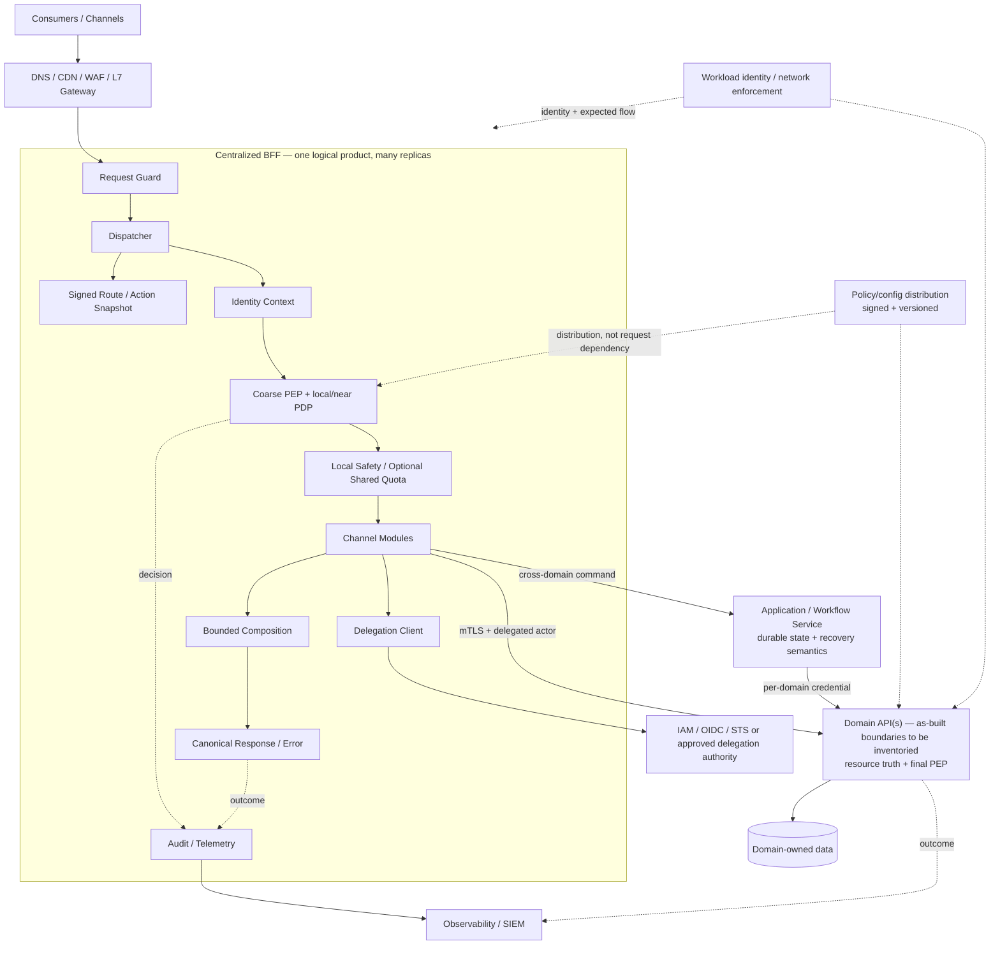
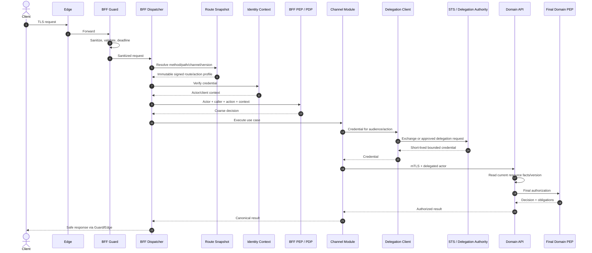
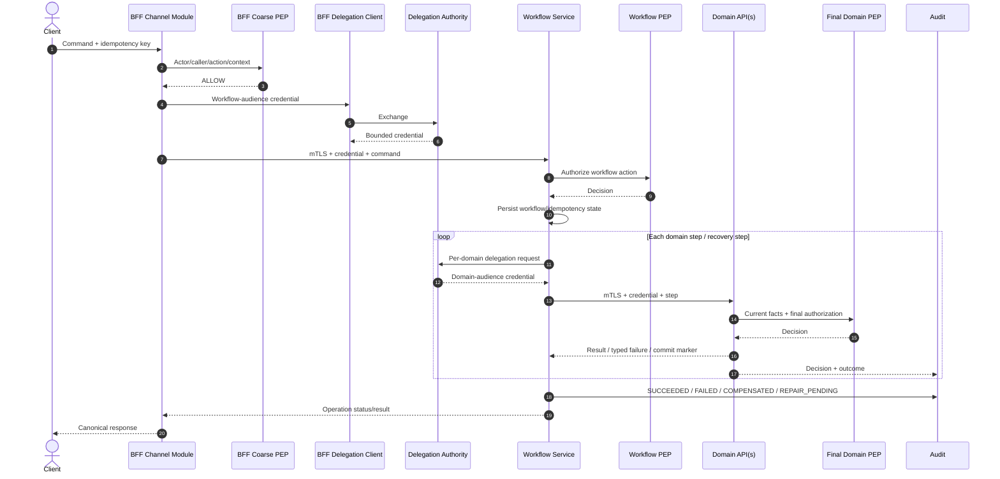
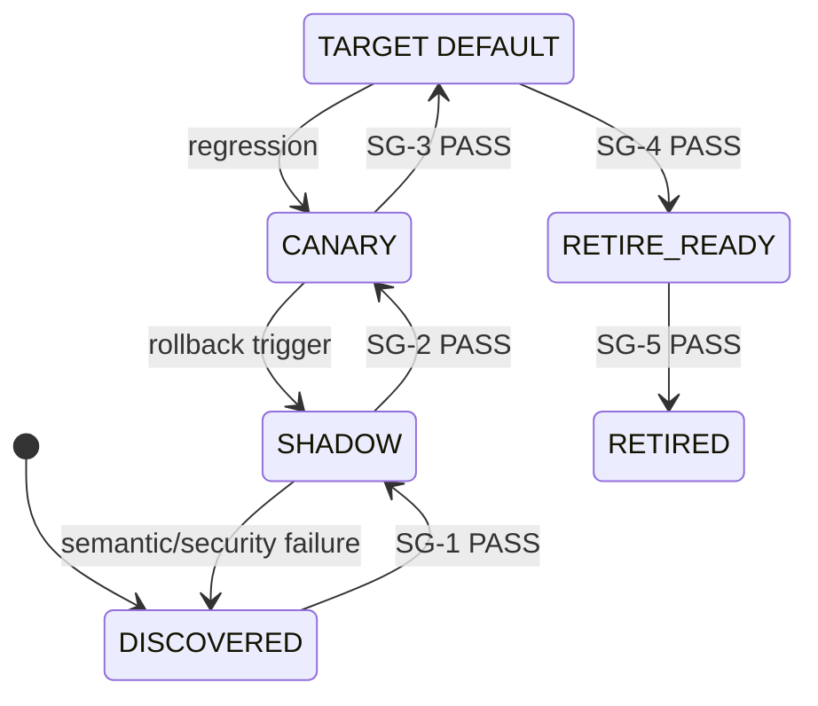

# L2 — AP-CBFF — Centralized BFF và Zero Trust Platform

| Thuộc tính | Giá trị |
|---|---|
| Document ID | AP-CBFF-L2 |
| Phiên bản | 2.3 |
| Trạng thái | **READY FOR ARCHITECTURE REVIEW** |
| Ngày | 01/09/2026 |
| Architecture Owner | Chief Architect |
| Phạm vi | Đánh giá định hướng hợp nhất `agent-api`, `market-api`, `core-broker-api` thành một BFF logic tập trung |
| Route ứng viên pilot | `market.order.read` — chỉ mới được owner khai báo, chưa xác minh |
| Quyết định được yêu cầu | Phê duyệt có điều kiện kiến trúc đích, G0 và pilot |
| Không thuộc quyết định này | Production rollout, SLO/ROM định lượng và lựa chọn sản phẩm chưa có bằng chứng |
| TDD chính thức | Một tài liệu duy nhất: `zero-trust.md` |

---

## 0. Quản trị tài liệu và hướng dẫn đọc

### 0.1 Mục đích

Tài liệu này là L2 TDD cho chương trình AP-CBFF. Nó định nghĩa quyết định cấp
Architecture Board, ranh giới trách nhiệm, guardrail Zero Trust, hợp đồng quan
trọng, chiến lược chuyển đổi và điều kiện tiếp tục hoặc dừng chương trình.

OpenAPI, schema, policy, manifest, benchmark, runbook và kế hoạch theo route là
bằng chứng triển khai L3. L3 MUST tuân thủ L2. ADR ghi rationale và migration của
một thay đổi nhưng không tự ghi đè quyết định hoặc guardrail L2.

### 0.2 Phạm vi đọc và thẩm quyền

- Architecture Board MUST review decision path: §1, §3.5, §4.1–4.3,
  §8.2–8.4 và §9.2. Các section còn lại là design/reference cho owner chuyên môn.
- Phụ lục là reference triển khai và traceability; Board không bị yêu cầu ký từng
  checklist row.
- Owner chuyên môn tạo/certify evidence; approver theo §8.2 ra quyết định gate.
  Evidence producer không được là sole approver của chính gate đó.
- Tài liệu này không tự cấp production approval. Mỗi route chỉ được chuyển trạng
  thái khi cổng giai đoạn áp dụng có bằng chứng `PASS` còn hiệu lực.

### 0.3 Từ khóa và trạng thái bằng chứng

`MUST`, `MUST NOT`, `SHOULD`, `MAY` được dùng theo nghĩa normative. Tiếng Việt là
ngôn ngữ chính; tên chuẩn, sản phẩm, mã trạng thái, field và thuật ngữ kỹ thuật giữ
nguyên khi dịch làm mất nghĩa.

Stage gate chỉ dùng bốn trạng thái outcome:

| Trạng thái | Nghĩa |
|---|---|
| `NOT_READY` | Thiếu owner, target hoặc bằng chứng bắt buộc |
| `PASS` | Đạt tiêu chí đã được owner phê duyệt, có evidence locator và ngày đo |
| `FAIL` | Không đạt tiêu chí hoặc vi phạm security floor |
| `N/A` | Không áp dụng, có lý do và approver |

Target định lượng chỉ binding khi có nguồn, phương pháp đo, sampling window,
owner và approver. Số liệu chưa đo là `NOT_MEASURED`, không phải baseline.
Các nhãn `OWNER_DECLARED`, `HYPOTHESIS`, `NOT_MEASURED`, `OBSERVED` và
`MEASURED` mô tả loại/mức bằng chứng của một claim; chúng không phải gate outcome.

Decision status gồm `FOR_APPROVAL`, `CONDITIONALLY_APPROVED`, `APPROVED` và
`SUPERSEDED`. Board approval record phải ghi decision/version, status, approver,
conditions, người xác nhận conditions, decision date, review/expiry date và minutes
locator. Chỉ Board chuyển `D-01..05` khỏi `FOR_APPROVAL`; change authority ở §3.5
không thay Board approval authority.

### 0.4 Lịch sử phiên bản

| Phiên bản | Trạng thái | Thay đổi |
|---|---|---|
| 2.0-rc1 | Superseded | Thiết kế Zero Trust/Centralized BFF ban đầu |
| 2.1-rc1 | Superseded | Bổ sung consistency, rate limit, invalidation và capacity |
| 2.2 | Superseded | Chuẩn hóa registry, gate và team topology |
| 2.3 | Current | Board brief; alternatives; fact base; complexity budget; stop/pivot/abort; giảm governance |

---

## 1. Tóm tắt cho Architecture Board

### 1.1 Quyết định được yêu cầu

Board được đề nghị:

1. Phê duyệt có điều kiện `D-01..05` và `GR-01..08`.
2. Cho phép G0 và reversible pilot cho `market.order.read` sau `SG-1`.
3. Yêu cầu checkpoint có ngày/budget/owner; product selection qua ADR/PoC.

Board **không** được đề nghị duyệt production traffic, calendar/FTE, numeric SLO,
Istio data-plane mode, SPIRE adoption, OPA production adoption hay từng route gate.

### 1.2 Năm gói quyết định và trade-off

| ID | Hướng chọn | Phương án không chọn lúc này | Trade-off và điều kiện giữ quyết định |
|---|---|---|---|
| `D-01` | Logical BFF, modular monolith nhiều replica | Giữ ba BFF; shared platform + deploy riêng | Nhất quán hơn nhưng tăng coupling/blast radius; giữ khi G0 chứng minh value/isolation |
| `D-02` | Coarse BFF PEP + final domain PEP; state ngoài BFF | BFF-only/mesh-only AuthZ; BFF saga/data | Đúng current resource nhưng phụ thuộc domain capacity |
| `D-03` | Per-hop workload identity + bounded delegation | Raw token; actor header | Giảm confused deputy; cần IAM capability được threat-review |
| `D-04` | Engine/product-neutral; OPA/Istio là candidates | Hard-code hoặc lock-in trước PoC | PoC phải chứng minh capability, failure, skill và cost |
| `D-05` | Strangler với `PAUSE/PIVOT/ABORT` | Big bang hoặc dual-run vô hạn | Reversible nhưng cần deadline, budget cap và exit owner |

### 1.3 Sự thật hiện có và khoảng trống

Điều có thể khẳng định hiện chỉ gồm ba identifier trong phạm vi chương trình và
tên một route ứng viên. Không có bằng chứng trong TDD để khẳng định ba API là BFF,
domain API hay orchestrator; cũng chưa có traffic, dependency, AuthZ, owner, cost
hoặc incident baseline. Vì vậy kiến trúc đích không suy diễn domain/team từ tên
service.

### 1.4 Top risk cần Board nhìn thấy

| Risk | Tác động | Quyết định khi xảy ra |
|---|---|---|
| G0 không chứng minh duplication/value | Xây platform nhưng không có business case | `ABORT` runtime consolidation hoặc `PIVOT` sang shared controls |
| Domain không có final PEP/capacity | Không thể bảo vệ resource/bypass | `PAUSE`; giữ route legacy; đầu tư domain facade hoặc giảm scope |
| Runtime tập trung tăng blast radius/cost | SLO/cost kém hơn hiện trạng | `PIVOT` sang deployable BFF theo channel |
| IAM/mesh/policy option không đạt PoC | Hot path phụ thuộc hoặc control không đủ | Chọn alternative qua ADR; không fallback raw token |
| Platform team thành approval queue | Lead time và ownership xấu đi | Self-service hoặc trả ownership về channel/domain |

---

## 2. Bối cảnh hệ thống và bằng chứng hiện trạng

### 2.1 Fact base

| Chủ đề | Điều có thể khẳng định | Trạng thái | Bằng chứng còn thiếu | Ảnh hưởng |
|---|---|---|---|---|
| Phạm vi | `agent-api`, `market-api`, `core-broker-api` được owner đưa vào scope | `OWNER_DECLARED` | Repo, deployment, service catalog | Xác nhận đúng target và boundary |
| Problem statement | Sponsor nhận định cross-cutting controls có thể bị lặp/phân kỳ | `HYPOTHESIS` | Code/config diff, change lead time, incident history | Chứng minh hoặc bác bỏ value hypothesis |
| Pilot | `market.order.read` là route ứng viên | `OWNER_DECLARED` | Method/path, handler, consumer, downstream, side effect | Chưa được coi là read-only/reversible |
| Business capability | Chưa biết ba API đại diện channel, gateway, domain hay workflow | `NOT_MEASURED` | Context map và owner interview | Không đặt tên domain service từ identifier |
| Traffic/NFR/cost | Chưa đo | `NOT_MEASURED` | Telemetry có timestamp/sampling window | Không duyệt numeric target |
| AuthN/AuthZ/data path | Chưa quan sát end-to-end | `NOT_MEASURED` | Config, trace, dependency/data graph | Chặn protected pilot traffic |
| Ownership | Chưa biết code/deploy/rollback/on-call | `NOT_MEASURED` | Repo IAM, pipeline, pager, service catalog | Chặn operating approval |

`OWNER_DECLARED` là nguồn scope, không phải runtime evidence. Claim được dùng để
promotion phải là `OBSERVED` hoặc `MEASURED`, có evidence locator và ngày quan sát.

### 2.2 Context card bắt buộc cho từng API và route

G0 phải tạo một record cho từng API và từng route trong cohort:

| Nhóm | Trường tối thiểu |
|---|---|
| Vai trò | Channel BFF, gateway, domain API, orchestrator hoặc `NOT_MEASURED` |
| Nghiệp vụ | Consumer, use case, resource/action, data classification |
| Thực thi | Method/path, downstream, direct data access, side effect, async path |
| Security | Issuer/audience, current AuthN/AuthZ, caller identity, final PEP, bypass |
| Runtime | Traffic class, latency/error, timeout/retry, payload/fan-out, cost |
| Ownership | Code, deploy, rollback, SLO và on-call owner |
| Evidence | Source/query, observed-at, freshness và reviewer |

Không có dữ liệu phải ghi `NOT_MEASURED`; không suy đoán từ tên repository/service.

### 2.3 Giả thuyết cần đóng tại G0

| ID | Giả thuyết | Cách đóng | Nếu sai |
|---|---|---|---|
| `H-01` | Ba API có duplication đủ lớn để một logical product tạo value | Inventory + code/config/change/incident evidence | `PIVOT` shared controls hoặc `ABORT` consolidation |
| `H-02` | Module dùng chung runtime nhưng vẫn giữ ownership/isolation | Coupling, release cadence, saturation/failure test | Deployable channel BFF hoặc extraction |
| `H-03` | `market.order.read` read-only, mirror-safe và có rollback | Code/data-path review + shadow safety test | Chọn route khác |
| `H-04` | Domain boundary có thể cung cấp final resource PEP | Domain gap/capacity assessment | Giữ legacy, tạo domain facade hoặc giảm scope |
| `H-05` | IAM hỗ trợ delegation profile an toàn | STS/token-exchange capability test | ADR cho internal assertion; raw token vẫn bị cấm |
| `H-06` | Existing network identity/control đáp ứng guardrail | As-built mesh/PKI/NetworkPolicy assessment | PoC alternative; không mặc định thêm SPIRE |
| `H-07` | Có owner và capacity để build/run pilot | Repo/deploy/pager/staffing evidence | `PAUSE`, giảm scope hoặc `ABORT` |

### 2.4 Scope

**Trong scope:** ingress-to-BFF và BFF-to-domain trust boundary; route/action
contract; identity/delegation/AuthZ; composition/consistency; resilience,
telemetry, release, ownership và migration.

**Ngoài scope:** hợp nhất domain database; viết lại domain service; BFF làm
distributed transaction coordinator; UI design; vendor/cloud procurement;
multi-region active-active; production adoption của OPA/Istio/SPIRE khi PoC chưa đạt.

---

## 3. Phương án đã xem xét và quyết định kiến trúc

### 3.1 Hình dạng BFF

| Phương án | Điểm mạnh | Rủi ro | Disposition |
|---|---|---|---|
| Giữ ba runtime độc lập | Deploy/blast radius tách biệt | Control có thể lặp/phân kỳ | Rollback/fallback |
| Một logical BFF, modular monolith | Một contract/control plane, Phase 1 ít distributed component | Deployment coupling, central blast radius, platform queue | **Đề xuất có điều kiện** |
| Shared platform + channel BFF deploy riêng | Chuẩn hóa control và giữ cadence channel | Cần platform/API maturity cao hơn | `PIVOT` hoặc extraction target |
| Gateway chung, bỏ BFF | Hợp với pure proxy | Không giữ channel composition | Chỉ áp dụng từng route phù hợp |

### 3.2 Policy engine

| Phương án | Phù hợp | Khoảng trống phải PoC | Disposition |
|---|---|---|---|
| OPA local/near | Structured input/decision, Rego, bundle và Envoy integration | Distribution/LKG, skill, latency, audit và unit cost | Reference implementation cho pilot |
| Cedar embedded/local | Principal/action/resource/context, schema và authorization-focused model | Adapter cho canonical decision, bundle lifecycle, Envoy parity | Alternative hợp lệ |
| Managed Cedar/remote PDP | Managed policy store/API | Network dependency, residency, cost, failure posture và vendor coupling | Không mặc định trên hot path |
| Istio policy hoặc in-code policy làm sole PDP | Ít component | Không thay final current-resource AuthZ; dễ phân kỳ | Reject làm sole authorization model |

`D-04` phê duyệt **capability contract**, không phê duyệt OPA vĩnh viễn. OPA chỉ
được activate sau PoC chứng minh decision contract, signed bundle/LKG, failure
behavior, policy testability, ownership và cost. Alternative có thể thay qua ADR
mà không đổi PEP contract.

### 3.3 Service mesh và workload identity

| Phương án | Capability | Điều phải đo | Disposition |
|---|---|---|---|
| Existing Istio sidecar | mTLS, L4/L7 policy, Envoy/ext-authz | Per-pod cost, xDS scale, rollout coupling, team skill | Candidate nếu as-built đã vận hành |
| Istio ambient + waypoint | L4 ztunnel; L7 qua waypoint | Policy/telemetry/egress parity, lifecycle và cost tại version pin | Alternative hợp lệ |
| Linkerd | Automatic mTLS và route/server authorization | AuthZ/ext-authz, egress, observability và ops parity | Alternative hợp lệ |
| Gateway + NetworkPolicy + app mTLS | Ít mesh component | East-west identity, cert rotation, bypass và L7 controls | Chỉ chọn nếu đạt toàn bộ guardrail |

SPIFFE là standard; SPIRE là implementation. Phase 1 SHOULD tái sử dụng một
issuer hiện hữu nếu nó cung cấp short-lived workload identity, rotation và
attested binding đủ scope. SPIRE chỉ được thêm khi off-mesh, heterogeneous
workload, federation hoặc richer attestation tạo requirement rõ.

Không mặc định dùng Istio self-signed root cho production. Root/intermediate,
rotation, compromise và trust-domain migration phải theo approved PKI profile.

### 3.4 Actor delegation

| Phương án | Disposition | Lý do |
|---|---|---|
| RFC 8693 token exchange từng trust hop | Candidate ưu tiên | Cho phép biểu diễn subject/actor/audience; deployment profile MUST bắt buộc và kiểm chứng caller/action/tenant/expiry/sender constraint |
| IAM-issued internal delegation assertion | Pivot qua ADR/threat model | Có thể phù hợp IAM hiện hữu nhưng claim/trust phải tự đặc tả |
| Opaque token + introspection | Theo risk class | Có thể cung cấp centralized active/revoked status; thêm network/cache/privacy/availability dependency |
| Forward raw external token | Reject | Audience rộng, không bind caller, tăng replay/blast radius |
| Service token + actor header | Reject | Actor không được cryptographically bound |

### 3.5 Decision record

| ID | Decision | Board status | Required endorsers | Implementation/change authority | Revisit trigger |
|---|---|---|---|---|---|
| `D-01` | Logical BFF modular monolith cho pilot | `FOR_APPROVAL` | Program + BFF Runtime + Domain | Board cho topology change; Architecture Owner cho bounded implementation ADR | H-01/H-02 fail; cost/blast radius/lead time vượt target |
| `D-02` | Domain giữ data/invariant/final PEP; workflow giữ saga state | `FOR_APPROVAL` | Domain + Security | Board cho boundary change; Domain/Security cho implementation | Domain boundary model thay đổi |
| `D-03` | Per-hop workload identity + bounded delegation; raw token bị cấm | `FOR_APPROVAL` | IAM + Security | Security + Architecture qua ADR; Board nếu làm yếu guardrail | IAM capability/threat model thay đổi |
| `D-04` | Engine/product-neutral; OPA/Istio là candidates | `FOR_APPROVAL` | Security + Platform/SRE | Architecture Owner + relevant platform owner qua ADR | PoC, capability, cost hoặc version thay đổi |
| `D-05` | Route-by-route migration với stop-loss | `FOR_APPROVAL` | Product + Delivery + affected owners | Architecture + Product/Delivery trong approved scope | Scope, funding, capacity hoặc value hypothesis thay đổi |

---

## 4. Kiến trúc đích và ranh giới trách nhiệm

### 4.1 Guardrail cấp Board

| ID | Guardrail normative |
|---|---|
| `GR-01` | Một logical entry/product nhưng runtime MUST có nhiều replica/failure domain; request path MUST stateless và không có singleton bắt buộc |
| `GR-02` | BFF MUST NOT sở hữu domain data, business invariant, durable workflow/idempotency state hoặc truy cập domain database/repository |
| `GR-03` | Mọi request MUST resolve thành stable `route_id`/`action_id`; registry chỉ là signed/versioned configuration, không là runtime actor |
| `GR-04` | Actor, client và caller MUST tách biệt; internal hop MUST xác thực workload; downstream credential MUST ngắn hạn, audience/action/tenant-bound; raw token forwarding bị cấm |
| `GR-05` | BFF PEP chỉ early-reject; domain/application boundary MUST thực hiện final authorization trên current resource facts; bypass không được tạo unexpected allow |
| `GR-06` | Route/policy/trust config MUST signed, versioned, schema-validated, preload trước readiness, có last-known-good và rollback; invalid/unknown security evidence không được thành allow |
| `GR-07` | Deadline, retry, fan-out, cache, consistency, audit và resource use MUST bounded/explicit; hệ thống không giả lập atomic cross-domain snapshot |
| `GR-08` | Mỗi route migration MUST reversible; không production promotion nếu owner, contract, security, reliability, cost và rollback evidence áp dụng chưa `PASS` |

Thay đổi làm yếu guardrail cần L2 revision, threat/risk review và Architecture
Owner/Board approval; config flag hoặc risk acceptance đơn lẻ không đủ.

### 4.2 Logical architecture

Sơ đồ là target responsibility model. Nó không khẳng định số domain service,
database, trust domain hoặc team hiện hữu. G0 phải thay generic nodes bằng context
map có evidence.

### 4.3 Component responsibilities

| Component | Sở hữu | Không được sở hữu |
|---|---|---|
| Edge | TLS/WAF, request size, coarse network/client abuse | User/resource AuthZ, domain semantics |
| Request Guard | Header sanitization, schema/size, request/deadline IDs | Business routing/policy decision |
| Dispatcher | Resolve immutable route config và enforce stage order | Domain rule, token exchange, persistent state |
| Route Registry | Route/action/module/authn/downstream metadata, version/signature | Policy eval, token exchange, downstream call, response shaping |
| Identity Context | Verify issuer/audience/signature/expiry; canonical actor/client | Tin actor/role/tenant từ raw header |
| BFF PEP/PDP | Early action/tenant/channel/risk decision | Final decision thiếu current resource facts |
| Channel module | Consumer contract, bounded composition, representation | Domain data/invariant hoặc saga state |
| Delegation Client | Xin/cache bounded downstream credential | Route lookup hoặc domain call |
| Domain API | Data/invariant, final PEP, idempotency và domain outcome | Channel-specific representation |
| Workflow service | Cross-domain state, recovery và operation status | UI shaping hoặc domain invariant |
| Control plane | Build/sign/distribute/rollback policy/config | Bắt buộc synchronous lookup trên request path |

### 4.4 Dependency, state và extraction

Allowed: `consumer → edge → BFF → domain/workflow → domain-owned data` và
`control plane → signed snapshot → data-plane enforcement`.

Forbidden: BFF → domain database; registry → STS/domain; BFF → multiple domains để
làm distributed write transaction; client/legacy → undeclared bypass; policy eval
→ arbitrary network lookup; legacy BFF → target BFF → same legacy BFF loop.

Phase 1 dùng modular monolith để giảm distributed operations. Module tách thành
deployable riêng khi evidence chứng minh nhu cầu về scale, failure isolation,
release cadence, security boundary hoặc independent ownership. Extraction không
được làm mất action taxonomy, delegation, audit hoặc final PEP.

---

## 5. Zero Trust, contract và critical flows

### 5.1 Trust model

Thiết kế theo NIST SP 800-207/207A: network location không tạo implicit trust;
quyết định dựa trên subject/workload/resource/action/context; enforcement gần
resource; telemetry và trust được đánh giá liên tục.

Mỗi request có `actor`, OAuth `client`, workload `caller`, bounded
`delegation_chain`, tenant/risk evidence có provenance và freshness. Edge/Guard
MUST strip mọi client-supplied actor/caller/role/tenant/policy/SPIFFE header; BFF
tái tạo context từ credential đã verify. Downstream verify caller và delegated
credential độc lập.

Workload identity phải ngắn hạn, tự động rotate và bind workload provenance.
Prod/non-prod không vô tình chia trust root. Một identity namespace có một
authority model tại một thời điểm; authority migration/federation cần ADR,
collision analysis, overlap, rollback và compromise drill.

### 5.2 Delegation

External access token không được forward nguyên trạng. Delegation profile phải
pin issuer, actor/subject, client/caller, audience, action/scope, tenant, issued-at,
expiry, chain bound, sender constraint khi cần, cache key và revocation behavior.

Credential cache không sống lâu hơn token/session/policy/security freshness bound
nhỏ nhất. STS outage không được mở rộng audience hoặc fallback raw token.

### 5.3 Authorization

BFF coarse PEP đánh giá actor/caller/action/tenant/channel/risk để reject sớm.
Domain đọc current resource snapshot, cung cấp facts/version cho Service PEP và
enforce final decision trên cùng snapshot. Mutation phải dùng transactional hoặc
optimistic concurrency check nếu resource có thể đổi sau decision.

Canonical effect gồm `ALLOW | DENY | CHALLENGE | INDETERMINATE`, reason code,
policy version, fact/version reference, `valid_until`, obligations và decision ID.
`INDETERMINATE` MUST NOT thành `ALLOW`; high-risk action mặc định deny. Chỉ
allowlisted obligation được thực thi.

Policy evaluation không tùy ý gọi network. Bundle/snapshot phải schema-validated,
tested, signed, staged và rollbackable. Invalid/empty/expired/incompatible config
không activate. Replica không nhận protected traffic trước khi route, trust/JWKS
và policy snapshot hợp lệ được preload.

Managed KMS là floor cho signing/encryption key theo classification. HSM hoặc dual
control chỉ bắt buộc khi key class, external obligation hoặc threat model yêu cầu;
không biến mọi config change thành key ceremony.

### 5.4 External authenticated read

Registry chỉ trả configuration. Delegation Client thực hiện token operation;
Module gọi Domain; Domain thực hiện final PEP. Deny/challenge dừng flow trước data.

### 5.5 Aggregated read consistency

| Profile | Contract |
|---|---|
| `EVENTUAL` | Mỗi source trả local committed version; không hứa latest/same time |
| `BOUNDED_STALENESS` | Component không cũ hơn approved bound; quá bound fail/degrade rõ |
| `AS_OF` | Chỉ khi mọi domain hỗ trợ cùng logical-time/cursor contract |
| `READ_YOUR_WRITES` | Client đưa opaque commit marker; owner domain verify/wait/fail |
| `ATOMIC_SNAPSHOT` | Chỉ owning read-model/application service được hứa; BFF fan-out bị cấm |

Response phải công bố profile, generated-at và per-component source/version/
observed-at/stale/degraded. Missing không được đổi thành empty; stale/partial không
được che bằng false success. Numeric staleness target nằm trong route contract,
không hard-code trong L2.

### 5.6 Mutation và cross-domain workflow

Single-domain mutation đi qua final PEP và domain transaction. Idempotency key
bind actor/action/tenant/payload hash. BFF không retry mutation nếu domain chưa có
idempotency contract.

Workflow contract chọn compensation, forward recovery hoặc bounded manual repair;
không giả định mọi effect reversible. Async worker re-authorize sensitive action
tại execution; queued credential/policy/resource state không mặc định còn hợp lệ.

### 5.7 Canonical request, decision và error

| Contract | Semantic floor |
|---|---|
| Request context | Request/attempt/operation ID; route/action/channel/version; deadline; verified actor/client/caller/delegation; tenant/risk; trace correlation |
| Route record | Matcher, owner, action/risk/authn, module/downstream, timeout/retry/fan-out, policy/final PEP, consistency/data/cache, migration, version/signature |
| AuthZ decision | Decision ID, effect, reason, policy version, evaluated/valid-until, facts/resource version, obligations |
| Error | HTTP status, stable code, safe message, request ID, retryable, optional `Retry-After`, field violations |
| Outcome | `REJECTED_BEFORE_DOWNSTREAM`, `DOMAIN_DENY`, `SUCCESS`, `PARTIAL`, `TIMEOUT`, `CANCELLED`, `ROLLED_BACK` |

Error taxonomy phải phân biệt authentication, authorization, validation, conflict,
consistency, rate limit, dependency unavailable và timeout. Domain deny/partial/
timeout không được collapse thành generic 500 hoặc false success.

---

## 6. Reliability, operations và cost

### 6.1 Failure behavior

| Tình huống | Hành vi bắt buộc | Không được làm |
|---|---|---|
| Policy/config control plane lỗi | Dùng valid LKG trong approved freshness window; hết window theo risk profile | Activate empty/unsigned config hoặc allow vô hạn |
| STS/delegation lỗi | Dùng credential cache còn hợp lệ hoặc typed failure | Forward raw token/mở rộng audience |
| Domain chậm/lỗi | Deadline, cancellation, bulkhead; partial chỉ khi contract cho phép | Retry ở cả mesh và app; che required failure |
| Shared quota lỗi | Local safety luôn giữ; optional bounded lease/budget theo risk | Bỏ limiter hoặc fail-open costly action |
| Revocation path lỗi | Short TTL/freshness ceiling vẫn giới hạn exposure | Cache allow vô thời hạn |
| Audit pipeline lỗi | Theo audit class; protected action dùng approved fail posture | Ghi success khi durable audit bắt buộc chưa đạt |
| Replica/AZ lỗi | Multi-replica/AZ, no singleton hot path | Bypass PEP để giữ availability |

### 6.2 Deadline, retry, isolation và cache

Deadline chỉ giảm qua mỗi hop. Mỗi dependency có một retry owner; retry nằm trong
remaining deadline, retry budget và chỉ cho transient class. Mutation retry cần
idempotency. Fan-out, payload, concurrency và queue có bound theo route/module/
tenant/downstream; overload shed trước unbounded queue.

Response/decision/credential cache key bind mọi input đổi outcome. TTL là minimum
của token/session/decision/policy/fact/security bound. Raw token, secret, full role
list và không cần thiết PII không được vào log/cache/trace.

### 6.3 Rate limiting theo nhu cầu

| Lớp | Baseline | Điều kiện thêm complexity |
|---|---|---|
| Edge | Gross IP/client/body abuse | Luôn áp dụng nếu capability hiện hữu |
| BFF local | Concurrency, queue và short-burst safety | Luôn áp dụng cho process safety |
| Distributed user/tenant quota | Không mặc định tạo store mới | Chỉ khi tenancy/fairness/abuse evidence yêu cầu |
| Domain | Costly/resource/business capacity | Domain-defined khi operation cần |

429 theo RFC 6585 §4. Khi biết finite retry time, response SHOULD dùng
`Retry-After` theo RFC 9110 §10.2.3. Nếu expose `RateLimit` fields, L3 phải pin
phiên bản IETF draft/RFC được review; không dùng RFC 9333.

### 6.4 Revocation và invalidation

Short-lived credential và hard TTL/freshness ceiling là bounded baseline. Durable
event invalidation chỉ thêm khi risk target chặt hơn TTL. Nếu dùng event, envelope
có ID, subject/resource key, monotonic version, effective time, reason, issuer và
scope; consumer idempotent/replayable, lag/dead-letter observable.

### 6.5 Observability, release và supply chain

Telemetry phải correlate request, actor pseudonym, caller, action, policy/config
version, decision, downstream, consistency và outcome; không mang raw token/role/
PII trong baggage. Audit-of-record tách khỏi metric/trace và tuân thủ data class.

Release dùng immutable digest, SBOM/signature/provenance, default-off route,
route-scoped canary và drill rollback. Rolling deployment cần compatibility giữa
BFF image, route/config, policy và domain API. Protected readiness yêu cầu preload
trust/JWKS/policy; synchronous first-request fetch bị cấm.

### 6.6 Performance, availability, DR và cost

L2 không đặt sẵn latency, SLO, RTO/RPO, headroom hay cost number. G0/pilot đo
end-to-end latency, error, CPU/memory, proxy/PDP/quota/telemetry overhead và
cost/request với warm/cold, rotation, degraded control plane và rollout cases.

BIA quyết định DR applicability. Route không tự mặc định phải multi-region. Khi
áp dụng, restore test phải bao gồm route/policy/trust metadata, audit continuity
và reconciliation; BFF pod state không phải backup asset.

---

## 7. Ownership và organizational fit

### 7.1 Logical accountabilities

Đây là vai trò chịu trách nhiệm, không phải đề xuất lập team mới. Một team hiện
hữu có thể giữ nhiều vai trò nếu decision rights, deploy/rollback và on-call rõ.

| Accountability | Sở hữu outcome | Bằng chứng trước pilot |
|---|---|---|
| Architecture/Program Owner | Scope, L2, decision checkpoint, pause/pivot/abort | Named owner + authority |
| Pilot/Route Owner | Consumer contract, route outcome, cutover/rollback | Repo/config ownership + availability |
| BFF Runtime Owner | Kernel/runtime, deploy, rollback, on-call | Pipeline/IAM/pager/runbook |
| Affected Domain Owner | API/data/invariant/final PEP/idempotency | Domain capacity + final PEP plan |
| IAM/Security Owner | Identity, delegation, policy floor, incident | Issuer/STS/policy capability + on-call |
| Platform/SRE Owner | Ingress/network/telemetry/reliability/cost | Platform capability + measurement plan |
| Product Owner | Consumer outcome, business risk appetite và migration priority | Named approver và value/risk record |
| Data/Compliance Authority | Data classification và external/residency/retention/audit obligations | Named authority + authoritative obligation source |

Không có giai đoạn “shared responsibility” không owner. Legacy owner tiếp tục
accountable đến khi route retired; target owner nhận deploy/rollback/on-call trước
canary.

### 7.2 Maturity ladder

1. **G0/pilot:** nhóm liên chức năng nhỏ, owner rõ; reuse systems of record và
   platform hiện hữu.
2. **Scale-out:** self-service module template, automated contract/security tests,
   published runtime/platform SLO.
3. **Extraction/reorg:** chỉ khi traffic, release cadence, failure isolation hoặc
   cognitive load chứng minh cần team/deployable riêng.

TDD không mandate Agent/Market/Broker Experience Teams trước khi as-built team
topology được quan sát.

### 7.3 Complexity budget

> Không thêm runtime dependency, control plane, persistent store hoặc operational
> ceremony nếu chưa có requirement/evidence cụ thể. Mỗi thứ được thêm phải có
> owner, failure behavior, rollback, observability và cost.

Phase 1 defaults:

- Registry là signed snapshot trong runtime, không tạo Registry service.
- Không thêm SPIRE/ambient/new mesh nếu existing identity/network control đạt guardrail.
- Không tạo distributed quota store nếu edge + local protection đủ pilot.
- Không tạo event platform mới nếu TTL đáp ứng approved revocation exposure.
- Managed KMS là default; HSM/dual control chỉ theo key class/obligation.
- Không tạo database/tool riêng cho gate; dùng system of record hiện hữu.
- Không bắt buộc Monte Carlo. Delivery Owner dùng dependency list và three-point
  range; mô phỏng chỉ khi input quality và planning maturity phù hợp.

---

## 8. Migration, stage gates và chiến lược thoát

### 8.1 Route lifecycle

Lifecycle áp dụng theo route/cohort. Một route không thừa hưởng `PASS` của route
khác. Mỗi transition record chỉ cần state, evidence locator, measured-at, owner và
approver; metadata nâng cao chỉ thêm khi tooling/maturity cần.

### 8.2 Sáu stage gates

| Gate | Quyết định | Minimum `PASS` evidence | Accountable → approver | Khi fail |
|---|---|---|---|---|
| `SG-0` — G0 authorized | Có deadline/budget/owner, value hypothesis, scope và exit authority | Board record + funded owners | Program Owner → Architecture Board | Không bắt đầu platform build |
| `SG-1` — Route discovered | Cohort inventory đầy đủ; role/owner/data/security/dependency/rollback rõ; pilot mirror-safe | Context cards + code/runtime evidence | Route Owner → Architecture Owner + affected Domain/Security | Giữ legacy; đóng gap/chọn route khác |
| `SG-2` — Shadow ready | Contract, route/action, identity/delegation, final PEP, signed config/LKG/readiness và negative tests đạt | Contract/security/conformance report | BFF/Domain/Security owners → Security Owner + Architecture Owner | Không shadow/canary |
| `SG-3` — Canary/default ready | Critical mismatch/unexpected allow bằng 0; approved latency/error/capacity/cost/revocation/rollback targets đạt | Shadow diff + load/fault/rollback drills | Route + Platform/SRE → Product + Security + Architecture | Rollback; optimize hoặc pivot |
| `SG-4` — Default observed | Approved production observation window không có regression; route owner/on-call/SLO/DR applicability rõ | SLI/incident/cost/ownership review | Route + SRE → Product + Architecture | Trở về canary |
| `SG-5` — Retire legacy | Không còn legitimate traffic; credential/DNS/network/deploy path removed; recovery artefact theo class | Traffic/IAM/network/archive evidence | Legacy + Target owners → Product + Security + Architecture | Legacy chưa retired |

Security floor không được waive bằng legacy baseline. Variable target được route/
risk owner phê duyệt trước phép đo; không tạo number trong L2 để làm đẹp review.
Data/Compliance Authority phải approve thêm khi gate liên quan external obligation,
data classification, retention, residency hoặc audit class.

### 8.3 G0 và pilot

G0 chỉ phải inventory đầy đủ cohort/pilot trước shadow; không yêu cầu 100% toàn
chương trình trước khi học. Toàn bộ estate phải reconcile trước final retirement.

`market.order.read` chỉ trở thành pilot sau `SG-1`. Pilot phải chứng minh full
Zero Trust path, final PEP, consistency metadata, shadow safety, typed error,
audit/outcome, load/fault, rotation/revocation và route rollback. “HTTP proxy works”
không phải success criterion.

Trước G0, execution record phải có calendar decision date, discovery budget cap,
minimum staffed roles, checkpoint cadence, value hypothesis/control comparison và
exit owner. L2 không tự đặt tuần/FTE khi route count/capacity chưa đo.

### 8.4 CONTINUE / PAUSE / PIVOT / ABORT

| State | Trigger | Hành động bắt buộc |
|---|---|---|
| `CONTINUE` | Fact base, owner, business case, final PEP/delegation feasibility và pilot envelope đạt | Mở cohort kế tiếp theo stage gates |
| `PAUSE` | Deadline/budget checkpoint tới nhưng mandatory evidence/owner/capacity thiếu; fixed security gate fail; rollback/revocation fail | Dừng/rollback cohort bị ảnh hưởng, fail theo risk profile, revoke route credential/path khi cần và mở incident; dừng scope mới, chỉ remediation/evidence work; Board đặt decision date |
| `PIVOT — secure in place` | Zero Trust controls khả thi nhưng centralized runtime không đạt value/latency/cost/blast-radius envelope | Giữ BFF deploy riêng; dùng shared action, identity, delegation, final PEP và audit controls |
| `PIVOT — reduced scope` | Chỉ proxy/read phù hợp; mutation/workflow không phù hợp | Centralize route phù hợp; stateful/cross-domain use case ở domain/application service |
| `PIVOT — technology` | OPA/mesh/STS/identity candidate fail nhưng guardrail đạt bằng alternative | Rollback cohort; ADR + threat/ROM update; thử alternative đã review |
| `ABORT consolidation` | Không có compliant path/owner/capacity; value hypothesis fail; cost/risk vượt approved envelope sau replan | Dừng platform build; rollback controlled legacy/hybrid; revoke pilot routes/credentials; archive evidence |
| `RESTART` | Owner, capacity, business case và architecture decision mới đã có | Bắt đầu G0 mới; không reuse stale `PASS` |

G0 quá hạn không được tự động gia hạn. Extension là một Board decision mới với
scope/capacity/budget thay đổi. Sunk cost không phải lý do `CONTINUE`.

### 8.5 Critical path và estimation

`Context/ownership → domain final PEP gap → identity/delegation → signed config/
policy → shadow → rollback/canary → measured value/cost → default → retirement`.

Plan L3 ghi dependency, capacity, three-point range, confidence, cost và reforecast
trigger. P50/P80 hoặc Monte Carlo MAY dùng khi dữ liệu đủ; không phải ceremony bắt
buộc cho tổ chức chưa có route inventory.

---

## 9. Rủi ro tồn dư và review disposition

### 9.1 Material risks

| ID | Risk/trigger | Mitigation/decision | Owner role |
|---|---|---|---|
| `R-01` | Central runtime blast radius | Multi-replica/AZ, module bulkhead, route canary; pivot deployable BFF | BFF Runtime |
| `R-02` | Domain logic/data trôi vào BFF | GR-02, dependency tests, domain review | Architecture + Domain |
| `R-03` | Missing final PEP/bypass | GR-05, direct-path negative test; route stays legacy | Domain + Security |
| `R-04` | Policy/STS/revocation outage | LKG, short TTL, bounded failure behavior, drills | IAM/Security |
| `R-05` | Sidecar/PDP/telemetry cost vượt value | Pilot unit cost; alternative/pivot | Platform/SRE |
| `R-06` | Platform governance lớn hơn org maturity | Complexity budget, six gates/four evidence packs, no new tool by default | Program Owner |
| `R-07` | Platform team thành queue/orphan ownership | Self-service, explicit deploy/on-call owner, lead-time review | Engineering leadership |
| `R-08` | Aggregation che stale/partial data | Explicit consistency/provenance/typed failure | Route + Domain |
| `R-09` | Legacy dual-run tồn tại vô hạn | Decision date, budget cap, SG-5 hoặc abort | Product/Delivery |

### 9.2 Recommendation

**Approve conditionally** `D-01..05`, `GR-01..08`, G0 và một reversible pilot.
Không approve production, numeric target hoặc product adoption trong vòng này.

Điều kiện trước G0: named decision owner, calendar checkpoint, budget cap, minimum
staffed roles và explicit `CONTINUE/PIVOT/ABORT` authority. Điều kiện trước shadow:
route fact base, final PEP/delegation path, contract/security tests và rollback
đạt `SG-1/SG-2`.

---

## Appendix A. Quality scenarios và conformance floor

### A.1 Quality scenarios

| ID | Scenario | Expected response |
|---|---|---|
| `Q-01` | Replica/AZ hoặc downstream lỗi | No policy bypass; deadline/cancel/bulkhead; declared degradation only |
| `Q-02` | Policy/config control plane unavailable | Valid LKG within freshness window; invalid/empty bundle never activates |
| `Q-03` | Credential/account/workload revoked | Deny within approved exposure; lag/replay observable; hard ceiling remains |
| `Q-04` | Peak/burst/load skew | Local safety/fairness; typed overload; no unbounded queue |
| `Q-05` | Aggregated data khác thời điểm | Correct profile, provenance, stale/partial semantics; no silent fallback |
| `Q-06` | Cutover/rollback/region recovery case | No critical mismatch/double side effect; restore applicable metadata and audit continuity |

### A.2 Mandatory conformance classes

- Header spoofing, path normalization và request-smuggling parity Edge/BFF.
- Unknown/ambiguous route và route collision rejection.
- Cross-tenant/resource-owner fuzz/property tests.
- Plaintext, wrong/expired workload credential và direct-port probes.
- Wrong audience/action/delegation hop và replay attempts.
- Missing/stale/spoofed facts và evaluator `INDETERMINATE`.
- Unsigned/tampered/expired/rollback bundle, key rotation và readiness failure.
- Client-controlled URL, unsafe redirect, metadata/private-address SSRF.
- Raw token/secret/PII leakage trong log, metric, trace và baggage.
- Shadow side-effect safety, idempotency và rollback reconciliation.

---

## Appendix B. Four evidence packs

Không tạo 13 repository/tool riêng. Artefact có thể là link tới system of record
hiện hữu. Không có evidence locator nghĩa là claim `NOT_READY`.

| Pack | Nội dung | Accountable role | Stage gate |
|---|---|---|---|
| `EP-01 Current State & Ownership` | Context map, route/dependency/data/identity inventory, owner/deploy/on-call, value hypothesis và ROM | Program Owner | SG-0/SG-1 |
| `EP-02 Contract & Security` | OpenAPI/schema, route/action, AuthZ/delegation/trust, consistency, threat model, policy/config signing/LKG và conformance | Route + Security + Domain | SG-2 |
| `EP-03 Performance & Operations` | SLI, load/fault/rotation/revocation/rollback, capacity/cost, audit, BIA/DR applicability và runbooks | Platform/SRE | SG-3/SG-4 |
| `EP-04 Migration & Decisions` | Cohort state, target/evidence/approval, consumer migration, ADR, pause/pivot/abort và retirement | Delivery/Architecture | All |

Mỗi evidence item có scope, source/query, observed-at, owner, reviewer, freshness,
result và immutable/versioned locator.

---

## Appendix C. Detailed operational controls

### C.1 Network và egress

- mTLS hoặc tương đương cho declared internal scope; default-deny end state.
- Allow theo workload identity và declared service/method/path/port, không theo IP
  hoặc namespace name đơn lẻ.
- Egress destination/protocol/host/data class được khai báo; arbitrary client URL
  bị cấm; redirect/metadata/private ranges được SSRF-protect.
- Partner credential scope theo destination/audience; không dùng shared credential
  cho toàn BFF.

### C.2 Audit

Audit nối request, actor, caller, action, resource/version, policy/config version,
decision và final outcome. `DURABLE_AUDIT_REQUIRED` action chỉ acknowledge success
theo durability contract. Retention/residency/deletion và failure posture do data/
compliance owner phê duyệt khi áp dụng.

### C.3 Readiness và compatibility

Health/readiness expose image/config/policy/trust versions, LKG age và activation
failure. Breaking contract cần version, consumer migration, sunset và N/N-1
compatibility evidence trong rolling deployment.

### C.4 Route decomposition

| Primary class | Target place |
|---|---|
| Pure proxy/cross-cutting | Edge/BFF kernel |
| Channel representation | Channel module |
| Single-domain rule | Domain service/API |
| Cross-domain stateful workflow | Application/workflow service |
| Direct data access | Tạo domain API; block route cutover |
| Obsolete/duplicate | Retire, không port mặc định |

---

## Appendix D. Normative và informative sources

Reviewed on 01/09/2026. Mutable product documentation must be version-pinned in
`EP-02/EP-03` before production use.

### D.1 Architecture and security standards

- NIST SP 800-207, *Zero Trust Architecture*:
  https://csrc.nist.gov/pubs/sp/800/207/final
- NIST SP 800-207A:
  https://csrc.nist.gov/pubs/sp/800/207/a/final
- CISA Zero Trust Maturity Model v2.0:
  https://www.cisa.gov/resources-tools/resources/zero-trust-maturity-model
- SPIFFE specifications and overview:
  https://spiffe.io/docs/latest/spiffe-specs/
  https://spiffe.io/docs/latest/spiffe-about/overview/
- SPIRE concepts:
  https://spiffe.io/docs/latest/spire-about/spire-concepts/
- OAuth 2.0 Token Exchange, RFC 8693:
  https://www.rfc-editor.org/rfc/rfc8693.html
- OAuth 2.0 Mutual TLS, RFC 8705:
  https://www.rfc-editor.org/rfc/rfc8705.html
- OAuth 2.0 Security BCP, RFC 9700:
  https://www.rfc-editor.org/rfc/rfc9700.html
- OAuth Token Introspection, RFC 7662:
  https://www.rfc-editor.org/rfc/rfc7662.html

### D.2 Technology alternatives

- OPA integration, bundles and Envoy:
  https://www.openpolicyagent.org/docs/integration
  https://www.openpolicyagent.org/docs/management-bundles
  https://www.openpolicyagent.org/docs/envoy
- Cedar authorization model:
  https://docs.cedarpolicy.com/auth/authorization.html
- Amazon Verified Permissions overview:
  https://docs.aws.amazon.com/verifiedpermissions/latest/userguide/what-is-avp.html
- Istio sidecar/ambient modes and security model:
  https://istio.io/latest/docs/overview/dataplane-modes/
  https://istio.io/latest/docs/ambient/overview/
  https://istio.io/latest/docs/ops/deployment/security-model/
- Linkerd authorization and automatic mTLS:
  https://linkerd.io/docs/features/server-policy/
  https://linkerd.io/docs/features/automatic-mtls/
- OpenTelemetry specification:
  https://opentelemetry.io/docs/specs/otel/

### D.3 HTTP semantics

- 429 Too Many Requests, RFC 6585 §4:
  https://www.rfc-editor.org/rfc/rfc6585.html#section-4
- `Retry-After`, RFC 9110 §10.2.3:
  https://www.rfc-editor.org/rfc/rfc9110.html#section-10.2.3
- RateLimit fields remain version-pinned to the reviewed IETF specification; do
  not cite RFC 9333 for HTTP RateLimit fields.

### D.4 Books used for synthesis

- *Zero Trust Networks, 2nd Edition*, Razi Rais et al.: control/data plane,
  context-aware trust, inventory, enforcement and incremental adoption.
- *Istio in Action*, Christian E. Posta and Rinor Maloku: gateway/mesh boundary,
  traffic management, resilience, observability and service-to-service security.

---

## Appendix E. Legacy requirement traceability

The previous FR catalogue remains traceable but is not a second source of truth.

| Legacy IDs | Canonical target |
|---|---|
| FR-01, FR-19, FR-20, FR-21, FR-22, FR-24 | D-01/D-05, GR-01/GR-08, §4, §8 |
| FR-02, FR-03, FR-04, FR-05, FR-06, FR-07 | GR-03/GR-04, §5.1/§5.7, EP-02 |
| FR-08, FR-09, FR-11 | D-02, GR-05/GR-06, §5.3 |
| FR-10, FR-25, FR-26, FR-27, FR-35, FR-36, FR-39 | D-03/D-04, GR-04, §3.3/§3.4/§5.1/§5.2 |
| FR-12, FR-31, FR-32, FR-33, FR-47 | GR-06, §6.1/§6.4, Q-03 |
| FR-13, FR-14, FR-16, FR-18, FR-23 | GR-07, §6.1/§6.2 |
| FR-15, FR-44, FR-45 | D-02, GR-07, §5.5 |
| FR-17 | §5.7, EP-02 |
| FR-28, FR-34, FR-37, FR-38 | D-04, §3.3, Appendix C.1 |
| FR-29, FR-30, FR-40 | GR-06, §5.3, §6.5, Appendix C.3 |
| FR-41, FR-42 | §6.5, Appendix C.2, OpenTelemetry source |
| FR-43, FR-50 | §2, §7, §8, EP-01/EP-04 |
| FR-46 | §6.3, HTTP sources |
| FR-48, FR-49 | §6.6, EP-03 |

---

## Appendix F. Glossary

| Term | Meaning |
|---|---|
| Centralized BFF | Một logical product/entry với nhiều replica và module; không phải singleton |
| Actor | Subject gốc yêu cầu hành động |
| Caller | Workload identity của hop hiện tại |
| Delegation | Credential/bằng chứng caller hành động thay actor trong scope giới hạn |
| PEP / PDP | Policy Enforcement Point / Policy Decision Point |
| LKG | Last Known Good config/policy snapshot |
| SPIFFE / SPIRE / SVID | Workload identity standard / implementation / identity document |
| Consistency profile | Contract về temporal consistency/freshness của read |
| Commit marker | Opaque domain evidence dùng cho read-your-writes |
| Stage gate | Quyết định chuyển trạng thái dựa trên evidence, không phải một service/tool |
| Evidence locator | Link/version/query trỏ tới bằng chứng có thể kiểm tra lại |
