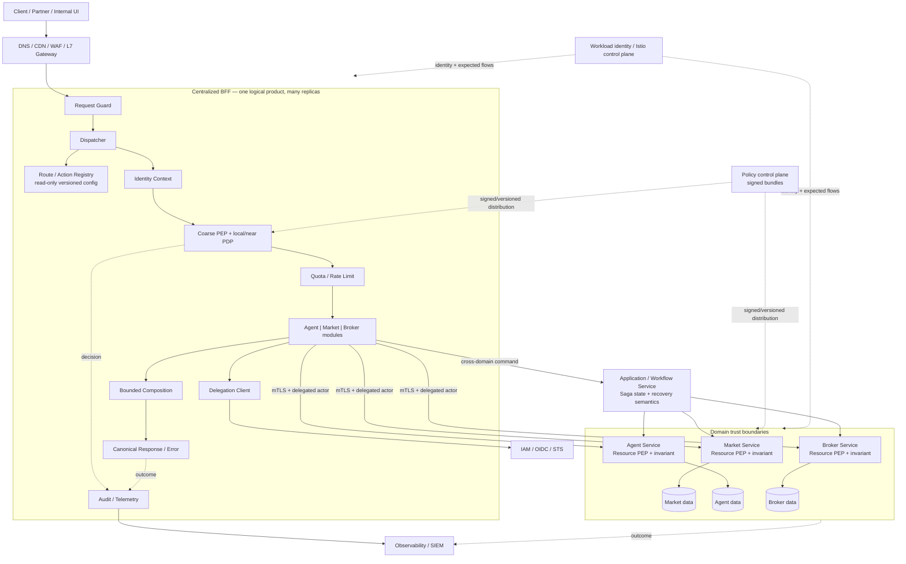
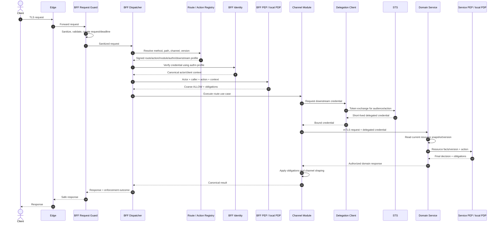
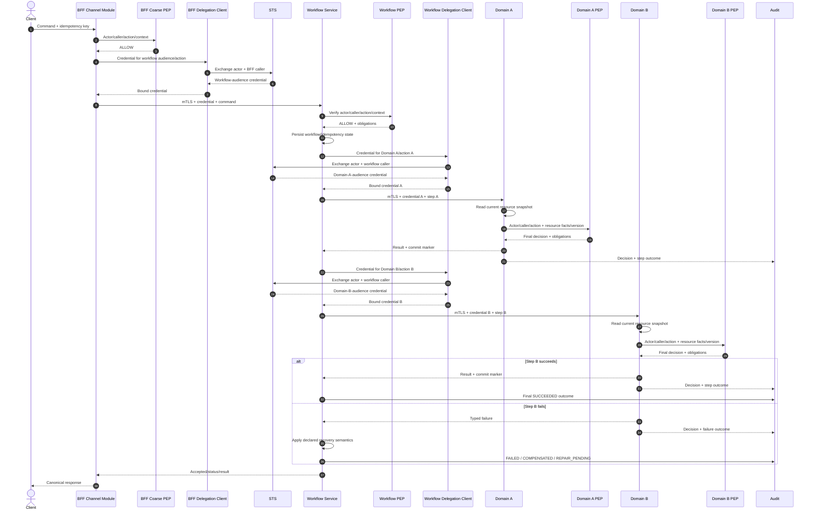
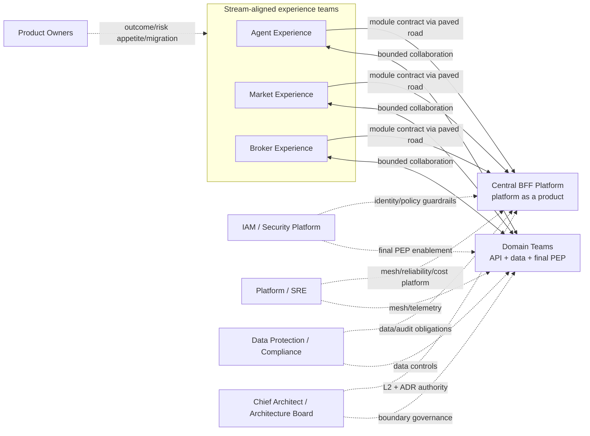
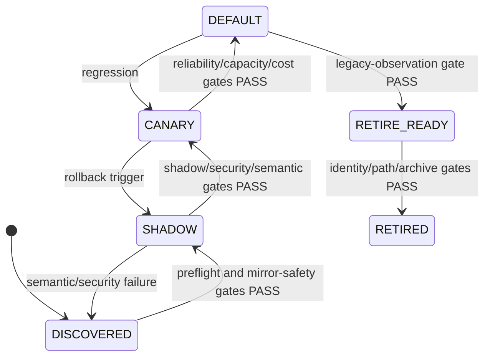

# L2 — AP-CBFF — Centralized BFF, Edge and Authorization Platform

| Thuộc tính | Giá trị |
|---|---|
| Document ID | AP-CBFF-L2 |
| Phiên bản | 2.2 |
| Trạng thái | **READY FOR ARCHITECTURE REVIEW** |
| Ngày | 01/09/2026 |
| Architecture Owner | Chief Architect |
| Phạm vi quyết định | Hợp nhất `agent-api`, `market-api`, `core-broker-api` thành một BFF logic tập trung |
| Pilot | `market.order.read` |
| Kiến trúc Phase 1 | Modular monolith, stateless, horizontal scaling, multi-AZ |
| Security model | Zero Trust; xác thực mọi hop; policy tập trung, enforcement phân tán |
| Canonical L2 | `zero-trust.md` trong repository `huynv-xyz/vhm` |
| Approval requested | Target architecture, invariant, decision, target team boundaries, migration và gate definitions |
| Review disposition | Target-architecture approval; as-built operating model và production approval vẫn bị giữ tại G0 |
| Production authorization | Chỉ được cấp khi target của gate đã được duyệt và gate instance áp dụng có evidence `PASS` còn hiệu lực |

---

## 0. Document Governance

### 0.1 Mục đích và thẩm quyền

Tài liệu này là nguồn quyết định kiến trúc L2 duy nhất cho chương trình
Centralized BFF. Nó xác định boundary, invariant, contract semantics, security
posture, quality attribute, ownership, migration và điều kiện promotion.

OpenAPI, schema, policy, manifest, benchmark, runbook và kế hoạch theo route là
artefact L3. L3 MUST tuân thủ L2; L3 không được âm thầm thay đổi invariant hoặc
decision. ADR ghi rationale, approval và migration của một thay đổi; nếu thay đổi
có hiệu lực lên `INV-*`/`DEC-*`, L2 MUST được version/phê duyệt trước activation.
ADR một mình không được override canonical registry.

Tài liệu này đủ để Architecture Board quyết định target state và cho phép chạy
discovery/pilot. Nó không tự cấp quyền đưa traffic production khi evidence gate
chưa đạt.

### 0.2 Từ khóa chuẩn

| Từ khóa | Ý nghĩa |
|---|---|
| MUST / MUST NOT | Điều kiện bắt buộc / hành vi bị cấm |
| SHOULD / SHOULD NOT | Mặc định bắt buộc; ngoại lệ cần ADR và owner chấp thuận |
| MAY | Tùy chọn không làm yếu invariant |
| Gate | Điều kiện evidence để chuyển trạng thái migration |
| Security invariant | Không được hạ thấp bằng số đo legacy hoặc pilot |
| Hypothesis | Giá trị để thiết kế phép đo; chưa phải SLO hay promotion criterion |

Nếu một câu mô tả chi tiết mâu thuẫn với registry, registry thắng theo thứ tự:
`INV-*` → `DEC-*` → `GATE-*` → nội dung diễn giải.

### 0.3 Evidence và approval semantics

Mọi target định lượng MUST có provenance, định nghĩa phép đo, owner, evidence và
trạng thái. Không được gọi một con số là “baseline” chỉ vì nó xuất hiện trong TDD.

**Provenance**:

- `SECURITY_INVARIANT`: floor không thương lượng, độc lập với legacy baseline.
- `ARCHITECTURE_INVARIANT`: floor trực tiếp từ approved L2 boundary/contract.
- `EXTERNAL_OBLIGATION`: luật, hợp đồng hoặc compliance control có nguồn rõ.
- `BUSINESS_RISK_APPETITE`: ngưỡng do business/security owner chấp thuận.
- `LEGACY_BASELINE_DERIVED`: suy ra từ telemetry hiện trạng đủ đại diện.
- `CAPACITY_MODEL_DERIVED`: suy ra từ workload và cost model được kiểm chứng.
- `PILOT_HYPOTHESIS`: giả thuyết cần đo trong G0/pilot.

Gate definition ở L2 và gate instance ở L3 có lifecycle độc lập:

| Dimension | States | Meaning |
|---|---|---|
| `applicability` | `APPLICABLE`, `NOT_APPLICABLE` | Route/data/action class có phải đánh giá gate này hay không; `NOT_APPLICABLE` cần reason và approver |
| `target_status` | `NOT_SET`, `PROPOSED`, `APPROVED`, `SUPERSEDED` | Architecture/risk owner đã duyệt threshold/version nào; fixed security floor được duyệt cùng L2 |
| `evidence_status` | `NOT_MEASURED`, `UNDER_REVIEW`, `PASS`, `FAIL`, `STALE` | Một route/cohort/environment cụ thể đã thỏa criterion hay chưa |

`GATE-*` trong L2 là immutable metric/acceptance definition. Với target cần
calibration, numeric threshold nằm trong versioned L3 target record, không sửa
L2 theo từng route. `L3-MIG` lưu instance theo route, cohort và environment với
target version, result, measurement window, evidence link, owner, approver và
timestamp. Promotion chỉ khi `target_status=APPROVED`,
`evidence_status=PASS` và evidence chưa stale. Security invariant có hiệu lực
ngay khi L2 được phê duyệt; nó không được waive bằng legacy baseline hoặc risk
acceptance. Thiếu evidence để chứng minh invariant là `FAIL`, không phải allow.

### 0.4 Revision history

| Version | Disposition | Nội dung |
|---|---|---|
| 2.0-rc1 | Superseded | Baseline Centralized BFF Zero Trust đầu tiên |
| 2.1-rc1 | Superseded | Bổ sung consistency, rate limit, invalidation, capacity và ROM |
| 2.2 | Current | Refactor thành reviewable L2; sửa citation/flow; hợp nhất registry/gate; thêm team topology |

---

## 1. Executive Context, Outcomes and Scope

### 1.1 Bài toán

Ba BFF hiện tại lặp lại authentication, route mapping, authorization, delegation,
error mapping, rate limiting, retry và telemetry. Cùng một actor/action có thể bị
diễn giải khác nhau; thay đổi security cần phát hành nhiều nơi; ownership của
composition và domain invariant bị mờ; đường bypass khó inventory và audit.

Mục tiêu là một **BFF logic tập trung**: một external entry point, một product,
một route/action model và một security/operational contract. Runtime vẫn có nhiều
replica, availability zone và module; không phải một process, pod, node hay failure
domain duy nhất.

### 1.2 Guardrail: BFF không biến thành “god gateway”

Tên Centralized BFF chỉ hợp lệ khi external contract vẫn được tổ chức theo
experience/channel module:

- Gateway capability xử lý traffic và cross-cutting control.
- Channel module tạo representation/use-case orchestration cho experience.
- Domain service giữ resource truth, business invariant và final authorization.
- Workflow service giữ state của long-running/cross-domain command.
- Shared kernel không chứa business vocabulary của một domain.

Pure proxy route thuộc gateway capability; route có channel-specific response
shape thuộc channel module. Không dùng “centralized” để kéo database, transaction,
domain rule hoặc mọi approval vào một team.

### 1.3 Outcomes

- Một action taxonomy và một identity/delegation contract xuyên mọi route.
- Default-deny, workload identity và final resource authorization không bypass.
- Route-by-route migration có canary, shadow và rollback.
- Channel team vẫn sở hữu consumer contract và outcome.
- Domain team vẫn sở hữu data, invariant, resource PEP và domain on-call.
- Audit nối được request, decision, credential và final outcome.
- Chi phí latency, mesh, policy và vận hành được đo trước production promotion.

### 1.4 Scope

**In scope**:

- Edge-to-BFF và BFF-to-domain trust boundary.
- External user/client authentication và internal workload identity.
- Route/action registry, policy evaluation, delegation và enforcement.
- Channel composition, consistency semantics và read-your-writes.
- Rate limiting, resilience, telemetry, release và migration.
- Team topology, code/deploy/on-call ownership và L3 governance.

**Out of scope**:

- Viết lại domain service hoặc hợp nhất domain database.
- Distributed transaction xuyên domain trong BFF.
- Chọn vendor cloud/API gateway cụ thể.
- Thiết kế UI và business workflow cụ thể ngoài pilot.
- Multi-region active-active ở Phase 1.
- Ambient mesh hoặc SPIRE production adoption khi chưa có ADR/PoC.

### 1.5 Phạm vi phê duyệt

Architecture Board được đề nghị:

1. Phê duyệt `INV-01..24` và `DEC-01..15` làm guardrail L2.
2. Cho phép G0 discovery, foundation và pilot `market.order.read`.
3. Công nhận `GATE-00..25` là registry definition duy nhất; gate instance nằm ở L3.
4. Công nhận variable target chưa có `target_status=APPROVED` không phải cam kết production.
5. Yêu cầu mọi thay đổi invariant/decision qua ADR và Architecture Owner.

---

## 2. Current-State Evidence Status

### 2.1 Điều đã biết và điều chưa được chứng minh

Tại thời điểm review, target architecture được xác định nhưng **as-built evidence
chưa đầy đủ**. Chỉ `market.order.read` có pilot baseline ở mức route name. Chưa có
evidence đủ để xác nhận toàn bộ route, direct database access, traffic profile,
policy divergence, dependency graph, team ownership, deploy authority, on-call,
latency/cost baseline hoặc effort.

Đây là giới hạn evidence, không phải lý do để trì hoãn target decision. G0 tồn tại
để thay assumption bằng dữ liệu trước khi production scope được mở rộng.

### 2.2 G0 evidence pack

| Evidence class | Nội dung tối thiểu | Acceptance |
|---|---|---|
| Route inventory | Method/path, consumer, route/action, module, downstream, data access, side effect, owner, traffic | 100% observed và declared routes được reconcile; unknown route có owner xử lý |
| Dependency/data graph | Sync/async call, DB/table/cache/topic, credential, network path | Mọi path tới data/domain được map; direct DB và bypass được gắn disposition |
| Identity/policy | Issuer, audience, header, role/scope, policy, service account, secret | Mỗi route có current authn/authz chain và gap so với invariant |
| Traffic/reliability | RPS, payload, fan-out, latency, error, timeout, retry, peak cycle | Có sampling window đại diện và raw query/dashboard reference |
| Operating topology | Repo/CODEOWNERS, deploy permission, pager/on-call, incident, release cadence | Mỗi service/module/control plane có đúng một accountable team |
| Cost/capacity | Pod profile, replica, CPU/memory, proxy/xDS/telemetry cost | Có unit-cost model và saturation evidence |
| Data governance | Data class/PII, purpose, residency, retention/deletion, audit class và applicable legal/contract control | Mỗi route/resource có accountable Data Protection/Compliance owner và authoritative obligation source |
| Consumer contract | Client version, compatibility, deprecation, error behavior | Consumer và migration owner xác nhận |
| Delivery ROM | Work package, dependency, role/FTE, P50/P80, assumption | Architecture, Engineering và Product owner ký planning baseline |

Evidence MUST có timestamp, scope, query/source, owner và freshness. Spreadsheet
không có nguồn truy ngược không được coi là evidence.

### 2.3 Assumption register

| ID | Assumption hiện tại | State | Cách đóng |
|---|---|---|---|
| ASM-01 | Ba BFF có thể dùng chung entry/runtime mà vẫn giữ contract module | UNVERIFIED | Route/consumer inventory và coupling analysis |
| ASM-02 | `market.order.read` là read-only, reversible và đại diện cho pilot | UNVERIFIED | Code/data-path review và replay-safe shadow test |
| ASM-03 | Không có route cần BFF truy cập DB trực tiếp | UNVERIFIED | Static/runtime dependency graph |
| ASM-04 | Istio sidecar có thể đáp ứng L7 policy và cost envelope | UNVERIFIED | Mesh benchmark/capacity artefact |
| ASM-05 | OAuth token exchange/STS hỗ trợ actor-caller-audience profile | UNVERIFIED | IAM capability test |
| ASM-06 | Domain service có thể thực hiện final resource authorization | UNVERIFIED | Domain gap assessment |
| ASM-07 | Một core squad và các domain counterpart có capacity triển khai | UNVERIFIED | Operating topology và staffing plan |
| ASM-08 | Single-region multi-AZ đáp ứng business continuity Phase 1 | UNVERIFIED | BIA/RTO/RPO approval |
| ASM-09 | Data residency, retention và audit profile hiện tại đáp ứng nghĩa vụ áp dụng | UNVERIFIED | Data-flow/classification/control applicability review |

Assumption không được “đóng” bằng ý kiến. Nếu sai, owner phải cập nhật risk,
decision/gate liên quan và ROM trước khi đi tiếp.

### 2.4 Route decomposition taxonomy

Mỗi handler được phân loại đúng một primary class:

| Class | Target owner/place | Migration implication |
|---|---|---|
| Pure proxy/cross-cutting | Edge/BFF kernel | Di chuyển sớm; không thêm business mapping |
| Channel representation | Channel module | Giữ channel contract và owner |
| Single-domain business rule | Domain service | Di chuyển rule trước/cùng route |
| Cross-domain workflow | Orchestrator/workflow service | BFF chỉ khởi tạo/query; không giữ saga state |
| Direct data access | Domain API cần tạo | Blocker cho cutover route |
| Obsolete/duplicate | Retire | Không port mặc định |

Decision tree: direct DB → tạo domain API; multi-domain mutation/state →
orchestrator; domain invariant → domain; channel-only composition → module;
còn lại → gateway/kernel nếu thực sự cross-cutting.

---

## 3. Canonical Architecture Registries

### 3.1 Invariant Registry

Các invariant dưới đây là normative. Test chi tiết nằm ở `L3-TEST`; các section
sau chỉ giải thích cách thực hiện, không tạo invariant mới.

| ID | Invariant | Verification authority |
|---|---|---|
| INV-01 | Một logical entry/product nhưng runtime MUST có nhiều replica/AZ và không có singleton request path | Platform/SRE |
| INV-02 | BFF request path MUST stateless; domain/workflow state có owner bên ngoài BFF | Architecture/Domain |
| INV-03 | BFF MUST NOT truy cập domain database, table hoặc internal repository | Architecture/Domain |
| INV-04 | Domain giữ business invariant, resource truth và final resource authorization trên current snapshot | Domain/Security |
| INV-05 | Actor và caller MUST tách biệt; mọi untrusted internal identity header bị strip trước trust boundary | IAM/Security |
| INV-06 | Mọi internal hop MUST xác thực workload identity và encrypted in transit | Platform/Security |
| INV-07 | Request MUST resolve thành stable `route_id`, business `action_id` và accountable owner qua signed/versioned registry | BFF Platform |
| INV-08 | Route Registry chỉ là configuration source; MUST NOT evaluate policy, exchange token, gọi downstream hoặc shape response | Architecture/BFF Platform |
| INV-09 | BFF coarse PEP chỉ early-reject; bypass BFF MUST NOT vượt final domain PEP | Security/Domain |
| INV-10 | Downstream credential MUST ngắn hạn, audience-restricted, actor/caller/action/tenant-bound; raw external token forwarding bị cấm | IAM/Security |
| INV-11 | Cross-domain write MUST qua application/orchestrator có state, idempotency, explicit recovery semantics (compensation, forward recovery hoặc manual repair) và audit; BFF không làm transaction coordinator | Architecture/Domain |
| INV-12 | Aggregated read MUST công bố consistency profile; hệ thống MUST NOT giả lập atomic cross-domain snapshot | Product/Domain |
| INV-13 | Deadline chỉ được giảm; retry có một owner; mutation retry cần idempotency evidence | Platform/Domain |
| INV-14 | Fan-out, concurrency, payload và resource use MUST có bound và isolation theo module/tenant/downstream | Platform/SRE |
| INV-15 | Policy/config/route bundle MUST signed, versioned, schema-validated, canary, last-known-good và rollbackable | Security/Platform |
| INV-16 | Stale/unknown security evidence MUST fail theo action risk profile; high-risk action mặc định fail closed | Security |
| INV-17 | Revocation/invalidation MUST monotonic, idempotent, replayable và bị chặn bởi hard freshness ceiling | IAM/Security/SRE |
| INV-18 | Audit MUST nối được request, actor, caller, action, resource/version, policy/config version, decision và final outcome | Security/SRE |
| INV-19 | Network/mesh/egress default-deny và expected-flow allowlist MUST ngăn undeclared path | Platform/Security |
| INV-20 | Shared kernel MUST không chứa domain business vocabulary; module có boundary và extraction fitness test | Architecture/BFF Platform |
| INV-21 | Secret/private key MUST không nằm trong repository/image; signing key dùng approved KMS/HSM theo classification; rotation/break-glass có overlap, rollback, dual control, expiry và audit | IAM/Security |
| INV-22 | Replica MUST NOT nhận protected traffic trước khi route config, trust/JWKS và policy bundle hợp lệ được preload; synchronous JWKS/policy fetch trên request path bị cấm | BFF Platform/Security |
| INV-23 | External/internal contract thay đổi additive mặc định; breaking change cần version, consumer migration, sunset và N/N-1 compatibility evidence | Experience/BFF Platform/Domain |
| INV-24 | Async worker MUST xác thực producer/workload context và re-authorize tại execution cho sensitive action; queued credential/policy/resource state không được mặc định còn hợp lệ | Workflow/Domain/Security |

Ngoại lệ làm yếu invariant không được xử lý bằng config flag. Nó cần version L2
mới, ADR, threat/risk review và Architecture Owner approval.

### 3.2 Decision Registry

| ID | Decision | Status | Rationale và guardrail | Change authority |
|---|---|---|---|---|
| DEC-01 | Một logical Centralized BFF | FOR_APPROVAL | Chuẩn hóa entry và controls; không tạo single instance/team queue | Architecture Board |
| DEC-02 | Modular monolith Phase 1, một image nhiều replica | FOR_APPROVAL | Giảm distributed complexity; activation/canary/rollback theo route/module, chưa phải independent binary deploy | Architecture Board |
| DEC-03 | Channel modules + evidence-based extraction | FOR_APPROVAL | Giữ consumer fit; chỉ tách khi scale/failure/cadence/ownership justify | Architecture Owner |
| DEC-04 | Edge/BFF/domain/orchestrator boundary như §4 | FOR_APPROVAL | Không kéo domain/workflow state vào BFF | Architecture Board |
| DEC-05 | Coarse BFF PEP + final domain PEP | FOR_APPROVAL | Early reject và resource correctness; không coi mesh là đủ AuthZ | Security + Architecture |
| DEC-06 | Phase 1 dùng Istio sidecar và Istio CA trong in-mesh scope | FOR_APPROVAL | Semantics L7/ext-authz rõ; giảm hai identity authority | Platform + Security |
| DEC-07 | SPIRE và ambient mesh deferred | DEFERRED | Chỉ adopt khi off-mesh/federation/attestation hoặc cost tạo value; cần ADR/PoC/parity test | Architecture Board |
| DEC-08 | OPA local/near evaluator, engine-neutral decision contract | FOR_APPROVAL | Giảm hot-path network dependency và lock-in | Security + Architecture |
| DEC-09 | OAuth token exchange; cấm raw-token forwarding | FOR_APPROVAL | Audience/action/caller rõ, giảm confused deputy | IAM + Security |
| DEC-10 | OpenTelemetry cho correlation; không mang raw token/role/PII trong baggage | FOR_APPROVAL | Chuẩn hóa signal nhưng giới hạn disclosure | SRE + Security |
| DEC-11 | Strangler route-by-route, pilot read trước mutation | FOR_APPROVAL | Rollback nhỏ và evidence tăng dần | Architecture + Product |
| DEC-12 | Rate limiting bốn tầng | FOR_APPROVAL | Edge abuse, replica safety, distributed fairness, domain protection có trách nhiệm khác nhau | Platform + Domain |
| DEC-13 | Durable invalidation + TTL/freshness ceiling | FOR_APPROVAL | Emergency revoke nhanh nhưng an toàn khi event path lỗi | IAM + Security + SRE |
| DEC-14 | Explicit consistency profile và opaque commit marker cho RYW | FOR_APPROVAL | Không che giấu stale/cross-domain inconsistency | Product + Domain |
| DEC-15 | Single-region multi-AZ Phase 1; mọi NFR/ROM định lượng theo Gate Register | FOR_APPROVAL | Tránh false precision trước G0; multi-region cần BIA/ADR | Architecture Board |

### 3.3 Quality Attribute Scenarios

| ID | Stimulus và expected response | Measurement source | Gate |
|---|---|---|---|
| QAS-01 | Một replica/AZ lỗi; healthy replicas tiếp tục, không bypass policy | Failure injection + SLI | GATE-09/GATE-10/GATE-13 |
| QAS-02 | Policy/control plane unavailable; data plane dùng valid LKG, không activate empty/unsigned bundle | Chaos + audit | GATE-06/GATE-07 |
| QAS-03 | Credential/revocation event; deny lan truyền trong approved risk bound | Drill + event/decision trace | GATE-08 |
| QAS-04 | Peak/burst traffic; priority route giữ fairness, overload shed có typed response | Load test | GATE-10/GATE-15 |
| QAS-05 | Domain slow/fails; deadline/cancel/bulkhead ngăn cascade, optional data được đánh dấu | Fault injection | GATE-10 |
| QAS-06 | Policy/config release lỗi; canary phát hiện và rollback về LKG | Release drill | GATE-06/GATE-12 |
| QAS-07 | Aggregated data khác thời điểm; client nhận provenance/staleness/consistency đúng contract | Contract test | GATE-05/GATE-18 |
| QAS-08 | Legacy-to-target cutover/rollback; không có critical semantic mismatch hoặc side effect kép | Shadow/canary | GATE-12/GATE-16/GATE-17 |
| QAS-09 | Disaster làm mất serving region/control metadata; restore và reconcile không làm yếu trust boundary | DR/restore exercise | GATE-25 |

---

## 4. Target Architecture and Boundaries

### 4.1 Logical architecture

Control plane phân phối identity, policy và config; nó không được nằm bắt buộc
trên mọi request hot path. Data plane tiếp tục an toàn bằng credential còn hiệu
lực và LKG trong bounded window; hết freshness ceiling thì hành vi theo action
risk profile, high-risk mặc định deny.

### 4.2 Component responsibilities

| Component | Owns | MUST NOT own |
|---|---|---|
| Edge | TLS termination policy, WAF, coarse client/IP abuse control, request size | User/resource authorization, domain semantics |
| Request Guard | Header sanitization, schema/size limits, request/deadline IDs | Business routing hoặc policy decision |
| Dispatcher | Resolve config, reject unknown/ambiguous/incompatible route, gọi runtime stages, enforce stage order | Domain rules hoặc persistent workflow state |
| Route Registry | Immutable route/action/module/authn/downstream profile; version/signature | Token exchange, policy eval, downstream call, response shaping |
| Identity Context | Verify issuer/audience/signature/expiry; canonical actor/client | Suy đoán role/resource từ untrusted header |
| Coarse PEP/PDP | Early action/tenant/channel/risk decision | Final resource decision thiếu current facts |
| Quota | Local concurrency/safety và distributed user/tenant fairness | Domain capacity invariant cuối cùng |
| Channel module | Consumer contract, bounded composition, response shaping | Domain data/invariant hoặc generic platform kernel |
| Delegation Client | Request/cache bounded downstream credential | Route lookup, domain call hoặc raw token pass-through |
| Domain service | Resource truth, invariant, final PEP, domain idempotency | Client/channel representation |
| Orchestrator | Cross-domain workflow state, declared recovery semantics và status | UI-specific shaping hoặc domain invariant |
| Policy control plane | Policy authoring/build/sign/distribute/rollback | Request-specific network lookup trong evaluation |
| Central BFF Platform | BFF runtime/kernel, registry tooling, BFF application capacity, release paved road và BFF on-call | Shared mesh/quota/telemetry platform hoặc business mapping |
| Shared Platform/SRE | Ingress/mesh/egress, shared quota/observability infrastructure, infrastructure SLO/cost tooling | BFF runtime/module hoặc route/domain outcome |

`Dispatcher` là logical behavior trong BFF runtime, không phải deployable/service
mới. Registry có thể được build vào signed snapshot hoặc cache local; diagram
không trao cho Registry quyền thực thi request.

### 4.3 Dependency and state rules

Allowed direction:

`client → edge → BFF → domain/orchestrator → domain data`

`control plane → signed/versioned config → data-plane enforcement`

Forbidden:

- BFF → domain database/internal repository.
- Module A → internal implementation/repository của Module B.
- Domain → BFF cho domain correctness.
- PDP → arbitrary network lookup trong decision hot path.
- Client/legacy → undeclared service bypass.
- Legacy BFF → Central BFF → same legacy BFF loop.
- BFF → multiple domains để thực hiện cross-domain mutation transaction.

BFF chỉ giữ ephemeral/request-local state và bounded caches. Domain state, saga
state, idempotency outcome và audit-of-record có durable owner riêng.

### 4.4 Modular monolith and extraction rule

Phase 1 dùng một image để giảm distributed operational overhead. Module được
enforce bằng package/API boundary, build rule, ownership metadata, test và
per-module resource control. Traffic activation, canary và rollback được điều
khiển theo route/module; module **chưa** có independent binary deployment.

Tách module thành service chỉ khi có evidence ở ít nhất hai nhóm sau và ADR được
phê duyệt:

- Scale/resource profile độc lập, gây contention dù đã bulkhead.
- Failure domain cần isolation riêng.
- Release cadence/compatibility khác biệt có số liệu.
- Security/compliance boundary khác.
- Accountable team có năng lực deploy/on-call độc lập.

Việc tách không được làm mất action taxonomy, actor/caller/delegation, audit hoặc
final domain PEP.

---

## 5. Zero Trust Security Profile

### 5.1 Normative posture

Thiết kế áp dụng NIST SP 800-207/207A: không implicit trust theo network location;
mọi access quyết định theo subject/workload/resource/action/context; enforcement
gần resource; telemetry và trust được đánh giá liên tục.

Phase 1 production profile:

- External identity: OIDC/OAuth issuer allowlist và audience restriction.
- Delegation: OAuth 2.0 Token Exchange theo RFC 8693.
- Sender constraint cho use case yêu cầu: mTLS/certificate-bound profile theo
  RFC 8705; OAuth security posture theo RFC 9700.
- Workload identity: Istio-issued SPIFFE-compatible identity trong mesh.
- Transport: Istio `STRICT` mTLS end state, expected-flow AuthorizationPolicy.
- Policy: OPA local/near PDP với signed, versioned, tested bundle và LKG.
- Telemetry: OpenTelemetry/W3C Trace Context; security audit tách khỏi baggage.

SPIRE hoặc ambient mesh không thuộc Phase 1 baseline. Adoption cần nhu cầu
attestation/federation/off-mesh hoặc cost evidence, PoC, policy-parity test,
failure drill và ADR.

Mỗi trust domain có đúng một issuing-authority model. Phase 1 không federation;
Istio CA và SPIRE không được chạy như hai issuer ngang hàng cho cùng identity
namespace. Federation hoặc authority migration cần collision analysis, overlap/
rollback design, compromise drill và ADR.

### 5.2 Identity model

Mỗi request có tối thiểu:

- `actor`: human/service subject gốc đã xác minh.
- `client`: OAuth client/channel đã xác minh.
- `caller`: SPIFFE/workload identity của hop hiện tại.
- `delegation_chain`: bounded chain chứng minh workload hành động thay actor.
- `tenant`: canonical tenant membership có provenance/freshness.
- `authentication_time` và assurance/authentication method khi action yêu cầu.
- device posture/risk signal nếu có, nhưng chỉ khi issuer, provenance và freshness
  được policy profile tin cậy.

Edge/Guard MUST xóa mọi header nội bộ do client gửi, gồm actor, caller, tenant,
role, policy decision, SPIFFE ID và obligation. BFF tái tạo context từ credential
đã verify. Service MUST xác minh caller và delegated token độc lập; không tin
header chỉ vì request đi từ BFF.

SPIFFE ID MUST ổn định theo trust domain, environment, namespace và workload
role; không chứa pod UID/IP/replica. Prod và non-prod không chia root/trust domain
vô ý. Service account không được dùng chung cho workloads có quyền khác nhau.
Issuance MUST bind platform-attested workload selectors và deployment provenance;
certificate/key rotation tự động, có overlap an toàn, không cần restart workload
và được kiểm tra bằng rotation/compromise drill.

### 5.3 Delegation and token exchange

External access token không được forward nguyên trạng. Delegation Client xin
credential ngắn hạn cho đúng downstream audience và action. Profile L3 MUST pin:

- issuer, subject/actor, caller/client và audience;
- action/scope và tenant binding;
- issued-at, expiry, token/jti identifier;
- bounded delegation chain;
- proof/sender constraint khi risk yêu cầu;
- cache key, max TTL, rotation và replay response.

Credential cache không được sống lâu hơn token, session, policy decision hoặc
security freshness ceiling nhỏ nhất. STS outage không cho phép mở rộng audience
hay dùng raw token làm fallback.

### 5.4 Authorization model

BFF coarse PEP đánh giá actor/caller/action/tenant/channel/risk để reject sớm.
Domain đọc resource snapshot hiện tại, cung cấp resource facts/version cho
Service PEP và thực thi final decision trên cùng snapshot. Nếu resource thay đổi
giữa decision và mutation, domain phải dùng optimistic concurrency/transactional
check hoặc đánh giá lại.

Canonical decision gồm `ALLOW|DENY|CHALLENGE|INDETERMINATE`, reason code,
policy/bundle version, facts/freshness reference, `valid_until`, obligations và
decision ID. `CHALLENGE` yêu cầu step-up xác thực đã đăng ký cho action;
`INDETERMINATE` biểu diễn evaluator timeout/error, missing/stale facts hoặc
incompatible bundle và MUST NOT được chuyển thành `ALLOW`. High-risk action map
`INDETERMINATE` thành deny; action khác chỉ được dùng fallback đã được risk owner
phê duyệt và audit rõ. Chỉ
allowlisted obligations được thực thi; unknown obligation fail closed cho action
liên quan.

Policy evaluation không gọi tùy ý ra network. PIP data được cung cấp có provenance,
version và freshness. Bundle build pipeline phải có schema, unit/property/negative
test, signature, staged rollout và rollback về LKG. Empty, unsigned, expired hoặc
incompatible bundle không được activate. Evaluator readiness MUST expose engine
health, active bundle version, LKG age và last activation failure.

Mapping theo NIST:

| NIST role | AP-CBFF realization |
|---|---|
| Policy Engine (PE) | Engine-neutral decision logic và risk/resource evaluation trong local/near PDP |
| Policy Administrator (PA) | Policy build/sign/distribution, STS/delegation administration và activation controller |
| Policy Enforcement Point (PEP) | Edge coarse control, BFF coarse PEP, mesh expected-flow và final domain PEP |
| Policy Information source (PIP) | IAM/session/device/risk evidence và domain resource facts có provenance/freshness |

PE/PA/PIP có thể gồm nhiều component; mapping này là responsibility model, không
cho phép tạo một privileged “trust service” duy nhất trên hot path.

Secret/key floor theo INV-21: static secret/private key trong source hoặc image bị
cấm; signing key dùng managed KMS/HSM phù hợp data/security classification; key
rotation có versioned overlap và rollback; break-glass là JIT, dual-control,
expiring và immutable-audited. Workload private key không được export khỏi
workload boundary.

### 5.5 Continuous verification, revocation and invalidation

Sự kiện user/session disable, credential theft, role/tenant entitlement change,
device non-compliance, workload/service-account revoke, artifact quarantine,
resource ownership/classification/state change, policy emergency deny và signing-
key compromise đi qua durable at-least-once transport.

Event envelope tối thiểu: event ID, subject/resource partition key, monotonic
sequence/version per key, effective-at timestamp, reason, issuer/signature và
scope. Timestamp chỉ phục vụ audit/latency, không thay ordering. Consumer MUST
idempotent; old/out-of-order event không đảo ngược revoke;
lag, replay, dead letter và last-applied version phải observable.

Event invalidation giảm exposure nhưng không thay TTL/freshness ceiling. Khi
transport lỗi, cache entry vẫn hết hạn theo hard ceiling. Propagation target nằm
duy nhất tại Gate Register và chỉ binding khi `APPROVED`.

Long-lived stream/session phải re-evaluate tại bounded interval và đóng khi
credential/revocation không còn hợp lệ.

### 5.6 Mesh, network and egress enforcement

Phase 1 end state:

- PeerAuthentication `STRICT` cho in-scope namespaces.
- Default-deny AuthorizationPolicy trước allowlist.
- Allow theo workload identity, method/path/service port và declared direction.
- Gateway/BFF không là đường duy nhất; domain policy/service PEP vẫn chặn bypass.
- Egress mặc định deny; destination, port, protocol, SNI/host và data class phải
  được khai báo.
- Client-controlled arbitrary URL bị cấm; redirect chỉ theo allowlist và không tự
  chuyển sang untrusted host. Metadata endpoint, loopback và private-address range
  không thuộc declared destination phải bị chặn để chống SSRF.
- Partner credential được scope theo destination/audience; không dùng một shared
  credential cho toàn BFF.
- Sidecar injection/mTLS/policy health là release evidence, không best effort.

Mesh policy không được dựa vào source IP hoặc namespace name đơn lẻ. Mesh xác
thực workload và expected flow; application xác thực delegated actor và resource.

### 5.7 Threat/control summary

| Threat | Primary controls | Verification |
|---|---|---|
| Spoofed internal header | INV-05, Guard sanitization, token verification | Negative contract test |
| Confused deputy/token replay | INV-10, audience/action binding, sender constraint | Token misuse matrix |
| BFF bypass/BOLA | INV-04/09/19, final domain PEP | Direct-path negative test |
| Stale allow after revoke | INV-16/17, event invalidation + ceiling | Revocation drill |
| Policy/config compromise | INV-15, signing, provenance, LKG, two-person release | Supply-chain test/audit |
| Dependency amplification | INV-13/14, deadline, retry owner, bulkhead | Fault/load test |
| Sensitive telemetry leak | Data minimization, baggage denylist, access/retention | Telemetry scan |
| Central runtime blast radius | Multi-AZ, module isolation, canary/rollback | Failure injection |

L2 bắt buộc các conformance class sau; concrete corpus/test case nằm ở `L3-TEST`:

- parser/path-normalization/request-smuggling parity giữa Edge và BFF;
- unknown/ambiguous route và route-collision rejection;
- cross-tenant/resource-owner fuzz/property tests;
- plaintext, wrong/expired SVID, wrong principal và direct-port probes;
- wrong audience/action/delegation hop và replay attempts;
- missing/stale/spoofed PIP evidence và evaluator `INDETERMINATE`;
- unsigned/tampered/expired/rollback bundle, JWKS/key rotation và LKG failure;
- client-controlled URL, unsafe redirect, metadata/private-address SSRF;
- raw token/secret/PII leakage trong log, metric, trace và baggage.

---

## 6. Canonical Contracts and Critical Flows

### 6.1 Contract authority

L2 chuẩn hóa semantics; wire schema nằm ở `L3-CONTRACT`. Field bắt buộc không
được đổi nghĩa giữa HTTP/gRPC/event. Action dùng format `domain.resource.verb`,
không dùng HTTP method/controller name. Rename action là breaking security/audit
change và cần compatibility mapping.

#### Request context

| Field | Semantics |
|---|---|
| `request_id`, `attempt_id` | Correlation duy nhất cho logical request và retry attempt |
| `business_operation_id` | Optional idempotent business operation correlation |
| `route_id`, `action_id`, `channel`, `api_version` | Registry-resolved immutable routing intent |
| `received_at`, `deadline_at` | Absolute deadline có clock-skew budget; mỗi process đo elapsed bằng local monotonic clock và chỉ giảm remaining budget |
| `actor`, `client`, `caller`, `delegation_chain` | Verified identity layers; không nhận từ raw header |
| `tenant`, `risk_context` | Evidence có provenance/freshness, data-minimized |
| `trace_id` | Observability correlation; không phải authorization evidence |

#### Route registry record

| Field group | Required semantics |
|---|---|
| Identity | `route_id`, method/path matcher, channel, API version, owner |
| Intent | Stable `action_id`, risk class, authn profile |
| Execution | Module handler, downstream profile, timeout/fan-out/retry owner |
| Policy | Coarse policy reference, final PEP required, obligation allowlist |
| Data | Consistency profile, data classification, cache policy |
| Migration | Legacy target, cohort, state, rollback route |
| Provenance | Schema version, content version, signature, activation/expiry |

Registry resolution chỉ trả immutable record/version cho Dispatcher. Không có
runtime method kiểu `exchangeToken`, `callDomain` hoặc `shapeResponse` trên Registry.

#### Authorization request/decision

Authorization request chứa actor, caller, client, action, tenant, resource type/id,
resource facts/version khi có, environment/risk, evidence provenance/freshness,
request/deadline và policy hint version.

Decision chứa `decision_id`, effect `ALLOW|DENY|CHALLENGE|INDETERMINATE`, reason,
policy/bundle version, evaluated-at, valid-until, resource/fact version,
obligations và audit classification. Reason code stable; diagnostic chi tiết
nhạy cảm không trả trực tiếp cho client. PEP map `INDETERMINATE` sang canonical
dependency/security error theo action profile và ghi nguyên effect vào audit;
không gộp nó với explicit `DENY` hoặc `CHALLENGE`.

#### Canonical error and enforcement outcome

External error có HTTP status, stable code, safe message, request ID,
`retryable`, optional `Retry-After` và field violation. Audit outcome phân biệt
`REJECTED_BEFORE_DOWNSTREAM`, `DOMAIN_DENY`, `SUCCESS`, `PARTIAL`, `TIMEOUT`,
`CANCELLED`, `ROLLED_BACK`; lưu decision ID và side-effect state.

Error taxonomy MUST phân biệt tối thiểu authentication, authorization, validation,
conflict, consistency, rate limit, dependency unavailable và timeout. Domain deny,
dependency/timeout hoặc partial result MUST NOT bị collapse thành generic 500 hay
false success. Exact transport/status mapping được version trong `L3-CONTRACT`.

### 6.2 External authenticated read

Mọi deny/challenge trước downstream dừng flow. Domain không trả data trước final
decision. Audit decision và outcome là hai record correlate được, không suy outcome
từ HTTP status.

### 6.3 Aggregated read and temporal consistency

Mỗi aggregated route khai báo đúng một profile:

| Profile | Contract |
|---|---|
| `EVENTUAL` | Mỗi domain trả local committed version quan sát được; không hứa latest hay same time |
| `BOUNDED_STALENESS` | Mỗi component không cũ hơn approved bound; quá bound fail/degrade theo route |
| `AS_OF` | Chỉ dùng khi từng domain chứng minh cùng logical-time/cursor contract; không tự suy ra atomic snapshot |
| `READ_YOUR_WRITES` | Client đưa opaque commit marker; owner domain verify/wait/fail rõ |
| `ATOMIC_SNAPSHOT` | Chỉ một owning read-model/application service được phép hứa; ad-hoc BFF fan-out bị cấm |

Response aggregated MUST mang top-level profile, generated-at và per-component
`source`, `resource_version`, `observed_at`, `stale`, `degraded`/reason. Required
component lỗi hoặc vi phạm bound làm whole request fail; optional component có
thể partial nếu public contract cho phép. BFF không đổi missing thành empty hoặc
che stale bằng HTTP 200 không indicator.

Commit marker là opaque, signed/domain-verifiable, scoped actor/tenant/resource,
expiring và không chứa raw database offset nhạy cảm. BFF route marker tới đúng
domain; domain chờ đến marker trong bounded deadline hoặc trả typed
`consistency_not_satisfied`. Không silent fallback sang stale read.

### 6.4 Mutation and cross-domain command

Single-domain mutation đi qua final PEP và transaction của domain. Idempotency
key được bind actor/action/tenant/payload hash; domain lưu/replay outcome theo
approved retention. BFF không tự retry mutation nếu không có idempotency contract.

`Client → BFF` trong flow dưới là shorthand cho toàn bộ ingress/identity/coarse-
PEP stages tại §6.2; diagram tập trung vào delegation và workflow hops.

BFF credential chỉ có workflow audience; Orchestrator MUST dùng workload identity
của chính nó và per-domain credential cho từng downstream audience/action. Mọi
domain step, kể cả compensation/forward recovery, đi qua final domain PEP. Không
giả định mọi effect có thể compensate: workflow contract MUST chọn compensation,
forward recovery hoặc bounded manual repair và audit trạng thái tương ứng.

BFF không chờ vô hạn cho workflow. Async response trả operation/status resource;
workflow service là source of truth. Worker MUST xác thực producer signature và
workload caller, kiểm tra freshness/revocation, re-authorize sensitive action tại
execution và vẫn dùng final domain PEP. Credential/policy/resource state lúc enqueue
không được mặc định còn hiệu lực lúc execute. Event chỉ mang signed, minimized
actor/caller/action/outcome context; không phát raw access token.

---

## 7. Data, Reliability, Operations and Release

### 7.1 Data and cache rules

- BFF không là system of record và không lưu durable workflow/session state.
- Response cache key MUST bind route/version, actor/tenant entitlement dimension,
  resource/version và representation; không cache sensitive response nếu chưa có
  threat/privacy review.
- Decision/credential cache key MUST bind mọi input có thể đổi outcome.
- Cache TTL là minimum của decision validity, token/session expiry, policy/fact
  freshness và security ceiling.
- Deny cache TTL ngắn và không che recovery; challenge không được biến thành deny
  vĩnh viễn.
- Event invalidation là acceleration; hard TTL vẫn là safety bound.
- Raw token, credential, secret, full role list và không cần thiết PII không được
  ghi log/cache/trace.

### 7.2 Deadline, retry, cancellation and isolation

Route có end-to-end deadline. Mỗi hop trừ guard margin và chỉ truyền deadline nhỏ
hơn. Timeout budget được derive từ observed downstream distribution tại G0; số
chưa đo nằm ở Gate Register.

Một request có đúng một retry owner cho mỗi dependency. Retry chỉ cho transient
failure được phân loại, nằm trong remaining deadline, retry budget và jittered
backoff. Mutation cần idempotency. Mesh và application không đồng thời retry cùng
attempt. Client cancel/deadline phải propagate để giải phóng downstream work.

Bulkhead/concurrency/queue/fan-out limit theo module, tenant, route risk và
downstream. Overload shed trước khi queue mất kiểm soát; priority không được làm
starve traffic bắt buộc khác. Circuit breaker không biến security deny thành
availability fallback.

### 7.3 Multi-layer rate limiting

| Layer | Key/purpose | Enforcement/failure posture |
|---|---|---|
| Edge | IP/network/client fingerprint, gross request/body abuse | Chặn volumetric/bot trước origin; không thay user/tenant quota |
| BFF local | Replica/module/route concurrency và short burst | Envoy/local limiter hoặc runtime semaphore; luôn bảo vệ process |
| BFF distributed | Verified client/actor/tenant/action entitlement | Shared authoritative quota; atomic enough cho fairness; fail posture theo risk |
| Domain | Resource/business capacity và costly operation | Domain-owned final protection; không expose sensitive capacity |

429 semantics theo RFC 6585 §4. Khi server biết finite retry time, response SHOULD
có `Retry-After`; field semantics/syntax theo RFC 9110 §10.2.3.

`RateLimit` và `RateLimit-Policy` chưa là dependency chuẩn hóa của L2. Nếu public
API expose, `L3-CONTRACT` MUST pin phiên bản đã review của active Internet-Draft
`draft-ietf-httpapi-ratelimit-headers` và coi là Work in Progress, có compatibility
test và disclosure review. Response MUST NOT lộ tenant/global capacity hoặc
partition key. Nếu phiên bản draft được L3 pin quy định precedence, contract phải
test đúng quy tắc đó; RFC 6585/9110 không được viện dẫn cho quota-hint semantics.

Shared limiter outage không được làm local guard biến mất. High-risk/costly action
chỉ được tiếp tục bằng pre-allocated lease/reservation chứng minh không vượt
entitlement; nếu không có thì fail closed. Low-risk read có thể dùng bounded local
emergency budget nếu business/security owner đã phê duyệt.

### 7.4 Availability, SLO and disaster recovery

Phase 1 triển khai multi-AZ, anti-affinity, disruption budget, horizontal scaling
và no singleton hot-path dependency. Availability/SLO/RTO/RPO chỉ binding khi
gate target/BIA đã `APPROVED` và route instance có evidence `PASS`; tài liệu không
suy chúng từ industry convention.

Control-plane outage phải giữ valid LKG. Credential/policy/config hết hiệu lực
không được kéo dài vô hạn để “giữ availability”. DR test gồm restore registry,
policy bundle/signing metadata, limiter state cần thiết, audit continuity và
reconciliation; BFF pod state không phải backup asset.

### 7.5 Observability and audit

Required dimensions được bounded-cardinality:

- request/trace/attempt/operation ID;
- route/action/module/channel/tenant class;
- caller workload, actor pseudonymous ID và auth assurance;
- policy/config/route version, decision/effect/reason;
- downstream, status, retry, timeout, circuit, rate-limit layer;
- consistency profile, source version/staleness và final outcome;
- revocation event/version/lag và LKG age;
- pod/proxy CPU/memory, xDS/config size và telemetry volume.

Audit record là append-oriented, access-controlled và tamper-evident theo L3
retention profile. Audit logging failure cho high-risk mutation phải follow
approved fail posture. Metrics/trace không thay audit-of-record.

Mỗi action có audit class. `DURABLE_AUDIT_REQUIRED` action chỉ được acknowledge
success sau khi audit enqueue/commit đạt durability contract; publish loss/lag,
replay và reconciliation phải measurable. `TELEMETRY_ONLY` không được dùng cho
security-sensitive hoặc externally regulated action. Data Protection/Compliance
phê duyệt retention/residency/deletion và failure posture khi obligation áp dụng.

Alerts tập trung vào user/security outcome: unexpected allow/bypass, policy LKG
age, revoke lag, auth mismatch, module saturation, quota-store degradation,
downstream budget exhaustion, shadow mismatch, rollback failure và cost envelope.

### 7.6 Release and supply-chain safety

- Một immutable image digest cho Phase 1; SBOM, signature, provenance và scan.
- Route/policy/config bundle độc lập version nhưng cùng schema/compatibility gate.
- Default-off route activation; stable cohort hashing; canary theo route/module.
- Two-person approval cho security-floor policy/key/trust changes.
- Automated preflight: schema, signature, dependency, policy conflict, default-deny,
  load/conformance test và rollback reference.
- Protected readiness giữ replica ngoài service cho tới khi route config, trust
  bundle/JWKS và policy bundle hợp lệ đã preload. Request không được là cơ chế
  synchronous fetch JWKS/policy đầu tiên; key rotation dùng versioned overlap.
- Runtime/config/policy versions xuất hiện trong health, telemetry và audit.
- Rollback về compatible LKG được drill trước cutover.
- Thay đổi backward-compatible được phép trong cùng API version; breaking request,
  response, error hoặc security semantics cần version mới, consumer migration và
  deprecation evidence trước retirement.
- Rolling deployment MUST có compatibility matrix giữa BFF image, route/config,
  policy bundle và domain API; internal contract hỗ trợ N/N-1 trong rollout.

### 7.7 Capacity and unit cost

Capacity model MUST tính riêng application, sidecar/proxy, local PDP, distributed
quota, telemetry pipeline và control-plane/xDS. Mỗi workload class có RPS,
payload, fan-out, TLS/token/policy cost, p50/p95/p99, CPU, memory, connection,
config object, log/trace bytes và cost/request.

Headroom, peak multiplier và burst factor hiện là hypothesis tại Gate Register;
G0 workload evidence và pilot benchmark phải derive giá trị. Scale test gồm warm,
cold cache, key/bundle rotation, control-plane degradation, high-cardinality
protection và rolling deploy—not chỉ happy-path steady state.

Platform-overhead measurement chạy từ BFF ingress đến downstream dispatch cộng
local response/audit enqueue; nó MUST gồm Guard, route lookup, local credential/
JWKS verification, local PDP, distributed quota, STS/token exchange khi cache miss
và audit enqueue. Domain processing/network sau dispatch được báo riêng. Không
được loại dependency khỏi metric để làm đẹp percentile.

---

## 8. Team Topology and Governance

### 8.1 Current operating topology evidence

Tên capability team dưới đây là target logical boundary, không phải tuyên bố
as-built. Tên team nội bộ, repo, deploy permission, pager và release cadence chưa
được cung cấp; vì vậy **operating-model approval đang bị giữ tại GATE-01**. RACI
chung hoặc tên cá nhân không thay thế accountable team.

| Current system | As-built team/repo/deploy/on-call evidence | State | Gap owner / due |
|---|---|---|---|
| `agent-api` | Chưa đăng ký trong evidence pack | NOT_MEASURED | Engineering Mgmt + service sponsor / GATE-01 |
| `market-api` | Chưa đăng ký trong evidence pack | NOT_MEASURED | Engineering Mgmt + service sponsor / GATE-01 |
| `core-broker-api` | Chưa đăng ký trong evidence pack | NOT_MEASURED | Engineering Mgmt + service sponsor / GATE-01 |
| IAM/STS/policy control plane | Chưa đăng ký trong evidence pack | NOT_MEASURED | Security/IAM leadership / GATE-01 |
| Istio/quota/observability platforms | Chưa đăng ký trong evidence pack | NOT_MEASURED | Platform/SRE leadership / GATE-01 |

Legacy team còn accountable tới khi route đạt `RETIRED`. Target team nhận code/deploy/
rollback/on-call capability trước production canary; không được có giai đoạn
“shared responsibility” không owner.

### 8.2 Target capability teams

| Team boundary | Accountable outcomes | Does not own |
|---|---|---|
| Agent Experience Team | Agent contract/module, route config, consumer migration, route outcome | Kernel, agent domain invariant |
| Market Experience Team | Market contract/module, pilot/canary, route outcome | Market data/invariant |
| Broker Experience Team | Broker contract/module, consumer migration, route outcome | Broker data/invariant |
| Central BFF Platform Team | BFF runtime/kernel, registry tooling, paved road, release, BFF app capacity và BFF on-call | Shared mesh/quota/telemetry platform; business mapping/invariant |
| Domain Teams | Domain API/data/invariant, final PEP, idempotency, domain SLO/runbook | Channel representation |
| IAM/Security Platform | Issuer/STS, trust/token profile, policy tooling, security floor, incident response | Resource semantics/product outcome |
| Platform/SRE | Shared mesh/ingress/egress, observability/quota infrastructure, infra reliability/cost và infra on-call | BFF runtime/module hoặc route business ownership |
| Product Owners | Consumer outcome, risk appetite, consistency/partial-response acceptance, migration priority và sunset | Technical control implementation |
| Data Protection/Compliance | Data classification, purpose/residency/retention/deletion, audit obligations và external-control applicability | Runtime/domain implementation |
| Chief Architect / Architecture Board | L2/ADR authority, boundary/invariant exception, gate disposition | Day-to-day module implementation |

### 8.3 Interaction and contribution model

- Module-only change: experience team self-service qua template, contract/policy/
  fitness tests và route-scoped canary; platform team không là manual approval queue.
- Shared-kernel/runtime change: BFF Platform owns design, rollout và on-call.
- Domain contract/resource AuthZ change: time-bounded collaboration giữa experience,
  domain và Security; domain vẫn final accountable.
- IAM/mesh adoption: enabling/facilitating engagement trong migration, sau đó
  platform-as-a-service với published SLO/runbook.
- Code ownership, deploy/rollback authority, SLO và production on-call SHOULD cùng
  boundary; nếu tách, operating contract phải ghi decision rights/escalation.
- Shared library chỉ vào kernel khi có ≥2 real consumers, stable compatible API,
  owner và fitness tests; duplication nhỏ tốt hơn coupling sai.

Incident accountability follows the failing boundary: experience owner for route/
consumer outcome, BFF Platform for BFF runtime, Platform/SRE for shared infra, Domain
owner for domain service, IAM/Security for identity/policy plane. Incident commander
may coordinate across teams but does not replace these accountabilities.

### 8.4 Governance and change authority

| Change | Required accountable/approval |
|---|---|
| Module mapping/representation, không đổi security/domain semantics | Experience owner; automated paved-road gates |
| Route/action/authn/delegation/consistency contract | Experience + Domain + IAM/Security as applicable |
| Kernel/runtime/mesh/quota platform | BFF Platform/Platform-SRE; architecture review nếu đổi boundary |
| Domain API/invariant/resource PEP | Domain owner; Security review cho AuthZ semantics |
| Risk appetite, consistency/partial response, migration/sunset | Product owner + affected experience/domain owner |
| Data classification/residency/retention/audit obligation | Data Protection/Compliance + Data/Domain owner |
| Security floor, trust domain, token/policy signing | IAM/Security + Architecture Owner; two-person operation |
| Bất kỳ thay đổi `INV-*`/`DEC-*` | Architecture Board/Owner qua ADR/L2 revision |

---

## 9. Migration and Canonical Gate Register

### 9.1 Route lifecycle and program waves

Lifecycle trên là per route/cohort. Program wave chỉ sắp thứ tự loại route; nó
không phải lifecycle state và không được dùng để suy rằng mọi route đã pass.
Mỗi transition là gate instance trong `L3-MIG`, có scope/applicability, target
version, evidence link, owner, approver, timestamp và rollback result.

Program waves:

| Wave | Scope | Entry/exit |
|---|---|---|
| P0 — Discovery/Foundation | As-built, ownership, data obligations, baseline, ROM và shared security/runtime paved road | GATE-00, GATE-01, GATE-02, GATE-03, GATE-04, GATE-06, GATE-07, GATE-08 |
| P1 — Proxy/low-risk read | Pure proxy và single-domain read; pilot `market.order.read` trước | Per-route lifecycle |
| P2 — Aggregated read | Explicit consistency, provenance, partial/RYW contract | Thêm GATE-18 |
| P3 — Single-domain mutation | Domain transaction, final PEP, idempotency, durable audit | Thêm GATE-20 nếu applicable |
| P4 — Cross-domain workflow | Orchestrator state, execution-time AuthZ và recovery semantics | INV-11/24 + route gates |
| P5 — Retirement | Default traffic, observation, identity/network/config removal, archive | GATE-22, GATE-23, GATE-24 |

Transition applicability:

| Transition | Required PASS evidence |
|---|---|
| Program foundation ready | GATE-00, GATE-01, GATE-02, GATE-03, GATE-04, GATE-06, GATE-07, GATE-08 ở scope áp dụng |
| `DISCOVERED → SHADOW` | GATE-05, GATE-07, GATE-09, GATE-19; thêm GATE-03, GATE-18, GATE-20 theo data/route/audit class |
| `SHADOW → CANARY` | GATE-10, GATE-11, GATE-12, GATE-16, GATE-17 và mọi security gate còn fresh |
| `CANARY → DEFAULT` | GATE-10, GATE-12, GATE-13, GATE-14, GATE-15, GATE-21, GATE-25; thêm GATE-18, GATE-20 theo applicability |
| `DEFAULT → RETIRE_READY` | GATE-22 |
| `RETIRE_READY → RETIRED` | GATE-23 và GATE-24 |

Không dùng ID range như shortcut trong gate instance; bảng trên là mapping L2,
L3 phải liệt kê từng gate và `NOT_APPLICABLE` có reason/approver.

### 9.2 Critical path and estimation contract

Critical path:

`G0 inventory/ownership → domain final PEP gap closure → identity/delegation →
signed registry/policy/LKG → pilot shadow → canary/rollback → capacity/cost →
default → credential/path retirement`.

Domain final PEP, STS capability hoặc operating ownership thiếu là critical-path
blocker; thêm BFF code không bù được.

Không có architecture-assured duration/headcount tại thời điểm review vì route
count, direct-DB ratio, current owner capacity và control-plane gaps chưa có
evidence. Công bố tuần/FTE lúc này sẽ tạo false precision. GATE-04 yêu cầu G0 tạo:

- work breakdown theo foundation, route class, domain gap và retirement;
- dependency network/critical path và parallelism constraint;
- role/FTE availability, handoff/on-call load và opportunity cost;
- three-point estimate cho work package, Monte Carlo hoặc phương pháp tương đương;
- program P50/P80 elapsed time, cost range và assumptions/sensitivity;
- reforecast trigger khi inventory, scope, staffing hoặc architecture thay đổi.

Cho tới khi GATE-04 PASS, mọi calendar/headcount là business planning placeholder,
không phải commitment được TDD bảo chứng. Numeric ROM và wave calendar thuộc
`L3-MIG`, còn L2 chỉ giữ method và approval requirement.

### 9.3 Pilot `market.order.read`

Pilot được chọn vì kỳ vọng read-only/reversible, nhưng ASM-02 phải được đóng.
Pilot scope gồm full Zero Trust path, final resource PEP, consistency metadata,
shadow comparison, rate-limit layers, audit/outcome, failure/rotation/revocation
drills và route rollback. Không dùng pilot chỉ để chứng minh “HTTP proxy works”.

Shadow request MUST không tạo side effect, gửi credential đúng audience và được
đánh dấu để domain/telemetry phân biệt. Response comparison phải normalize
nondeterministic field và phân loại mismatch: security/semantic critical versus
presentation/noncritical.

### 9.4 Canonical Gate Register

Đây là nguồn duy nhất cho blockers, success metrics, promotion, DoR/DoD và review
evidence. Mỗi row là một independently approvable claim. Fixed security floor nằm
ở L2; variable numeric target phải được derive và approved trong versioned L3
target record trước khi instance có thể `PASS`.

| ID | Scope | Independently approvable target | Provenance / threshold authority | Measurement evidence | Single accountable owner → approver(s) | Failure action |
|---|---|---|---|---|---|---|
| GATE-00 | Program | 100% observed/declared route, dependency, direct DB và bypass được reconcile | SECURITY_INVARIANT; fixed completeness floor | Inventory + static/runtime graph + owner disposition | Architecture Owner → Chief Architect/Board | Không mở foundation scope |
| GATE-01 | Program/component | 100% route/component có một accountable code/deploy/rollback/SLO/on-call boundary | ARCHITECTURE_INVARIANT; fixed ownership floor | Service catalog, CODEOWNERS, deploy IAM, pager evidence | Engineering Mgmt → Chief Architect | Operating approval withheld |
| GATE-02 | Program/workload class | Baseline đủ representative và reproducible cho latency/error/traffic/cost | LEGACY_BASELINE_DERIVED; window approved in L3 | Raw query/dashboard + sampling rationale | SRE Service Owner → Architecture Board | Re-sample/rebaseline |
| GATE-03 | Route/data class | Data class, purpose, residency, retention/deletion, audit class và external obligations đã map | EXTERNAL_OBLIGATION; applicability approved per route | Data flow/control-source record | Data Protection/Compliance Owner → Compliance authority + Architecture | Block protected data route |
| GATE-04 | Program | P50/P80 ROM, critical path, roles/FTE, cost và assumptions được phê duyệt | BUSINESS_RISK_APPETITE; method tại §9.2 | Versioned estimate/model | Delivery owner → Product + Architecture | Không commit delivery baseline |
| GATE-05 | Route | Contract/action/consistency/idempotency và shadow side-effect semantics pass compatibility + negative tests | ARCHITECTURE_INVARIANT; fixed semantic floor | L3 contract/conformance report | Route Owner → Architecture + Security | Block shadow/canary |
| GATE-06 | Platform/environment | Unsigned/invalid/empty policy/config never activates; LKG rollback drill pass | SECURITY_INVARIANT; fixed supply-chain floor | Signature/schema/canary/chaos evidence | Security Platform → Security owner | Block protected traffic |
| GATE-07 | Replica/environment | Zero protected request before route/trust-JWKS/policy preload; zero synchronous JWKS/policy fetch | SECURITY_INVARIANT; fixed readiness floor | New-replica/rotation trace and request counter | BFF Platform → Security + SRE | Remove replica from readiness |
| GATE-08 | Event/action class | Revocation propagation/freshness ceiling meets owner-approved per-class target | BUSINESS_RISK_APPETITE; numeric target derived from threat/BIA in L3 | IAM/SRE end-to-end drill incl. disconnect/replay | IAM Platform Owner → Security Owner | Fail closed/hold route |
| GATE-09 | Protected route | Unexpected allow = 0; declared-path hoặc dependency-fault bypass = 0 | SECURITY_INVARIANT; fixed zero floor | Negative/direct-path/fault-path tests + audit reconciliation | Domain Owner → Security Owner | Stop traffic + incident |
| GATE-10 | Route/dependency class | AZ/dependency fault tests prove deadline, cancel, bulkhead và declared optional degradation behavior | BUSINESS_RISK_APPETITE; scenario approved in L3 | SRE-run fault/chaos test report | Route Owner → Architecture | Hold/rollback cohort |
| GATE-11 | Route/workload class | Platform overhead meets approved percentile target with all hot-path dependencies included | PILOT_HYPOTHESIS then CAPACITY_MODEL_DERIVED | SRE warm/cold/rotation/degradation benchmark | BFF Platform Owner → Product + Architecture | Optimize/rederive; block canary |
| GATE-12 | Route/cohort | Timed route rollback meets approved recovery target | BUSINESS_RISK_APPETITE; derive from impact/BIA | SRE-assisted rollback drill + state reconciliation | Route Owner → Product + Architecture | Hold cohort |
| GATE-13 | Route/class | Availability meets owner-approved SLO | BUSINESS_RISK_APPETITE; target from product/BIA | SRE-defined SLI/window/exclusions + incidents | Product Owner → Business + Architecture | Hold/rollback cohort |
| GATE-14 | Route/cohort | Target error delta versus representative legacy baseline is within approved risk budget | LEGACY_BASELINE_DERIVED; numeric threshold in L3 | SRE matched-cohort comparison | Product Owner → Business + Architecture | Rollback/recalibrate |
| GATE-15 | Platform/workload class | Sustained peak, burst và headroom meet workload-derived capacity target | CAPACITY_MODEL_DERIVED; no L2 multiplier | SRE saturation/load/soak model | BFF Platform Owner → Architecture | Resize/isolate/retest |
| GATE-16 | Route/shadow corpus | Critical authorization/semantic mismatch = 0 | SECURITY_INVARIANT; fixed zero floor | Domain/Security-reviewed normalized diff | Route Owner → Security + Architecture | Block canary |
| GATE-17 | Route/shadow corpus | Noncritical mismatch within owner-approved presentation risk budget | PILOT_HYPOTHESIS then LEGACY_BASELINE_DERIVED | Diff numerator/denominator/window | Experience Owner → Product + Architecture | Fix/rederive target |
| GATE-18 | Aggregated/RYW route | Declared consistency/provenance/partial/RYW contract always holds; no silent fallback | ARCHITECTURE_INVARIANT; fixed semantic floor | Domain contract/fault/freshness tests | Route Owner → Architecture | Block route |
| GATE-19 | Protected route | 100% security-relevant requests link request, decision and final outcome without unverifiable gap | SECURITY_INVARIANT; fixed audit-link floor | SRE trace-audit reconciliation by outcome | Security Platform Owner → Security Owner | Stop/hold protected traffic |
| GATE-20 | Action/audit class | Durability, publish lag, retention/residency/deletion và audit-failure posture meet approved class profile | EXTERNAL_OBLIGATION or BUSINESS_RISK_APPETITE | Security/SRE loss/lag/replay/retention drills | Data Protection/Compliance Owner → Compliance + Security | Fail posture + block class |
| GATE-21 | Platform/environment | Mesh/app/PDP/quota/telemetry unit cost within approved measured envelope | CAPACITY_MODEL_DERIVED; envelope in L3 | SRE/FinOps per-pod/request/tenant + xDS report | BFF Platform Owner → Architecture | Optimize or revise scope |
| GATE-22 | Legacy route | Zero legitimate legacy traffic for approved representative observation window | BUSINESS_RISK_APPETITE; window derived from usage/peak cycles | Traffic + access/audit reconciliation | Target Route Owner → Product | Keep controlled legacy path |
| GATE-23 | Legacy route | Legacy credential, DNS, route, firewall/mesh allow và deploy authority removed | SECURITY_INVARIANT; fixed retirement floor | IAM/Platform removal evidence | Legacy Service Owner → Security + Architecture | Not retired |
| GATE-24 | Legacy route | Required recovery artefact archived, access-controlled và restore procedure validated | BUSINESS_RISK_APPETITE; recovery class in L3 | Legacy/SRE archive manifest + restore exercise | Target Route Owner → Product + Architecture | Not retired |
| GATE-25 | Environment/data class | BIA/RTO/RPO target approved; registry/policy/trust metadata và audit continuity restore/reconciliation exercise pass | BUSINESS_RISK_APPETITE or EXTERNAL_OBLIGATION; numeric target in L3 | Regional-loss restore drill, integrity/replay and RTO/RPO report | SRE Service Owner → Business + Security + Architecture | Block default traffic |

Variable target MUST be re-derived when workload mix, security mechanism, mesh
mode, region topology, identity provider, policy engine, external obligation hoặc
critical downstream changes materially. Approved target tạo version mới; không
sửa lịch sử gate instance.

---

## 10. Material Risks and Trade-offs

| ID | Risk / trigger | Mitigation and decision trigger | Owner |
|---|---|---|---|
| RISK-01 | Logical centralization tạo runtime blast radius | Multi-AZ, module bulkhead, route canary; tách module theo §4.4 evidence | BFF Platform Owner |
| RISK-02 | Platform team thành centralized approval queue | Self-service paved road, experience ownership, lead-time metric | Engineering Mgmt |
| RISK-03 | Business logic/data trôi vào BFF | INV-03/04/11/20 fitness tests và architecture review | Chief Architect |
| RISK-04 | Missing final domain PEP cho phép bypass/BOLA | GATE-09, expected-flow deny, domain gap closure trước cutover | Domain Owner |
| RISK-05 | STS/PDP/config control-plane outage | Local evaluation, short credential, LKG, freshness ceiling, drills | IAM Platform Owner |
| RISK-06 | Revocation event lost/out-of-order | Durable signed/versioned event, replay, lag alert, hard TTL | IAM Platform Owner |
| RISK-07 | Aggregation che stale/inconsistent data | Explicit profile/provenance/RYW; GATE-18 | Product Owner |
| RISK-08 | Retry/fan-out khuếch đại tải | One retry owner, deadline, idempotency, fan-out/bulkhead bounds | Route Owner |
| RISK-09 | Distributed quota lỗi gây unfairness/outage | Local safety layer, risk-based failure posture, reconciliation | Quota Platform Owner |
| RISK-10 | Sidecar/xDS/telemetry cost vượt lợi ích | GATE-21 unit-cost model; ambient only after ADR/parity PoC | Platform/SRE Owner |
| RISK-11 | Hard-coded targets tạo false confidence | Provenance/state model; chỉ target APPROVED + fresh evidence PASS mới bind | Architecture Board |
| RISK-12 | Current team ownership không khớp target Conway boundary | GATE-01; handover before canary; no shared orphan ownership | Engineering Mgmt |
| RISK-13 | Legacy retirement sớm hoặc tồn tại vô hạn | Route state/evidence, credential/path removal, GATE-22/GATE-23/GATE-24 | Target Route Owner |
| RISK-14 | Sensitive identity/audit data bị lộ | Minimize/pseudonymize, no token/baggage, access/retention controls | Data Protection Owner |
| RISK-15 | Single-region disaster assumptions hoặc restore path không đạt BIA | GATE-25; immutable backups, restore/reconciliation drill; multi-region cần ADR | SRE Service Owner |

Trade-off được chấp nhận: modular monolith giảm distributed complexity nhưng cần
fitness/isolation; local PDP giảm latency nhưng tăng bundle lifecycle; short-lived
delegation giảm blast radius nhưng tăng STS/caching complexity; sidecar cho L7
clarity nhưng có measurable unit cost; explicit partial/consistency metadata làm
contract phong phú hơn nhưng ngăn client hiểu sai dữ liệu.

---

## 11. L3 Artefact Catalogue

`zero-trust.md` vẫn là TDD duy nhất. Các artefact dưới đây là implementation
evidence, không phải TDD cạnh tranh. Khi đăng ký, mỗi artefact MUST có owner,
version/digest, approval state, immutable evidence link, freshness và gate consumer.
Không có link nghĩa là gate không thể `PASS`. Tại thời điểm L2 này, chưa artefact
nào được đăng ký; trạng thái `NOT_REGISTERED` là evidence gap công khai, không
phải placeholder được phép bỏ qua.

| ID | Artefact | Accountable owner | Gate consumer | Current status / evidence locator |
|---|---|---|---|---|
| L3-G0 | As-built route/dependency/identity/traffic/cost/operating evidence pack | Architecture Owner | GATE-00, GATE-01, GATE-02, GATE-04 | NOT_REGISTERED — blocks listed gates |
| L3-DATA | Data flow/classification, purpose, residency, retention/deletion, audit class và obligation-source register | Data Protection/Compliance Owner | GATE-03, GATE-20 | NOT_REGISTERED — blocks applicable routes |
| L3-CONTRACT | OpenAPI + JSON Schema/Protobuf cho context, registry, AuthZ, error, outcome, consistency/marker | Route Owner | GATE-05, GATE-18 | NOT_REGISTERED — blocks listed gates |
| L3-SEC | Threat model, trust boundary, token/SPIFFE/trust/key/replay/readiness profile | Security Owner | GATE-03, GATE-05, GATE-07, GATE-08, GATE-09, GATE-16, GATE-19 | NOT_REGISTERED — blocks protected traffic |
| L3-POLICY | Policy taxonomy, OPA bundle/build/sign/LKG/failure profile và test corpus | Security Platform | GATE-06, GATE-07, GATE-09 | NOT_REGISTERED — blocks protected traffic |
| L3-MESH | Istio manifests, expected flows, ingress/egress, mTLS/xDS sizing; ambient PoC nếu có | Platform/SRE | GATE-06, GATE-07, GATE-09, GATE-10, GATE-15, GATE-21, GATE-23 | NOT_REGISTERED — blocks listed gates |
| L3-RATE | Local/distributed/domain quota keys, algorithm/store, lease/failure/reconciliation/disclosure profile | Quota Platform Owner | GATE-10, GATE-15, GATE-21 | NOT_REGISTERED — blocks applicable load gates |
| L3-PERF | Workload, latency decomposition, raw benchmark, capacity/headroom/unit-cost workbook | SRE Service Owner | GATE-02, GATE-11, GATE-13, GATE-14, GATE-15, GATE-21 | NOT_REGISTERED — blocks numerical targets |
| L3-OPS | SLI/dashboard/alert, audit schema, DR và incident/rollback/revocation/recovery runbooks | SRE Service Owner | GATE-08, GATE-10, GATE-12, GATE-13, GATE-19, GATE-20, GATE-22, GATE-24, GATE-25 | NOT_REGISTERED — blocks operational gates |
| L3-TEST | Contract, negative, conformance, policy mutation, fault, load và fitness test suites | QA/Test Owner | GATE-05, GATE-06, GATE-07, GATE-08, GATE-09, GATE-10, GATE-11, GATE-12, GATE-13, GATE-14, GATE-15, GATE-16, GATE-17, GATE-18, GATE-19, GATE-20 as applicable | NOT_REGISTERED — blocks tested gates |
| L3-MIG | Versioned target và gate-instance registry theo program/route/cohort/environment; shadow/canary/rollback/retirement evidence và approved calendar/ROM | Delivery Owner | All applicable `GATE-*` instances | NOT_REGISTERED — no route may promote |
| L3-ORG | Service catalog, repo/CODEOWNERS, deploy IAM, on-call, release cadence và handover | Engineering Mgmt | GATE-01 | NOT_REGISTERED — operating approval withheld |
| L3-ADR | Immutable ADR index cho deviation, technology adoption và extraction | Chief Architect | Before affected decision | NOT_REGISTERED — required on first ADR |

Suggested repository layout dùng thư mục `architecture/l3/<artefact-id>/` hoặc
link tới system of record hiện có. Không nhúng raw evidence hàng nghìn dòng trở
lại L2.

---

## Appendix A. Normative and Informative Sources

Reviewed on 01/09/2026. RFC/NIST publications are identified by immutable number.
SPIFFE/Istio/OPA/OpenTelemetry web documentation is mutable; this L2 records the
review date, while each production L3 profile MUST pin the adopted spec/runtime
version, archived URL or digest and compatibility matrix.

Normative/current official sources:

- NIST SP 800-207, *Zero Trust Architecture*:
  https://csrc.nist.gov/pubs/sp/800/207/final
- NIST SP 800-207A, cloud-native access-control model:
  https://csrc.nist.gov/pubs/sp/800/207/a/final
- CISA Zero Trust Maturity Model v2.0:
  https://www.cisa.gov/resources-tools/resources/zero-trust-maturity-model
- SPIFFE specifications and Workload API:
  https://spiffe.io/docs/latest/spiffe-specs/
- SPIRE concepts:
  https://spiffe.io/docs/latest/spire-about/spire-concepts/
- Istio security best practices, model and AuthorizationPolicy:
  https://istio.io/latest/docs/ops/best-practices/security/
  https://istio.io/latest/docs/ops/deployment/security-model/
  https://istio.io/latest/docs/reference/config/security/authorization-policy/
- OAuth 2.0 Token Exchange, RFC 8693:
  https://www.rfc-editor.org/rfc/rfc8693.html
- OAuth 2.0 Mutual TLS, RFC 8705:
  https://www.rfc-editor.org/rfc/rfc8705.html
- OAuth 2.0 Security Best Current Practice, RFC 9700:
  https://www.rfc-editor.org/rfc/rfc9700.html
- Additional HTTP Status Codes / 429, RFC 6585 §4:
  https://www.rfc-editor.org/rfc/rfc6585.html#section-4
- HTTP Semantics / `Retry-After`, RFC 9110 §10.2.3:
  https://www.rfc-editor.org/rfc/rfc9110.html#section-10.2.3
- Open Policy Agent bundles and Envoy integration:
  https://www.openpolicyagent.org/docs/management-bundles
  https://www.openpolicyagent.org/docs/envoy
- OpenTelemetry specification:
  https://opentelemetry.io/docs/specs/otel/
- OWASP API Security Top 10:
  https://owasp.org/API-Security/

Informative/Work in Progress:

- IETF HTTPAPI RateLimit Fields `draft-ietf-httpapi-ratelimit-headers-11`, active
  Internet-Draft / Work in Progress at review date; L3 must pin its reviewed version:
  https://datatracker.ietf.org/doc/html/draft-ietf-httpapi-ratelimit-headers-11
- *Zero Trust Networks, 2nd Edition*, Razi Rais et al.: control/data plane,
  context-aware trust, enforcement, inventory and incremental adoption.
- *Istio in Action*, Christian E. Posta and Rinor Maloku: mesh/gateway boundary,
  traffic management, resilience, observability and service-to-service security.

---

## Appendix B. Legacy Requirement Traceability

Phiên bản 2.2 bỏ standalone FR/checklist để tránh một yêu cầu có nhiều nguồn thật.
Mỗi requirement 2.1 có disposition riêng; `DELEGATED` nghĩa wire/test detail sang
L3 nhưng semantic floor vẫn nằm ở target L2 đã chỉ ra.

| Legacy ID | Disposition | Canonical target / evidence authority |
|---|---|---|
| FR-01 | RETAINED | INV-01, DEC-01, §4.1 |
| FR-02 | RETAINED | INV-07/08, GATE-05 |
| FR-03 | RETAINED | INV-05, GATE-05 |
| FR-04 | RETAINED/DELEGATED | §4.2 Request Guard, GATE-05, L3-CONTRACT |
| FR-05 | RETAINED | INV-23, §7.6 |
| FR-06 | RETAINED | INV-05, §5.2, GATE-05 |
| FR-07 | RETAINED | INV-05/18, §5.2 |
| FR-08 | RETAINED | INV-09, DEC-05 |
| FR-09 | RETAINED | INV-04/09, GATE-09 |
| FR-10 | RETAINED | INV-10, DEC-09, §5.3 |
| FR-11 | RETAINED | INV-16, §5.4 |
| FR-12 | RETAINED | INV-17, DEC-13, GATE-08 |
| FR-13 | RETAINED | INV-14, GATE-10/15 |
| FR-14 | RETAINED | INV-13, §7.2 |
| FR-15 | RETAINED | INV-12, §6.3 |
| FR-16 | RETAINED | INV-13, §6.4, GATE-05 |
| FR-17 | RETAINED/DELEGATED | §6.1 canonical error, GATE-05, L3-CONTRACT |
| FR-18 | RETAINED | INV-13, GATE-10 |
| FR-19 | RETAINED | INV-15, DEC-11, §7.6 |
| FR-20 | RETAINED/DELEGATED | DEC-11, §9.1, L3-MIG |
| FR-21 | RETAINED | DEC-11, GATE-16/17 |
| FR-22 | RETAINED | GATE-12, L3-MIG |
| FR-23 | RETAINED | INV-14, GATE-10/15 |
| FR-24 | RETAINED | GATE-22/23/24 |
| FR-25 | RETAINED | INV-06, §5.2 |
| FR-26 | RETAINED | INV-06, §5.2 rotation/compromise drill |
| FR-27 | RETAINED | INV-06, §5.2 attested selectors/provenance |
| FR-28 | RETAINED | INV-19, §5.6, GATE-09 |
| FR-29 | RETAINED | INV-15, GATE-06 |
| FR-30 | RETAINED | INV-15, GATE-06 |
| FR-31 | RETAINED | INV-16, §5.4 |
| FR-32 | RETAINED | INV-17, GATE-08 |
| FR-33 | RETAINED | INV-17, §5.5 |
| FR-34 | RETAINED | INV-19, §5.6 |
| FR-35 | RETAINED | INV-06, §5.2 SPIFFE taxonomy |
| FR-36 | RETAINED | INV-06, §5.1 authority/trust-domain rule |
| FR-37 | RETAINED | DEC-06, §5.6 |
| FR-38 | RETAINED—DEFERRED TECHNOLOGY | DEC-07; ambient needs ADR/PoC/parity evidence |
| FR-39 | RETAINED | INV-10, DEC-09, §5.3 |
| FR-40 | RETAINED | INV-22, §5.4/§7.6, GATE-07 |
| FR-41 | RETAINED | INV-18, DEC-10, GATE-19 |
| FR-42 | RETAINED | DEC-10, §5.7/§7.1 |
| FR-43 | RETAINED/DELEGATED | §2, GATE-00/01/02/03/04, L3-G0/L3-DATA/L3-ORG |
| FR-44 | RETAINED | INV-12, §6.3, GATE-18 |
| FR-45 | RETAINED | DEC-14, §6.3, GATE-18 |
| FR-46 | RETAINED/DELEGATED | DEC-12, §7.3, L3-RATE |
| FR-47 | RETAINED | INV-17, §5.5, GATE-08 |
| FR-48 | RETAINED/DELEGATED | §7.7, GATE-11, L3-PERF |
| FR-49 | RETAINED/DELEGATED | §7.7, GATE-21, L3-PERF/L3-MESH |
| FR-50 | RETAINED/DELEGATED | §9.2, GATE-04, L3-MIG |

Source synthesis trace:

| Source concept | Applied decisions |
|---|---|
| NIST 800-207/207A control/data plane and PE/PA/PEP | INV-04/06/09/15/19; DEC-04/05/08 |
| Zero Trust Networks context, enforcement, inventory, incremental adoption | §2, §5, DEC-11/13 |
| Istio in Action gateway-vs-mesh, traffic/resilience/observability/security | DEC-06/07/10; §4/§7/§9 |
| SPIFFE/SPIRE workload identity/attestation/federation | INV-06; DEC-06/07; §5.2 |
| OAuth RFC 8693/8705/9700 delegation and sender/audience restriction | INV-10; DEC-09; §5.3 |
| OPA bundles/local evaluation | INV-15/16; DEC-08; §5.4 |
| OpenTelemetry context and signal correlation | INV-18; DEC-10; §7.5 |
| RFC 6585/RFC 9110 429/`Retry-After` response semantics | §7.3 only; không làm nguồn cho kiến trúc bốn tầng DEC-12 |

---

## Appendix C. Glossary

| Term | Meaning |
|---|---|
| Centralized BFF | Một logical product/entry point với nhiều replica và channel module |
| Actor | Subject gốc yêu cầu hành động |
| Caller | Workload identity gọi hop hiện tại |
| Delegation | Bằng chứng caller hành động thay actor cho audience/action giới hạn |
| PEP / PDP | Policy Enforcement Point / Policy Decision Point |
| LKG | Last Known Good config/policy bundle |
| SPIFFE / SPIRE / SVID | Workload identity standard / implementation / verifiable identity document |
| Consistency profile | Guarantee công khai cho temporal consistency/freshness của aggregated read |
| Commit marker | Opaque domain evidence để yêu cầu read-your-writes |
| ROM | Rough Order of Magnitude estimate có assumptions và confidence P50/P80 |
| Paved road | Self-service delivery path có guardrail/test tự động |

---

## Architecture Review Disposition

Target được đề nghị không gom ba BFF thành một service khổng lồ hay một team giữ
mọi quyền. Nó centralize external entry, cross-cutting controls, action governance,
delegation và audit; nó phân tán runtime, enforcement và ownership; nó giữ domain
data, invariant, resource authorization và workflow state ngoài BFF.

**Recommendation:** approve `INV-*`, `DEC-*`, team boundary và G0/pilot execution.
As-built operating model và production approval vẫn bị giữ tại G0. Production
traffic chỉ được mở theo từng route/cohort khi target version của mọi `GATE-*`
áp dụng có `target_status=APPROVED`, gate instance có `evidence_status=PASS` và
evidence còn fresh. Variable numeric target chưa được derive/approved không phải
bằng chứng hay cam kết.
