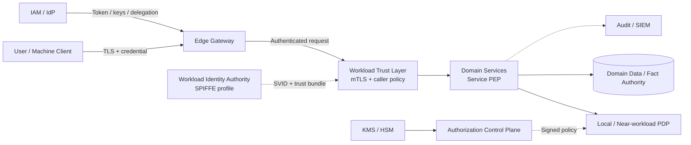
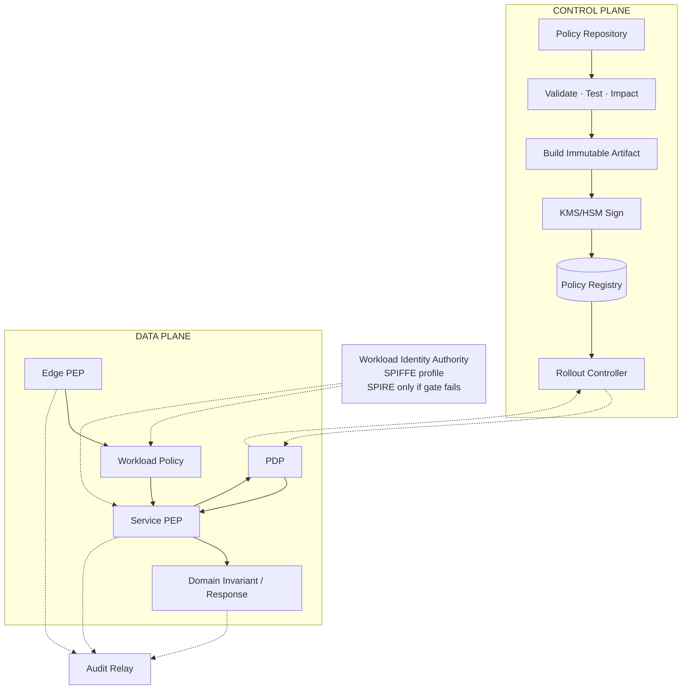
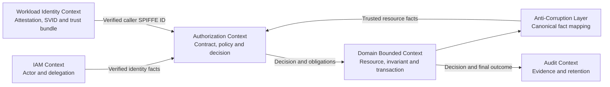
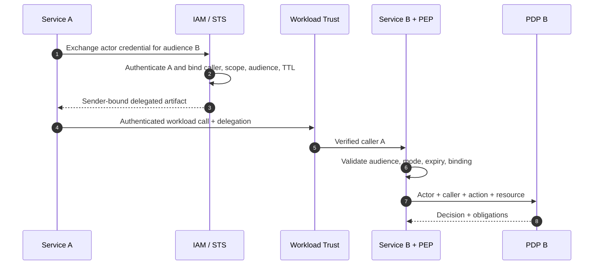
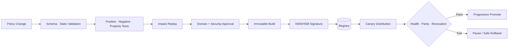
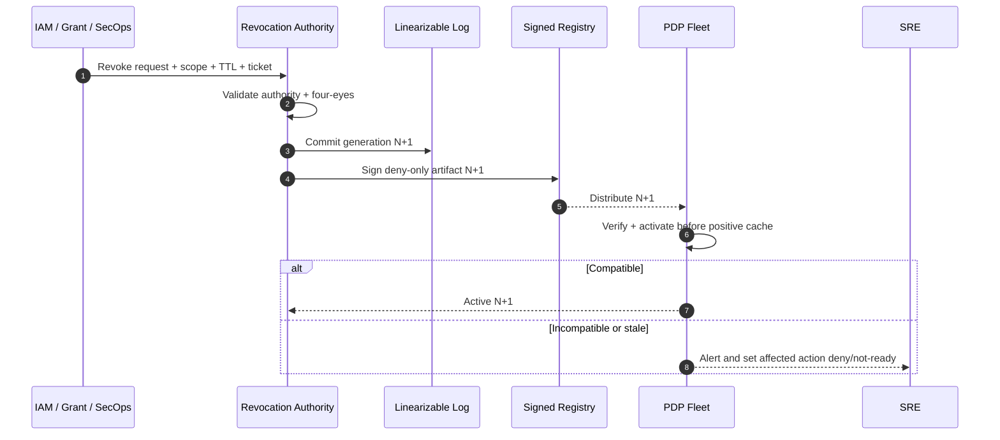
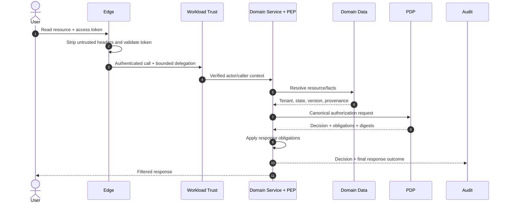
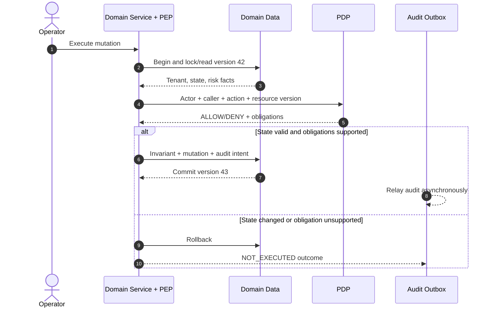
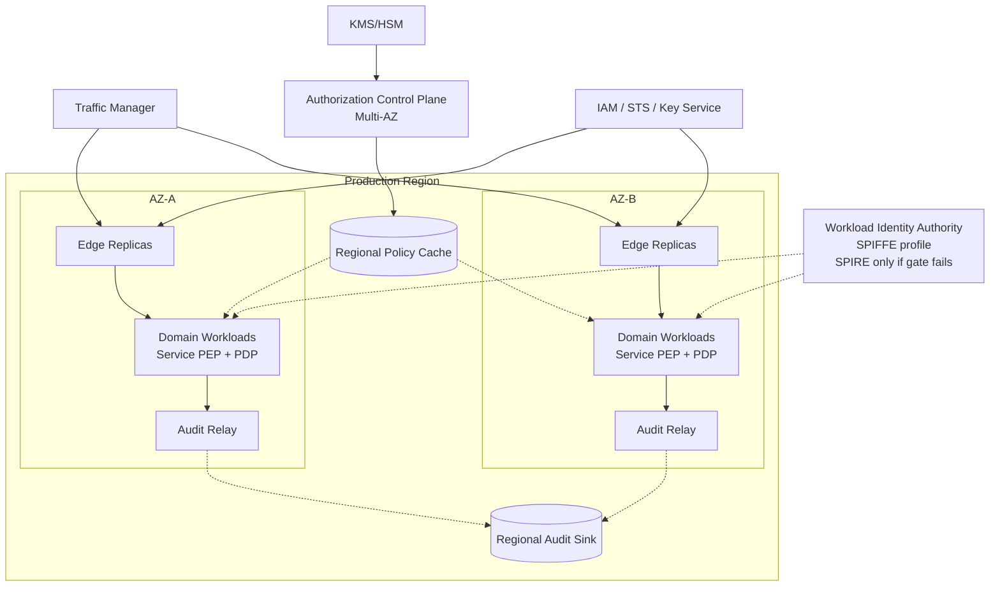
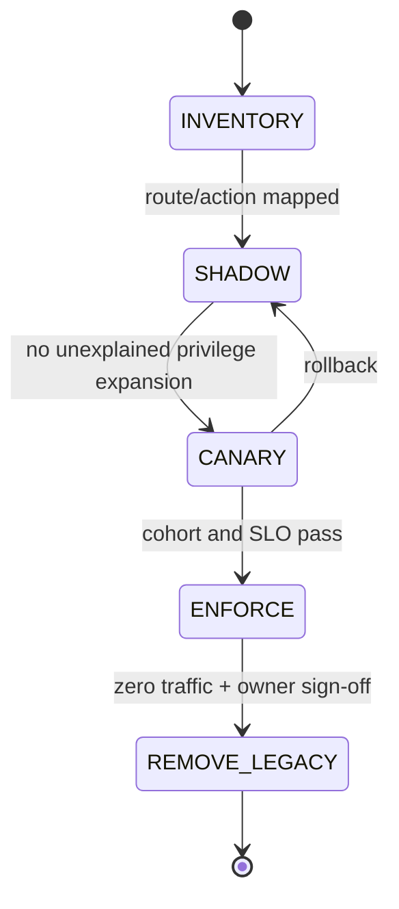

> **TÀI LIỆU NỘI BỘ** — Tài liệu thiết kế kiến trúc L2 phục vụ thẩm định. Tài liệu mô tả capability, boundary, interface, data flow, control và quality gate; không quy định ngôn ngữ hoặc thư viện ứng dụng.

# L2 - AP-AUTHZ - Edge Gateway & Authorization Platform

| **Trường** | **Nội dung** |
| --- | --- |
| **Trạng thái** | **ĐANG THẨM ĐỊNH (UNDER REVIEW)** |
| **Phiên bản & Lịch sử thay đổi** | `v1.7` — 31/08/2026 — Chốt Architecture Decision Authority, baseline ADR và chuẩn hóa trạng thái theo owner/evidence/gate |
| **Chủ sở hữu tài liệu** | Security Platform + Application Platform |
| **Chủ sở hữu hệ thống** | Security Platform (Authorization) · Application Platform (Edge) · Platform/SRE (Workload Trust) |
| **Hệ thống** | `ap-authz` — Edge Gateway & Authorization Platform |
| **Hệ thống liên quan** | IAM/IdP, workload platform, KMS/HSM, Audit/SIEM, `agent-api`, `market-api`, `core-broker-api` và domain services |
| **Nhóm chịu trách nhiệm** | Product/Business · Solution Architecture · Integration Architecture · Security Architecture · IAM · Platform/SRE · Privacy/Legal · Domain Owners |
| **Cơ chế rà soát/phê duyệt** | Lead Architect/Tech Lead là Architecture Decision Authority, phê duyệt L2 và ADR; Business, Security/Legal, SRE và Domain Owner phê duyệt control thuộc accountability của họ |
| **Mốc thiết kế** | Baseline L2 do Lead Architect/Tech Lead quyết định và làm đầu vào thiết kế L3/PoC |
| **Tài liệu L1** | Chưa có tham chiếu được cung cấp; không chặn L2, phải bổ sung khi L1 được ban hành |
| **Tài liệu L3** | Theo L3 Artefact Register của tài liệu này |
| **Tiêu chuẩn tham chiếu** | NIST SP 800-207, OAuth Security BCP, Token Exchange, workload identity và tiêu chuẩn nội bộ tương ứng |
| **Lần rà soát gần nhất** | 31/08/2026 |

## Executive Summary & Decision Request

Nhiều BFF hiện tự thực hiện authentication, ánh xạ role/scope, tenant check và audit. Một policy vì vậy có nhiều bản sao, thay đổi không đồng bộ và khó chứng minh request đã được kiểm soát xuyên suốt.

Kiến trúc đề xuất tách trách nhiệm:

- Edge Gateway xác thực external request và áp dụng coarse policy.
- Workload trust layer xác thực caller giữa các service.
- Service PEP resolve resource/fact từ authority của domain và thi hành decision.
- PDP đánh giá policy gần workload; control plane không nằm trên request hot path.
- Domain giữ business invariant, transaction và response authorization.
- Policy được review, test, ký và phân phối dưới dạng immutable artifact.
- Audit nối evaluation với enforcement outcome cuối cùng.

### Quyết định đề nghị phê duyệt

| **ID** | **Quyết định** | **Kết quả đề nghị** |
| --- | --- | --- |
| DR-01 | Boundary Edge → workload trust → service PEP/PDP → domain | Phê duyệt làm target architecture L2 |
| DR-02 | Versioned authorization contract, signed policy artifact và mandatory PEP coverage | Phê duyệt làm guardrail |
| DR-03 | PoC policy engine và local/near-workload PDP topology | Phê duyệt phạm vi/tiêu chí PoC; chưa phê duyệt sản phẩm production |
| DR-04 | Migration theo action bằng shadow → canary → enforce | Phê duyệt phương pháp chuyển đổi |
| DR-05 | DDD bounded-context ownership, SPIFFE workload identity contract và SRE action-level governance | Phê duyệt làm baseline; **không đưa SPIRE vào baseline deployment hiện tại**, chỉ kích hoạt theo adoption gate mục 9.1.1 |

### Chưa đề nghị phê duyệt production

- Policy engine và PDP topology cuối cùng.
- SPIRE deployment/federation topology; không thuộc baseline hiện tại và chỉ mở khi workload-identity conformance chứng minh cần thiết.
- Security floor; đây chỉ là candidate emergency-revocation mechanism cần PoC.
- Audit durability mode, degraded window và quota của từng action.
- Numeric production baseline cho workload, SLO, capacity, RTO/RPO, multi-region và cost.

### Critical blockers

| **Risk** | **Nội dung chặn** | **Điều kiện đóng** |
| --- | --- | --- |
| AR-001/AR-013 — Identity & Delegation | Workload authority/conformance và IAM sender binding chưa được chứng minh | Workload Identity + Delegation Profile và negative E2E |
| AR-002 — PEP bypass | Route/handler/consumer có thể thiếu enforcement | Full coverage inventory + default-deny conformance |
| AR-003/AR-004 — Revocation & signing | Cache/LKG/rollback và signer recovery chưa được chứng minh | Revocation PoC/ADR + compromised-key drill |
| AR-008 — Audit availability | Durable audit có thể gây outage/availability attack | Action-level business approval + quota/full-spool test |

## Review Responsibility Matrix

| **Nhóm chịu trách nhiệm** | **Phạm vi thẩm định** | **Cổng xác nhận** |
| --- | --- | --- |
| Lead Architect/Tech Lead | Boundary, component, topology, integration, ADR, migration và exception kiến trúc | Architecture Decision Authority; L2/ADR approval |
| Security Architecture/ANBM | Identity, authorization, tenant, failure mode, supply chain, break-glass | Security approval |
| IAM | Issuer/audience, token exchange, delegation, revocation và key rotation | Delegation Profile |
| Platform/SRE | Workload trust, availability, capacity, SLO, deployment, alert và runbook | OAT/production readiness |
| Product/Business | Action classification, audit durability và availability trade-off | Action enablement |
| Privacy/Legal/SecOps | Audit field, residency, retention, access và legal hold | Data/production gate |
| Domain Owners | Vocabulary, facts, invariant, response authorization và migration parity | Action acceptance |
| QA/Performance | Contract, security, chaos, load và evidence quality | Quality gate |

## Governance Gates

| **Chuyển trạng thái** | **Điều kiện đầu vào** |
| --- | --- |
| `DRAFT → UNDER REVIEW` | Scope, component, trust boundary, requirement, diagram, ADR, risk và open issue có định danh |
| `UNDER REVIEW → APPROVED` | Lead Architect/Tech Lead chấp thuận L2; workload identity, delegation, PEP coverage, revocation decision, audit action matrix và critical risks đã đóng hoặc có điều kiện phê duyệt rõ |
| `APPROVED → POC BASELINE` | Contract/vocabulary v1, engine shortlist, benchmark plan và pilot action được duyệt |
| `POC BASELINE → IMPLEMENTATION BASELINE` | L3 artefacts, threat model, performance/chaos evidence, migration và runbook hoàn tất |
| `IMPLEMENTATION BASELINE → PRODUCTION` | Action-level checklist đạt và Security, Domain, SRE, Product/Business ký duyệt |

## L3 Artefact Register

| **Tài liệu L3** | **Trạng thái** | **Chủ sở hữu** | **Phạm vi/nguồn thẩm định** | **Evidence và cổng xác nhận** |
| --- | --- | --- | --- | --- |
| IAM & Delegation Profile v1 | `CHỜ ĐẦU VÀO` | IAM + Security | Mục 6.4, 9.1 | Trước PoC service-to-service |
| Authorization Contract & Vocabulary v1 | `CHƯA KHỞI TẠO` | Authorization + Domains | Mục 3, 6 | Trước PEP/PDP integration |
| Policy Lifecycle, Test & Signing Standard | `CHƯA KHỞI TẠO` | Security Platform | Mục 7 | Trước publish artifact |
| PDP Engine & Topology Benchmark | `CẦN PoC` | Authorization + SRE | Mục 5, 11, 12 | Trước production selection |
| PEP Coverage & Conformance Specification | `CHƯA KHỞI TẠO` | Authorization + Domains | Mục 2.4, 6.3, 15 | Trước enforce |
| Emergency Revocation PoC & ADR | `CẦN PoC` | IAM + Security + SRE | Mục 7.5, 12.3, 16 | Trước high-risk action |
| SPIFFE Trust Domain, Workload Identity & Flow Profile | `CHỜ ĐẦU VÀO` | Platform/SRE + Security | Mục 9.1, 10.4 | Trước strict enforcement |
| Decision Audit & Retention Contract | `CHỜ PHÊ DUYỆT NGOÀI KIẾN TRÚC` | SecOps + Privacy | Mục 8.3, 9.4, 13 | Trước dữ liệu thật |
| Action-level Audit Durability Matrix | `CHỜ PHÊ DUYỆT NGOÀI KIẾN TRÚC` | Product + Security/Legal + SRE | Mục 12.4 | Trước enforce từng action |
| SRE Service Level, Error Budget & Capacity Matrix | `CHỜ ĐẦU VÀO` | SRE + Product + System Owners | Mục 4, 11–14 | Trước OAT |
| BFF Migration Matrix & Rollback Plan | `CHỜ ĐẦU VÀO` | Platform + Domains | Mục 10.5 | Trước cutover |
| Dashboard, Alert, On-call & DR Pack | `CHƯA KHỞI TẠO` | SRE + System Owners | Mục 13, 14 | Trước production |

## Quy ước trạng thái thiết kế

| **Nhãn** | **Ý nghĩa** |
| --- | --- |
| `BASELINED` | Đã được phê duyệt làm baseline |
| `ĐỀ XUẤT` | Có phương án cụ thể, đang chờ phê duyệt |
| `CẦN PoC` | Chỉ được quyết định sau evidence định lượng |
| `BÊN NGOÀI` | Phụ thuộc authority/hệ thống ngoài phạm vi |
| `CHỜ ĐẦU VÀO` | Kiến trúc đã xác định câu hỏi, owner và gate nhưng còn thiếu inventory/số liệu từ hệ thống phụ thuộc |
| `CHỜ PHÊ DUYỆT NGOÀI KIẾN TRÚC` | Cần Business, Security/Legal, Privacy hoặc SRE nhận accountability/risk; Architect không phê duyệt thay |
| `CHƯA KHỞI TẠO` | Deliverable L3 đã có scope/owner/gate nhưng chưa bắt đầu |
| `BẮT BUỘC` | Invariant/control phải đạt trước production |

# 1. Business Objectives & Scope

## 1.1 Business Context & Objectives

### Current Business Problem

Các BFF như `agent-api`, `market-api` và `core-broker-api` đang có xu hướng tự parse token, ánh xạ role/scope, kiểm tra tenant và ghi audit. Cách tổ chức này tạo ra:

- policy bị sao chép và drift giữa domain/channel;
- semantic của role, scope, action và tenant không thống nhất;
- không có inventory chứng minh mọi route/consumer đều được bảo vệ;
- BFF thuần proxy tạo thêm hop nhưng không tạo business value;
- domain có thể tin identity header không có provenance;
- khó nối Edge decision với business side effect/response cuối cùng;
- rollout/revoke/rollback không có một control model chung.

### Business Objectives

- Chuẩn hóa mô hình `Actor + Caller + Action + Resource + Context → Decision`.
- Centralize policy lifecycle nhưng distribute evaluation/enforcement gần workload.
- Giữ resource truth, business invariant và response authorization tại domain.
- Mọi execution path có mandatory PEP coverage.
- Mọi policy production có owner, review, test, signature, rollout và rollback.
- Mọi decision quan trọng nối được với enforcement outcome.
- Migration theo action, có shadow parity, cohort và rollback.

## 1.2 In Scope

| **Capability** | **Phạm vi** | **Yêu cầu thiết kế** |
| --- | --- | --- |
| External authentication | Token validation, issuer/audience, header/path hygiene | `BẮT BUỘC` |
| Coarse edge authorization | Route/action class, client/scope/tenant presence | `BẮT BUỘC` |
| Workload trust | Mutual authentication và caller allowlist | `BẮT BUỘC` |
| Delegation | User-on-behalf-of, system và deferred grant | `BẮT BUỘC` |
| Authorization contract | Actor/caller/action/resource/context/decision/obligation | `BẮT BUỘC` |
| Policy lifecycle | Review, test, sign, distribute, inventory, rollback | `BẮT BUỘC` |
| Distributed evaluation | Local/near-workload PDP; remote theo use case | `BASELINED` |
| Domain enforcement | Resource fact, invariant, field/row filtering | `BẮT BUỘC` |
| Audit/observability | Evaluation, final outcome, correlation và SLI | `BẮT BUỘC` |
| Migration | Shadow, canary, BFF decomposition và decommission | `BẮT BUỘC` |
| Emergency access/revoke | Break-glass, deny/revoke, TTL, approval, retrospective | `BẮT BUỘC` |

## 1.3 Out of Scope

- Thay IAM/IdP trong một lần.
- Đưa domain database hoặc business invariant vào Edge.
- Xóa BFF còn aggregation/orchestration/channel value.
- Xây entitlement-management workflow/UI đầy đủ trong phase đầu.
- Chọn policy engine cuối cùng trước benchmark.
- Thiết kế active/active multi-region hoàn chỉnh trong L2 này.

## 1.4 Assumptions, Constraints & Dependencies

| **ID** | **Giả định/Ràng buộc** | **Trạng thái** | **Ảnh hưởng** |
| --- | --- | --- | --- |
| A-01 | External route trong scope chỉ expose qua managed Edge | `BẮT BUỘC` | Direct public ingress bị cấm |
| A-02 | IAM có issuer/audience rõ và key rotation | `BÊN NGOÀI` | Thiếu profile chặn AuthN PoC |
| A-03 | Delegation phải exact-audience, caller-bound, short-lived và chống replay | `BẮT BUỘC` | IAM không đáp ứng thì on-behalf-of service flow không được production enable |
| A-04 | Workload platform phải hỗ trợ mutual authentication và SPIFFE-compatible principal ổn định | `BẮT BUỘC` | Không đạt conformance thì kích hoạt SPIRE adoption gate |
| A-05 | Domain là authority của resource state/tenant/relationship | `BẮT BUỘC` | PDP không sao chép mọi domain DB |
| A-06 | Policy evaluation deterministic, không gọi network tùy ý | `BẮT BUỘC` | Dynamic fact do PEP/provider cung cấp |
| A-07 | Remote audit sink không là synchronous dependency của mọi request | `BẮT BUỘC` | Cần local outbox/queue và action mode |
| A-08 | Cross-tenant chỉ qua explicit grant | `BẮT BUỘC` | Không dùng admin role bypass |
| A-09 | Workload clocks được đồng bộ/giám sát | `BẮT BUỘC` | TTL, signature, replay và audit phụ thuộc |
| A-10 | Multi-region, workload và audit volume chưa có baseline đo lường | `CHỜ ĐẦU VÀO` | Product/SRE cung cấp trace và growth forecast trước OAT |

## 1.5 Stakeholders & Personas

| **Nhóm** | **Trách nhiệm/quyền** |
| --- | --- |
| Business/Product Owner | Action criticality, SLO và audit availability trade-off |
| Domain Owner | Vocabulary, fact authority, invariant và acceptance |
| Security Platform | Shared guardrail, PDP/control plane và signing |
| Application Platform | Edge capability, route inventory và migration |
| IAM | User/workload/delegation identity và revocation |
| Platform/SRE | Runtime trust, availability, capacity, on-call và DR |
| SecOps/Privacy/Legal | Audit, retention, access, incident và legal constraints |
| Lead Architect/Tech Lead | Boundary, ADR, trade-off, exception và architecture gate approval |

## 1.6 Personal/Security Data Processing Summary

| **Dữ liệu** | **Mục đích** | **Nơi xử lý** | **Kiểm soát bắt buộc** |
| --- | --- | --- | --- |
| Actor identifier | Authorization/audit correlation | Edge, PEP/PDP, audit | Tokenize/hash theo policy; không metric label |
| Tenant/resource identifier | Isolation và resource policy | Domain PEP/PDP | Source server-side; minimize |
| Credential metadata | Issuer/audience/assurance/freshness | Edge/PEP | Không log raw token |
| Policy facts | Contextual decision | PEP/PDP | Provenance, freshness, allowlist |
| Decision/outcome | Security evidence | Local relay, SIEM/DWH | Encryption, integrity, retention/access control |

## 1.7 System Criticality

Authorization nằm trên request path của nhiều domain. Lỗi có thể gây privilege escalation, data breach hoặc outage diện rộng. Production baseline phải có named on-call, multi-AZ, measured SLO, emergency revoke, safe rollback và action-level failure semantics.

# 2. Architecture Overview & Principles

## 2.1 Nguyên tắc thiết kế

| **Mã kiểm soát** | **Nguyên tắc** |
| --- | --- |
| ARCH-01 | Never trust, always verify tại từng trust boundary |
| ARCH-02 | Token hợp lệ không đồng nghĩa có quyền trên resource |
| ARCH-03 | Centralize policy management; distribute evaluation/enforcement |
| ARCH-04 | Edge mỏng; không đọc domain DB hoặc chứa business invariant |
| ARCH-05 | Actor và caller là hai principal độc lập |
| ARCH-06 | Unknown identity, action, schema, fact provenance hoặc obligation → deny |
| ARCH-07 | Domain sở hữu resource truth, invariant, transaction và response |
| ARCH-08 | Policy artifact immutable, versioned, signed và inventory được |
| ARCH-09 | Mọi route/handler/consumer/job có default-deny coverage |
| ARCH-10 | Approved emergency revoke override positive cache/LKG/rollback |
| ARCH-11 | Fail-open chỉ cho public/low-risk exception có owner/expiry |
| ARCH-12 | Migration `DENY→ALLOW` là privilege expansion và chặn rollout |
| ARCH-13 | Authorization Platform là một bounded context; không sở hữu business invariant hoặc domain data model |
| ARCH-14 | Workload principal dùng SPIFFE-compatible identity; không suy luận identity từ IP, namespace hoặc header |
| ARCH-15 | Reliability được quản trị bằng user-facing SLO và error budget theo action class |

## 2.2 Sơ đồ kiến trúc ứng dụng

### 2.2.1 Sơ đồ ngữ cảnh hệ thống

### 2.2.2 Sơ đồ thành phần

### 2.2.3 Phân định trách nhiệm component

| **Component** | **Trách nhiệm** | **Dữ liệu quản lý** | **Giao tiếp ngoài component** |
| --- | --- | --- | --- |
| Edge Gateway | External AuthN, hygiene, traffic control, route/coarse PEP | Route/action registry, trusted request context | IAM, workload trust, audit |
| Workload Identity Authority | Node/workload attestation, SVID issuance/rotation, trust-bundle lifecycle | Registration entry, SPIFFE ID, SVID/bundle status | Nodes/agents, workloads, peer trust domains |
| Workload Trust | Mutual authentication, caller/destination policy | Workload principal/trust bundle | Edge, domain workloads |
| Service PEP | Resolve facts, build canonical request, enforce decision/obligation | Request-scoped verified context | Domain data, PDP, audit |
| PDP | Deterministic policy evaluation | Active policy/revocation state | Service/Edge PEP, rollout status |
| Authorization Control Plane | Policy lifecycle, signing, distribution, inventory | Policy metadata/digest/status | Repository, KMS, registry, PDP fleet |
| Domain Service | Resource truth, invariant, transaction, response | Domain data | PEP, domain dependencies |
| Audit Platform | Durable delivery, retention, access, reconciliation | Decision/outcome evidence | PEP, SIEM/DWH |

### 2.2.4 Ranh giới tin cậy

| **Ranh giới** | **Mức tin cậy đầu vào** | **Kiểm soát bắt buộc** | **Tiêu chí phê duyệt** |
| --- | --- | --- | --- |
| Internet → Edge | Không tin cậy | TLS, credential validation, header/path hygiene, rate limit | Negative external E2E |
| Identity authority → Workload | Chỉ tin sau attestation và bundle verification | Short-lived SVID, key isolation, bundle rotation, issuer pin | Spoof/expiry/rotation/compromise tests |
| Edge → Workload | Chỉ tin sau workload authentication | Mutual authentication, caller allowlist, bounded delegation | Wrong-caller/plaintext tests |
| Service → PDP | Chỉ trusted local/authenticated channel | Input limits, schema/capability version, deadline | Contract/timeout tests |
| PEP → Fact authority | Fact chỉ tin theo registered source | Provenance, freshness, least data | Stale/forged fact tests |
| Policy supply chain | Admin input có thể sai/compromised | Review, SoD, test, signature, immutable artifact | Provenance/corrupt bundle |
| Audit boundary | Dữ liệu nhạy cảm | Minimize, encrypt, integrity, access, retention | Privacy/outage/reconcile evidence |

## 2.3 Mô hình quyết định authorization

`Actor + Caller + Action + Resource + Context → Decision + Obligations`

| **Thành phần** | **Ý nghĩa** | **Authority** |
| --- | --- | --- |
| Actor | User, service hoặc job chịu ngữ nghĩa của action | IAM/verified credential |
| Caller | Workload trực tiếp thực hiện hop | Workload trust layer |
| Action | Động từ nghiệp vụ canonical có version | Domain + API Governance |
| Resource | Đối tượng, tenant và version | Domain service/data |
| Context/Facts | Assurance, time, risk, relationship có provenance | Approved authority |
| Decision | `ALLOW`, `DENY`, `INDETERMINATE` | PDP |
| Obligations | Mask, row limit, step-up hoặc constraint | PDP định nghĩa; PEP thi hành |

## 2.4 PEP coverage và chống bypass

| **Execution path** | **Enforcement point** | **Coverage evidence** |
| --- | --- | --- |
| External HTTP/gRPC | Edge route PEP | Route registry default deny và inventory diff |
| Domain handler | Service PEP | Handler/action registry và conformance test |
| East-west call | Workload policy | Principal/destination/port flow inventory |
| Async consumer | Consumer PEP | Schema/provenance/action registry |
| Scheduled/admin job | Job identity + action registry | Dedicated principal/scope/audit |
| Response/field access | Response authorization layer | Obligation capability và leak E2E |

Network policy không chứng minh service PEP đã thực thi. Production cần cả network coverage và application-path coverage, nhưng L2 không quy định framework thực hiện.

## 2.5 Domain-Driven Design Boundary Model

DDD được áp dụng để giữ đúng quyền sở hữu dữ liệu và ngăn Authorization Platform trở thành “domain service dùng chung”. Tài liệu chỉ dùng các pattern DDD cần cho bài toán này: **Bounded Context**, **Context Map**, **Anti-Corruption Layer** và **Aggregate invariant**.

| **Bounded Context** | **Sở hữu** | **Không sở hữu** | **Hợp đồng tích hợp** |
| --- | --- | --- | --- |
| IAM | Actor credential, delegation, entitlement lifecycle | Workload SVID, resource state và business invariant | Verified actor/delegation facts |
| Workload Identity | Node/workload attestation, SPIFFE ID, SVID và trust bundle lifecycle | Actor entitlement, business action và resource state | Verified caller identity |
| Authorization | Canonical request/decision contract, action vocabulary governance, policy lifecycle, shared guardrail | Domain record, transaction và business response | Versioned authorization contract |
| Domain (`Agent`, `Market`, `Broker`, ...) | Resource truth, action semantics, tenant relationship, aggregate invariant, transaction và response | Cơ chế ký/phân phối shared policy | Anti-Corruption Layer ánh xạ domain fact sang canonical contract |
| Audit/SecOps | Evidence schema, retention, access, reconciliation | Business decision hoặc authorization policy | Decision/outcome audit contract |

Quy tắc thiết kế cho team domain:

- Mỗi action canonical phải có một Domain Owner định nghĩa ý nghĩa, resource type, fact authority và invariant.
- Anti-Corruption Layer chỉ ánh xạ fact đã xác minh; không sao chép toàn bộ domain model vào policy input.
- PDP quyết định theo policy; aggregate vẫn kiểm tra invariant trong transaction trước commit. `ALLOW` không phải lệnh bắt buộc domain thực hiện mutation.
- Domain event đã commit chỉ mang sự kiện; deferred command có side effect phải authorize lại hoặc dùng explicit grant còn hiệu lực.
- Thay đổi action/resource semantics là thay đổi contract có version, compatibility test và migration plan.

# 3. Functional Requirements

## 3.1 Ma trận năng lực chức năng

| **FR ID** | **Năng lực** | **Yêu cầu** | **Tiêu chí nghiệm thu** |
| --- | --- | --- | --- |
| FR-01 | External AuthN | Validate issuer, audience, expiry, algorithm và key | Wrong issuer/audience/key đều bị từ chối |
| FR-02 | Header/context hygiene | Strip identity/delegation header không tin cậy | External spoofing E2E thất bại |
| FR-03 | Workload trust | SPIFFE-compatible caller identity, short-lived SVID và destination policy | Spoof/plaintext/wrong caller/expired SVID bị deny; rotation không gián đoạn |
| FR-04 | Delegation | Actor/caller/audience/scope/TTL có provenance | Replay/wrong audience/caller tests |
| FR-05 | Canonical contract | Request/decision/obligation có version | Schema/compatibility tests |
| FR-06 | Resource authorization | Facts lấy server-side và có source/version | IDOR/cross-tenant negative tests |
| FR-07 | Tenant isolation | Same-tenant mặc định; cross-tenant qua explicit grant | Property tests không có implicit bypass |
| FR-08 | Mandatory PEP | Mọi execution path registered/default deny | 100% coverage report |
| FR-09 | Obligation | Unknown/conflicting/failed obligation deny | Field/row leak E2E |
| FR-10 | Policy lifecycle | Review/test/sign/distribute/rollback/inventory | Signed provenance và corrupt artifact test |
| FR-11 | Cache/freshness | Cache key đầy đủ; high-risk mutation không cache ALLOW mặc định | Collision/stale property tests |
| FR-12 | Emergency revoke | Không bị cache/LKG/rollback khôi phục | End-to-end revoke drill |
| FR-13 | Audit correlation | Evaluation nối final enforcement outcome | Reconciliation evidence |
| FR-14 | Migration | Shadow/canary/rollback theo action | Không có unexplained privilege expansion |
| FR-15 | Break-glass | MFA, four-eyes, scope, TTL, alert, retrospective | Exercise và audit report |
| FR-16 | Bounded-context ownership | Action/fact/invariant có Domain Owner; mapping qua Anti-Corruption Layer | Context map + ownership/contract conformance |

## 3.2 Quy tắc authorization

| **Mã quy tắc** | **Quy tắc** |
| --- | --- |
| AZR-01 | Explicit deny thắng allow; thiếu dữ liệu security-relevant → deny |
| AZR-02 | Actor hợp lệ không bù cho caller không hợp lệ và ngược lại |
| AZR-03 | Client-supplied tenant/resource fact chỉ là hint, không là authority |
| AZR-04 | Cross-tenant cần grant bound vào action/resource/caller và expiry |
| AZR-05 | Domain invariant được re-check trong transaction để hạn chế TOCTOU |
| AZR-06 | Unknown obligation không được bỏ qua |
| AZR-07 | Public/fail-open action có registry, owner, data class và expiry |
| AZR-08 | Business event đã commit không tái sử dụng như user authorization |
| AZR-09 | Deferred command phải authorize lại hoặc dùng approved grant |
| AZR-10 | Client response không tiết lộ resource existence khi concealment yêu cầu |

# 4. Non-Functional Requirements

Các target dưới đây là đề xuất cần workload model, PoC và owner phê duyệt.

| **Hạng mục** | **Chỉ số đo lường** | **Target đề xuất** | **Ghi chú/cổng** |
| --- | --- | --- | --- |
| End-to-end availability | Successful authorized action / valid attempt | C0 ≥ 99.99%; C1 ≥ 99.95%; C2 ≥ 99.9% | `BASELINED` L2; action inventory phải phân loại trước OAT |
| Edge availability | Monthly availability | ≥ 99.99% critical path | PoC/OAT |
| Local evaluation | P95/P99 | ≤ 5 ms / ≤ 10 ms khi policy/fact local | Benchmark policy thật |
| Edge overhead | P95 | ≤ 15 ms | Không gồm domain processing |
| Remote evaluation nếu dùng | P95 | ≤ 30 ms nội vùng | Explicit timeout/bulkhead |
| Policy propagation | P95 | ≤ 2 phút standard | 100% verify/atomic activation |
| Emergency revoke | Authority commit → healthy PEP enforce | ≤ 30 giây candidate target | Business/PoC approval |
| Audit delivery | Collector receive | ≥ 99.99% trong 5 phút | Loss behavior theo action |
| Capacity | Approved peak | ≥ 2× peak; one-AZ loss giữ SLO | Load/soak |
| Compatibility | Contract/runtime/policy | Rolling N/N-1 | Matrix bắt buộc |
| Recoverability | Control metadata | RPO ≤ 15 phút; RTO ≤ 60 phút | DR drill |
| Data isolation | Cross-tenant allow | 0 ngoài approved grant | `BẮT BUỘC` |

Action class baseline:

| **Class** | **Loại action** | **Availability target** | **Failure posture** |
| --- | --- | ---: | --- |
| C0 | Privileged/cross-tenant/financial hoặc critical mutation | ≥ 99.99% | Fail-close; durable audit theo approved action matrix |
| C1 | Authenticated business read và standard mutation | ≥ 99.95% | Fail-close authorization; audit có bounded degraded mode nếu được phê duyệt |
| C2 | Public/non-sensitive read, health và discovery | ≥ 99.9% | Chỉ fail-open khi có registry, owner, data classification và expiry |

# 5. Technology Stack & Justification

L2 chọn capability và tiêu chí; không khóa ngôn ngữ hoặc thư viện ứng dụng.

| **Lĩnh vực** | **Giải pháp lựa chọn** | **Cơ sở lựa chọn** | **Đánh đổi/trạng thái** |
| --- | --- | --- | --- |
| Edge Gateway | Enterprise managed gateway/Envoy-compatible edge | TLS, routing, policy hook, HA, observability | `CHỜ ĐẦU VÀO` — platform product inventory/ADR |
| Workload identity model | SPIFFE ID + short-lived X.509-SVID + trust bundle | Canonical, attested workload principal độc lập hạ tầng | `BẮT BUỘC` ở mức contract |
| Workload identity authority | Dùng platform issuer hiện có nếu đạt SPIFFE profile | Tránh thêm một identity control plane và vận hành hai authority | **SPIRE không thuộc baseline hiện tại; có adoption gate** |
| Workload policy | Mutual authentication + default-deny caller/destination policy | East-west AuthN và AuthZ độc lập | Mesh/Istio là carrier tùy chọn, không là baseline bắt buộc |
| Policy decision engine | Candidate OPA/Cedar hoặc tương đương | Deterministic evaluation, test, bundle/status support | `CẦN PoC` |
| PDP topology | Local sidecar, node-local, embedded hoặc remote-regional | Trade-off latency, isolation, cost, operations | `CẦN PoC` |
| Policy repository/pipeline | Version control + protected review + immutable build | Traceability và separation of duties | `BẮT BUỘC` |
| Signing | KMS/HSM-backed signer | Artifact integrity và key governance | `BẮT BUỘC` |
| Distribution | Immutable object/OCI-compatible registry + regional cache | Digest addressing và horizontal scale | `BASELINED` |
| Audit mutation | Transactional outbox hoặc equivalent atomic intent | Tránh business commit mất audit intent | Theo action mode |
| Audit delivery | Local durable relay + collector + SIEM/DWH | Remote sink ngoài hot path | `BẮT BUỘC` |
| Observability | OpenTelemetry-compatible telemetry | Cross-component correlation | `BASELINED` |

## 5.1 ADR Log

| **ADR ID** | **Tiêu đề quyết định** | **Trạng thái** | **Ngày quyết định** | **Link chi tiết** |
| --- | --- | --- | --- | --- |
| ADR-001 | Edge mỏng; domain giữ invariant/resource truth | `BASELINED` | 31/08/2026 | Mục 2.1–2.5 |
| ADR-002 | Hybrid platform guardrail + domain authorization | `BASELINED` | 31/08/2026 | Mục 2.2–2.4 |
| ADR-003 | Distributed PDP cho synchronous hot path | `CẦN PoC` | — | PDP Engine & Topology Benchmark |
| ADR-004 | Signed immutable policy artifact | `BASELINED` | 31/08/2026 | Mục 7.2 |
| ADR-005 | SPIFFE-compatible workload identity + default-deny caller policy; SPIRE conditional | `BASELINED` | 31/08/2026 | Mục 9.1.1 |
| ADR-006 | Versioned authorization contract/vocabulary | `BASELINED` | 31/08/2026 | Mục 6.2–6.7 |
| ADR-007 | Audience/caller-bound delegation | `BÊN NGOÀI` | — | IAM & Delegation Profile |
| ADR-008 | Audit durability/failure mode theo action | `CHỜ PHÊ DUYỆT NGOÀI KIẾN TRÚC` | — | Action-level Audit Durability Matrix |
| ADR-009 | Candidate security floor tách base policy | `CẦN PoC — CHƯA DUYỆT PRODUCTION` | — | Revocation PoC |
| ADR-010 | Explicit grant cho cross-tenant/deferred authority | `BASELINED` | 31/08/2026 | Mục 6.5 |
| ADR-011 | DDD bounded-context ownership và Anti-Corruption Layer | `BASELINED` | 31/08/2026 | Mục 2.5 |
| ADR-012 | SLO/error-budget gate theo action class | `BASELINED` | 31/08/2026 | Mục 4, 13.6 |

## 5.2 Trade-off Analysis

| **ADR ID** | **Vấn đề cần quyết định** | **Phương án A** | **Phương án B** | **Baseline/tiêu chí chọn** |
| --- | --- | --- | --- | --- |
| ADR-001 | Nơi đặt business authorization | Gateway tập trung: dễ thấy nhưng cần domain data/blast radius lớn | Domain PEP: gần truth/transaction nhưng cần coverage | Chọn domain PEP; Edge chỉ coarse |
| ADR-003 | PDP placement | Local: latency thấp, fleet complexity cao | Remote: vận hành tập trung, network dependency | Benchmark theo policy/input/failure thật |
| ADR-005 | Workload identity authority | SPIRE quản lý attestation/SVID/bundle | Platform issuer hiện có đáp ứng SPIFFE profile | Chọn theo conformance; không chạy hai authority song song cho cùng workload |
| ADR-008 | Audit failure | Fail-close bảo vệ evidence nhưng giảm availability | Continue bảo vệ availability nhưng có compliance gap | Product/Security/SRE quyết định theo action |
| ADR-009 | Emergency revoke | Security floor có strong ordering/extra subsystem | Introspection/invalidation/emergency bundle đơn giản hơn nhưng trade-off latency | PoC trước khi chọn |
| ADR-010 | Cross-tenant | Broad admin role đơn giản nhưng blast radius lớn | Explicit grant phức tạp hơn nhưng auditable | Chọn explicit grant |

## 5.3 Framework/Pattern Applicability

Chỉ các framework/pattern có vai trò trực tiếp sau được đưa vào baseline thiết kế:

| **Framework/pattern** | **Áp dụng cụ thể** | **Không áp đặt** |
| --- | --- | --- |
| SPIFFE | Định danh workload, trust domain, SVID, trust bundle và federation contract | Không bắt buộc một service mesh hoặc một runtime cụ thể |
| SPIRE | Production implementation khi platform hiện tại không chứng minh được node/workload attestation, short-lived SVID rotation hoặc federation | Không dựng SPIRE chỉ để “đúng framework”; không chạy song song hai issuer cho cùng identity scope |
| Domain-Driven Design | Bounded Context, Context Map, Anti-Corruption Layer và aggregate invariant như mục 2.5 | Không đưa toàn bộ domain model vào central policy; không quy định cách tổ chức mã nguồn |
| SRE | User-facing SLI/SLO, error budget, burn-rate alert, readiness và game day như mục 13.6–14 | Không biến component metric thành cam kết business; không quy định sản phẩm monitoring |

Ngôn ngữ lập trình, application framework, SDK và cấu trúc mã nguồn nằm ngoài quyết định L2.

# 6. Integration Architecture

## 6.1 Danh mục giao diện tích hợp

| **ID** | **Mô tả** | **Contract** | **Nguồn** | **Đích** | **Giao thức/chế độ** | **Dữ liệu chính** |
| --- | --- | --- | --- | --- | --- | --- |
| INT-01 | External identity validation | IAM Profile | Edge | IAM/IdP | HTTPS/cache | Token metadata, keys |
| INT-02 | Delegated service call | Delegation Profile | Caller | IAM/STS, callee | HTTPS + workload-authenticated | Actor, caller, audience, scope, TTL |
| INT-03 | Edge coarse decision | Authorization Contract subset | Edge PEP | PDP | Local/authenticated synchronous | Route, client, action class |
| INT-04 | Resource-level decision | Authorization Contract v1 | Service PEP | PDP | Local/near synchronous | Actor, caller, action, resource, facts |
| INT-05 | Policy distribution | Bundle Manifest | Control plane | PDP fleet | Async pull/push | Signed immutable artifact |
| INT-06 | PDP fleet status | Status Contract | PDP | Rollout controller | Async | Active/desired digest, capabilities, age |
| INT-07 | Fact lookup | Fact Provider Contract | Service PEP | Domain/provider | Synchronous bounded | Value, source, version, freshness |
| INT-08 | Decision/outcome audit | Audit Contract | PEP/domain | Local relay/SIEM | Async; durability by action | Evaluation, obligation, final outcome |
| INT-09 | Emergency revoke | Revocation Contract | IAM/SecOps | PDP/PEP fleet | Async ordered | Scope, generation/digest, TTL |

## 6.2 Authorization Request Contract

| **Nhóm** | **Field bắt buộc** | **Authority** | **Validation** |
| --- | --- | --- | --- |
| Envelope | Schema version, transaction ID, request time | Trusted PEP boundary | Version/format/size/deadline |
| Actor | Issuer, subject, active tenant, assurance, entitlement version, credential expiry | IAM/verified credential | Issuer/audience/freshness |
| Caller | Workload principal, delegation mode, audience, grant/token ID, expiry | Workload trust + IAM/STS | Caller binding/audience/TTL |
| Action | Canonical action identifier/version | Action Vocabulary | Registered/default deny |
| Resource | Type, ID/token, tenant, version | Domain authority | Server-resolved/provenance |
| Context/Facts | Value, source, observed time, expiry/version | Registered provider | Freshness/type/allowlist |

Contract không mang toàn bộ token, request body hoặc domain record. Chỉ attribute policy thực sự dùng được truyền, với type và provenance.

## 6.3 Authorization Decision & Obligation Contract

| **Field** | **Ý nghĩa** | **PEP behavior** |
| --- | --- | --- |
| Schema version | Phiên bản decision contract | Incompatible → deny/not-ready |
| Decision ID | Một lần evaluation | Correlate với transaction/outcome |
| Decision | `ALLOW`, `DENY`, `INDETERMINATE` | Chỉ `ALLOW` hợp lệ mới tiếp tục |
| Reason identifier | Mã lý do có semantic thống nhất | Map sang client response an toàn |
| Policy digest | Chính xác policy revision | Audit/reproduce/rollout |
| Revocation digest/generation | Approved revocation state | Cache/rollback guard |
| Obligations | Mask, row limit, step-up, constraint | Unknown/conflict/failure → deny |
| Evaluation metadata | Latency, cache/freshness markers | Telemetry; không lộ policy internals |

Client không nhận raw policy trace hoặc sensitive explain data.

## 6.4 Delegation Profile

### 6.4.1 Actor và Caller

Actor là principal chịu ngữ nghĩa của action; Caller là workload trực tiếp thực hiện hop. Policy phải kiểm tra cả hai.

| **Mode** | **Khi dùng** | **Decision rule** |
| --- | --- | --- |
| `on_behalf_of` | Service làm thay user | Actor và caller đều được phép; audience đúng callee |
| `system` | Scheduler/controller thực hiện nhiệm vụ hệ thống | Dedicated principal/purpose; không gắn user giả |
| `approved_deferred_grant` | Command trì hoãn dùng approval đã lưu | Grant action/resource-bound, có expiry/revoke |

### 6.4.2 Sequence delegation

Unsigned identity/role header không thay thế delegated artifact.

## 6.5 Tenant & Explicit Grant Contract

Mặc định `actor.active_tenant_id == resource.tenant_id`. Resource tenant lấy từ domain authority.

Explicit grant tối thiểu có:

| **Field** | **Yêu cầu** |
| --- | --- |
| Identity | Grant ID, issuer/authority, version |
| Subject/caller | Actor và workload constraints |
| Permission | Action, resource type/ID/tenant scope |
| Lifecycle | Issued at, expiry, revocation version |
| Governance | Reason, ticket, approver, evidence |

Broad admin role không được suy ra quyền cross-tenant.

## 6.6 Error Contract

| **Error class** | **Ý nghĩa** | **Client-facing behavior** |
| --- | --- | --- |
| `AUTHENTICATION_FAILED` | Credential không hợp lệ | `401` hoặc transport equivalent |
| `AUTHORIZATION_DENIED` | Policy deny | `403`/concealed `404` theo action |
| `INPUT_INVALID` | Contract/action/resource không hợp lệ | Controlled `400`; không evaluate |
| `POLICY_UNAVAILABLE` | PDP/policy không thể đánh giá an toàn | `503`; fail-close |
| `REVOCATION_STALE` | Revocation state quá freshness budget | `503`/deny theo action |
| `OBLIGATION_UNSUPPORTED` | PEP không hỗ trợ obligation | Không trả data/side effect |
| `RESOURCE_CONFLICT` | Resource version/state đổi | `409` hoặc domain equivalent |

Không gộp platform unavailable vào policy deny; vận hành cần phân biệt outage và business denial.

## 6.7 Versioning & Compatibility

- Contract có explicit schema version và compatibility matrix.
- PEP/PDP công bố supported versions/capabilities.
- Breaking change dùng dual-read/dual-evaluate hoặc versioned rollout.
- Policy manifest khai báo contract/vocabulary/revocation requirements.
- Incompatible artifact không activate; desired và active digest được quan sát riêng.
- N/N-1 test bắt buộc trước rolling upgrade.

## 6.8 PEP ↔ PDP Channel

- Local channel dùng loopback/isolated socket; node/remote channel cần authenticated transport.
- PDP không tin caller-supplied workload ID.
- Có request size/depth, deadline, concurrency và response-size limit.
- Incompatible capability làm workload not-ready hoặc deny; không silent downgrade.
- Remote PDP chỉ dùng sau ADR với routing, timeout, bulkhead, circuit breaker và error budget riêng.

# 7. Data Architecture & Data Flow

## 7.1 Logical Data Ownership

| **Artefact/Dữ liệu** | **Authority** | **Consumer** | **Version/Freshness** |
| --- | --- | --- | --- |
| Action/resource vocabulary | API Governance + Domain | Edge, PEP, policy/test | Immutable version/digest |
| Platform guardrail | Security Platform | Mọi PDP | Signed policy digest |
| Domain policy | Domain Owner + Security | Domain PDP | Signed digest |
| Resource facts | Domain service/data | Service PEP/PDP | Resource version + observed/expiry |
| Actor entitlement | IAM/entitlement authority | Edge/PEP | Entitlement version + revoke signal |
| Workload identity | Workload trust authority | Edge/PEP/PDP | Short-lived identity + trust bundle |
| Cross-tenant grant | Approved grant authority | PEP/PDP | ID/version/expiry/revoke |
| Decision record | PDP/PEP | Audit/SIEM | Decision ID + policy/revocation digest |
| Enforcement outcome | Final PEP/domain | Audit/SIEM | Transaction ID + applied obligations |

## 7.2 Policy Data Flow

Policy production có owner, digest, provenance và active inventory. High-risk change tách author, approver và signer/promoter.

## 7.3 Attribute Provenance & Freshness

Provider registry khai báo:

- owner và workload identity;
- schema/attributes được phép;
- source of truth;
- freshness/expiry;
- residency/data classification;
- timeout/error semantics.

PEP không cho client override resource tenant/state. Policy engine không tự gọi provider. High-risk state được đọc trong transaction hoặc theo resource version.

## 7.4 Cache Architecture

| **Cache** | **Key/Authority** | **Nguyên tắc** |
| --- | --- | --- |
| JWKS/trust | Issuer, key ID, trust domain | Proactive refresh; unknown key deny |
| Base policy | Immutable digest | Atomic activation; LKG có max age |
| Attribute/entitlement | Subject/resource + source version | TTL theo authority/action |
| Decision | Full canonical input fingerprint + policy/revocation digest | Chỉ deterministic result |

Decision key bao phủ actor, caller/delegation, action, resource ID/tenant/version, mọi relevant fact/source version, credential expiry, policy digest và approved revocation state.

High-risk mutation mặc định không cache `ALLOW`. Không chứng minh được fingerprint đầy đủ thì không dùng decision cache.

## 7.5 Emergency Revocation Architecture

Requirement bắt buộc:

> Authority revoke phải chặn quyền trong objective được duyệt và không bị positive cache, LKG hoặc rollback khôi phục.

Các candidate gồm token introspection/revocation, entitlement-version invalidation, emergency base policy và deny-only security floor.

### 7.5.1 Candidate Security Floor — cần PoC

Security floor chưa được phê duyệt thành production subsystem.

| **Câu hỏi thiết kế** | **Candidate baseline cho PoC** | **Điều kiện phê duyệt** |
| --- | --- | --- |
| Authority phát hành | Một logical Revocation Authority theo environment/trust domain; request từ IAM, grant authority hoặc SecOps; ký bằng KMS/HSM | Four-eyes, immutable admin audit, key recovery |
| Scope | Generation global để ordering đơn giản; deny entry scoped global, tenant, actor, caller, grant/key, action, resource type/ID | Cardinality, PII, expiry, tenant isolation |
| Merge với base policy | Verify floor; match deny trước positive cache/base policy; deny luôn thắng | Property test không mở quyền/bị rollback |
| Multi-region partition | Single logical writer dựa trên linearizable durable log; region khác chỉ đọc | Partition/no split-brain; issuance RTO |
| Floor mới, base chưa tương thích | Deny-only schema độc lập; áp dụng phần hiểu được; affected action incompatible → `INDETERMINATE_REVOCATION_INCOMPATIBLE` và deny/not-ready | N/N-1, out-of-order, recovery |

PoC đo authority commit → 100% healthy PEP enforce, gồm authorization, ordering, signing, distribution, compatibility, activation, cache bypass và clock skew. Nếu không đạt, ADR-009 phải bị loại bỏ hoặc thu hẹp.

## 7.6 Data Privacy & Minimization

| **Dữ liệu** | **Mức nhạy cảm** | **Xử lý được phép** |
| --- | --- | --- |
| Raw credential/token | Secret | Validate; không log/persist ngoài IAM requirement |
| Actor/resource identifiers | Personal/security metadata | Tokenize/hash theo policy; no metric label |
| Tenant/action | Business/security metadata | Audit có access/retention |
| Facts | Theo source classification | Allowlist field; provenance/freshness; minimize |
| Policy explain | Security-sensitive | Redact; chỉ authorized support |
| Decision/outcome | Compliance evidence | Encrypt, integrity, retention/legal hold |

# 8. Luồng nghiệp vụ chi tiết

## 8.1 Bảng tổng hợp luồng

| **STT** | **Actor/System** | **Hành động** | **Thành phần** | **Kết quả** |
| --- | --- | --- | --- | --- |
| 1 | External client | Gửi request + credential | Edge | Trusted context hoặc reject |
| 2 | Edge | Map route/action, coarse decision | Edge PEP/PDP | Continue hoặc deny |
| 3 | Edge/caller | Gọi domain bằng workload identity + delegation | Workload trust | Verified caller |
| 4 | Domain PEP | Resolve resource/facts | Domain authority | Versioned facts |
| 5 | Domain PEP | Gửi canonical authorization request | PDP | Decision + obligations |
| 6 | Domain | Re-check invariant/version | Domain transaction | Commit/not executed |
| 7 | Response layer | Apply obligations | Domain PEP | Filtered response |
| 8 | PEP/domain | Ghi decision/outcome | Audit relay | Correlated evidence |

## 8.2 Sequence Diagrams

### 8.2.1 External Authenticated Read

### 8.2.2 High-risk Mutation

### 8.2.3 Async Event/Command

- Committed event là sự thật lịch sử; consumer xác minh producer/schema/replay nhưng không tái dùng user `ALLOW` cũ.
- Deferred command có side effect tương lai; consumer authorize lại hoặc kiểm tra approved grant.
- Consumer side effect idempotent và commit với inbox/outbox.

## 8.3 Ma trận xử lý lỗi

| **Sự cố** | **Hành vi yêu cầu** | **Phục hồi/Kiểm soát bắt buộc** |
| --- | --- | --- |
| IAM/JWKS stale/unknown key | Không xác thực; dừng | Refresh/alert IAM |
| Policy artifact corrupt/incompatible | Không activate; giữ safe digest | Pause rollout |
| PDP crash/timeout | Fail-close; controlled `503` | Readiness/restart |
| Fact provider unavailable | Cache còn hạn nếu action cho phép; hết hạn dừng | Circuit breaker/owner alert |
| Resource version change | Không mutation | Conflict + `NOT_EXECUTED` |
| Unknown obligation | Không response/side effect | Capability alert |
| Audit capacity full/corrupt | Theo approved action mode | High-water, isolation, incident |
| Revocation stale | Critical/high deny/not-ready | Page convergence breach |
| Signing key compromised | Freeze promotion; revoke trust/key | Security incident/recovery |

# 9. Security & Compliance Architecture

## 9.1 Identity & Authentication

- Pin issuer, audience, token class và algorithm.
- Unknown key/wrong audience bị từ chối.
- Edge strip identity/delegation header từ untrusted boundary.
- Workload identity dùng SPIFFE-compatible principal và không lấy từ caller-supplied field.
- Delegation có caller binding, exact audience, TTL và replay control.
- Raw credential không xuất hiện trong logs/metrics.

### 9.1.1 SPIFFE/SPIRE Workload Identity Model

SPIFFE là identity contract của data plane. SPIRE là một phương án triển khai contract đó, không phải dependency bắt buộc nếu workload platform hiện có vượt qua cùng bộ conformance test.

> **Quyết định L2:** Không triển khai SPIRE trong baseline hiện tại. Ưu tiên workload identity authority sẵn có nếu đạt SPIFFE conformance. Nếu không có authority được phê duyệt hoặc một control bắt buộc không đạt, lựa chọn mặc định là SPIRE; không tự xây issuer riêng.

| **Thành phần** | **Baseline thiết kế** | **Quy tắc kiểm soát** |
| --- | --- | --- |
| Trust domain | Một trust domain cho mỗi environment/security administrative boundary | Không dùng namespace làm trust root; federation chỉ giữa các authority độc lập đã phê duyệt |
| SPIFFE ID | `spiffe://<trust-domain>/<bounded-context>/<workload>` | Đại diện workload logic; không chứa Pod/node/instance ID, actor ID, role hoặc tenant |
| SVID | X.509-SVID ngắn hạn là mặc định cho mTLS | Tự động rotate trước expiry; private key không được phân phối như application secret |
| JWT-SVID | Chỉ dùng khi kênh không thể dùng X.509 mTLS | Exact audience, TTL ngắn, replay risk được threat-model và phê duyệt riêng |
| Attestation | Identity authority xác minh node và workload trước khi cấp SVID | Namespace/service account label chỉ là selector trong attestation, không tự nó là identity |
| Trust bundle | Phân phối và rotate qua workload identity control plane | Unknown/expired issuer hoặc stale bundle ngoài approved overlap → connection fail-close |
| Authorization binding | PEP/PDP dùng SPIFFE ID đã xác minh làm `caller` | Không authorize bằng source IP, DNS name, namespace hoặc header đơn lẻ |
| Actor delegation | Actor credential/delegation tách khỏi workload SVID | SVID chứng minh caller; delegation chứng minh caller được hành động thay actor trong scope/audience/TTL |
| Federation | Chỉ bật cho luồng giữa hai trust domain độc lập có flow inventory | Pin trust domain, destination, action; deny transitive trust mặc định |

SPIRE adoption gate:

| **Control cần chứng minh trên platform hiện tại** | **Đạt** | **Không đạt** |
| --- | --- | --- |
| Stable SPIFFE ID và trust-domain naming | Giữ platform issuer | Kích hoạt SPIRE design |
| Node + workload attestation chống giả mạo identity | Giữ platform issuer | Kích hoạt SPIRE design |
| Short-lived X.509-SVID và rotation không restart workload | Giữ platform issuer | Kích hoạt SPIRE design |
| Trust-bundle rotation, overlap và compromise recovery | Giữ platform issuer | Kích hoạt SPIRE design |
| Multi-AZ availability và measured issuance/rotation SLO | Giữ platform issuer | Kích hoạt SPIRE design |
| Federation chuẩn hóa nếu có nhiều independent trust domains | Giữ platform issuer nếu đáp ứng | Kích hoạt SPIRE federation design |

Platform/SRE phải ghi evidence trong Workload Identity Profile. Chỉ cần **một control bắt buộc không đạt** là mở ADR triển khai SPIRE trong identity scope bị ảnh hưởng. Không cho cùng một workload nhận hai authority production song song; migration chỉ cho trust-bundle overlap có thời hạn, telemetry và rollback rõ.

Ví dụ tên logic phục vụ review contract: `spiffe://prod.vhm/market/order-api` và `spiffe://prod.vhm/platform/edge-gateway`. Tên trust domain thực tế phải theo enterprise naming standard trong L3 profile.

### 9.1.2 Identity-to-Authorization Flow

| **Bước** | **Authority** | **Output đáng tin cậy** | **Failure behavior** |
| --- | --- | --- | --- |
| 1. Attest workload | Workload identity authority | SPIFFE ID + short-lived SVID | Không cấp identity |
| 2. Authenticate hop | mTLS verifier/trust layer | Verified caller SPIFFE ID | Dừng connection |
| 3. Validate actor/delegation | IAM profile + Service PEP | Actor, audience, scope, binding, TTL | Deny request |
| 4. Resolve domain facts | Domain authority | Resource/tenant/version/provenance | Deny hoặc controlled unavailable theo action |
| 5. Evaluate policy | PDP | Decision + obligations + policy digest | Fail-close trừ exception đã phê duyệt |
| 6. Enforce and audit | Service PEP + Domain | Final outcome gắn caller, actor và decision | Theo action-level audit mode |

## 9.2 Authorization & Access Control

### 9.2.1 Role/Action Matrix

| **Principal logic** | **Read standard** | **Mutation** | **Cross-tenant** | **Policy admin** | **Audit access** |
| --- | --- | --- | --- | --- | --- |
| End user/agent | Theo action/resource policy | Theo action + invariant | Không mặc định | Không | Không |
| Domain workload | Theo caller allowlist | Theo caller + system/delegation mode | Chỉ explicit grant | Không | Own technical status |
| Security policy author | Không suy ra data access | Không | Không | Author, không tự promote high-risk | Redacted evidence |
| Policy approver/promoter | Không suy ra data access | Không | Không | Approve/promote theo SoD | Release evidence |
| SecOps auditor | Theo least privilege | Không tạo business mutation | Theo investigation authority | Không author policy | Approved audit fields |
| SRE/operator | Runtime operation | Không suy ra domain data access | Không | Deploy/runtime controls | Technical metadata |

### 9.2.2 Privileged Access & Break-glass

| **Control** | **Yêu cầu** | **Tiêu chí nghiệm thu** |
| --- | --- | --- |
| Strong authentication | MFA và approved privileged identity | Access test |
| Separation of duties | High-risk author ≠ approver/signer | Release evidence |
| Scoped grant | Action/resource/environment cụ thể | Negative scope test |
| Time bound | TTL/automatic expiry | Expiry exercise |
| Monitoring | Instant alert + immutable audit | Alert test |
| Review | Ticket + retrospective | Quarterly report |

## 9.3 Secrets & Credential Management

| **Tài sản** | **Authority** | **Yêu cầu kiến trúc** |
| --- | --- | --- |
| IAM signing key/JWKS | IAM/HSM | Rotation overlap, compromise revoke, issuer pin |
| Policy/revocation signing key | Security KMS/HSM | Tách environment/purpose; key ID; recovery drill |
| Workload key/trust | Workload trust authority | Short-lived; không export vào application |
| STS credential | Workload identity/secret manager | Per workload/audience; rotate/revoke |
| Audit encryption/integrity key | Audit KMS | Access riêng; retention-compatible rotation |

## 9.4 Decision Audit, Privacy & Compliance

Decision audit tối thiểu chứa transaction ID, decision ID, tokenized actor/caller, action/resource type, approved identifier token, decision/reason, policy/revocation digest, fact provenance/freshness, obligations returned/applied và final outcome.

Không lưu raw token, secret, full request body hoặc sensitive policy trace.

Retention, residency, access, deletion, legal hold và restore behavior phải được Privacy/Legal/SecOps phê duyệt trước dữ liệu thật.

## 9.5 Mô hình mối đe dọa

| **Mối đe dọa** | **Vector** | **Giảm thiểu/Trạng thái** |
| --- | --- | --- |
| Forged identity/delegation | Spoofed header/artifact | Strip, verify signature/binding; E2E |
| Bearer replay/confused deputy | Wrong caller/audience | Exact audience, TTL, sender binding |
| PEP bypass | Unregistered route/consumer | Default-deny inventory/conformance |
| Cross-tenant IDOR | Client resource/tenant manipulation | Server-side authority + explicit grant |
| Stale permission | Cache/LKG/partition | Freshness, invalidation, revoke drill |
| Policy tampering | Repository/build/signer compromise | Review, SoD, provenance, KMS |
| Policy-engine DoS | Large input/rule/concurrency | Limits, deadline, bulkhead, fuzz/load |
| Audit leakage/loss | Sensitive fields/backlog | Minimize, encrypt, outbox/reconcile |
| Audit availability attack | Tenant fills shared capacity | Quota/reserve/admission isolation |
| Obligation omitted | PEP capability mismatch | Typed registry; unknown → deny |

# 10. Deployment & Infrastructure Topology

## 10.1 Environments

| **Môi trường** | **Availability** | **Data Type** | **HA/DR** | **Khác Production** |
| --- | --- | --- | --- | --- |
| Development | Best effort | Synthetic | Không bắt buộc HA | Local/mock authority được kiểm soát |
| Staging/OAT | Business-hours/defined window | Synthetic/anonymized | Representative multi-AZ where possible | Load/chaos/contract evidence |
| Production | Theo action SLO | Approved production data | Multi-AZ + backup/DR | Strict trust, signed artifact, on-call |

## 10.2 Production Deployment Diagram

## 10.3 Deployment Strategy

| **Component** | **Strategy** | **Expected Downtime** | **Rollback** | **Approval** |
| --- | --- | --- | --- | --- |
| Edge/workload trust policy | Canary/progressive | None expected | Previous verified config | Platform + Security |
| Service PEP capability | Rolling/canary by action | None expected | Route/action cohort rollback | Domain + Security + SRE |
| PDP runtime | Rolling N/N-1 | None expected | Compatible runtime rollback | Authorization + SRE |
| Policy artifact | Shadow → canary → promote | None | Rollback-safe digest respecting revoke | Domain + Security |
| Audit relay | Rolling with drain | None expected | Previous compatible version | SecOps + SRE |

## 10.4 Infrastructure & Network Security

### 10.4.1 Network Flow Matrix

| **Nguồn** | **Đích** | **Giao thức/Dữ liệu** | **Kiểm soát** |
| --- | --- | --- | --- |
| Client | Edge | TLS, external credential | WAF/rate/token/hygiene |
| Edge | Domain workload | Authenticated transport + delegation | Caller/destination allowlist |
| Service PEP | Local/near PDP | Authorization contract | Isolated/authenticated channel + limits |
| Service PEP | Domain authority | Minimal fact query | Workload identity + least privilege |
| Control plane | Registry/cache | Signed artifact | KMS signature + immutable digest |
| PDP | Rollout status | Digest/health/capability | Authenticated telemetry |
| PEP/domain | Audit relay | Decision/outcome | Encryption, quota, backpressure |

## 10.5 Migration Strategy

First slice là authenticated, read-only, single-active-tenant action từ `market-api` hoặc `agent-api`, có resource authority rõ và không có remote relationship graph.

Không chọn `core-broker-api`, money movement hoặc privileged/admin action làm first slice.

Shadow comparison:

| **Legacy** | **New** | **Gate** |
| --- | --- | --- |
| ALLOW | ALLOW | Match |
| DENY | DENY | Match |
| ALLOW | DENY | Review security fix/regression |
| DENY | ALLOW | Privilege expansion; mặc định chặn |

BFF thuần proxy chỉ decommission sau zero-traffic window, revoke credential/service account/network/secret và owner sign-off. BFF có composition value có thể giữ nhưng không là resource-authorization authority duy nhất.

# 11. Cost & Capacity/Performance

## 11.1 Capacity/Performance

| **Component** | **Metric** | **Current Value** | **Target Value** | **Headroom/Gate** |
| --- | --- | --- | --- | --- |
| Edge | Peak RPS/concurrency | `CHỜ ĐẦU VÀO` — CAP-01 | 2× approved peak | One-AZ loss |
| Service PEP | Added P95 latency | `CẦN PoC` | Within action budget | Load/OAT |
| Local PDP | Evaluation P95/P99 | `CẦN PoC` | ≤ 5/10 ms candidate | Representative policy/input |
| Policy artifact | Rule/bundle size | `CẦN PoC` — CAP-02 | Engine/topology benchmark | Cold activation |
| Distribution | Propagation/convergence | `CẦN PoC` | ≤ 2 min standard | Fleet status evidence |
| Revocation | Effective convergence | `CẦN PoC` | ≤ 30 s candidate | Partition/recovery drill |
| Audit | Peak EPS/event size | `CHỜ ĐẦU VÀO` — CAP-04 | 2× peak + outage reserve | Full/noisy-tenant test |
| Context providers | Lookup QPS/P95 | `CHỜ ĐẦU VÀO` — CAP-03 | Within action deadline | Cache-miss/one-AZ |

## 11.2 Rate Limit Matrix

| **Boundary/Caller** | **Operation Class** | **Sustained RPS** | **Burst/Window** | **Quota Key** | **Khi vượt** | **Owner/Trạng thái** |
| --- | --- | ---: | --- | --- | --- | --- |
| Internet client | External routes | Theo approved route class | 2× sustained trong 10 giây, hiệu chỉnh bằng CAP-01 | Client/tenant/route | `429`/throttle | Edge/Product — `CHỜ ĐẦU VÀO` |
| Edge | Domain action | Theo action capacity model | 1.5× sustained trong 10 giây | Caller/action/tenant | Backpressure | Domain/SRE — `CHỜ ĐẦU VÀO` |
| Service PEP | PDP evaluation | Theo per-instance benchmark | Bounded concurrency; queue không vượt action deadline | Workload/action | Bounded queue/fail-close | Authorization/SRE — `CẦN PoC` |
| PEP | Fact provider | Theo provider contract | Bounded concurrency + bulkhead | Provider/action | Circuit/bulkhead | Provider owner — `CHỜ ĐẦU VÀO` |
| Domain | Audit relay | ≤ 80% measured drain rate | Burst theo reserved spool quota | Tenant/action | Per action mode | Product/SecOps/SRE — `CHỜ PHÊ DUYỆT NGOÀI KIẾN TRÚC` |

## 11.3 Capacity/Cost Inputs

| **ID** | **Đầu vào phải chốt** | **Owner** | **Deadline** | **Bằng chứng bắt buộc** |
| --- | --- | --- | --- | --- |
| CAP-01 | Average/peak RPS, concurrency, burst theo action | Product + SRE | Trước PoC benchmark | Production trace/capacity model |
| CAP-02 | Policy count, rule count, bundle/input size | Authorization + Domains | Trước engine decision | Representative corpus |
| CAP-03 | Fact lookup distribution và cache hit/miss | Domains + SRE | Trước OAT | Load profile |
| CAP-04 | Audit EPS, maximum event size, outage objective | SecOps + Product | Trước audit approval | Action matrix |
| CAP-05 | Shadow dual-evaluation overhead | Platform + SRE | Trước migration | Shadow load report |
| CAP-06 | Multi-AZ/region traffic and data residency | Platform + Security | Trước production topology | Deployment SAD |

## 11.4 Cost

| **Hạng mục** | **Phạm vi chi phí** | **Cơ sở tính** | **Chi phí/tháng** | **Owner/Deadline** |
| --- | --- | --- | --- | --- |
| Edge/PEP/PDP runtime | Compute/memory/network | Cost per million evaluations + peak/N-1 | `CHỜ ĐẦU VÀO` — FinOps estimate | FinOps/SRE trước production |
| Policy control plane | Repository, build, registry, cache | Artifact count/distribution | `CHỜ ĐẦU VÀO` — FinOps estimate | Security Platform |
| KMS/HSM | Signing/key operations | Sign/verify/key lifecycle | `CHỜ ĐẦU VÀO` — provider price model | Security/FinOps |
| Audit | Ingest, storage, retention, query | EPS × size × retention | `CHỜ ĐẦU VÀO` — CAP-04/retention | SecOps/Privacy/FinOps |
| Shadow migration | Dual evaluation/telemetry | Route volume × migration duration | `CHỜ ĐẦU VÀO` — CAP-05 | Platform/Product |
| Multi-region | Compute, replication, egress | Approved deployment topology | `CHỜ ĐẦU VÀO` — CAP-06 | Platform/FinOps |

# 12. Scalability & Reliability

## 12.1 Scaling Strategy

| **Thành phần** | **Tín hiệu mở rộng** | **Kiểm soát bắt buộc** |
| --- | --- | --- |
| Edge | Concurrency, request P95, queue, CPU | Multi-AZ, connection drain, no session authority |
| Service PEP/PDP | Evaluation concurrency/P95, CPU/memory | Scale together or capability-aware routing |
| Policy distribution | Fleet status, download/activation lag | Jitter/backoff, regional cache, immutable digest |
| Fact provider | QPS/P95/cache miss | Batch, bounded query, bulkhead, provider SLO |
| Audit relay | Queue bytes/oldest age/drain rate | Persistent capacity, fair drain, quota isolation |
| Control plane | Change/build/rollout volume | Multi-AZ; not on request path |

Scale-out không được nhân vô hạn total audit quota hoặc làm mất tenant isolation. Capacity budget được quản lý ở fleet level.

## 12.2 Reliability Matrix

| **Thành phần/Phụ thuộc** | **Mẫu bảo đảm độ tin cậy** | **Hành vi khi lỗi** | **Phục hồi** |
| --- | --- | --- | --- |
| Control plane/registry | LKG, regional cache, atomic activation | Runtime tiếp tục trong freshness budget | Restore metadata/registry |
| Local PDP | Readiness, bounded deadline, no silent bypass | Fail-close/controlled unavailable | Restart/rollback compatible runtime |
| Remote PDP nếu có | Timeout, bulkhead, circuit breaker | Action-level fail policy | Regional reroute/recover |
| Fact provider | Bounded lookup, versioned cache | Cache còn hạn hoặc deny | Provider/circuit recovery |
| Policy rollout | Canary, parity, desired≠active status | Pause; giữ safe digest | Remediate/rollback-safe artifact |
| Audit relay | Outbox/queue, checkpoint, reconciliation | Theo action durability mode | Drain/reconcile/replay |
| Revocation | Ordered state, convergence monitor | Critical/high deny/not-ready khi stale | Emergency runbook |

## 12.3 High Availability & Disaster Recovery

- Critical Edge/control/collector components chạy multi-AZ, anti-affinity và disruption budget.
- Không có leader hoặc registry dependency trên request hot path.
- Policy repository/registry/control metadata có backup/replication.
- Signing/revocation authority có recovery và key-revoke runbook.
- Diễn tập lost AZ/region, expired IAM key, corrupt artifact, stale revocation, compromised signer và audit backlog.
- Multi-region chỉ enable sau trust federation, promotion authority, revocation ordering và audit residency approval.

## 12.4 Audit Durability & Availability

Remote audit sink không nằm synchronous trên request path. Local durability là business/compliance decision theo từng action, không suy ra chỉ từ risk class.

### 12.4.1 Durability Modes

| **Mode** | **Semantics** | **Khi local audit không durable/full/corrupt** | **Approval tối thiểu** |
| --- | --- | --- | --- |
| `REQUIRED_DURABLE` | Không có side effect visible nếu audit intent chưa durable | Không thực thi; controlled `503`; incident | Business + Security/Legal + SRE |
| `DEGRADED_BOUNDED` | Tiếp tục trong approved window/quota | Hết window/quota dùng approved failure action | Business risk acceptance + Security/Legal + SRE |
| `BEST_EFFORT` | Audit không là precondition | Continue + alert/reconcile | Chỉ public/low-risk; Owner + Security |

### 12.4.2 Action-level Audit Durability Matrix

Các row dưới là draft, không phải approval:

| **Action** | **Business Owner** | **Mode đề xuất** | **Degraded Window** | **Reserved Quota** | **Hết Window/Quota** | **Trạng thái** |
| --- | --- | --- | --- | --- | --- | --- |
| `broker.order.approve` | Broker Product Owner | `REQUIRED_DURABLE` | `0` | 30 phút approved peak, tách quota theo tenant | `503`; không commit | `CHỜ PHÊ DUYỆT NGOÀI KIẾN TRÚC` |
| `market.order.read` | Market Product Owner | `DEGRADED_BOUNDED` | 15 phút | 30 phút approved peak/tenant + 20% platform emergency reserve | Controlled `503` + incident | `CHỜ PHÊ DUYỆT NGOÀI KIẾN TRÚC` |
| Public catalog/health | Public API Product Owner | `BEST_EFFORT` nếu data class cho phép | N/A | Bounded queue | Continue + alert | `CHỜ PHÊ DUYỆT NGOÀI KIẾN TRÚC` |

Mỗi production action có một row gồm data classification, peak EPS, maximum event size, retention/outage objective, drain rate, alert threshold và incident owner. Thiếu row/chữ ký → không `ENFORCE`.

### 12.4.3 Quota Isolation

- Logical queue/quota tối thiểu theo domain và tenant.
- Critical action có reserved capacity riêng.
- Per-tenant/per-caller admission rate và maximum event size.
- Tenant vượt quota bị throttle/quarantine, không dùng reserve tenant khác.
- High-water backpressure trước full.
- Degraded window dùng persistent/monotonic time, không reset khi restart.
- Reconciliation so request/enforcement counter với collector checkpoint.

`required bytes = peak EPS × maximum event bytes × outage seconds × safety factor`

### 12.4.4 Transactional Audit Intent

Với domain mutation, business state và audit intent commit atomically trong cùng authoritative transaction. Với external side effect, durable command/audit intent phải commit trước khi dispatcher idempotent gọi provider.

Không thực hiện external side effect rồi mới cố ghi audit.

# 13. Observability & Monitoring

## 13.1 Yêu cầu nền tảng

- Edge tạo/ghi đè `authorization_transaction_id` tại trusted boundary.
- Một transaction có thể có nhiều decision ID và một final enforcement outcome.
- Metric/log/trace/audit dùng cùng action class, environment, policy/revocation semantics.
- Raw actor/resource ID không dùng làm metric label.
- Explicit deny, input error, dependency unavailable, stale revocation, business conflict và obligation failure được phân biệt.

## 13.2 Chỉ số bắt buộc

| **Metric** | **Loại** | **Nhãn được phép** |
| --- | --- | --- |
| Edge request/latency/error | Counter/Histogram | Environment, route class, outcome |
| AuthN reject | Counter | Issuer class, reason; không subject |
| Authorization decision | Counter | Action class, decision/reason, policy digest cohort |
| PDP evaluation | Histogram/Counter | Engine/topology, action class, cache state |
| Policy active/desired age | Gauge | Environment, region, digest cohort |
| Revocation convergence | Gauge/Histogram | Environment, region, generation |
| Fact lookup/freshness | Histogram/Gauge | Provider, attribute class |
| Migration mismatch | Counter | Four-way comparison, cohort |
| Audit queue depth/age/failure | Gauge/Counter | Domain, quota class; tenant token nếu approved |
| Obligation returned/applied/failed | Counter | Type/version/action class |
| Enforcement outcome | Counter | Committed/not-executed/filtered/error |

## 13.3 Cảnh báo

| **Cảnh báo** | **Tín hiệu** | **Mức độ/Owner** |
| --- | --- | --- |
| Revocation convergence breach | Healthy PEP chưa active state mới quá SLA | Critical — Security/SRE |
| Privilege expansion mismatch | Legacy DENY/new ALLOW > approved threshold | Critical — Domain/Security |
| Cross-tenant anomaly | Allow không có registered grant | Critical — SecOps/Domain |
| PEP/PDP SLO burn | Error/timeout/latency burn | Critical/High — Authorization/SRE |
| Coverage drift | Route/handler/consumer thiếu action | High — Platform/Domain |
| Policy fleet drift | Desired≠active hoặc signature/schema fail | High — Security Platform |
| Audit durability risk | Enqueue error, high-water/full, reconcile gap | Critical/High — SecOps/SRE |
| Break-glass use | Bất kỳ activation/usage | Critical — SecOps/Approver |
| Workload trust failure | Plaintext/unknown principal/cert expiry | Critical/High — Platform/SRE |

## 13.4 SLI/SLO

| **SLI** | **Mục tiêu** | **Bằng chứng nghiệm thu** |
| --- | --- | --- |
| Action availability | Theo approved action class | End-to-end Edge → outcome measurement |
| Action latency | Theo action budget | Gồm Edge, trust, fact, PDP, invariant, obligation |
| PDP availability/latency | Component target mục 4 | Load/soak/one-AZ |
| Policy propagation | ≤ target mục 4 | Publish → active fleet |
| Revocation | ≤ approved objective | Authority commit → PEP enforce |
| Audit local durability | Theo action mode | Enqueue/transaction evidence |
| Audit delivery | ≥ target mục 4 | Collector checkpoint/reconciliation |

Explicit policy deny không tính platform error. `INDETERMINATE`, dependency unavailable, stale approved revocation và obligation failure tính failed authorization service cho SLO.

## 13.5 Log Governance

- Field allowlist, classification, retention, access owner và sampling rule.
- Không log raw token, secret, full request/response hoặc unredacted fact.
- Explain/support view redact PII và policy internals.
- Restore không làm dữ liệu hết retention tái xuất hiện ngoài policy.

## 13.6 SRE Operating Model

SRE được áp dụng tại **action level** vì người dùng trải nghiệm một business action xuyên qua Edge, workload trust, PEP, PDP, fact provider và domain transaction. SLO của từng component chỉ hỗ trợ chẩn đoán, không thay thế action SLO.

| **SRE practice** | **Áp dụng cho Authorization Platform** | **Quy tắc vận hành** |
| --- | --- | --- |
| User-facing SLI/SLO | Availability và latency đo từ valid action attempt đến final outcome | Domain Owner + Product duyệt action class; SRE duyệt cách đo |
| Error budget | Rolling 30-day budget theo action class | Explicit policy deny/business conflict không tiêu budget; platform error, timeout, stale security state và obligation failure có tiêu budget |
| Burn-rate alert | Fast-burn và slow-burn multi-window từ action SLO | Fast burn page on-call; slow burn tạo incident/ticket và chặn rollout có rủi ro |
| Release protection | Theo dõi error budget cùng policy/runtime rollout | Hết budget: dừng normal feature/policy expansion; chỉ security emergency change được Incident Commander cho phép, có canary và retrospective |
| Dependency budget | Phân bổ latency/error budget cho Edge, trust, fact, PDP, domain và audit-local path | Không để từng component dùng hết toàn bộ end-to-end budget |
| Capacity & saturation | Theo concurrency, queue age, policy size, fact miss và audit spool | Test 2× approved peak và one-AZ loss trước production |
| Toil reduction | Tự động inventory drift, certificate expiry, bundle parity, rollback và evidence collection | Repeated manual action phải vào automation backlog có owner |
| Game day | Revoke, signer compromise, stale bundle, PDP outage, audit full/noisy tenant, AZ/region loss | Chạy trước production và định kỳ theo criticality; failure tạo blocker có hạn đóng |

### 13.6.1 Error Budget Policy

- Mỗi action chỉ có một user-facing SLO owner và một nguồn đo canonical; dashboard component không được tự công bố SLO khác.
- Budget được phân đoạn theo action class và environment, không theo tenant ID trong metric label. Tenant impact được điều tra bằng tokenized evidence có kiểm soát.
- Privilege-expansion mismatch, cross-tenant allow hoặc stale emergency revocation là security event; không chờ error budget cạn mới hành động.
- Khi budget còn nhưng burn tăng, rollout controller tự pause cohort mới. Khi budget cạn, Product + Domain + SRE phải duyệt khôi phục normal rollout.
- Security emergency change được ưu tiên giảm exposure nhưng vẫn phải có named Incident Commander, bounded scope, verification, audit và retrospective.

Baseline cảnh báo cho cửa sổ SLO 30 ngày:

| **Mức** | **Điều kiện burn-rate** | **Hành động** |
| --- | --- | --- |
| Fast burn | ≥ 14.4× đồng thời trong cửa sổ 1 giờ và 5 phút | Page on-call, pause rollout, mở incident |
| Sustained burn | ≥ 6× đồng thời trong cửa sổ 6 giờ và 30 phút | Page/on-call response trong ca trực, pause rollout |
| Slow burn | ≥ 1× đồng thời trong cửa sổ 3 ngày và 6 giờ | Ticket có deadline, review capacity/dependency và release plan |

Ngưỡng trên là baseline vận hành; thay đổi phải qua SRE Service Level Policy và không được làm yếu security-event alert.

### 13.6.2 Ownership

| **Phạm vi** | **Accountable** | **Responsible** |
| --- | --- | --- |
| Action SLO và business failure semantics | Product + Domain Owner | Domain Team + SRE |
| PDP/policy distribution SLI | Security Platform | Authorization Team |
| Workload identity/trust SLI | Platform/SRE | Trust Platform Team |
| Audit durability/delivery SLI | SecOps + approved Business Owner | Audit Platform + Domain Team |
| Error-budget enforcement và incident process | System Owner | SRE/on-call |

# 14. Operational Readiness

## 14.1 RTO & RPO

| **Năng lực** | **RPO Target đề xuất** | **RTO Target đề xuất** | **Ghi chú** |
| --- | ---: | ---: | --- |
| Edge/PDP runtime | Không có request state cần restore | Theo action SLO/auto failover | LKG/revocation state local |
| Policy repository/registry/control metadata | ≤ 15 phút | ≤ 60 phút | Không mất approved digest/provenance |
| Signing/revocation capability | Không mất key state/generation | ≤ 15 phút để khôi phục emergency operation | Compromise khác outage; drill bắt buộc |
| Decision audit | Theo compliance schedule | Theo SecOps need | Local durability/reconciliation |

## 14.2 Runbook bắt buộc

- IAM/key outage và emergency user/client revoke.
- Policy compile/sign/publish failure, corrupt artifact và fleet drift.
- PDP crash/latency/cold start/capability mismatch.
- Fact provider outage/cache storm.
- Audit outbox/queue full, corrupt, noisy tenant và reconciliation.
- Compromised policy/STS/workload signing key.
- Workload trust failure, plaintext/unknown caller.
- Rollback không khôi phục revoked access.
- Lost AZ/region, restore và post-restore validation.
- Break-glass activate/revoke/retrospective.

## 14.3 Readiness Checklist

| **Hạng mục** | **Yêu cầu** | **Bằng chứng/Gate** |
| --- | --- | --- |
| Ownership | System owner, on-call và escalation named | RACI/on-call roster |
| Identity | IAM/delegation profile approved | Contract + negative E2E |
| Workload identity | SPIFFE profile, attestation, rotation, bundle/federation behavior approved | Conformance + expiry/rotation/failure drill |
| Coverage | Route/handler/consumer/job/response no-bypass | 100% inventory report |
| Policy | Test/sign/provenance/rollback/revoke | Release evidence |
| Capacity | Workload model, 2× peak, one-AZ | Load/soak report |
| Reliability | Chaos/DR/restore/revocation/audit-full | Drill reports |
| Observability | Dashboard, alert, synthetic test | OAT evidence |
| SRE governance | Action SLO, 30-day error budget, burn alert và rollout gate có owner | SRE Service Level Policy + alert exercise |
| Privacy/Audit | Fields, retention, residency, action durability | Signed contracts/matrix |
| Migration | Shadow/canary/rollback/decommission | Route action plan |

## 14.4 RACI

| **Năng lực** | **Accountable** | **Responsible** | **Consulted** |
| --- | --- | --- | --- |
| IAM/delegation | Identity/Security | IAM | Platform, Domains |
| Edge | Application Platform | Gateway/SRE | Security, Domains |
| Workload trust | Platform/SRE | Trust/Mesh Team | Security |
| PEP/PDP/control plane | Security Platform | Authorization Team | SRE, Domains |
| Domain policy/facts/invariant | Domain Owner | Domain Team | Security Platform |
| Audit mode theo action | Product/Business | Domain + SRE | Security, Legal/Privacy, SecOps |
| Audit sink/privacy | SecOps/Privacy | Data Platform/SecOps | Product, Legal, SRE |
| SLO/on-call | Platform + owning Domain | SRE/Service Team | Security |

# 15. Testing & Quality Strategy

## 15.1 Phạm vi kiểm thử bắt buộc

| **Lớp kiểm thử** | **Phạm vi bắt buộc** | **Cổng** |
| --- | --- | --- |
| Contract | Schema/version/capability/error/obligation | CI |
| Policy unit | Positive/negative/default deny | CI |
| Property/security | Cross-tenant, cache fingerprint, deny-overrides | CI |
| Integration | IAM/delegation, workload trust, PDP, fact, audit | Staging |
| Workload identity conformance | SPIFFE ID, attestation, SVID/bundle rotation, expiry và federation deny cases | Staging/OAT |
| Coverage | Route/handler/consumer/job/response | Staging/OAT |
| Migration | Legacy/new comparison, cohort/rollback | Mỗi cutover |
| Performance | 2× peak, one-AZ, worst input/bundle, cold start | OAT |
| Chaos/DR | IAM/PDP/control/fact/audit outage, corrupt/stale state | OAT/DR |
| Privacy | Minimize/mask/retention/access/restore | Privacy/OAT |

## 15.2 Quality Gates

- CI: schema/static validation, positive/negative/property tests, provenance và signature verification.
- Staging: contract, integration, coverage, shadow replay và N/N-1.
- OAT: threat tests, load/soak, chaos, revoke objective, audit full/noisy tenant, restore/rollback.
- Canary: cohort KPI, decision delta, SLO burn, fleet digest, audit backlog và auto-pause.
- Evidence lưu theo action/release và có owner/expiry.

## 15.3 Kịch bản trọng yếu

- Wrong issuer/audience/token class/algorithm/unknown key bị từ chối.
- Client/workload spoof identity/delegation header thất bại.
- Actor đúng nhưng caller sai, hoặc caller đúng nhưng actor sai, đều deny.
- Unknown route/action/execution path không bypass.
- Cross-tenant không grant, grant sai scope/caller/expired/revoked đều deny.
- Cache fingerprint thiếu fact/version/digest bị property test phát hiện.
- Emergency revoke bypass positive cache và không bị rollback khôi phục.
- Corrupt/sai-signature/incompatible artifact không activate.
- Resource đổi giữa authorize và commit không tạo side effect.
- Unknown obligation không trả dữ liệu.
- Legacy DENY/new ALLOW chặn canary.
- Audit sink/full/corrupt/noisy tenant chạy đúng action mode/quota.
- Control plane outage dùng safe LKG trong budget.
- Compromised signer không rollback về compromised digest.

## 15.4 Test Data

- Dữ liệu synthetic/anonymized mặc định.
- Cross-tenant matrix có tenant, actor, caller, grant/action/resource combinations.
- Credential fixture gồm wrong issuer/audience/key/expiry/replay.
- Policy corpus phản ánh rule count, input/bundle size production.
- Dữ liệu thật chỉ dùng sau Privacy/Legal approval, purpose/retention/access rõ.

# 16. Risks & Open Issues

## 16.1 Architecture Risks

| **Mã rủi ro** | **Nhóm** | **Mô tả/Ảnh hưởng** | **Mức độ** | **Giảm thiểu/Điều kiện đóng** | **Owner/Trạng thái** |
| --- | --- | --- | --- | --- | --- |
| AR-001 | Delegation | Replay/confused deputy nếu IAM profile chưa chốt | Nghiêm trọng | Profile + wrong-caller/replay E2E | IAM/Security — Open |
| AR-002 | PEP bypass | Execution path mới thiếu enforcement | Nghiêm trọng | Default-deny registry + full coverage | Platform/Domains — Open |
| AR-003 | Revocation | Cache/LKG/rollback revive quyền | Nghiêm trọng | ADR/PoC + end-to-end drill | IAM/Security/SRE — Open |
| AR-004 | Supply chain | Compromised signer blast radius đa domain | Nghiêm trọng | KMS, SoD, provenance, recovery | Security — Open |
| AR-005 | Tenant | Broad role/caller fact gây data breach | Cao | Explicit grant + property tests | Security/Domains — Open |
| AR-006 | Obligation | Mask/row rule không thi hành gây leak | Cao | Typed capability + leak tests | Domains/Security — Open |
| AR-007 | Async | Reuse user allow cũ cho deferred side effect | Cao | Event/command semantics + grant | Domains — Open |
| AR-008 | Audit/Availability | Fail-close gây outage; continue mất evidence | Nghiêm trọng | Action matrix + quota/full tests | Product/SecOps/SRE — Open |
| AR-009 | Engine/Topology | Chưa benchmark latency/cost/operations | Cao | PoC report + ADR | Authorization/SRE — Open |
| AR-010 | Workload Coverage | Plaintext/direct ingress tạo bypass | Cao | Flow inventory + strict/default deny | Platform/SRE — Open |
| AR-011 | Multi-region | Trust/revocation/audit drift/residency | Cao | Deployment SAD + DR approval | Platform/Security — Open |
| AR-012 | Adoption | Complexity khiến team fork/bypass paved road | Trung bình | Standard capability, conformance, training | Authorization/Domains — Open |
| AR-013 | Workload Identity | Dual issuer, broad federation hoặc stale trust bundle tạo identity confusion | Nghiêm trọng | SPIFFE profile + single-authority scope + rotation/federation drill | Platform/Security — Open |
| AR-014 | Reliability Governance | Component SLO xanh nhưng business action lỗi hoặc rollout tiêu hết error budget | Cao | Action SLO + budget gate + burn-rate exercise | Product/Domain/SRE — Open |

### 16.1.1 Risk Acceptance

Risk acceptance phải ghi scope/action, owner, compensating control, approver, evidence, expiry và review date. Critical risk chưa đóng chặn `UNDER REVIEW → APPROVED` trừ khi Lead Architect/Tech Lead ghi điều kiện phê duyệt rõ và đúng control owner cùng ký nhận rủi ro.

## 16.2 Tech Debt

| **Debt ID** | **Mô tả** | **Ảnh hưởng** | **Ưu tiên** | **Kế hoạch** | **Owner/Trạng thái** |
| --- | --- | --- | --- | --- | --- |
| TD-01 | Legacy BFF role/scope mapping chưa có inventory đầy đủ | Shadow/migration có thể bỏ sót rare path | Cao | Route/action inventory trước pilot | Platform/Domains — Open |

## 16.3 Open Issues

| **ID** | **Vấn đề cần quyết định** | **Ảnh hưởng/Ưu tiên** | **Owner** | **Điều kiện đóng** |
| --- | --- | --- | --- | --- |
| OI-01 | IAM token/delegation/sender-binding profile | Critical | IAM + Security | Profile v1 + E2E |
| OI-02 | Edge product/external authorization capability | High | Application Platform | Platform ADR/evidence |
| OI-03 | Policy engine và PDP topology | High | Authorization + SRE | Benchmark/ADR |
| OI-04 | Cross-tenant grant authority/model | High | Security + Domains | Contract + property tests |
| OI-05 | Relationship data authority/topology | High | Domains + Architecture | Ownership/consistency/latency decision |
| OI-06 | Emergency-revocation mechanism | Critical | IAM + Security + SRE | ADR + partition/revoke drill |
| OI-07 | Audit field/retention/residency | High | SecOps + Privacy/Legal | Audit Contract |
| OI-08 | Audit durability/window/quota/failure action theo action | Critical | Product + Security/Legal + SRE | Signed Action Matrix |
| OI-09 | Workload/peak/SLO/RTO/RPO/cost | High | Product + SRE + FinOps | Approved baseline + evidence |
| OI-10 | SPIFFE trust-domain/federation và multi-region promotion authority | High | Platform + Security | Workload Identity Profile + Deployment SAD |
| OI-11 | BFF route classification/composition value | High | Platform + Domains | Migration Matrix |
| OI-12 | Production on-call/incident authority | Critical | System Owners | Named roster/runbook |

# Appendix

## A. Glossary

| **Thuật ngữ** | **Định nghĩa** |
| --- | --- |
| Actor | User/service/job chịu ngữ nghĩa của action |
| Caller | Workload trực tiếp thực hiện hop |
| Bounded Context | Ranh giới có model, ngôn ngữ và quyền sở hữu nhất quán |
| Anti-Corruption Layer | Lớp ánh xạ domain fact sang authorization contract mà không làm rò rỉ domain model |
| PEP | Điểm tạo input đáng tin cậy và thi hành decision/obligation |
| PDP | Thành phần đánh giá policy |
| Control plane | Author, test, sign, distribute và inventory policy |
| Data plane | Thành phần xử lý authorization runtime |
| Delegation | Caller hành động thay actor với audience/scope/TTL/provenance |
| LKG | Last-known-good policy artifact đã verify |
| Obligation | Enforcement bắt buộc đi kèm ALLOW |
| Explicit grant | Artifact cho cross-tenant/deferred permission có scope/expiry |
| Security floor | Candidate deny-only revocation artifact; chưa là production invariant |
| Authorization transaction | Một business request/command có thể có nhiều decision |
| SPIFFE ID | URI định danh workload logic trong một trust domain |
| SVID | Credential ngắn hạn chứng minh workload sở hữu một SPIFFE ID |
| Trust domain | Ranh giới authority/root of trust cho workload identity |
| Error budget | Phần lỗi được phép trong cửa sổ SLO, dùng để điều khiển tốc độ thay đổi |

## B. References

| **Tài liệu** | **Liên kết/Phiên bản** |
| --- | --- |
| Zero Trust Architecture | [NIST SP 800-207](https://csrc.nist.gov/pubs/sp/800-207/final) |
| OAuth 2.0 Token Exchange | [RFC 8693](https://www.rfc-editor.org/rfc/rfc8693.html) |
| OAuth 2.0 mTLS | [RFC 8705](https://www.rfc-editor.org/rfc/rfc8705.html) |
| OAuth 2.0 Security BCP | [RFC 9700](https://www.rfc-editor.org/rfc/rfc9700.html) |
| SPIFFE Concepts | [SPIFFE Concepts](https://spiffe.io/docs/latest/spiffe-about/spiffe-concepts/) |
| SPIRE Concepts | [SPIRE Concepts](https://spiffe.io/docs/latest/spire-about/spire-concepts/) |
| Domain-Driven Design | [Domain Language — DDD Reference](https://www.domainlanguage.com/ddd/) |
| Site Reliability Engineering | [Google SRE — Embracing Risk](https://sre.google/sre-book/embracing-risk/) |
| Workload/Network Authorization Reference | [Istio Authorization Policy](https://istio.io/latest/docs/reference/config/security/authorization-policy/) |
| External Authorization Reference | [Istio External Authorization](https://istio.io/latest/docs/tasks/security/authorization/authz-custom/) |
| Candidate Policy Engine Reference | [Open Policy Agent](https://www.openpolicyagent.org/docs/) |
| Zero Trust Networks, 2nd Edition | Razi Rais, Christina Morillo, Evan Gilman, Doug Barth — O’Reilly, 2024 |

## C. Đầu vào bắt buộc trước production

| **Đầu vào cần phê duyệt** | **Chủ sở hữu** | **Cổng** |
| --- | --- | --- |
| Named system owner/reviewer/on-call | Platform/Security/SRE | Approval |
| IAM & Delegation Profile v1 | IAM/Security | S2S |
| SPIFFE Trust Domain, Workload Identity & Flow Profile | Platform/Security | S2S/strict trust |
| Authorization Contract + Vocabulary v1 | Authorization/Domains | Integration |
| Route/handler/consumer inventory | Platform/Domains | Shadow/enforce |
| Engine/topology benchmark và ADR | Authorization/SRE/Architecture | Production selection |
| Emergency revocation decision/drill | IAM/Security/SRE | High-risk |
| Action-level Audit Durability Matrix | Product/Security/Legal/SRE | Enforce |
| Audit/privacy/retention/residency contract | SecOps/Privacy/Legal | Dữ liệu thật |
| Workload/SLO/capacity/cost baseline | Product/SRE/FinOps | OAT |
| SRE Service Level & Error Budget Policy | Product/Domain/SRE | OAT/go-live |
| RTO/RPO/backup/restore/multi-region SAD | Platform/SRE/Security | DR |
| Migration Matrix & rollback plan | Platform/Domains | Cutover |
| Dashboard/alert/runbook/on-call evidence | Owning teams | Go-live |

## D. Kết luận thẩm định

Kiến trúc tập trung policy lifecycle nhưng không tập trung mọi runtime decision vào một service duy nhất. Edge chịu external trust/coarse control; workload layer xác thực caller; service PEP resolve domain facts và thi hành decision; PDP đánh giá policy gần workload; domain giữ invariant/transaction/response; audit ghi decision và final outcome.

Tài liệu đủ điều kiện đưa vào thẩm định L2 và xác định phạm vi PoC. Production approval chỉ được xem xét sau khi đóng delegation, PEP coverage, emergency revocation, signing recovery, action-level audit durability, capacity và operational ownership.
