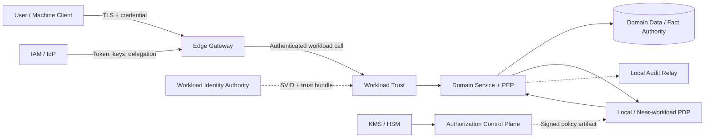

# Edge Gateway & Authorization Platform

> **TDD L2 + Developer Implementation Guide**
> Tài liệu này được refactor để developer có thể hiểu luồng chính và bắt đầu pilot mà không phải đọc toàn bộ phần governance trước. Các security invariant và production gate vẫn bắt buộc.

| Thuộc tính | Giá trị |
|---|---|
| Trạng thái | **UNDER REVIEW** |
| Phiên bản | `v2.0-draft` — refactor cấu trúc từ `v1.9`, không mở rộng production approval |
| Hệ thống | `ap-authz` — Edge Gateway & Authorization Platform |
| Pilot | `market.order.read` — authenticated, read-only, single-active-tenant |
| Technical owner pilot | Lead Architect/Tech Lead kiêm Developer và Platform/SRE implementer |
| Control owners bắt buộc | IAM, Domain Owner, Product/Business, Security/Legal, Privacy/SecOps, SRE |

## 0. Cách đọc tài liệu

Nếu bạn là:

- **Developer triển khai pilot:** đọc mục 1–9.
- **Domain Owner:** đọc mục 1–6, 8–9 và 12.
- **Platform/SRE:** đọc mục 1–5, 7–12.
- **Security/IAM reviewer:** đọc mục 3–7, 9, 11–13.
- **Approver:** đọc mục 1, 2, 10, 12 và 13.

Sau 20 phút đầu, developer phải trả lời được:

1. Edge, workload trust, PEP, PDP và domain chịu trách nhiệm gì?
2. Vì sao token hợp lệ vẫn có thể bị từ chối?
3. `actor` khác `caller` như thế nào?
4. Resource fact nào phải lấy server-side?
5. Khi nào `ALLOW` vẫn không được phép trả dữ liệu hoặc commit mutation?
6. Những lỗi nào phải fail-close?

---

# Phần I — Bắt đầu triển khai

## 1. TL;DR

### 1.1 Vấn đề

Các BFF như `agent-api`, `market-api` và `core-broker-api` đang có xu hướng tự parse token, map role/scope, kiểm tra tenant và ghi audit. Một policy vì vậy có nhiều bản sao, dễ drift và khó chứng minh mọi execution path đều được bảo vệ.

### 1.2 Kiến trúc đề xuất

```text
External client
  -> Edge Gateway                 xác thực external credential, hygiene, coarse policy
  -> Workload Trust               xác thực workload caller và destination
  -> Domain Service PEP           lấy resource/fact thật, tạo canonical request
  -> Local/Near-workload PDP      evaluate signed policy một cách deterministic
  -> Domain transaction/response  kiểm tra invariant, thi hành obligation
  -> Local Audit Relay            nối decision với final outcome

Authorization Control Plane
  -> review, test, build, sign và phân phối immutable policy artifact
  -> không nằm trên request hot path
```

### 1.3 Quy tắc không được phá vỡ

1. Edge không đọc domain database và không chứa business invariant.
2. Token hợp lệ không đồng nghĩa có quyền trên resource.
3. `actor` và `caller` là hai principal độc lập; cả hai đều phải hợp lệ.
4. Tenant, owner, relationship và resource state lấy từ server-side authority.
5. Unknown identity, action, schema, fact provenance hoặc obligation đều deny.
6. Explicit deny thắng allow; thiếu layer bắt buộc thì fail-close.
7. PDP không gọi network tùy ý trong lúc evaluate.
8. Domain giữ resource truth, transaction, invariant và response authorization.
9. Mọi route, handler, consumer, job và response path phải có PEP coverage.
10. Policy production phải versioned, tested, signed, observable và rollback được.
11. Emergency revoke không được bị positive cache, LKG hoặc rollback vô hiệu hóa.
12. `legacy DENY -> new ALLOW` là privilege expansion và chặn rollout.

### 1.4 Không làm trong pilot

- Không thay toàn bộ IAM/IdP.
- Không chọn policy engine production trước benchmark.
- Không mặc định triển khai SPIRE nếu identity platform hiện tại đạt SPIFFE conformance.
- Không đưa domain database hoặc relationship graph vào Edge/PDP.
- Không xử lý cross-tenant grant, privileged mutation hoặc money movement.
- Không production hóa candidate security floor.
- Không xây active/active multi-region hoàn chỉnh.
- Không xóa BFF còn aggregation, orchestration hoặc channel-specific value.

## 2. Golden path: `market.order.read`

### 2.1 Scope

| Thành phần | Pilot baseline |
|---|---|
| Actor | Market user/agent đã được IAM xác thực |
| Caller | Edge và Market workload có SPIFFE-compatible identity |
| Action | `market.order.read@v1` |
| Resource | Order ID canonical |
| Fact authority | Market Domain: tenant, owner/relationship, state, version, provenance |
| Policy | Same-tenant; explicit deny thắng allow; missing fact deny |
| Obligation | Field/row filtering phải được PEP xác nhận đã áp dụng |
| Audit | Draft `DEGRADED_BOUNDED` 15 phút; cần control-owner approval |
| Rollout | Shadow toàn traffic đại diện, sau đó canary theo cohort |

### 2.2 Luồng request

```mermaid
sequenceDiagram
    autonumber
    actor U as User
    participant E as Edge Gateway
    participant W as Workload Trust
    participant S as Market Service + PEP
    participant D as Market Data
    participant P as Local/Near PDP
    participant A as Audit Relay

    U->>E: GET order + access token
    E->>E: Strip untrusted headers; validate credential
    E->>W: mTLS call + bounded delegation
    W->>S: Verified actor and caller
    S->>D: Resolve order facts server-side
    D-->>S: tenant, owner, state, version, provenance
    S->>P: Canonical authorization request
    P-->>S: Decision + policy state + obligations
    S->>S: Enforce obligations
    S-->>A: Decision + final response outcome
    S-->>U: Filtered response or controlled error
```

### 2.3 Expected decision examples

| Tình huống | Kết quả |
|---|---|
| Actor và order cùng tenant; caller đúng; facts còn hạn | `ALLOW` |
| Order thuộc tenant khác | `DENY` |
| Client tự gửi `x-tenant-id` khác | Bỏ header; dùng tenant từ domain |
| Actor đúng nhưng caller không nằm trong allowlist | `DENY` |
| Không resolve được resource tenant/provenance | `DENY` hoặc controlled `503` theo error class; không `ALLOW` |
| PDP trả obligation PEP không hỗ trợ | Không trả dữ liệu |
| Policy/revocation state không tương thích | `INDETERMINATE`, fail-close |

### 2.4 Definition of success

- 100% route, handler, caller và response path của action có coverage.
- Không có unexplained `legacy DENY -> new ALLOW`.
- P95/P99 authorization nằm trong action latency budget.
- Wrong caller, expired SVID và spoofed identity header đều bị chặn.
- Decision nối được với final response outcome.
- Policy/runtime rollback không khôi phục quyền đã revoke.

## 3. Mental model và thuật ngữ

### 3.1 Công thức quyết định

```text
Actor + Caller + Action + Resource + Context/Facts
  -> Decision + Obligations + Policy/Revocation State
```

| Thuật ngữ | Ý nghĩa | Authority |
|---|---|---|
| Actor | User, service hoặc job chịu ý nghĩa nghiệp vụ của action | IAM/verified credential |
| Caller | Workload trực tiếp thực hiện hop | Workload trust layer |
| Action | Động từ nghiệp vụ canonical, có version | Domain + API Governance |
| Resource | Đối tượng, tenant và version | Domain authority |
| Fact | Thuộc tính policy dùng, có source và freshness | Registered provider |
| PEP | Tạo input đáng tin cậy và thi hành decision/obligation | Edge hoặc service boundary |
| PDP | Evaluate policy deterministic | Authorization data plane |
| Obligation | Việc PEP bắt buộc làm kèm `ALLOW` | Typed capability contract |
| Policy artifact | Bundle immutable đã test và ký | Authorization control plane |
| LKG | Last-known-good artifact đã verify | PDP runtime |
| Explicit grant | Quyền cross-tenant/deferred có scope, expiry và revoke | Approved grant authority |

### 3.2 Actor không phải Caller

Ví dụ user `user-42` gọi Edge, Edge gọi Market service:

```text
actor  = user-42
caller = spiffe://prod.example/platform/edge-gateway
```

Nếu Market service gọi tiếp Broker service thay user:

```text
actor  = user-42
caller = spiffe://prod.example/market/order-api
```

SVID chứng minh workload caller. Delegation artifact chứng minh caller được hành động thay actor trong đúng audience, scope và TTL. Không dùng unsigned identity header thay cho hai bằng chứng này.

## 4. Architecture và ranh giới trách nhiệm



### 4.1 Component responsibilities

| Component | Phải làm | Không được làm |
|---|---|---|
| Edge Gateway | External AuthN, header/path hygiene, rate limit, route/action mapping, coarse PEP | Đọc domain DB, quyết định ownership/state |
| Workload Identity Authority | Attestation, SPIFFE ID, SVID/trust-bundle lifecycle | Cấp actor entitlement hoặc business permission |
| Workload Trust | mTLS, verified caller, destination/caller allowlist | Thay service PEP bằng network policy |
| Service PEP | Resolve facts, canonicalize input, gọi PDP, enforce obligations, emit outcome | Tin client fact hoặc tự phát minh action |
| PDP | Deterministic evaluation trên active policy/revocation state | Gọi domain service/DB tùy ý |
| Domain Service | Resource truth, invariant, transaction, response filtering | Parse external token theo cách riêng |
| Control Plane | Review, test, build, sign, distribute, inventory, rollout | Là synchronous dependency của mọi request |
| Audit Platform | Durable delivery, access, retention, reconciliation | Tham gia quyết định nghiệp vụ |

### 4.2 DDD boundary

- Authorization Platform là một bounded context; không sở hữu domain record hoặc business invariant.
- Mỗi action có một Domain Owner định nghĩa semantics, resource, fact authority và invariant.
- Domain dùng Anti-Corruption Layer để map dữ liệu nội bộ thành fact canonical tối thiểu.
- `ALLOW` chỉ cho phép domain tiếp tục; aggregate vẫn re-check invariant trước commit.
- Committed event là sự thật lịch sử; deferred command phải authorize lại hoặc dùng explicit grant còn hiệu lực.

### 4.3 PEP coverage

| Execution path | Enforcement point | Evidence |
|---|---|---|
| External HTTP/gRPC | Edge route PEP | Default-deny route registry + inventory diff |
| Domain handler | Service PEP | Handler/action registry + conformance test |
| East-west call | Workload policy | Principal/destination/port inventory |
| Async consumer | Consumer PEP | Producer/schema/provenance/action registry |
| Scheduled/admin job | Job identity + action registry | Dedicated principal, scope và audit |
| Response/field access | Response authorization layer | Obligation capability + leak test |

Network policy chỉ chứng minh network path, không chứng minh handler hoặc response đã enforce authorization.

## 5. Developer contracts

### 5.1 Authorization request v1

```json
{
  "schema_version": "1",
  "authorization_transaction_id": "atx_01...",
  "attempt_id": "att_01...",
  "request_time": "2026-09-01T09:00:00Z",
  "actor": {
    "issuer": "https://iam.example",
    "subject": "user-42",
    "active_tenant_id": "tenant-a",
    "assurance_level": "mfa",
    "entitlement_version": "ev-17",
    "credential_expires_at": "2026-09-01T09:05:00Z"
  },
  "caller": {
    "workload_principal": "spiffe://prod.example/platform/edge-gateway",
    "mode": "on_behalf_of",
    "audience": "market-order-api",
    "delegation_id": "dlg-123",
    "expires_at": "2026-09-01T09:01:00Z"
  },
  "action": {
    "id": "market.order.read",
    "version": "1"
  },
  "resource": {
    "type": "market_order",
    "id": "order-123",
    "tenant_id": "tenant-a",
    "version": "7"
  },
  "facts": [
    {
      "name": "order.owner_id",
      "value": "user-42",
      "source": "market-order-store",
      "source_version": "7",
      "observed_at": "2026-09-01T08:59:59Z",
      "expires_at": "2026-09-01T09:00:10Z"
    }
  ],
  "context": {
    "environment": "prod",
    "channel": "web"
  }
}
```

Contract không mang raw token, full request body hoặc full domain record. Chỉ truyền attribute policy thực sự dùng, kèm type, authority và freshness.

### 5.2 Authorization decision v1

```json
{
  "schema_version": "1",
  "decision_id": "dec_01...",
  "decision": "ALLOW",
  "reason_code": "ALLOW_SAME_TENANT_OWNER",
  "policy_state": {
    "composition_version": "1",
    "platform_policy_digest": "sha256:...",
    "domain_policy_digest": "sha256:...",
    "revocation_generation": 1042
  },
  "obligations": [
    {
      "type": "mask_fields",
      "version": "1",
      "fields": ["customer.tax_id"]
    }
  ],
  "evaluation": {
    "cache_state": "MISS",
    "duration_ms": 2.4
  }
}
```

### 5.3 Policy composition

Platform guardrail và domain policy là các mandatory layers:

| Trạng thái layer | Final decision |
|---|---|
| Bất kỳ layer trả `DENY` | `DENY` |
| Layer bắt buộc missing, incompatible, unavailable hoặc `INDETERMINATE` | `INDETERMINATE`; PEP fail-close |
| Tất cả mandatory layer trả `ALLOW` | Candidate `ALLOW` |
| Candidate `ALLOW` nhưng obligation unknown/conflict/failed | Không response/side effect |

Domain invariant có thể từ chối thực hiện dù authorization decision là `ALLOW`. Một layer `ALLOW` không override `DENY` của layer khác.

### 5.4 Error contract

| Error | Ý nghĩa | Client behavior |
|---|---|---|
| `AUTHENTICATION_FAILED` | Credential không hợp lệ | `401` hoặc transport equivalent |
| `AUTHORIZATION_DENIED` | Policy deny | `403` hoặc concealed `404` |
| `INPUT_INVALID` | Schema/action/resource không hợp lệ | Controlled `400`; không evaluate |
| `POLICY_UNAVAILABLE` | Không thể evaluate an toàn | `503`; fail-close |
| `REVOCATION_STALE` | Revocation state vượt freshness budget | `503`/deny theo action |
| `OBLIGATION_UNSUPPORTED` | PEP không hỗ trợ obligation | Không trả data/side effect |
| `RESOURCE_CONFLICT` | Resource version/state đã đổi | `409` hoặc domain equivalent |

Không gộp platform unavailable vào business denial; vận hành cần phân biệt outage với policy deny.

### 5.5 Correlation identifiers

| ID | Lifetime |
|---|---|
| `authorization_transaction_id` | Một ingress attempt end-to-end; Edge tạo/ghi đè |
| `attempt_id` | Một processing attempt/retry kỹ thuật |
| `business_operation_id` | Một business command qua nhiều retry; dùng khi mutation/idempotency cần |
| `decision_id` | Một lần PDP evaluate; một transaction có thể có nhiều decision |

## 6. Implementation recipe theo component

### 6.1 Edge Gateway

Thứ tự xử lý bắt buộc:

1. Terminate TLS và áp dụng request-size/rate controls.
2. Xóa external identity/delegation headers.
3. Validate issuer, audience, token class, algorithm, key, expiry và not-before.
4. Tạo `authorization_transaction_id`.
5. Map route sang registered action; unknown route/action deny.
6. Chạy coarse policy, không resolve domain record.
7. Gọi workload bằng authenticated transport và bounded delegation.

### 6.2 Workload identity và delegation

- Contract dùng SPIFFE-compatible workload principal và short-lived X.509-SVID.
- Không authorize bằng IP, DNS, namespace hoặc caller-supplied header.
- Platform issuer hiện tại được ưu tiên nếu đạt attestation, rotation, bundle recovery, HA và federation conformance.
- Chỉ mở SPIRE ADR khi ít nhất một control bắt buộc không đạt; không chạy hai production issuer song song cho cùng identity scope.
- `on_behalf_of`: actor và caller đều được phép; exact audience và TTL ngắn.
- `system`: dedicated system principal; không tạo user giả.
- `approved_deferred_grant`: grant bound vào action/resource/caller, có expiry và revoke.

### 6.3 Service PEP

```text
verify actor/delegation + verified caller
  -> resolve canonical resource server-side
  -> map minimal facts with provenance/freshness
  -> evaluate PDP with deadline and size limit
  -> accept only valid ALLOW
  -> apply every typed obligation
  -> execute domain read/invariant/transaction
  -> emit final outcome linked to decision_id
```

PEP không được:

- tin tenant/resource state do client gửi;
- bỏ qua unknown obligation;
- silent downgrade contract/capability;
- log raw credential hoặc sensitive policy trace;
- cache `ALLOW` nếu không chứng minh được canonical fingerprint đầy đủ.

### 6.4 High-risk mutation

```text
begin transaction
  -> lock/read resource version N
  -> build facts from transactional state
  -> evaluate authorization
  -> verify obligations and business invariant
  -> commit mutation + audit intent atomically as version N+1
else
  -> rollback and emit NOT_EXECUTED
```

High-risk mutation mặc định không cache positive decision. Với external side effect, durable command/audit intent phải commit trước khi dispatcher idempotent gọi provider.

### 6.5 Async event và deferred command

- Committed event chỉ là sự thật lịch sử; consumer xác minh producer, schema và replay.
- Không tái sử dụng user `ALLOW` cũ cho side effect tương lai.
- Deferred command phải authorize lại hoặc kiểm tra approved grant còn hiệu lực.
- Consumer commit inbox/outbox và side effect idempotent.

## 7. Policy lifecycle, cache và revocation

### 7.1 Policy lifecycle

```text
Policy change
  -> schema/static validation
  -> positive, negative và property tests
  -> impact replay
  -> Domain + Security review
  -> immutable build
  -> KMS/HSM signature
  -> registry
  -> canary distribution
  -> health/parity/revocation gate
  -> promote hoặc safe rollback
```

Mỗi production artifact có owner, provenance, contract/vocabulary requirement, immutable digest và active fleet inventory.

### 7.2 Cache rules

| Cache | Key tối thiểu | Rule |
|---|---|---|
| JWKS/trust | Issuer, key ID, trust domain | Proactive refresh; unknown key deny |
| Base/domain policy | Immutable digest | Verify signature; atomic activate; bounded LKG age |
| Attribute/entitlement | Subject/resource + source version | TTL theo authority/action |
| Decision | Full canonical fingerprint + all policy/revocation state | Chỉ deterministic result |

Decision fingerprint bao phủ actor, caller/delegation, action, resource ID/tenant/version, relevant facts/source version, credential expiry, platform/domain policy digest và revocation generation.

### 7.3 Emergency revocation

Production requirement:

> Authority revoke phải chặn quyền trong objective được duyệt và không bị positive cache, LKG hoặc rollback khôi phục.

Token introspection, entitlement invalidation, emergency bundle và deny-only security floor đều là candidate. Security floor chưa được production-approve; phải có PoC về authority, ordering, signing, distribution, compatibility, cache bypass, partition và compromised-key recovery.

## 8. Pilot delivery plan

### 8.1 Working model

- Triển khai một vertical slice; không xây xong platform rồi mới tích hợp domain.
- Pilot có một technical owner, giới hạn `WIP = 1 deliverable chính`.
- External control owner cung cấp authority data hoặc phê duyệt risk/compliance; technical owner không tự phê duyệt thay họ.
- Thời lượng tham chiếu 6–10 tuần nếu external input đúng hạn; không bỏ exit criteria để giữ lịch.

### 8.2 Critical path

| Phase | Việc chính | Deliverable | Exit criteria |
|---|---|---|---|
| P0 — Inventory | Map route, handler, caller, fact, legacy behavior, audit và bypass | Pilot inventory | 100% pilot path có owner và không còn unknown ingress |
| P1 — Contracts | Identity/delegation, action/resource, audit row, SLI/SLO, error contract | Contract v1 + Action Pack | Control owners xác nhận phần accountability |
| P2 — PoC | Identity conformance, PDP topology, signed policy, relay, telemetry, rollback | Benchmark + conformance evidence | Latency/capacity và corrupt/stale/timeout behavior đạt |
| P3 — Shadow | Legacy enforce; new platform evaluate/audit | Four-way parity report | Không có unexplained privilege expansion; coverage 100% |
| P4 — Canary | 1% -> 5% -> 25% -> 50% -> 100% | Gate evidence mỗi cohort | SLO/error budget/security signal đạt |
| P5 — Expand | Onboard C1 trước, C0 sau | Action Pack/action | Action-specific DoD đạt |
| P6 — Retire | Zero-traffic window; revoke legacy access | Decommission evidence | Không còn traffic/dependency; ownership đã chuyển |

### 8.3 Definition of Ready cho một action

Action chỉ được vào shadow khi có đủ:

1. Named Product/Domain Owner và action class C0/C1/C2.
2. Canonical action/resource schema, tenant model và fact authority.
3. Actor/caller/delegation mode và caller allowlist.
4. Legacy behavior cùng positive/negative decision corpus.
5. Obligation capability và response-leak test plan.
6. Audit durability row, quota, failure behavior và approval.
7. Workload/RPS/latency baseline, SLO và rollback trigger.
8. Route/handler/consumer inventory không còn bypass chưa xử lý.

### 8.4 Developer backlog đầu tiên

1. Inventory end-to-end `market.order.read`.
2. Chạy SPIFFE conformance trên identity authority hiện tại.
3. Chốt IAM & Delegation Profile v1.
4. Chốt Authorization Contract & Vocabulary v1.
5. Chuẩn bị audit row để control owners ký.
6. Tạo representative policy/input corpus.
7. Benchmark PDP topology và failure modes.
8. Dựng shadow comparison, audit reconciliation và SLO dashboard.
9. Chạy negative-security, rotation, rollback và revoke drills.
10. Readiness review trước canary.

## 9. Testing và Definition of Done

### 9.1 Test pyramid bắt buộc

| Layer | Test |
|---|---|
| Contract | Schema/version/capability/error/obligation |
| Policy unit | Positive, negative, default deny, composition |
| Property/security | Cross-tenant, cache fingerprint, deny-overrides, privilege monotonicity |
| Integration | IAM/delegation, workload trust, PDP, fact authority, audit |
| Identity conformance | SPIFFE ID, attestation, SVID/bundle rotation, expiry, federation deny |
| Coverage | Route, handler, consumer, job, response |
| Migration | Four-way legacy/new comparison, cohort, rollback |
| Performance | 2x peak, one-AZ, worst input/bundle, cold start |
| Chaos/DR | IAM/PDP/control/fact/audit outage, corrupt/stale state |
| Privacy | Minimize, mask, retention, access, restore |

### 9.2 Critical negative cases

- Wrong issuer/audience/token class/algorithm/unknown key deny.
- Spoofed actor, caller hoặc delegation header deny.
- Actor đúng/caller sai và caller đúng/actor sai đều deny.
- Unknown route/action/execution path không bypass.
- Cross-tenant không grant hoặc grant sai scope/caller/expiry/revoke deny.
- Cache fingerprint thiếu fact/version/digest bị test phát hiện.
- Emergency revoke bypass positive cache và không bị rollback khôi phục.
- Corrupt, sai-signature hoặc incompatible artifact không activate.
- Resource đổi giữa authorize và commit không tạo side effect.
- Unknown obligation không trả dữ liệu.
- `legacy DENY -> new ALLOW` chặn canary.
- Audit full/corrupt/noisy tenant chạy đúng approved mode/quota.

### 9.3 Definition of Done

Một action chỉ production-enforced khi:

1. Contract, policy, integration, negative-security, coverage, load và failure tests đạt.
2. Shadow parity không còn privilege expansion chưa giải thích.
3. Canary 100% giữ SLO/error budget và không có critical security signal.
4. Decision/final outcome audit reconcile đạt contract.
5. Runbook, dashboard, alert, on-call và rollback đã exercise.
6. Domain Owner, Security, SRE và control owners ký evidence tương ứng.

---

# Phần II — Vận hành và phê duyệt

## 10. Failure semantics, SLO và audit

### 10.1 Action classes

| Class | Loại action | Candidate availability | Failure posture |
|---|---|---:|---|
| C0 | Privileged, cross-tenant, financial, critical mutation | >= 99.99% | Fail-close; durable audit theo approved matrix |
| C1 | Authenticated business read/standard mutation | >= 99.95% | Fail-close AuthZ; bounded audit degradation nếu được duyệt |
| C2 | Public/non-sensitive read, health, discovery | >= 99.9% | Chỉ fail-open khi có registry, owner, classification và expiry |

Các số trên là candidate L2; cần workload model, PoC và Product/SRE approval.

### 10.2 Candidate NFR

| SLI | Candidate target |
|---|---:|
| Local PDP evaluation | P95 <= 5 ms; P99 <= 10 ms |
| Edge AuthN/coarse AuthZ overhead | P95 <= 15 ms |
| Remote PDP nếu được ADR cho phép | P95 <= 30 ms nội vùng |
| Standard policy propagation | P95 <= 2 phút |
| Emergency revoke convergence | <= 30 giây |
| Audit collector delivery | >= 99.99% trong 5 phút |
| Capacity | 2x approved peak; one-AZ loss vẫn giữ action SLO |
| Compatibility | Rolling N/N-1 |

### 10.3 Dependency failure

| Sự cố | Behavior |
|---|---|
| IAM/JWKS stale hoặc unknown key | Không xác thực; dừng |
| Policy artifact corrupt/incompatible | Không activate; giữ safe compatible digest |
| PDP crash/timeout | Fail-close; controlled `503` |
| Fact authority unavailable | Dùng cache còn hạn nếu action cho phép; hết hạn dừng |
| Resource version đổi | Không mutation; conflict |
| Unknown obligation | Không response/side effect |
| Revocation stale | C0/C1 deny hoặc not-ready |
| Signing key compromised | Freeze promotion; revoke key/trust; incident |

### 10.4 Audit durability modes

| Mode | Khi local audit không durable/full/corrupt |
|---|---|
| `REQUIRED_DURABLE` | Không thực thi; controlled `503`; incident |
| `DEGRADED_BOUNDED` | Tiếp tục trong approved window/quota; hết budget dùng approved action |
| `BEST_EFFORT` | Continue + alert/reconcile; chỉ public/low-risk |

Mỗi production action phải có signed audit row: owner, mode, window, reserved quota, event size, retention, failure action và incident owner. Remote SIEM không nằm synchronous trên mọi request; mutation cần commit business state và local audit intent atomically khi mode yêu cầu.

## 11. Observability và operational readiness

### 11.1 Metrics bắt buộc

- Action availability và latency từ valid attempt đến final outcome.
- AuthN reject theo reason, không label theo subject.
- Decision theo action class, decision/reason và digest cohort.
- PDP evaluation latency, cache state và error.
- Desired/active policy age và fleet drift.
- Revocation convergence/generation.
- Fact lookup latency/freshness.
- Legacy/new migration mismatch.
- Audit queue depth, oldest age, drain rate và reconciliation gap.
- Obligation returned/applied/failed.

Không dùng raw actor, tenant hoặc resource ID làm metric label.

### 11.2 Alerts bắt buộc

- Revocation convergence breach.
- `legacy DENY -> new ALLOW`.
- Cross-tenant allow không có registered grant.
- Action/PDP SLO burn.
- PEP coverage drift.
- Desired policy khác active hoặc signature/schema failure.
- Audit high-water/full/reconcile gap.
- Break-glass activation.
- Plaintext, unknown workload principal hoặc certificate expiry.

### 11.3 Runbooks trước production

- IAM/key outage và emergency user/client revoke.
- Corrupt artifact, signing/publish failure và fleet drift.
- PDP crash/latency/cold start/capability mismatch.
- Fact authority outage/cache storm.
- Audit full/corrupt/noisy tenant/reconciliation.
- Compromised policy, STS hoặc workload signing key.
- Workload trust failure và unknown caller.
- Rollback không khôi phục revoked access.
- Lost AZ/region, restore và validation.
- Break-glass activate/revoke/retrospective.

## 12. Security và production blockers

### 12.1 Threat/control summary

| Threat | Required control |
|---|---|
| Forged identity/delegation | Strip, signature/binding verification, negative E2E |
| Replay/confused deputy | Exact audience, caller binding, short TTL, replay control |
| PEP bypass | Default-deny inventory + coverage conformance |
| Cross-tenant IDOR | Server-side resource authority + explicit grant |
| Stale permission | Freshness budget, invalidation, revoke drill |
| Policy tampering | Review, separation of duties, provenance, KMS/HSM |
| Policy-engine DoS | Input/depth/concurrency limits, deadlines, fuzz/load |
| Audit loss/leakage | Minimize, encrypt, outbox/relay, reconcile, quota isolation |
| Obligation omitted | Typed capability registry; unknown -> deny |

### 12.2 Critical blockers

| Blocker | Điều kiện đóng |
|---|---|
| Identity/delegation authority chưa chứng minh | Workload Identity Profile + Delegation Profile + negative E2E |
| PEP bypass chưa loại bỏ | Full coverage inventory + default-deny conformance |
| Revocation/cache/LKG/rollback chưa chứng minh | Emergency Revocation PoC/ADR + drill |
| Compromised signer recovery chưa chứng minh | KMS governance + key-recovery exercise |
| Audit availability trade-off chưa được nhận risk | Signed action audit matrix + full/noisy-tenant test |
| Engine/topology chưa chọn | Representative policy/input benchmark + ADR |
| Workload/SLO/capacity/cost chưa có baseline | Product/SRE/FinOps input + OAT evidence |
| Production ownership chưa rõ | Named system owner, on-call và incident authority |

## 13. Governance và ADR status

### 13.1 Decision status model

Không dùng một nhãn cho cả architecture decision và production readiness.

| Axis | Values |
|---|---|
| Architecture decision | `PROPOSED`, `ACCEPTED`, `SUPERSEDED`, `REJECTED` |
| Readiness | `POC_REQUIRED`, `EXTERNAL_APPROVAL`, `IMPLEMENTATION_READY`, `PRODUCTION_READY` |

Vì tài liệu đang `UNDER REVIEW`, các quyết định dưới đây là `PROPOSED` trừ khi có decision record được approver ký riêng.

### 13.2 ADR summary

| ADR | Decision | Architecture status | Readiness |
|---|---|---|---|
| ADR-001 | Thin Edge; domain giữ invariant/resource truth | `PROPOSED` | `IMPLEMENTATION_READY` cho pilot |
| ADR-002 | Hybrid platform guardrail + domain authorization | `PROPOSED` | `IMPLEMENTATION_READY` cho pilot |
| ADR-003 | Distributed PDP trên synchronous hot path | `PROPOSED` | `POC_REQUIRED` |
| ADR-004 | Signed immutable policy artifact | `PROPOSED` | `POC_REQUIRED` lifecycle evidence |
| ADR-005 | SPIFFE-compatible identity; SPIRE conditional | `PROPOSED` | `EXTERNAL_APPROVAL` + conformance |
| ADR-006 | Versioned authorization contract/vocabulary | `PROPOSED` | `IMPLEMENTATION_READY` sau Contract v1 |
| ADR-007 | Audience/caller-bound delegation | `PROPOSED` | `EXTERNAL_APPROVAL` IAM/Security |
| ADR-008 | Audit durability theo action | `PROPOSED` | `EXTERNAL_APPROVAL` |
| ADR-009 | Candidate deny-only security floor | `PROPOSED` | `POC_REQUIRED`; không production-approved |
| ADR-010 | Explicit grant cho cross-tenant/deferred authority | `PROPOSED` | Ngoài pilot |
| ADR-011 | DDD bounded-context ownership + ACL | `PROPOSED` | `IMPLEMENTATION_READY` cho pilot |
| ADR-012 | Action SLO/error-budget rollout gate | `PROPOSED` | `EXTERNAL_APPROVAL` Product/SRE |

### 13.3 Target production RACI

| Capability | Accountable | Responsible | Consulted |
|---|---|---|---|
| IAM/delegation | Identity/Security | IAM | Platform, Domains |
| Edge | Application Platform | Gateway/SRE | Security, Domains |
| Workload trust | Platform/SRE | Trust Platform | Security |
| PEP/PDP/control plane | Security Platform | Authorization Team | SRE, Domains |
| Domain policy/facts/invariant | Domain Owner | Domain Team | Security Platform |
| Audit mode/action | Product/Business | Domain + SRE | Security, Legal/Privacy, SecOps |
| Audit sink/privacy | SecOps/Privacy | Audit/Data Platform | Product, Legal, SRE |
| Action SLO/on-call | Product + owning Domain | Service Team + SRE | Security |

### 13.4 Pilot staffing

Một Lead Architect/Tech Lead có thể kiêm technical delivery, developer và Platform/SRE implementer trong pilot. Tuy nhiên người đó không được tự phê duyệt thay IAM, Product/Business, Security/Legal, Privacy/SecOps hoặc SRE đối với authority data, risk acceptance và compliance. Production promotion và break-glass vẫn cần separation of duties.

---

# Phần III — Onboarding và tham chiếu

## 14. Kiến thức developer cần có

Học theo thứ tự:

1. HTTP/TLS/mTLS; JWT, issuer, audience, JWKS và key rotation.
2. OAuth/OIDC, Token Exchange, delegation và sender binding.
3. RBAC/ABAC/ReBAC, default deny, IDOR và confused deputy.
4. PEP/PDP, policy-as-code và OPA/Rego hoặc Cedar cho PoC.
5. SPIFFE ID, SVID, trust domain, attestation và bundle rotation.
6. DDD bounded context, ACL, aggregate invariant và source of truth.
7. Cache/freshness, idempotency, outbox/inbox, TOCTOU và revocation.
8. OpenTelemetry, SLI/SLO, error budget, load/chaos/security testing.

Developer chưa cần học sâu SPIRE, multi-region federation hoặc security-floor design trước khi làm pilot read path.

## 15. L3 artefacts cần tạo

| Artefact | Gate |
|---|---|
| IAM & Delegation Profile v1 | Trước service-to-service PoC |
| Authorization Contract & Vocabulary v1 | Trước PEP/PDP integration |
| Policy Lifecycle, Test & Signing Standard | Trước publish artifact |
| PDP Engine & Topology Benchmark | Trước production selection |
| PEP Coverage & Conformance Specification | Trước enforce |
| Emergency Revocation PoC & ADR | Trước high-risk action |
| Workload Identity & Flow Profile | Trước strict workload enforcement |
| Decision Audit & Retention Contract | Trước dữ liệu thật |
| Action-level Audit Durability Matrix | Trước enforce/action |
| SRE Service Level, Error Budget & Capacity Matrix | Trước OAT |
| BFF Migration Matrix & Rollback Plan | Trước cutover |
| Pilot Action Pack — `market.order.read` | Trước pilot shadow |
| Dashboard, Alert, On-call & DR Pack | Trước production |

## 16. References

- [NIST SP 800-207 — Zero Trust Architecture](https://csrc.nist.gov/pubs/sp/800/207/final)
- [RFC 8693 — OAuth 2.0 Token Exchange](https://www.rfc-editor.org/rfc/rfc8693.html)
- [RFC 8705 — OAuth 2.0 Mutual-TLS Client Authentication](https://www.rfc-editor.org/rfc/rfc8705.html)
- [RFC 9700 — OAuth 2.0 Security Best Current Practice](https://www.rfc-editor.org/rfc/rfc9700.html)
- [SPIFFE Concepts](https://spiffe.io/docs/latest/spiffe-about/spiffe-concepts/)
- [SPIRE Concepts](https://spiffe.io/docs/latest/spire-about/spire-concepts/)
- [Open Policy Agent documentation](https://www.openpolicyagent.org/docs/)
- [Google SRE — Embracing Risk](https://sre.google/sre-book/embracing-risk/)

## 17. Review checklist

Trước khi approve tài liệu:

- [ ] Boundary Edge -> workload trust -> PEP/PDP -> domain được chấp thuận.
- [ ] Actor/caller/delegation semantics không còn mơ hồ.
- [ ] Platform/domain policy composition contract được chấp thuận.
- [ ] Pilot action, owner và fact authority đã named.
- [ ] SPIFFE conformance plan và SPIRE adoption gate rõ.
- [ ] Engine/topology vẫn là PoC decision, chưa bị khóa sớm.
- [ ] Audit mode của pilot có đúng control owners nhận risk.
- [ ] PEP coverage và no-bypass evidence có kế hoạch cụ thể.
- [ ] Revocation, signing recovery và rollback có PoC/drill.
- [ ] SLO/capacity/operational ownership có owner và deadline.

## 18. Kết luận

Authorization Platform tập trung **policy lifecycle**, không tập trung mọi runtime decision vào một service duy nhất. Edge chịu external trust và coarse control; workload layer xác thực caller; service PEP lấy domain facts và thi hành decision; PDP evaluate policy gần workload; domain giữ invariant, transaction và response; audit ghi decision cùng final outcome.

Implementation bắt đầu bằng một vertical slice `market.order.read`, không bắt đầu bằng việc dựng toàn bộ platform. Production chỉ được xem xét sau khi đóng delegation, PEP coverage, emergency revocation, signer recovery, action-level audit durability, capacity và operational ownership.
