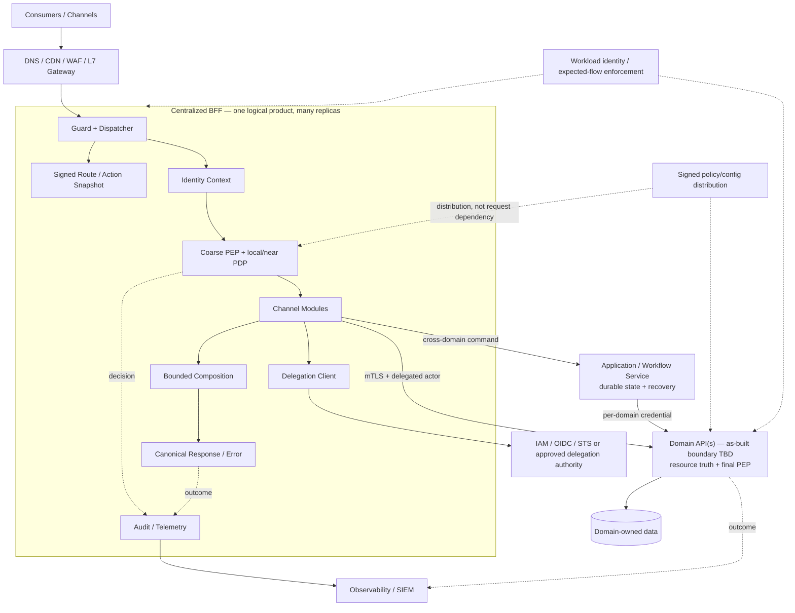
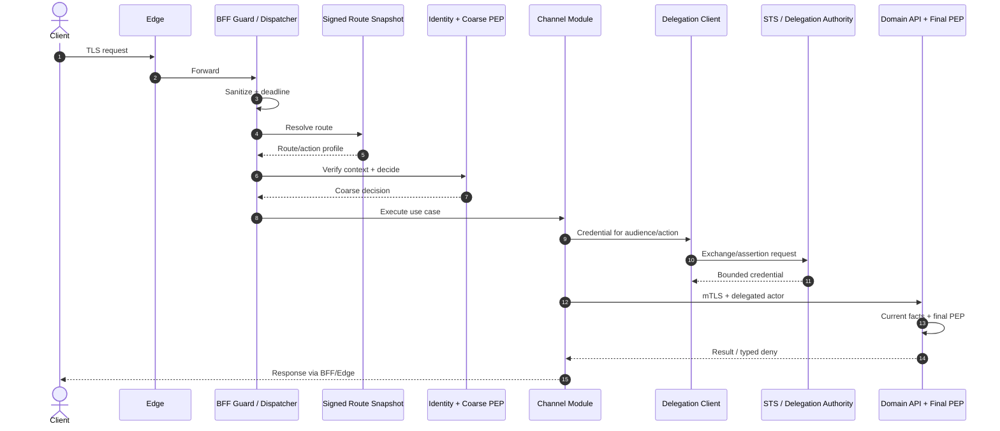
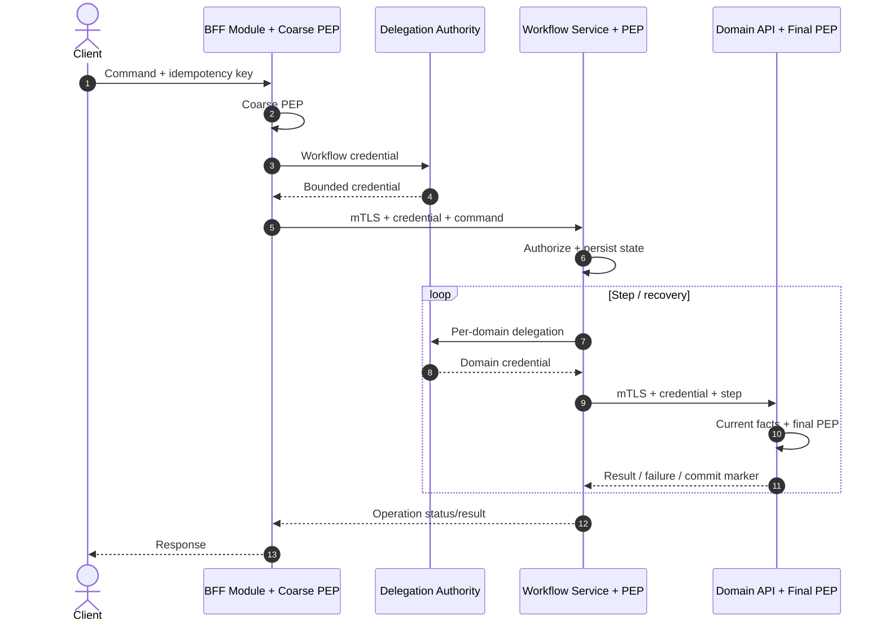
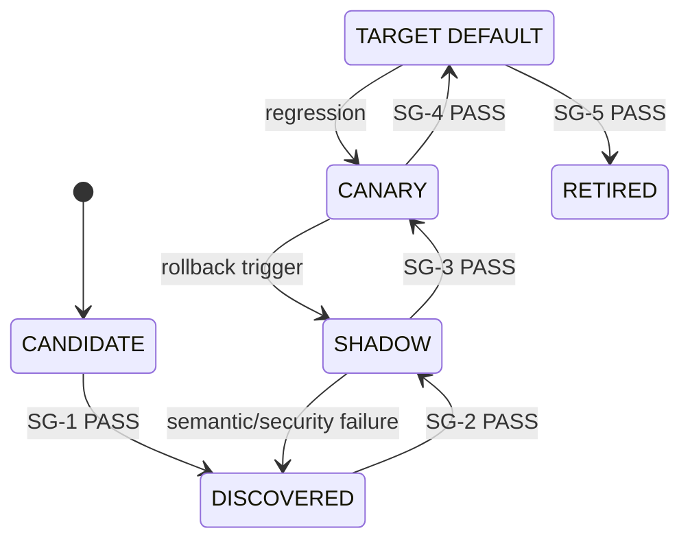

# L2 — AP-CBFF — Centralized BFF và Zero Trust Platform

| Thuộc tính | Giá trị |
|---|---|
| Document ID | AP-CBFF-L2 |
| Phiên bản | 2.4 |
| Trạng thái | **READY FOR ARCHITECTURE REVIEW** |
| Ngày | 01/09/2026 |
| Architecture Owner | Chief Architect |
| Phạm vi | Đánh giá hợp nhất `agent-api`, `market-api`, `core-broker-api` thành một BFF logic tập trung |
| Route ứng viên pilot | `market.order.read` — owner-declared, chưa xác minh |
| Quyết định được yêu cầu | Conditional approval cho kiến trúc đích, G0 và reversible pilot |
| Không thuộc quyết định này | Production rollout, product adoption, numeric SLO hoặc ROM rollout chưa có bằng chứng |
| TDD chính thức | Một tài liệu duy nhất: `zero-trust.md` |

---

## 0. Quản trị tài liệu

### 0.1 Mục đích, thẩm quyền và cách đọc

Đây là L2 TDD duy nhất của AP-CBFF: ranh giới, Zero Trust guardrail, contract,
migration và exit. OpenAPI, policy, manifest, benchmark, threat model, runbook và
route plan là L3 evidence trong system of record; chúng không phải TDD thứ hai và
không được làm yếu L2.

Board review §1, §3.1–3.3, §7.2–7.4 và §8. Board phê duyệt `D-01..05`;
change authority chỉ hoạt động trong guardrail. Evidence producer không là sole
gate approver. Tài liệu không tự cấp production approval; route chỉ chuyển trạng
thái khi gate `PASS` còn hiệu lực và change authority phê duyệt.

### 0.2 Ngôn ngữ quyết định và bằng chứng

`MUST`, `MUST NOT`, `SHOULD`, `MAY` là normative. Tiếng Việt là ngôn ngữ
chính; tên chuẩn, field, product và status giữ nguyên khi dịch làm mất nghĩa.

Stage gate chỉ có bốn outcome:

| Outcome | Nghĩa |
|---|---|
| `NOT_READY` | Thiếu owner, target hoặc evidence bắt buộc |
| `PASS` | Đạt target đã duyệt, có locator, thời điểm đo và reviewer |
| `FAIL` | Không đạt target hoặc vi phạm security floor |
| `N/A` | Không áp dụng, có rationale và approver |

`OWNER_DECLARED`, `HYPOTHESIS`, `NOT_MEASURED`, `OBSERVED` và
`MEASURED` là claim-evidence level, không phải gate outcome. Numeric target
chỉ binding khi có nguồn, phương pháp/window đo, owner và approver.

Decision status: `FOR_APPROVAL`, `CONDITIONALLY_APPROVED`, `APPROVED`,
`SUPERSEDED`. Record ghi decision/version/status, approver, conditions,
condition verifier, date và minutes locator. Chỉ Board đổi status `D-01..05`.

### 0.3 Lịch sử phiên bản

| Phiên bản | Trạng thái | Thay đổi |
|---|---|---|
| 2.0–2.2 | Superseded | Thiết kế ban đầu và các vòng bổ sung control/gate |
| 2.3 | Superseded | Board brief, alternatives, fact base, complexity budget và exit strategy |
| 2.4 | Current | Executive narrative; một decision source; G0 learning cap; nhập operational controls vào core; rút L2 |

---

## 1. Câu chuyện điều hành và quyết định của Board

### 1.1 Câu chuyện cần Board quyết định

Đề xuất bắt đầu từ một vấn đề chưa được chứng minh. **`HYPOTHESIS`:**
`agent-api`, `market-api` và `core-broker-api` có thể lặp hoặc diễn
giải khác các control về identity, action, authorization, error, resilience và
telemetry. Pain giả định: cùng actor/action qua hai entry point nhận decision hoặc
audit khác nhau; security change phải phát hành nhiều nơi và bypass khó kiểm kê.
Chưa có code, trace, incident, traffic, cost hay ownership evidence xác nhận điều
đó. G0 phải chứng minh hoặc bác bỏ nó.

Board không được đề nghị cam kết “một service lớn”. Hướng thử là **một logical BFF
product**: modular monolith stateless, nhiều replica và module có boundary; domain
vẫn sở hữu data, invariant và final resource authorization. Nó có thể tạo external
contract, action taxonomy và Zero Trust controls nhất quán trong khi migration/
rollback vẫn theo route. OPA, Istio, SPIRE và mọi product cụ thể chỉ là candidate,
không phải production approval.

Khoản đầu tư để biết có nên build pilot là **G0 tối đa 10 ngày làm việc và 30
person-days**, cho ba API identifier và một route ứng viên. Đây là proposed
planning cap, không phải baseline hoặc rollout estimate. G0 dùng tooling hiện hữu;
không procurement, persistent platform dependency hay production traffic.
Checkpoint ngày 5 kiểm tra access/owner/scope; ngày 10 Board phải chọn `CONTINUE`,
`PAUSE`, `PIVOT` hoặc `ABORT`. Mở rộng cap/scope là quyết định mới.
Nói cách khác, Board đang mua bằng chứng để giảm uncertainty và định giá pilot,
không mua trước một platform hoặc một lộ trình rollout.

`CONTINUE` cần evidence cho thấy duplication tạo chi phí/rủi ro đáng kể; pilot
có owner, read-only/mirror-safe và rollbackable; domain/IAM có final PEP và bounded
delegation path; G0 tạo baseline cùng pilot ROM. Pilot sau đó phải chứng minh không
unexpected authorization allow, giữ isolation/rollback và đạt latency,
reliability, operational-load, unit-cost targets đã duyệt trước phép đo. “HTTP
proxy works” không phải success.

Nếu value hypothesis sai hoặc central runtime làm blast radius, lead time hay cost
xấu hơn alternative, sunk cost không bảo vệ chương trình. `PIVOT` có thể giữ
BFF deploy riêng nhưng dùng shared controls, giảm scope về proxy/read, hoặc đổi
technology qua ADR. `ABORT` rollback cohort và revoke route/credential/path.
Top risk là governance/runtime lớn hơn năng lực vận hành khi owner, fact base và
domain final PEP chưa tồn tại; complexity budget và gates là stop-loss.

### 1.2 Hồ sơ quyết định duy nhất

Board là approval authority cho toàn bộ bảng. Endorser và change authority không
được làm yếu `GR-01..08` hoặc tự đổi decision status.

| ID / status | Decision | Alternatives considered | Trade-off, condition và exit | Endorsers / change authority |
|---|---|---|---|---|
| `D-01` / `FOR_APPROVAL` | Logical BFF, modular monolith nhiều replica cho pilot | Retain as-built/no consolidation là abort; shared controls + deployable theo ownership là scale-out/pivot; gateway-only cho pure proxy | Tăng coupling/blast radius; pilot phải so topology và đạt `H-01/H-02`, value, isolation, lead time, cost | Program, Runtime, Domain / Architecture Owner chỉ trong approved topology; Board duyệt topology pivot/abort |
| `D-02` / `FOR_APPROVAL` | BFF coarse PEP/composition; domain giữ data/invariant/final PEP; workflow giữ saga state | BFF-only/mesh-only AuthZ và BFF-owned data/saga bị reject | Cần domain capacity; không cutover khi final PEP, bypass và idempotency chưa đạt `SG-2` | Domain, Security / Domain + Security |
| `D-03` / `FOR_APPROVAL` | Per-hop workload identity + bounded delegation; cấm raw token | RFC 8693 ưu tiên; internal assertion/introspection qua ADR; actor header bị reject | Thêm IAM dependency; profile bind caller/actor/audience/action/tenant/expiry/sender; failure → technology pivot | IAM, Security / Security + Architecture |
| `D-04` / `FOR_APPROVAL` | Product-neutral; ưu tiên local/near PDP và existing identity/network | OPA/Cedar/managed PDP; Istio modes/Linkerd/gateway; existing issuer/SPIRE | PoC compatibility, failure, skill, capacity, cost; OPA/Istio chỉ là candidates; boundary change quay lại Board | Security, Platform/SRE / Architecture + platform owner |
| `D-05` / `FOR_APPROVAL` | Route strangler với cap/deadline và `PAUSE/PIVOT/ABORT` | Reject big bang và dual-run vô hạn | Reversible nhưng chậm; transition cần `PASS`; scope/funding/value fail → §7.4 | Product, Delivery / route pause/rollback theo gate; Board duyệt pivot/abort/restart |

Binding interpretation: SPIFFE là standard, SPIRE là implementation và chỉ thêm
khi existing issuer không đạt requirement. RFC 8693 biểu diễn được
subject/actor/audience nhưng deployment profile vẫn phải enforce các binding tại
`D-03`. Không mặc định Istio self-signed production root hoặc remote PDP hot
path; PKI/product/data-plane mode cần version-pinned ADR/PoC.

### 1.3 Yêu cầu Board và hợp đồng học tập

Board được đề nghị:

1. Approve `GR-01..08` làm security floor có hiệu lực với scope AP-CBFF;
   conditional-approve `D-01..05`.
2. Authorize G0 trong cap 10 ngày/30 person-days; ngày 10 ra một exit decision.
3. Cho phép chuẩn bị reversible pilot; shadow chỉ sau `SG-2`, canary sau
   `SG-3`. Target-default vẫn cần production approval record tại `SG-4`.

Board không duyệt numeric SLO, rollout ROM, Istio mode, SPIRE/OPA adoption hoặc
production traffic trong vòng này. G0 phải trả lại pilot ROM/capacity trước build.

---

## 2. Hiện trạng, phạm vi và giả thuyết

### 2.1 Fact base

| Chủ đề | Claim hiện có | Mức bằng chứng | Evidence cần có trước promotion |
|---|---|---|---|
| Scope | Ba API identifier do owner đưa vào chương trình | `OWNER_DECLARED` | Repo, deployment, catalog và boundary |
| Problem | Cross-cutting controls có thể lặp hoặc phân kỳ | `HYPOTHESIS` | Code/config diff, change lead time, incident/audit evidence |
| Pilot | `market.order.read` là ứng viên | `OWNER_DECLARED` | Method/path, consumer, handler, downstream, side-effect proof |
| Capability | Chưa biết API là channel BFF, gateway, domain hay workflow | `NOT_MEASURED` | Context map và owner interview |
| Runtime | Traffic, latency/error, payload/fan-out, capacity và cost chưa đo | `NOT_MEASURED` | Telemetry có time window và query |
| Security/data | AuthN/AuthZ, identity, bypass, data/dependency path chưa quan sát | `NOT_MEASURED` | Config, trace, code/data graph và negative tests |
| Ownership | Code/deploy/rollback/on-call chưa được xác nhận | `NOT_MEASURED` | Repo IAM, pipeline, pager và named authority |

Tên service không được dùng để suy diễn domain hoặc team. Claim dùng cho gate phải
là `OBSERVED` hoặc `MEASURED`, có locator và observed-at.

### 2.2 Hồ sơ bằng chứng G0

Mỗi API và route trong cohort có một context record, không cần tạo tool mới:

| Nhóm | Trường tối thiểu |
|---|---|
| Vai trò/value | Capability class, consumer/use case, duplication/change/incident evidence |
| Contract/execution | Method/path, resource/action, data/side effect/consistency, handler/downstream, DB access, sync/async, resilience |
| Security | Issuer/audience, actor/client/caller, current AuthZ, final PEP, bypass |
| Runtime/ownership | Traffic/latency/error/payload/cost; code/deploy/rollback/SLO/on-call; source/time/reviewer |

### 2.3 Giả thuyết chưa đóng và điều kiện dừng

| ID | Claim phải đóng | Nếu không chứng minh được |
|---|---|---|
| `H-01` | Duplication/phân kỳ đủ lớn để consolidation tạo value | Pivot shared controls hoặc abort runtime consolidation |
| `H-02` | G0 lập được topology comparison plan/owner/threshold; pilot mới đo isolation/cadence/cost | Retain as-built; không build pilot đến khi comparison khả thi |
| `H-03` | `market.order.read` read-only, mirror-safe và rollbackable | Chọn route khác; không shadow |
| `H-04` | Domain có final PEP; IAM có bounded delegation path | Giữ legacy, tạo domain facade hoặc technology/reduced-scope pivot |
| `H-05` | Có accountable owner/capacity và existing platform đáp ứng security floor | Pause, giảm scope hoặc abort; không mặc định thêm platform |

### 2.4 Scope

Trong scope: ingress-to-BFF và BFF-to-domain trust boundary; route/action contract;
identity, delegation và AuthZ; composition/consistency; resilience, audit,
release, ownership, cost và migration.

Ngoài scope: hợp nhất domain database; viết lại domain service; BFF làm distributed
transaction coordinator; UI; vendor/cloud procurement; multi-region active-active;
production adoption của OPA/Istio/SPIRE trước PoC.

---

## 3. Kiến trúc đích và ranh giới trách nhiệm

### 3.1 Guardrail cấp Board

| ID | Guardrail normative |
|---|---|
| `GR-01` | Một logical product nhưng runtime MUST có nhiều replica/failure domain; request path MUST stateless và không có singleton bắt buộc |
| `GR-02` | BFF MUST NOT sở hữu domain data, business invariant, durable workflow/idempotency state hoặc truy cập domain database/repository |
| `GR-03` | Mọi request MUST resolve thành stable `route_id/action_id`; registry chỉ là signed/versioned configuration, không là runtime actor/service |
| `GR-04` | Actor, client và caller MUST tách biệt; internal hop MUST xác thực workload; downstream credential MUST ngắn hạn, audience/action/tenant-bound; raw token forwarding bị cấm |
| `GR-05` | BFF PEP chỉ early-reject; domain/application boundary MUST final-authorize trên current resource facts; bypass không được tạo unexpected allow |
| `GR-06` | Route/policy/trust config MUST signed, versioned, schema-validated, preload trước readiness, có LKG/rollback; unknown/invalid security evidence không được thành allow |
| `GR-07` | Deadline, retry, fan-out, cache, consistency, audit và resource use MUST bounded/explicit; BFF không giả lập atomic cross-domain snapshot |
| `GR-08` | Mỗi route migration MUST reversible; không promotion nếu owner, contract, security, reliability, cost và rollback evidence áp dụng chưa `PASS` |

`GR-01..08` có hiệu lực từ ngày trong Board approval record đến khi superseded.
Làm yếu guardrail cần L2 revision, threat/risk review và Board approval; config
flag hoặc risk acceptance đơn lẻ không đủ.

### 3.2 Kiến trúc logic

Sơ đồ là target responsibility model, không khẳng định số domain service,
database, trust domain hoặc team hiện hữu. G0 phải thay generic nodes bằng context
map có evidence.

### 3.3 Ranh giới trách nhiệm và tách triển khai

| Boundary | Sở hữu | Không được sở hữu |
|---|---|---|
| Edge + Guard | TLS/WAF, sanitization, size/schema, request/deadline ID, coarse abuse | User/resource AuthZ hoặc business semantics |
| BFF kernel | Route snapshot, identity context, coarse PEP và bounded delegation | Standalone registry, raw-header trust hoặc final resource decision |
| Channel module | Consumer contract, bounded composition/representation và domain call | Domain data/invariant, saga hoặc direct DB access |
| Domain API | Data/invariant, final PEP, idempotency và domain outcome | Channel representation |
| Workflow service | Cross-domain durable state, recovery và operation status | UI shaping hoặc domain invariant |
| Control plane | Build/sign/distribute/rollback policy/config snapshot | Synchronous request-path dependency |

Allowed dependency là `consumer → edge → BFF → domain/workflow → domain data`.
Forbidden: BFF → domain DB, distributed write fan-out, undeclared bypass, arbitrary
policy lookup hoặc legacy/target loop.

Chỉ extract module khi measured scale, isolation, cadence, security hoặc ownership
biện minh; extraction giữ action taxonomy, delegation, audit và final PEP.
Một logical product không bắt buộc một deployment. Schema federation không thuộc
target; contract/composition technology là lựa chọn L3 theo evidence và không
thay identity, delegation, final PEP hay domain ownership.

---

## 4. Zero Trust, hợp đồng và luồng trọng yếu

### 4.1 Trust, workload identity và network

Theo NIST SP 800-207/207A, network location không tạo implicit trust; decision
dựa trên subject, workload, resource, action và context; enforcement nằm gần
resource và tạo telemetry có thể kiểm tra.

Mỗi request có `actor`, OAuth `client`, workload `caller`, bounded
`delegation_chain` và tenant/risk evidence có provenance/freshness. Edge/Guard
MUST strip client-supplied actor/caller/role/tenant/policy/SPIFFE headers; BFF tái
tạo context từ credential đã verify. Downstream verify caller và delegation độc
lập.

Workload identity MUST ngắn hạn, tự động rotate và bind workload provenance.
Prod/non-prod không vô tình chia trust root. Một identity namespace chỉ có một
authority model tại một thời điểm; migration/federation cần ADR, collision
analysis, overlap, rollback và compromise drill. SPIFFE có thể là identity
contract; SPIRE chỉ là một implementation candidate.

Trong internal scope đã khai báo, mỗi hop MUST dùng mTLS hoặc tương đương để mã
hóa in transit và xác thực workload; target posture MUST default-deny.
Expected-flow policy MUST bind verified workload identity với declared
service/method/path/port; IP hoặc namespace name đơn lẻ không phải authorization
principal. Egress destination/protocol/host/data class MUST được khai báo.
Client-controlled arbitrary URL bị cấm; redirect, metadata endpoint, loopback và
private-address range phải được chống SSRF.

### 4.2 Delegation, authorization và policy lifecycle

External token MUST NOT được forward nguyên trạng. Delegation profile pin issuer,
subject/actor, client/caller, audience, action/scope, tenant, issued-at, expiry,
chain bound, sender constraint khi cần, cache key và revocation behavior. Cache
không sống lâu hơn minimum token/session/policy/security freshness bound. STS
outage không được mở rộng audience hoặc fallback raw token. Partner/outbound
credential MUST scoped theo destination/audience và không dùng chung toàn BFF.

BFF coarse PEP đánh giá actor/caller/action/tenant/channel/risk để reject sớm.
Domain đọc current resource snapshot, cung cấp facts/version cho final PEP và
enforce trên cùng snapshot. Mutation dùng transactional hoặc optimistic
concurrency check nếu resource có thể đổi sau decision.

Final PDP MAY là domain logic hoặc relationship-based service; enforcement vẫn ở
resource boundary, với fact/version, consistency, invalidation và ownership
contract rõ. Không thêm authorization service chỉ vì industry precedent.

Canonical effect là `ALLOW | DENY | CHALLENGE | INDETERMINATE`, kèm reason,
policy version, fact/version reference, `valid_until`, obligations và decision
ID. `INDETERMINATE` MUST NOT thành `ALLOW`; high-risk action mặc định deny.
Chỉ allowlisted obligation được thực thi.

Policy evaluator không tùy ý gọi network. Bundle/snapshot MUST schema-validated,
tested, signed, staged và rollbackable; invalid/empty/expired/incompatible config
không activate. Replica không nhận protected traffic trước khi route, trust/JWKS
và policy snapshot hợp lệ được preload. Managed KMS là key floor; HSM/dual control
chỉ khi key class, external obligation hoặc threat model yêu cầu.

### 4.3 Luồng đọc đã xác thực từ bên ngoài

Registry chỉ trả config; Delegation Client làm token operation; Module gọi Domain;
Domain làm final PEP. Deny/challenge dừng trước data.

### 4.4 Nhất quán cho đọc tổng hợp

| Profile | Contract |
|---|---|
| `EVENTUAL` | Mỗi source trả local committed version; không hứa latest/same-time |
| `BOUNDED_STALENESS` | Component không cũ hơn approved bound; quá bound fail/degrade rõ |
| `AS_OF` | Chỉ khi mọi domain hỗ trợ cùng logical-time/cursor contract |
| `READ_YOUR_WRITES` | Client đưa opaque commit marker; owner domain verify/wait/fail |
| `ATOMIC_SNAPSHOT` | Chỉ owning read-model/application service được hứa; BFF fan-out bị cấm |

Response MUST công bố profile, generated-at và per-component source/version/
observed-at/stale/degraded. Missing không được đổi thành empty; stale/partial không
được che bằng false success. Numeric staleness nằm trong route contract.

### 4.5 Mutation và cross-domain workflow

Single-domain mutation đi qua final PEP và domain transaction. Idempotency key
bind actor/action/tenant/payload hash; BFF không retry mutation khi domain chưa có
idempotency contract.

Workflow chọn compensation, forward recovery hoặc bounded manual repair; không
giả định mọi effect reversible. Async worker MUST re-authorize sensitive action
tại execution; queued credential/policy/resource state không mặc định còn hợp lệ.

### 4.6 Hợp đồng chuẩn

| Contract | Semantic floor |
|---|---|
| Request context | Request/attempt/operation ID; route/action/channel/version; deadline; verified actor/client/caller/delegation; tenant/risk; trace |
| Route record | Matcher, owner, action/risk/authn, module/downstream, timeout/retry/fan-out, policy/final PEP, consistency/cache, migration, version/signature |
| AuthZ decision | Decision ID, effect, reason, policy version, evaluated/valid-until, facts/resource version, obligations |
| Error | HTTP status, stable safe code/message, request ID, retryable, optional `Retry-After`, field violations |
| Outcome | `REJECTED_BEFORE_DOWNSTREAM`, `DOMAIN_DENY`, `SUCCESS`, `PARTIAL`, `TIMEOUT`, `CANCELLED`, `ROLLED_BACK` |

Error taxonomy phân biệt authentication, authorization, validation, conflict,
consistency, rate limit, dependency unavailable và timeout. Domain deny/partial/
timeout không được collapse thành generic 500 hoặc false success.

---

## 5. Độ tin cậy, vận hành và chi phí

### 5.1 Hành vi khi lỗi

| Tình huống | Hành vi bắt buộc | Bị cấm |
|---|---|---|
| Policy/config control plane lỗi | Dùng valid LKG trong approved freshness window; hết window theo risk profile | Empty/unsigned config hoặc allow vô hạn |
| STS/delegation lỗi | Dùng cache còn hợp lệ hoặc typed failure | Raw-token fallback/mở rộng audience |
| Domain chậm/lỗi | Deadline, cancellation, bulkhead; partial chỉ theo contract | Retry ở mesh và app cùng lúc; che required failure |
| Shared quota lỗi | Local safety vẫn giữ; optional bounded lease theo risk | Bỏ limiter hoặc fail-open costly action |
| Revocation path lỗi | Short TTL/freshness ceiling giới hạn exposure | Cache allow vô thời hạn |
| Audit pipeline lỗi | Theo audit class; durable-required action dùng approved fail posture | Ghi success khi durability contract chưa đạt |
| Replica/AZ lỗi | Nhiều replica/failure domain, không singleton hot path | Bypass PEP để giữ availability |

### 5.2 Deadline, retry, cô lập và cache

Deadline chỉ giảm qua mỗi hop. Mỗi dependency có đúng một retry owner; retry nằm
trong remaining deadline/budget và chỉ cho transient class. Mutation retry cần
idempotency. Fan-out, payload, concurrency và queue có bound theo route/module/
tenant/downstream; overload shed trước unbounded queue.

Response/decision/credential cache key bind mọi input đổi outcome. TTL là minimum
của token, session, decision, policy, fact và security bound. Raw token, secret,
full role list và PII không cần thiết không vào cache/log/trace.

### 5.3 Giới hạn tốc độ, quota và thu hồi

Edge áp coarse IP/client/body abuse control; mỗi BFF replica MUST có local
concurrency/queue/burst safety. Distributed user/tenant quota chỉ thêm khi
fairness/abuse evidence yêu cầu và phải có bounded failure mode; domain sở hữu
quota cho costly/resource/business operation. 429 theo RFC 6585 §4; khi biết
finite retry time SHOULD gửi `Retry-After` theo RFC 9110 §10.2.3. Nếu expose
`RateLimit` fields, L3 pin phiên bản IETF specification đã review; RFC 9333
không phải nguồn cho HTTP RateLimit fields.

Short-lived credential và hard TTL/freshness ceiling là revocation baseline.
Durable invalidation event chỉ thêm khi approved exposure chặt hơn TTL; event
phải versioned, idempotent/replayable và có observable lag/dead-letter. Mất event
path không được loại bỏ hard ceiling.

### 5.4 Quan sát, audit, readiness và phát hành

Telemetry MUST correlate request, actor pseudonym, caller, action,
resource/version, policy/config version, decision, downstream, consistency và
final outcome. Raw token, full role list và PII không cần thiết MUST NOT xuất hiện
trong baggage, log, metric hoặc trace. Audit-of-record tách khỏi metric/trace và
tuân thủ data class.

Action class `DURABLE_AUDIT_REQUIRED` chỉ acknowledge success sau khi durability
contract đạt. Retention, residency, deletion và audit-failure posture cần
Data/Compliance Authority phê duyệt khi áp dụng.

Release MUST dùng immutable digest, SBOM/signature/provenance, default-off route,
route-scoped canary và rollback drill. Authorized health/readiness cung cấp
image/config/policy/trust version, LKG age và activation failure. Protected
readiness preload trust/JWKS/policy; synchronous first-request fetch bị cấm.
Breaking contract cần explicit version, consumer migration, sunset và N/N-1
compatibility evidence cho rolling deployment.

### 5.5 Hiệu năng, năng lực, tính sẵn sàng và chi phí

L2 không đặt sẵn latency, SLO, RTO/RPO, headroom hoặc unit-cost target. G0 tạo
baseline; route owner duyệt target/measurement plan trước load/shadow. Pilot đo
warm/cold, rotation, degraded control plane, burst và rollout; tách end-to-end
latency/error khỏi BFF, proxy/waypoint, PDP, STS/quota và telemetry overhead.

Capacity model gồm route/policy/xDS growth, fan-out/queue, cache churn, audit
volume và per-replica CPU/memory. Cost model:

`incremental cost = replica count × (BFF + proxy/waypoint + local PDP resources)
                 + shared control-plane/quota/audit/network/storage cost`

Không claim mesh overhead/savings nếu thiếu measured input, window và
cost/request. BIA quyết định DR; restore test gồm route/policy/trust metadata,
audit continuity và reconciliation. BFF pod state không phải backup asset.

---

## 6. Quyền sở hữu và ngân sách độ phức tạp

### 6.1 Quyền quyết định

Đây là logical roles, không phải mandate lập team. Architecture/Program sở hữu
scope và exit recommendation/execution; Board duyệt topology pivot/abort/restart.
Route/Product sở hữu value, priority và cutover; Runtime sở hữu
deploy/rollback/on-call; Domain sở hữu data/invariant/final PEP; IAM/Security sở
hữu identity/delegation/security floor; Platform/SRE sở hữu
network/telemetry/reliability/cost; Data/Compliance sở hữu classification và
external obligations. Stage-gate table là authority map.

Một team có thể giữ nhiều role nếu decision rights và approval separation rõ.
Product không risk-accept compliance. Legacy owner accountable tới `SG-5`;
target owner nhận deploy/rollback/on-call trước canary.

### 6.2 Ngân sách độ phức tạp

Không thêm runtime dependency, control plane, persistent store hoặc ceremony nếu
chưa có requirement/evidence cụ thể. Mỗi thứ được thêm phải có owner, failure
behavior, rollback, observability và cost.

- Reuse existing identity/network/KMS; không mặc định thêm SPIRE, new mesh hoặc
  HSM ceremony.
- Registry là signed snapshot; không tạo registry service, quota/event/gate store
  khi local safety, TTL và system of record hiện hữu đủ.
- Estimation dùng dependency/capacity/three-point range; mô phỏng chỉ khi input
  quality và planning maturity biện minh.

Self-service/template chỉ mở rộng sau pilot. Deployable extraction hoặc thay đổi
team topology chỉ dựa trên measured scale, release cadence, failure isolation,
cognitive load và ownership—not service name.

---

## 7. Migration, stage gates và chiến lược thoát

### 7.1 Phân loại route và vòng đời

Trước `SG-1`, mỗi route trong cohort MUST có đúng một primary class dựa trên
context evidence:

| Primary class | Target place |
|---|---|
| Pure proxy/cross-cutting | Edge hoặc BFF kernel |
| Channel representation | Channel module |
| Single-domain rule | Domain service/API |
| Cross-domain stateful workflow | Application/workflow service |
| Direct data access | Tạo domain API; route cutover bị chặn |
| Obsolete/duplicate | Retire; không port mặc định |

Không phân loại từ tên `agent`, `market` hoặc `broker`.

Gate áp dụng theo route/cohort; route không thừa hưởng `PASS` của route khác.
Transition record tối thiểu có state, evidence locator, measured-at, owner và
approver.

### 7.2 G0 — tranche học tập và pilot

`SG-0` record phải ratify hoặc thay cap đề xuất: 10 ngày, 30 person-days, ba
API identifier và một pilot; checkpoint ngày 5 và exit decision ngày 10. G0 chỉ
được inventory/interview, review code/config/trace, baseline và bounded
feasibility spike bằng tooling hiện hữu—không production, procurement, wide
migration hoặc persistent platform dependency mới.

Output là fact/hypothesis verdict, owner/capacity, final-PEP/delegation
feasibility, topology test plan, pilot ROM/targets và recommendation. Chưa có record thì không bắt
đầu; quá hạn không tự gia hạn. `market.order.read` chỉ thành pilot sau
`SG-1` xác minh mirror safety; shadow/canary theo `SG-2/SG-3`. Toàn
estate chỉ reconcile trước retirement, không trước cohort học đầu tiên.

### 7.3 Sáu cổng giai đoạn

| Gate | Decision và minimum `PASS` evidence | Accountable → approver | Khi fail |
|---|---|---|---|
| `SG-0 G0 authorized` | Board record có scope/cap/date, hypothesis, named funded roles và exit authority | Program Owner → Architecture Board | Không bắt đầu platform build |
| `SG-1 Route discovered` | Context/classification, value, owner, data/security/dependency, mirror safety và rollback rõ | Route Owner → Architecture + affected Domain/Security | Giữ legacy, đóng gap/chọn route khác |
| `SG-2 Shadow ready` | Contract/action, delegation, final PEP, signed config/LKG/readiness và negative tests đạt | Runtime + Domain + Security → Security + Architecture | Không shadow |
| `SG-3 Canary ready` | Shadow không có unexpected allow; approved semantic/latency/error/capacity/cost/revocation/rollback target đạt | Route + SRE → Product + Security + Architecture | Rollback/optimize/pivot |
| `SG-4 Target-default ready` | Canary không regression; SLO/on-call/cost/DR rõ; production record có locator | Route + SRE → named Production Change Authority trong `SG-0` record, với Product/Security/Architecture endorsement | Trở về shadow/canary |
| `SG-5 Legacy retired` | Không legitimate traffic; credential/DNS/network/deploy path removed; recovery/archive theo class | Legacy + Target → Product + Security + Architecture | Legacy chưa retired |

Security floor không được waive bằng legacy baseline. Target biến thiên phải được
route/risk owner duyệt trước phép đo. Data/Compliance Authority approve thêm khi
liên quan classification, residency, retention, audit hoặc external obligation.
Không gate nào do evidence producer tự phê duyệt một mình.

### 7.4 CONTINUE / PAUSE / PIVOT / ABORT

| State | Trigger | Hành động bắt buộc |
|---|---|---|
| `CONTINUE` | Fact base, owner, value, final PEP/delegation và pilot envelope đạt | Mở đúng stage/cohort kế tiếp |
| `PAUSE` | Cap/checkpoint tới nhưng evidence/owner/capacity thiếu; security floor, rollback hoặc revocation fail | Dừng/rollback cohort bị ảnh hưởng, fail theo risk profile, revoke path/credential khi cần và mở incident; chỉ remediation/evidence; Board đặt decision date |
| `PIVOT — secure in place` | Zero Trust controls khả thi nhưng central runtime không đạt value/latency/cost/blast-radius envelope | Giữ BFF deploy riêng; dùng shared action, identity, delegation, final PEP và audit |
| `PIVOT — reduced scope` | Chỉ proxy/read phù hợp; mutation/workflow không phù hợp | Centralize route phù hợp; stateful use case ở domain/workflow |
| `PIVOT — technology` | PDP/mesh/STS/identity candidate fail nhưng alternative đạt guardrail | Rollback cohort; ADR + threat/ROM; thử alternative đã review |
| `ABORT consolidation` | Không có compliant path/owner/capacity; value fail; cost/risk vượt envelope sau replan | Dừng build; rollback controlled legacy/hybrid; revoke pilot route/credential; archive evidence |
| `RESTART` | Owner, capacity, business case và architecture decision mới đã có | Bắt đầu G0 mới; không reuse stale `PASS` |

Sunk cost không phải lý do `CONTINUE`.
Route owner MAY invoke immediate `PAUSE`/rollback theo gate mà không chờ Board.
Program đưa recommendation; Board duyệt `CONTINUE/PIVOT/ABORT/RESTART` tại
G0 và mọi thay đổi topology `D-01`. Resumption cần gate approver.

### 7.5 Đường găng và bằng chứng L3

Critical path:
`context/ownership → final-PEP gap → identity/delegation → signed config/policy
→ shadow → rollback/canary → measured value/cost → target-default → retirement`.

Không tạo 13 artefact/tool bắt buộc. Bốn evidence pack là logical views có thể
link tới system of record hiện hữu:

| Pack | Nội dung | Gate chính |
|---|---|---|
| `EP-01 Current State & Ownership` | Context/dependency/data/identity, owners, value và pilot ROM | SG-0/SG-1 |
| `EP-02 Contract & Security` | OpenAPI/schema, action, AuthZ/delegation/trust, consistency, threat và conformance | SG-2 |
| `EP-03 Performance & Operations` | SLI, load/fault/rotation/revocation/rollback, capacity/cost, audit/DR/runbook | SG-3/SG-4 |
| `EP-04 Migration & Decisions` | Cohort state, approval, ADR, legacy-FR traceability, exit và retirement | All |

Mỗi evidence item ghi scope, source/query, observed-at, owner, reviewer, freshness,
result và immutable/versioned locator.

---

## 8. Kết luận trình duyệt

Residual risks: central blast/cost, thiếu final PEP/bypass, candidate failure,
platform queue và dual-run. Containment nằm tại `D-01/02/04`, complexity
budget và `SG-5/ABORT`; legacy không waive risk.

**Recommendation:** conditional-approve §1.3; chưa approve production. Thiếu
`SG-0` record hoặc Board không chấp nhận learning cap/exit
authority thì disposition là `PAUSE`, không phải approval ngầm.

---

## Phụ lục A. Mức tuân thủ bắt buộc

- Parser: spoofed header, path normalization, smuggling và route collision.
- AuthZ: cross-tenant/resource, stale/spoofed facts, `INDETERMINATE` và bypass.
- Identity: plaintext, expiry, audience/action/hop mismatch, replay và token leak.
- Config: signature/version/expiry/rollback, rotation, readiness và N/N-1.
- Data/operation: SSRF, PII leak, shadow safety, idempotency, consistency và reconciliation.

---

## Phụ lục B. Nguồn quy chuẩn và tham khảo

Reviewed on 01/09/2026. Mutable product documentation MUST được version-pin trong
`EP-02/EP-03` trước production use.

### B.1 Architecture, identity và security

- NIST SP 800-207, *Zero Trust Architecture*:
  https://csrc.nist.gov/pubs/sp/800/207/final
- NIST SP 800-207A:
  https://csrc.nist.gov/pubs/sp/800/207/a/final
- CISA Zero Trust Maturity Model v2.0:
  https://www.cisa.gov/resources-tools/resources/zero-trust-maturity-model
- SPIFFE specifications/overview và SPIRE concepts:
  https://spiffe.io/docs/latest/spiffe-specs/
  https://spiffe.io/docs/latest/spiffe-about/overview/
  https://spiffe.io/docs/latest/spire-about/spire-concepts/
- OAuth Token Exchange, RFC 8693; Mutual TLS, RFC 8705; Security BCP, RFC 9700;
  Token Introspection, RFC 7662:
  https://www.rfc-editor.org/rfc/rfc8693.html
  https://www.rfc-editor.org/rfc/rfc8705.html
  https://www.rfc-editor.org/rfc/rfc9700.html
  https://www.rfc-editor.org/rfc/rfc7662.html

### B.2 Technology candidates

- OPA integration, bundles và Envoy:
  https://www.openpolicyagent.org/docs/integration
  https://www.openpolicyagent.org/docs/management-bundles
  https://www.openpolicyagent.org/docs/envoy
- Cedar authorization model và Amazon Verified Permissions:
  https://docs.cedarpolicy.com/auth/authorization.html
  https://docs.aws.amazon.com/verifiedpermissions/latest/userguide/what-is-avp.html
- Istio sidecar/ambient/security model:
  https://istio.io/latest/docs/overview/dataplane-modes/
  https://istio.io/latest/docs/ambient/overview/
  https://istio.io/latest/docs/ops/deployment/security-model/
- Linkerd server policy và automatic mTLS:
  https://linkerd.io/docs/features/server-policy/
  https://linkerd.io/docs/features/automatic-mtls/
- OpenTelemetry specification:
  https://opentelemetry.io/docs/specs/otel/

### B.3 HTTP semantics

- 429 Too Many Requests, RFC 6585 §4:
  https://www.rfc-editor.org/rfc/rfc6585.html#section-4
- `Retry-After`, RFC 9110 §10.2.3:
  https://www.rfc-editor.org/rfc/rfc9110.html#section-10.2.3
- HTTP `RateLimit` fields phải pin reviewed IETF specification; không cite
  RFC 9333 vì RFC đó không định nghĩa RateLimit fields.

### B.4 Books used for synthesis

- *Zero Trust Networks, 2nd Edition*, Razi Rais et al.: inventory, context-aware
  trust, enforcement và incremental adoption.
- *Istio in Action*, Christian E. Posta and Rinor Maloku: mesh/gateway,
  resilience, observability và service identity.
