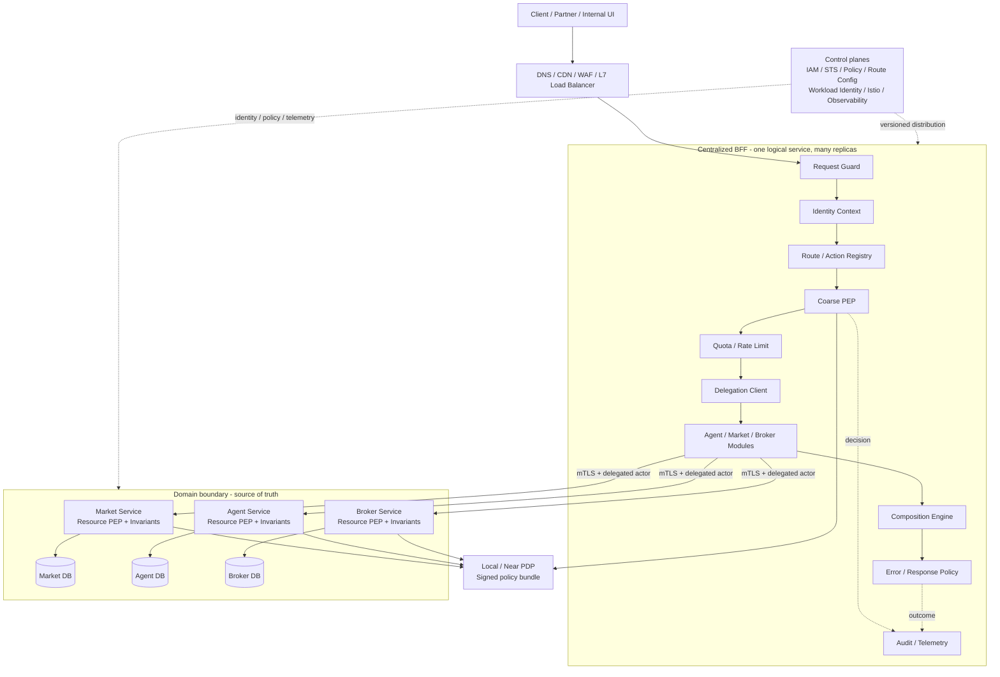
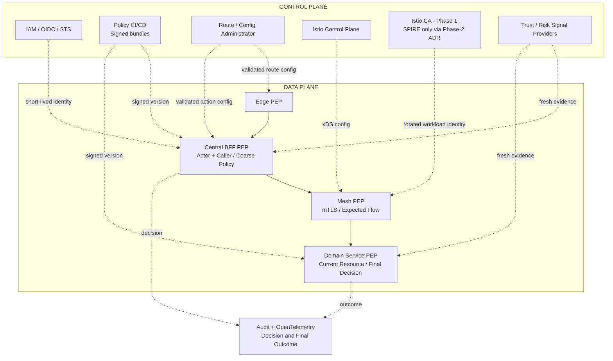
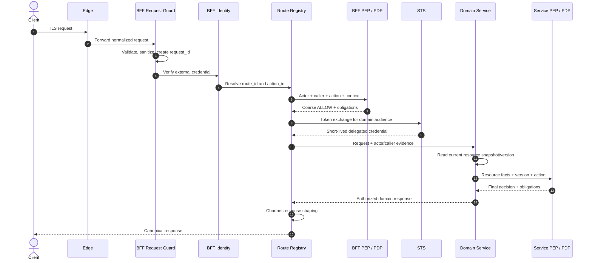
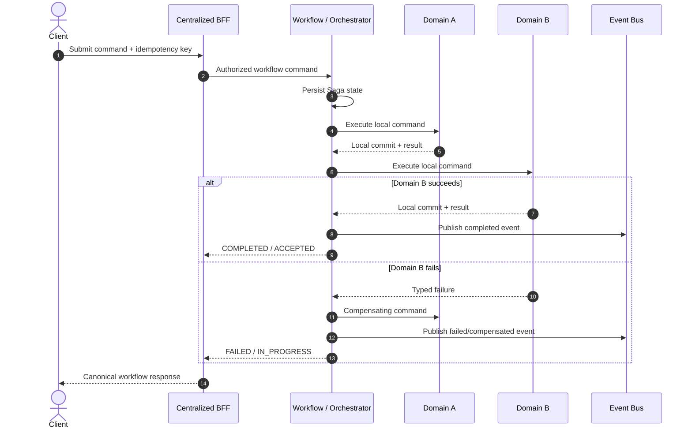
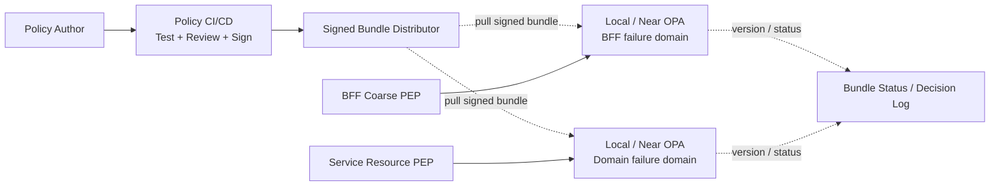
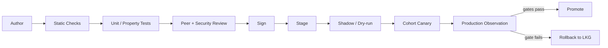
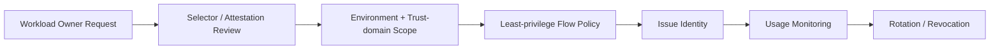
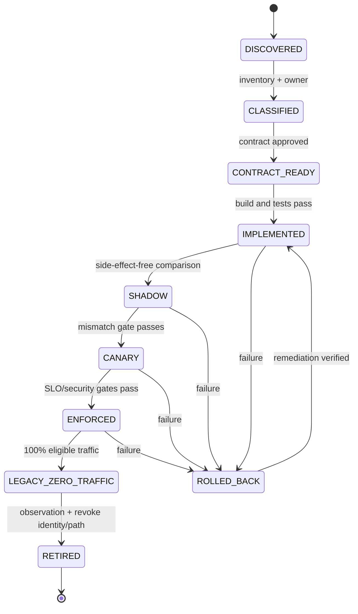

# L2 - AP-CBFF - Centralized BFF, Edge and Authorization Platform

| Thuộc tính | Giá trị |
|---|---|
| Trạng thái | READY FOR ARCHITECTURE REVIEW |
| Phiên bản | 2.0-rc1 |
| Ngày | 01/09/2026 |
| Phạm vi | Hợp nhất agent-api, market-api, core-broker-api thành một BFF logic tập trung |
| Pilot baseline | market.order.read |
| Kiến trúc khởi đầu | Modular monolith, stateless, horizontal scaling |
| Mô hình bảo mật | Zero Trust; xác thực mọi hop; policy tập trung, enforcement phân tán |
| Chuẩn chính | NIST SP 800-207/207A; SPIFFE; OAuth/OIDC; Istio; OPA; OpenTelemetry |
| Tài liệu canonical | zero-trust.md trên repository huynv-xyz/vhm |
| Tài liệu nền | TDD-Authorization-Platform.md |

---

## 0. Cách đọc và phạm vi quyết định

### 0.1 Mục tiêu chính

Tài liệu này thiết kế việc chuyển các BFF phân tán hiện tại như agent-api,
market-api và core-broker-api thành **một BFF logic tập trung**.

Một BFF logic tập trung có nghĩa:

- Một sản phẩm và một external entry point được quản trị thống nhất.
- Một route/action catalog và một bộ contract dùng chung.
- Một runtime có nhiều module, được triển khai bằng nhiều replica.
- Một vòng đời release có thể kiểm soát độc lập theo route và module.
- Không có nghĩa là một process, một pod, một node hoặc một availability zone.
- Không có nghĩa mọi business logic và mọi dữ liệu được kéo vào BFF.

Zero Trust và Istio là các cơ chế bảo vệ kiến trúc này. Chúng không thay thế
việc phân định domain, không tự giải quyết coupling và không phải lý do để đưa
business logic vào gateway.

### 0.1.1 Guardrail về tên gọi BFF

Theo pattern gốc, mỗi BFF tối ưu cho một frontend/experience. Khi agent, market
và broker dùng chung một entry point, hệ thống mới có nguy cơ thực chất trở thành
API Gateway hoặc Experience API tập trung.

Tài liệu vẫn dùng tên Centralized BFF theo ngôn ngữ của chương trình, nhưng chỉ
chấp nhận tên này khi:

- External contract vẫn được tổ chức theo channel/experience module.
- Không ép mọi channel dùng cùng một representation bất kể nhu cầu.
- Shared platform kernel không chứa business hoặc presentation rule.
- Module có owner, compatibility policy và khả năng tách riêng về sau.

Nếu route chỉ proxy và áp dụng cross-cutting control, route đó thuộc gateway
capability. Nếu route tạo representation riêng cho UI/channel, route đó thuộc
BFF module. Phân biệt này phải xuất hiện trong route inventory.

### 0.2 Đối tượng đọc

- Architecture Review Board.
- Product và Engineering owner của các BFF hiện tại.
- Domain service owner.
- Security, IAM và Platform team.
- SRE, QA, Compliance và Data Protection.

### 0.3 Từ khóa chuẩn

| Từ khóa | Ý nghĩa |
|---|---|
| MUST | Điều kiện bắt buộc để được production approval |
| MUST NOT | Hành vi bị cấm |
| SHOULD | Mặc định phải làm; ngoại lệ cần ADR |
| MAY | Tùy chọn theo bối cảnh |
| Baseline gate | Ngưỡng phê duyệt hiện hành; thay đổi cần evidence và sign-off của owner |
| Blocker | Thiếu điều kiện này thì không được chuyển traffic production |

### 0.4 Các lớp tài liệu

Tài liệu này là L2: quyết định boundary, contract, luồng, NFR và migration.
Các chi tiết triển khai phải được quản lý bằng L3 artefact:

- ADR cho quyết định khó đảo ngược.
- OpenAPI cho external API.
- Protobuf hoặc JSON Schema cho internal contract.
- Route inventory và ownership catalog.
- Policy bundle, threat model và data-flow diagram.
- Capacity model, dashboard, alert và runbook.
- Migration wave plan và rollback plan.

### 0.5 Evidence base và nguyên tắc diễn giải

TDD này được tổng hợp từ bốn lớp nguồn, theo thứ tự ưu tiên:

1. Chuẩn và best-current-practice chính thức: NIST, IETF, SPIFFE, Istio.
2. Framework vận hành: CISA Zero Trust Maturity Model.
3. Cơ chế triển khai: SPIRE, OPA, OpenTelemetry và Kubernetes/Istio.
4. Hai sách nền: Zero Trust Networks, 2nd Edition và Istio in Action.

Khi sách và tài liệu hiện hành khác nhau, tài liệu chính thức hiện hành được ưu
tiên. Ví dụ, sách Istio mô tả sidecar là data-plane chủ đạo; TDD này chọn
sidecar cho Phase 1. Ambient mode với ztunnel/waypoint chỉ được xem xét ở Phase
2 sau PoC, policy-parity test và một ADR riêng được phê duyệt.

Các ý từ sách được chuyển thành decision, không sao chép thành checklist:

| Nguồn/ý tưởng | Cách áp dụng vào TDD |
|---|---|
| Zero Trust Networks: control plane và data plane phải tách | Policy/config lifecycle tách khỏi request hot path; interface được xác thực, mã hóa |
| Enforcement phải gần resource | Coarse PEP ở BFF, resource PEP tại domain service |
| Policy engine, trust engine và data source là trách nhiệm riêng | Không gộp thành một database/service có quyền toàn năng |
| Context-aware authorization | Decision dùng actor, caller, action, resource, environment, freshness |
| Trust score có thể sai | Score chỉ là evidence; high-risk deny/step-up phải có reason và deterministic floor |
| Bắt đầu bằng inventory và scope nhỏ | Route inventory, pilot read, strangler migration |
| Istio ingress không thay API gateway/BFF | Gateway xử lý traffic; BFF xử lý API/experience contract |
| Istio traffic shifting/mirroring | Dùng cho replica/route canary và shadow read |
| Istio mTLS không đồng nghĩa authorization | STRICT mTLS kết hợp default-deny và application PEP |
| Retry có thể khuếch đại tải | Một retry owner, retry budget, idempotency và deadline |

### 0.6 Normative source profile

| Concern | Normative source | Vai trò trong thiết kế |
|---|---|---|
| Zero Trust model | NIST SP 800-207 | Tenets, PE/PA/PEP, continuous evaluation |
| Cloud-native ZTA | NIST SP 800-207A | API gateway, service mesh, identity-tier và network-tier policy |
| Maturity | CISA ZTMM v2.0 | Identity, device, network, application, data và cross-cutting capability |
| Workload identity | SPIFFE specifications | SPIFFE ID, SVID, Workload API, trust bundle/federation |
| Workload attestation | SPIRE | Node/workload attestation và automated SVID issuance |
| User/delegation token | OIDC/OAuth; RFC 8693, 8705, 9700 | Token exchange, actor/caller, audience và sender constraint |
| Service mesh | Istio security/traffic docs | mTLS, AuthorizationPolicy, gateway, rollout và telemetry |
| Policy evaluation | OPA | Local/near-PDP, signed bundle, decision logging |
| Telemetry | OpenTelemetry | W3C context, metrics, traces và correlated logs |
| API verification | OWASP API Security Top 10 | BOLA, broken auth, resource consumption, misconfiguration |

---

# 1. Executive Summary

## 1.1 Bài toán hiện tại

Các BFF phân tán thường bắt đầu từ nhu cầu riêng của channel hoặc domain, nhưng
theo thời gian cùng lặp lại:

- Xác thực token và chuẩn hóa identity.
- CORS, request hygiene, rate limit và error mapping.
- Chuyển actor context qua các hop.
- Kiểm tra quyền theo cách không đồng nhất.
- Retry, timeout, circuit breaker và telemetry.
- Mapping cùng một loại resource/action bằng tên khác nhau.
- Composition và response shaping bị trộn với business invariant.

Hệ quả là thay đổi security phải triển khai nhiều nơi; cùng một người dùng có
thể nhận quyết định khác nhau ở các BFF; đường đi đến domain service khó audit;
route cũ khó retire; và chi phí vận hành tăng theo số BFF.

## 1.2 Target architecture

Security/control topology:

Policy lifecycle được centralize; enforcement được phân tán. Không control-plane
component nào được đưa vào synchronous hot path nếu data-plane có thể evaluate
local bằng signed, valid bundle.

## 1.3 Quyết định đề nghị phê duyệt

1. Chọn **một BFF logic tập trung, triển khai nhiều replica stateless**.
2. Khởi đầu bằng **modular monolith** để giảm operational complexity.
3. Phân module theo channel/capability với dependency rule được kiểm tra tự động.
4. Centralize cross-cutting concerns và experience composition.
5. Domain service tiếp tục sở hữu dữ liệu, invariant và resource authorization.
6. Centralize policy lifecycle nhưng distribute enforcement tại BFF và service.
7. Migrate bằng Strangler theo từng route; không big-bang.
8. Pilot market.order.read trước khi mở rộng sang mutation.
9. Không cho BFF mới truy cập trực tiếp database của domain.
10. Cross-domain write phải qua application/orchestrator service, không chạy
    distributed transaction trong BFF.
11. Dùng SPIFFE identity model; Phase 1 mặc định Istio CA, SPIRE chỉ khi gate
    attestation/federation/off-mesh được chứng minh.
12. Dùng OAuth token exchange cho on-behalf-of; không forward raw external token.
13. Pilot OPA evaluator co-located với BFF và canonical engine-neutral contract;
    không gọi remote PDP trên request hot path.
14. Chọn Istio sidecar cho Phase 1; STRICT mTLS và expected-flow default-deny là
    outcome bắt buộc. Ambient chỉ được đưa vào Phase 2 qua ADR và PoC riêng.
15. Dùng OpenTelemetry cho trace/metric/log correlation, nhưng không dùng baggage
    để truyền trusted authorization context.

## 1.4 Quyết định không được hiểu sai

| Cách hiểu sai | Quyết định đúng |
|---|---|
| Một BFF nghĩa là một instance | Một service logic, nhiều replica và nhiều AZ |
| Gom BFF là gom database | Mỗi domain tiếp tục sở hữu database |
| Gateway quyết định mọi quyền | Gateway coarse-check; domain quyết định quyền resource cuối cùng |
| Aggregation nào cũng nằm ở BFF | Chỉ experience composition; workflow nghiệp vụ nằm ở application service |
| Service mesh tạo ra Zero Trust | Mesh chỉ cung cấp identity, mTLS và enforcement primitive |
| Một release phải bật toàn bộ route | Bật, rollback và quan sát theo route/cohort |
| Modular monolith là không có module | Boundary phải được kiểm tra tại build và runtime |

## 1.5 Production blockers

- Chưa có route inventory đầy đủ và owner cho mọi route.
- Chưa phân loại logic trong các BFF cũ theo taxonomy tại mục 4.
- Chưa có baseline traffic, latency, payload, error và dependency fan-out.
- Chưa chứng minh caller/actor context không thể giả mạo.
- Chưa có service-side PEP coverage cho route được migrate.
- Chưa có route-level rollback và khả năng đưa traffic về BFF cũ.
- Chưa có load/chaos result và capacity model.
- Chưa có data classification và audit retention phê duyệt.
- Chưa xác định SLO từ baseline thực tế.
- Chưa revoke được identity và network path của BFF cũ sau cutover.
- Chưa triển khai và kiểm thử Istio CA authority, trust-domain tách theo môi
  trường và nguyên tắc không federation trong Phase 1.
- Chưa có signed policy bundle, LKG/freshness ceiling và rollback drill.
- Chưa chứng minh STRICT mTLS/default-deny không còn bypass path.
- Chưa có sidecar policy, performance và failure-mode evidence cho Phase 1.
- Chưa có token-exchange profile và replay/audience negative tests.

---

# 2. Business Outcomes, Scope and Success Measures

## 2.1 Business outcomes

| ID | Outcome | Cách đo |
|---|---|---|
| BO-01 | Một contract truy cập thống nhất | Tỷ lệ route dùng canonical context và error contract |
| BO-02 | Giảm duplication | Số implementation auth/rate-limit/audit bị retire |
| BO-03 | Giảm lead time security change | Thời gian từ policy approval đến enforcement |
| BO-04 | Giảm inconsistency | Số route tương đương nhưng cho kết quả quyền khác nhau |
| BO-05 | Tăng khả năng audit | Tỷ lệ request nhạy cảm nối được actor, caller, decision, outcome |
| BO-06 | Migration không gián đoạn | Error/latency delta của cohort mới so với control |
| BO-07 | Không tạo central blast radius | Sự cố một domain không kéo sập route domain khác |

## 2.2 In scope

- External entry point thống nhất.
- Route/action registry.
- Request validation, authentication integration và canonical identity context.
- Coarse authorization tại BFF.
- Delegation/token exchange đến downstream.
- Rate limit, quota, timeout budget và request size control.
- Channel-specific composition và response shaping.
- Consistent error contract.
- Audit, metrics và distributed tracing.
- Module boundary và ownership.
- Route-by-route migration từ BFF cũ.
- Istio/mTLS/workload identity cho east-west traffic.
- Policy lifecycle và PDP integration liên quan tới BFF.

## 2.3 Out of scope

- Hợp nhất database các domain.
- Đưa business invariant vào BFF.
- BFF ghi trực tiếp vào database domain.
- Dùng BFF làm ESB tổng quát.
- Distributed transaction hoặc two-phase commit tại BFF.
- Thay thế IAM/IdP.
- Thay thế domain application service.
- Viết lại toàn bộ domain service trong cùng một release.
- Multi-region active-active trước khi có yêu cầu và capacity evidence.
- Chuẩn hóa mesh mode cho toàn doanh nghiệp ngoài phạm vi BFF Phase 1.

## 2.4 Success measures cho pilot

Các ngưỡng dưới đây là baseline gate cho pilot. Owner MAY đề nghị điều chỉnh
sau khi có số đo legacy, nhưng mọi thay đổi phải có SRE, Security và Product
sign-off trước G3.

| Chỉ số | Baseline gate |
|---|---|
| Functional mismatch giữa shadow và legacy | 0 mismatch nghiêm trọng; dưới 0.1% mismatch đã phân loại |
| Unexpected allow | 0 |
| Authentication/authorization bypass | 0 |
| Error-rate delta | Không xấu hơn control quá 0.2 điểm phần trăm |
| p95 latency delta | Không xấu hơn control quá 10% hoặc 20 ms, lấy ngưỡng chặt hơn |
| Audit linkage | Tối thiểu 99.99% request nhạy cảm |
| Route rollback | Hoàn thành trong 10 phút, không deploy code |
| Cross-domain failure containment | Domain lỗi không làm vượt SLO route độc lập |
| Legacy traffic sau cutover | 0 trong observation window đã duyệt |

---

# 3. Architecture Principles and Invariants

## 3.1 Invariants

1. **Logically centralized, physically distributed.**
2. BFF MUST stateless đối với business transaction.
3. BFF MUST NOT sở hữu source of truth của domain resource.
4. BFF MUST NOT truy cập trực tiếp domain database.
5. Domain service MUST kiểm tra quyền resource cuối cùng.
6. Mỗi request MUST có actor và caller được phân biệt rõ.
7. Header identity từ client MUST bị xóa trước khi tạo trusted context.
8. Mọi hop nội bộ MUST xác thực workload bằng mTLS hoặc cơ chế tương đương.
9. Route/action MUST lấy từ registry; không suy diễn tự do từ URL.
10. Deadline chỉ giảm qua mỗi hop; downstream không được tự nới deadline.
11. Mutation retry chỉ được phép khi có idempotency contract.
12. Một module/domain lỗi MUST không chiếm hết tài nguyên runtime.
13. Config/policy MUST versioned, signed, canary và rollback được.
14. Security decision MUST fail closed khi không có chứng cứ đủ mới.
15. Audit record MUST liên kết được request, decision và final outcome.

## 3.2 Why modular monolith first

Modular monolith là lựa chọn mặc định cho giai đoạn hợp nhất vì:

- Contract và operational model còn đang được chuẩn hóa.
- Tách quá sớm tạo thêm network hop và release coordination.
- Cùng runtime giúp migration nhanh nhưng vẫn cho phép boundary rõ.
- Có thể extract module khi có bằng chứng về scale, release cadence,
  ownership hoặc security isolation.

Điều kiện bắt buộc để modular monolith không trở thành god service:

- Mỗi module có owner, public interface và dependency direction.
- Không module nào đọc table hoặc repository của module khác.
- Shared kernel nhỏ, chỉ chứa primitive ổn định.
- Cross-module call qua interface, không gọi implementation trực tiếp.
- Build phải fail khi vi phạm dependency rule.
- Metrics, timeout, concurrency và feature flag tách theo module.
- Route được enable/disable độc lập với release.

## 3.3 Khi nào được tách module thành service

Một module chỉ SHOULD được tách khi có ít nhất một bằng chứng:

- Scale profile khác biệt lớn và ổn định.
- Blast-radius requirement đòi process isolation.
- Release cadence độc lập có lợi ích đo được.
- Security boundary yêu cầu runtime/identity riêng.
- Team ownership độc lập và contract đã ổn định.
- Technology/runtime thực sự khác.

Việc tách phải có ADR và không làm thay đổi external contract.

## 3.4 NIST Zero Trust tenets áp dụng

| Tenet | Invariant của platform |
|---|---|
| Mọi data source và compute service là resource | Route, service, workflow, policy và audit đều có owner/classification |
| Mọi giao tiếp được bảo vệ bất kể network location | North-south TLS; east-west mTLS; không có trusted subnet |
| Access theo từng session/request | Credential và decision có TTL; stream/session phải re-evaluate |
| Access do dynamic policy quyết định | Actor, caller, resource, device/context, threat và freshness |
| Theo dõi integrity/security posture | Workload attestation, artifact provenance, vulnerability state |
| AuthN/AuthZ trước khi cấp access | BFF kiểm tra entry; service kiểm tra resource trước effect |
| Thu thập telemetry để cải thiện posture | Decision/outcome correlation, anomaly signal, feedback loop |

Không coi một lần đăng nhập hoặc một mTLS handshake là đủ cho toàn bộ chuỗi.
Mỗi enforcement point chỉ tin evidence được xác minh, đúng audience và còn hạn.

## 3.5 Trust model

Trust không phải boolean cố định gắn vào user, device hoặc workload. Một access
decision được tính trên tuple:

    Decision = f(
      actor identity and authentication strength,
      caller workload identity and attestation,
      requested action,
      current resource snapshot,
      tenant and channel,
      device/session posture when relevant,
      threat/anomaly signals,
      policy and evidence versions,
      time and requested duration
    )

Quy tắc:

- Evidence MUST có provider, observed_at, valid_until và version.
- Unknown/stale evidence không được tự chuyển thành trusted.
- High-risk action có deterministic security floor; ML/anomaly score không được
  tự mình tạo ALLOW.
- Trust score MAY yêu cầu step-up, giảm quyền hoặc deny; phải có reason code.
- Score raw không được lộ cho client vì dễ bị game và khó ổn định contract.
- Policy owner phải định nghĩa behavior khi từng provider unavailable.

---

# 4. Current-State Discovery and Decomposition

## 4.1 Route inventory bắt buộc

Không bắt đầu migrate trước khi mọi route in-scope có một record:

| Trường | Mô tả |
|---|---|
| legacy_bff | agent-api, market-api hoặc core-broker-api |
| method_path | HTTP method và normalized path |
| route_id | ID ổn định, không chứa version URL |
| action_id | Canonical business action |
| channel | agent, market, broker, partner hoặc internal |
| owner | Team chịu trách nhiệm hiện tại |
| consumers | Client/version đang sử dụng |
| authn | Token/credential hiện tại |
| authz | Check và vị trí check hiện tại |
| downstreams | Danh sách dependency |
| db_access | Database/table được gọi trực tiếp nếu có |
| logic_classes | Các loại logic theo taxonomy |
| traffic | RPS avg/peak, concurrency |
| latency | p50/p95/p99 |
| errors | Tỷ lệ và taxonomy lỗi |
| payload | p50/p95/max request/response |
| data_class | Public, internal, confidential, restricted |
| idempotency | Cơ chế dedup hiện tại |
| migration_wave | Thứ tự migrate |
| rollback_route | Đường quay lại legacy |
| target_owner | Owner sau migrate |

## 4.2 Taxonomy phân rã route

| Loại logic trong BFF cũ | Đích đến | Ví dụ |
|---|---|---|
| Pure proxy/routing | Edge hoặc route adapter mỏng | Rewrite path, header allowlist |
| Cross-cutting | Central platform | AuthN, context, quota, telemetry |
| Channel composition | Central BFF module | Gom read model cho màn hình |
| Response presentation | Central BFF module | Rename field, locale, pagination envelope |
| Domain invariant | Domain service | Trạng thái nào được cancel order |
| Resource authorization | Domain service PEP | Actor có sở hữu order hay không |
| Cross-domain workflow | Application/orchestrator service | Mở account và phát hành benefit |
| Async/background job | Domain worker | Reconciliation, report generation |
| Shared lookup source of truth | Owning domain service | Product status, customer tier |
| Accidental DB access | Domain API mới rồi retire DB path | Query thẳng market database |

## 4.3 Decision tree cho từng handler

1. Logic có quyết định trạng thái hợp lệ của domain?
   Nếu có, chuyển vào domain service.
2. Logic có điều phối write qua nhiều domain?
   Nếu có, chuyển vào application/orchestrator service với Saga.
3. Logic chỉ tạo representation dành riêng cho channel?
   Nếu có, giữ trong BFF module.
4. Logic dùng chung cho mọi route và không chứa business meaning?
   Nếu có, chuyển vào central platform kernel.
5. Logic chỉ proxy và không thêm giá trị?
   Nếu có, route trực tiếp tại edge chỉ khi giữ đủ security control; nếu không,
   loại bỏ route.
6. Logic không có owner hay test?
   Đánh dấu blocker, không copy nguyên trạng.

## 4.4 Anti-corruption layer

Trong migration, adapter của từng legacy route MAY dịch:

- Legacy path sang route_id/action_id.
- Legacy token sang canonical actor context sau khi xác minh.
- Legacy error sang canonical error.
- Legacy field name sang target response.

Adapter MUST NOT trở thành nơi chứa business rule mới. Mỗi adapter có ngày retire,
owner và dashboard usage.

## 4.5 Deliverable discovery

- Current-state context diagram.
- Route inventory được owner sign-off.
- Dependency graph và fan-out map.
- Direct database access register.
- Business-rule extraction backlog.
- Consumer/version compatibility matrix.
- Baseline performance report.
- PII/restricted-data map.

---

# 5. Target Component Architecture

## 5.1 Edge layer

Trách nhiệm:

- TLS termination theo policy.
- DDoS/WAF, connection limit và coarse IP/partner controls.
- Host/path routing đến Centralized BFF.
- Request body hard limit.
- Canary routing theo route/cohort header tin cậy.

Edge MUST NOT:

- Suy diễn domain ownership.
- Thực hiện resource authorization.
- Chèn actor header chưa được BFF xác minh.
- Chứa workflow nghiệp vụ.

## 5.2 Centralized BFF runtime

### 5.2.1 Request Guard

- Chuẩn hóa method, path, content type và encoding.
- Chặn request smuggling, ambiguous path và oversized payload.
- Xóa mọi header nội bộ do external caller gửi.
- Tạo request_id và attempt_id nếu chưa có.
- Xác nhận API version và consumer compatibility.

### 5.2.2 Identity Context

- Xác minh token bằng issuer, audience, signature, time và token class.
- Resolve actor_type, actor_id, tenant và authentication strength.
- Tách actor khỏi caller workload.
- Không đưa raw access token vào log hoặc downstream header.

### 5.2.3 Route and Action Registry

Registry là source of truth cho:

- route_id, method và normalized template.
- action_id và action risk class.
- module owner.
- permitted channel/client.
- required authentication strength.
- coarse policy set.
- downstream target và timeout budget.
- idempotency requirement.
- audit durability mode.
- migration state và legacy fallback.

Registry MUST versioned, reviewed, signed, canary và rollback được.

### 5.2.4 Coarse Policy Enforcement Point

BFF PEP kiểm tra:

- Route/channel có được phép gọi không.
- Token có đúng class/audience không.
- Tenant boundary hiển nhiên.
- Required auth strength.
- Request context và global deny.
- Rate/quota entitlement.

BFF PEP không thay domain PEP. Kết quả allow tại BFF chỉ cho phép request đi tiếp.

### 5.2.5 Delegation Client

- Đổi external credential thành internal short-lived credential.
- Bind actor, caller, audience, scope, action và tenant.
- Hạn chế hop/delegation chain.
- Không forward raw external bearer token nếu không có exception ADR.

### 5.2.6 Channel modules

Module baseline:

- agent-experience.
- market-experience.
- broker-experience.
- partner-experience nếu có.
- shared-platform-kernel.

Mỗi module sở hữu:

- External endpoint/representation dành cho channel.
- Mapping route vào use case.
- Read composition và response shaping.
- Compatibility adapter có thời hạn.

Module không sở hữu:

- Domain entity source of truth.
- Business invariant.
- Repository đến domain database.
- Policy quyết định ownership của resource.

### 5.2.7 Composition engine

Composition engine hỗ trợ:

- Parallel read có bounded concurrency.
- Per-downstream deadline.
- Required và optional dependency.
- Partial response chỉ khi contract công khai cho phép.
- Response provenance và stale indicator nếu dùng cached read.
- Cancellation khi client deadline hết.

Composition engine MUST NOT:

- Chạy distributed transaction.
- Retry mutation mù.
- Nuốt lỗi domain rồi trả success giả.
- Tự xây workflow state lâu dài.

### 5.2.8 Response and Error Policy

- Chuẩn hóa canonical error.
- Chặn leakage của stack trace/internal topology.
- Áp dụng masking obligation.
- Gắn deprecation/sunset headers khi cần.
- Không biến domain deny thành not-found nếu contract chưa quy định.

### 5.2.9 Audit and Telemetry

- Metrics theo route, action, module, tenant class và downstream.
- Trace liên kết edge, BFF, PDP và domain.
- Decision log không chứa secret.
- Enforcement outcome sau khi downstream hoàn tất.

## 5.3 Domain services

Mỗi domain service:

- Sở hữu resource và invariant.
- Sở hữu database.
- Xác thực caller workload.
- Xác minh delegation hoặc trusted context.
- Enforce resource-level authorization.
- Thực hiện mutation atomically trong domain boundary.
- Phát domain event theo outbox nếu cần.
- Trả typed error và resource version.

Domain MUST NOT tin một boolean allowed do BFF gửi. Domain nhận evidence đã ký và
tự gọi/evaluate policy cần thiết cho resource hiện tại.

## 5.4 Application/orchestrator services

Khi use case là cross-domain write:

- Orchestrator sở hữu workflow state.
- Dùng Saga/compensation.
- Có idempotency và timeout policy.
- Giao tiếp domain qua public command contract.
- Phát tiến trình cho BFF/client nếu là long-running operation.

BFF chỉ khởi tạo hoặc truy vấn workflow; không sở hữu state machine.

## 5.5 Policy components

| Thành phần | Trách nhiệm |
|---|---|
| Policy Administration | Author, review, test, sign, publish, rollback |
| Policy Information | Cung cấp attribute có provenance và freshness |
| PDP | Tính decision từ policy và evidence |
| BFF PEP | Coarse enforcement và obligations phù hợp |
| Service PEP | Resource/fine-grained enforcement |
| Audit pipeline | Decision, enforcement outcome, governance evidence |

## 5.6 Istio/service mesh

Mesh cung cấp:

- Workload identity.
- STRICT mTLS sau migration.
- AuthorizationPolicy chống unexpected flow.
- Egress control nếu nằm trong scope.
- Telemetry và traffic control.

Application vẫn phải:

- Phân biệt actor và caller.
- Kiểm tra action/resource.
- Áp dụng invariant.
- Validate data và idempotency.

## 5.7 Mapping NIST Policy Engine, Administrator và Enforcement Point

| NIST logical component | Implementation trong target |
|---|---|
| Policy Engine | OPA evaluator hoặc PDP tương thích canonical decision contract |
| Policy Administrator | Policy CI/CD, bundle signer/publisher, route/config control |
| Policy Enforcement Point | Edge, BFF coarse PEP, mesh L4/L7 PEP và service resource PEP |
| Policy Information Points | IAM, entitlement, domain resource facts, posture/threat providers |
| Control plane | IAM/STS, policy/config distribution, SPIFFE authority, Istio control plane |
| Data plane | Edge proxy, BFF replicas, Envoy/ztunnel/waypoint, service PEP |

Logical separation là bắt buộc; physical deployment MAY co-locate một số thành
phần sau threat model. Data plane không có quyền sửa policy, trust registry hoặc
signing key. Control-plane identity không được dùng để phục vụ business traffic.

## 5.8 Framework adoption decision

| Framework | Decision | Lý do | Điều kiện/giới hạn |
|---|---|---|---|
| NIST 800-207/207A | ADOPT | Canonical architecture và cloud-native mapping | Không phải product implementation |
| CISA ZTMM v2.0 | ADOPT for assessment | Maturity roadmap và cross-cutting governance | Không dùng như runtime protocol |
| SPIFFE | ADOPT | Portable workload identity vocabulary | Phải chốt trust-domain design |
| Istio identity/CA | DEFAULT Phase 1 | Đã gắn với mesh, tự cấp/rotate SVID-compatible cert | Chỉ nếu toàn bộ in-scope workload ở mesh |
| SPIRE | CONDITIONAL | Attestation/federation/off-mesh/heterogeneous workload | Không triển khai song song authority mơ hồ |
| Istio sidecar | ADOPT Phase 1 | Mature L7 traffic/security model và ext-authz placement rõ | Đặt resource request/limit và scope outbound config |
| Istio ambient | DEFER Phase 2 | Có thể giảm per-pod proxy footprint | Chỉ qua ADR riêng sau PoC policy parity, identity và failure mode |
| OPA | PILOT | Policy-as-code, local eval, Envoy integration, signed bundle | Canonical contract không khóa engine |
| OpenTelemetry | ADOPT | Vendor-neutral trace/metric/log correlation | Baggage allowlist; không chở auth context |
| OAuth Token Exchange | ADOPT profile | Chuẩn hóa on-behalf-of/delegation | STS phải giới hạn audience/scope/hop |
| mTLS/DPoP-bound token | CONDITIONAL high-risk | Giảm bearer-token replay | Chọn theo client/resource capability |

## 5.9 Recommended production profile

Phase 1:

- Edge/API gateway chuyên dụng trước Centralized BFF.
- Centralized BFF modular monolith, nhiều replica.
- Istio mesh với workload identity, mTLS migration đến STRICT.
- Default-deny AuthorizationPolicy theo expected-flow inventory.
- OPA local/near evaluator cho coarse policy pilot; domain PEP giữ final say.
- OAuth token exchange cho BFF-to-service on-behalf-of.
- OpenTelemetry Collector tách khỏi request correctness.
- Istio CA là default authority nếu phạm vi chỉ Kubernetes mesh.

Phase 2 chỉ khi có evidence:

- SPIRE cho workload attestation sâu hơn, VM/off-mesh hoặc federation.
- Ambient mode/waypoint chỉ qua ADR riêng nếu PoC chứng minh policy parity và
  operational benefit vượt chi phí migration.
- Sender-constrained token cho high-risk/partner integration.
- Trust/risk engine sử dụng anomaly signal sau khi deterministic controls ổn định.

---

# 6. Ownership and Dependency Model

## 6.1 Responsibility matrix

| Capability | Edge | Central BFF | PDP/Policy | Domain | Orchestrator |
|---|---|---|---|---|---|
| DDoS/WAF | A/R | C | I | I | I |
| External AuthN | C | A/R | C | V | I |
| Route/action mapping | I | A/R | C | C | I |
| Coarse AuthZ | I | R | A/R | V | V |
| Resource AuthZ | I | C | R | A/R | A/R cho workflow resource |
| Rate limit | C | A/R | C | C | C |
| Channel composition | I | A/R | I | C | I |
| Business invariant | I | I | C | A/R | C |
| Cross-domain workflow | I | I | C | C | A/R |
| Domain data | I | I | C | A/R | I |
| Audit correlation | C | A/R | R | R | R |

Ký hiệu: A accountable, R responsible, C consulted, I informed, V verifies.

## 6.2 Dependency rules

Allowed:

    edge -> bff
    bff module -> shared platform kernel
    bff module -> domain public API
    bff module -> orchestrator public API
    bff/service PEP -> PDP or local policy evaluator
    orchestrator -> domain public API

Forbidden:

    bff -> domain database
    bff module A -> repository/internal implementation của module B
    domain -> bff
    policy -> gọi network tùy ý trong decision hot path
    client -> service qua đường bypass không được inventory
    legacy bff -> central bff -> legacy bff loop

## 6.3 Shared kernel admission rule

Một component chỉ được đưa vào shared kernel nếu:

- Không có business vocabulary riêng của một domain.
- Có ít nhất hai consumer hợp lệ.
- Contract ổn định và backward-compatible.
- Có owner và test.

Các helper tình cờ giống nhau SHOULD được duplicate nhỏ thay vì tạo coupling sai.

---

# 7. Functional Requirements

## 7.1 Request and routing

| ID | Requirement | Acceptance |
|---|---|---|
| FR-01 | Nhận request qua một logical entry point | DNS/LB route đến healthy replica |
| FR-02 | Map request vào route_id/action_id ổn định | Unknown/ambiguous route bị deny |
| FR-03 | Loại bỏ untrusted internal headers | Negative test không giả mạo được actor/caller |
| FR-04 | Validate schema và payload limit | Invalid input bị từ chối trước downstream |
| FR-05 | Version và deprecation | Consumer thấy contract/version rõ |

## 7.2 Identity, policy and delegation

| ID | Requirement | Acceptance |
|---|---|---|
| FR-06 | Xác minh issuer, audience, signature, expiry | Token sai bị deny |
| FR-07 | Tách actor và caller | Audit thể hiện cả hai |
| FR-08 | Coarse AuthZ tại BFF | Không gọi domain khi bị coarse deny |
| FR-09 | Fine AuthZ tại service | Bypass BFF vẫn không vượt quyền |
| FR-10 | Internal delegation ngắn hạn | Audience/action/tenant bị bind |
| FR-11 | Decision có thời hạn hiệu lực | Cache không dùng quá valid_until |
| FR-12 | Global deny/revocation | Có bounded propagation và drill |

## 7.3 Composition and downstream

| ID | Requirement | Acceptance |
|---|---|---|
| FR-13 | Parallel read có giới hạn | Không tạo unbounded fan-out |
| FR-14 | Deadline propagation | Mỗi hop chỉ giảm budget |
| FR-15 | Optional dependency contract | Partial response có indicator |
| FR-16 | Mutation idempotency | Retry không tạo duplicate effect |
| FR-17 | Typed downstream error | Không map mọi lỗi thành 500 |
| FR-18 | Cancellation | Client timeout giải phóng downstream work |

## 7.4 Operations and migration

| ID | Requirement | Acceptance |
|---|---|---|
| FR-19 | Route feature flag | Enable/disable không deploy code |
| FR-20 | Cohort canary | Chia traffic ổn định, audit được |
| FR-21 | Shadow comparison | Không gây side effect |
| FR-22 | Route-level rollback | Quay về legacy trong gate |
| FR-23 | Per-module isolation | Một module quá tải không chiếm toàn runtime |
| FR-24 | Legacy retirement evidence | Zero traffic và identity revoked |

## 7.5 Workload, policy and continuous trust

| ID | Requirement | Acceptance |
|---|---|---|
| FR-25 | Mỗi workload có identity riêng | Không dùng chung service account giữa BFF/domain khác quyền |
| FR-26 | Automated credential rotation | Rotation không restart và không outage trong test |
| FR-27 | Workload attestation | Identity chỉ cấp cho selector/provenance hợp lệ |
| FR-28 | Expected-flow allowlist | Unknown service path bị deny tại mesh và/hoặc service |
| FR-29 | Signed policy bundle | Bundle sai/chưa ký không activate |
| FR-30 | Policy last-known-good | Mất control plane không làm data plane nhận policy rỗng |
| FR-31 | Evidence provenance/freshness | Stale/unknown xử lý đúng action profile |
| FR-32 | Revocation propagation | Đạt security bound đã duyệt và có drill |
| FR-33 | Session/stream re-evaluation | Long-lived access bị thu hồi có bounded delay |
| FR-34 | Egress allowlist | BFF chỉ gọi declared destination |

## 7.6 Framework-specific requirements

| ID | Requirement | Acceptance |
|---|---|---|
| FR-35 | SPIFFE ID taxonomy ổn định | Không chứa pod UID/IP/ephemeral instance |
| FR-36 | Trust-domain separation | Prod/non-prod và security domain không chia root vô ý |
| FR-37 | Istio STRICT end state | Không còn plaintext path in-scope |
| FR-38 | Ambient L7 policy placement nếu dùng | Waypoint/ztunnel identity semantics được test |
| FR-39 | OAuth delegation | subject, actor, audience, action, expiry và chain bound |
| FR-40 | OPA/local PDP health | Bundle version và decision readiness observable |
| FR-41 | W3C trace propagation | request/trace/outcome nối được qua hop |
| FR-42 | Baggage minimization | Không có raw token, role list, PII nhạy cảm |

---

# 8. Canonical Contracts

## 8.1 External request envelope

HTTP vẫn là transport chính, nhưng BFF MUST tạo canonical context:

    request_id: UUID
    attempt_id: UUID
    business_operation_id: optional string
    route_id: market-order-get
    action_id: market.order.read
    channel: market
    api_version: v1
    received_at: timestamp
    deadline_at: timestamp
    client:
      id: verified client id
      version: optional
    actor:
      type: HUMAN | SERVICE
      id: immutable subject
      tenant_id: immutable tenant
      authn_strength: loa/amr
      credential_expires_at: timestamp
    caller:
      workload_id: verified workload identity
      delegation_id: optional

Client-supplied request_id MAY được giữ làm external_correlation_id nhưng không
được dùng làm trusted unique ID nếu không validate.

## 8.2 Trusted downstream context

Ưu tiên internal credential có chữ ký hoặc token exchange. Nếu dùng header:

- Header chỉ được chèn tại trusted proxy/BFF.
- Mesh policy chỉ cho identity BFF gọi service tương ứng.
- Service phải reject header nếu caller identity không hợp lệ.
- Context phải có expiry, audience và integrity protection.

Tối thiểu:

    actor_id
    actor_type
    tenant_id
    caller_workload_id
    audience
    action_id
    issued_at
    expires_at
    delegation_id
    request_id
    policy_context_version

## 8.3 Authorization request

    contract_version: 1
    request_id: UUID
    attempt_id: UUID
    action_id: market.order.read
    actor:
      id: subject
      type: HUMAN
      tenant_id: tenant-1
      authn_strength: MFA
      entitlement_version: 42
    caller:
      workload_id: spiffe://trust-domain/ns/prod/sa/central-bff
      delegation_id: UUID
    resource:
      type: market.order
      id: order-1
      version: 17
    environment:
      request_time: timestamp
      channel: market
      network_zone: external
    facts:
      owner_id:
        value: subject
        source: market-service
        observed_at: timestamp

Unknown field behavior và maximum payload phải được version contract định nghĩa.

## 8.4 Authorization decision

    contract_version: 1
    decision_id: UUID
    effect: ALLOW | DENY | INDETERMINATE
    reason_code: stable machine-readable code
    policy_bundle_id: git hash or signed version
    evaluated_at: timestamp
    valid_until: timestamp
    evidence_versions:
      entitlement_version: 42
      resource_version: 17
    obligations:
      - type: MASK_FIELDS
        parameters:
          fields: [sensitive_field]
    cache:
      permitted: true
      max_age_ms: 500

Cache expiry MUST là giá trị nhỏ nhất của:

- valid_until của decision.
- credential expiry.
- policy/evidence freshness.
- action-level security ceiling.
- emergency revocation bound.

DENY và INDETERMINATE có TTL riêng; không suy diễn từ ALLOW.

## 8.5 Same-snapshot resource authorization

Đối với rule phụ thuộc resource state:

- Domain service đọc resource và version.
- PEP tạo decision request từ chính snapshot đó.
- Mutation dùng optimistic condition trên cùng version.
- Nếu version đổi, service phải re-evaluate hoặc fail conflict.

Không được:

- BFF đọc resource, PDP allow, rồi service mutate bản mới hơn mà không kiểm tra.
- Tin resource fact do client gửi.
- Cache ownership lâu hơn freshness contract.

## 8.6 Canonical error

    error:
      code: stable_code
      category: AUTHENTICATION | AUTHORIZATION | VALIDATION |
                CONFLICT | RATE_LIMIT | DEPENDENCY | INTERNAL
      message: safe localized or generic message
      retryable: false
      request_id: UUID
      details: optional allowlisted fields

Mapping tối thiểu:

| Điều kiện | HTTP | Quy tắc |
|---|---:|---|
| Credential thiếu/sai | 401 | Không tiết lộ policy |
| Đã xác thực nhưng bị deny | 403 | Stable reason class |
| Resource visibility policy | 404 hoặc 403 | Phải nhất quán theo domain |
| Schema sai | 400 | Field-level safe detail |
| Version conflict | 409 | Không retry mù |
| Quota/rate limit | 429 | Retry-After nếu có |
| Deadline hết | 504 | Không đổi thành success |
| Dependency unavailable | 503 | Theo required/optional contract |

## 8.7 Enforcement outcome

Decision allow không đồng nghĩa action đã thành công. BFF/service phải emit:

    request_id
    attempt_id
    decision_id
    route_id
    action_id
    actor_id_hash
    caller_workload_id
    downstream_service
    enforcement_result
    final_outcome
    status_code
    latency_ms
    completed_at

## 8.8 Route registry record

    route_id: market-order-get
    method: GET
    path_template: /v1/market/orders/{orderId}
    action_id: market.order.read
    owner_module: market-experience
    risk_class: READ_SENSITIVE
    authn_profile: USER_MFA_OR_VALID_SESSION
    coarse_policy: market-entry-v3
    downstream:
      service: market-service
      operation: GetOrder
      timeout_ms: 350
    audit_mode: BUFFERED_DURABLE
    migration:
      state: SHADOW
      legacy_target: market-api
      cohort_percent: 0

---

# 9. Detailed Request Flows

## 9.1 External authenticated read

Failure rules:

- AuthN/AuthZ unavailable: fail closed cho protected route.
- Optional enrichment unavailable: partial response chỉ khi declared.
- Domain deny: BFF không override.
- Deadline hết: cancel outstanding calls.

## 9.2 Aggregated read

1. BFF coarse-authorizes action.
2. Module tạo fan-out plan từ static code/config đã review.
3. Gọi required dependencies với bounded parallelism.
4. Mỗi domain tự authorize resource.
5. Optional result có per-field provenance/status.
6. BFF compose representation.
7. Audit chứa dependency result summary, không chứa raw sensitive payload.

Fan-out MUST có hard maximum. Dynamic fan-out từ client input phải validate và quota.

## 9.3 Single-domain mutation

1. Validate idempotency key và request schema.
2. Coarse authorize tại BFF.
3. Mint delegation đúng audience/action.
4. Domain đọc current snapshot.
5. Service PEP authorize snapshot/version.
6. Domain kiểm tra invariant và commit local transaction.
7. Domain ghi outbox nếu có event.
8. BFF trả outcome; không tự suy diễn commit.

## 9.4 Cross-domain command

- BFF chỉ submit command và trả accepted/result.
- Workflow service sở hữu state machine.
- Mỗi domain commit local transaction.
- Workflow có idempotency, retry policy và compensation.
- Client có status endpoint hoặc event notification.

## 9.5 Service-to-service

Nếu không có human actor:

- actor_type là SERVICE.
- caller là workload thực hiện hop hiện tại.
- Policy phân biệt machine permission với user delegation.

Nếu có on-behalf-of:

- actor vẫn là human/service gốc.
- caller thay đổi theo mỗi hop.
- delegation chain có hop limit và audience.

## 9.6 Async

BFF không giữ HTTP connection cho job dài nếu không cần.

- Submit command với business_operation_id và idempotency key.
- Worker xác thực producer identity và signed actor context.
- Consumer re-authorize tại execution time khi action nhạy cảm.
- Event schema có version, tenant và provenance.
- Poison message vào DLQ với redacted evidence.

## 9.7 Legacy shadow

- Chỉ shadow read hoặc request đã biến thành side-effect-free.
- Không nhân đôi mutation.
- So sánh normalized response, decision, latency và dependency graph.
- Sensitive payload không được lưu toàn bộ chỉ để diff.
- Mismatch có taxonomy và owner.

---

# 10. Zero Trust Security Architecture

## 10.1 Trust boundaries

| Boundary | Không được tin mặc định | Control |
|---|---|---|
| Internet to Edge | IP, header, token claim chưa verify | TLS, WAF, validation |
| Edge to BFF | Forwarded identity header | Workload mTLS và header sanitization |
| BFF to Domain | BFF là trusted superuser | Narrow identity, delegation, service PEP |
| Service to PDP | Resource fact không có provenance | Signed channel, schema, freshness |
| Control to Data Plane | Config/policy mới luôn đúng | Signature, canary, rollback |
| Legacy to New | Legacy context là canonical | Anti-corruption adapter và verification |

## 10.2 Actor and caller

Ví dụ một user đi qua Centralized BFF đến market-service:

- Actor: user-123.
- Caller tại market-service: workload identity của Centralized BFF.
- Action: market.order.read.
- Resource: market.order/order-456.

Market-service phải kiểm tra cả:

- BFF có được gọi operation này không.
- User có được đọc resource này không.
- Delegation có đúng audience/action/tenant và còn hạn không.

## 10.3 Token profile

External token:

- Chỉ dùng tại BFF boundary.
- Validate issuer, audience, signature, nbf/exp và algorithm.
- Không log hoặc forward tùy tiện.

Internal credential:

- Short-lived.
- Audience là downstream cụ thể.
- Scope/action tối thiểu.
- Bind actor, tenant và delegation.
- Có jti hoặc replay control cho high-risk action.

## 10.4 Default deny and bypass prevention

- Chỉ Edge identity được gọi external BFF port.
- Chỉ BFF identity được gọi public facade của domain khi route yêu cầu.
- Admin/debug port không public.
- Legacy path bị thu hồi theo migration state.
- Direct service exposure được inventory và deny.
- Mesh policy và application PEP được test độc lập.

## 10.5 Threat/control matrix

| Threat | Control chính | Verification |
|---|---|---|
| Giả actor header | Strip, signed context, caller binding | Negative integration test |
| Stolen BFF credential | Short TTL, narrow audience, service PEP | Credential replay test |
| Confused deputy | Actor/caller/action binding | Cross-action misuse test |
| Horizontal privilege escalation | Domain resource PEP | Other-owner resource test |
| Cross-tenant access | Tenant bind ở token, policy và DB query | Tenant fuzz test |
| Request smuggling | Edge/BFF parser alignment | Differential parser test |
| Retry duplicate mutation | Idempotency record | Fault injection |
| Policy/config blast radius | Signed staged rollout | Bad-bundle drill |
| Dependency cascade | Bulkhead, budget, circuit breaker | Chaos test |
| Sensitive log leakage | Allowlist/redaction | Log scanning |

## 10.6 Secrets and keys

- Không có static secret trong repository/image.
- Workload credential tự rotate.
- Signing key trong managed KMS/HSM theo classification.
- Key rotation có overlap window và rollback.
- Break-glass có dual control, expiry và audit.

## 10.7 SPIFFE workload identity profile

### 10.7.1 SPIFFE ID taxonomy

Recommended form:

    spiffe://<trust-domain>/ns/<namespace>/sa/<service-account>

Ví dụ:

    spiffe://prod.example.vn/ns/bff/sa/central-bff
    spiffe://prod.example.vn/ns/market/sa/market-service
    spiffe://prod.example.vn/ns/security/sa/policy-distributor

Rules:

- Identity biểu diễn workload role ổn định, không biểu diễn pod/instance.
- Mỗi trust boundary khác nhau có service account riêng.
- BFF không dùng một identity chung với migration/admin job.
- Non-production MUST không nằm cùng production trust domain.
- Namespace/service-account metadata chỉ đáng tin sau node/workload attestation.
- SPIFFE ID rename là security migration, không phải refactor chuỗi ký tự.

### 10.7.2 SVID profile

| Use case | Credential | Quyết định |
|---|---|---|
| In-mesh mTLS | X.509-SVID-compatible cert | Default |
| L7 token khi không truyền client cert end-to-end | JWT-SVID hoặc OAuth token | Chỉ đúng audience |
| Human on-behalf-of | OAuth exchanged token | Không dùng workload SVID thay actor |
| Cross-trust-domain | SVID + federated bundle | Chỉ sau explicit federation approval |

SVID phải short-lived, tự rotate và không được export private key ra khỏi workload
boundary. Trust bundle update, overlap và rollback phải được test.

### 10.7.3 Authority selection

SPIFFE là standard; SPIRE là implementation. Istio cũng phát workload certificate
với SPIFFE-compatible identity. Chỉ được có một mô hình authority rõ cho mỗi trust
domain.

Chọn Istio CA khi:

- In-scope workload đều nằm trong Kubernetes/Istio.
- Kubernetes service-account attestation đáp ứng risk.
- Không cần federation/off-mesh identity độc lập.

Chọn hoặc integrate SPIRE khi:

- Có VM, bare metal, multi-platform hoặc off-mesh workload.
- Cần node/workload attestor mạnh hơn.
- Cần một identity plane độc lập với một mesh vendor.
- Cần federation giữa các trust domain/hệ thống.

Không được chạy Istio CA và SPIRE như hai issuer ngang hàng cho cùng một identity
namespace mà không có authority/federation design và collision analysis.

### 10.7.4 SPIRE availability and security nếu được chọn

- SPIRE Server HA và datastore production-grade.
- Signing key ở KMS/HSM nếu risk class yêu cầu.
- Agent socket permission tối thiểu.
- Registration entry/selector qua GitOps và review.
- Node attestation failure không tự fallback thành anonymous identity.
- Delegated Identity API là privileged impersonation surface; mặc định disabled.
- Federation bundle endpoint có authentication, rotation và availability SLO.
- Compromise drill: node, agent, server, signing key và trust bundle.

## 10.8 Identity, delegation and token exchange profile

### 10.8.1 External user authentication

- OIDC Authorization Code + PKCE cho public client phù hợp.
- Confidential client tuân OAuth Security BCP.
- Validate exact issuer và permitted algorithm; không algorithm confusion.
- Audience/resource server cụ thể.
- Access token ngắn hạn; refresh token không đi qua domain service.
- MFA/authentication context cho action risk class.

### 10.8.2 Delegation semantics

RFC 8693 phân biệt delegation với impersonation. Target sử dụng delegation mặc
định: domain thấy cả user gốc và BFF đang hành động thay user.

    subject = actor gốc
    actor/act = caller được ủy quyền
    audience/resource = domain service cụ thể
    scope/action = business action tối thiểu
    tenant = tenant đã xác minh
    expiry = min(upstream expiry, action ceiling)
    delegation_id = audit chain

Impersonation chỉ được dùng cho use case được phê duyệt, có explicit grant, expiry,
reason, operator và audit. Không dùng impersonation để đơn giản hóa contract.

### 10.8.3 Replay resistance

High-risk/partner route SHOULD dùng sender-constrained access token:

- mTLS certificate-bound token theo RFC 8705; hoặc
- DPoP theo RFC 9449 khi phù hợp client.

Bearer token tối thiểu phải audience-restricted, short-lived, không log và không
được chuyển sang resource server khác. jti chỉ có giá trị chống replay nếu có
state/window và atomic consume phù hợp.

## 10.9 Trust and risk engine profile

Trust engine là Policy Information capability, không phải nguồn ALLOW độc lập.

Signal classes:

| Class | Ví dụ | Provider |
|---|---|---|
| Human identity | MFA, account status, session risk | IAM/IdP |
| Device | Managed, patch, EDR, hardware-backed key | Device posture |
| Workload | SPIFFE ID, attestation, artifact digest | Istio/SPIRE/admission |
| Application | Signed image, vulnerability state, release ring | Supply-chain platform |
| Behavior | Impossible travel, unusual route/volume | Detection/risk engine |
| Resource | Owner, tenant, state, classification, version | Domain service |
| Environment | Time, channel, network path, threat level | Platform/security |

Canonical evidence:

    fact_name
    value
    provider_id
    observed_at
    valid_until
    version
    confidence
    integrity_reference

Policy behavior phải rõ cho ALLOW, DENY, STEP_UP, REDUCE_SCOPE và INDETERMINATE.
Model version, training lineage, false-positive/false-negative và drift phải observable
nếu dùng ML. Pilot không phụ thuộc ML để đạt correctness.

## 10.10 OPA/PDP profile

OPA được chọn cho pilot vì hỗ trợ policy-as-code, signed bundle và local evaluation.
Canonical authorization contract vẫn engine-neutral.

Topology ưu tiên:

Rules:

- Decision hot path không gọi network/data source từ policy code.
- Dynamic resource fact do service cung cấp từ current snapshot.
- Bundle có manifest, signature, schema và compatibility metadata.
- Activate atomically; lỗi giữ last-known-good.
- Decision log có decision_id/bundle version nhưng redacted input.
- OPA management API chỉ local/mTLS và least privilege.
- Không cho policy trả arbitrary upstream header; obligation allowlist.
- Path normalization tại Envoy/BFF/service phải đồng nhất.

PDP failure matrix:

| Condition | Low-risk public | Protected read | Mutation/high-risk |
|---|---|---|---|
| Evaluator unavailable, valid LKG | Theo route profile | MAY với bounded LKG | Fail closed mặc định |
| Bundle expired/stale | Không dùng protected rule | Fail closed | Fail closed |
| Provider fact unavailable | Không áp dụng nếu không cần | INDETERMINATE/deny | Fail closed |
| Decision timeout | Typed 503/deny | Typed 503/deny | Deny; không fallback allow |

## 10.11 Istio enforcement profile

### 10.11.1 Sidecar mode

- Envoy đứng gần workload, hỗ trợ L7 mTLS/authz/traffic/telemetry.
- STRICT PeerAuthentication là end state.
- Root/namespace default-deny rồi allow expected flow.
- Scope outbound config để tránh mọi proxy biết mọi service khi quy mô tăng.

### 10.11.2 Ambient mode - Phase 2, không thuộc production baseline

- ztunnel cung cấp secure L4 overlay.
- L7 policy/traffic feature cần waypoint.
- ztunnel không enforce HTTP method/path rule.
- Khi qua waypoint, destination ztunnel nhìn thấy waypoint identity; policy placement
  phải phản ánh semantics này.
- Workload policy có thể yêu cầu traffic phải đi qua waypoint.

### 10.11.3 Phase-1 baseline và gate cho thay đổi

Phase 1 MUST dùng sidecar. Chuyển namespace BFF sang ambient là thay đổi kiến
trúc, cần ADR được Architecture, Security, Platform và SRE phê duyệt. PoC của
ADR đó MUST so:

- L4/L7 policy coverage.
- Source identity semantics.
- Ext-authz/OPA integration.
- Failure và bypass path.
- p50/p95/p99 latency, CPU/memory.
- Config propagation/convergence.
- Upgrade/rollback.
- Debugging và team readiness.

### 10.11.4 Istio policy safety

- Bắt đầu AUDIT/dry-run khi khả dụng, sau đó canary enforcement.
- Default-deny ở đúng scope; verify policy attachment/selector.
- DENY rule phải kiểm tra missing attribute behavior.
- Không tin source.ip sau proxy nếu không có trusted-proxy topology.
- Mỗi allow rule map về expected-flow inventory và owner.
- Test plaintext, wrong principal, wrong namespace, wrong method/path và direct port.

## 10.12 Continuous verification and revocation

Invalidation events:

- User disable, credential theft hoặc session risk.
- Role/entitlement change.
- Device non-compliant.
- Workload/service-account revoke.
- Artifact vulnerability/quarantine.
- Policy/global deny update.
- Resource ownership/classification/state change.

Mỗi event có:

    event_id
    subject/resource key
    new version
    effective_at
    reason class
    issuer
    signature/integrity

Cache consumer phải monotonic theo version. Out-of-order event không được khôi phục
evidence cũ. Security propagation SLO đo từ effective_at đến mọi relevant PEP xác
nhận version.

Long-lived stream/session:

- Credential lifetime có trần.
- Re-evaluate định kỳ hoặc theo invalidation signal.
- Server có khả năng terminate connection.
- Mỗi privileged message/command có thể cần authorization riêng.

## 10.13 Egress Zero Trust

Centralized BFF là target giá trị cao; egress mặc định phải explicit:

- DNS name/service registry allowlist.
- Destination identity/certificate verification.
- HTTP method/path/action restriction ở application hoặc L7 waypoint/proxy.
- Không gọi arbitrary URL do client cung cấp.
- Redirect policy rõ; không tự follow sang untrusted host.
- Block metadata endpoint/private address để chống SSRF.
- Partner credential theo destination, không shared secret toàn BFF.
- Egress log có destination identity, route/action và outcome.

---

# 11. Data, State and Cache

## 11.1 State ownership

| State | Owner | BFF được phép |
|---|---|---|
| Domain entity | Domain service | Đọc qua public API |
| Workflow state | Orchestrator | Submit/query qua API |
| External session | IAM/session service | Validate/reference |
| Route config | BFF platform | Cached versioned copy |
| Policy bundle | Policy platform | Read-only signed bundle |
| Rate limit counters | Rate-limit component | Atomic increment/query |
| Idempotency record | Owning command service | BFF chỉ giữ khi contract nói rõ |
| Audit | Audit platform | Append-only event |

## 11.2 BFF stateless rule

Replica có thể giữ:

- In-memory compiled route table.
- JWKS cache.
- Short-lived policy/decision cache.
- Connection pool.
- Bounded response cache cho public/non-sensitive read nếu được duyệt.

Replica không được giữ:

- Business workflow state không có durable owner.
- User cart/order/account source of truth.
- Long-lived permission snapshot.
- Sticky session là điều kiện correctness.

## 11.3 Decision cache

Cache key tối thiểu:

    policy_bundle_id
    action_id
    actor_id or permission fingerprint
    caller_workload_id
    tenant_id
    resource type/id/version when applicable
    relevant environment bucket
    entitlement/evidence versions

Không cache nếu:

- Action là high-risk và policy cấm.
- Resource fact không có version/freshness.
- Decision có obligation không idempotent.
- Revocation state đang stale.

## 11.4 Response cache

Response cache chỉ được dùng khi:

- Domain xác định cacheability.
- Key chứa tenant/visibility context.
- Không dùng shared cache cho private data nếu không partition đúng.
- Invalidation/staleness có contract.
- Audit không bị bỏ qua.

## 11.5 Data minimization

- Chỉ chuyển attribute cần cho decision/use case.
- Token và full policy input không ghi log.
- Actor ID trong metrics dùng pseudonymous dimension hoặc hash được quản trị.
- Trace baggage có allowlist và size cap.
- Retention theo data class và legal requirement.

---

# 12. Reliability, Performance and Scalability

## 12.1 Availability topology

- Tối thiểu nhiều replica trên ít nhất ba failure domain cho production.
- Pod anti-affinity và topology spread.
- Readiness phản ánh khả năng phục vụ core route, không phụ thuộc mọi domain.
- Graceful shutdown drain connection và hoàn tất bounded in-flight request.
- Không dùng local disk cho correctness.
- Autoscale theo CPU kết hợp concurrency/RPS/latency.

## 12.2 Blast-radius isolation

Mỗi domain/module có:

- Concurrency limit.
- Queue bound.
- Connection pool.
- Timeout.
- Circuit breaker.
- Rate/quota budget.
- Dashboard và alert.

Global thread/event loop không được để một route dùng cạn. Nếu runtime reactive,
blocking downstream phải có executor riêng và hard bound.

## 12.3 Timeout budget

Baseline phân bổ ban đầu cho request có deadline 1,000 ms:

| Hạng mục | Budget |
|---|---:|
| Edge và network vào | 50 ms |
| BFF guard/auth/coarse policy | 100 ms |
| Domain calls/composition | 650 ms |
| Response shaping/network ra | 100 ms |
| Safety reserve | 100 ms |

Đây chỉ là example. Budget production phải xuất phát từ SLO và baseline.

Quy tắc:

- Deadline absolute được truyền qua hop.
- Connect timeout tách khỏi response timeout.
- Retry phải nằm trong remaining budget.
- Optional call bị hủy trước required critical path.

## 12.4 Retry

| Operation | Retry |
|---|---|
| Idempotent read | MAY, bounded, jitter, remaining deadline |
| Mutation có idempotency | MAY theo typed failure |
| Mutation không idempotency | MUST NOT tự động retry |
| AuthZ deny | MUST NOT retry |
| AuthZ unavailable | Không retry storm; fail closed/circuit policy |
| Rate limit | Theo Retry-After và client contract |

## 12.5 Load shedding

Thứ tự bảo vệ:

1. Chặn request invalid/oversized.
2. Per-client và per-route quota.
3. Shed optional enrichment.
4. Reject low-priority traffic có Retry-After.
5. Bảo vệ mutation/high-priority route theo policy.

## 12.6 Pilot SLO baseline

Các ngưỡng dưới đây là baseline cho pilot; production SLO được hiệu chỉnh bằng
traffic baseline và capacity test theo quy tắc tại mục 2.4:

| SLI | Pilot baseline |
|---|---|
| BFF availability | 99.95% theo eligible request |
| Protected request authentication correctness | 100% theo test/gate |
| Unexpected allow | 0 |
| p95 platform overhead, không tính downstream | dưới 50 ms |
| Audit linkage | 99.99% cho action bắt buộc audit |
| Config rollback | dưới 10 phút |
| Revocation propagation high-risk | theo security floor đã phê duyệt |

Không tính client 4xx hợp lệ hoặc domain business deny vào BFF availability.

## 12.7 Capacity model

Phải thu thập:

- Peak RPS và peak concurrency theo route.
- Payload distribution.
- AuthN/PDP latency.
- Fan-out width.
- Connection count.
- CPU/memory allocation per request.
- Cache hit/miss.
- Retry amplification.
- Tenant skew.

Capacity test tối thiểu:

- 1.5 lần forecast peak sustained.
- 2 lần burst trong cửa sổ ngắn đã xác định.
- Mất một failure domain.
- Một downstream chậm và một downstream lỗi.
- Config/policy rollout cùng lúc traffic cao.

## 12.8 Disaster recovery

RTO/RPO cần business phê duyệt. Kiến trúc phải:

- Backup route/policy configuration.
- Rebuild data plane từ declarative artefact.
- Không phụ thuộc local state.
- Có DNS/LB failover runbook.
- Kiểm tra key, audit và rate-limit behavior trong DR.

---

# 13. Observability, Audit and Operations

## 13.1 Correlation identifiers

| ID | Phạm vi |
|---|---|
| external_correlation_id | Giá trị client gửi, untrusted |
| request_id | Một logical request trong platform |
| attempt_id | Một attempt/retry |
| trace_id | Distributed trace |
| decision_id | Một policy evaluation |
| business_operation_id | Workflow/idempotent operation |
| delegation_id | Chuỗi on-behalf-of |

Không dùng một ID cho mọi nghĩa.

## 13.2 Required metrics

- Request rate/error/duration theo route_id, action_id và module.
- Active/in-flight/queued request theo module.
- Downstream duration/error/timeout/circuit state.
- Fan-out width.
- Authentication failure theo reason class.
- Authorization allow/deny/indeterminate theo action; không gắn actor raw.
- Decision cache hit/age.
- Config/policy version distribution.
- Legacy/new traffic split.
- Shadow mismatch.
- Audit publish lag/drop.
- Rate-limit rejection.
- Idempotency duplicate/conflict.

## 13.3 Alerts

| Alert | Điều kiện định hướng | Runbook |
|---|---|---|
| Route error regression | Delta so với control/SLO | Route rollback |
| Latency regression | Burn-rate đa cửa sổ | Dependency isolation |
| AuthZ indeterminate | Vượt baseline | PDP/evidence incident |
| Unexpected allow signal | Bất kỳ | Security incident |
| Policy/config skew | Version không hội tụ | Freeze/rollback |
| Audit gap | Linkage dưới gate | Audit recovery |
| Module saturation | Queue/concurrency cao | Shed/scale/isolate |
| Legacy traffic reappears | Sau retire | Block/revoke investigation |

## 13.4 Audit record

Audit bắt buộc có:

- Ai: actor, caller.
- Làm gì: action_id, route_id.
- Trên resource nào: type/id đã pseudonymize nếu cần.
- Dưới tenant/context nào.
- Policy/evidence version nào.
- Decision gì, obligation gì.
- Enforcement và final outcome.
- Khi nào, ở environment nào.

Audit pipeline không được trở thành synchronous SPOF cho mọi read. Action class
quyết định durable-before-effect, transactional intent hay buffered durable.

## 13.5 Runbooks bắt buộc

- Route rollback về legacy.
- Disable một route/module.
- Bad config/policy rollback.
- PDP unavailable/stale evidence.
- Credential/key rotation failure.
- One-domain latency/cascade.
- Audit backlog/gap.
- Legacy identity/path revoke và khôi phục có kiểm soát.
- Tenant-specific incident containment.
- Capacity saturation.

---

# 14. Deployment and Release Architecture

## 14.1 Deployment unit

Phase 1 dùng một deployable BFF image với module boundary. Tuy vậy:

- Route config độc lập image.
- Policy bundle độc lập nhưng compatibility-gated.
- Feature flag theo route/cohort.
- Database migration không nằm trong BFF vì BFF không sở hữu domain DB.
- Module có metrics và resource guard riêng.

## 14.2 Release strategy

1. Build immutable artifact và SBOM.
2. Unit, contract, architecture và security test.
3. Sign artifact.
4. Deploy pre-production.
5. Synthetic và smoke test.
6. Production canary cho replica trước.
7. Route cohort canary sau.
8. Auto-halt khi gate vi phạm.
9. Promote có observation window.

Replica canary và route canary là hai lớp khác nhau.

## 14.3 Configuration safety

- Schema validation.
- Semantic validation: route collision, invalid action, missing owner.
- Referential validation với service/action catalog.
- Dry-run và diff.
- Signature/provenance.
- Percentage rollout.
- Last-known-good.
- Automatic rollback theo gate.
- Break-glass có expiry.

## 14.4 Compatibility

- External contract theo consumer-driven contract test.
- Additive change mặc định.
- Breaking change cần version và sunset plan.
- Internal contract hỗ trợ N/N-1 trong rolling deployment.
- BFF image, route config, policy bundle và domain API có compatibility matrix.

## 14.5 Supply chain

- Pinned dependency và vulnerability scanning.
- SAST, secret scanning và image scanning.
- SBOM và provenance.
- Admission chỉ nhận signed image/config.
- Runtime non-root, read-only filesystem khi khả thi.
- Minimal base image.

## 14.6 Control-plane deployment profile

| Plane | HA/Isolation | Data-plane behavior khi lỗi |
|---|---|---|
| IAM/STS | Multi-replica; key isolation | Existing short-lived credential dùng đến expiry; không mint mới |
| Policy distribution | Multi-replica; signed immutable bundle | Giữ valid LKG; fail closed khi stale ceiling |
| OPA evaluator | Local/near mỗi failure domain | Không phụ thuộc central network hop |
| Istio control plane | Multi-replica; revisioned upgrade | Existing proxy config tiếp tục; convergence alert |
| SPIFFE authority nếu có | Multi-replica; protected signing key | Existing SVID dùng đến expiry; rotation risk monitored |
| Route/config control | Separation of duty | Data plane giữ signed LKG |
| Telemetry collector | Buffered/isolated | Không làm request fail trừ audit class đặc biệt |

Control-plane endpoint MUST không public, phải có workload identity riêng và
network policy. Admin action dùng privileged human identity, MFA, just-in-time
access, approval và immutable audit.

## 14.7 Policy and identity supply chain

Policy/config promotion:

Identity registration promotion:

Separation of duties:

- Policy author không tự approve high-risk policy.
- Bundle publisher không sở hữu signing root một mình.
- Workload owner không tự tạo broad federation.
- Break-glass không sửa source of truth âm thầm.

## 14.8 Mesh configuration scale guardrails

Istio config growth là một capacity dimension:

- Chỉ export service/config đến namespace cần thiết.
- Expected egress thay vì allow-any.
- Theo dõi proxy config size, xDS push count/latency, rejected config và version skew.
- Batch/config rollout theo failure domain.
- Không tạo route/policy theo từng user hoặc resource instance.
- Performance test đồng thời data-plane request và control-plane config churn.

---

# 15. Migration Strategy

## 15.1 Nguyên tắc

- Strangler theo route, không theo toàn bộ BFF.
- Read trước mutation.
- Low-risk trước high-risk.
- Mỗi route có owner, baseline, rollback và retirement condition.
- Không copy accidental architecture.
- Legacy và target chỉ coexist có thời hạn.

## 15.2 Migration state machine

State transition cần evidence, không chỉ ticket status.

## 15.3 Waves

### Wave 0 - Foundation

- Route/action registry.
- Canonical identity/error/audit contract.
- Workload identity và mTLS path.
- BFF skeleton/module boundaries.
- Traffic steering và rollback.
- Dashboard/control cohort.

### Wave 1 - Pure proxy và low-risk read

- Chuyển route không có mutation.
- Loại duplication AuthN/quota/error.
- Domain service PEP phải sẵn sàng.
- Shadow response comparison.

### Wave 2 - Aggregated read

- Chuẩn hóa dependency plan.
- Bounded fan-out.
- Partial response contract.
- Load/chaos test.

### Wave 3 - Single-domain mutation

- Domain invariant đã được trả về service.
- Idempotency.
- Same-snapshot authorization.
- Durable audit theo risk class.

### Wave 4 - Cross-domain use case

- Xây application/orchestrator service nếu cần.
- Saga/compensation.
- Long-running status contract.
- BFF chỉ làm entry/representation.

### Wave 5 - Retirement

- Zero traffic observation.
- Client allowlist cập nhật.
- Legacy workload identity revoked.
- Mesh/network route deny.
- Dashboard và on-call ownership đóng.
- Code/service archive theo retention policy.

## 15.4 Pilot market.order.read

Pilot được chọn vì là read nhưng vẫn kiểm tra được:

- Actor/caller separation.
- Route/action mapping.
- Resource ownership authorization.
- Same-snapshot evidence.
- Domain PEP.
- Error mapping.
- Shadow/canary/rollback.
- Audit linkage.

Các bước:

1. Inventory legacy behavior và consumer.
2. Chốt OpenAPI và action market.order.read.
3. Market service cung cấp GetOrder và resource PEP.
4. BFF market-experience implement adapter/composition tối thiểu.
5. Chạy contract/security/load test.
6. Shadow eligible request.
7. Canary 1%, 5%, 25%, 50%, 100% với observation window.
8. Giữ rollback đến khi zero legacy traffic đủ thời gian.
9. Revoke old route/identity.

## 15.5 Canary cohort

Cohort phải:

- Stable theo consumer/tenant/request key.
- Không chọn dựa trên header do client tùy ý điều khiển.
- Loại trừ high-risk tenant khi chưa được duyệt.
- Có control cohort cùng thời điểm.
- Audit được version, route và config.

Promotion gate đánh giá:

- Functional mismatch.
- Status/error distribution.
- p50/p95/p99 latency.
- AuthN/AuthZ result.
- Downstream fan-out và saturation.
- Audit linkage.
- Business KPI liên quan.

## 15.6 Rollback

Rollback route phải:

- Thực hiện qua traffic/config control, không cần code deploy.
- Không làm mất idempotency state.
- Không route request đang giữa workflow sang implementation khác tùy tiện.
- Ghi audit reason/operator/version.
- Được drill trước production.

## 15.7 Retirement checklist

- Không còn production traffic trong observation window.
- Không còn consumer được đăng ký.
- DNS/route legacy bị remove.
- Network policy deny.
- Workload credential revoked.
- Secret/config retired.
- Alerts/on-call updated.
- Data/log retention handled.
- CMDB/service catalog updated.
- Owner sign-off.

---

# 16. Testing and Quality Strategy

## 16.1 Test pyramid

| Lớp | Nội dung |
|---|---|
| Unit | Mapping, validation, obligations, error |
| Architecture | Module dependencies, forbidden repository/import |
| Contract | Consumer/BFF/domain/PDP compatibility |
| Component | BFF với fake IAM/PDP/domain |
| Integration | mTLS, delegation, service PEP |
| End-to-end | Critical route và rollback |
| Security | Negative, bypass, confused deputy, tenant isolation |
| Performance | Load, spike, soak, fan-out |
| Resilience | Chaos dependency/PDP/config/audit |
| Migration | Shadow diff, cohort stability, legacy rollback |

## 16.2 Mandatory negative tests

- External client chèn actor/caller header.
- Token đúng chữ ký nhưng sai audience.
- Expired/not-yet-valid token.
- Delegation dùng sai downstream.
- Delegation dùng action khác.
- BFF identity gọi resource không có actor permission.
- Gọi service trực tiếp bỏ qua BFF.
- Cross-tenant resource ID.
- Resource đổi version giữa decision và mutation.
- Replay idempotency key với payload khác.
- Path normalization ambiguity.
- Config tạo route collision.
- Policy bundle lỗi hoặc hết freshness.

## 16.3 Architecture fitness functions

Build MUST fail nếu:

- BFF module import domain persistence package.
- Channel module gọi implementation nội bộ module khác.
- Shared kernel chứa package thuộc domain vocabulary bị cấm.
- Route không có owner/action/risk/audit profile.
- Mutation route không khai báo idempotency.
- High-risk route không có service PEP evidence.

## 16.4 Performance tests

- Hot cache và cold cache.
- Large valid payload.
- Max fan-out.
- One slow dependency.
- Retry amplification.
- Token/JWKS rotation.
- PDP cold start.
- Replica scale-up/down.
- Loss of one AZ/failure domain.

## 16.5 Quality gates

| Gate | Điều kiện |
|---|---|
| G0 Discovery | Inventory, owner, baseline hoàn tất |
| G1 Design | Contract, threat model, route classification approved |
| G2 Build | Automated test và supply-chain gate pass |
| G3 Shadow | Không side effect; mismatch trong ngưỡng |
| G4 Canary | SLO/security/audit gate pass |
| G5 Enforce | 100% traffic và observation pass |
| G6 Retire | Zero traffic, route/identity revoked |

## 16.6 Zero Trust conformance tests

| Control claim | Test evidence |
|---|---|
| Không tin network location | Cùng request từ in-cluster workload sai identity bị deny |
| Xác thực mọi hop | Plaintext/wrong SVID/expired SVID bị deny |
| Least privilege workload | BFF identity không gọi được undeclared domain/action |
| Enforcement gần resource | Direct-to-service BOLA/cross-tenant test bị deny |
| Delegation đúng semantics | Domain thấy actor và caller; wrong audience/action/hop bị deny |
| Continuous verification | Disable actor/workload làm session/cache mất hiệu lực trong bound |
| Control/data-plane isolation | Data-plane compromise simulation không publish policy/key |
| Signed policy | Tampered/unsigned/rollback bundle không activate |
| LKG safety | Control-plane outage giữ đúng version đến freshness ceiling |
| Trust signal safety | Unknown/stale/spoofed provider không tạo ALLOW |
| Ambient policy nếu dùng | L4 at ztunnel, L7 at waypoint và bypass path đều test |
| Retry containment | Một request không khuếch đại vượt retry budget |
| Telemetry privacy | Raw token/secret/PII bị phát hiện và gate fail |

## 16.7 Policy verification

- Unit tests cho allow, deny, indeterminate và obligation.
- Table-driven test theo role/action/resource/tenant/state.
- Property tests: cross-tenant never allow, missing evidence never elevate.
- Differential test giữa bundle N và N+1 trên sanitized production corpus.
- Coverage report theo action/rule/deny reason.
- Static check cho unreachable/shadowed rule và broad wildcard.
- Performance benchmark cold/warm, max input và concurrent evaluation.
- Mutation test để chứng minh test bắt được rule đảo.
- Approval evidence gắn bundle digest.

## 16.8 Identity and mesh verification

- SVID issuance chỉ cho đúng selector.
- Rotation trong lúc traffic liên tục.
- Old certificate/key bị reject sau overlap.
- Trust-bundle rotation và federation failure.
- STRICT mTLS verification bằng metrics và negative plaintext probe.
- AuthorizationPolicy attachment/selector/targetRef inventory.
- Config convergence và stale proxy detection.
- Waypoint identity semantics nếu ambient.
- CA/control-plane outage dài hơn một credential rotation window.

---

# 17. Governance, Delivery and Ownership

## 17.1 Governance gates

| Gate | Approver tối thiểu |
|---|---|
| Boundary và target architecture | Architecture + domain owners |
| Identity/delegation/policy | Security + IAM + Architecture |
| Data and audit | Security + Compliance/Data Protection |
| SLO/capacity/runbook | SRE + Platform + service owners |
| Route canary | BFF owner + domain owner + Product |
| Legacy retirement | All consumer owners + Platform + Security |

## 17.2 RACI

| Work item | BFF Team | Domain Team | Platform | Security/IAM | SRE | Product |
|---|---|---|---|---|---|---|
| Route inventory | R | R | C | C | C | A |
| BFF runtime | A/R | C | C | C | C | I |
| Domain invariant/API | C | A/R | I | C | C | I |
| Policy/delegation | C | C | C | A/R | I | I |
| Mesh/traffic steering | C | C | A/R | C | C | I |
| SLO/runbook | R | R | C | C | A | I |
| Canary decision | R | R | C | C | C | A |
| Legacy retirement | R | R | R | C | C | A |

## 17.3 L3 artefact register

| Artefact | Owner | Gate |
|---|---|---|
| Route inventory | BFF + domain owners | G0 |
| Current/target context diagram | Architecture | G1 |
| OpenAPI và consumer matrix | BFF/Product | G1 |
| Auth/delegation schema | Security/IAM | G1 |
| Policy model/test corpus | Security + domain | G2 |
| Threat model | Security | G1 |
| Capacity model | SRE | G4 |
| Dashboard/alerts/runbooks | SRE + owners | G4 |
| Wave plan/rollback | BFF + Platform | G3 |
| Retirement evidence | Platform + Security | G6 |

## 17.4 Implementation workstreams

1. Discovery and route classification.
2. Contract and action taxonomy.
3. BFF platform kernel.
4. Identity, delegation and authorization.
5. Domain API/PEP remediation.
6. Traffic steering and migration.
7. Reliability/observability.
8. Governance and legacy retirement.

## 17.5 Definition of Ready cho một route

- Owner và consumers xác định.
- Current behavior/baseline có evidence.
- Logic được phân loại.
- External/internal contract approved.
- action_id, risk class, audit mode xác định.
- Domain API và service PEP sẵn sàng.
- Test data và negative cases có.
- Shadow/canary cohort xác định.
- Rollback đã thiết kế.

## 17.6 Definition of Done cho một route

- Contract, security, performance test pass.
- Shadow/canary gate pass.
- 100% eligible traffic trên Centralized BFF.
- SLO và audit linkage đạt.
- Legacy zero traffic đủ observation window.
- Legacy route/network identity revoked.
- Documentation, dashboard, alert và runbook cập nhật.
- Không còn compatibility adapter thiếu owner hoặc expiry.

## 17.7 CISA ZTMM-aligned maturity roadmap

| Pillar/capability | Phase 0 - Traditional | Phase 1 - Initial | Phase 2 - Advanced target |
|---|---|---|---|
| Identity | BFF tự xử lý khác nhau | OIDC chuẩn, actor/caller, MFA profile | Continuous risk, sender-constrained high-risk |
| Device | Không dùng posture | Posture cho privileged route | Continuous posture/invalidation |
| Network | Trusted subnet/permissive | mTLS migration, expected flow | STRICT/default-deny, verified egress |
| Application | BFF/domain boundary mơ hồ | Modular BFF, service PEP, signed image | Automated provenance/quarantine |
| Data | Route-centric | Data class, domain ownership, masking | Policy theo classification/freshness |
| Visibility | Log rời rạc | OTel trace/metric/log correlation | Decision/outcome/risk analytics |
| Automation | Manual config | Signed GitOps và canary | Automated containment/rollback |
| Governance | Owner không rõ | Route/action/policy owner | Continuous control evidence |

Maturity không được tự chấm bằng số tool đã cài. Mỗi bước cần test evidence,
coverage và operating ownership.

---

# 18. Risks, Trade-offs and Delegated L3 Decisions

## 18.1 Risk register

| ID | Risk | Impact | Mitigation |
|---|---|---|---|
| R-01 | Central BFF thành god service | Coupling, release chậm | Module rules, ownership, fitness test |
| R-02 | Central blast radius | Nhiều channel cùng lỗi | Bulkhead, route canary, per-module guard |
| R-03 | Chuyển business logic sai chỗ | Domain bị rỗng | Taxonomy và domain owner sign-off |
| R-04 | BFF allow bị coi là final | Privilege escalation | Service PEP bắt buộc |
| R-05 | Legacy coexist quá lâu | Double cost/inconsistency | Retirement gate/date/owner |
| R-06 | Shadow gây side effect | Duplicate mutation | Chỉ read/sanitized simulation |
| R-07 | Config/policy sai lan toàn hệ thống | Outage/security | Signed canary và LKG rollback |
| R-08 | Fan-out cascade | Latency/saturation | Deadline, bounded parallelism, bulkhead |
| R-09 | Identity context giả mạo | Account/tenant compromise | Strip, signed delegation, mTLS |
| R-10 | Team trung tâm thành bottleneck | Lead time tăng | Module ownership và paved road |
| R-11 | Framework lock-in | Chi phí thay đổi | Contract-first, adapter boundary |
| R-12 | Observability chứa PII | Compliance | Minimization/redaction/retention |
| R-13 | Hai workload identity authority | Identity ambiguity/bypass | Một authority model per trust domain |
| R-14 | mTLS bị hiểu là AuthZ | Valid workload gọi quá quyền | Default-deny + service PEP |
| R-15 | Trust score opaque/false positive | Deny sai hoặc unsafe allow | Deterministic floor, explainability, monitor |
| R-16 | Policy hot path gọi remote data | Latency/cascade | Local eval, facts with freshness |
| R-17 | Stale LKG dùng vô hạn | Revoked access tiếp tục | Freshness ceiling và fail closed |
| R-18 | Ambient policy đặt sai enforcement point | Source identity/policy bypass | Waypoint/ztunnel conformance test |
| R-19 | Federation mở quá rộng | Cross-domain lateral movement | Explicit bundle/flow approval, narrow trust |

## 18.2 Trade-offs

| Lựa chọn | Lợi ích | Chi phí | Quyết định |
|---|---|---|---|
| Modular monolith | Migration nhanh, ít hop | Cần kỷ luật boundary | Chọn Phase 1 |
| Nhiều BFF độc lập | Team autonomy | Duplication/inconsistency | Không chọn target |
| Microservices cho từng module ngay | Process isolation | Operational/call complexity | Chỉ khi có evidence |
| AuthZ chỉ tại BFF | Đơn giản | Bypass/stale resource risk | Không chấp nhận |
| AuthZ chỉ tại service | Resource chính xác | Traffic xấu đi sâu | Kết hợp coarse + fine |
| Raw token forwarding | Dễ làm | Audience/replay/confused deputy | Không mặc định |
| Big-bang migration | Ngắn coexist | Rủi ro lớn | Không chọn |

## 18.3 Quyết định L3 được ủy quyền trong baseline L2

Các mục dưới đây không để ngỏ target architecture. Architecture Review phê
duyệt baseline bắt buộc; owner chỉ được chốt chi tiết triển khai bên trong
guardrail tương ứng. Thay đổi baseline cần ADR mới.

| ID | Baseline L2 bắt buộc | Chi tiết L3 được ủy quyền | Owner | Gate |
|---|---|---|---|---|
| L3-01 | Một canonical external host; version bằng path; legacy host chỉ tồn tại trong migration | DNS name, certificate và redirect mapping | Product + BFF | G1 |
| L3-02 | Runtime stateless, modular-monolith, OTel-native và đáp ứng supply-chain control | Ngôn ngữ/framework theo paved road của tổ chức | BFF + Platform | G1 |
| L3-03 | Protected action dùng evaluator local/co-located; không gọi remote PDP trên hot path | Cache size, process hay sidecar packaging | Security + SRE | G2 |
| L3-04 | Delegation theo RFC 8693, short-lived, audience-restricted và không raw-token forwarding | Claim profile, TTL trong trần tại mục 10.8 và STS endpoint | IAM | G2 |
| L3-05 | Istio sidecar cho BFF Phase 1; ambient bị loại khỏi production baseline | Proxy sizing và config scope | Platform + Security | G2 |
| L3-06 | Pilot SLO theo mục 2.4/12.6; chỉ hiệu chỉnh bằng measured baseline và sign-off | Giá trị production SLO sau capacity test | Product + SRE | G4 |
| L3-07 | Sensitive read/mutation audit phải durable; regulated fail-closed theo control owner | Sink, retention và action-class mapping | Compliance + Domain | G2 |
| L3-08 | Multi-AZ single-region Phase 1; không active-active multi-region | Backup/restore và regional RTO/RPO theo BIA | SRE + Business | G5 |
| L3-09 | Legacy retire sau tối thiểu 14 ngày và hai chu kỳ tải đỉnh không regression | Ngày cutover/retire cho từng route | Platform + Product | G6 |
| L3-10 | Platform sở hữu shared kernel; channel team sở hữu module và contract; domain sở hữu invariant/data | Tên cá nhân/on-call rotation | Engineering leadership | G1 |
| L3-11 | Istio CA là workload identity authority Phase 1; không có authority thứ hai trong cùng trust domain | CA hierarchy, rotation schedule và emergency procedure | Security + Platform | G2 |
| L3-12 | Trust domain tách theo environment; Phase 1 không federation | Tên trust domain và bundle distribution | Security + Enterprise Architecture | G2 |
| L3-13 | Internal workload dùng mTLS-bound credential khi STS hỗ trợ; public client dùng DPoP theo risk profile | Client/resource eligibility matrix | IAM + Security | G3 |
| L3-14 | Phase 1 chỉ dùng deterministic identity/device/resource facts; risk score không được tạo allow | Provider allowlist và freshness nhỏ hơn decision TTL | Security + Data owner | G3 |
| L3-15 | OPA evaluator co-located với BFF; signed bundle phân phối ngoài request path | Sidecar/process packaging và bundle polling interval | Security + SRE | G2 |

---

# 19. Review Checklist

## 19.1 Architecture

- [ ] Một logical service nhưng không có singleton/SPOF.
- [ ] Module boundary và dependency direction được kiểm tra.
- [ ] Không có direct domain database access.
- [ ] Cross-domain write có orchestrator rõ.
- [ ] Route/action registry có owner/version/rollback.

## 19.2 Security

- [ ] Actor và caller tách biệt.
- [ ] External header bị sanitize.
- [ ] Internal credential có audience/action/expiry.
- [ ] BFF coarse PEP và service resource PEP đều có.
- [ ] Bypass path bị deny.
- [ ] valid_until và evidence version có trong decision.
- [ ] Revocation và bad-policy drill hoàn tất.
- [ ] Workload identity authority và trust domains đã chốt.
- [ ] SPIFFE ID không chứa ephemeral identity.
- [ ] STRICT mTLS end state và plaintext negative test.
- [ ] Istio default-deny/expected-flow coverage đầy đủ.
- [ ] Signed policy bundle, LKG và freshness ceiling đã test.
- [ ] Delegation token bind actor, caller, audience, action và tenant.
- [ ] Sidecar Phase-1 policy, performance, failure mode và bypass test đạt gate.
- [ ] Egress destination và SSRF control đã kiểm tra.

## 19.3 Reliability

- [ ] Per-module/downstream bulkhead.
- [ ] Deadline propagation.
- [ ] Retry/idempotency rule.
- [ ] Load/chaos/capacity result.
- [ ] Route-level rollback.
- [ ] Dashboard, alert và runbook.

## 19.4 Migration

- [ ] Route inventory đầy đủ.
- [ ] Logic classification có domain sign-off.
- [ ] Shadow không side effect.
- [ ] Cohort và control ổn định.
- [ ] Promotion gate đo được.
- [ ] Legacy identity/path được revoke sau retire.

---

# Appendix A. Route Inventory Template

| legacy_bff | method_path | route_id | action_id | module | logic_class | downstream | db_access | risk | owner | state |
|---|---|---|---|---|---|---|---|---|---|---|
| market-api | GET /orders/{id} | market-order-get | market.order.read | market-experience | channel composition | market-service | none target | read-sensitive | Market Domain Owner | PILOT_BASELINE |
| agent-api | Required for G0 exit | Required for G0 exit | Required for G0 exit | agent-experience | Required for G0 exit | Required for G0 exit | Required for G0 exit | Required for G0 exit | Agent API Owner | DISCOVERY_REQUIRED |
| core-broker-api | Required for G0 exit | Required for G0 exit | Required for G0 exit | broker-experience | Required for G0 exit | Required for G0 exit | Required for G0 exit | Required for G0 exit | Core Broker API Owner | DISCOVERY_REQUIRED |

# Appendix B. Action Naming

Format:

    domain.resource.verb

Ví dụ:

- market.order.read
- market.order.create
- market.order.cancel
- agent.customer.search
- broker.account.update

Action phải biểu diễn business intent, không biểu diễn HTTP method hay tên controller.
Rename action là breaking policy/audit change và cần migration mapping.

# Appendix C. Glossary

| Thuật ngữ | Ý nghĩa |
|---|---|
| BFF | Backend for Frontend |
| Centralized BFF | Một logical BFF product/entry point, nhiều replica |
| Channel module | Module tạo contract/representation cho một experience |
| Domain invariant | Quy tắc xác định trạng thái nghiệp vụ hợp lệ |
| PEP | Policy Enforcement Point |
| PDP | Policy Decision Point |
| PE | NIST Policy Engine |
| PA | NIST Policy Administrator |
| PIP | Policy Information Point/provider |
| SPIFFE | Standard nhận dạng workload độc lập nền tảng |
| SPIRE | Implementation của SPIFFE có node/workload attestation |
| SVID | SPIFFE Verifiable Identity Document |
| Trust domain | Identity namespace và root of trust |
| Actor | Chủ thể gốc yêu cầu hành động |
| Caller | Workload gọi hop hiện tại |
| Delegation | Bằng chứng caller hành động thay actor |
| Coarse AuthZ | Check sớm không phụ thuộc đầy đủ resource state |
| Resource AuthZ | Check trên resource snapshot/domain facts |
| Strangler | Migrate tăng dần qua façade/traffic routing |
| Bulkhead | Cô lập tài nguyên để hạn chế cascade |
| LKG | Last Known Good |

# Appendix D. References

Nguồn chuẩn:

- NIST SP 800-207, Zero Trust Architecture:
  https://csrc.nist.gov/pubs/sp/800/207/final
- NIST SP 800-207A, A Zero Trust Architecture Model for Access Control in
  Cloud-Native Applications in Multi-Cloud Environments:
  https://csrc.nist.gov/pubs/sp/800/207/a/final
- CISA Zero Trust Maturity Model:
  https://www.cisa.gov/sites/default/files/2023-04/CISA_Zero_Trust_Maturity_Model_Version_2_508c.pdf
- SPIFFE standards:
  https://spiffe.io/docs/latest/spiffe-specs/
- SPIFFE Workload API:
  https://spiffe.io/docs/latest/spiffe-specs/spiffe_workload_api/
- SPIFFE Federation:
  https://spiffe.io/docs/latest/spiffe-specs/spiffe_federation/
- SPIRE concepts:
  https://spiffe.io/docs/latest/spire-about/spire-concepts/
- Istio security best practices:
  https://istio.io/latest/docs/ops/best-practices/security/
- Istio security model:
  https://istio.io/latest/docs/ops/deployment/security-model/
- Istio ambient L4 policy:
  https://istio.io/latest/docs/ambient/usage/l4-policy/
- Istio authorization policy reference:
  https://istio.io/latest/docs/reference/config/security/authorization-policy/
- OAuth 2.0 Token Exchange, RFC 8693:
  https://www.rfc-editor.org/rfc/rfc8693.html
- OAuth 2.0 Mutual-TLS and certificate-bound tokens, RFC 8705:
  https://www.rfc-editor.org/rfc/rfc8705.html
- OAuth 2.0 Security Best Current Practice, RFC 9700:
  https://www.rfc-editor.org/rfc/rfc9700.html
- Open Policy Agent Envoy integration:
  https://www.openpolicyagent.org/docs/envoy
- Open Policy Agent bundles:
  https://www.openpolicyagent.org/docs/management-bundles
- OpenTelemetry specification:
  https://opentelemetry.io/docs/specs/otel/
- OWASP API Security Top 10:
  https://owasp.org/API-Security/

Sách tham khảo:

- Zero Trust Networks, 2nd Edition, Razi Rais và cộng sự.
- Istio in Action, Christian E. Posta và Rinor Maloku.

Tài liệu nội bộ liên quan:

- TDD-Authorization-Platform.md.

# Appendix E. Source-to-Requirement Traceability

| Source | Nội dung áp dụng | Requirement/section |
|---|---|---|
| Zero Trust Networks Ch. 2 | Control/data plane, authenticated interface | 3.4, 5.7, 14.6 |
| Zero Trust Networks Ch. 3 | Context-aware agent | 3.5, 8.1, 10.9 |
| Zero Trust Networks Ch. 4 | Enforcement, policy, trust engine, data source | 5.5, 10.9, 10.10 |
| Zero Trust Networks Ch. 5-8 | Device, identity, application, traffic trust | 3.5, 10.7-10.13 |
| Zero Trust Networks Ch. 9 | Inventory, scope, incremental rollout | 4, 15 |
| Zero Trust Networks Ch. 10 | Adversarial view | 10.5, 16.2 |
| Zero Trust Networks Ch. 11-12 | Frameworks, maturity, adoption challenges | 0.6, 17.7, 18 |
| Istio in Action Ch. 1/4 | Mesh versus API gateway, ingress security | 0.1.1, 5.1, 5.6 |
| Istio in Action Ch. 5 | Traffic shifting and mirroring | 9.7, 15.4-15.6 |
| Istio in Action Ch. 6 | Timeout, retry, circuit breaker | 12.2-12.5 |
| Istio in Action Ch. 7-8 | Metrics, trace and visualization | 13 |
| Istio in Action Ch. 9 | SPIFFE, mTLS, authz, JWT, ext-authz | 10.7-10.11 |
| Istio in Action Ch. 10-12 | Debugging, performance and scale | 12, 14.8, 16.4 |
| NIST SP 800-207 | ZT tenets, PE/PA/PEP | 3.4, 5.7 |
| NIST SP 800-207A | API gateway, mesh, identity/network tier | 5, 10.11 |
| CISA ZTMM v2 | Pillars/cross-cutting maturity | 17.7 |
| SPIFFE/SPIRE | Workload identity, attestation, federation | FR-25-36, 10.7 |
| RFC 8693 | Delegation, actor token, audience | FR-10/39, 10.8 |
| RFC 8705/9700 | Sender constraint and audience restriction | 10.8.3 |
| Istio current docs | STRICT mTLS, default-deny, ambient placement | FR-37/38, 10.11 |
| OPA current docs | Local ext-authz, signed bundles, LKG | FR-29/30/40, 10.10 |
| OpenTelemetry | Context and signal correlation | FR-41/42, 13 |
| OWASP API Security | BOLA/auth/resource/misconfiguration tests | 10.5, 16.2 |

# Appendix F. Decision Record Summary

| Decision | Status | Rationale |
|---|---|---|
| Một logical Centralized BFF | RECOMMENDED FOR APPROVAL | Chuẩn hóa entry/cross-cutting nhưng triển khai nhiều replica |
| Modular monolith Phase 1 | RECOMMENDED FOR APPROVAL | Giảm distributed complexity, giữ module fitness rules |
| Coarse BFF PEP + final service PEP | RECOMMENDED FOR APPROVAL | Early reject và resource correctness |
| Istio CA mặc định Phase 1 | RECOMMENDED FOR APPROVAL | Tránh hai identity authority khi workload chỉ ở mesh |
| SPIRE conditional Phase 2 | DEFERRED BY BASELINE | Chỉ khi attestation/federation/off-mesh tạo giá trị và có ADR mới |
| OPA local evaluator, engine-neutral contract | RECOMMENDED FOR APPROVAL | Local eval và policy lifecycle, tránh lock-in |
| OAuth delegation, không raw-token forwarding | RECOMMENDED FOR APPROVAL | Actor/caller/audience rõ và giảm confused deputy |
| Istio sidecar Phase 1 | RECOMMENDED FOR APPROVAL | L7 policy/ext-authz semantics rõ; ambient cần ADR và PoC riêng |
| Strangler route-by-route | RECOMMENDED FOR APPROVAL | Giảm migration risk và rollback được |

# Appendix G. Kết luận thẩm định

Kiến trúc được đề nghị không biến ba BFF cũ thành một service khổng lồ chạy đơn
lẻ. Nó tạo một **logical entry point thống nhất**, triển khai phân tán, với các
module có ownership và isolation rõ ràng.

Giá trị được centralize là:

- External access contract.
- Cross-cutting security và traffic control.
- Route/action governance.
- Delegation.
- Channel-specific representation.
- Audit và observability.

Giá trị không được centralize vào BFF là:

- Domain data.
- Business invariant.
- Resource truth.
- Cross-domain transaction/workflow state.
- Final resource authorization.

Tài liệu đủ làm cơ sở L2 để review target architecture và khởi động discovery/
pilot. Nó **chưa phải production approval** cho đến khi các blocker, L3 artefact,
baseline, measurable gates và pilot evidence được hoàn tất.
