> **TÀI LIỆU NỘI BỘ** — Tài liệu mô tả kiến trúc mục tiêu L2 của Edge Gateway và Authorization Platform. Không chia sẻ ra ngoài phạm vi chương trình khi chưa được phê duyệt.

# L2 - AP-AUTHZ - Edge Gateway & Authorization Platform

| **Trường** | **Nội dung** |
| --- | --- |
| **Trạng thái** | **ĐANG THẨM ĐỊNH (UNDER REVIEW)** |
| **Phiên bản & lịch sử thay đổi** | `v1.2` — 31/08/2026 — Bổ sung Executive Summary/Decision Request; đưa ADR vào mục 5.2; chuyển security floor thành candidate design cần PoC; thay audit fail-close mặc định bằng Action-level Audit Durability Matrix có business approval và quota isolation. |
| **Chủ sở hữu tài liệu** | Security Platform + Application Platform |
| **Chủ sở hữu hệ thống** | Security Platform (Authorization) · Application Platform (Edge) · Platform/SRE (Mesh) |
| **Hệ thống** | Edge Gateway, Authorization Control Plane, PEP/PDP runtime và policy distribution |
| **Hệ thống liên quan** | IAM/IdP, Kubernetes, Istio/Envoy, KMS/HSM, Audit/SIEM, `agent-api`, `market-api`, `core-broker-api` và các domain service |
| **Đội ngũ/PIC** | Authorization: TBD · Gateway: TBD · IAM: TBD · Mesh/SRE: TBD · SecOps: TBD · Domain Agent/Market/Broker: TBD |
| **Người rà soát/phê duyệt** | Architecture Council · Security Architecture/ANBM · SRE/Platform · IAM · Privacy/Legal · đại diện Agent/Market/Broker |
| **Mốc thiết kế** | Kiến trúc mục tiêu phục vụ thẩm định giải pháp và làm đầu vào cho thiết kế L3/PoC |
| **Phạm vi hệ thống** | North-south authentication/coarse authorization, east-west workload trust, policy lifecycle, distributed PDP, service PEP và decision audit |
| **Tài liệu nguồn** | Inventory BFF/API, IAM token profile, network topology và policy hiện trạng: TBD |
| **Lần rà soát gần nhất** | 31/08/2026 |

## Executive Summary & Decision Request

Thiết kế đề xuất thay shared AuthN/AuthZ đang lặp ở các BFF bằng Edge Gateway, workload trust qua mesh và Authorization Platform có policy lifecycle tập trung nhưng enforcement/evaluation phân tán. Domain service tiếp tục sở hữu resource truth, business invariant và response authorization. Tài liệu xin phê duyệt **hướng kiến trúc L2 và phạm vi PoC**, không xin phê duyệt production cho một sản phẩm/engine hoặc security-floor implementation cụ thể.

### Quyết định đề nghị Architecture Council phê duyệt trong vòng review này

| **ID** | **Decision request** | **Kết quả mong muốn** |
| --- | --- | --- |
| DR-01 | Ranh giới trách nhiệm Edge → mesh → PEP/PDP → domain và nguyên tắc actor/caller tách biệt | Phê duyệt làm target architecture L2 |
| DR-02 | Policy-as-code, signed immutable bundle, versioned authorization contract và default-deny PEP coverage | Phê duyệt làm guardrail bắt buộc cho PoC/L3 |
| DR-03 | PoC so sánh policy engine/PDP topology và candidate emergency-revocation security floor | Phê duyệt phạm vi/tiêu chí PoC; **chưa** phê duyệt security floor làm production invariant |
| DR-04 | Migration theo route/action bằng shadow → cohort → decommission và first slice tại Agent/Market read path | Phê duyệt pilot và thứ tự migration |

### Chưa đề nghị phê duyệt trong vòng này

- Gateway product, policy engine và sidecar/node-local/embedded/remote PDP topology cuối cùng.
- Security-floor authority, scope model, multi-region sequencing và compatibility protocol; đây là candidate design cần PoC tại mục 7.6.3.
- Action nào phải durable-audit trước side effect, action nào được degraded window, quota/spool duration và business availability trade-off.
- Numeric production baseline cho end-to-end SLO, capacity, RTO/RPO, cost và multi-region deployment.

### Critical risks đang chặn production approval

| **Risk** | **Nội dung chặn** | **Điều kiện đóng** |
| --- | --- | --- |
| AR-001 — Delegation | IAM/token exchange/sender binding chưa chốt | Delegation Profile v1 + wrong-caller/replay E2E |
| AR-002 — PEP bypass | Route/handler/consumer có thể thiếu mandatory enforcement | Full coverage inventory + default-deny conformance |
| AR-003/AR-004 — Revocation & signing | Candidate security floor và signer recovery chưa được chứng minh | PoC semantics, convergence/partition test và compromised-key drill |
| AR-008 — Audit availability | Durable-audit failure có thể gây outage/availability attack | Action-level business approval, isolation quota và full-spool test |

### Pilot và tác động chính

| **Hạng mục** | **Đề xuất/tác động** |
| --- | --- |
| Pilot | Một authenticated, read-only, single-active-tenant route của `agent-api` hoặc `market-api`; chạy trọn Edge → mTLS → PEP/PDP → obligation → approved audit mode và revoke drill |
| Tổ chức | Cần Authorization Platform owner/on-call, IAM/STS ownership, Gateway/Mesh SRE và domain policy/fact owner; thêm review Security cho high-risk policy |
| Chi phí | Tăng compute cho PEP/PDP và shadow evaluation, KMS/registry/control plane, audit ingest/retention và multi-AZ operations; baseline tiền chưa được phê duyệt |
| Delivery | Domain phải map vocabulary, cung cấp authoritative facts/invariant, tích hợp mandatory PEP và tham gia parity/remediation; BFF migration kéo dài 2–4 quý theo readiness |

## Cách đọc nhanh — một request đi qua 5 cửa

Cuốn *Zero Trust Networks* tách hệ thống thành control plane, data plane, enforcement, policy engine và authoritative data. TDD này áp dụng cùng mental model nhưng dùng tên gần với hệ thống API hiện tại:

| **Khái niệm dễ hiểu** | **Câu hỏi cần trả lời** | **Component trong TDD** | **Pilot framework** |
| --- | --- | --- | --- |
| Cửa 1 — danh tính người dùng | Token có thật, đúng issuer/audience và còn hạn không? | Edge AuthN | Istio Gateway/Envoy `RequestAuthentication` hoặc gateway JWT filter |
| Cửa 2 — danh tính ứng dụng | Service nào đang gọi và có được gọi đích này không? | Mesh workload policy | Istio mTLS `STRICT` + `AuthorizationPolicy` |
| Cửa 3 — quyền trên tài nguyên | Actor + caller có được làm action này trên resource này không? | Domain PEP + PDP | Spring Security/custom starter + local OPA sidecar |
| Cửa 4 — sự thật nghiệp vụ | Order còn đúng trạng thái, version, hạn mức để thao tác không? | Domain invariant | Spring service + DB transaction/optimistic lock |
| Cửa 5 — dữ liệu trả ra và bằng chứng | Có phải mask field/limit row; action có được audit đúng mode không? | Obligation + enforcement audit | Response mapper + audit outbox/collector |

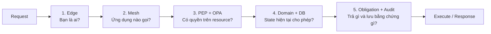

Nếu chỉ có 10 phút, đọc theo thứ tự: Executive Summary → bảng 5 cửa ở trên → sơ đồ mục 2.2 → reference implementation mục 5.3 → request flow mục 8 → critical risks mục 16. Không cần hiểu OPA, Istio hoặc Rego trước khi đọc phần business boundary.

Ba nguyên tắc xuyên suốt:

1. **Không tin vị trí mạng:** ở trong cluster vẫn phải xác thực workload và authorize flow.
2. **Context không phải identity:** authentication xảy ra trước; actor/device/caller/facts chỉ được ghép thành authorization context sau khi từng nguồn đã được xác minh.
3. **Control plane không xử lý từng request:** Git/CI/signing phân phối policy; Edge/mesh/local PDP thuộc data plane và quyết định gần traffic để tránh bottleneck.

## Approval & Review Gates

| **Vai trò rà soát/phê duyệt** | **Phạm vi rà soát** | **Quyết định** | **Ngày xác nhận** |
| --- | --- | --- | --- |
| Architecture Council | Boundary Edge/mesh/PDP/domain, topology, migration và ADR | Chờ rà soát | — |
| Security Architecture/ANBM | Identity propagation, delegation, tenant isolation, fail mode, supply chain và break-glass | Chờ rà soát | — |
| IAM | Issuer/audience, token exchange, workload federation, revocation và key rotation | Chờ rà soát | — |
| Platform/SRE | Istio, HA/DR, capacity, SLO, rollout, alert và runbook | Chờ rà soát | — |
| Privacy/Legal/SecOps | Decision-log field, residency, retention, access và legal hold | Chờ rà soát | — |
| Product/Business Owner | Action-level audit durability, degraded window và availability trade-off | Chờ rà soát | — |
| Domain Agent/Market/Broker | Action/resource vocabulary, facts, invariant, migration parity và acceptance | Chờ rà soát | — |
| QA/Performance | Contract, security, chaos, load, migration và bằng chứng quality gate | Chờ rà soát | — |

## Governance Gates

| **Chuyển trạng thái** | **Điều kiện đầu vào** |
| --- | --- |
| `DRAFT → UNDER REVIEW` | Scope, component, trust boundary, requirement, sơ đồ, ADR, risk và open issue có định danh. |
| `UNDER REVIEW → APPROVED` | Có owner/reviewer đích danh; delegation profile, tenant model, PEP coverage, security-floor PoC decision, action-level audit durability, SLO và risk nghiêm trọng đã được chốt hoặc ghi rõ điều kiện phê duyệt. |
| `APPROVED → POC BASELINE` | Engine/topology shortlist, benchmark plan, contract schema v1, signed-bundle flow và một pilot action đã được phê duyệt. |
| `POC BASELINE → IMPLEMENTATION BASELINE` | L3 artefact, threat model, performance/chaos evidence, migration plan, runbook và production configuration có bằng chứng. |
| `IMPLEMENTATION BASELINE → PRODUCTION ENFORCEMENT` | Action-level acceptance tại mục 14.3 đạt; Security, domain owner và SRE ký duyệt. |

## L3 Deliverables

L2 chốt nguyên tắc, ownership, invariant và ranh giới tích hợp. Các artefact dưới đây phải cụ thể hóa thiết kế trước cổng tương ứng; `TBD` trong L3 không được dùng để mặc nhiên chấp nhận rủi ro production.

| **Deliverable** | **Chủ sở hữu** | **Cổng sử dụng** | **Nguồn đặc tả L2** |
| --- | --- | --- | --- |
| IAM & Delegation Profile v1 | IAM + Security Platform | Trước PoC service-to-service | Mục 6.4 và 9.1 |
| Authorization Contract JSON Schema/OpenAPI hoặc gRPC v1 | Authorization Team | Trước tích hợp PEP/PDP | Mục 6.2–6.3 |
| Action/Resource Vocabulary v1 | Domain + API Governance | Trước viết policy pilot | Mục 2.3 và 7.1 |
| Policy Repository, Test & Signing Standard | Security Platform | Trước publish bundle | Mục 7.2–7.4 |
| PDP Topology & Engine Benchmark Report | Authorization Team + SRE | Trước PoC baseline | Mục 5, 10 và 11 |
| PEP Coverage & Framework Conformance Specification | Authorization Team + Domain | Trước enforce | Mục 6.5 và 15 |
| Emergency Revocation/Security-floor PoC & Decision Record | Security Platform + IAM + SRE | Trước chốt production revocation design | Mục 5.1, 7.6.3 và 16 |
| Mesh Traffic Inventory & AuthorizationPolicy Baseline | Mesh Team | Trước `STRICT` | Mục 9.2 và 10.4 |
| Decision Audit, Correlation & Retention Contract | SecOps + Privacy | Trước OAT | Mục 9.4 và 13 |
| Action-level Audit Durability Matrix | Product/Business + Security/Legal + SRE | Trước enforce từng action | Mục 12.4 và 14.3 |
| Runtime Capacity & Resilience Matrix | SRE + Gateway + Authorization | Trước OAT/load test | Mục 4, 11 và 12 |
| BFF Migration Matrix & Route Rollback Plan | Application Platform + Domains | Trước cutover | Mục 10.5 |
| Dashboard, Alert, On-call & DR Runbook Pack | SRE + owning team | Trước production | Mục 13–14 |

## Quy ước trạng thái thiết kế

| **Nhãn** | **Ý nghĩa** |
| --- | --- |
| `BẮT BUỘC` | Phải hoàn thành và có bằng chứng trước production. |
| `ĐỀ XUẤT` | Baseline hoặc quyết định đang chờ phê duyệt/đo kiểm. |
| `BÊN NGOÀI` | Do dependency quy định; cần owner, contract test và SLA. |
| `TBD` | Chưa có quyết định hoặc bằng chứng; phải đóng tại governance gate được nêu. |

Tài liệu này mô tả **kiến trúc mục tiêu L2**. Nó không tuyên bố một gateway, policy engine, topology PDP hoặc cơ chế token exchange cụ thể đã được mua, triển khai hay đạt SLO.

# 1. Business Objectives & Scope

## 1.1 Business Context & Objectives

### Current Business Problem

Hệ thống hiện có nhiều BFF như `agent-api`, `market-api` và `core-broker-api`. Mỗi BFF thường tự parse token, ánh xạ role/scope, kiểm tra tenant, routing, audit và đôi khi chứa business rule. Cách tổ chức này tạo các vấn đề sau:

- cùng một policy được cài lại ở nhiều framework và phiên bản;
- `role`, `scope`, `action`, resource ID và tenant context không có semantic thống nhất;
- policy rollout không đồng bộ, khó xác định policy thực tế đang có hiệu lực;
- BFF vừa làm security, routing, composition và business authorization nên ownership không rõ;
- không có decision chain thống nhất để trả lời ai/caller nào đã truy cập resource nào với policy nào;
- chuỗi gọi dài và BFF thuần proxy làm tăng latency, chi phí và blast radius;
- service có thể tin identity header do upstream truyền mà không kiểm chứng provenance;
- mỗi domain/channel mới dễ kéo theo một BFF và một bản sao security logic mới.

### Business Objectives

- Chuẩn hóa mô hình `Actor + Caller + Action + Resource + Context → Decision` cho user, machine, workload và job.
- Tập trung policy lifecycle nhưng phân tán enforcement/evaluation gần workload.
- Loại bỏ shared AuthN/AuthZ khỏi BFF thuần proxy; giữ BFF có composition/channel value thật.
- Enforce zero-trust cho north-south và east-west traffic.
- Giữ business invariant và resource truth tại domain service.
- Mọi policy production có review, test, provenance, version, chữ ký, rollout và rollback.
- Mọi authorization evaluation quan trọng có thể nối thành một decision chain, không log token/PII ngoài allowlist.
- Migration theo route/action, có shadow parity, cohort, rollback và không đổi external contract trước khi cần thiết.

## 1.2 In Scope

| **Capability** | **Phạm vi** | **Yêu cầu thiết kế** |
| --- | --- | --- |
| Edge authentication | TLS termination, JWT validation, header hygiene và route normalization | `BẮT BUỘC` |
| Edge coarse authorization | Authenticated/public class, client, scope, tenant presence và route-to-action mapping | `BẮT BUỘC` |
| Workload trust | Istio mTLS, workload identity và caller allowlist | `BẮT BUỘC` |
| Delegation | User-on-behalf-of và system-call profile có audience, TTL, caller binding và provenance | `BẮT BUỘC` |
| Authorization contract | Versioned actor/caller/action/resource/context, provenance, decision và obligation | `BẮT BUỘC` |
| Policy lifecycle | Git, lint/test, approval, signing, registry, rollout, inventory và rollback | `BẮT BUỘC` |
| Distributed evaluation | Local/nearby PDP cho hot path; remote PDP chỉ theo use case được duyệt | `ĐỀ XUẤT` |
| Domain enforcement | PEP, resource fact, business invariant, field/row filtering và transactional guard | `BẮT BUỘC` |
| Audit/observability | Evaluation log, enforcement outcome, correlation, SLI và security alert | `BẮT BUỘC` |
| Migration | Shadow, comparison, cohort, BFF decomposition và decommission | `BẮT BUỘC` |
| Break-glass/revocation | Emergency deny/revoke, kill switch, TTL, approval và retrospective; security floor chỉ là candidate mechanism | `BẮT BUỘC` |

## 1.3 Out of Scope

- Thay thế Identity Provider/IAM hiện có trong một lần.
- Thiết kế lại toàn bộ domain model hoặc external API contract.
- Đưa ownership, trạng thái giao dịch, hạn mức hoặc business invariant vào Edge/mesh.
- Dùng network location như tín hiệu tin cậy duy nhất.
- Xây entitlement-management UI/workflow đầy đủ trong phase đầu.
- Bảo đảm exactly-once cho decision log; yêu cầu là correlation, loss policy và khả năng đối soát theo Action-level Audit Durability Matrix.
- Xóa BFF còn composition, aggregation hoặc channel-specific transformation có giá trị.
- Chọn chính thức gateway/PDP engine trước benchmark và Architecture Decision Gate.

## 1.4 Assumptions, Constraints & Dependencies

| **ID** | **Giả định/Ràng buộc** | **Trạng thái** | **Ảnh hưởng** |
| --- | --- | --- | --- |
| A-01 | Mọi external route trong scope chỉ được expose qua Edge được quản trị | `BẮT BUỘC` | Direct public load balancer/ingress vào domain service bị cấm. |
| A-02 | IAM phát access token có issuer/audience rõ và hỗ trợ JWKS rotation | `BÊN NGOÀI` | Thiếu token profile chặn PoC AuthN. |
| A-03 | Khả năng RFC 8693 token exchange/workload federation của IAM chưa xác nhận | `TBD` | Chặn chốt delegation profile; không được thay bằng raw identity header. |
| A-04 | Kubernetes/Istio là nền tảng mục tiêu cho workload trong scope | `ĐỀ XUẤT` | Workload ngoài mesh cần exception và control tương đương. |
| A-05 | Domain service là authority của resource state, ownership và relationship động | Quyết định kiến trúc | PDP chung không sao chép mọi domain database. |
| A-06 | Policy engine phải deterministic, không gọi network tùy ý trong evaluation | `BẮT BUỘC` | Dynamic facts phải được PEP/provider nạp có provenance. |
| A-07 | Decision/audit pipeline không là remote synchronous dependency của mọi request | Quyết định kiến trúc | Phải có local outbox/queue và loss behavior theo mode đã phê duyệt cho từng action. |
| A-08 | Tenant isolation là platform guardrail; cross-tenant cần grant đích danh | `BẮT BUỘC` | Không dùng role `admin` chung để bỏ qua tenant. |
| A-09 | Clocks của gateway, workload, PDP, IAM và collector được đồng bộ/giám sát | `BẮT BUỘC` | TTL, signature, replay và audit phụ thuộc clock-skew budget. |
| A-10 | Policy/data residency và audit retention khác nhau theo region/domain | `TBD` | Chặn production data thật cho region chưa được phê duyệt. |
| A-11 | Mỗi action có owner, resource schema, risk class và fail mode | `BẮT BUỘC` | Unknown/unregistered action mặc định deny. |
| A-12 | Legacy behavior không mặc nhiên là đúng | `BẮT BUỘC` | Golden case chỉ lấy từ hành vi đã được Security/domain xác nhận. |
| A-13 | Mesh identity không tự chứng minh end-user identity | Quyết định kiến trúc | Callee phải kiểm tra delegation artifact và caller identity riêng. |
| A-14 | Multi-region active/active chưa được xác nhận | `TBD` | Cần chốt trust-domain federation, bundle rollout và audit residency. |
| A-15 | Workload model, peak RPS, policy size và audit EPS chưa có evidence | `TBD` | SLO/capacity trong L2 là target đề xuất, chưa là baseline cam kết. |

## 1.5 Stakeholders & Personas

| **Nhóm** | **Trách nhiệm/quyền** |
| --- | --- |
| End user/agent/operator | Thực hiện action trong tenant/resource được cấp; không tự khai role, tenant hoặc assurance. |
| Machine client | Dùng client identity/scope riêng; không được suy diễn thành user. |
| Domain service/team | Sở hữu resource facts, business invariant, response filtering và action vocabulary của domain. |
| Application Platform | Sở hữu Edge routing, route registry, header hygiene và migration flags. |
| Security Platform | Sở hữu contract, control plane, PDP/SDK, policy guardrail, signing và revocation. |
| IAM team | Sở hữu issuer, credential lifecycle, token/delegation profile, MFA và revocation nguồn. |
| Mesh/SRE | Sở hữu workload identity, mTLS, runtime topology, SLO, capacity, DR và on-call. |
| SecOps | Sở hữu detection, SIEM, incident workflow và privileged audit access. |
| Privacy/Legal | Phê duyệt decision-log field, retention, residency, legal hold và data-subject handling. |
| Architecture Council | Phê duyệt boundary, ADR, exception và quyết định engine/topology. |

## 1.6 Personal/Security Data Processing Summary

| **Dữ liệu** | **Mục đích** | **Vị trí xử lý** | **Kiểm soát yêu cầu** |
| --- | --- | --- | --- |
| Stable actor ID, actor type, tenant | Authorization và audit | PEP/PDP input, tokenized audit | Không log raw token; pseudonymize/tokenize theo domain. |
| Role/scope/entitlement version | Coarse/fine authorization | Token/context/attribute provider | Có issuer/provenance/freshness; không tin request body/header client. |
| Workload identity/delegation chain | Caller validation, confused-deputy control | Mesh, PEP/PDP, audit digest | Audience-bound, TTL ngắn, sender/caller-bound; chain giới hạn. |
| Resource ID/type/tenant/attributes | Resource-level decision | Domain PEP/PDP | Tối thiểu hóa; ID tokenized trong audit khi cần. |
| Device/network/authentication assurance | Step-up/risk policy | Edge/context provider | Chỉ dùng nguồn được đăng ký; TTL và purpose rõ. |
| Decision, reason, policy digest, obligation | Audit, explain, incident | Local spool, collector, SIEM/DWH | Append-oriented, integrity, encryption, restricted access và retention. |

## 1.7 System Criticality

Đề xuất **Cấp 1 — nền tảng bảo mật trọng yếu, blast radius đa domain**. Phân loại chính thức, action-level SLO, RTO/RPO, audit-loss policy và residency phải được System Owner, Security Architecture, Privacy và SRE ký duyệt trước production enforcement.

# 2. Architecture Overview & Principles

## 2.1 Nguyên tắc thiết kế

| **Mã** | **Nguyên tắc** |
| --- | --- |
| ARCH-01 | Never trust, always verify tại từng trust boundary; token hợp lệ không đồng nghĩa có quyền trên resource. |
| ARCH-02 | Centralize policy management, distribute enforcement/evaluation; control plane không nằm trên hot path bắt buộc. |
| ARCH-03 | Edge mỏng: AuthN, hygiene, traffic control, routing và coarse policy; không truy vấn domain DB. |
| ARCH-04 | Platform sở hữu shared guardrail; domain sở hữu business truth, invariant và response authorization. |
| ARCH-05 | Default deny, least privilege; thiếu identity, policy, context, provenance hoặc obligation support thì deny. |
| ARCH-06 | Không tin identity header từ client hoặc workload tùy ý; delegated identity phải là artifact xác minh được và caller-bound. |
| ARCH-07 | Action/resource là vocabulary nghiệp vụ có version; unknown route/action mặc định deny. |
| ARCH-08 | Policy là code: review, test, sign, promote, observe, rollback và audit theo immutable digest. |
| ARCH-09 | Actor và caller là hai principal độc lập; `on_behalf_of` và `system` là hai delegation mode khác nhau. |
| ARCH-10 | Policy input chỉ chứa thuộc tính tối thiểu có source, observed time, expiry và schema. |
| ARCH-11 | Fail-close mặc định; fail-open chỉ cho public/low-risk exception có owner, TTL và alert. |
| ARCH-12 | Mỗi exposed handler, async consumer và privileged job phải đi qua default-deny PEP coverage. |
| ARCH-13 | Mỗi request có một `authorization_transaction_id`; mỗi evaluation có `decision_id`; service cuối ghi enforcement outcome. |
| ARCH-14 | Approved emergency-revocation state không được rollback/LKG/cache khôi phục quyền đã thu hồi. |
| ARCH-15 | Migration theo strangler/shadow/cohort; parity không được hợp thức hóa privilege expansion. |

## 2.2 Sơ đồ kiến trúc ứng dụng

### 2.2.1 Sơ đồ ngữ cảnh hệ thống

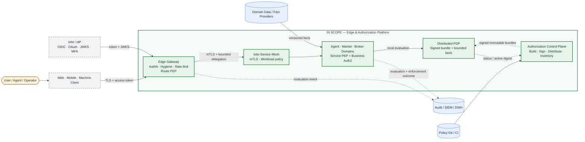

Khung xanh liền là phạm vi của platform. IAM, policy Git/CI, domain data và Audit/SIEM là dependency hoặc data authority bên ngoài ranh giới runtime của platform.

### 2.2.2 Sơ đồ component — control plane và data plane

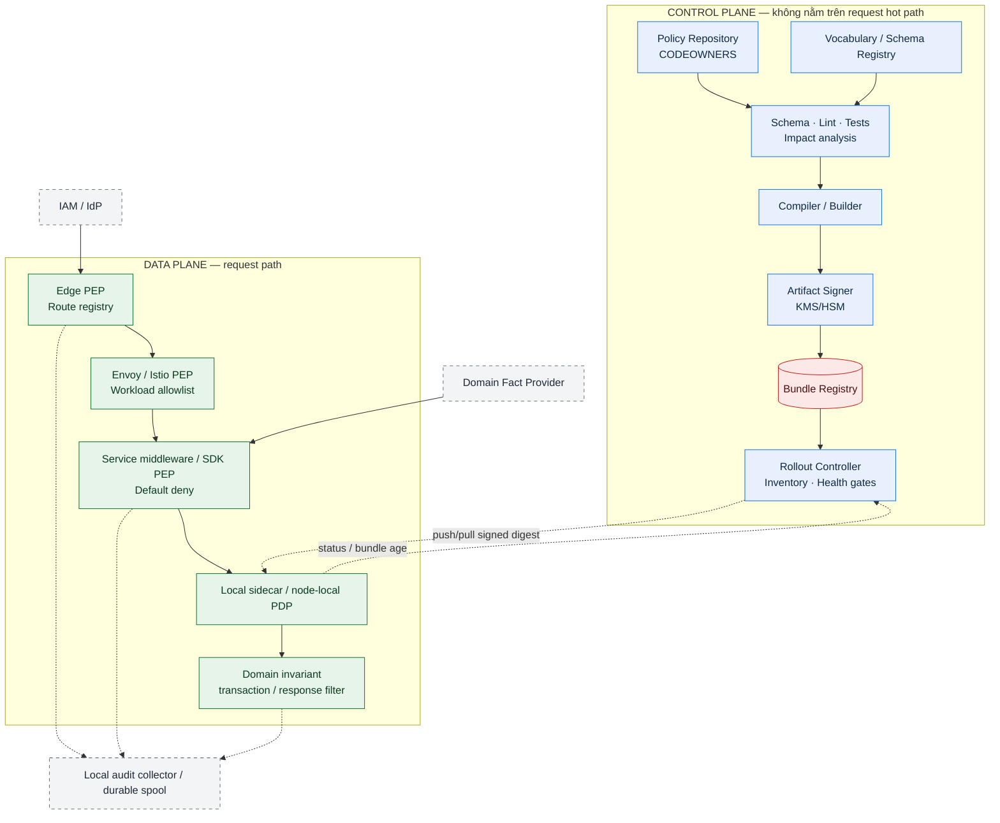

### 2.2.3 Phân định trách nhiệm

| **Component** | **Trách nhiệm** | **Không là authority của** |
| --- | --- | --- |
| IAM/IdP | Credential, user/client identity, MFA, token issuance/lifecycle | Dynamic resource authorization của domain |
| Edge Gateway | North-south AuthN, header hygiene, route registry, traffic control, coarse PEP | Business workflow, resource lookup, field filtering |
| Istio/Envoy | mTLS, workload identity, service/port/path-class allowlist | End-user business authorization |
| Authorization Control Plane | Policy/schema lifecycle, build/sign/distribute, rollout, inventory | Runtime decision bắt buộc cho mọi request |
| PDP | Deterministic evaluation trên signed bundle và bounded input | Sửa domain data hoặc tự lấy network facts |
| PEP/SDK | Build/validate input, gọi PDP, enforce result/obligation, emit telemetry | Tự phát minh action/role hoặc bỏ qua unknown handler |
| Domain service | Resource truth, ownership/relationship, invariant, transaction và response filtering | Parse external bearer token theo cách riêng |
| Audit pipeline | Ingest, integrity, search, alert, retention và reconciliation | Quyết định synchronous trên request path |

### 2.2.4 Sơ đồ trust boundary

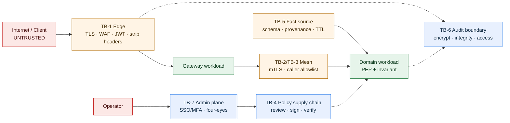

### 2.2.5 Ma trận trust boundary

| **Boundary** | **Từ → đến** | **Kiểm soát bắt buộc** |
| --- | --- | --- |
| TB-1 Internet | Client → Edge | TLS, WAF/DDoS/rate limit, token validation, request limits, xóa identity header không tin cậy |
| TB-2 Edge-to-mesh | Gateway → service | mTLS, gateway workload allowlist, route/action/audience binding, signed delegation |
| TB-3 East-west | Service → service | mTLS `STRICT`, workload authorization, explicit delegation mode, controlled egress |
| TB-4 Policy supply chain | Git/CI → registry → PDP | Protected branch, tests, approval, artifact signature, digest, provenance và approved revocation control |
| TB-5 Context/data | Domain/provider → PEP/PDP | Source identity, schema, observed time, expiry, version, minimization |
| TB-6 Audit | Runtime → spool/collector/SIEM | Encryption, integrity, bounded backpressure, access, retention, loss policy |
| TB-7 Admin plane | Operator → control plane | SSO/MFA, privileged role, four-eyes, short session, immutable admin audit |

## 2.3 Mô hình quyết định authorization

### 2.3.1 Chuỗi quyết định và authority

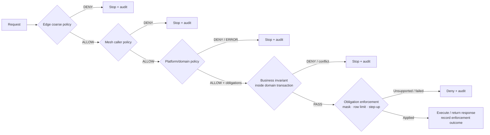

Quyết định cuối là phép **AND** của mọi layer áp dụng. Không layer nào được dùng một `ALLOW` để override `DENY` của layer khác. `ALLOW` chỉ có hiệu lực khi PEP áp dụng được toàn bộ obligation bắt buộc và business invariant vẫn đúng tại thời điểm mutation/response.

### 2.3.2 Invariant bắt buộc

- `actor` và `caller` luôn được đánh giá riêng; caller có system privilege không được tự động vượt quyền actor.
- Request không có `schema_version`, action không đăng ký, fact không có provenance hoặc policy bundle không hợp lệ đều deny.
- Edge chỉ map route sang action/resource hint; domain service resolve resource identity và authority cuối.
- Handler không khai báo action không được expose; CI/startup/conformance test phải phát hiện missing coverage.
- Mutation phụ thuộc state phải check authorization-relevant state/version trong cùng transaction hoặc optimistic concurrency guard.
- Response filtering là một enforcement step; trả dữ liệu trước khi obligation áp dụng được coi là authorization failure.
- `trace_id` phục vụ quan sát, không phải security credential và không thay thế delegation integrity.

### 2.3.3 Tenant model

- Request có `active_tenant_id` do trusted identity/session context xác định; không lấy từ body làm authority.
- Resource có `tenant_id` do domain resolve. Mặc định `active_tenant_id == resource.tenant_id`.
- Actor có thể thuộc nhiều tenant nhưng mỗi request chỉ có một active tenant, trừ workflow cross-tenant được đăng ký.
- Cross-tenant `ALLOW` cần explicit grant có `grant_id`, grantor/authority, actor/caller, action, resource scope, source, expiry và audit; role chung như `admin` không đủ.
- Platform tenant guardrail kiểm tra default isolation và cấu trúc grant; domain kiểm tra relationship/business condition. Domain policy không được tạo đường bypass ngoài grant contract.

## 2.4 Vòng đời policy và rollout

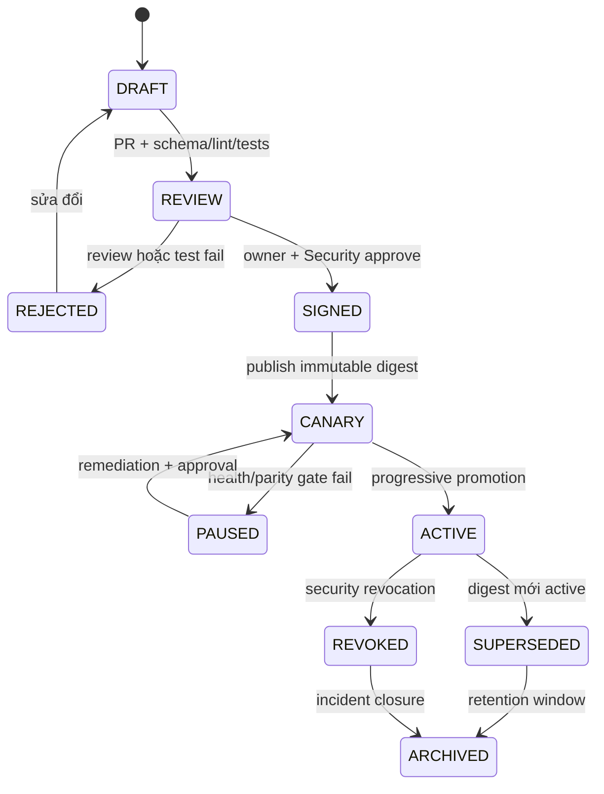

Invariant cần phê duyệt là rollback không được khôi phục quyền đã bị emergency revoke. Nếu security-floor candidate tại mục 7.6.3 được chọn, rollback chỉ được về digest tương thích với floor generation hiện hành. Policy `REVOKED` không thể trở lại `ACTIVE` chỉ bằng route flag hoặc last-known-good fallback.

# 3. Functional Requirements

## 3.1 Ma trận năng lực chức năng

| **ID** | **Năng lực/yêu cầu** | **Thiết kế** | **Mức bắt buộc** |
| --- | --- | --- | --- |
| FR-01 | External authentication | Edge validate issuer, audience, signature, algorithm, `exp/nbf`, key state và token class | `BẮT BUỘC` |
| FR-02 | Header/request hygiene | Strip identity/delegation header từ untrusted source; giới hạn size/depth/header count | `BẮT BUỘC` |
| FR-03 | Route authorization | Mọi exposed route map tới public class hoặc versioned action; unknown route deny | `BẮT BUỘC` |
| FR-04 | Workload authorization | mTLS identity + caller allowlist cho service/port/path class | `BẮT BUỘC` |
| FR-05 | Delegated call | Callee verify actor, caller, delegation mode, audience, TTL, chain và sender binding | `BẮT BUỘC` |
| FR-06 | Fine-grained decision | Domain PEP resolve resource facts rồi evaluate actor/caller/action/resource/context | `BẮT BUỘC` |
| FR-07 | Business invariant | Ownership/state/limit check gần domain data, trong transaction khi mutation | `BẮT BUỘC` |
| FR-08 | Obligation | Versioned typed obligation; unsupported/conflict/application failure đều deny | `BẮT BUỘC` |
| FR-09 | Policy lifecycle | Git review/test/sign/publish/canary/promote/rollback theo digest | `BẮT BUỘC` |
| FR-10 | Distributed bundle | PDP verify signature/schema/approved revocation metadata và activate atomic | `BẮT BUỘC` |
| FR-11 | Evaluation audit | Mỗi PEP phát decision event; final service phát enforcement outcome | `BẮT BUỘC` |
| FR-12 | Emergency revoke | Có cơ chế deny/revoke theo phạm vi được duyệt, TTL và four-eyes; security floor là phương án cần PoC | `BẮT BUỘC` |
| FR-13 | Shadow migration | Dual evaluate, classify mismatch, cohort gate và rollback route/digest | `BẮT BUỘC` |
| FR-14 | Async authorization | Phân biệt committed event với deferred command; provenance, replay và authorization semantics rõ | `BẮT BUỘC` |
| FR-15 | Explain/support | Reason code ổn định, policy digest và safe explain cho operator được ủy quyền | `ĐỀ XUẤT` |
| FR-16 | Inventory | Biết action/route nào dùng policy/schema/digest/PEP version nào | `BẮT BUỘC` |

## 3.2 Quy tắc authorization

| **ID** | **Quy tắc** |
| --- | --- |
| AZR-01 | Authentication thành công không tạo implicit authorization. |
| AZR-02 | `DENY`, `INDETERMINATE`, input/schema error và unknown obligation đều không được thực thi business action. |
| AZR-03 | Không forward external bearer token sang service không đúng audience. |
| AZR-04 | Chỉ STS/IAM hoặc issuer nội bộ được phê duyệt mới được mint delegation artifact; application không tự ký actor header. |
| AZR-05 | `on_behalf_of` yêu cầu actor và caller cùng hợp lệ; `system` không được gắn actor giả để mở rộng quyền. |
| AZR-06 | Tenant mismatch mặc định deny; cross-tenant chỉ qua explicit grant contract. |
| AZR-07 | Policy không gọi network trong evaluation; fact động phải được cung cấp có provenance/freshness. |
| AZR-08 | Decision-cache key phải chứa mọi input ảnh hưởng quyết định và policy digest; high-risk mutation không cache `ALLOW`. |
| AZR-09 | Approved emergency revocation phải override positive cache và chặn rollback khôi phục quyền đã thu hồi; cơ chế cụ thể chờ PoC. |
| AZR-10 | Legacy `ALLOW`/new `DENY` cần phân tích; legacy `DENY`/new `ALLOW` là privilege expansion và chặn rollout. |
| AZR-11 | Business event đã commit không bị “hủy lịch sử” do actor mất quyền sau đó; deferred command có side effect phải theo semantics mục 8.4. |
| AZR-12 | Client-facing response không tiết lộ resource existence nếu policy yêu cầu concealment; audit vẫn giữ reason nội bộ. |
| AZR-13 | Public/fail-open action phải có registry entry, owner, expiry, data classification và alert riêng. |
| AZR-14 | Mọi break-glass grant có MFA mạnh, ticket, scope, TTL, alert tức thời và retrospective. |

# 4. Non-Functional Requirements

Các con số dưới đây là **target đề xuất** để thẩm định bằng workload model, benchmark và risk review. Chúng chưa là production baseline cho đến khi có owner và evidence.

| **ID** | **Nhóm** | **Target/Yêu cầu** | **Cổng** |
| --- | --- | --- | --- |
| NFR-01 | End-to-end availability | SLO theo action/risk class phải được chốt; không suy diễn từ riêng Edge/PDP | `TBD` trước OAT |
| NFR-02 | Edge availability | `>= 99.99%/tháng` cho critical path | `ĐỀ XUẤT` |
| NFR-03 | Local evaluation | P95 `<= 5 ms`, P99 `<= 10 ms` với policy/fact đã ở local memory | `ĐỀ XUẤT` |
| NFR-04 | Edge overhead | P95 `<= 15 ms` cho AuthN + coarse AuthZ | `ĐỀ XUẤT` |
| NFR-05 | Remote PDP | P95 `<= 30 ms` nội vùng; timeout/deadline explicit | `ĐỀ XUẤT` |
| NFR-06 | Policy propagation | P95 `<= 2 phút` standard; activation atomic và 100% signature/schema verify | `ĐỀ XUẤT` |
| NFR-07 | Emergency revocation | Approved revocation control tới 100% healthy enforcement point `<= 30 giây`; `30 giây` và stale behavior cần PoC/business review | `ĐỀ XUẤT` |
| NFR-08 | Audit delivery | `>= 99.99%` event trong 5 phút; durable-enqueue, degraded window và loss behavior theo từng action tại mục 12.4 | `ĐỀ XUẤT` |
| NFR-09 | Capacity | Qua load test `>= 2x` approved peak và mất một AZ vẫn giữ action SLO | `ĐỀ XUẤT` |
| NFR-10 | Data isolation | Không có cross-tenant `ALLOW` ngoài explicit approved grant | `BẮT BUỘC` |
| NFR-11 | Scalability | Không coordination per request; scale ngang Edge/PDP/collector | `BẮT BUỘC` |
| NFR-12 | Compatibility | Contract/policy/bundle có version; hỗ trợ rolling upgrade N/N-1 theo matrix được duyệt | `BẮT BUỘC` |
| NFR-13 | Recoverability | Control-plane metadata RPO `<= 15 phút`, RTO `<= 60 phút`; data-plane LKG tuân thủ risk và approved revocation control | `ĐỀ XUẤT` |
| NFR-14 | Security | Key trong KMS/HSM, workload least privilege, signed artifact, no raw token/PII in telemetry | `BẮT BUỘC` |

## 4.1 Ngân sách deadline và timeout

- End-to-end deadline được phân bổ theo thứ tự `dependency/PDP < domain service < Edge < client` để layer ngoài còn thời gian kết thúc có kiểm soát.
- PEP không retry một mutation. Remote PDP chỉ retry khi request evaluation idempotent, còn deadline và error class được phê duyệt.
- Mỗi integration có connect timeout, response timeout, total budget, max attempt, backoff, circuit breaker và owner trong `Runtime Capacity & Resilience Matrix`.
- Không bắt đầu context lookup/evaluation nếu remaining deadline nhỏ hơn budget tối thiểu; trả error nội bộ được PEP map fail-close.
- Latency SLO của local PDP không bao gồm domain fact lookup, nhưng **action-level SLO phải bao gồm toàn bộ Edge, mesh, lookup, evaluation, invariant và response obligation**.

## 4.2 Compatibility và rollout budget

- Contract envelope có `schema_version`; PEP/PDP công bố `supported_schema_versions` trong status.
- Bundle manifest khai báo PEP/PDP capability, vocabulary/schema digest và revocation-contract metadata nếu cơ chế đó được chọn.
- Breaking change cần dual-read/dual-evaluate và compatibility test trước promotion; không dựa vào rollout đồng thời tuyệt đối.
- Gateway và domain có thể chạy policy digest khác nhau trong canary, nhưng mỗi digest phải tương thích contract và approved revocation control; decision chain ghi rõ từng digest.

# 5. Technology Stack & Justification

| **Công nghệ/nhóm công nghệ** | **Vai trò** | **Cơ sở lựa chọn/hệ quả** | **Trạng thái** |
| --- | --- | --- | --- |
| Enterprise Edge Gateway | TLS/WAF/rate limit/routing/JWT/coarse PEP | Phải hỗ trợ declarative route registry, HA, observability và integration external authorization | `TBD` theo platform standard |
| Kubernetes + Istio/Envoy | Workload identity, mTLS, traffic/workload policy và optional `ext_authz` | Phù hợp distributed enforcement; cần inventory traffic ngoài mesh và version support matrix | `ĐỀ XUẤT` |
| OPA/Rego | Candidate PDP/policy language cho local evaluation | Hệ sinh thái bundle/test/Kubernetes tốt; phải benchmark policy thật và usability | `ĐỀ XUẤT`, chưa chốt |
| Cedar hoặc engine tương đương | Candidate cho typed policy/authorization | Đánh giá song song nếu type safety hoặc relationship semantics phù hợp hơn | `TBD` qua PoC |
| Git + CI/CD | Policy-as-code, review, test và promotion | Traceability và separation of duties | `BẮT BUỘC` |
| KMS/HSM + artifact signer | Ký bundle và candidate revocation artifact, rotation/revoke key | Tách build khỏi signing authority | `BẮT BUỘC` |
| Object store/OCI-compatible registry/CDN | Phân phối immutable bundle theo region | Scale ngang, cache theo digest; registry không nằm synchronous trên request path | `ĐỀ XUẤT` |
| OpenTelemetry | Trace, metric và correlation | Chuẩn hóa telemetry; security field vẫn theo allowlist | `ĐỀ XUẤT` |
| Durable local spool + collector + SIEM/DWH | Decision/enforcement audit | Không đặt remote audit backend trên hot path; phải chốt loss policy | `BẮT BUỘC` |
| SPIFFE-compatible workload identity | Canonical workload principal | Tránh service API key dùng chung; cần trust-domain/federation design | `ĐỀ XUẤT` |

## 5.1 Cổng lựa chọn policy engine và topology

PoC phải dùng policy, input distribution và failure case đại diện cho Agent/Market/Broker; không benchmark bằng rule demo. Báo cáo tối thiểu gồm:

- semantic fit cho RBAC, ABAC, explicit cross-tenant grant và relationship lookup;
- p50/p95/p99, cold start, memory/CPU theo rule count, bundle size và input size;
- deterministic evaluation, typed/schema validation, explainability và test tooling;
- signed bundle, atomic activation, status/decision-log integration và emergency-revocation behavior;
- sidecar, node-local, embedded và remote-regional trade-off;
- multi-language SDK, upgrade N/N-1, operational skill, license và lock-in;
- behavior khi corrupt/stale bundle, policy compile error, PDP crash và network partition.

Architecture Council chỉ chốt engine/topology sau khi Security, SRE và hai domain pilot ký benchmark report.

## 5.2 ADR Log

| **ID** | **Quyết định** | **Cơ sở/hệ quả** | **Trạng thái** |
| --- | --- | --- | --- |
| ADR-001 | Edge mỏng, không chứa business invariant/domain DB lookup | Giảm coupling/blast radius; domain phải có mandatory PEP | `ĐỀ XUẤT` |
| ADR-002 | Hybrid platform policy + domain authorization | Shared guardrail thống nhất, business truth ở domain | `ĐỀ XUẤT` |
| ADR-003 | Distributed PDP cho synchronous hot path | Giảm hop/SPOF; cần fleet freshness/compatibility | `ĐỀ XUẤT` |
| ADR-004 | Policy-as-code, signed immutable bundle | Traceability, provenance, rollback; cần emergency workflow | `ĐỀ XUẤT` |
| ADR-005 | Istio mTLS/workload identity + default-deny caller policy | User AuthZ không thay service authentication | `ĐỀ XUẤT` |
| ADR-006 | Versioned Actor/Caller/Action/Resource/Context contract | Transport-independent policy/audit; cần governance vocabulary | `ĐỀ XUẤT` |
| ADR-007 | Audience-bound delegation; không forward bearer token tùy ý | Giảm replay/confused deputy; phụ thuộc IAM/STS profile | `ĐỀ XUẤT CÓ ĐIỀU KIỆN` |
| ADR-008 | Async decision/outcome audit; durability mechanism và failure mode theo action | Remote sink không trên hot path; business/security phải chốt availability trade-off | `ĐỀ XUẤT CÓ ĐIỀU KIỆN` |
| ADR-009 | Candidate security floor tách base bundle/LKG | Có thể chặn emergency revoke bị rollback/cache vô hiệu hóa; authority/scope/merge/partition/compatibility phải qua PoC | `CẦN PoC — CHƯA PHÊ DUYỆT` |
| ADR-010 | Explicit grant cho cross-tenant/deferred authority | Không dùng role override chung; tăng governance/data model | `ĐỀ XUẤT CÓ ĐIỀU KIỆN` |

Mỗi ADR `ĐỀ XUẤT CÓ ĐIỀU KIỆN` hoặc `CẦN PoC` phải có decision record độc lập kèm owner, alternatives, evidence và ngày phê duyệt trước khi chuyển thành implementation baseline.

## 5.3 Reference implementation cho pilot — framework cụ thể

Phần này biến logical architecture thành một implementation có thể code/test. Đây là **baseline đề xuất cho PoC**, không phải quyết định mua/chọn production trước khi benchmark và Architecture Council phê duyệt.

### 5.3.1 Stack đề xuất

| **Layer** | **Framework/component** | **Cách dùng cụ thể trong pilot** | **Trạng thái** |
| --- | --- | --- | --- |
| Edge/runtime proxy | Istio Gateway + Envoy | TLS, path normalization, JWT validation, rate limit, route-level `ext_authz` | `ĐỀ XUẤT PoC` |
| User AuthN | Istio `RequestAuthentication` + `AuthorizationPolicy` hoặc enterprise-gateway JWT filter | Pin issuer/JWKS/audience; policy riêng yêu cầu authenticated principal cho route private | `ĐỀ XUẤT PoC` |
| Workload AuthN/AuthZ | Istio `PeerAuthentication STRICT` + `AuthorizationPolicy` | mTLS, SPIFFE-compatible principal, default-deny service/port/caller flow | `ĐỀ XUẤT PoC` |
| Edge/coarse PEP | Envoy External Authorization API | Envoy gọi OPA-Envoy sidecar qua gRPC `127.0.0.1:9191`; chỉ route/client/scope check | `ĐỀ XUẤT PoC` |
| Service PEP | `authz-spring-boot-starter` dùng Spring Security `AuthorizationManager` + domain `AuthorizationService` | Pre-handler coverage và resource-level decision sau khi service load entity | `CẦN XÂY` |
| Local PDP | OPA + OPA-Envoy plugin sidecar | Rego v1, REST decision API cho app và gRPC `ext_authz` cho Envoy; no remote PDP hop | `ĐỀ XUẤT PoC` |
| Service runtime | Java 25 + Spring Boot 4.1 + Spring Security 7 nếu khớp platform baseline | MVC/WebFlux filter, method/application service, Actuator readiness và Micrometer | `ĐỀ XUẤT`, xác nhận platform |
| Policy CI | OPA CLI (`opa fmt/check/test/bench/build`) + Git/CODEOWNERS | Lint/test/benchmark/build bundle; ký artifact và publish immutable revision | `ĐỀ XUẤT PoC` |
| Policy distribution | OPA Bundle plugin + HTTPS bundle service/object-store front | PDP pull signed bundle có jitter; report status/active revision | `ĐỀ XUẤT PoC` |
| Audit mutation | Transactional Audit Outbox trong domain DB | Business mutation + enforcement outcome/audit intent cùng transaction | `ĐỀ XUẤT` cho `REQUIRED_DURABLE` |
| Audit read/decision | OPA decision logs + application outcome → local collector | Mask input; collector dùng bounded disk/persistent queue nếu mode cho phép | `ĐỀ XUẤT PoC` |
| Observability | OpenTelemetry + Micrometer/Prometheus + OPA metrics/status | Trace transaction/decision, bundle revision, latency, cache và revocation-candidate state | `ĐỀ XUẤT PoC` |

Không dùng `RequestAuthentication` một mình để bảo vệ route private: nó validate credential nếu credential xuất hiện nhưng cần `AuthorizationPolicy` để bắt buộc authenticated principal. `ext_authz` chỉ xử lý dữ liệu Envoy nhìn thấy; resource ownership/state lấy từ DB vẫn phải authorize trong application service.

### 5.3.2 Topology của một pod pilot

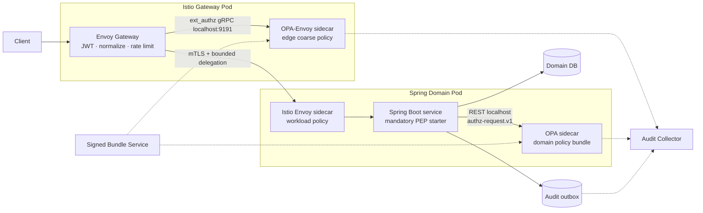

Envoy/OPA sidecar là lớp generic; Spring PEP là lớp hiểu business resource. Không cố ép một lớp thay thế lớp còn lại.

### 5.3.3 Các pattern được áp dụng

| **Pattern** | **Áp dụng ở đâu** | **Lý do/chống lỗi gì** |
| --- | --- | --- |
| PEP/PDP separation | Spring/Envoy là PEP, OPA là PDP | Tách enforce khỏi policy evaluation; test/rollout policy độc lập code |
| Sidecar | OPA và Envoy cùng pod workload | Local latency, failure isolation theo pod và không có central-PDP hop |
| Anti-Corruption Layer | `AuthzRequestFactory` trong starter | Chuyển Spring/JWT/domain object sang contract chuẩn; policy không phụ thuộc controller DTO |
| Default-deny Registry | `@AuthzAction` + startup scanner + route inventory | Handler/consumer mới thiếu action không silently public/bypass |
| Ports & Adapters | `AuthorizationPort`, `PolicyDecisionClient`, `AuditPort` | Domain không phụ thuộc trực tiếp OPA HTTP/Envoy format; thay engine qua adapter |
| Transactional Audit Outbox | Critical/high mutation | Side effect và audit intent atomic; tránh thêm một local-disk dependency riêng trước commit |
| Strangler + Shadow | Migration từng route/BFF | So quyết định mới/cũ trước enforce; rollback độc lập |
| Last Known Good | OPA bundle activation | Control plane outage không dừng data plane; vẫn chịu freshness/revocation rule |
| Bulkhead/Timeout/No blind retry | Fact provider/remote dependency | Không khuếch đại outage; mutation không retry mù |
| Deny-overrides | Multi-layer/obligation/candidate floor | Một allow không được vô hiệu hóa deny ở layer khác |

### 5.3.4 Module và package structure đề xuất

```text
authz-platform/
  authz-contract/
    AuthzRequest.java
    AuthzDecision.java
    Obligation.java
    authorization-request.schema.json
  authz-spring-boot-starter/
    annotation/AuthzAction.java
    annotation/PublicAction.java
    context/VerifiedActorContextResolver.java
    context/VerifiedCallerContextResolver.java
    coverage/HandlerCoverageValidator.java
    web/AuthzAuthorizationManager.java
    service/AuthorizationService.java
    opa/OpaDecisionClient.java
    obligation/ObligationHandlerRegistry.java
    audit/EnforcementAuditPublisher.java
    health/PolicyReadinessHealthIndicator.java
  authz-kafka-spring/
    consumer/AuthzRecordInterceptor.java
    envelope/MessageProvenanceVerifier.java
  policies/
    platform/
    domains/agent/
    domains/market/
    domains/broker/
    tests/
```

Application chỉ phụ thuộc `AuthorizationService`/contract. `OpaDecisionClient` là adapter; không rải HTTP call, role string hoặc Rego path trong controller/domain code.

### 5.3.5 Spring enforcement flow

1. `OncePerRequestFilter`/Spring Security lấy actor từ verified `SecurityContext`; không parse lại raw token ở domain.
2. `AuthzAuthorizationManager` đọc `@AuthzAction` để chạy coarse pre-check. `HandlerCoverageValidator` dùng `RequestMappingHandlerMapping` và fail startup nếu handler không có `@AuthzAction` hoặc `@PublicAction`.
3. Controller chỉ validate transport và gọi application service.
4. Application service load resource/facts server-side, sau đó gọi `AuthorizationService.requireAllowed(...)`.
5. OPA trả decision/obligation; service enforce obligation support trước side effect/response.
6. Với mutation, service re-check resource version/invariant và commit mutation + audit outbox trong cùng transaction.

```java
@Service
final class ApproveOrderService {
    private final OrderRepository orders;
    private final AuthorizationService authorization;
    private final AuditOutbox auditOutbox;

    @Transactional
    OrderView approve(OrderId id, ApproveOrderCommand command) {
        Order order = orders.getForUpdate(id);

        AuthzDecision decision = authorization.requireAllowed(
            AuthzRequestFactory.forResource(
                "broker.order.approve",
                order.toAuthorizationResource(),
                order.authorizationFacts()
            )
        );

        order.approve(command, decision.decisionId()); // domain invariant
        auditOutbox.append(EnforcementOutcome.committed(order, decision));
        return ObligationApplier.apply(order.toView(), decision.obligations());
    }
}
```

Không đặt resource DB lookup trong servlet filter hoặc SpEL annotation. Method annotation chỉ bảo đảm coverage/coarse gate; fine-grained check nằm sau authoritative lookup và gần transaction để tránh TOCTOU.

### 5.3.6 Rego policy tối thiểu cho pilot

```rego
package domains.broker.order

import rego.v1

default decision := {
  "decision": "DENY",
  "reason_code": "DENY_DEFAULT",
  "obligations": []
}

decision := {
  "decision": "ALLOW",
  "reason_code": "ALLOW_BROKER_OPERATOR_SAME_TENANT",
  "obligations": [{"type": "field_mask.v1", "parameters": {"paths": ["customer.tax_id"]}}]
} if {
  input.schema_version == "authz-request.v1"
  input.action == "broker.order.approve"
  input.actor.active_tenant_id == input.resource.tenant_id
  "broker_operator" in input.actor.roles
  input.caller.workload_id in data.allowed_callers["broker.order.approve"]
  input.actor.authentication.acr in data.allowed_assurance_levels
}
```

Policy trên kiểm tra shared access rule. `order.state`, limit và transition vẫn do `Order` aggregate kiểm tra trong transaction; không copy toàn bộ business invariant sang Rego.

### 5.3.7 Istio baseline tối thiểu

```yaml
apiVersion: security.istio.io/v1
kind: PeerAuthentication
metadata:
  name: default-strict
  namespace: pilot
spec:
  mtls:
    mode: STRICT
---
apiVersion: security.istio.io/v1
kind: AuthorizationPolicy
metadata:
  name: default-deny
  namespace: pilot
spec: {}
```

Platform bổ sung ba policy explicit: allow health probe từ kubelet/platform path được duyệt; allow Gateway/service caller theo service account principal; và `CUSTOM` policy gọi OPA-Envoy provider cho route class cần coarse authorization. Gateway JWT config phải pair `RequestAuthentication` với `AuthorizationPolicy` yêu cầu `requestPrincipals: ["*"]` cho private routes. Envoy bật path normalization/escaped-path policy đồng nhất application router để tránh policy nhìn một path nhưng Spring xử lý path khác.

### 5.3.8 Audit implementation theo loại action

- `REQUIRED_DURABLE` mutation: ưu tiên **Transactional Audit Outbox** trong cùng domain DB transaction. Đây không tạo một storage dependency mới ngoài DB đã là precondition của mutation.
- `DEGRADED_BOUNDED`/read: OPA decision log và application enforcement outcome đi qua local collector có persistent/disk queue đã benchmark; queue không tự động đồng nghĩa fsync-per-event.
- `BEST_EFFORT`: chỉ low-risk/public theo Action-level Audit Durability Matrix.
- OPA decision log chỉ chứng minh policy evaluation; application outbox/outcome mới chứng minh side effect hoặc response obligation thực sự được enforce.

# 6. Integration Architecture

## 6.1 Danh mục component và giao diện tích hợp

### 6.1.1 Danh sách component

| **ID** | **Component** | **Phạm vi** | **Trách nhiệm trong tích hợp** | **Authority/dữ liệu chính** |
| --- | --- | --- | --- | --- |
| CMP-01 | Client/Web/Mobile/Machine | Bên ngoài | Gửi request và external access token | Không là authority của role, tenant, action hoặc resource fact |
| CMP-02 | IAM/IdP/STS | Bên ngoài | Token, MFA, JWKS, token exchange/delegation và credential revoke | Identity/token authority theo profile được duyệt |
| CMP-03 | Edge Gateway | **IN SCOPE** | AuthN, sanitization, route registry, coarse PEP, create transaction correlation | Authority của verified edge context, không của domain resource |
| CMP-04 | Istio/Envoy | **IN SCOPE** | mTLS identity, caller policy, trusted metadata và optional external-authz hook | Authority của observed workload peer tại mesh boundary |
| CMP-05 | Service PEP/SDK | **IN SCOPE** | Resolve action/resource/facts, validate contract, call PDP, enforce obligations | Authority của enforcement result tại handler |
| CMP-06 | Distributed PDP | **IN SCOPE** | Evaluate deterministic policy trên local bundle/input | Authority của policy evaluation, không của business mutation |
| CMP-07 | Domain service/fact provider | Bên ngoài platform | Resource state, ownership, relationship, transaction và response filter | Domain source of truth |
| CMP-08 | Authorization Control Plane | **IN SCOPE** | Schema/policy build, sign, distribute, inventory, rollout; candidate revocation authority chờ PoC | Authority của approved policy artifact; chưa mặc nhiên là floor issuer |
| CMP-09 | KMS/HSM | Shared platform | Signing key custody, rotation, disable/recovery | Key authority |
| CMP-10 | Audit collector/SIEM/DWH | Shared platform | Ingest, protect, search, alert, retention và reconcile | Audit record authority theo retention policy |

### 6.1.2 Danh mục giao diện tích hợp

| **ID** | **Tích hợp** | **Hướng/kiểu** | **Mục đích** | **Security/failure policy** |
| --- | --- | --- | --- | --- |
| INT-01 | Client → Edge | HTTPS sync | External API request | TLS, JWT profile, WAF/limit; invalid token `401`, không tạo trusted header |
| INT-02 | Edge → IAM/JWKS | HTTPS/cache | Key discovery/refresh | Pinned issuer/TLS; unknown key deny; LKG key chỉ trong safety window |
| INT-03 | Edge/service → STS | HTTPS sync | Audience-scoped token exchange | Strong client auth; deadline; failure deny delegated call |
| INT-04 | Gateway/service → mesh workload | mTLS sync | Trusted east-west request | `STRICT`, caller allowlist, destination/audience binding |
| INT-05 | PEP → local PDP | UDS hoặc authenticated local channel | Authorization evaluation | No unauthenticated node TCP; timeout nhỏ; unavailable fail-close |
| INT-06 | PEP → domain fact source | In-process/HTTPS sync | Resource/relationship/context facts | Schema, source identity, version, TTL; unavailable theo risk matrix |
| INT-07 | Control plane → registry/PDP | Async push/pull | Signed bundle và candidate revocation artifact | Signature/digest/compatibility verification; atomic activation; LKG constraints |
| INT-08 | PEP/PDP → local spool/collector | Local async/durable enqueue | Evaluation/enforcement event | Bounded encrypted spool; full/loss behavior theo action risk |
| INT-09 | Runtime → status/inventory | Async/metrics | Active digest, version, age, health | Không chứa actor/resource ID; alert fleet drift |
| INT-10 | Operator → admin plane | HTTPS/admin | Review, promote, revoke, break-glass | SSO/MFA, RBAC, four-eyes, session TTL, immutable audit |

## 6.2 Authorization contract v1

Contract dưới đây là **canonical decision input sau khi PEP đã xác minh credential/delegation và lấy fact từ authority**. Raw access token hoặc raw delegation artifact không được đưa vào policy input/log.

```json
{
  "schema_version": "authz-request.v1",
  "authorization_transaction_id": "azt_01J...",
  "actor": {
    "type": "user",
    "subject": "usr_123",
    "issuer": "https://idp.example",
    "active_tenant_id": "tenant_a",
    "roles": ["broker_operator"],
    "entitlement_version": "ent_9842",
    "authentication": {
      "auth_time": "2026-08-31T09:58:00Z",
      "acr": "urn:example:loa:2",
      "amr": ["pwd", "otp"]
    },
    "credential": {
      "class": "access_token",
      "id_hash": "sha256:...",
      "verified_at": "2026-08-31T09:59:50Z",
      "expires_at": "2026-08-31T10:04:50Z"
    }
  },
  "caller": {
    "workload_id": "spiffe://prod.example/ns/broker/sa/broker-service",
    "trust_domain": "prod.example",
    "environment": "prod"
  },
  "delegation": {
    "mode": "on_behalf_of",
    "issuer": "https://sts.example",
    "audience": "broker-order-service",
    "scopes": ["broker.order.approve"],
    "token_id_hash": "sha256:...",
    "issued_at": "2026-08-31T09:59:50Z",
    "expires_at": "2026-08-31T10:01:50Z",
    "sender_binding": {
      "type": "mtls_or_workload_pop",
      "key_thumbprint": "sha256:..."
    },
    "chain_digest": "sha256:...",
    "hop_count": 1
  },
  "action": "broker.order.approve",
  "resource": {
    "type": "broker_order",
    "id": "ord_789",
    "tenant_id": "tenant_a",
    "version": "42",
    "attributes": {
      "risk_tier": "high",
      "owner_id": "usr_456",
      "state": "PENDING_APPROVAL"
    }
  },
  "context": {
    "channel": "web",
    "request_time": "2026-08-31T10:00:00Z",
    "request_method_class": "WRITE",
    "device_risk": "low"
  },
  "attribute_provenance": [
    {
      "paths": ["resource.attributes.risk_tier", "resource.attributes.state"],
      "source": "spiffe://prod.example/ns/broker/sa/broker-service",
      "source_version": "order:42",
      "observed_at": "2026-08-31T10:00:00Z",
      "expires_at": "2026-08-31T10:00:30Z"
    }
  ]
}
```

### 6.2.1 Contract invariant

- `schema_version` và `authorization_transaction_id` bắt buộc; ID được Edge/first trusted PEP tạo lại, không tin giá trị client.
- `actor` có thể là user, service hoặc job. `system` mode dùng actor type service/job; không nhét user giả vào system call.
- `caller.workload_id` lấy từ authenticated mesh peer/trusted proxy metadata, không lấy từ arbitrary header.
- `request_time` lấy từ PEP clock; `auth_time` lấy từ verified credential; cả hai chịu clock-skew policy.
- `roles/scopes` chỉ là input có provenance, không là quyền cuối.
- Credential metadata là kết quả verify, không chứa raw token; decision/cache validity không được vượt credential expiry.
- Resource ID/tenant/version do domain resolve. Hint từ Edge/client không có authority cho fine-grained decision.
- Mọi attribute ảnh hưởng decision phải có schema và provenance trực tiếp hoặc được contract đánh dấu là claim từ verified issuer.
- Unknown field bị reject hoặc ignore theo schema evolution rule đã công bố; security-sensitive field không được silently default.

## 6.3 Decision, obligation và error contract

### 6.3.1 Decision output

```json
{
  "schema_version": "authz-decision.v1",
  "authorization_transaction_id": "azt_01J...",
  "decision_id": "dec_01J...",
  "decision": "ALLOW",
  "reason_code": "ALLOW_APPROVER_SAME_TENANT",
  "policy": {
    "bundle_digest": "sha256:...",
    "security_floor_generation": 17,
    "matched_rule_ids": ["broker-order-approval.v3"]
  },
  "obligations": [
    {
      "type": "field_mask.v1",
      "parameters": {"paths": ["customer.tax_id"]}
    },
    {
      "type": "row_limit.v1",
      "parameters": {"maximum": 100}
    }
  ],
  "evaluated_at": "2026-08-31T10:00:00Z",
  "valid_until": "2026-08-31T10:00:30Z",
  "cache": {"cacheable": false}
}
```

### 6.3.2 Error/enforcement mapping

| **Kết quả nội bộ** | **Enforcement** | **Client mapping** | **Audit** |
| --- | --- | --- | --- |
| AuthN invalid/expired/wrong audience | Không evaluate business policy | `401` theo API contract | AuthN reason, không log token |
| Explicit `DENY` | Không thực thi | `403` hoặc `404` concealment theo action | Decision ID + stable reason |
| `STEP_UP_REQUIRED` | Không thực thi cho đến khi authn mới đạt | Challenge/error theo channel contract | Required/current assurance |
| Input/schema/provenance invalid | Fail-close | Generic `403` hoặc `5xx` theo ownership lỗi; không lộ chi tiết | `INDETERMINATE_INPUT` |
| PDP/context unavailable/timeout | Fail-close; chỉ low-risk exception dùng fallback | Thường `503`; không giả thành policy deny | `ENFORCEMENT_UNAVAILABLE` |
| Unknown/conflicting obligation | Fail-close | Generic `5xx` | Obligation type/version, không chứa payload nhạy cảm |
| Business invariant conflict | Không mutation | Domain `409/422/403` theo contract | Domain reason + transaction/version |

Transport status và authorization semantic là hai chiều khác nhau: outage phải chặn action nhưng không được ghi sai thành explicit policy `DENY`, để vận hành và audit phân biệt được sự cố với từ chối quyền.

### 6.3.3 Obligation rules

- Obligation là typed contract có version và owner; PEP khai báo capability set trong inventory/status.
- Edge chỉ enforce obligation thuộc perimeter như step-up/challenge; domain service enforce field/row/transaction obligation.
- Nhiều evaluation trả obligation phải được union/compose theo registry. Conflict, unknown type hoặc apply không thành công đều deny.
- Service ghi `obligations_applied` trong enforcement outcome; decision `ALLOW` đơn lẻ không chứng minh response đã được lọc.
- Policy không được trả free-form executable expression cho PEP.
- `valid_until` không được muộn hơn expiry sớm nhất của credential, delegation, fact, policy/floor freshness và action cache policy.

## 6.4 Delegation Profile v1

### 6.4.1 Quyết định cần chốt

Phương án ưu tiên là OAuth 2.0 Token Exchange cho token mới có audience đúng callee, kết hợp sender-constrained token hoặc binding tương đương với authenticated workload. Nếu IAM không hỗ trợ, Security Platform phải cung cấp STS nội bộ đạt cùng invariant; **raw/signed identity header do từng application tự tạo không phải phương án hợp lệ**.

| **Thuộc tính** | **Yêu cầu tối thiểu** |
| --- | --- |
| Issuer | IAM/STS allowlist theo environment; application workload không là issuer tùy ý |
| Subject/actor | Stable subject + issuer; phân biệt impersonation và delegation |
| Caller/actor chain | `act`/equivalent hoặc verified chain digest; giới hạn hop; không cho cycle |
| Audience/resource | Exact callee/service resource; wildcard audience bị cấm production |
| Scope/action | Hẹp bằng hoặc hẹp hơn incoming grant; không tự tăng quyền qua hop |
| Lifetime | Ngắn, không dài hơn credential nguồn; giá trị số theo risk ở L3 |
| Replay | `jti`/equivalent, sender binding; high-risk có replay detection theo profile |
| Sender binding | Xác minh tại trusted mesh/PEP boundary với mTLS key/workload proof |
| Revocation | User/client disable, token/grant revoke và approved emergency-revocation control phải đạt end-to-end SLA |
| Logging | Chỉ log digest/metadata allowlist; không log artifact/token raw |

### 6.4.2 Delegation modes

| **Mode** | **Khi dùng** | **Decision rule** |
| --- | --- | --- |
| `on_behalf_of` | Service thực hiện action thay mặt user | Actor **và** caller đều phải được phép; token audience đúng callee |
| `system` | Scheduler, controller hoặc integration thực hiện nhiệm vụ hệ thống | Service/job principal và purpose riêng; không mang user giả; scope/resource allowlist |
| `approved_deferred_grant` | Command trì hoãn cần giữ một approval có hiệu lực qua thời gian | Grant immutable, action/resource-bound, expiry, approver/policy version và revoke semantics được duyệt |

## 6.5 PEP coverage và chống bypass

| **Execution path** | **Enforcement point** | **Coverage guard** |
| --- | --- | --- |
| External HTTP/gRPC route | Edge route PEP | Route registry default deny; CI diff giữa route config và vocabulary; explicit public allowlist |
| Domain HTTP/gRPC handler | Framework middleware/interceptor + handler declaration | Startup fail hoặc handler không reachable nếu thiếu action metadata; conformance test toàn bộ router |
| East-west network call | Istio AuthorizationPolicy/Envoy | Namespace/workload default deny; caller/service/port allowlist; không có direct plaintext path |
| Resource-level action | Domain PEP + local PDP | Resource/fact resolved server-side; SDK cannot be optional helper call trong handler |
| Async command consumer | Consumer middleware | Schema/provenance/replay validation và authorization mode bắt buộc trước side effect |
| Scheduled/admin job | Job identity + job-action registry | Dedicated service account, scope, change control và audit |
| Response/field access | Domain response authorization layer | Serialization/query path có mandatory obligation hook; E2E data-leak tests |

NetworkPolicy không thể chứng minh in-process SDK đã được gọi. Vì vậy production gate cần cả default-deny network path **và** framework-level coverage inventory; một handler gọi SDK thủ công theo convention là chưa đủ.

## 6.6 PEP ↔ PDP local channel

- Sidecar mặc định dùng loopback/Unix Domain Socket chỉ accessible trong pod; node-local dùng mTLS hoặc workload-authenticated UDS namespace.
- PDP không tin caller-supplied workload ID; channel identity được runtime/agent xác nhận.
- Request/response có size, depth, evaluation deadline và concurrency limit.
- PEP và PDP trao đổi schema/capability version; incompatible version làm workload not-ready hoặc deny, không silently downgrade.
- Remote PDP cần service identity, regional routing, circuit breaker, bulkhead và riêng error budget; chỉ dùng qua Architecture Decision Record.

# 7. Policy, Data & Freshness Architecture

## 7.1 Sở hữu artefact và dữ liệu authorization

| **Artefact/dữ liệu** | **Authority** | **Consumer** | **Version/freshness** |
| --- | --- | --- | --- |
| Action/resource vocabulary | API Governance + Domain owner | Edge, PEP, policy/test | Immutable version/digest |
| Platform guardrail | Security Architecture/Platform | Mọi PDP | Signed bundle + approved revocation metadata; candidate floor chờ PoC |
| Domain policy | Domain owner + Security cho high risk | Domain PDP | Signed bundle digest |
| Resource facts | Domain service | Domain PEP/PDP | Resource version + observed/expiry |
| Actor entitlement | IAM/entitlement authority | Edge/domain PEP | Entitlement version + revoke signal |
| Workload identity | Mesh trust domain | Envoy/PEP | Short-lived cert + trust bundle |
| Cross-tenant grant | Approved grant authority | Platform/domain policy | Grant ID/version/expiry/revoke |
| Decision/evaluation record | PEP/PDP | Audit/SIEM | Decision ID + policy bundle/revocation digest |
| Enforcement outcome | Final service/PEP | Audit/SIEM | Transaction ID + obligations applied |

## 7.2 Policy repository structure

```text
policies/
  vocabulary/
    actions.yaml
    resources.yaml
    authorization-request.schema.json
    authorization-decision.schema.json
    obligations.schema.json
  platform/
    tenant-isolation/
    workload-baseline/
    emergency-revocation/
  domains/
    agent/
    market/
    broker/
  tests/
    conformance/
    negative/
    regression/
    property/
  manifests/
    bundle-manifest.schema.json
```

Policy authoring bắt buộc default deny, explicit action/resource, no network call, no secret/raw PII, bounded constructs và test deny/cross-tenant/stale/privilege escalation cho high-risk rule. Exception có owner, ticket, reason và expiry.

## 7.3 Policy supply-chain pipeline

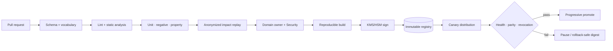

CI phải pin dependency, tạo SBOM/provenance cho compiler/builder và tách quyền author, approver, signer/promoter đối với high-risk policy.

## 7.4 Bundle manifest và activation

Ví dụ dưới đây minh họa manifest cho PoC; các field `security_floor_*` chỉ hợp lệ nếu ADR-009 được phê duyệt sau PoC. Production schema không được coi các field này là bắt buộc trước decision gate.

```yaml
manifest_version: authz-bundle.v1
bundle_digest: sha256:...
created_at: 2026-08-31T10:00:00Z
environment: prod
domains: [platform, broker]
vocabulary_digest: sha256:...
request_schema: authz-request.v1
decision_schema: authz-decision.v1
min_pep_capability: pep-contract.v1
min_pdp_capability: pdp-runtime.v1
security_floor_generation: 17
supersedes: sha256:...
signature:
  key_id: kms://authz-prod/bundle-signing/7
  algorithm: approved-by-security
```

- PDP tải artifact vào vùng staging, verify signature/digest/schema/version và approved revocation metadata rồi mới atomic swap.
- Bundle không tương thích không được activate; instance giữ LKG chỉ khi LKG còn freshness và không khôi phục quyền đã emergency revoke.
- Status tối thiểu: desired/active digest, approved revocation generation nếu có, loaded time, last successful sync, supported schema/PEP/PDP capability và failure reason.
- Artifact được promote theo digest giữa environment; không rebuild binary/policy khi promote.

## 7.5 Attribute provenance và context provider

- Provider registry khai báo owner, workload identity, schema, supported attributes, freshness, residency, error semantics và data classification.
- PEP không cho client ghi đè server-resolved resource/tenant/state; conflict giữa hint và authority bị audit và deny khi security-relevant.
- Attribute được lấy theo batch/bounded query; policy engine không tự gọi provider.
- High-risk state được đọc trong transaction hoặc theo resource version/optimistic guard để hạn chế TOCTOU.
- Relationship graph tập trung chỉ được dùng khi có ownership, consistency, latency, residency và revoke SLA được phê duyệt; nếu không, relationship check ở domain.

## 7.6 Cache, freshness và revocation

### 7.6.1 Các lớp cache

| **Cache** | **Key/authority chính** | **Nguyên tắc** |
| --- | --- | --- |
| JWKS/trust bundle | Issuer, key ID, trust domain | Proactive refresh; unknown key deny; giữ key cũ chỉ trong rotation safety window |
| Base policy bundle | Immutable digest | Atomic activation; LKG có max age và không được khôi phục quyền đã revoke |
| Candidate security floor/revocation set | Monotonic generation + signed deny-only artifact | **Cần PoC**; authority/scope/merge/partition/compatibility tại mục 7.6.3 |
| Attribute/entitlement | Subject/resource + source version | TTL theo authority/risk; invalidation event khi khả thi |
| Decision | Full canonical input fingerprint + policy/revocation digest | Chỉ deterministic decision; `ALLOW` high-risk mutation mặc định không cache |

Decision-cache key tối thiểu:

```text
schema_version
+ actor(issuer, subject, active_tenant, entitlement_version, assurance, credential_id_hash, credential_expiry)
+ caller(workload_id, delegation_mode, delegation_jti/digest)
+ action
+ resource(type, id, tenant, version)
+ all relevant context/fact values and source versions
+ base_bundle_digest
+ approved_revocation_generation_or_digest
```

Nếu không chứng minh được input fingerprint bao phủ mọi thuộc tính ảnh hưởng quyết định thì không cache. `DENY` dùng TTL ngắn để không kéo dài quyền vừa được cấp; response client thống nhất để hạn chế enumeration.

### 7.6.2 Freshness classes đề xuất

Base bundle, approved revocation state, credential, attribute và decision cache có freshness độc lập; không dùng một TTL chung để mô tả tất cả.

| **Risk class** | **Ví dụ** | **Emergency-revocation freshness target** | **Dynamic fact/entitlement** | **Decision `ALLOW`** | **Quá hạn** |
| --- | --- | ---: | --- | --- | --- |
| Critical | Payout, admin grant, approval cuối | `<= 30s` candidate target | Fresh lookup hoặc `<= 60s` theo action | Không cache mutation | Chờ PoC/business decision; an toàn mặc định deny |
| High | Order/customer mutation | `<= 30s` candidate target | `<= 5m` hoặc transactional fact | Không cache mutation | Chờ action-level decision; an toàn mặc định deny |
| Standard | Read business data | `<= 2m` candidate target | `<= 30m` theo source | TTL ngắn được duyệt | Mặc định deny; exception đích danh |
| Public/low-risk | Public catalog | Theo registry | Nhiều giờ nếu không sensitive | Có thể cache | Explicit fail-open được duyệt |

Giá trị cuối cùng phải nằm trong `Runtime Capacity & Resilience Matrix` và được Security/domain/business owner phê duyệt. Token lifetime, delegation lifetime và provider TTL không được dài hơn revoke objective của action nếu không có invalidation hoặc approved emergency-revocation control bù trừ.

### 7.6.3 Candidate security floor — cần PoC và ADR riêng

**Trạng thái thiết kế:** chưa được phê duyệt làm subsystem hoặc invariant production. Requirement bắt buộc chỉ là emergency revoke phải chặn được quyền trong objective đã duyệt và không bị positive cache/LKG/rollback khôi phục. Security floor là một candidate mechanism để PoC so sánh với token/introspection revocation, entitlement-version invalidation và emergency base-bundle rollout.

#### Candidate semantics cần kiểm chứng

| **Câu hỏi thiết kế** | **Candidate baseline cho PoC** | **Điều kiện phê duyệt** |
| --- | --- | --- |
| Authority phát hành | Một logical **Revocation Authority** theo environment/trust domain, do Security Platform vận hành; nhận request có thẩm quyền từ IAM, grant authority hoặc SecOps; chỉ authority này được tăng generation và ký artifact bằng KMS/HSM | IAM/Security/SRE chốt issuer, request authorization, four-eyes, signing-key recovery và immutable admin audit |
| Scope của floor | Generation là global theo environment/trust domain để ordering đơn giản; deny entry có scope explicit: global, tenant, actor/subject, caller, grant/key, action, resource type hoặc resource ID. Floor chỉ **DENY/revoke**, không tạo `ALLOW` | Benchmark cardinality/PII, scope precedence, expiry và tenant isolation; cấm wildcard không owner/TTL |
| Merge với base bundle | PDP verify floor rồi evaluate deny overlay trước khi dùng positive decision/cache. Entry match → `DENY_REVOKED`; không match → evaluate base bundle. Conflict luôn ưu tiên deny; cache key chứa active generation/digest | Golden/property test chứng minh floor không mở quyền, không bị cache/rollback bỏ qua và reason/audit nhất quán |
| Monotonic generation khi multi-region partition | Baseline PoC là **single logical writer** dựa trên linearizable durable log; region là read replica/consumer và không tự mint generation khi partition. Multi-writer/vector generation không thuộc baseline và cần ADR khác | Partition test chứng minh không split-brain/rollback generation; chốt RTO của issuance plane và behavior khi không thể phát revoke mới |
| Floor mới nhưng base bundle chưa tương thích | Floor dùng schema deny-only tối thiểu, version độc lập policy engine; base manifest/runtime khai báo floor schema + vocabulary hỗ trợ. PDP không được bỏ qua floor mới: áp dụng entry hiểu được; action bị ảnh hưởng nhưng không tương thích → `INDETERMINATE_REVOCATION_INCOMPATIBLE` và deny/not-ready theo action policy | Compatibility matrix, out-of-order delivery, N/N-1 runtime/base/floor test và rollout/recovery runbook đạt |

Candidate này có rủi ro biến Authorization Platform thành một control plane thứ hai có strong-consistency requirement. PoC phải đo cả issuance availability, artifact size, 100% fleet convergence, cache invalidation và recovery; nếu không đạt, ADR-009 phải bị loại bỏ hoặc thu hẹp scope.

#### Candidate end-to-end flow

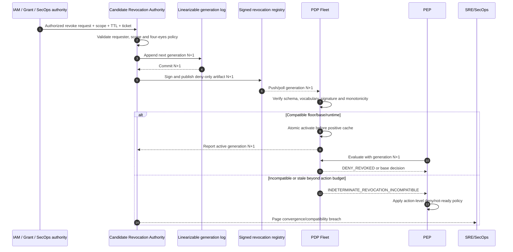

L3/PoC phải đo **effective revocation window** từ lúc source authority commit revoke đến khi mọi healthy enforcement point chặn quyền, gồm authorization, generation commit, signing, distribution, compatibility check, activation, positive-cache bypass và clock skew. Chỉ đo bundle download latency là chưa đủ.

# 8. Request & Event Flow Diagrams

## 8.1 External authenticated read

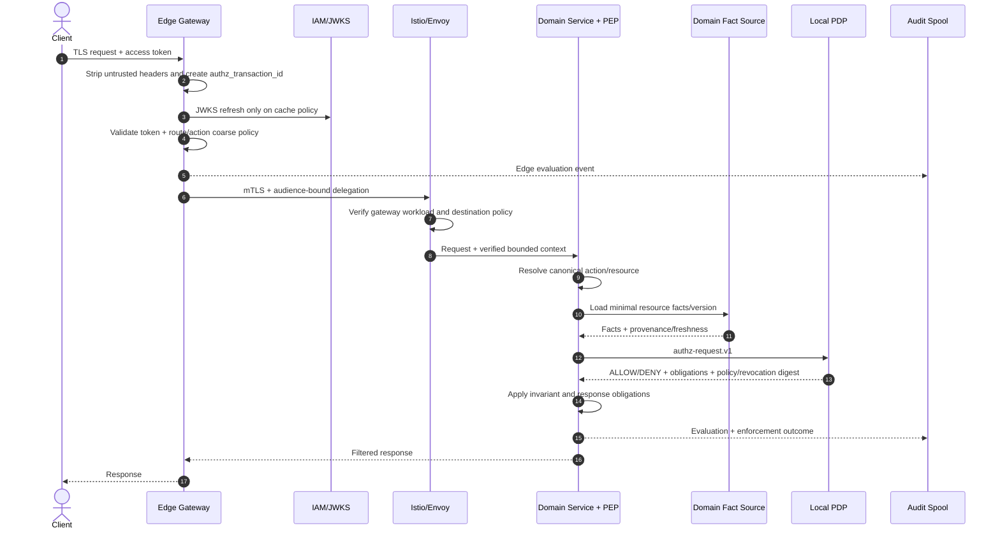

## 8.2 High-risk mutation và TOCTOU guard

```mermaid
sequenceDiagram
    autonumber
    actor C as Operator
    participant E as Edge
    participant S as Broker Service
    participant DB as Broker DB
    participant P as Local PDP
    participant A as Audit Spool

    C->>E: Approve order + idempotency key + token
    E->>E: AuthN, assurance and coarse policy
    E->>S: mTLS + short-lived delegated context
    S->>DB: BEGIN; lock/read order version 42
    DB-->>S: State + tenant + owner + risk tier
    S->>P: actor + caller + action + resource version + fresh facts
    P-->>S: ALLOW + required assurance/obligations
    alt state/version unchanged and obligations supported
        S->>DB: Apply mutation with invariant + outbox
        DB-->>S: COMMIT version 43
        S-->>A: decision + enforcement=COMMITTED
        S-->>E: Success
        E-->>C: Success
    else state changed / obligation failed
        S->>DB: ROLLBACK
        S-->>A: enforcement=NOT_EXECUTED + reason
        S-->>E: Conflict/deny
        E-->>C: Conflict/deny
    end
```

High-risk `ALLOW` không được cache qua state transition. Nếu database transaction dài, service phải re-check authorization-relevant version trước commit hoặc dùng invariant/optimistic condition trong câu lệnh mutation.

## 8.3 Service-to-service delegation

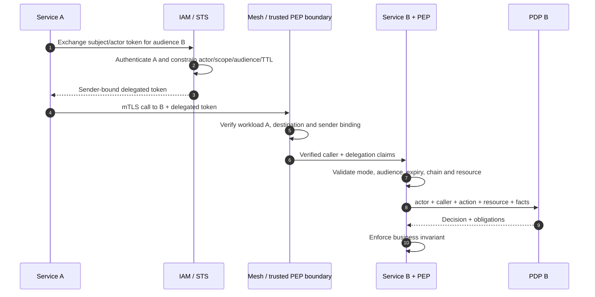

Mỗi hop cần audience đúng callee. Không forward nguyên external bearer token qua chuỗi và không cho Service A mint user context bằng application secret riêng.

## 8.4 Async/event authorization

### 8.4.1 Phân loại message

| **Loại message** | **Ý nghĩa authorization** | **Consumer rule** |
| --- | --- | --- |
| Committed domain event | Sự kiện mô tả fact đã commit, không phải lệnh tái thực thi action gốc | Verify producer/provenance/schema/replay; authorize consumer workload và side effect mới; không “undo history” vì actor hiện đã mất quyền |
| Deferred user command | Lệnh chưa thực thi business side effect | Re-authorize actor + caller tại consume time, trừ approved deferred grant còn hiệu lực |
| System command/job | Lệnh của service/job principal | Check dedicated system action/resource scope và business invariant |
| Notification/audit projection | Side effect dẫn xuất từ committed event | Consumer least privilege, tenant partitioning, idempotency và data-minimization |

### 8.4.2 Async sequence

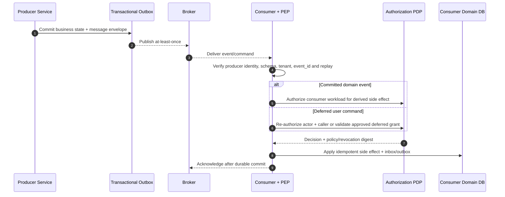

Message envelope tối thiểu có `message_schema_version`, `event_id/command_id`, producer workload, tenant, occurred/requested time, action/resource reference, `authorization_transaction_id`, actor/delegation snapshot tối thiểu hoặc deferred-grant reference, classification và integrity/provenance. Không nhúng bearer token, raw PII hoặc decision `ALLOW` vô thời hạn vào event.

# 9. Security & Compliance Architecture

## 9.1 Identity & Authentication

### Human và machine client

- Edge chỉ chấp nhận access token từ issuer/token class được allowlist; validate chữ ký, algorithm, issuer, audience/resource, `exp`, `nbf`, key state và clock skew.
- ID token không được dùng thay access token cho API. Token không đúng audience không được “chấp nhận tạm” chỉ vì signature hợp lệ.
- Entitlement biến động nhanh không nhồi toàn bộ vào token nếu lifetime vượt revoke objective; dùng entitlement version/fresh lookup/invalidation phù hợp risk.
- External identity headers như `x-user-id`, `x-roles`, `x-tenant-id`, `x-actor-*`, `x-forwarded-client-cert` và delegation header phải bị xóa/ghi đè tại boundary được chỉ định.
- Browser session/BFF có thể tồn tại cho presentation/session security, nhưng không là authority của business policy.

### Workload identity

- Mỗi workload/environment có service account và identity riêng; không dùng namespace default account hoặc shared API key làm định danh chính.
- Certificate ngắn hạn, tự rotation; trust bundle, trust domain và federation có owner/runbook.
- mTLS chứng minh workload peer, không chứng minh actor. Application chỉ nhận caller identity qua API/metadata do trusted mesh boundary cung cấp.
- Workload ngoài mesh phải có inventory, exception TTL và control tương đương trước khi gọi service trong scope.

## 9.2 Authorization & Access Control

- Mesh namespace/workload sau migration dùng mTLS `STRICT` và default-deny authorization baseline; allow theo source principal, destination, port và path class tối thiểu.
- Edge route registry và service handler registry phải đối soát tự động. Route public cũng cần explicit registry entry, data class và rate limit.
- Fine-grained authorization đặt tại domain service/PEP sau khi resolve resource; Istio path policy không thay thế IDOR/ownership/state check.
- PEP input được build từ verified claims và server-side facts; request body/query/header chỉ là hint cho field đã được schema cho phép.
- Privileged/admin action yêu cầu assurance phù hợp, fresh authorization context và decision/enforcement audit.
- Break-glass không sửa policy thường trực: grant riêng, MFA, ticket, scope hẹp, TTL, alert và retrospective.

## 9.3 Secrets, Keys & Credential Management

| **Tài sản** | **Vị trí/authority** | **Yêu cầu** |
| --- | --- | --- |
| IAM signing key/JWKS | IAM/HSM | Rotation overlap, compromise revoke, issuer pinning và unknown-key deny |
| Policy/revocation-artifact signing key | KMS/HSM của Security Platform | Tách key/environment/purpose; signer identity; key ID trong manifest; recovery drill |
| Mesh CA/workload key | Mesh CA/SDS | Key ngắn hạn, không export vào application, trust-domain policy |
| STS client credential | Workload identity/secret manager | Per workload/audience, rotation/revoke, không hard-code |
| Audit encryption/integrity key | Audit platform KMS | Access riêng, rotation không làm mất khả năng đọc theo retention |

Compromised signing key là security incident: dừng promotion, revoke key, nâng trusted-key generation, phân phối approved emergency-revocation artifact (candidate floor nếu được chọn), xác minh fleet convergence và rebuild artifact bằng trusted provenance.

## 9.4 Decision Audit, Privacy & Compliance

### 9.4.1 Correlation model

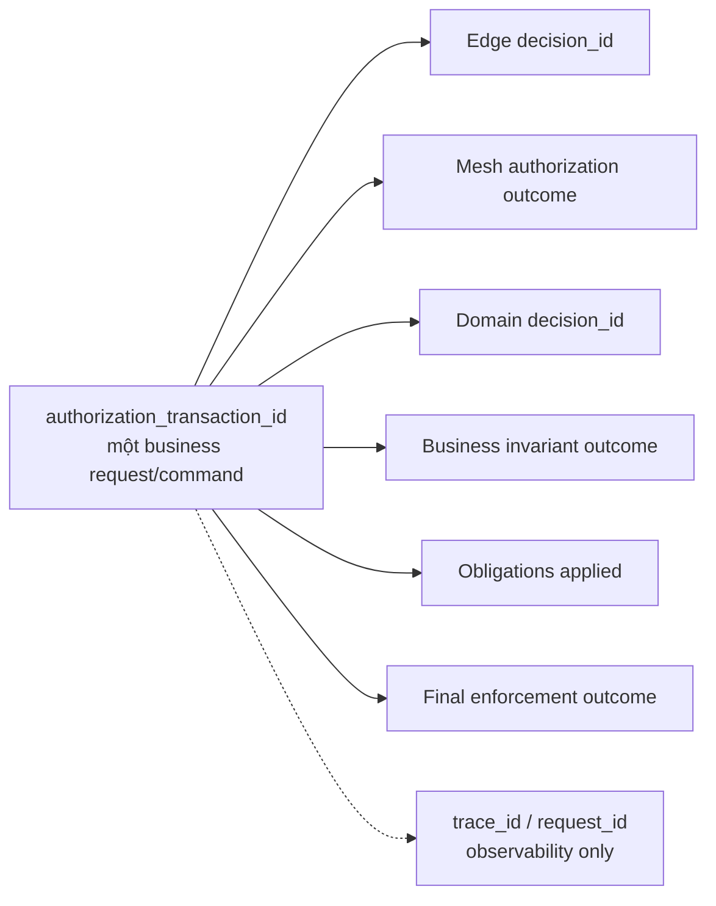

`authorization_transaction_id` nối chuỗi authorization; `decision_id` định danh từng evaluation; `trace_id` có thể được sampling và không là security evidence duy nhất. Final service ghi outcome `EXECUTED`, `NOT_EXECUTED`, `COMMITTED`, `RESPONSE_FILTERED` hoặc status chuẩn tương đương.

### 9.4.2 Audit schema tối thiểu

- event time, observed time, `authorization_transaction_id`, `decision_id`, trace/request ID;
- actor pseudonymous ID/type/tenant, issuer/assurance/entitlement version;
- caller workload identity và delegation mode/chain/token digest;
- action, resource type, tenant và tokenized resource ID khi cần;
- decision/error/enforcement outcome, stable reason, obligations returned/applied;
- base bundle digest, approved revocation generation/digest nếu có, PEP/PDP identity/version;
- context/fact freshness, cache state, latency, environment/region;
- shadow/enforce mode, break-glass/exception/grant ID và data classification.

Không log raw token, raw delegation artifact, request/response body hoặc PII ngoài field allowlist. Audit access dùng RBAC riêng và chính truy cập audit cũng phải được audit.

### 9.4.3 Retention và integrity

- Append-oriented storage, encryption in transit/at rest, integrity/tamper-evidence và time synchronization monitoring.
- Retention/delete/anonymize/legal hold theo domain, region và pháp lý; restore không được làm dữ liệu hết hạn tái xuất hiện ngoài policy.
- Decision explain dành cho support phải redact secret/PII và không tiết lộ rule internals cho caller không được ủy quyền.
- Audit completeness được reconcile giữa request/enforcement counter, local spool sequence và collector acknowledgement.

## 9.5 Mô hình mối đe dọa

| **ID** | **Mối đe dọa** | **Kiểm soát chính** | **Bằng chứng bắt buộc** |
| --- | --- | --- | --- |
| TH-01 | Forged identity/delegation header | Edge/mesh sanitization, signed artifact, caller binding | Negative E2E từ Internet và workload không tin cậy |
| TH-02 | Bearer replay/confused deputy | Exact audience, TTL ngắn, sender constraint, actor+caller policy | Token replay và wrong-caller tests |
| TH-03 | PDP/handler bypass | Network default deny + mandatory middleware/registry | Full route/consumer conformance inventory |
| TH-04 | Cross-tenant IDOR | Active tenant, resource tenant, explicit grant, property tests | Cross-tenant negative matrix |
| TH-05 | Stale/revoked permission | Approved revocation control, invalidation, freshness, positive-cache bypass | End-to-end revoke drill; candidate floor PoC nếu chọn |
| TH-06 | Policy tampering/supply-chain compromise | Protected Git, review, reproducible build, signer/KMS, verify digest | Signed provenance + corrupt bundle test |
| TH-07 | Cache poisoning/key collision | Canonical typed key, source version, tenant/policy/revocation digest | Property/fuzz tests |
| TH-08 | Policy-engine DoS | Input/rule/bundle limits, deadline, concurrency/bulkhead | Load/fuzz/large-input test |
| TH-09 | Audit leakage/tampering/loss | Minimize, encrypt, integrity, access, spool/reconcile | Privacy review + outage/full-spool test |
| TH-10 | Break-glass abuse | MFA, four-eyes, TTL, scope, instant alert, retrospective | Quarterly exercise/report |
| TH-11 | Stale mesh trust or rogue workload | Short cert, trust-domain policy, SA least privilege, default deny | Cert rotation/revoke and caller-spoof tests |
| TH-12 | Obligation omitted | Typed capability, deny unknown, applied-outcome audit | Field/row leak E2E tests |
| TH-13 | Audit availability attack/noisy tenant | Action mode, transactional outbox, per-tenant quota, reserved capacity và admission control | Full-spool/noisy-tenant/partition recovery test |

# 10. Deployment & Infrastructure Topology

## 10.1 Environments

| **Môi trường** | **Mục đích** | **Isolation/yêu cầu** |
| --- | --- | --- |
| DEV | Authoring và component test | Non-prod issuer/key/trust domain; synthetic data |
| STAGING | Contract, integration, migration rehearsal | Production-like topology/versions; no production credential |
| PRE-PROD/OAT | Load, security, DR và operational acceptance | Capacity/resilience config dự kiến production |
| PROD | Enforcement | Prod-only trust domain, key, registry, audit residency và four-eyes promotion |

Policy artifact được promote theo immutable digest; không rebuild giữa STAGING/OAT/PROD. Environment-specific data/config nằm trong signed manifest hoặc approved configuration layer, không patch trực tiếp artifact production.

## 10.2 Production runtime topology

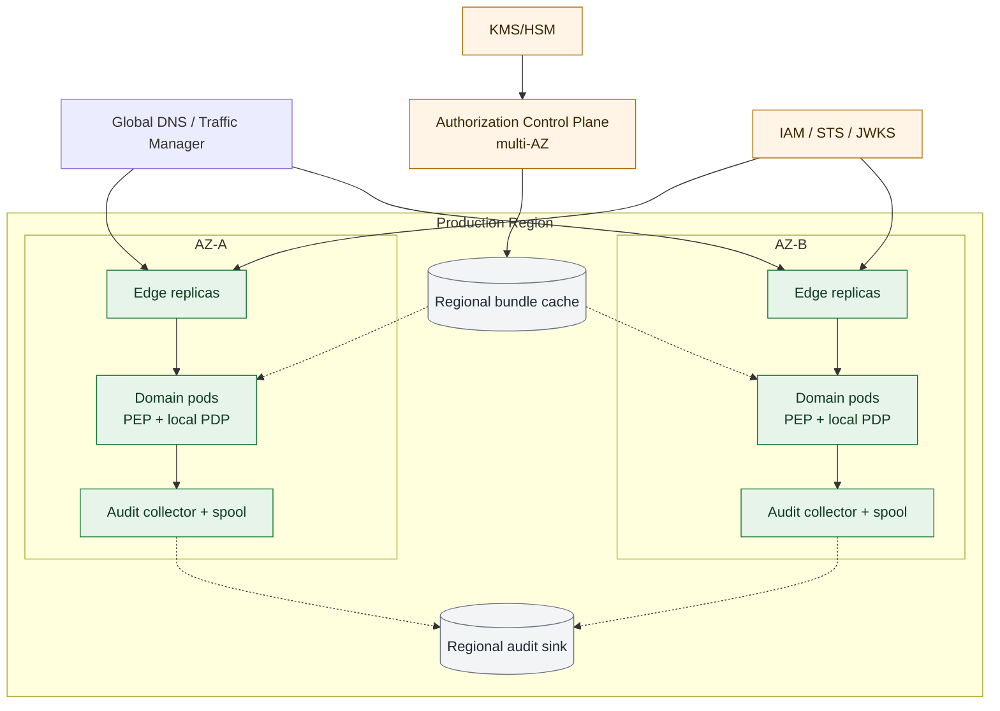

Sơ đồ là logical topology. Số replica, region, autoscaling threshold, pod resources, audit disk quota và database/registry SLA phải được chốt trong L3 Capacity & Resilience Matrix.

## 10.3 Deployment Strategy

- Edge/PDP/PEP/collector dùng rolling hoặc canary deployment với N/N-1 compatibility và PodDisruptionBudget/anti-affinity.
- Bundle rollout độc lập application rollout nhưng bị chặn bởi manifest compatibility và approved revocation contract.
- Readiness tách process, dependency, contract compatibility, base-bundle age và revocation-state age nếu cơ chế yêu cầu. Liveness không được restart loop chỉ vì control plane tạm unavailable.
- Node-local PDP cần blast-radius/node drain plan; sidecar cần resource budget và startup ordering; embedded PDP cần coordinated SDK/application rollout.
- Configuration production là versioned, reviewed, secret reference không inline và có drift detection.

## 10.4 Infrastructure & Network Security

### 10.4.1 Ma trận luồng mạng

| **Nguồn** | **Đích** | **Port/protocol logic** | **Policy** |
| --- | --- | --- | --- |
| Internet/CDN/WAF | Edge | HTTPS | Chỉ public ingress; DDoS/WAF/rate limit |
| Edge workload | Domain ingress/service | Istio mTLS | Gateway principal + route class allowlist |
| Service A | Service B | Istio mTLS | Source principal/destination/action-class allowlist |
| PEP | Local PDP | UDS/loopback authenticated | Pod/node scope; không expose cluster-wide mặc định |
| PDP/runtime | Bundle registry/cache | HTTPS egress | Read-only, pinned trust, digest verify |
| Runtime | Audit collector | Local/mTLS | Write-only identity, bounded flow |
| Control plane | KMS/HSM/registry | Approved private endpoint | Least privilege, admin audit |
| Operator | Admin plane | HTTPS via privileged access | SSO/MFA/four-eyes |

### 10.4.2 Istio rollout

1. Inventory mọi inbound/outbound, service account, port, protocol, health path và workload ngoài mesh.
2. Bật telemetry; chạy `PERMISSIVE` có deadline migration, không coi là target state.
3. Sửa plaintext, direct ingress và unknown caller; tạo negative tests.
4. Chuyển workload/namespace sang `STRICT` và default-deny authorization baseline.
5. Canary caller allowlist; theo dõi deny/error/business KPI trước promotion.
6. Egress qua controlled policy/gateway cho external dependency cần thiết.
7. Thu hồi exception/service account/credential cũ sau zero-traffic evidence.

## 10.5 Migration Strategy

### 10.5.1 Trạng thái route/action

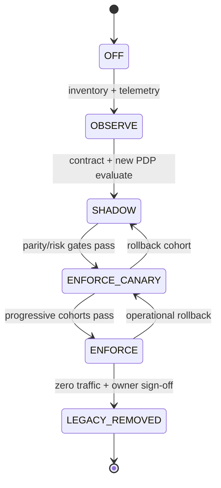

### 10.5.2 Pha và exit criteria

| **Pha** | **Hoạt động** | **Exit criteria** |
| --- | --- | --- |
| 0 — Discovery | Inventory endpoint/client/issuer/audience/role/downstream/data/SLO; classify pure proxy/composition/business logic | 100% route in scope có owner, action/resource, risk, current decision source |
| 1 — Foundation | Edge hygiene, mesh observe/permissive, contract, policy repo/signing, PDP/PEP, audit/correlation | E2E non-prod, signed policy artifact và approved revocation mechanism, negative/chaos smoke pass |
| 2 — Shadow | Legacy enforce; new policy evaluate cùng canonical facts, no response effect | Đủ business cycle; 0 unexplained high-risk mismatch; standard threshold + sample size được duyệt |
| 3 — Cohort enforce | Internal → low-risk read → write 1/5/25/50/100% → privileged | Automated health, deny delta, privilege-expansion and KPI gates pass |
| 4 — BFF decompose | Shared security → platform; invariant → domain; giữ Experience API có composition value | Mỗi route có rollback, owner và no-bypass evidence |
| 5 — Decommission | Zero traffic window, revoke credential/SA/network/secret, archive mapping/runbook | Dependency map sạch và Security/SRE/domain sign-off |

### 10.5.3 Domain order

- `agent-api`: chuyển token/coarse scope lên Edge; ownership/hierarchy về Agent domain; giữ composition endpoint nếu có UX value.
- `market-api`: pilot public/authenticated read không composition; licensing/entitlement là domain fact; tách public data khỏi licensed/private data.
- `core-broker-api`: sau cùng; money movement, customer/portfolio, approval/admin luôn fail-close, fresh context và transactional invariant.

### 10.5.4 Rollback guard

- Rollback route, application và policy là ba cơ chế độc lập nhưng đều tạo audit/change event.
- Không rollback về legacy/digest đã biết có privilege vulnerability hoặc khôi phục quyền đã emergency revoke; nếu candidate floor được chọn thì digest phải tương thích active generation.
- Security incident ưu tiên deny overlay/kill switch; availability incident có thể về LKG an toàn trong freshness window.
- Legacy fallback có expiry/owner; không được trở thành trạng thái kéo dài không theo dõi.

# 11. Cost & Capacity/Performance

## 11.1 Workload model bắt buộc

| **Input** | **Phân rã tối thiểu** |
| --- | --- |
| Request volume | Average/peak/2x peak RPS theo Edge, action class, tenant và region |
| Concurrency | HTTP/gRPC, long request, async consumer và burst profile |
| Policy | Rule count, evaluation branch, bundle size, number of domain bundles |
| Input/facts | P50/P95 size, attribute count, cache hit/miss, provider latency |
| Audit | Evaluation per request, event size, EPS, retention, replay/backlog |
| Fleet | Pod/node/AZ count, sidecar/node-local density, rollout surge |
| Failure | One-AZ loss, registry/IAM/audit outage, cold start and floor convergence |

Không dùng một RPS tổng duy nhất. Critical mutation, standard read, public route và shadow dual-evaluation có cost/latency khác nhau.

## 11.2 Capacity & Performance Rules

- Edge và PDP scale ngang theo concurrency/RPS/CPU/evaluation latency; không dùng per-request global coordination.
- Mỗi topology benchmark cold/warm cache, bundle activation, max input và worst approved policy; average-only test không đủ.
- Capacity target `2x approved peak` và N-1 AZ phải được chứng minh bằng load/soak, không chỉ tính toán.
- Context provider có bulkhead/quota riêng; cache miss storm không được làm cạn connection/thread pool domain.
- Audit spool có disk/memory budget, high-water mark, admission/degradation behavior và drain-rate test.
- Shadow traffic được tính vào compute, fact lookup và audit capacity; sampling chỉ khi Security/domain chấp thuận và không áp dụng cho high-risk case cần parity đầy đủ.

## 11.3 Cost

Cost model trước implementation baseline phải tách:

- Edge request/WAF/rate-limit/license cost;
- sidecar/node-local PDP CPU/memory và rollout surge;
- control-plane CI/registry/KMS signing/egress;
- audit ingestion, hot search, archive, retention và tokenization;
- fact provider/cache/relationship graph nếu có;
- multi-region HA/DR và engineering/on-call cost.

FinOps/SRE so sánh sidecar, node-local, embedded và remote topology bằng cost trên một triệu evaluation và cost ở peak/N-1, không chỉ resource idle.

# 12. Scalability & Reliability

## 12.1 Scaling Strategy

- Edge stateless trừ session capability được phê duyệt; session không là authorization authority.
- Local PDP giữ immutable bundle trong memory; bundle distribution dùng jitter/backoff để tránh thundering herd.
- Registry/cache phân vùng theo region; audit ingestion partition theo time/domain/tenant hash nhưng không đưa raw tenant/actor vào metric label.
- Autoscaling dùng leading indicator như concurrency/queue/evaluation P95 bên cạnh CPU; scale-down bảo vệ in-flight request và audit spool.

## 12.2 High Availability & Disaster Recovery

- Edge/control plane/remote PDP/collector critical chạy đa AZ, anti-affinity và disruption budget; không có leader trên request path.
- Control plane unavailable không làm dừng data plane nếu base bundle và approved revocation state còn hợp lệ.
- Policy Git/registry/status metadata có backup/replication; signing key có recovery/revoke runbook không export private key tùy ý.
- Diễn tập mất AZ/region, expired JWKS, corrupt bundle, stale revocation state, compromised signer và audit backlog tối thiểu hai lần/năm.
- Multi-region chỉ enable sau khi chốt trust federation, issuer/key distribution, emergency-revocation ordering/convergence, audit residency và conflict-free promotion authority.

## 12.3 Failure Semantics

| **Sự cố** | **Hành vi request** | **Readiness/operation** |
| --- | --- | --- |
| Token invalid/unknown key | Reject; không bỏ qua signature | Alert theo spike/issuer; refresh đúng cache policy |
| IAM unavailable, token/key còn hợp lệ | Tiếp tục đến credential/key safety window | Alert/degrade; không kéo dài token |
| Control plane/registry unavailable | Dùng LKG base bundle + approved revocation state còn hạn | Alert bundle/revocation age; stop promotion |
| Bundle mới corrupt/incompatible | Không activate, giữ safe digest | Mark desired≠active, page rollout owner |
| Approved revocation state stale | Theo action-level policy; an toàn mặc định critical/high deny hoặc not-ready | Page convergence; candidate floor behavior phải qua PoC |
| Local PDP crash/timeout | Fail-close; `503` thường phù hợp hơn giả policy deny | Restart/fail readiness; no silent bypass |
| Remote PDP/context unavailable | Cache còn hạn theo risk; hết hạn deny trừ explicit low-risk exception | Circuit open, bulkhead, provider alert |
| Domain DB conflict/state change | Không mutation, return domain conflict/deny | Audit not-executed with version |
| Audit backend unavailable | Dùng approved path: transactional audit outbox hoặc local queue theo action mode | Alert lag; áp dụng Action-level Audit Durability Matrix |
| Signing key compromised | Freeze promotion, revoke trust/key generation, activate approved emergency-revocation control | Security incident/runbook |

## 12.4 Audit spool và loss policy

Remote audit backend không nằm synchronous trên request path. Tuy nhiên, yêu cầu durable local enqueue trước side effect là **business/compliance decision theo từng action**, không được suy diễn chỉ từ risk class và không có fail-close mặc định cho toàn platform. Nếu dùng fail-close, team phải chấp nhận rõ storage failure có thể gây outage hoặc bị lạm dụng thành availability attack.

### 12.4.1 Audit durability modes

| **Mode** | **Semantics** | **Khi spool không durable/full/corrupt** | **Approval tối thiểu** |
| --- | --- | --- | --- |
| `REQUIRED_DURABLE` | Local durable enqueue phải được acknowledge trước business side effect/commit | Không thực thi; trả controlled `503`, page và mở incident | Business Owner + Security/Legal + SRE |
| `DEGRADED_BOUNDED` | Bình thường durable enqueue; được tiếp tục trong degraded window đã định lượng | Tiếp tục đến hết window/quota rồi áp dụng failure action đã duyệt; mọi request có degraded marker/counter | Business Owner risk acceptance + Security/Legal + SRE |
| `BEST_EFFORT` | Audit không là precondition của action | Tiếp tục, alert/counter/reconciliation theo registry | Data/Business Owner + Security; chỉ low-risk/public |

`REQUIRED_DURABLE` bảo vệ evidence nhưng làm spool thành dependency availability. `DEGRADED_BOUNDED` giảm outage nhưng chấp nhận khoảng trống audit có giới hạn. Hai mode đều cần threat/load/failure test; không có mode nào được chọn mặc định chỉ vì action được gắn nhãn `Critical`.

Với mutation chỉ ghi domain DB, `REQUIRED_DURABLE` được hiện thực bằng **Transactional Audit Outbox**: business row và audit intent cùng commit, nên không có state visible nếu audit intent không durable. Với side effect ngoài DB như gọi payment/provider, durable command/audit intent phải commit trước khi dispatcher idempotent gửi ra ngoài; không gọi external system rồi mới cố ghi audit.

### 12.4.2 Action-level Audit Durability Matrix

Trước production, L3 phải có **một row cho từng action**; thiếu row hoặc thiếu approval thì action không được chuyển sang `ENFORCE`.

| **Action** | **Business owner** | **Mode** | **Degraded window** | **Reserved capacity/quota** | **Hành vi khi hết window/quota** | **Approval/evidence** |
| --- | --- | --- | --- | --- | --- | --- |
| `broker.order.approve` | TBD | `TBD` | `TBD` | `TBD` theo peak EPS/event size | `TBD` | Chưa phê duyệt — chặn production |
| `<pilot-action>` | TBD | `TBD` | `TBD` | `TBD` theo pilot load | `TBD` | Chốt trước pilot enforce |
| Mỗi action còn lại | Action owner | Bắt buộc chọn một mode | Giá trị số hoặc `0` | Giá trị số + retention/drain assumption | `503`, deny, continue hoặc fallback được duyệt | Sign-off + full-spool test |

Matrix phải ghi thêm data class, maximum event size, expected/peak EPS, required retention in spool, drain rate, alert threshold và incident owner. Degraded window dùng mốc persistent/monotonic và không được reset bằng pod restart hoặc route chuyển replica.

### 12.4.3 Quota isolation và chống availability attack

- Tách logical queue/quota tối thiểu theo domain và tenant; action critical có reserved capacity riêng, không dùng toàn bộ dung lượng chung theo first-come-first-served.
- Áp dụng per-tenant/per-caller admission rate, maximum event size và weighted-fair drain; tenant vượt quota bị throttle/quarantine mà không làm đầy phần reserve của tenant khác.
- Dành emergency reserve cho platform/security event và tenantless system action; application traffic không được tiêu thụ reserve này.
- High-water mark kích hoạt backpressure trước full; disk/memory quota, drain rate và thời gian chịu đựng phải được tính từ approved peak, event size và downstream outage objective.
- Corrupt partition/tenant queue được cô lập khi có thể; global corruption chuyển theo mode/action matrix, không silently drop hoặc tự động fail-open.
- Scale-out không được nhân vô hạn tổng spool quota; SRE quản lý capacity budget toàn fleet và kiểm thử tenant-noisy-neighbor.
- Reconciliation dùng sequence/checkpoint theo partition và so sánh request/enforcement counter với collector acknowledgement.

Spool phải mã hóa, restart-recoverable và có integrity/checkpoint. “Dropped event = 0” chỉ là objective khi durability mode, reserved quota, full behavior và reconciliation đã được thiết kế/test; không được đồng thời tuyên bố non-blocking và bỏ ngỏ khi buffer đầy.

## 12.5 Fail-open exception

Chỉ endpoint public hoặc read-only low-risk được đăng ký mới có thể fail-open. Exception bắt buộc có action/resource, owner, Security approval, data class, fallback response, TTL/expiry, metric/alert và quarterly review. Không fail-open cho cross-tenant, admin, secret/PII, money movement, write/delete hoặc stale approved revocation state của action critical/high.

# 13. Observability & Monitoring

## 13.1 Yêu cầu nền tảng

- Metric, log, trace và audit dùng cùng environment/service/action-class/policy-digest semantics nhưng không dùng raw actor/resource ID làm label.
- Edge tạo/ghi đè `authorization_transaction_id` tại trusted boundary; service propagate nó cùng trace context nhưng không dùng ID đó làm bằng chứng identity.
- Dashboard tách explicit deny, input error, dependency unavailable, stale revocation state, business conflict và obligation failure.
- Telemetry pipeline có data classification, field allowlist, sampling rule, retention và access owner.

## 13.2 Chỉ số bắt buộc

| **Nhóm** | **Metric/chiều phân rã** |
| --- | --- |
| Edge/AuthN | Request/latency/error; expired/issuer/audience/signature/malformed; route registry miss |
| Authorization | Allow/deny/indeterminate/unavailable; action class; reason; enforce/shadow; policy digest/revocation generation |
| PDP | Evaluation p50/p95/p99, timeout, concurrency, input/bundle size, cold start, active/desired digest |
| Freshness/cache | Bundle/revocation/attribute age, cache hit/miss/eviction, stale use, invalidation lag |
| Migration | Legacy allow/new deny, legacy deny/new allow, unknown/error, cohort and sample size |
| Mesh | mTLS coverage, plaintext attempt, denied caller, trust/cert expiry |
| Audit | Spool depth/bytes/oldest age, enqueue failure, drop count, collector ack lag, reconciliation gap |
| Obligation | Returned/applied/unsupported/conflict/failure theo type/version |
| Business | Final executed/not-executed/committed/filtered outcome và action KPI |

## 13.3 Cảnh báo

| **Alert** | **Điều kiện định hướng** | **Owner** |
| --- | --- | --- |
| Emergency-revocation convergence breach | Healthy enforcement point chưa đạt generation/digest mới quá revoke SLA | Security Platform + SRE |
| Privilege-expansion mismatch | Legacy `DENY` / new `ALLOW` > 0 ở critical hoặc vượt approved threshold | Domain + Security |
| Cross-tenant anomaly | Cross-tenant deny spike hoặc allow không có registered grant | SecOps + Domain |
| PDP SLO burn | Error/timeout/latency burn-rate nhanh/chậm | Authorization on-call |
| Route/handler coverage drift | Route/handler không có action hoặc inventory mismatch | Gateway/Domain owner |
| Bundle/fleet drift | Desired≠active, signature/schema failure hoặc stale age | Security Platform |
| Audit durability risk | Enqueue error, spool high-water/full, ack/reconcile lag | SecOps/SRE |
| Break-glass/wildcard | Bất kỳ activation hoặc usage | SecOps + approver |
| Mesh trust failure | Plaintext, unknown principal, cert/trust bundle expiry | Mesh/SRE |

Threshold số, burn-rate window và escalation path nằm trong Dashboard & Alert L3; alert critical phải có synthetic test và runbook link trước production.

## 13.4 SLI/SLO

- SLI availability theo action đo từ trusted Edge đến final enforcement outcome; explicit policy deny không tính là platform error.
- `INDETERMINATE`, PDP/context unavailable, stale approved revocation state và obligation failure tính là failed authorization service cho SLO dù action đã fail-close an toàn.
- Latency action bao gồm Edge, mesh, fact lookup, PDP, invariant và obligation; local evaluation latency là component SLI riêng.
- Revocation SLI đo commit-at-authority → fleet enforce, không chỉ publish/download.
- Audit SLI đo local durable enqueue và end-to-end collector delivery riêng.
- Error budget Edge/PDP/action do SRE và owner quản lý; policy/application rollout tự pause khi burn, mismatch hoặc business KPI vượt gate.

# 14. Operational Readiness

## 14.1 RTO & RPO

| **Năng lực** | **RPO target đề xuất** | **RTO target đề xuất** | **Ghi chú** |
| --- | ---: | ---: | --- |
| Runtime Edge/local PDP | Không có state request cần restore | Theo action SLO/auto failover | Bundle/approved revocation state phải có local safe state |
| Policy Git/registry/control metadata | `<= 15 phút` | `<= 60 phút` | Không được làm mất approved digest/provenance |
| Signing/revocation capability | Không mất key state/generation | `TBD` critical runbook | Compromise recovery khác outage recovery |
| Decision audit | Theo compliance schedule | Theo SecOps incident need | Local spool/replication và reconciliation |

Giá trị cuối cùng cần SRE/Security/Privacy phê duyệt và restore/failover drill. LKG không thay thế backup control-plane metadata hoặc signing-key recovery.

## 14.2 Runbook bắt buộc

- IAM/JWKS outage, unknown key và emergency user/client revoke;
- bundle compile/sign/publish failure, corrupt bundle và fleet digest drift;
- emergency-revocation convergence breach và deny/kill switch;
- PDP crash/latency/CPU/memory/cold-start regression;
- context provider outage/cache storm và remote-PDP circuit open;
- audit backend outage, outbox/queue high-water/full/corrupt, noisy tenant và reconciliation;
- compromised bundle/STS/mesh signing key;
- mTLS cert/trust-domain failure, plaintext/unknown caller;
- policy/legacy route rollback không khôi phục revoked access; candidate floor flow nếu được chọn;
- lost AZ/region, restore registry/metadata và validate post-restore;
- break-glass activate/revoke/retrospective.

## 14.3 Action-level production checklist

Một action chỉ sẵn sàng production enforcement khi:

- có owner, risk class, versioned action/resource schema và data classification;
- issuer/audience/token class, workload identity và delegation mode được xác minh;
- route, handler, async/job và response path có no-bypass coverage evidence;
- resource/tenant/fact authority, provenance, freshness và TOCTOU rule được chốt;
- policy có positive/negative/cross-tenant/stale/property tests và signed policy/revocation digest;
- PEP hiểu/applies mọi obligation; final enforcement outcome được audit;
- shadow sample đủ business cycle; mọi privilege expansion đã đóng, không chỉ đạt tỷ lệ tổng;
- load/soak/chaos/security test đạt action SLO và revoke objective;
- fail mode, cache, LKG, approved revocation control, audit-full/noisy-tenant và rollback đã diễn tập;
- Action-level Audit Durability Matrix có business owner, mode, degraded window, quota và failure action đã ký duyệt;
- dashboard, alert, on-call, runbook, RTO/RPO và capacity owner tồn tại;
- Security, Domain Owner và SRE ký duyệt; Privacy ký nếu audit/resource data yêu cầu.

## 14.4 RACI tóm tắt

| **Năng lực** | **Accountable** | **Responsible** | **Consulted** |
| --- | --- | --- | --- |
| IAM/token/delegation profile | Identity/Security | IAM team | Platform, domains |
| Edge Gateway | Application Platform | Gateway team/SRE | Security, domains |
| Mesh/workload identity | Platform/SRE | Mesh team | Security |
| Control plane/PDP/PEP SDK | Security Platform | Authorization team | SRE, domains |
| Tenant/security guardrail | Security Architecture | Security Platform | Domain owners |
| Domain vocabulary/policy/facts | Domain owner | Domain team | Security Platform |
| Business invariant/response filter | Domain owner | Domain service team | Security |
| Audit durability mode theo action | Product/Business Owner | Domain team + SRE | Security, Legal/Privacy, SecOps |
| Audit/SIEM/privacy | SecOps/Privacy | SecOps/Data Platform | Product/Business, Legal, SRE, domains |
| SLO/on-call | Platform + owning domain | SRE/service team | Security |

## 14.5 Recommended first slice

Chọn một endpoint **read-only, authenticated, single-active-tenant, traffic vừa, resource authority rõ và không có composition phức tạp** từ `agent-api` hoặc `market-api`. Pilot phải đi trọn Edge → mTLS → delegated context → domain PEP/PDP → obligation/enforcement outcome → approved audit mode, đồng thời chạy revoke drill và handler-coverage test. Không dùng `core-broker-api`, privileged action hoặc remote relationship graph làm first slice.

# 15. Testing & Quality Strategy

## 15.1 Phạm vi kiểm thử bắt buộc

| **Nhóm** | **Phạm vi** | **Cổng** |
| --- | --- | --- |
| Policy unit/negative | Allow/deny, missing field, wildcard, tenant, stale, exception expiry | Mọi PR |
| Property/fuzz | Unknown action deny, cross-tenant invariant, monotonic floor, canonical cache key, input limits | Build bundle |
| Contract | Request/decision/obligation/error, schema evolution, N/N-1 capability | Integration/OAT |
| Route/PEP conformance | Edge routes, HTTP/gRPC handlers, consumers, jobs, response filters | Build + production gate |
| Identity/security | Issuer/audience/algorithm, forged header, replay, caller spoof, confused deputy, IDOR | OAT/security sign-off |
| Integration | JWKS/key rotation, STS, mesh, PDP, facts, KMS, registry, audit | OAT |
| Migration | Golden confirmed behavior, shadow comparison, cohort, rollback and emergency revoke | Mỗi route cutover |
| Performance/soak | Peak/2x, N-1 AZ, bundle/input worst case, cold start, cache miss, shadow load | OAT |
| Chaos/DR | PDP/control/registry/IAM/audit/fact outage, stale/corrupt bundle/revocation artifact, AZ/region loss | OAT/DR |
| Privacy/audit | Field allowlist, tokenization, access, retention/delete/restore, completeness reconcile | Privacy/OAT |

## 15.2 Cổng chất lượng

- CI: schema/lint/static analysis, unit/negative/property test, dependency/SBOM/provenance và signature verification.
- STAGING: contract, integration, route coverage, shadow replay và backward compatibility.
- OAT: threat-model tests, load/soak, chaos, revoke objective, full-spool behavior, restore/rollback.
- Production canary: policy digest/revocation generation/PEP version pin, cohort KPI, deny delta, SLO burn và auto-pause.
- Evidence lưu theo release/action: report, sample size, migration mapping, signed digest, dashboard/alert test, runbook drill và risk acceptance còn hạn.

## 15.3 Kịch bản kiểm thử trọng yếu

- Client tự gửi mọi identity/delegation/XFCC header phải bị strip; downstream chỉ thấy context do trusted boundary tạo.
- Token đúng signature nhưng sai issuer/audience/token class/algorithm hoặc key chưa biết đều bị từ chối.
- External bearer token forward sang sai service audience bị từ chối; exchanged token dùng bởi workload khác thất bại sender binding.
- Service A hợp lệ nhưng actor không có quyền, hoặc actor hợp lệ nhưng caller A không được phép, đều deny.
- `system` job không thể đổi mode thành `on_behalf_of` hoặc gắn actor giả.
- Unknown route, handler thiếu action annotation, gRPC method mới, consumer/job chưa đăng ký và response obligation hook thiếu đều không bypass.
- Cross-tenant request không grant, grant sai action/resource/caller, expired/revoked grant đều deny.
- Decision-cache collision/fingerprint thiếu fact/version/policy/revocation digest phải được property test phát hiện; approved emergency revoke phải bypass mọi positive cache.
- Revoke user/grant/policy/key đo từ authority commit tới toàn fleet; PDP stale quá budget deny/not-ready.
- Bundle corrupt/sai signature/incompatible schema/revocation metadata cũ không activate; atomic swap không có partial state.
- High-risk mutation state đổi giữa lookup và commit không thực thi; audit nối decision tới `NOT_EXECUTED`/conflict.
- Unknown/conflicting/misapplied obligation không trả dữ liệu; field/row leak test chạy E2E.
- Legacy `DENY`/new `ALLOW` chặn canary; tỷ lệ parity phải kèm absolute count và risk-weighted sample.
- Audit sink outage dùng đúng transactional outbox/local queue; full/corrupt/noisy tenant áp dụng đúng action mode, degraded window/quota và không silent drop.
- Async committed event không bị xử lý như reusable user `ALLOW`; deferred command hết quyền/expired grant không tạo side effect.
- Mất control plane/registry vẫn dùng safe LKG + approved revocation state; compromised signer không cho rollback về compromised digest.
- Load 2x peak, one-AZ loss, cold start và shadow dual-evaluation không vượt action SLO/capacity gate.

## 15.4 Dữ liệu kiểm thử và bằng chứng

Replay/impact test chỉ dùng dữ liệu tổng hợp hoặc đã ẩn danh/tokenize theo phê duyệt. Fixture identity/resource/fact có schema/version, không chứa production credential/PII và bao phủ success, deny, stale, malformed, timeout, duplicate, cross-tenant và revoke. Bằng chứng phải truy ngược được từ action/release tới policy digest, approved revocation generation/digest, PEP/PDP version và test report.

# 16. Risks & Open Issues

## 16.1 Architecture Risks

| **Mã** | **Nhóm** | **Mô tả/ảnh hưởng** | **Mức độ** | **Giảm thiểu/điều kiện đóng** |
| --- | --- | --- | --- | --- |
| AR-001 | Delegation | IAM/token exchange/sender binding chưa chốt; raw context có thể bị giả mạo/confused deputy | Nghiêm trọng | IAM & Delegation Profile v1 + replay/wrong-caller E2E được ký duyệt |
| AR-002 | PEP bypass | SDK gọi thủ công hoặc route/consumer mới thiếu PEP có thể bỏ qua authorization | Nghiêm trọng | Default-deny route/handler/consumer registry và full coverage evidence |
| AR-003 | Revocation | Token, attribute, decision cache, base bundle và LKG có thể tạo cửa sổ revoke không kiểm soát; candidate floor chưa chứng minh semantics/availability | Nghiêm trọng | So sánh cơ chế, ADR-009 PoC và measured end-to-end revoke drill đạt SLA |
| AR-004 | Supply chain | Compromised policy/signing key gây blast radius đa domain | Nghiêm trọng | KMS/HSM, SoD, provenance, key-revoke/revocation-control recovery exercise |
| AR-005 | Tenant | Exact tenant equality không đủ cho legitimate cross-tenant; role bypass có thể gây data breach | Cao | Explicit grant contract/authority/expiry + property/negative tests |
| AR-006 | Obligation | Edge/domain không thống nhất capability/merge có thể trả dữ liệu chưa mask | Cao | Typed registry, capability negotiation, applied-outcome and leak tests |
| AR-007 | Async | Không phân biệt event/command có thể tái dùng ALLOW cũ hoặc chặn workflow hợp lệ | Cao | Async semantics/envelope/inbox-outbox contract + E2E |
| AR-008 | Audit/Availability | Durable-audit fail-close có thể gây outage/availability attack; continue có thể mất evidence | Nghiêm trọng | Action-level Audit Durability Matrix, business approval, quota isolation, outbox/full-spool/noisy-tenant test |
| AR-009 | Engine/topology | Engine/PDP placement chưa benchmark có thể không đạt latency/cost/operability | Cao | PoC report theo mục 5.1, Architecture Council decision |
| AR-010 | Mesh coverage | Workload/plaintext/direct ingress ngoài mesh tạo bypass | Cao | Traffic inventory, `STRICT`, default deny, exception expiry and tests |
| AR-011 | Multi-region | Trust/revocation/audit residency chưa chốt có thể drift hoặc vi phạm data boundary | Cao | Multi-region SAD, federation/convergence/DR approval |
| AR-012 | Legacy mapping | Golden test có thể đóng băng lỗ hổng legacy hoặc shadow bỏ sót rare path | Cao | Confirmed cases, risk-weighted coverage, full-cycle/sample evidence |
| AR-013 | Capacity | Chưa có workload/size/audit EPS nên SLO và roadmap có thể không khả thi | Cao | Approved workload model + 2x/N-1 load/soak |
| AR-014 | Platform adoption | Policy language/SDK/governance phức tạp làm team fork/bypass paved road | Trung bình | Templates, lint/explain, training, conformance and deprecation support |
| AR-015 | Cost | Sidecar/audit/multi-region cost chưa định lượng | Trung bình | FinOps comparison per million evaluation và peak/N-1 |

## 16.2 Vấn đề thiết kế cần quyết định

| **ID** | **Vấn đề cần quyết định** | **Owner đề xuất** | **Điều kiện đóng/cổng** |
| --- | --- | --- | --- |
| OI-01 | IAM issuer/token profile và RFC 8693/workload federation support | IAM + Security | Delegation Profile v1 trước PoC S2S |
| OI-02 | Gateway product/integration external auth | Application Platform | Platform ADR + HA/feature evidence trước implementation baseline |
| OI-03 | Policy engine và sidecar/node-local/embedded topology | Authorization + SRE | Benchmark report/ADR trước PoC baseline |
| OI-04 | Cross-tenant grant authority/data model | Security Architecture + Domains | Contract + negative/property tests trước relevant action |
| OI-05 | Relationship data ở graph hay domain | Domain + Architecture | Ownership/consistency/latency/residency decision |
| OI-06 | Emergency-revocation mechanism, TTL/convergence; nếu chọn floor phải chốt authority/scope/merge/partition/compatibility | IAM + Security + SRE | ADR-009 + end-to-end/partition drill trước high-risk pilot |
| OI-07 | Audit field/retention/residency/legal hold | SecOps + Privacy/Legal | Decision Audit Contract trước OAT/data thật |
| OI-08 | Workload/peak/SLO/RTO/RPO/capacity/cost | Product + SRE + FinOps | Approved baseline + load/DR evidence |
| OI-09 | Multi-region trust and promotion authority | Platform/Security | Deployment SAD trước multi-region enable |
| OI-10 | BFF endpoint classification/composition value | Domain + Application Platform | Migration Matrix trước route cutover |
| OI-11 | On-call 24x7 và incident authority cho Edge/PDP/signer | System owners | Named roster/runbook before production |
| OI-12 | Audit durability mode/degraded window/reserved quota/failure action theo từng action | Product/Business + Security/Legal + SRE | Signed Action-level Audit Durability Matrix + full/noisy-tenant test trước enforce |

Vấn đề mở không mặc nhiên được chấp nhận. Risk acceptance cần owner, scope/action, control bù trừ, approver, evidence và expiry; item nghiêm trọng chưa đóng chặn `UNDER REVIEW → APPROVED` trừ khi Architecture Council ghi rõ điều kiện phê duyệt.

# Appendix

## A. Glossary

| **Thuật ngữ** | **Định nghĩa** |
| --- | --- |
| Actor | Principal gốc chịu ngữ nghĩa của action: user, service hoặc job. |
| Caller | Workload trực tiếp thực hiện hop hiện tại; không đồng nhất với actor. |
| PEP | Policy Enforcement Point: tạo/validate input, lấy facts, gọi PDP và enforce decision/obligation. |
| PDP | Policy Decision Point: evaluate policy trên canonical input. |
| Control plane | Author/test/build/sign/distribute/inventory policy; không bắt buộc synchronous mỗi request. |
| Data plane | Edge/mesh/service PEP/PDP thực thi request runtime. |
| Delegation | Quyền một caller hành động thay mặt actor, có audience/scope/TTL/provenance. |
| Candidate security floor | Phương án deny-only monotonic revocation artifact tại mục 7.6.3; **chưa là production invariant**, cần PoC/ADR. |
| LKG | Last-known-good bundle đã verify, còn freshness và không khôi phục quyền đã emergency revoke. |
| Obligation | Enforcement bắt buộc sau decision như step-up, mask field hoặc row limit. |
| Authorization transaction | Một business request/command có thể gồm nhiều evaluation/decision ID. |
| Explicit grant | Artefact cho phép cross-tenant/deferred action có authority, scope, version, expiry và revoke. |

## B. References

| **Tài liệu/chuẩn** | **Tham chiếu** |
| --- | --- |
| OAuth 2.0 Token Exchange | [RFC 8693](https://www.rfc-editor.org/rfc/rfc8693.html) |
| OAuth 2.0 mTLS and Certificate-Bound Tokens | [RFC 8705](https://www.rfc-editor.org/rfc/rfc8705.html) |
| OAuth 2.0 Security Best Current Practice | [RFC 9700](https://www.rfc-editor.org/rfc/rfc9700.html) |
| Zero Trust Architecture | [NIST SP 800-207](https://csrc.nist.gov/pubs/sp/800/207/final) |
| Istio Authorization Policy | [Istio Security Reference](https://istio.io/latest/docs/reference/config/security/authorization-policy/) |
| Istio External Authorization | [Istio External Authorization Task](https://istio.io/latest/docs/tasks/security/authorization/authz-custom/) |
| Open Policy Agent | [OPA Documentation](https://www.openpolicyagent.org/docs/) |
| OPA–Envoy integration | [OPA-Envoy Plugin](https://www.openpolicyagent.org/docs/envoy) |
| OPA bundle distribution/signature | [OPA Bundles](https://www.openpolicyagent.org/docs/management-bundles) |
| Spring Security authorization | [Spring Security Authorization Architecture](https://docs.spring.io/spring-security/reference/servlet/authorization/architecture.html) |
| Spring Boot readiness/liveness | [Spring Boot Actuator Endpoints](https://docs.spring.io/spring-boot/reference/actuator/endpoints.html) |
| SPIFFE | [SPIFFE Specifications](https://spiffe.io/docs/latest/spiffe-about/spiffe-concepts/) |
| Zero Trust Networks, 2nd Edition | Razi Rais, Christina Morillo, Evan Gilman, Doug Barth — O’Reilly, 2024; mental model cho trust, control/data plane, context, policy/enforcement và incremental migration |

## C. Đầu vào bắt buộc trước production

| **Đầu vào** | **Chủ sở hữu** | **Cổng** |
| --- | --- | --- |
| Named system owner/reviewer/on-call | Security/Application Platform/SRE | Approval |
| IAM & Delegation Profile v1 | IAM/Security | S2S integration |
| Authorization Contract + Obligation Registry v1 | Authorization/Domain | PEP/PDP integration |
| Vocabulary + route/handler/consumer inventory | Domain/Gateway | Shadow/enforce |
| Engine/topology benchmark và ADR | Authorization/SRE/Architecture | PoC baseline |
| Emergency revocation decision + candidate security-floor PoC/drill | IAM/Security/SRE | High-risk enable |
| Action-level Audit Durability Matrix + quota isolation evidence | Product/Business/Security/Legal/SRE | Enforce từng action |
| Mesh traffic inventory/default-deny baseline | Mesh/SRE | mTLS `STRICT` |
| Decision audit/privacy/retention/full-spool policy | SecOps/Privacy/Legal | OAT/data thật |
| Workload/SLO/capacity/cost baseline | Product/SRE/FinOps | Load/OAT |
| RTO/RPO/backup/restore/multi-region SAD | Platform/SRE/Security | DR/OAT |
| BFF Migration Matrix + rollback plan | Application Platform/Domains | Cutover |
| Dashboard/alert/runbook/on-call evidence | Owning teams | Go-live |

## D. Alternatives Considered

| **Phương án** | **Ưu điểm** | **Lý do không chọn làm target** |
| --- | --- | --- |
| Một BFF cho mỗi domain/channel | Thay đổi nhỏ, autonomy ngắn hạn | Tiếp tục copy policy, drift, audit khó và thêm hop; chỉ giữ BFF có composition value |
| Gateway làm toàn bộ AuthZ/business logic | Một điểm enforce rõ | Gateway thành monolith, cần domain data, latency/blast radius cao |
| Central remote PDP cho mọi request | Quản lý runtime tập trung | Network dependency/bottleneck/failure amplification; chỉ dùng use case được duyệt |
| Chỉ Istio AuthorizationPolicy | Gần traffic, tốt cho workload policy | Không đủ resource-level/business invariant/response authorization |
| Chỉ library trong từng service | Latency thấp, gần code | Version/policy drift và cross-language governance; embedded chỉ là một topology có control plane chung |
| Managed authorization SaaS | Time-to-market và relationship feature | Residency, latency, cost, lock-in/availability; chỉ PoC nếu contract abstraction giữ được |

## E. Kết luận đề xuất thẩm định

Thiết kế chuyển shared authorization thành platform capability nhưng không chuyển business truth ra khỏi domain. Edge chịu perimeter và coarse policy; mesh xác thực workload; PEP/PDP evaluate gần service; control plane quản lý policy tập trung; domain giữ resource fact, invariant, transaction và response filtering.

Kiến trúc đủ điều kiện **đưa vào thẩm định**, chưa đủ điều kiện production approval cho đến khi đóng các risk nghiêm trọng: delegation profile, PEP coverage, emergency-revocation mechanism/ADR-009 PoC, policy-signing recovery và action-level audit durability. First slice phải chứng minh cả decision chain, no-bypass, revoke, obligation và approved audit mode — không chỉ benchmark policy engine.
