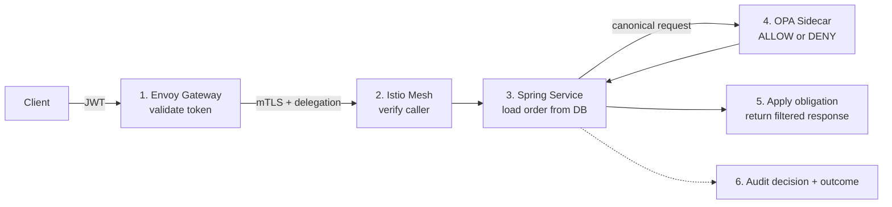
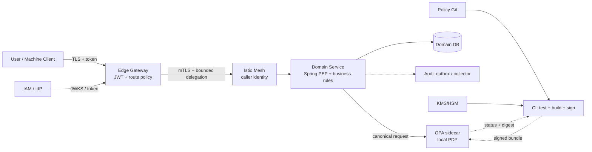
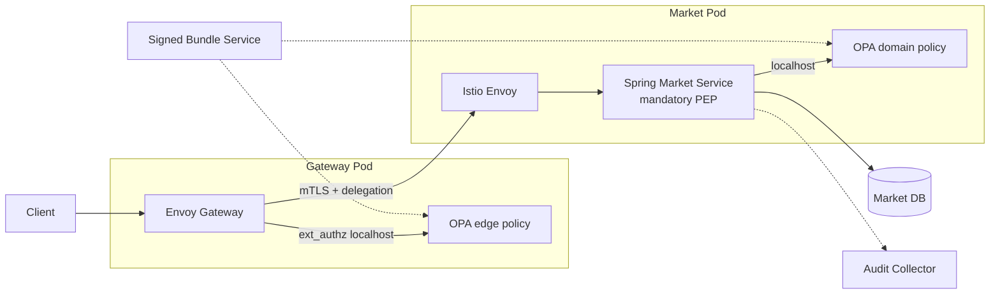
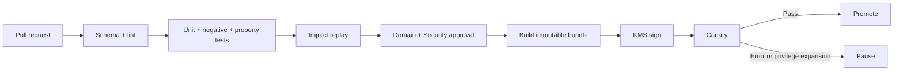
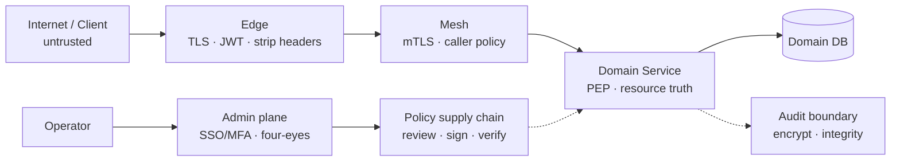
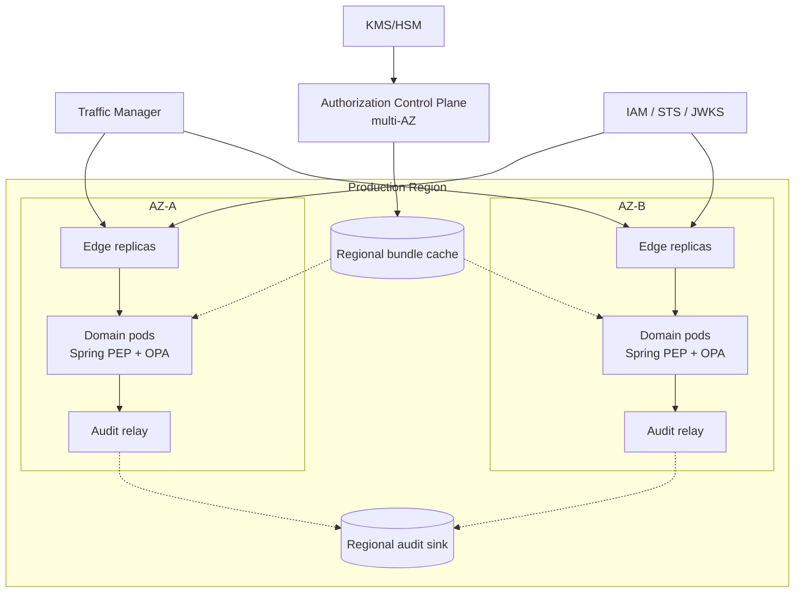
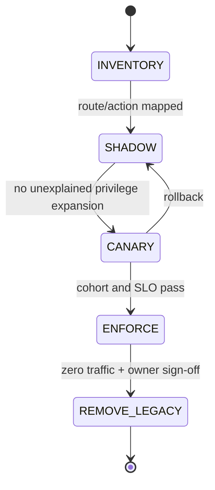

> **TÀI LIỆU NỘI BỘ** — TDD L2 phục vụ triển khai pilot và thẩm định kiến trúc. Các mục ghi `TBD` là decision gate, không phải việc dev tự đoán.

# TDD — Edge Gateway & Authorization Platform

| Trường | Nội dung |
| --- | --- |
| Trạng thái | **UNDER REVIEW** |
| Phiên bản | `v1.3` — 31/08/2026 — viết lại theo hướng implementation-first |
| Chủ sở hữu | Security Platform + Application Platform |
| Domain pilot | `market-api` hoặc `agent-api` |
| Người duyệt | Architecture Council, Security, IAM, SRE, Product/Business, Privacy/Legal và domain owner |
| Mục tiêu của tài liệu | Dev biết phải build gì; reviewer biết phải duyệt gì; SRE biết phải vận hành gì |

## Executive Summary

Hiện tại nhiều BFF đang tự đọc token, kiểm tra role, tenant và ghi audit. Một policy vì thế có nhiều bản sao, dễ lệch và khó chứng minh route nào thật sự được bảo vệ.

Thiết kế mới chia việc rõ ràng:

- **Edge Gateway** xác thực request từ bên ngoài.
- **Istio mesh** xác thực workload nào đang gọi workload nào.
- **Spring PEP trong domain service** đọc resource thật và tạo authorization request.
- **OPA sidecar** đánh giá policy ngay trong pod.
- **Domain service** giữ business invariant, transaction và response filtering.
- **Control plane** dùng Git, test, chữ ký và bundle để phát hành policy.

Pilot đầu tiên là một authenticated read-only action. Không bắt đầu bằng money movement, admin hoặc cross-tenant.

### Architecture Council cần duyệt

| ID | Quyết định | Kết quả đề nghị |
| --- | --- | --- |
| DR-01 | Boundary Edge → mesh → service PEP/PDP → domain | Duyệt làm kiến trúc L2 |
| DR-02 | Contract chung, policy-as-code, signed bundle và mandatory PEP coverage | Duyệt làm guardrail |
| DR-03 | Pilot bằng Istio/Envoy + Spring Security + OPA sidecar | Duyệt phạm vi PoC, chưa duyệt production product |
| DR-04 | Migration theo action: shadow → canary → enforce | Duyệt phương pháp rollout |

### Chưa được coi là quyết định production

- OPA chưa phải engine cuối cùng trước khi có benchmark.
- Security floor chỉ là candidate emergency-revocation mechanism cần PoC.
- Audit durability phải được Product/Business duyệt theo từng action.
- SLO, capacity, RTO/RPO, multi-region và chi phí còn cần số liệu thật.

---

# 0. Developer Start Here

Phần này là đường triển khai ngắn nhất. Dev có thể đọc riêng mục 0–4 để bắt đầu pilot. Các mục sau là security, vận hành và decision gate.

## 0.1 Pilot phải tạo ra kết quả gì?

Pilot dùng một endpoint dạng:

`GET /market/orders/{orderId}`

Canonical action:

`market.order.read`

Một request thành công phải chứng minh đủ:

1. JWT đúng issuer/audience và còn hạn.
2. Gateway workload được phép gọi Market Service.
3. Handler đã đăng ký action `market.order.read`.
4. Service tự đọc order và tenant từ database.
5. OPA quyết định dựa trên actor, caller, action và resource thật.
6. Service áp dụng field mask/row filter trước khi trả dữ liệu.
7. Decision và final response outcome có cùng `authorization_transaction_id`.

Nếu thiếu một bước, pilot chưa done.

## 0.2 Happy path trong một hình



Gateway không đọc Market DB. OPA không tự gọi Market DB. Market Service là nơi duy nhất lấy resource truth.

## 0.3 Stack pilot

| Layer | Chọn cho pilot | Dev dùng như thế nào |
| --- | --- | --- |
| Edge | Istio Gateway + Envoy | JWT, header hygiene, route normalization, rate limit |
| User AuthN | `RequestAuthentication` + `AuthorizationPolicy` | Pin issuer/JWKS/audience; private route bắt buộc có principal |
| Workload identity | `PeerAuthentication STRICT` | mTLS giữa Gateway và Market Service |
| Workload policy | Istio `AuthorizationPolicy` | Namespace default deny; allow đúng service account/port |
| Edge PEP | Envoy `ext_authz` | Coarse action check qua OPA-Envoy localhost |
| Service PEP | Spring Security `AuthorizationManager` + custom starter | Coverage check và resource-level authorization |
| PDP | OPA/Rego v1 sidecar | Local evaluation, signed bundle, decision log |
| Policy CI | OPA CLI + Git/CODEOWNERS + KMS | fmt, check, test, build, sign, publish |
| Mutation audit | Transactional Outbox | Business mutation và audit intent cùng DB transaction |
| Telemetry | OpenTelemetry + Micrometer/Prometheus | Trace, metric, policy revision, audit backlog |

`RequestAuthentication` chỉ validate credential nếu credential xuất hiện. Private route vẫn phải có `AuthorizationPolicy` yêu cầu authenticated principal.

## 0.4 Repo/module cần có

```text
authz-platform/
  authz-contract/
    AuthzRequest.java
    AuthzDecision.java
    Obligation.java
    authorization-request.schema.json
    authorization-decision.schema.json
  authz-spring-boot-starter/
    annotation/AuthzAction.java
    annotation/PublicAction.java
    context/VerifiedActorContextResolver.java
    context/VerifiedCallerContextResolver.java
    coverage/HandlerCoverageValidator.java
    service/AuthorizationService.java
    opa/OpaDecisionClient.java
    obligation/ObligationHandlerRegistry.java
    audit/EnforcementAuditPublisher.java
    health/PolicyReadinessHealthIndicator.java
  authz-kafka-spring/
    AuthzRecordInterceptor.java
    MessageProvenanceVerifier.java
  policies/
    vocabulary/
    platform/
    domains/market/
    domains/agent/
    domains/broker/
    tests/
  deploy/
    istio/
    opa/
    dashboards/
```

Application chỉ phụ thuộc `AuthorizationService` và contract. Không rải OPA URL, Rego path, JWT parsing hoặc role string trong controller.

## 0.5 Chia công việc thành các PR

| PR | Nội dung | File/output chính | Điều kiện merge |
| --- | --- | --- | --- |
| PR-01 | Vocabulary và contract v1 | JSON Schema, Java record, action `market.order.read` | Schema tests + Architecture/Security review |
| PR-02 | Policy bundle pilot | Rego, data, unit/negative tests, manifest | `opa check/test/build` pass |
| PR-03 | Spring starter | Annotation, context resolver, coverage validator, OPA client | Starter contract/integration tests |
| PR-04 | Tích hợp Market Service | Resource lookup, `AuthorizationService`, obligation mapping | IDOR/tenant/obligation tests |
| PR-05 | Istio baseline | STRICT mTLS, default deny, caller allow, JWT policy | Wrong-caller/plaintext tests |
| PR-06 | Audit/correlation | Transaction ID, decision/outcome schema, local relay | Sink outage/reconciliation tests |
| PR-07 | Shadow và dashboard | Legacy/new comparator, metrics, alerts | Đủ sample; không còn privilege expansion chưa giải thích |
| PR-08 | Canary enforce | Cohort config, rollback, runbook | Security + Domain + SRE sign-off |

Không gộp tất cả vào một PR. Mỗi PR phải tạo một artifact có thể review và rollback độc lập.

## 0.6 Command contract cho CI

Tên task có thể đổi theo build system, nhưng pipeline tối thiểu phải chạy tương đương:

```text
opa fmt --fail policies/
opa check --strict policies/
opa test policies/ -v
opa build -b policies/ -o bundle.tar.gz
./gradlew test
./gradlew integrationTest
./gradlew authzConformanceTest
```

Bundle chỉ được publish sau schema, negative/property tests, impact replay, approval và signature.

## 0.7 Definition of Done cho pilot

- Endpoint chỉ reachable qua managed Edge.
- Gateway strip mọi identity/delegation header do client gửi.
- mTLS `STRICT` và caller allowlist hoạt động.
- Handler thiếu `@AuthzAction` hoặc `@PublicAction` làm conformance/startup fail.
- Resource/tenant được đọc server-side.
- OPA bundle có signature, active digest và readiness.
- Unknown action/schema/obligation đều deny.
- Cross-tenant read không grant bị deny.
- Field masking test chạy E2E.
- Shadow report không có legacy `DENY` / new `ALLOW` chưa giải thích.
- Audit nối được Edge decision, domain decision và final outcome.
- Control-plane outage, PDP crash và audit outage chạy đúng failure mode.
- Dashboard, alert, runbook và owner tồn tại.

---

# 1. Luồng code của một request

## 1.1 Trước controller

1. Envoy validate JWT và xóa header không tin cậy.
2. Istio xác minh workload caller bằng mTLS.
3. Spring Security tạo `SecurityContext` từ identity đã verify.
4. `AuthzAuthorizationManager` đọc `@AuthzAction` và chạy coarse check.
5. `HandlerCoverageValidator` bảo đảm handler không thể tồn tại mà không khai báo action/public.

Ví dụ:

```java
@RestController
final class OrderController {
    private final ReadOrderService service;

    @GetMapping("/market/orders/{id}")
    @AuthzAction("market.order.read")
    OrderView get(@PathVariable OrderId id) {
        return service.read(id);
    }
}
```

Annotation chỉ xác định action và coverage. Nó chưa đủ dữ liệu để kiểm tra owner/tenant của order.

## 1.2 Trong application service

```java
@Service
final class ReadOrderService {
    private final OrderRepository orders;
    private final AuthorizationService authorization;
    private final ObligationApplier obligations;

    OrderView read(OrderId id) {
        Order order = orders.get(id);

        AuthzDecision decision = authorization.requireAllowed(
            AuthzRequestFactory.forResource(
                "market.order.read",
                order.toAuthorizationResource(),
                order.authorizationFacts()
            )
        );

        return obligations.apply(order.toView(), decision.obligations());
    }
}
```

Thứ tự bắt buộc:

1. Load resource bằng server-side identifier.
2. Build canonical input từ verified actor/caller và resource facts.
3. Gọi PDP.
4. Kiểm tra mọi obligation đều có handler.
5. Chỉ sau đó mới trả response hoặc tạo side effect.

Không đặt resource DB lookup trong servlet filter hoặc SpEL expression.

## 1.3 Mutation khác read ở đâu?

Với `broker.order.approve`, service phải lock/read order và authorize gần transaction:

```java
@Transactional
OrderView approve(OrderId id, ApproveOrderCommand command) {
    Order order = orders.getForUpdate(id);
    AuthzDecision decision = authorization.requireAllowed(
        AuthzRequestFactory.forResource(
            "broker.order.approve",
            order.toAuthorizationResource(),
            order.authorizationFacts()
        )
    );

    order.approve(command, decision.decisionId());
    auditOutbox.append(EnforcementOutcome.committed(order, decision));
    return obligations.apply(order.toView(), decision.obligations());
}
```

`order.approve(...)` vẫn kiểm tra state transition, version và limit. OPA không thay domain invariant.

## 1.4 Request/decision contract

Request tối thiểu:

```json
{
  "schema_version": "authz-request.v1",
  "transaction_id": "tx-7f31",
  "actor": {
    "issuer": "https://iam.example",
    "subject_id": "user-123",
    "active_tenant_id": "tenant-a",
    "assurance_level": "mfa",
    "entitlement_version": "e17"
  },
  "caller": {
    "workload_id": "spiffe://prod/gateway",
    "delegation_mode": "on_behalf_of",
    "audience": "market-api"
  },
  "action": "market.order.read",
  "resource": {
    "type": "market.order",
    "id": "ORD-42",
    "tenant_id": "tenant-a",
    "version": 42
  },
  "facts": {
    "state": {
      "value": "OPEN",
      "source": "market-db",
      "observed_at": "2026-08-31T10:00:00Z"
    }
  }
}
```

Decision tối thiểu:

```json
{
  "schema_version": "authz-decision.v1",
  "decision_id": "dec-a921",
  "decision": "ALLOW",
  "reason_code": "ALLOW_OPERATOR_SAME_TENANT",
  "policy_digest": "sha256:...",
  "revocation_digest": "sha256:...",
  "obligations": [
    {
      "type": "field_mask.v1",
      "parameters": {
        "paths": ["customer.tax_id"]
      }
    }
  ]
}
```

Không copy toàn bộ JWT, request body hoặc DB row vào policy input. Chỉ gửi field policy thực sự dùng, có type và source.

## 1.5 Rego pilot

```rego
package domains.market.order

import rego.v1

default decision := {
  "decision": "DENY",
  "reason_code": "DENY_DEFAULT",
  "obligations": []
}

decision := {
  "decision": "ALLOW",
  "reason_code": "ALLOW_OPERATOR_SAME_TENANT",
  "obligations": [{
    "type": "field_mask.v1",
    "parameters": {"paths": ["customer.tax_id"]}
  }]
} if {
  input.schema_version == "authz-request.v1"
  input.action == "market.order.read"
  input.actor.active_tenant_id == input.resource.tenant_id
  "market_operator" in input.actor.roles
  input.caller.workload_id in data.allowed_callers["market.order.read"]
}
```

Rego kiểm tra shared access rule. Business state transition vẫn nằm trong Java/domain transaction.

---

# 2. Kiến trúc và ranh giới trách nhiệm

## 2.1 Component diagram



Đường liền là request runtime. Đường chấm là policy/audit flow. Git, CI và registry không nằm trên hot path.

## 2.2 Ai làm gì?

| Thành phần | Làm | Không làm |
| --- | --- | --- |
| Edge | TLS/WAF, token validation, header/path hygiene, rate limit, route → action | Không đọc domain DB |
| Mesh | Workload identity, mTLS, caller/destination allowlist | Không quyết định quyền user trên resource |
| Spring PEP | Tạo input tin cậy, gọi PDP, enforce obligation/outcome | Không tin tenant/role do client tự gửi |
| OPA PDP | Evaluate deterministic trên input | Không tự gọi DB/network |
| Domain service | Resource truth, invariant, transaction, response | Không tự phát minh identity |
| Control plane | Review, test, sign, distribute, canary, inventory | Không xử lý từng request |
| Audit pipeline | Decision/outcome, retention, reconciliation | Remote SIEM không block mọi request |

## 2.3 Control plane và data plane

| Plane | Component | Khi lỗi |
| --- | --- | --- |
| Control plane | Git, CI, signer, registry, rollout controller | Không phát hành policy mới; runtime dùng safe LKG trong freshness budget |
| Data plane | Edge, mesh, PEP, local PDP, domain | Trực tiếp xử lý request; fail theo action policy |

## 2.4 Pattern được dùng

| Pattern | Áp dụng | Lý do |
| --- | --- | --- |
| PEP/PDP separation | Spring/Envoy enforce; OPA evaluate | Tách policy khỏi business code |
| Sidecar | OPA cùng pod | Local latency, không phụ thuộc central PDP hop |
| Anti-Corruption Layer | `AuthzRequestFactory` | Contract không phụ thuộc DTO/JWT tùy ý |
| Default-deny Registry | Annotation + startup/conformance scanner | Handler mới không silently public |
| Ports & Adapters | `AuthorizationService` + `OpaDecisionClient` | Có thể đổi engine adapter |
| Transactional Outbox | Mutation + audit intent | Không commit business mà mất audit intent |
| Strangler + Shadow | Migration từng action | So policy mới/cũ trước enforce |
| Last Known Good | Signed bundle đã verify | Control plane outage không dừng ngay |
| Bulkhead + Timeout | Fact provider/remote dependency | Không khuếch đại outage |
| Deny-overrides | Nhiều enforcement layer | Một allow không thắng deny khác |

## 2.5 Năm invariant kiến trúc

1. Unknown actor, caller, action, schema hoặc obligation → deny.
2. Actor và caller là hai principal khác nhau.
3. Resource/tenant/state security-relevant lấy từ authority server-side.
4. Domain invariant ở gần transaction, không chuyển sang Gateway.
5. Cache, LKG hoặc rollback không được khôi phục quyền đã emergency revoke.

---

# 3. Istio và runtime configuration

## 3.1 Namespace baseline

```yaml
apiVersion: security.istio.io/v1
kind: PeerAuthentication
metadata:
  name: default-strict
  namespace: pilot
spec:
  mtls:
    mode: STRICT
---
apiVersion: security.istio.io/v1
kind: AuthorizationPolicy
metadata:
  name: default-deny
  namespace: pilot
spec: {}
```

Sau default deny, thêm policy explicit:

- allow health probe từ principal/path đã duyệt;
- allow Gateway service account gọi Market Service đúng port;
- `CUSTOM` policy gọi OPA-Envoy cho route cần coarse authorization.

Gateway phải thống nhất path normalization với Spring router để policy và application không hiểu hai path khác nhau.

## 3.2 Pod topology



## 3.3 Readiness

Pod chỉ ready khi:

- PEP/PDP contract version tương thích;
- có policy bundle đã verify;
- approved revocation state chưa stale quá budget;
- obligation handlers bắt buộc đã đăng ký;
- local audit precondition đáp ứng action mode.

Liveness không phụ thuộc remote registry hoặc SIEM để tránh restart storm.

---

# 4. Test plan cho dev

## 4.1 Unit và contract

- JSON Schema accept/reject đúng version.
- `AuthzRequestFactory` không cho client override resource tenant.
- Unknown action/resource/obligation deny.
- Rego positive, negative, cross-tenant và stale fact cases.
- Obligation merge deterministic.
- Decision-cache key chứa mọi input/security version.

## 4.2 Integration

- Token đúng signature nhưng sai issuer/audience bị từ chối.
- Client tự gửi identity/delegation header bị strip.
- Actor đúng nhưng caller sai bị deny.
- Handler thiếu annotation fail conformance.
- OPA timeout trả controlled `503`, không bypass.
- Bundle sai signature không activate.
- Resource đổi giữa authorize và commit không tạo side effect.
- Field mask được áp dụng trước serialization.

## 4.3 End-to-end/chaos

- Cross-tenant request không grant bị deny.
- Legacy `DENY` / new `ALLOW` chặn canary.
- Control plane/registry outage dùng safe LKG.
- Emergency revoke bypass mọi positive cache.
- Audit sink/full queue/noisy tenant chạy đúng action mode.
- 2× peak và mất một AZ không vượt action SLO.

## 4.4 Evidence dev phải đính kèm

- Test report và coverage report.
- Policy bundle digest/signature/provenance.
- Route/handler/consumer inventory diff.
- Shadow mismatch report.
- Dashboard screenshot/query và alert test.
- Runbook link.
- Action-level approval nếu chuyển `ENFORCE`.

---

# 5. Architecture decisions

## 5.1 Decision Requests

| ID | Cần quyết định | Nếu chưa có |
| --- | --- | --- |
| DR-01 | Edge mỏng; domain giữ resource truth/invariant | Không split BFF responsibility |
| DR-02 | Contract + mandatory PEP coverage | Không enforce pilot |
| DR-03 | PoC engine/topology | Không coi OPA là production baseline |
| DR-04 | Shadow/canary migration | Không cutover route |

## 5.2 ADR Log

| ID | Quyết định | Lý do | Trạng thái |
| --- | --- | --- | --- |
| ADR-001 | Edge không chứa business invariant/domain DB lookup | Tránh Gateway monolith | Đề xuất |
| ADR-002 | Platform guardrail + domain authorization | Shared rule thống nhất; business truth đúng chỗ | Đề xuất |
| ADR-003 | Local/distributed PDP cho hot path | Giảm hop/SPOF | Đề xuất |
| ADR-004 | Signed immutable policy bundle | Provenance và rollback | Đề xuất |
| ADR-005 | Istio mTLS + default-deny caller policy | User token không chứng minh workload | Đề xuất |
| ADR-006 | Versioned Actor/Caller/Action/Resource/Context contract | Các team dùng cùng semantic | Đề xuất |
| ADR-007 | Delegation bound vào audience/caller | Giảm replay/confused deputy | Có điều kiện: IAM profile |
| ADR-008 | Audit mechanism/failure mode theo action | Cân bằng compliance và availability | Có điều kiện: business approval |
| ADR-009 | Candidate security floor tách base bundle | Có thể chặn rollback/cache khôi phục quyền | **Cần PoC; chưa duyệt production** |
| ADR-010 | Cross-tenant cần explicit grant | Không dùng admin role bypass tenant | Có điều kiện: grant authority |

ADR có điều kiện phải có decision record riêng, owner, alternatives, evidence và ngày duyệt. Không lặp ADR table ở appendix.

## 5.3 Open Decisions

| ID | Câu hỏi cần trả lời | Owner | Chặn |
| --- | --- | --- | --- |
| OI-01 | IAM có hỗ trợ token exchange/sender binding không? | IAM + Security | S2S pilot |
| OI-02 | Gateway product chuẩn là gì? | Application Platform | Implementation baseline |
| OI-03 | OPA sidecar, node-local hay engine khác? | Authorization + SRE | Production selection |
| OI-04 | Ai phát hành cross-tenant grant? | Security + Domains | Cross-tenant action |
| OI-05 | Emergency revocation dùng cơ chế nào? | IAM + Security + SRE | High-risk action |
| OI-06 | Audit mode/quota/window từng action? | Product + Security/Legal + SRE | Enforce |
| OI-07 | Peak RPS, audit EPS, SLO và RTO/RPO? | Product + SRE | Capacity/OAT |
| OI-08 | Multi-region trust/promotion/residency? | Platform + Security | Multi-region |

---

# 6. Identity, tenant và delegation

## 6.1 Actor khác caller

Trong request Lan duyệt order:

- **Actor:** Lan — người chịu trách nhiệm cho hành động.
- **Caller:** `gateway-service` — workload trực tiếp gọi Broker Service.

Policy phải kiểm tra cả hai. Actor đúng nhưng caller không được phép vẫn phải deny.

## 6.2 Identity rules

- Pin issuer, audience, token class và signature algorithm.
- Unknown key hoặc wrong audience → deny.
- Không log/forward raw bearer token nếu callee không phải audience.
- Edge xóa mọi identity/delegation header do Internet gửi.
- Callee không tin workload ID do caller tự khai.
- Mesh certificate ngắn hạn; workload policy dùng service account/SPIFFE-compatible principal.

## 6.3 Service-to-service delegation

```mermaid
sequenceDiagram
    autonumber
    participant A as Service A
    participant STS as IAM / STS
    participant M as Istio Mesh
    participant B as Service B + PEP
    participant P as PDP B

    A->>STS: Exchange actor token for audience B
    STS->>STS: Authenticate A; bind caller, scope, audience, TTL
    STS-->>A: Sender-bound delegated token
    A->>M: mTLS call + delegated token
    M->>B: Verified workload A
    B->>B: Validate audience, mode, expiry and caller binding
    B->>P: Actor + caller + action + resource
    P-->>B: Decision + obligations
```

Không thay flow này bằng `x-user-id` và `x-roles` unsigned.

| Mode | Khi dùng | Rule |
| --- | --- | --- |
| `on_behalf_of` | Service làm thay user | Actor và caller đều phải được phép |
| `system` | Scheduler/controller làm nhiệm vụ hệ thống | Dùng service/job principal; không gắn user giả |
| `approved_deferred_grant` | Command trì hoãn giữ approval qua thời gian | Grant action/resource-bound, có expiry/revoke |

## 6.4 Tenant isolation

Mặc định:

`actor.active_tenant_id == resource.tenant_id`

`resource.tenant_id` phải lấy từ domain DB hoặc authority server-side.

Cross-tenant cần explicit grant:

```text
grant_id
issuer / authority
actor and caller constraints
allowed action
resource type / IDs / tenant scope
issued_at / expires_at
ticket / reason
revocation version
```

Không dùng role `admin` chung để bỏ qua tenant.

## 6.5 Async event và command

- Event đã commit là một sự thật lịch sử. Consumer xác minh producer/schema/replay, nhưng không “hủy” event vì user sau đó mất role.
- Deferred command có side effect tương lai. Consumer phải authorize lại hoặc kiểm tra approved deferred grant.
- Consumer side effect phải idempotent và commit cùng inbox/outbox.

---

# 7. Policy lifecycle, cache và revocation

## 7.1 Policy từ Git tới PDP



High-risk policy tách author, approver và signer/promoter. Production artifact phải có digest, signature, provenance và active inventory.

## 7.2 Policy repository

```text
policies/
  vocabulary/
    actions.yaml
    resources.yaml
    authorization-request.schema.json
    authorization-decision.schema.json
    obligations.schema.json
  platform/
    tenant-isolation/
    workload-baseline/
    emergency-revocation/
  domains/
    market/
    agent/
    broker/
  tests/
    negative/
    property/
    regression/
  manifests/
    bundle-manifest.schema.json
```

## 7.3 Cache rules

| Cache | Key/authority | Rule |
| --- | --- | --- |
| JWKS/trust | Issuer, key ID, trust domain | Refresh trước hạn; unknown key deny |
| Base policy bundle | Immutable digest | Atomic activation; LKG có max age |
| Attribute/entitlement | Subject/resource + source version | TTL theo authority/action |
| Decision | Full canonical input fingerprint + policy/revocation digest | Chỉ cache deterministic result |

High-risk mutation mặc định không cache `ALLOW`.

Decision-cache key tối thiểu chứa:

- actor issuer/subject/tenant/entitlement version/assurance/credential expiry;
- caller workload/delegation ID/audience;
- action;
- resource type/ID/tenant/version;
- mọi fact value và source version ảnh hưởng policy;
- base policy digest;
- approved revocation generation/digest.

Không chứng minh được fingerprint đầy đủ → không dùng decision cache.

## 7.4 Emergency revocation requirement

Requirement bắt buộc:

> Khi authority thu hồi user, grant, key hoặc policy, quyền cũ phải bị chặn trong objective đã duyệt và không được positive cache, LKG hoặc rollback khôi phục.

Có thể đạt bằng:

- token introspection/revocation;
- entitlement-version invalidation;
- emergency base-bundle rollout;
- deny-only security floor.

TDD chưa chọn cơ chế cuối.

## 7.5 Candidate security floor — cần PoC

Security floor chưa được phê duyệt thành production subsystem. Bảng này chỉ định nghĩa candidate đủ cụ thể để PoC.

| Câu hỏi | Candidate baseline | Cổng phê duyệt |
| --- | --- | --- |
| Ai phát hành? | Một logical Revocation Authority theo environment/trust domain; nhận request từ IAM, grant authority hoặc SecOps; ký bằng KMS/HSM | Four-eyes, immutable admin audit, key recovery |
| Global hay theo tenant/action/resource? | Generation global để ordering đơn giản; từng deny entry có scope global, tenant, actor, caller, grant/key, action, resource type hoặc resource ID | Cardinality, PII, expiry và tenant isolation test |
| Merge với base bundle? | Verify floor; match deny trước positive cache/base policy; deny luôn thắng | Property test chứng minh không mở quyền hoặc bị rollback |
| Multi-region partition? | Một logical writer dùng linearizable durable log; region khác chỉ đọc, không tự tạo generation | Partition test, no split-brain, issuance RTO |
| Floor mới, base chưa tương thích? | Floor có deny-only schema độc lập; áp dụng phần hiểu được; affected action không tương thích trả `INDETERMINATE_REVOCATION_INCOMPATIBLE` và deny/not-ready | N/N-1, out-of-order và recovery test |

```mermaid
sequenceDiagram
    autonumber
    participant I as IAM / Grant / SecOps
    participant R as Revocation Authority
    participant L as Linearizable Log
    participant G as Signed Registry
    participant P as PDP Fleet
    participant S as SRE

    I->>R: Revoke request + scope + TTL + ticket
    R->>R: Validate authority + four-eyes
    R->>L: Commit generation N+1
    R->>G: Sign deny-only artifact N+1
    G-->>P: Distribute N+1
    P->>P: Verify + activate before positive cache
    alt Compatible
        P-->>R: Active N+1
    else Incompatible or stale
        P-->>S: Alert; affected action deny/not-ready
    end
```

PoC đo từ lúc authority commit revoke tới khi 100% healthy PEP đã chặn. Chỉ đo thời gian download bundle là không đủ.

Nếu PoC không chứng minh issuance availability, monotonicity, convergence, compatibility và recovery, ADR-009 phải bị loại bỏ hoặc thu hẹp.

---

# 8. Failure behavior và audit

## 8.1 Failure rules

- Unknown input, policy, context hoặc obligation → deny.
- Lỗi platform nội bộ thường trả controlled `503`, không giả thành business `403`.
- Mutation không retry mù.
- Control-plane outage dùng LKG trong approved freshness budget.
- Fail-open chỉ dành cho public/read-only low-risk action đã đăng ký, có owner và expiry.

## 8.2 Failure matrix

| Sự cố | Request behavior | Operational response |
| --- | --- | --- |
| IAM/JWKS stale hoặc unknown key | Không xác thực → dừng | Refresh/alert IAM |
| Bundle mới corrupt/incompatible | Không activate; giữ safe digest | Pause rollout |
| PDP local crash/timeout | Dừng; trả `503` | Fail readiness/restart |
| Fact provider unavailable | Cache còn hạn nếu action cho phép; hết hạn dừng | Circuit breaker/alert |
| Resource version đổi | Không commit | Conflict + `NOT_EXECUTED` audit |
| Unknown obligation | Không response/side effect | Alert capability mismatch |
| Audit storage đầy/corrupt | Theo action mode | High-water alert, isolate quota, incident |
| Approved revocation state stale | Critical/high deny hoặc not-ready | Page convergence breach |
| Signing key compromised | Freeze promotion; revoke trust/key; activate approved emergency control | Security incident |

## 8.3 Audit durability theo từng action

Không có platform-wide rule “critical luôn fail-close khi audit lỗi”. Durable audit bảo vệ compliance nhưng cũng có thể biến storage thành nguyên nhân outage hoặc availability attack.

| Mode | Semantics | Khi local audit không durable/full/corrupt | Approval |
| --- | --- | --- | --- |
| `REQUIRED_DURABLE` | Không có side effect visible nếu audit intent chưa durable | Không thực thi; `503` và incident | Business + Security/Legal + SRE |
| `DEGRADED_BOUNDED` | Được tiếp tục trong window/quota đã định lượng | Hết window/quota dùng failure action đã ký | Business risk acceptance + Security/Legal + SRE |
| `BEST_EFFORT` | Audit không là precondition | Tiếp tục + alert/reconcile | Chỉ public/low-risk; owner + Security |

### Action-level Audit Durability Matrix

Các row dưới là draft, không phải business approval:

| Action | Owner | Mode đề xuất | Degraded window | Reserved quota | Khi hết window/quota | Trạng thái |
| --- | --- | --- | --- | --- | --- | --- |
| `broker.order.approve` | TBD | `REQUIRED_DURABLE` | `0` | Peak EPS × event size × outage objective | `503`, không commit | Chờ Business + Security/Legal + SRE |
| `market.order.read` | TBD | `DEGRADED_BOUNDED` | TBD phút | Per-tenant + platform reserve | Stop/restricted fallback — TBD | Chờ phê duyệt |
| Public catalog/health | Owner | `BEST_EFFORT` nếu data class cho phép | N/A | Bounded queue | Continue + alert | Chờ registry |

Mỗi production action phải có một row. Thiếu row hoặc chữ ký → không chuyển `ENFORCE`.

Matrix phải ghi thêm:

- data classification;
- expected/peak EPS;
- maximum event size;
- spool retention/outage objective;
- drain rate;
- alert thresholds;
- incident owner.

Degraded window dùng persistent/monotonic time và không reset khi pod restart.

## 8.4 Transactional Outbox

Với mutation trong domain DB:

1. Update business row.
2. Insert `audit_outbox`.
3. Commit cùng transaction.
4. Relay gửi outbox sang collector.
5. Collector acknowledge; relay đánh dấu sent.

Không có business state visible nếu insert outbox thất bại.

Với external side effect như payment:

1. Commit durable command + audit intent trước.
2. Dispatcher idempotent gọi provider.
3. Lưu provider outcome và retry có kiểm soát.

Không gọi external provider rồi mới cố ghi audit.

## 8.5 Quota isolation

- Tách logical queue/quota ít nhất theo domain và tenant.
- Critical action có reserved capacity riêng.
- Có per-tenant/per-caller rate và maximum event size.
- Tenant vượt quota bị throttle/quarantine, không dùng reserve tenant khác.
- High-water mark tạo backpressure trước khi full.
- Global corruption áp dụng action matrix, không silently drop/fail-open.
- Reconciliation so request/enforcement counter với collector checkpoint.

Sizing:

`required bytes = peak EPS × max event bytes × outage seconds × safety factor`

Số cụ thể phải nằm trong capacity report và Action-level Audit Durability Matrix.

## 8.6 Decision audit fields

Lưu tối thiểu:

- authorization transaction ID và decision ID;
- actor/caller dạng tokenized identifier;
- action/resource type và approved resource token/hash;
- tenant token;
- decision/reason code;
- policy/revocation digest;
- fact source/version/freshness;
- obligations returned/applied;
- final `COMMITTED`, `NOT_EXECUTED`, `FILTERED` hoặc `ERROR` outcome.

Không lưu raw token, secret, full request body hoặc sensitive explain trace.

---

# 9. Security controls

## 9.1 Trust boundaries



## 9.2 Threat-to-test matrix

| Threat | Control | Test/evidence |
| --- | --- | --- |
| Forged identity/delegation header | Edge strip + signed/caller-bound artifact | Negative E2E từ Internet/workload |
| Bearer replay/confused deputy | Exact audience, TTL, sender binding | Replay và wrong-caller |
| PEP bypass | Network default deny + route/handler/consumer registry | 100% inventory/coverage |
| Cross-tenant IDOR | Resource tenant từ DB + explicit grant | Negative/property tests |
| Stale/revoked permission | Freshness, invalidation, cache bypass | End-to-end revoke drill |
| Policy tampering | Protected Git, review, KMS signing, digest verify | Corrupt/sai-key bundle |
| Policy-engine DoS | Input/rule/bundle limits, deadline, concurrency | Fuzz/load/large input |
| Audit leakage/loss | Minimize, encrypt, access, outbox/reconcile | Privacy + outage/full-spool |
| Audit availability attack | Per-tenant quota/reserve/admission | Noisy-tenant test |
| Obligation omitted | Typed registry; unknown → deny | Field/row leak E2E |
| Break-glass abuse | MFA, four-eyes, scope, TTL, alert, retrospective | Quarterly exercise |

## 9.3 Key và secret

| Asset | Authority | Rule |
| --- | --- | --- |
| IAM signing key/JWKS | IAM/HSM | Rotation overlap, compromise revoke, issuer pin |
| Policy/revocation signing key | Security Platform KMS/HSM | Tách env/purpose; key ID; recovery drill |
| Mesh CA/workload key | Mesh CA/SDS | Short-lived; không export vào app |
| STS credential | Workload identity/secret manager | Per workload/audience; rotate/revoke |
| Audit encryption key | Audit KMS | Access riêng; rotation không phá retention read |

Break-glass không sửa policy thường trực. Nó là grant riêng có MFA, ticket, action/resource scope, TTL, alert tức thời và retrospective.

---

# 10. Deployment, SLO và capacity

## 10.1 Production topology đề xuất



Multi-region chưa được duyệt. Trước khi bật phải chốt trust federation, issuer/key distribution, revocation ordering, audit residency và promotion authority.

## 10.2 Target để PoC xác nhận

| ID | Chỉ số | Target đề xuất |
| --- | --- | --- |
| NFR-01 | End-to-end availability | Theo action; Product/SRE chốt trước OAT |
| NFR-02 | Edge availability | ≥ 99.99%/tháng cho critical path |
| NFR-03 | Local policy evaluation | P95 ≤ 5 ms; P99 ≤ 10 ms khi policy/fact ở memory |
| NFR-04 | Edge overhead | P95 ≤ 15 ms |
| NFR-05 | Standard policy propagation | P95 ≤ 2 phút |
| NFR-06 | Emergency revocation | 100% healthy PEP ≤ 30 giây; cần PoC/business review |
| NFR-07 | Audit delivery | ≥ 99.99% trong 5 phút; durability/loss theo action |
| NFR-08 | Capacity | 2× approved peak và mất một AZ vẫn giữ action SLO |
| NFR-09 | Compatibility | Contract/bundle/runtime rolling upgrade N/N-1 |

End-to-end action latency gồm Edge, mesh, DB/fact lookup, PDP, invariant, obligation và audit precondition nếu action yêu cầu.

## 10.3 Workload model

Benchmark phải dùng policy/input thật và báo:

- average/peak RPS theo action;
- concurrency/burst;
- policy count, rule count và bundle size;
- input/fact size;
- audit EPS và maximum event size;
- cache hit/miss;
- shadow dual-evaluation overhead;
- cold start và bundle activation;
- CPU/memory/cost mỗi triệu evaluation;
- one-AZ loss.

Không benchmark bằng một Rego rule demo rồi suy ra production.

## 10.4 Availability

- Edge, control plane, remote dependency và collector critical chạy multi-AZ.
- Không có leader hoặc remote registry trên request hot path.
- Control-plane outage không dừng data plane nếu LKG và approved revocation state còn hợp lệ.
- Policy Git/registry/status metadata có backup.
- Signing key có recovery/revoke runbook, không export private key.
- Diễn tập lost AZ, expired JWKS, corrupt bundle, stale revocation, compromised signer và audit backlog.

---

# 11. Migration từ BFF hiện tại

## 11.1 Migrate từng action



## 11.2 First slice

Chọn endpoint:

- read-only;
- authenticated;
- single-active-tenant;
- resource authority rõ;
- traffic vừa;
- không có remote relationship graph;
- thuộc `market-api` hoặc `agent-api`.

Không chọn `core-broker-api`, money movement hoặc privileged/admin action.

Pilot phải đi trọn:

`Edge → mTLS → delegation → domain PEP → local PDP → obligation → final outcome → approved audit mode`

## 11.3 Shadow comparison

| Legacy | New | Gate |
| --- | --- | --- |
| ALLOW | ALLOW | Match |
| DENY | DENY | Match |
| ALLOW | DENY | Review security fix hay regression |
| DENY | ALLOW | Privilege expansion; mặc định chặn rollout |

Không dùng tỷ lệ parity tổng để che một case mở quyền nghiêm trọng.

## 11.4 BFF decommission

- BFF thuần proxy có thể xóa sau khi route đi qua Edge và domain PEP.
- BFF có aggregation/orchestration/channel transformation có thể giữ như Experience API.
- BFF còn lại không là authority duy nhất cho resource-level authorization.
- Trước xóa: zero traffic window, revoke credential/service account/network/secret và archive mapping/runbook.

---

# 12. Observability và vận hành

## 12.1 Correlation

Edge tạo hoặc ghi đè `authorization_transaction_id` tại trusted boundary.

Một business request có thể có:

- Edge `decision_id`;
- mesh authorization outcome;
- domain `decision_id`;
- business invariant outcome;
- obligations applied;
- final enforcement outcome.

Trace ID dùng để quan sát, không dùng làm bằng chứng identity.

## 12.2 Metrics

| Nhóm | Metrics |
| --- | --- |
| Edge/AuthN | Request/latency/error; wrong issuer/audience/key; route miss |
| Authorization | Allow/deny/indeterminate/unavailable; action class; policy digest |
| PDP | Evaluation P50/P95/P99; timeout; concurrency; bundle age |
| Freshness/cache | Revocation/attribute age; cache hit/miss; invalidation lag |
| Mesh | mTLS coverage; plaintext attempt; denied caller; cert expiry |
| Migration | Legacy/new four-way comparison; cohort/sample |
| Audit | Outbox depth/bytes/oldest age; enqueue error; ack lag; reconcile gap |
| Obligation | Returned/applied/unsupported/failed |
| Business | Committed/not-executed/filtered outcome |

Không dùng raw actor/resource ID làm metric label.

## 12.3 Alerts

- Emergency-revocation convergence breach.
- Legacy `DENY` / new `ALLOW`.
- Cross-tenant allow không có grant.
- Route/handler coverage drift.
- Desired bundle khác active bundle.
- PDP SLO burn.
- Audit high-water/full/reconciliation gap.
- Break-glass activation.
- Plaintext/unknown workload principal.

Mỗi critical alert cần owner, threshold, synthetic test và runbook.

## 12.4 Runbooks

- IAM/JWKS outage và user/client revoke.
- Bundle compile/sign/publish failure, corrupt bundle, fleet drift.
- PDP crash/latency/cold start.
- Fact provider outage/cache storm.
- Audit outbox/queue full, corrupt, noisy tenant và reconciliation.
- Compromised bundle/STS/mesh signing key.
- mTLS/trust-domain failure.
- Rollback không khôi phục revoked access.
- Lost AZ/region và restore.
- Break-glass activate/revoke/retrospective.

## 12.5 RACI

| Năng lực | Accountable | Responsible | Consulted |
| --- | --- | --- | --- |
| IAM/delegation | Identity/Security | IAM | Platform, domains |
| Edge | Application Platform | Gateway/SRE | Security, domains |
| Mesh | Platform/SRE | Mesh team | Security |
| PEP/PDP/control plane | Security Platform | Authorization team | SRE, domains |
| Domain policy/facts/invariant | Domain owner | Domain team | Security Platform |
| Audit mode theo action | Product/Business Owner | Domain + SRE | Security, Legal/Privacy, SecOps |
| Audit sink/privacy | SecOps/Privacy | Data Platform/SecOps | Product, Legal, SRE |
| SLO/on-call | Platform + owning domain | SRE/service team | Security |

---

# 13. Risks, cost và organization

## 13.1 Architecture risks

| ID | Risk | Mức | Điều kiện đóng |
| --- | --- | --- | --- |
| AR-001 | IAM/delegation chưa chốt; có thể replay/confused deputy | Nghiêm trọng | Delegation Profile + wrong-caller/replay E2E |
| AR-002 | Route/handler/consumer bỏ qua PEP | Nghiêm trọng | Default-deny registry + 100% coverage |
| AR-003 | Cache/LKG/rollback làm revive quyền | Nghiêm trọng | Revocation ADR + end-to-end drill |
| AR-004 | Compromised signer có blast radius đa domain | Nghiêm trọng | KMS/SoD/provenance/recovery exercise |
| AR-005 | Audit fail-close gây outage hoặc availability attack | Nghiêm trọng | Action matrix + quota/noisy-tenant tests |
| AR-006 | Cross-tenant grant chưa có authority/model | Cao | Grant contract + property tests |
| AR-007 | Obligation không được thi hành | Cao | Typed registry + applied-outcome/leak test |
| AR-008 | Engine/topology chưa benchmark | Cao | PoC report + Council ADR |
| AR-009 | Workload/capacity chưa có số liệu | Cao | Approved model + 2×/N-1 load test |
| AR-010 | Adoption phức tạp khiến team bypass/fork | Trung bình | Starter, template, conformance, training |

## 13.2 Chi phí

- Envoy/OPA sidecar CPU và memory.
- Shadow dual evaluation.
- KMS, bundle registry và control plane.
- Audit ingest/storage/retention.
- Multi-AZ và có thể multi-region.
- Domain effort để map vocabulary, facts và tích hợp starter.

PoC báo cost trên một triệu evaluation và cost ở peak/N-1. Chưa có số tiền production được phê duyệt.

## 13.3 Tác động tổ chức

- Authorization Platform cần technical/product owner và on-call.
- IAM sở hữu token/delegation profile.
- Platform/SRE sở hữu Gateway/Mesh runtime.
- Domain sở hữu vocabulary, resource facts, invariant và response.
- Product/Business sở hữu availability trade-off của audit mode.
- Security/Privacy sở hữu guardrail và audit data policy.

Roadmap 2–4 quý chỉ là estimate định hướng, phụ thuộc route inventory, IAM readiness và shadow remediation.

---

# 14. Production checklist

Một action chỉ được chuyển sang `ENFORCE` khi:

- có owner, action/resource schema, risk class và data classification;
- issuer/audience/token/delegation mode đã chốt;
- route, handler, consumer/job và response path có coverage evidence;
- resource/tenant/fact authority, freshness và TOCTOU rule đã chốt;
- policy có positive, negative, cross-tenant, stale và property tests;
- mọi obligation có handler và leak test;
- shadow đủ business cycle; không còn privilege expansion chưa giải thích;
- load/chaos/revoke/rollback đạt action objective;
- audit mode, degraded window, quota và failure action đã ký;
- dashboard, alert, runbook và on-call tồn tại;
- Security, Domain Owner, SRE và Product/Business ký; Privacy ký nếu cần.

## Kết luận

Dev triển khai theo chuỗi:

`contract → policy → Spring starter → domain integration → Istio → audit → shadow → canary`

Edge bảo vệ cửa ngoài. Mesh xác thực ứng dụng. Spring PEP lấy resource thật. OPA đánh giá policy. Domain giữ transaction và business invariant. Audit ghi cả quyết định lẫn kết quả cuối.

Tài liệu đủ để duyệt hướng L2 và bắt đầu pilot. Nó chưa đủ cho production approval đến khi đóng delegation, PEP coverage, emergency revocation, audit action matrix, capacity và operational ownership.

---

# Appendix

## A. L3 deliverables

| Deliverable | Owner | Cổng |
| --- | --- | --- |
| IAM & Delegation Profile v1 | IAM + Security | S2S PoC |
| Authorization Contract/Schema v1 | Authorization Team | PEP/PDP integration |
| Action/Resource Vocabulary v1 | Domain + API Governance | Policy pilot |
| Policy/Test/Signing Standard | Security Platform | Bundle publish |
| Engine/Topology Benchmark | Authorization + SRE | Production selection |
| PEP Coverage Specification | Authorization + Domain | Enforce |
| Emergency Revocation PoC/ADR | IAM + Security + SRE | High-risk action |
| Mesh Traffic Inventory | Mesh + SRE | mTLS `STRICT` |
| Audit Contract + Action Matrix | Product + SecOps + Legal + SRE | Enforce |
| Capacity/Resilience Matrix | SRE | OAT |
| BFF Migration Matrix | Platform + Domains | Cutover |
| Dashboard/Runbook/On-call pack | Owning teams | Production |

## B. Alternatives considered

| Phương án | Lý do không chọn làm target |
| --- | --- |
| Gateway làm toàn bộ AuthZ | Cần domain DB, thành monolith, blast radius lớn |
| Remote central PDP cho mọi request | Network dependency/bottleneck/failure amplification |
| Chỉ Istio AuthorizationPolicy | Không đủ resource ownership/state/response filtering |
| Chỉ library trong service | Policy/version drift và khó governance đa ngôn ngữ |
| Một BFF cho mỗi domain/channel | Tiếp tục copy security logic; chỉ giữ BFF có composition value |
| Managed authorization SaaS | Cần PoC residency/latency/cost/lock-in/availability |

## C. Glossary

| Thuật ngữ | Nghĩa |
| --- | --- |
| Actor | User/service/job chịu ngữ nghĩa của action |
| Caller | Workload trực tiếp gọi hop hiện tại |
| PEP | Điểm tạo input đáng tin cậy và thi hành decision |
| PDP | Thành phần đánh giá policy |
| Control plane | Viết, test, ký, phát hành và quan sát policy |
| Data plane | Thành phần xử lý request runtime |
| Delegation | Caller hành động thay actor với audience/scope/TTL rõ |
| LKG | Last-known-good policy bundle đã verify |
| Obligation | Việc bắt buộc đi kèm `ALLOW` |
| Explicit grant | Artifact cho cross-tenant/deferred action có scope/expiry |
| Candidate security floor | Deny-only revocation artifact cần PoC; chưa là production invariant |

## D. References

- [NIST SP 800-207 — Zero Trust Architecture](https://csrc.nist.gov/pubs/sp/800/207/final)
- [OAuth 2.0 Token Exchange — RFC 8693](https://www.rfc-editor.org/rfc/rfc8693.html)
- [OAuth 2.0 Security Best Current Practice — RFC 9700](https://www.rfc-editor.org/rfc/rfc9700.html)
- [Istio Authorization Policy](https://istio.io/latest/docs/reference/config/security/authorization-policy/)
- [Istio External Authorization](https://istio.io/latest/docs/tasks/security/authorization/authz-custom/)
- [OPA–Envoy integration](https://www.openpolicyagent.org/docs/envoy)
- [OPA Bundles](https://www.openpolicyagent.org/docs/management-bundles)
- [Spring Security Authorization Architecture](https://docs.spring.io/spring-security/reference/servlet/authorization/architecture.html)
- Razi Rais, Christina Morillo, Evan Gilman, Doug Barth — *Zero Trust Networks, 2nd Edition*, O’Reilly, 2024.
